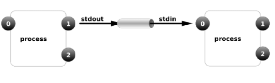

# Linux用户管理


# 学习目标

1、了解用户和用户组的概念

2、可以添加useradd和删除userdel用户,修改用户密码passwd

3、可以添加groupadd和删除groupdel用户组

4、了解管道符|的作用

5、会使用ifconfig查看IP地址

6、了解网卡配置文件的位置和常见配置项

7、知道常用的SSH客户端连接工具

8、会使用mobaxterm连接到linux


# 一、用户与用户组的概念

## 1、为什么要做用户与用户组管理

用户和用户组管理，就是添加用户和用户组，针对每个用户设置不同的密码。

问题：大家平时的笔记本电脑，会设置多个账户吗？为什么？


服务器要添加多账户的作用

​        针对不同用户分配==不同的权限==，不同权限可以限制用户==可以访问到的系统资源==
​        提高系统的安全性
​        帮助系统管理员对使用系统的用户进行跟踪


## 2、Linux的用户及用户组

###  ①Linux的多用户多任务       

​        Linux 系统是一个**多用户多任务**的操作系统，所谓多用户多任务，是指支持多个用户在同一时间内登陆，不同用户可以执行不同的任务，并且互不影响。

​        例如：

​        小明所在的运维团队一共有四个人，分别有大毛，二毛，三毛，大毛负责网站，他的账户叫wangzhan， 二毛负责数据库，他的账户叫shujuku。

​        在同一时间，大毛和二毛都可以登录这台服务器，大毛可以查询网站的日志，二毛可以处理数据库的问题，他们之间互不影响。

​        由于我们设置了权限，大毛只能访问网站的日志，无法访问数据库；二毛可以处理数据库问题，但是不能访问网站的日志。这就实现了我们的多用户多任务的运行机制。


### ②什么是用户

​        任何一个运维人员想要登录服务器，都必须先申请一个账号，然后以这个账号的身份进入系统，就像我们前面说的wangzhan这个账号。
​        每个账号都拥有一个==唯一的用户名和各自的密码==，用户在登录时输入正确的用户名和密码后，就能够进入系统，默认会进入到这个用户自己的主目录
​        

### ③什么是用户组

​        用户组是具有相同特征用户的逻辑集合，简单来说，就是**具有相同==权限==的用户的集合**。
​        例如：人事部有20名员工，他们都需要访问一个文件夹，如果我们给这20个用户的账号分别设置权限，这样太麻烦了，所以我们会建立一个用户组叫HR，对这个组设置权限，将这20个用户加入这个组就可以了。


### ④用户和用户组的关系

​        A 一个用户可以属于一个用户组，具有此用户组的权限  

​               HR组可以访问/hrfile的文件夹，当user01属于HR组，那么user01就可以访问/hrfile这个文件夹

​        

​        B 一个用户可以属于**多个用户组**，此时具有多个组的共同权限

​                HR可以访问/hrfile的文件夹，运维可以访问/yunweifile的文件夹，当user01同时属于HR组和运维组，那么user01可以访问 /hrfile和/yunweifile


​        C 多个用户可以属于一个用户组，多个用户都具有此用户组的权限。


​        **主组**：指用户创建时默认所属的组，==每个用户的主组只能有一个==。创建用户时会同时创建一个和用户名相同的组

​        例如：添加用户xiaoming，在建立用户 xiaoming 的同时，就会建立 xiaoming 组作为 xiaoming 用户的初始组。

​        **附加组**：每个用户只能有一个主组，除主组外，用户再加入其他的用户组，这些用户组就是这个用户**的附加**组。
​        ==每个用户的附加组可以有多个==，而且用户可以有这些附加组的权限。


通常用户和用户组的管理，包含以下工作：

==☆ 用户组的管理==

☆ 用户账号的==添加、删除、修改以及用户密码的管理==


注意三个文件：

==☆ /etc/passwd==   用户配置文件，存储==用户==的基本信息

==☆ /etc/group==      存储==用户组==的信息

==☆ /etc/shadow==   存储用户的==密码==信息


# 二、用户和用户组管理

## 1、用户组管理

​        用户组的管理包括用户组的==添加、删除和修改==。

​        为什么要建立用户组

​        前面我们说过，人事部有20名员工，我们要建立一个组，叫 hr，这样就不用分别给20个员工设置权限了。


### ① 用户组添加

命令：groupadd

作用：添加组

语法：# groupadd  [参数选项  选项值]  用户组名

选项：-g：设置用户组ID 数字，如果不指定，则默认从1000 之后递增（1-999系统组）

```powershell
用法一：groupadd 组名
示例代码：
#groupadd hr
含义：新建一个组叫做hr
```


提示：linux下我们执行完命令，有时候会没有任何提示，直接回到#提示符，这种状态表明，命令执行成功，没有报错。==“没有消息就是最好的消息”==


存储用户组信息的文件：/etc/group

使用cat命令，查看/etc/group文件，

/etc/group文件结构：

```powershell
wheel : x : 10 : itheima
用户组名 : 密码(占位符) : 用户组ID : 这个组包含的用户(附属组)
```

特别说明：

1） 密码位`x`代表`占位符`，用户组可以设置密码，但是大部分情况下不需要设置

2）组内用户名：表示附加组是该组的用户名称。
例如：
​        wheel组(组ID10），是itheima账户的附加组，所以itheima这个账户，就显示在这里。
​        itheima组（组ID1000)，是itheima账户的主组， 所以itheima这个账户就不显示在最后。

3）wheel组

​        只有在wheel组中的普通用户，才可以通过su命令切换到root账户，默认所有普通用户都能切换到root，只要知道root密码，换句话说，默认此配置不生效


### ② 用户组修改

命令：groupmod

语法：# groupmod   [选项   选项值]   用户组名

选项：-g  ：gid缩写，设置一个自定义的用户组ID 数字

​	   -n  ：name缩写，设置新的用户组的名称

示例代码：修改hr用户组，将组ID改成1100，将名称改为bjhr


```powershell
用法一：groupmod -g 新的组ID -n 新的组ID 原有组ID
示例代码：
#groupmod -g 1100 -n bjhr hr
含义：将hr组的组ID改成1100，组名改成bjhr
```


### ③ 用户组删除

命令：groupdel

语法：# groupdel  用户组名

案例：删除bjhr组

```powershell
用法一：groupdel 组名
示例代码：
#groupdel bjhr
含义：将bjhr组删除
```


## 2、用户管理

用户的管理涉及用户的==添加==、==删除==和==修改==。

与用户相关的文件：/etc/passwd


### ①useradd添加用户

命令：useradd

作用：添加用户

语法：# useradd   [选项  选项的值]   …   用户名

选项：-g：表示指定用户的用户主（主要）组，选项值可以是用户组ID，也可以是组名

​	   -G：表示指定用户的用户附加（额外）组，选项值可以是用户组ID，也可以是组名

​	   -u ：uid，用户的id（用户的标识符），系统默认会从500 /或1000之后按顺序分配uid，如果不想使用系统分配的，可以通过该选项自定义【类似于腾讯QQ 的自选靓号情况】

​	   -c：comment，添加注释（选择是否添加）

​	   -s：指定用户登入后所使用的shell 解释器，默认/bin/bash【专门的接待员】，如果不想让其登录，则可以设置为/sbin/nologin   （重要）

​	   -d：指定用户登入时的启始目录（家目录位置）

​           -n：取消建立以用户名称为名的群组（了解）

​        当我新建一个账户叫user01, 同时，系统会自动建立一个组也叫user01


```powershell
用法一：useradd 用户名
示例代码：
#useradd zhangsan
含义：创建用户zhangsan，不带任何选项。
```

注意：不用任何参数，创建用户，系统会默认执行以下操作：

1）在 /etc/passwd 文件中创建一行关于zhangsan用户的数据
2）在 /etc/shadow 文件中新增了一行关于zhangsan 密码的数据
3）在 /etc/group 文件中创建一行与用户名相同的组，例如zhangsan
4）在 /etc/gshadow 文件中新增一行与新增群组相关的密码信息，例如zhangsan
5）自动创建用户的家目录，默认在/home下，与用户名同名


验证是否成功：

1）使用tail文件查看/etc/passwd文件

2）使用tail文件查看/etc/group文件


3）验证是否存在家目录（在Centos 下创建好用户之后随之产生一个同名家目录）


### ②etc/passwd存储用户信息的文件

使用vim命令打开/etc/passwd文件，如下图所示：

```powershell
root : x : 0 : 0 : root : /root : /bin/bash
用户名 : 密码 : 用户ID : 用户组ID : 注释 : 家目录 : 解释器shell
```

**用户名**：登录linux时使用的用户名
**密码**：此密码位置一般情况都是"x"，表示密码的占位，真实密码存储在/etc/shadow
**用户ID**：用户的识别符，每个用户都有唯一的UID【-u】
**用户组ID**：该用户所属的主组ID；【-g】

**注释**：解释该用户是做什么用的；【-c】
**家目录**：用户登录进入系统之后默认的位置；【-d】
**解释器shell**：等待用户进入系统之后，用户输入指令之后，该解释器会收集用户输入的指令，转换成机器语言，传递给内核处理；如果解释器是==/bin/bash 表示用户可以登录到系统==，==/sbin/nologin表示该用户不能登录到系统==【-s】


下面我们来看一下对于useradd参数的使用

**企业场景1：**

​         公司新员工lisi，属于gzhr部门，用户ID1200，不允许登录系统

​        创建用户lisi，默认lisi属于自己同名的主组，让lisi 属于附加组gzhr，用户ID 1200，注释为"hruser lisi"，解释器为/sbin/nologin

```powershell
用法二：useradd -G 附加组名 -u 用户ID -s /sbin/nologin -c "shuser lisi" 用户名
示例代码：
#useradd -G gzhr -u 1200 -s /sbin/nologin -c "gzuser lisi" lisi
含义：创建用户lisi，不带任何选项。
```


```powershell
gzhr行的含义：在gzhr的组里（组id 是1002）有一个组内用户lisi（lisi 的附加组就是1002，附加组的名字是gzhr）。
如果需要为一个用户指定多个附加组，只需要将多个附加组的id 通过英文逗号“,”分割即可。
例如-G 500,501,502

① 主组只能有1 个（类似于亲生父母只有一对），附加组可以多个，也可以没有附加组（类似于认干爹干妈，可以有也可以没有，也可以有多个）
② 主组必须有
③ 后期将权限管理的时候，关于文档的属组指的是主组（了解）
```


### ③id查看用户信息

命令：id

作用：查看一个用户的一些基本信息（包含用户id，用户组id，附加组id…），该指令如果不指定用户则默认当前用户。

语法1：# id  `默认显示当前执行该命令的用户的基本信息`


语法2：# id `用户名`， 显示指定用户的基本信息


如何验证以上信息是否正确？

==答：验证用户信息：通过文件/etc/passwd，验证用户组信息：通过文件/etc/group==


### ④usermod修改用户

命令：usermod(user modify)

语法：# usermod   [选项  选项的值]   …  用户名

作用：修改用户的各种属性

选项：-g：表示指定用户的用户主组，选项的值可以是用户组的ID，也可以是组名

​	   -G：表示指定用户的用户附加组，选项的值可以是用户组的ID，也可以是组名

​	   -u：uid，用户的id（用户的标识符），系统默认会从500 之后按顺序分配uid，如果不想使用系统分配的，可以通过该选项自定义【类似于腾讯QQ 的自选靓号情况】

​	    -L：锁定用户，锁定后用户无法登陆系统lock

​        -U：解锁用户unlock

​	    -c<备注>：修改用户帐号的备注文字

​	    -d<登入目录>：修改用户登入时的目录

​	    -s<shell>：修改用户登入后所使用的shell


**企业场景2：**

​        公司员工wangwu，属于shhr部门，现在要休产假，产假期间，暂时停止她登陆电脑的权限，同时原来属于gzhr部门的员工lisi，负责wangwu的工作，所以，需要把lisi加入到shhr的组，同时，修改lisi的账户注释为“gzhr shhr user”

​        对于wangwu用户，我们要执行锁定和解锁操作

​        对于lisi用户，我们要将lisi加入到shhr的附加组，同时修改lisi账户的注释


```powershell
用法一：usermod -L 王五账户名
示例代码：
#usermod -L wangwu
含义：将王五账户暂时锁定

用法二：usermod -U 王五账户名
示例代码：
#usermod -U wangwu
含义：将王五账户解锁
```


```powershell
用法三：usermod -G 组名 -c “注释内容” 李四用户账号
示例代码：
#usermod -G shhr -c "shhr user" lisi
含义：将李四的账户加入shhr组，并修改注释内容为shhr user
```


### ⑤passwd修改用户密码

​        Linux ==不允许没有密码的用户登录到系统==，因此前面创建的用户目前都处于锁定状态，需要设置密码之后才能登录计算机。

命令：passwd

语法：# passwd  用户名 【如果不指定用户名则修改自己的密码】

作用：修改用户密码


**企业场景3：**        

​        王五产假休完回到公司上班，需要将王五的账户解锁，在使用usermod -U解锁时，我们看到一个错误信息如下：

usermod: unlocking the user's password would result in a passwordless account.

解锁这个账户，将导致一个没有密码的账户，因为之前王五的账户没有密码。这时候，我们就需要使用passwd命令，给王五的账户设置一个密码


```powershell
用法一：passwd 账户名
示例代码：
#passwd wangwu
含义：为wangwu账户设置密码
注意：
    当密码过于简单时，系统会提示这是一个不好的密码，因为它太简单了，但是我们仍然可以坚持使用这个密码。
    在我们输入密码时，屏幕不会有任何显示。
    密码需要输入两次，请确保两次输入的密码是一样的。

```

示例代码：设置wangwu的用户密码


### ⑥认识/etc/shadow文件

​       由于 /etc/passwd文件允许所有用户读取，易导致用户密码泄露，因此 Linux 系统将用户的密码信息从 /etc/passwd 文件中分离出来，并单独放到了shadow文件中。

​        /etc/shadow 文件只有 root 用户拥有读权限，其他用户没有任何权限，这样就保证了用户密码的安全性。  

与用户密码相关的文件：/etc/shadow

为用户设置密码之后，会自动在/etc/shadow文件中进行体现，使用vim编辑器打开：


第一列为用户名，例如zhangsan

后面是加密后的密码，就是$开头的字符串

如果显示为!!,则表示这个用户==没有==设置密码。

由以上截图所知，zhangsan,lisi是没有设置密码的。wangwu我们刚刚设置了密码，所以显示为一个加密的字符创


任务：新建一个账户叫ityunwei

​        新建第二个账户叫shichang

​        给ityunwei账户设置一个密码

​        进入shadow文件，观察两个账户的区别


### ⑦su切换用户

​        在设置用户密码之后就可以使用此账号进行登录系统了，如果系统处于已登录状态，则可以使用su命令进行切换用户。

​        为了系统安全，企业中通常不会允许root用户直接登录计算机，但是工作需要，我们又需要使用root权限，这时候，我们就可以先使用一个普通用户登录计算机，再通过su命令切换到root权限。

命令：su

语法：# su  [-]   账号

作用：切换用户

```powershell
用法一：su 用户名
示例代码：
#su root
含义：切换到root权限

注意：
a. 从root 往普通用户切换不需要密码，但是反之则需要root 密码；
b. 切换用户之后前后的工作路径是不变的，添加了选项[-]会自动切换到用户的家；
c. 普通用户没有办法访问root 用户家目录，但是反之则可以；
```


启用wheel组设置（了解）

步骤1：使用vim编辑器 打开/etc/pam.d/su文件


步骤2：编辑文件，去掉auth required pam_wheel.so use_uid这一行前面的#，使这一行配置生效


步骤3：下面是去掉#后的状态


步骤4：保存退出 ：wq

这时，只有在wheel组内的用户才可以su到root


### ⑧userdel删除用户

命令：userdel

语法：# userdel   选项   用户名

作用：删除账户及其对应家目录

选项：-r：表示删除用户的同时，删除其家目录/home下的对应文件夹


注意：已经登录的wangwu用户删除的时候提示删除失败，但是没有登录的lisi 用户可以正常删除，那这个时候想删除wangwu怎么办呢？


解决办法：简单粗暴，kill 对应用户的全部进程

```bash
# ps -ef |grep wangwu
root 93142  ...
wangwu  99331 xxxx
# kill 93142
# userdel -r wagnwu
```


提示：所有跟用户操作的命令（除passwd 外，只能修改自己的密码，即不指定用户名）只

有root 超级管理员有权限执行。

> 备注：也可以在登录需要删除的用户之后，按下快捷键“ctrl+d”进行对当前用户的注销，随后退回到上一个用户（root）此时就可以对需要删除的用户进行删除操作。


删除账号=>删除家=>删除所属组（主组）


# 三、管道

## 1、管道符

管道符：|

作用：管道是一种通信机制，通常用于进程间的通信。它表现出来的形式将==前面每一个进程的输出（stdout）直接作为下一个进程的输入（stdin）==。



## 2、过滤功能

```powershell
# ls / | grep “y”
grep 指令用于“过滤”
grep 语法：grep 选项 文件路径/内容

针对上面这个命令说明：
① 以管道作为分界线，前面的命令有个输出，后面需要先输入（缺少查找范围），然后再过滤，最后再输出，通俗的讲就是管道前面的输出就是后面指令的输入。
为了便于理解，上述的指令变相实现可以如下：
# ls / > xxx.txt 将ls /的结果保存到xxx.txt文件中
# grep “y” xxx.txt 使用grep指令搜索xxx.txt中的包含y的行

② grep 指令：主要用于过滤
语法：# grep [选项] “搜索关键词” 搜索范围
```

示例代码：获取/根目录下包含关键字"y"的文件信息

```bash
# ls / |grep 'y'
```


```powershell
#ll / |grep y
```


## 3、特殊功能

通过管道的操作方法来实现less 的等价效果（了解）

例如：源指令是"less xxx.txt"使用管道的话则可以写成：cat xxx.txt | less

之前可以通过less命令查看一个文件，可以# less  路径

现在通过管道还可以：#cat 路径 | less

示例代码：

```bash
# cat /root/install.log | less
```


## 4、统计功能

问题：请使用学过的命令，来统计某个目录下的文档的总个数？

示例代码：使用Linux命令统计“/”下的文档的个数

```bash
ls / |wc -l
```


示例代码：用户在计算机中有一个配置文件（/etc/passwd），一般情况下，一个用户会占用一行配置，请你使用现学的管道统计当前计算机中一共有多少个用户个信息

```bash
cat /etc/passwd | wc -l
```


## 5、xargs命令扩展

问题：为什么需要xargs命令？

答：之所以能用到这个命令，关键是由于很多命令不支持|管道来传递参数，而日常工作中有有这个必要，所以就有了 xargs 命令。

首先来看一个命令：

```powershell
find /etc -name "*.conf" | ls -l (错误)
find /etc -name "*.conf" | xargs ls -l (正确)
```


xargs特别说明：

```powershell
xargs 可以将管道或标准输入（stdin）数据转换成命令行参数，也能够从文件的输出中读取数据。
xargs 也可以将单行或多行文本输入转换为其他格式，例如多行变单行，单行变多行。
xargs 默认的命令是 echo，这意味着通过管道传递给 xargs 的输入将会包含换行和空白，不过通过 xargs 的处理，换行和空白将被空格取代。
xargs 是一个强有力的命令，它能够捕获一个命令的输出，然后传递给另外一个命令。
```

示例代码：多行输入单行输出

```bash
$ cat word.txt
h i j k l m n
o p q
r s t
u v w x y z
$ cat word.txt| xargs
h i j k l m n o p q r s t u v w x y z
```


示例代码：-n 选项多行输出

```bash
ckh@DESKTOP-1005E7N MINGW64 ~
$ cat word.txt
h i j k l m n
o p q
r s t
u v w x y z

ckh@DESKTOP-1005E7N MINGW64 ~
$ cat word.txt| xargs
h i j k l m n o p q r s t u v w x y z

ckh@DESKTOP-1005E7N MINGW64 ~
$ cat word.txt|xargs -n3
h i j
k l m
n o p
q r s
t u v
w x y
z

```


xargs作为思考题


# 四、网络配置

## 1、ifconfig查看网络信息

命令：ifconfig

作用：获取网卡的相关信息

语法：# ifconfig 


```powershell
用法一：ifconfig
示例代码：
#ifconfig
含义：查看网络信息
注意，我们发现当前ens33看不到IP地址信息，那是因为网卡默认不启动
```


```BASH
root@ckh-PC:~# ifconfig
lo: flags=73<UP,LOOPBACK,RUNNING>  mtu 1500
        inet 127.0.0.1  netmask 255.0.0.0
        inet6 ::1  prefixlen 128  scopeid 0xfe<compat,link,site,host>
        loop  (Local Loopback)
        RX packets 0  bytes 0 (0.0 B)
        RX errors 0  dropped 0  overruns 0  frame 0
        TX packets 0  bytes 0 (0.0 B)
        TX errors 0  dropped 0 overruns 0  carrier 0  collisions 0

wifi0: flags=4163<UP,BROADCAST,RUNNING,MULTICAST>  mtu 1500
        inet 192.168.31.204  netmask 255.255.255.0  broadcast 192.168.31.255
        inet6 fe80::3d98:cadf:cdaf:97c8  prefixlen 64  scopeid 0xfd<compat,link,site,host>
        ether b4:69:21:8e:7a:e7  (Ethernet)
        RX packets 0  bytes 0 (0.0 B)
        RX errors 0  dropped 0  overruns 0  frame 0
        TX packets 0  bytes 0 (0.0 B)
        TX errors 0  dropped 0 overruns 0  carrier 0  collisions 0
```


ens33 ：是默认的网卡

lo（loop，循环）：表示回环网卡

virbr0：虚拟网络接口，因为咱们使用vmware虚拟机安装Centos


## 2、网卡配置文件位置

Linux的网卡配置文件，存放在/etc/sysconfig/network-scripts目录下，文件名==格式==为ifcfg-网卡名称

```BASH
# cd /etc/sysconfig/network-scripts/
# ll
```


我们可以看到，ifconfig命令中显示我们的网卡叫做ens33，对应的，这里就有一个ifcfg-ens33的文件


## 2、配置文件详解

使用cat命令，查看ifcfg-ens33文件

```bash
# cat ifcfg-ens33
TYPE=Ethernet    #网路类型=以太网
BOOTPROTO=dhcp   # 通过dhcp自动获取ip
DEFROUTE=yes     # 启动默认路由
IPV4_FAILURE_FATAL=no #不启用ipv4错误检测
NAME=ENS33             # 网卡的别名
UUID=XXXXXXX...        # 网卡设备唯一标识
DEVICE=ens33            # 网卡设备名称
ONBOOT=no              # 开机自动激活网卡no 表示不自动
ZONE=public            # 网卡所在防火墙区域
```


## 3、systemctl查看网卡状态

命令：systemctl

语法：# systemctl  status network

```powershell
用法一：systemctl  status network
示例代码：
#systemctl  status network
含义：查看网络状态，active表示启用的，活动的。
```


## 4、systemctl启动/重启/停止网卡

命令：systemctl

==语法：# systemctl start/stop/restart network==

参数：==start启动，restart重启，stop停止==

```powershell
用法一：systemctl start/stop/restart network
示例代码：
#systemctl stop network
含义：停止网卡服务

#systemctl start network
含义：开启网卡服务

#systemctl restart network
含义：重启网卡服务
```


# 五、使用客户端软件连接linux

## 1、什么是SSH

​        简单说，SSH是一种网络协议，用于计算机之间的加密登录。


## 2、常用SSH终端工具

### SecureCRT

官网：[www.vandyke.com](https://links.jianshu.com/go?to=http%3A%2F%2Fwww.vandyke.com)
 SecureCRT是一款支持SSH(SSH1和SSH2)的终端仿真程序，简单地说是Windows下登录UNIX或Linux服务器主机的软件。


### XShell

官网：[www.netsarang.com](https://links.jianshu.com/go?to=http%3A%2F%2Fwww.netsarang.com)

Xshell是一个强大的安全终端模拟软件，它支持SSH1, SSH2, 以及Microsoft Windows 平台的TELNET 协议。Xshell 通过互联网到远程主机的安全连接以及它创新性的设计和特色帮助用户在复杂的网络环境中享受他们的工作。


### Putty

官网：[www.putty.org](https://links.jianshu.com/go?to=http%3A%2F%2Fwww.putty.org)

PuTTY为一开放源代码软件，主要由Simon Tatham维护，使用MIT licence授权。


### MobaXterm

官网：<https://mobaxterm.mobatek.net/>


## 3、使用MobaXterm连接linux

步骤1：打开软件，点击session


步骤2：在弹出窗口中选择ssh，在 remote host对话框输入要连接的服务器IP地址


步骤3：输入用户名和密码，注意输入密码的时候，屏幕是没有反应的。


步骤4：输入用户密码后回车，看到如下界面，表示已经成功连接


