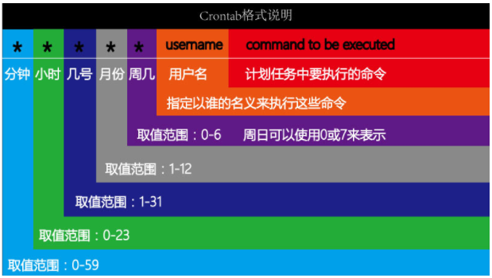

# Linux系统自有服务

# 一、Linux中防火墙firewalld

## 1、什么是防火墙

防火墙：防范一些网络攻击。有软件防火墙、硬件防火墙之分。


防火墙选择让正常请求通过，从而保证网络安全性。

Windows防火墙：


Windows防火墙的划分与开启、关闭操作：


## 2、防火墙的作用


## 3、Linux中的防火墙分类

CentOS5、CentOS6 => 防火墙 => iptables防火墙

CentOS7 => 防火墙 => firewalld防火墙

> firewalld = fire火  wall墙  daemon守护进程

## 4、firewalld防火墙

### ☆ 区域

firewalld增加了区域(zone)的概念，所谓区域是指，firewalld**预先准备了几套防火墙策略的集合**，类似于**策略的模板**，用户可以根据需求选择区域。

常见区域及相应策略规则(规则：哪些端口或服务可以通过防火墙，哪些不能通过)

| 区域       | 默认策略                                                     |
| ---------- | ------------------------------------------------------------ |
| trusted    | 允许所有数据包                                               |
| home       | 拒绝流入的流量，除非与流出的流量相关，允许ssh,mdns,ippclient,amba-client,dhcpv6-client服务通过 |
| internal   | 等同于home                                                   |
| work       | 拒绝流入的流量，除非与流出的流量相关，允许ssh,ipp-client,dhcpv6-client服务通过 |
| ==public== | 拒绝流入的流量，除非与流出的流量相关，允许ssh,dhcpv6-client服务通过 |
| external   | 拒绝流入的流量，除非与流出的流量相关，允许ssh服务通过        |
| dmz        | 拒绝流入的流量，除非与流出的流量相关，允许ssh服务通过        |
| block      | 拒绝流入的流量，除非与流出的流量相关，非法流量采取拒绝操作   |
| drop       | 拒绝流入的流量，除非与流出的流量相关，非法流量采取丢弃操作   |

案例：在Linux系统中安装httpd服务（Web服务），占用计算机的80端口

```powershell
# yum install httpd -y
# systemctl start httpd
```

安装启动完成后，在浏览器中，输入http://服务器的IP地址/即可访问httpd服务页面

提示： 无法访问此网站

> 以上操作只能使用Google浏览器、360浏览器或者Firefox火狐浏览器，一定不要使用IE

以上问题的原因在于：firewalld防火墙已经把httpd（80端口）屏蔽了，所以没有办法访问这台服务器的80端口（httpd服务）

临时解决办法：

```powershell
# systemctl stop firewalld
```


### ☆ 运行模式和永久模式

运行模式：此模式下，配置的防火墙策略立即生效，但是不写入配置文件

永久模式：此模式下，配置的防火墙策略写入配置文件，但是需要reload重新加载才能生效。

==firewalld默认采用运行模式==

## 5、防火墙设置

### ☆ 防火墙的启动、停止以及查看运行状态

查看运行状态

```powershell
# systemctl status firewalld
```


停止防火墙（学习环境任意操作，生产环境一定不要停止防火墙）

```powershell
# systemctl stop firewalld
```

> 记住：防火墙一旦停止，其设置的所有规则会全部失效！

启动防火墙

```powershell
# systemctl start firewalld
```

### ☆ 防火墙重启与重载操作

重启操作

```powershell
# systemctl restart firewalld
```

> restart = stop + start，重启首先停止服务，然后在重新启动服务

重载操作

```powershell
# systemctl reload firewalld
```

我们对防火墙的配置文件做了更改（永久模式），需要使用reload进行重载让其立即生效

> reload并没有停止正在运行的防火墙服务，只是在服务的基础上变换了防火墙规则

### ☆ 把防火墙设置为开机启动与开机不启动

开机启动

```powershell
# systemctl enable firewalld
```

开机不启动

```powershell
# systemctl disable firewalld
```

## 6、firewalld防火墙规则

### ☆ firewalld管理工具

基本语法：

```powershell
# firewall-cmd [选项1] [选项2] [...N]
```

### ☆ 查看防火墙默认的区域（zone）

```powershell
# firewall-cmd --get-default-zone
```

运行效果：

```BASH
# firewall-cmd --get-default-zone
public
```


### ☆ 查看所有支持的区域（zones）

```powershell
# firewall-cmd --get-zones
```

运行结果：


> 为什么要有区域的概念：其实不同的区域就是不同的规则

### ☆ 查看当前区域的规则设置

```powershell
# firewall-cmd --list-all
```


### ☆ 查看所有区域的规则设置

```powershell
# firewall-cmd --list-all-zones
```

运行结果：


### ☆ 添加允许通过的服务或端口（重点）

#### ① 通过服务的名称添加规则

```powershell
# firewall-cmd --zone=public --add-service=服务的名称
备注：服务必须存储在/usr/lib/firewalld/services目录中
```

案例：把http服务添加到防火墙的规则中，允许通过防火墙

```powershell
# firewall-cmd --zone=public --add-service=http
```


扩展：把http服务从防火墙规则中移除，不允许其通过防火墙

```powershell
# firewall-cmd --zone=public --remove-service=http
# firewall-cmd --list-all
```


#### ② 通过服务的端口号添加规则

```powershell
# firewall-cmd --zone=public --add-port=端口号/tcp
```

案例：把80/tcp添加到防火墙规则中，允许通过防火墙

```powershell
# ss -naltp |grep httpd
httpd :::80
# 允许80端口通过firewalld防火墙
# firewall-cmd --zone=public --add-port=80/tcp
```

运行效果：


案例：从firewalld防火墙中把80端口的规则移除掉

```powershell
# firewall-cmd --zone=public --remove-port=80/tcp
```


### ☆ 永久模式permanent

在Linux的新版防火墙firewalld中，其模式一共分为两大类：运行模式（临时模式）+ 永久模式。

运行模式：不会把规则保存到防火墙的配置文件中，设置完成后立即生效

永久模式：会把规则写入到防火墙的配置文件中，但是其需要reload重载后才会立即生效

```powershell
# 根据服务名称添加规则（永久）
# firewall-cmd --zone=public --add-service=服务名称 --permanent
# firewall-cmd --reload

# 根据端口号添加规则（永久）
# firewall-cmd --zone=public --add-port=服务占用的端口号 --permanent
# firewall-cmd --reload
```

案例：把80端口添加到firewalld防火墙规则中，要求永久生效

```powershell
# firewall-cmd --zone=public --add-port=80/tcp --permanent
# firewall-cmd --reload

# firewall-cmd --list-all
```

# 二、Linux中的计划任务

## 1、什么是计划任务

作用：操作系统不可能24 小时都有人在操作，有些时候想在指定的时间点去执行任务（例如：每天凌晨 2 点去重新启动httpd=>阿帕奇），此时不可能真有人每天夜里 2 点去执行命令，这就可以交给计划任务程序去执行操作了。

> 在指定的时间执行指定的操作！

## 2、Windows中计划任务

开始 => 控制面板=> 管理工具 --> 任务计划程序

> Windows10 => Windows键  +  X


案例：在Windows中创建一个计划任务

第一步：创建基本任务


第二步：设置计划任务名称

 

第三步：创建任务触发器（什么时间触发这个任务）


第四步：设置具体的时间


第五步：可以做的工作

 

第六步：设置要启动的程序


## 3、Linux中的计划任务

基本语法：

```powershell
# crontab [选项]
-l ：list，显示目前已经设置的计划任务
-e ：使用vim编辑器编辑计划任务的文件
```

案例：显示当前账号下的计划任务

```powershell
# crontab -l
no crontab for root => root账号下没有创建计划任务
```

案例：编写计划任务

```powershell
# crontab -e
```

## 4、计划任务的编辑

crontab -e进入计划任务编辑文件


打开计划任务编辑文件后，可以在此文件中编写我们自定义的计划任务：

==计划任务的规则语法格式，以行为单位，一行则为一个计划==

```powershell
分  时  日  月  周  要执行的命令（要求必须使用命令的完整路径，可以使用which查看）

取值范围（常识）：
分：0~59
时：0~23
日：1~31
月：1~12
周：0~7，0 和 7 表示星期天

四个符号：
*：表示取值范围中的每一个数字
-：做连续区间表达式的，要想表示1~7，则可以写成：1-7
/：表示每多少个，例如：想每 10 分钟一次，则可以在分的位置写：*/10
,：表示多个取值，比如想在 1 点，2 点 6 点执行，则可以在时的位置写：1,2,6
```



## 5、几个小案例

问题1：每月1、10、22 日的4:45 重启network 服务

```powershell
第一步：定制格式
分  时  日      月   周 /usr/bin/systemctl restart network
第二步：定制时间
45  4  1,10,22  *   *  /usr/bin/systemctl restart network
```

问题2：每周六、周日的1:10 重启network 服务

```powershell
第一步：定制格式
分 时 日 月 周 /usr/bin/systemctl restart network
第二步：定制时间
10 1  * *  6,7 /usr/bin/systemctl restart network
```

问题3：每天18:00 至23:00 之间每隔30 分钟重启network 服务

```powershell
第一步：定制格式
分 时 日 月 周 /usr/bin/systemctl restart network
第二步：定制时间
*/30 18-23 * * * /usr/bin/systemctl restart network
```

问题4：每隔两天的上午8 点到11 点的第3 和第15 分钟执行一次重启

```powershell
第一步：定制格式
分 时 日 月 周 /usr/sbin/reboot
第二步：定制时间
3,15  8-11 */2 * * /usr/sbin/reboot
```

案例：每1 分钟往 root 家目录中的 readme.txt 中输一个1，为了看到效果使用追加输出【输出使用echo 命令，语法：# echo 输出的内容】

```powershell
# crontab -e
* * * * * /usr/bin/echo 1 >> /root/readme.txt
```

提示：为了看到计划任务的效果，你可以单独开一个选项卡，使用tail  -f  /root/readme.txt

## 6、计划任务

常见的一个操作：定时备份（定时把数据库中的数据导出到某个文件中）