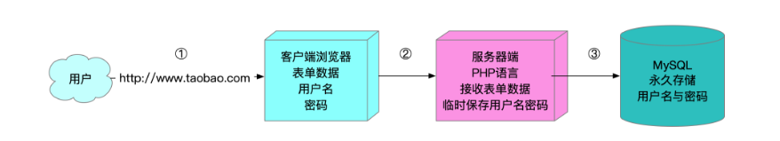
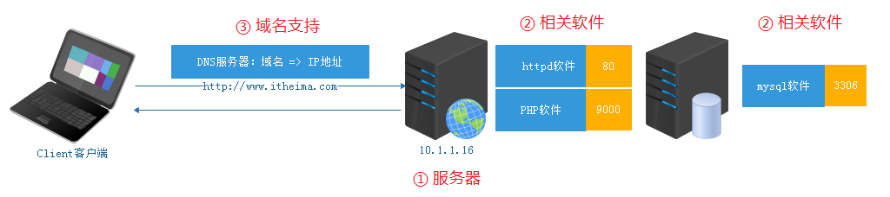

# 进程的优先级与LAMP项目部署实战

# 一、进程的优先级（扩展）

## 1、什么是进程的优先级

Linux是一个多用户、多任务的操作系统，系统中通常运行着非常多的进程。哪些进程先运行，哪些进程后运行，就由进程优先级来控制

思考：什么时候需要用到进程的优先级呢？

答：当CPU负载过高时，如CPU的使用率>=90%以上。这个时候进程的优先级就会起作用。

## 2、查看进程的优先级

PR  优先级，数值越小优先级越高。
NI  优先级，数值越小优先级越高，可以人为更改。（NI = NICE = Nice）

讲个小故事：Nice值 = 0，Nice值越高，代表这个人越绅士（Nice值越高，优先级越低）

> NI值有一个范围 -20 ~ 19

问题：这两个数值是在哪里看到的？

答：top命令

## 3、调整进程的优先级

### ☆ 使用top调整进程的优先级

第一步：使用top命令获取你要调整的进程信息（PID编号）

```powershell
# top -bn 1
PID   	COMMAND
7107	atd（at命令的底层服务）
```

第二步：运行top命令，然后按=="r"==，输入要调整进程的PID编号

```powershell
# top
按r，输入要调整进程的PID编号,按回车
```

第三步：根据提示，重置NICE值

```powershell
Renice PID 7107 to value : -5
```

第四步：按q退出top模式，然后使用top -p PID编号，只查询某个进程的信息

```powershell
# top -p 7107
```

### ☆ 使用renice命令调整进程的优先级

基本语法：

```powershell
# renice [NI优先级设置的数字] 想调整的进程ID
```

案例：使用renice调整atd的优先级

```powershell
第一步：通过ps或top命令获取atd的PID编号
# ps -ef |grep atd
7107
第二步：使用renice命令调整7107的NICE值
# renice -10 7107
7107 (process ID) old priority 0, new priority -10
```

> 注意：NICE值取值范围-20 ~ 19，不能使用小数

### ☆ 使用nice命令调整进程的优先级

基本语法：

```powershell
# nice [NI优先级设置的数字] 想调整的进程名称
```

> 注意：nice命令只能调整没有运行的程序

nice实际操作三步走：

第一步：将程序停止

```powershell
# ps -ef |grep crond
# kill PID
或
# systemctl stop crond
```

第二步：启动并制定优先级（使用nice）

```powershell
# nice -n -10 crond
```

> nice命令包含两个功能：① 启动进程 ② 调整进程的优先级

第三步：确认优先级（查看优先级）

```powershell
# ps -ef |grep crond
PID
# top -p PID
```

# 二、YUM

## 1、什么是YUM

在CentOS系统中，软件管理方式通常有三种方式：`rpm安装`、`yum安装`以及`编译安装`。

```powershell
编译安装，从过程上来讲比较麻烦，包需要用户自行下载，下载的是源码包，需要进行编译操作，编译好了才能进行安装，这个过程对于刚接触Linux的人来说比较麻烦，而且还容易出错。好处在于是源码包，对于有需要自定义模块的用户来说非常方便。
```

难度：编译安装 > rpm安装 > yum安装（有网络 + yum源支持）

Yum（全称为 `Yellow dog Updater, Modified`）是一个在Fedora和RedHat以及CentOS中的Shell前端软件包管理器。

基于rpm包管理，能够从**指定的服务器**(yum源）自动下载RPM包并且安装，可以==自动处理依赖性关系==，并且==一次安装所有依赖的软件包==，无须繁琐地一次次下载、安装。

> rpm和yum区别？答：① yum底层也是基于rpm进行安装的（yum安装的软件，可以通过rpm -qa进行查询） ② yum相对于rpm最大的优势，可以解决依赖关系。
>
> A => B => C

## 2、YUM源配置


YUM源配置文件所在路径 => /etc/yum.repos.d文件夹

-rw-r--r--. 1 root root 1991 Mar 28  2017 CentOS-Base.repo            网络yum源配置文件
-rw-r--r--. 1 root root  647 Mar 28  2017 CentOS-Debuginfo.repo    内核相关的更新包
-rw-r--r--. 1 root root  289 Mar 28  2017 CentOS-fasttrack.repo       快速通道
-rw-r--r--. 1 root root  630 Mar 28  2017 CentOS-Media.repo           本地yum源配置文件
-rw-r--r--. 1 root root 7989 Mar 28  2017 CentOS-Vault.repo          最近版本加入老本的YUM配置   

扩展：在YUM镜像源中添加阿里云镜像源

```powershell
第一步：备份CentOS-Base.repo这个源（更改后缀名.repo => .repo.bak）
# mv CentOS-Base.repo CentOS-Base.repo.bak

第二步：使用wget命令下载阿里云的镜像文件
# wget -O /etc/yum.repos.d/CentOS-Base.repo http://mirrors.aliyun.com/repo/Centos-7.repo

选项说明：
-O ：指定文件下载的位置以及名称
第三步：清理YUM缓存
# yum clean all

第四步：重新建立缓存（让新YUM源生效）
# yum makecache
```

## 3、yum命令详解

### ☆ 搜索要安装的软件

```powershell
# yum search 软件名称的关键词
```

案例：搜索阿里云仓库中的vim软件

```powershell
# yum search vim
```

案例：搜索firefox火狐浏览器

```powershell
# yum search firefox
```

### ☆ 使用yum安装软件

基本语法：

```powershell
# yum install 软件名称关键词 [选项]
选项：
-y ：yes缩写，确认安装，不提示。
```

案例：使用yum命令安装vim编辑器

```powershell
# yum install vim -y
```

案例：使用yum命令安装firefox浏览器

```powershell
# yum install firefox -y
```

### ☆ 使用yum卸载软件

```powershell
# yum remove 软件名称关键词 [选项]
选项：
-y ：yes缩写，确认卸载，不提示。
```

案例：把firefox火狐浏览器进行卸载操作

```powershell
# yum remove firefox -y
```

案例：把httpd软件进行强制卸载

```powershell
# yum remove httpd -y
```

### ☆ 使用yum更新软件

基本语法：

```powershell
# yum update 软件名称关键词 [选项]
选项：
-y ：yes缩写，确认更新，不提示
```

案例：把vim编辑器进行更新操作

```powershell
# yum update vim -y
```

案例：把firefox火狐浏览器进行更新操作

```powershell
# yum update firefox -y
```

# 三、LAMP概述

## 1、什么是LAMP

LAMP：==L==inux + ==A==pache + ==M==ySQL + ==P==HP                        LAMP 架构（组合）

LNMP：Linux + Nginx + MySQL + php-fpm                             LNMP 架构（组合）

LNMPA：Linux + Nginx(80) + MySQL + PHP + Apache           Nginx 代理方式


Apache：Apache是世界使用排名第一的Web服务器软件。

PHP：一种专门用于Web开发的编程语言。

MySQL：MySQL是一个关系型数据库管理系统，主要用于永久存储项目数据。

## 2、AMP三者之间的关系



Apache：用于接收用户的请求（输入网址，返回网页=>结果）

PHP：注册、登录、加入购物车、下单、支付等动态功能（有编程语言的支持）

MySQL：永久保存数据，比如你在网站上注册的用户和密码、你加入购物车的产品、你的产品订单

LAMP = Linux + APache + PHP + MySQL

# 四、阿里云详解

要想部署一个互联网上可以访问到的环境，必须先具备以下内容 ：

服务器（IP、帐号密码、终端）、相应的软件、域名（备案、解析）、代码等。



代码：前端工程师 + 后端工程师进行开发提供的！

## 1、注册阿里云账号

阿里云官网：https://www.aliyun.com/


> 特别说明：云服务器的厂商特别多，你可以进行任意选择 => 阿里云、百度云、腾讯云、华为云...

注册时建议使用支付宝，方便快捷。最重要：付款方便

## 2、实名认证（上传身份证照片）

第一步：单击账号下方的实名认证（选择个人认证）


第二步：选择支付宝授权认证（及时开通，无需等待）


第三步：勾选同意，点击提交


第四步：使用手机支付宝扫描二维码，进行授权


第五步：填写相关信息（住址）


填写完毕，即可完成认证。


## 3、购买阿里云的ECS云服务器

第一步：回到阿里云首页，找到弹性计算 => ECS云服务器


第二步：单击立即购买，购买ECS服务器（选区域、选配置）


第三步：选择付费模式、选择CPU与内存的配置


第四步：选择镜像（CentOS7.6）与云盘（硬盘）


第四步：设置网络、公网IP以及安全组（重要）


> 用户 =>  阿里云安全组  =>  firewalld防火墙  => Linux服务器

第五步：设置root账号密码（一定要选择自定义密码）


> 8 - 30 个字符，必须同时包含三项（大写字母、小写字母、数字、 ()`~!@#$%^&*_-+=|{}[]:;'<>,.?/ 中的特殊符号），其中 Windows 实例不能以斜线号（/）为首字符

第六步：设置释放时间 => 什么时候删除这台服务器（不收钱）


> 特别说明：只有个人购买的ECS服务器可以设置释放时间，生产环境一定不要设置释放时间，否则后果自负！！！

第七步：进入管理控制台，找到我们刚才购买的ECS服务器，如下图所示：


> 使用MX软件，直接连接公网IP + root账号 + 自定义的密码即可连接

## 4、使用MX连接ECS服务器


## 5、使用yum安装sl小工具

安装过程：

```powershell
# yum install sl -y
```

使用sl命令：

```powershell
# sl
```