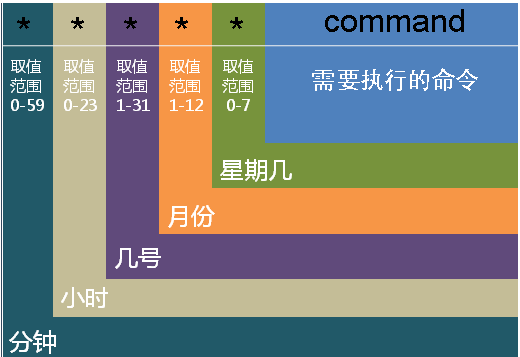

#  Linux高级命令

# 一、find命令

## 1、find命令

基本语法：

```powershell
# find 路径 [选项 选项的值] ...
-name : 根据文件的名称进行
-type : 按文件类型进行搜索，f代表普通文件，d代表文件夹
```

## 2、find命令+模糊搜索

```powershell
# find 路径 -name "通配符*" -type f/-type d
```

## 3、根据文件修改时间搜索文件

```powershell
# find 路径 -mtime +days或-days
```

案例：获取文件的最后修改时间

```powershell
# stat [选项] 文件
```

案例：同时修改文件的修改时间与访问时间

```powershell
# touch -d "2020-03-31 08:10:30" install.log
```

案例：只修改文件的修改时间

```powershell
# touch -m -d "2020-03-31 08:10:30" install.log
```

案例：只修改文件的访问时间

```powershell
# touch -a -d "2020-03-31 08:10:30" install.log
```

案例：-mtime根据文件最后修改时间搜索文件（搜索3天以前的文件信息）

```powershell
# find -name "*.log" -mtime +3 -type f
```

案例：-mtime根据文件最后修改时间搜索文件（搜索3天以内的文件信息）

```powershell
# find -name "*.log" -mtime -3 -type f
```

## 4、扩展选项：-exec

案例：删除搜索到的1天以前的日志文件

解决方案1

```powershell
# find -name "*.log" -mtime +1 -type f |xargs rm -rf
```

解决方案2

```powershell
# find -name "*.log" -mtime +1 -type f -exec rm -rf {} \;
```


## 5、根据文件size大小搜索文件

```powershell
# find 路径 -size [文件大小，常用单位：k，M，G]
size值  : 搜索等于size值大小的文件
-size值 : [0, size值)
+size值 : (size值,正无穷大)
```

## 6、扩展命令：dd

dd：使用dd创建测试文件

```powershell
# dd if=/dev/zero of=文件名称 bs=1M count=1
选项说明：
if代表输入文件
of代表输出文件
bs代表字节为单位的块大小。
count代表被复制的块。
其中/dev/zero是一个字符设备，会不断返回0值字节。
```

案例：使用dd创建一个1M大小的sun.txt文件

```powershell
# dd if=/dev/zero of=sun.txt bs=1M count=1
```

案例：使用dd创建一个5M大小的moon.txt文件

```powershell
# dd if=/dev/zero of=moon.txt bs=1M count=5
```


# 二、tree命令

## 1、tree命令作用

Windows和Linux都有tree命令，主要功能是创建文件列表，将所有文件以树的形式列出来

## 2、安装tree命令

```powershell
# yum install tree -y
```

## 3、tree基本语法

```powershell
# tree [指定路径]
```

案例：以树状结构显示当前目录下的文件信息

```powershell
# tree 
```

案例：以树状结构显示/var/log目录下的文件信息

```powershell
# tree /var/log
```


# 三、scp命令

## 1、scp命令作用

scp命令的主要作用是实现Linux与Linux系统之间的文件传输。

## 2、下载文件或目录

基本语法：

```powershell
# scp [选项] 用户名@linux主机地址:资源路径  linux本地文件路径
```

案例：下载文件到本地

```bash
# scp root@192.168.0.200:/root/install.log ./
```


案例：下载文件夹到本地，选项`-r`

```powershell
# scp -r 用户名@linux主机地址:资源路径  linux本地文件路径
```

```bash
scp -r root@192.168.0.200:/root/shop ./
```


## 3、上传文件或目录

基本语法：

```powershell
# scp 选项 linux本地文件路径 用户名@linux主机地址:远程路径
```

案例：上传文件到远程服务器

```bash
scp install.log root@10.211.55.25:/tmp/
```


案例：上传文件夹到远程服务器

```bash
scp -r shop root@10.211.55.25:/tmp/
```


# 四、计划任务+tar实现文件备份

## 1、编写计划任务

```powershell
# crontab -e
分 时 日 月 周 执行Shell命令（使用完成路径，可以通过which进行查看）
```

 分时日月周，时间范围：



## 2、扩展案例

案例：每天的凌晨2点0分把/etc目录备份一次/tmp目录下，要求把/etc打包成etc.tar.gz格式

```powershell
0 2 * * * /bin/tar -zcf /tmp/etc.tar.gz  /etc
```

案例：备份文件时，一般是按时间作为备份文件的名称

```powershell
0 2 * * * /bin/tar -zcf /tmp/etc-$(date +"\%F").tar.gz  /etc
解析：
$(date +"\%F") 代表生成年-月-日时间，为什么%百分号前面要加一个反斜杠（必须）
```

## 3、扩展：date命令

基本语法：

```powershell
# date +"%F%T"
选项说明：
%F : 年月日
%T : 小时:分钟:秒
%Y : 年
%m : 月
%d : 日
%H : 小时
%M : 分钟
%S : 秒
```

案例：获取当前系统的系统时间，如2020-03-31 10:10:10

```powershell
# date +"%F %T"
```

案例：获取当前系统的系统时间，如20200331

```powershell
# date +"%Y%m%d"
```