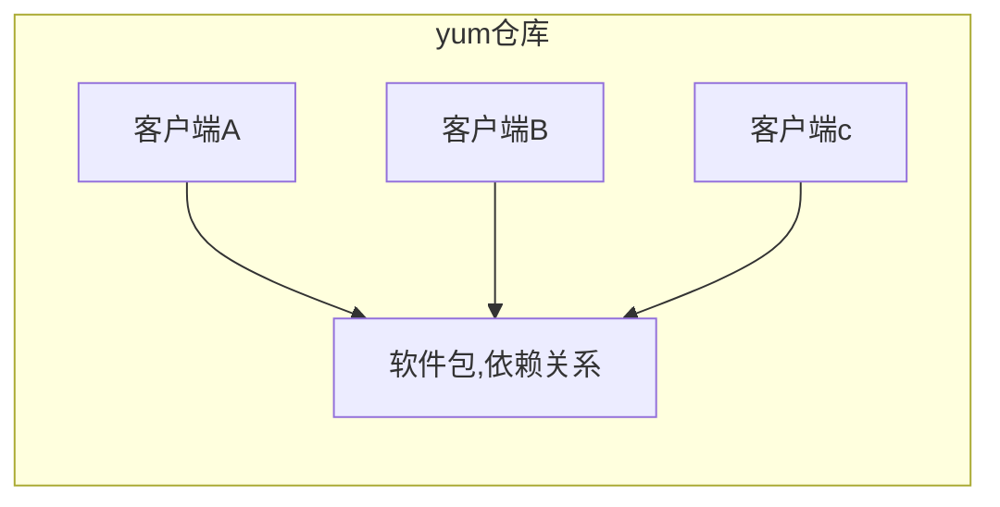

---
typora-root-url:./
---

# 任务背景

公司之前计划将现有的MySQL数据库从云平台迁移到云下物理真机上，并且已经在相应的物理机上安装好相应的操作系统。现在需要运维人员协助在测试机Centos7.6上安装好==MySQL-5.6.43==版本用于前期迁移准备工作，同时==配置好本地yum源和外网源==方便后续软件包安装。

# 任务要求

1. 配置本地yum源和网络yum源
2. 安装MySQL软件，版本为==5.6.43==

# 任务拆解

1. yum源配置
2. MySQL数据库软件安装

# 课程目标

- [ ] 了解yum源安装软件包的优点
- [ ] 了解常见的外网yum源
- [ ] ==掌握本地和网络yum源的配置==
- [ ] 能够使用yum工具安装软件包

# 知识储备

## 一、yum源概述

### ㈠ yum源的作用

==软件包管理器==，类似360的软件管家




### ㈡ yum源的优点

能够==解决软件包之间的依赖关系==，提高运维人员的工作效率。

### ㈢ yum源的分类

#### 1、本地yum源

yum仓库在==本地==（系统光盘/镜像文件）

#### 2、网络yum源

yum仓库不在本地，在==远程==
- 国内较知名的网络源（aliyun源，163源，sohu源，知名大学开源镜像等）

  	阿里源：https://opsx.alibaba.com/mirror
  	网易源：http://mirrors.163.com/
  	搜狐源：<http://mirrors.sohu.com/
  	清华源：<https://mirrors.tuna.tsinghua.edu.cn/
  
- 国外较知名的网络源（centos源、redhat源、扩展[^epel]源等）

- ==特定软件==相关的网络源（Nginx、MySQL、Zabbix等）

## 二、==yum源配置(重点)==

### ㈠ 本地yum源配置

#### 1、本地需要有仓库

##### ① 虚拟光驱装载镜像文件

```powershell
略
```

##### ② 将光盘挂载到本地目录

```powershell
/mnt	操作系统默认的挂载点

mount [挂载选项] 需要挂载的设备  挂载点

手动挂载光盘到/mnt
lsblk		查看当前系统所有的设备文件
mount -o ro /dev/sr0 /mnt
注意：手动挂载后，系统重启需要再次手动挂载
```

##### ③ 开机自动挂载

```powershell
修改/etc/rc.local文件

/etc/rc.local	操作系统开机最后读取的一个文件
echo "mount -o ro /dev/sr0 /mnt" >> /etc/rc.local
```

#### 2、修改配置文件指向本地仓库

##### ① 知道配置文件存放路径

```powershell
[root@yunwei yum.repos.d]# pwd
/etc/yum.repos.d
```

##### ② 修改配置文件

```powershell
注意：文件名必须以.repo结尾
[root@yunwei yum.repos.d]# vi local.repo
[local]					仓库的名字，不要有特殊符号（自定义）
name=local yum			仓库描述
baseurl=file:///mnt	指定yum仓库的路径（重要）；file://表示本地仓库；ftp://或者http://
enabled=1			   启用仓库，1表示启用；0表示不启用
gpgcheck=0			   不用校验软件包的签名，0表示不校验；1表示校验

===================================================================
# man 5 yum.conf
[repositoryid]
name=Some name for this repository
baseurl=url://server1/path/to/repository/
        url://server2/path/to/repository/
        url://server3/path/to/repository/
enabled=1
gpgcheck=0

测试验证：
yum clean all		清空yum缓存
yum makecache 		创建yum缓存
yum list				查看仓库里的软件包
```

### ㈡ 网络yum源配置

#### 1、主机需要访问互联网

说明：如果配置的是==外网源==，当前主机需要访问互联网。

#### 2、修改配置文件指向网络仓库

##### ① 特定软件网络源

~~~powershell
[root@yunwei yum.repos.d]# vi nginx.repo
[nginx]
name=nginx repo
baseurl=http://nginx.org/packages/centos/6/x86_64/
gpgcheck=0
enabled=1
说明：
baseurl=http://nginx.org/packages/centos/6/$basearch/
$basearch表示当前系统cpu架构，如果系统是32位会找32位软件包；如果64位会找64位软件包
~~~

##### ② 基础软件网络源

~~~powershell
[root@yunwei yum.repos.d]# vi 163.repo 
[163]
name=163 network yum
baseurl=http://mirrors.163.com/centos/6/os/x86_64/
enabled=1
gpgcheck=1
gpgkey=http://mirrors.163.com/centos/6/os/x86_64/RPM-GPG-KEY-CentOS-6

[root@yunwei yum.repos.d]# vi aliyun.repo 
[aliyun]
name=aliyun
baseurl=http://mirrors.aliyun.com/centos/6/os/x86_64/
enabled=1
gpgcheck=1
gpgkey=http://mirrors.aliyun.com/centos/6/os/x86_64/RPM-GPG-KEY-CentOS-6
~~~

#### 3、通过安装相应软件包直接配置

说明：该方法是通过安装软件包，自动在相应目录里创建.repo文件（自动配置）

```powershell
epel源:
https://mirrors.aliyun.com/epel/6/x86_64/epel-release-6-8.noarch.rpm
mysql源:
https://repo.mysql.com/mysql-community-release-el6.rpm
https://repo.mysql.com/mysql-community-release-el7.rpm
```

#### 4、总结

**==yum配置（重点）：==**

1. 本地yum源配置核心
   - 本地需要有软件仓库——>光盘挂载到系统某个目录上(`mount -o ro /dev/sr0 /mnt`)
   - 告诉yum工具去哪个仓库找软件包——>修改配置（`/etc/yum.repos.d/xxx.repo`）
2. 网络yum源配置核心
   - 当前主机必须能够访问互联网（外网源）
   - 告诉yum工具去哪个仓库找软件包——>修改配置（`/etc/yum.repos.d/xxx.repo`）
   - ==配置方法2种==：直接修改配置文件；下载rpm包，安装软件包自动帮我配置
3. 如果多个仓库里有相同的软件包，==高版本优先==
4. 多个yum源，可以指定优先级，但是==需要安装插件==，修改配置文件完成【参考扩展补充】

### ㈢ 缓存安装的软件包

#### 1、什么时候需要缓存软包？

- 下次还需要安装相同版本的软件包
- 由于网络原因导致网络安装非常慢，将软件包缓存下来，配置本地仓库

#### 2、如何缓存软包？

修改配置文件`/etc/yum.conf`

```powershell
# vim /etc/yum.conf
[main]
cachedir=/var/cache/yum/$basearch/$releasever	定义软件包的缓存路径
keepcache=1			1开启缓存；0关闭
debuglevel=2
logfile=/var/log/yum.log
...
```

###  ㈣ 自建yum仓库

**思考1：**什么情况下需要自建yum仓库？

**思路：**

1. 创建一个目录来保存相应的软件
2. 需要在该目录下生成repodata目录
3. 修改配置文件指向本地自建仓库

**步骤：**

1. 创建一个目录来保存相应软件

~~~powershell
[root@yunwei soft]# mkdir /soft
~~~

2. 将你准备的所有软件包拷贝到/soft目录里

```powershell
说明：以下只是演示举例，以后根据自己的实际情况，将你准备的软件包考到本地目录就行
[root@yunwei soft]# pwd
/soft
[root@yunwei soft]# cp /mnt/Packages/samba* /soft/
[root@yunwei soft]# cp /mnt/Packages/libtevent-0.9.26-2.el6_7.x86_64.rpm /soft
[root@yunwei soft]# cp /mnt/Packages/libtalloc-2.1.5-1.el6_7.x86_64.rpm /soft/
```

3. 扫描软件包所在目录生成repodata目录

```powershell
[root@yunwei soft]# yum -y install createrepo
[root@yunwei soft]# createrepo /soft
验证是否多了repodata目录
[root@yunwei soft]# ls /soft
```

4. 关闭本地仓库和所有网络仓库，配置自己创建的yum仓库

```powershell
1) 根据自己配置情况，打开本地和网络源的配置文件
将enabled=1修改为enabled=0
2) 创建自建源配置文件
[root@yunwei soft]# vim /etc/yum.repos.d/myself.repo
[myself]
name=myself yum
enabled=1
baseurl=file:///soft			路径就是自己之前创建的目录，里面有软件包也有repodata目录
gpgcheck=0
3) 清空yum缓存重新创建
[root@yunwei soft]# yum clean all
[root@yunwei soft]# yum makecache
```

5. 测试验证安装samba软件

```powershell
[root@yunwei soft]# yum install samba
注意：安装samba软件包来自myself仓库，同时会自动安装其他依赖关系软件包
```

# 任务实施

## 一、配置本地yum源

### ㈠ 挂载镜像到本地

```powershell
手动挂载
[root@yunwei ~]# mount -o ro /dev/sr0 /mnt/
开机自动挂载
[root@yunwei ~]# echo "mount -o ro /dev/sr0 /mnt" >> /etc/rc.local
```

### ㈡ 修改配置文件指向本地仓库

```powershell
[root@yunwei ~]# cd /etc/yum.repos.d/
[root@yunwei yum.repos.d]# cat local.repo
[local]
name=local yum
baseurl=file:///mnt
enabled=1
gpgcheck=0
```

## 二、配置MySQL官方yum源

### ㈠ 下载官方提供的yum仓库软件包

```powershell
通过浏览器找到适合自己系统的软包下载
https://dev.mysql.com/downloads/repo/yum/
```

### ㈡ 安装软件包来自动配置yum源

```powershell
安装软件包
[root@yunwei ~]# rpm -ivh mysql80-community-release-el6-2.noarch.rpm
warning: mysql80-community-release-el6-2.noarch.rpm: Header V3 DSA/SHA1 Signature, key ID 5072e1f5: NOKEY
Preparing...                ########################################### [100%]
   1:mysql80-community-relea########################################### [100%]

查看自动配置的mysql源仓库配置文件
[root@yunwei ~]# ls /etc/yum.repos.d/mysql-community*
/etc/yum.repos.d/mysql-community.repo  /etc/yum.repos.d/mysql-community-source.repo

注意：
1.默认情况下，官方提供最新版本的软件，我们需要根据自己的情况进行修改配置文件
2.我们需要安装mysql-5.6版本，所以关闭其他版本的仓库，只打开5.6的仓库

[root@yunwei ~]# cd /etc/yum.repos.d/
[root@yunwei yum.repos.d]# vim mysql-community.repo
# Enable to use MySQL 5.6
[mysql56-community]
name=MySQL 5.6 Community Server
baseurl=http://repo.mysql.com/yum/mysql-5.6-community/el/6/$basearch/
enabled=1				将0改为1，开启5.6版本仓库
gpgcheck=1
gpgkey=file:///etc/pki/rpm-gpg/RPM-GPG-KEY-mysql
....
[mysql80-community]
name=MySQL 8.0 Community Server
baseurl=http://repo.mysql.com/yum/mysql-8.0-community/el/6/$basearch/
enabled=0			将1改改为0，关闭默认的8.0版本仓库
gpgcheck=1
gpgkey=file:///etc/pki/rpm-gpg/RPM-GPG-KEY-mysql

以下两个仓库也关闭，暂时用不到
[mysql-connectors-community]
name=MySQL Connectors Community
baseurl=http://repo.mysql.com/yum/mysql-connectors-community/el/6/$basearch/
enabled=0
gpgcheck=1
gpgkey=file:///etc/pki/rpm-gpg/RPM-GPG-KEY-mysql

[mysql-tools-community]
name=MySQL Tools Community
baseurl=http://repo.mysql.com/yum/mysql-tools-community/el/6/$basearch/
enabled=0
gpgcheck=1
gpgkey=file:///etc/pki/rpm-gpg/RPM-GPG-KEY-mysql

```

### ㈢ 清空yum缓存重新创建缓存

```powershell
[root@yunwei yum.repos.d]# yum clean all
[root@yunwei yum.repos.d]# yum makecache
```


## 三、安装MySQL-5.6.43版本软件包

```powershell
[root@yunwei ~]# yum install mysql-community-server
```


**说明：**

1. 通过网络安装，可能会由于网络原因安装不成功，多试几次即可
2. 一台机器安装好后，如果另外一台也需要安装，可以通过开启缓存下载下来，做成本地仓库安装


# 任务总结

1. ==明白需求==

2. 拆解任务

3. 知识储备

4. 落地实现

5. ==总结验证==

# 扩展补充

## 1、yum仓库优先级

**问**：==如果有多个仓库，是否可以设置yum源的优先级设定？==

- 可以设置，但是需要安装插件`yum-plugin-priorities`。

- 安装完插件后，只需要在yum源配置文件*.repo里指定优先级即可，如：

```powershell
添加priority=n的配置项,n值越小优先级越高，默认99.
[local]
name=local yum
baseurl=file:///mnt
enabled=1
gpgcheck=0
priority=1
```

## 2、yum缓存软件包

**问：**如果想把从网络源安装的软件包下载到本地方便后续使用，怎么做呢？

- 只需要开启yum缓存功能即可
- 通过修改配置文件开启yum缓存功能，如下：

```powershell
[root@yunwei ~]# vim /etc/yum.conf
[main]
cachedir=/var/cache/yum/$basearch/$releasever		软件包的缓存路径
keepcache=1			将0变成1，表示缓存安装软件包到本地
debuglevel=2
logfile=/var/log/yum.log
....
```

# 课后强化

- **rpm工具使用**

~~~powershell
rpm -ivh	package
安装  
rpm -e package
卸载
rpm -Uvh
升级，如果已安装老版本,则升级;如果没安装,则直接安装
rpm -Fvh
升级，如果已安装老版本,则升级;如果没安装,则不安装
rpm -ivh --force
强制安装
rpm --nodeps
忽略依赖关系
rpm -ql
查看已经安装的软件的文件列表
rpm -qlp  package.rpm 
查看未安装的rpm包里的文件列表
rpm -qa  查看已经安装的所有rpm包
rpm -qd  查看软件的文档列表
rpm -qc  查看软件的配置文件
rpm -qi  查看软件的详细信息
rpm -qf  filename
查看文件来自哪个rpm包
rpm --import    key_file
导入公钥用于检查rpm文件的签名
rpm -checksig   package.rpm
检查rpm包的签名
~~~

- **yum工具使用**

~~~powershell
# yum install package -y
默认是安装来自仓库里的软件，指定的是软件名字。多个包空格隔开；-y （取消交互）
# yum install ./xlockmore-5.31-2.el6.x86_64.rpm
或者
# yum localinstall ./xlockmore-5.31-2.el6.x86_64.rpm
安装来自本地指定路径下的rpm包，而不是来自仓库
# yum remove 或者 erase package
卸载软件包
# yum update
更新仓库里所有比本机已经安装过的软件要的软件	
# yum update package
指定升级的软件
# yum search mysql
搜索出所有软件名字或者软件描述包含“mysql”关键字的软件
# yum provides  "*libmysqlclient.so*"
找出模块由哪些软件包提供
# yum provides "*xeye*"
搜索一个包含xeye关键字的软件包
# yum clean all
清空之前的yum列表缓存
# yum makecache
创建新的缓存
# yum list
列出仓库里的所有软件包
# yum repolist
列出已配置的软件仓库
# yum list|tail
查看未安装的软件包
# yum list |grep 关键字
@代表已经安装成功
# yum list installed
查看已安装的包
# yum grouplist
查看包组
# yum groupinstall  "包组"
安装包组
# yum groupremove "包组"
# md5sum +包名
直接校验第三方提供的软件包 
~~~

# 课后实战

## 1. 需求1

Centos默认使用自带的国外源，由于网络问题请将其替换为国内的清华源、阿里云源，163源，sohu源其中之一

## 2. 需求2

开发人员需要安装某个软件包（epel源中有），发现现有yum源中没有，需要运维协助配置EPEL源（两种方式搭建EPEL源）

## 3. 需求3

给开发人员搭建能够提供指定软件包的安装源，如zabbix的yum源

~~~powershell

puppet:
http://yum.puppetlabs.com/puppetlabs-release-el-6.noarch.rpm
http://yum.puppetlabs.com/puppetlabs-release-el-7.noarch.rpm
http://yum.puppetlabs.com/puppetlabs-release-fedora-20.noarch.rpm

Zabbix:
http://repo.zabbix.com/zabbix/2.4/rhel/6/x86_64/zabbix-release-2.4-1.el6.noarch.rpm
http://repo.zabbix.com/zabbix/2.2/rhel/6/x86_64/zabbix-release-2.2-1.el6.noarch.rpm
http://repo.zabbix.com/zabbix/4.1/rhel/7/x86_64/zabbix-release-4.1-1.el7.noarch.rpm 
~~~


[^epel]: “红帽系”的操作系统提供额外的软件包，适用于RHEL、CentOS等系统