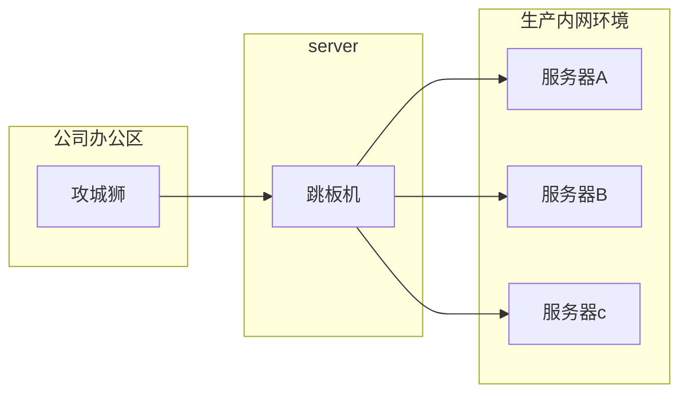
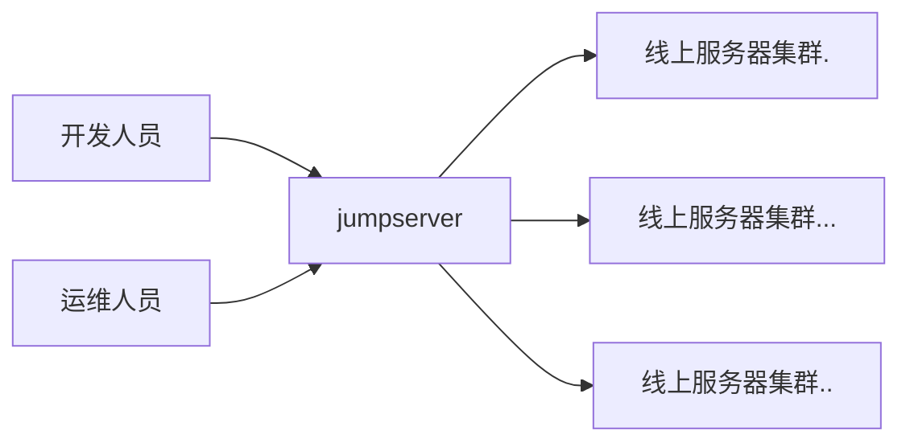
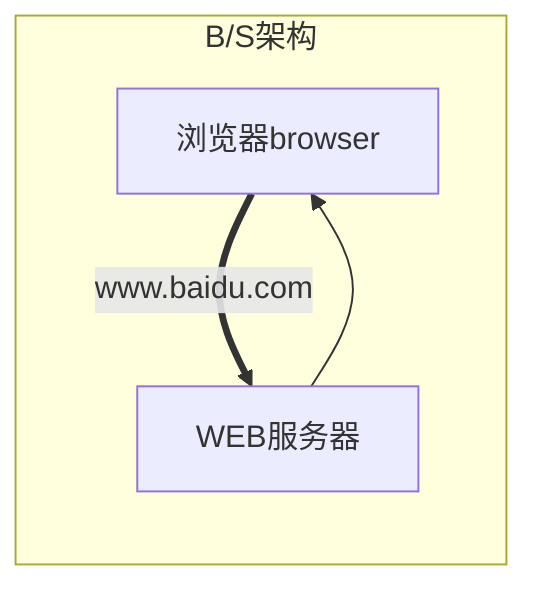
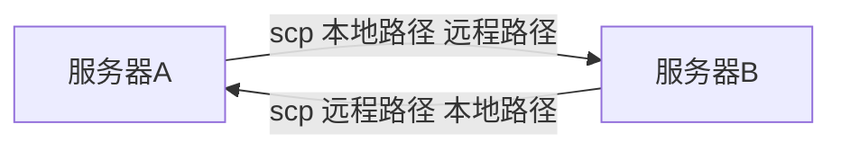

# 远程管理SSH服务
# 一、场景引入

## 1、任务背景

为了最大程度的保护公司内网服务器的安全，公司内部有一台服务器做跳板机（JumpServer）。运维人员在维护过程中首先要统一登录到这台服务器，然后再登录到目标设备进行维护和操作。由于开发人员有时候需要通过跳板机登录到线上生产环境查看一些业务日志，所以现在需要运维人员针对不同的人员和需求对==账号密码进行统一==管理，并且遵循**权限最小化**原则。

  




## 2、任务要求

1. 跳板机上为每个开发人员创建一个账号，并且只能在指定的目录里管理自己的文件。
2. 线上生产服务器，禁止使用root用户远程登录。
3. 线上生产服务器sshd服务不允许使用默认端口，防止自动脚本攻击默认端口。
4. 线上生产服务器上开发人员使用的账号code用户的密码使用工具随机生成。

## 3、任务拆解

1. 跳板机上为开发人员==创建用户==及公共==目录==供开发人员使用，并做好权限控制
2. 所有线上生产服务器==搭建ssh服务==
3. 对于ssh服务根据需求进行配置
   - 禁止root用户远程登录
   - 更改默认端口（22=>10086）
4. 线上生产服务器创建code用户，并安装工具来生成随机密码




## 4、涉及知识点

- 用户权限管理（旧知识点）
- **==ssh服务配置（新知识点）==**
- 生成随机密码工具（新知识点）

# 二、理论储备

## 1、什么是服务

- 运行在操作系统后台的一个或者多个程序，为系统或者用户提供特定的服务
- 可靠的，并发的，连续的不间断的运行，随时接受请求
- 通过交互式提供服务

## 2、服务架构模型

### 1、B/S架构

- B/S(browser/server) 浏览器/服务器

概念：这种结构用户界面是完全通过浏览器来实现，使用http协议
优势：节约开发成本




### 2、C/S架构

- C/S（client/server）客户端/服务器

概念：指的是客户端和服务端之间的通信方式，客户端提供用户请求接口，服务端响应请求进行对应的处理，并返回给客户端
优势：安全性较高，一般面向具体的应用

  ```MERMAID
  graph RL
    subgraph C/S架构
      客户端client程序---->应用服务器
      应用服务器---->客户端client程序
    end  
  ```


### 3、两者区别

**B/S：**
1、广域网，只需要有浏览器即可
2、一般面向整个互联网用户，安全性低
3、维护升级简单

**C/S：**
1、专用网络、小型局域网，需要具体安装对应的软件
2、一般面向固定用户，安全性较高

**思考：C/S B/S哪种更好呢？**

taobao   taobaoapp

> **思考1:**
>
> 我们通过网络是如何找到我们想要访问的服务的?
>
> **IP(提供服务的服务器)+Port(找到相应的服务)**

## 3、端口号设定

**说明:端口号只有整数，范围是从0 到65535**
• 1～255：一**般是知名端口号**，如:ftp 21号、web 80、ssh 22、telnet 23号等
• 256～1023：通常都是由Unix系统占用来提供特定的服务
• ==1024~5000==：客户端的临时端口，随机产生
• 大于5000：为互联网上的其他服务预留

> **思考2:**
>
> 如何查看系统默认的注册端口?
>
> ```powershell
> /etc/serivces
> ```

## 4、常见的网络服务

- 文件共享服务：==FTP、SMB、NFS==
- 域名管理服务：==DNS==
- 网站服务：==Apache(httpd)==、Nginx、Lighttpd、IIS
- 邮件服务: Mail
- 远程管理服务：==SSH==、telnet
- 动态地址管理服务:DHCP

## 5、SSH服务概述

	熟悉Linux的人那肯定都对SSH不陌生。ssh是一种用于安全访问远程服务器的协议，远程管理工具。它之所以集万千宠爱为一身，就是因为它的安全性。那么它到底是怎么样来保证安全的呢？到底是如何工作的呢？
	
	**首先，在讲SSH是如何保证安全的之前，我们先来了解以下几个密码学相关概念：**

### 1、加密算法（了解）

**①对称加密算法(DES)**


1. Jack想要给Harry发送信息一个信息Ａ，为了安全起见，Jack使用一种加密算法，比如给信息通过加一个数字B得到一个新的数字C，然后以公开的方式发送给Harry
2. Harry接受到数字C后，通过减去一个数字B得到最终的真正的信息A
3. Jack发送给Harry的信息A称为明文；加密后的信息C称为密文；加密用的B称之为密钥
4. 加密算法（方法）可以很复杂，不一定是加和减，也可以是乘和除等等
5. 以上过程中，加密和解密的秘钥是同一个密钥B

> **总结：**
>
> 1. 发送方使用**==密钥==**将==**明文数据**==加密成**==密文==**，然后发送出去
> 2. 接收方收到密文后，使用==同一个密钥==将密文解密成明文进行读取
>

**②非对称加密算法(RSA)**

 

1. 首先Harry生成一对有相互关系的密钥对，比如e（公钥）和f（私钥）；其中公钥是可以公开给所有人的，私钥必须Harry本人私自留存，不得泄露。
2. 当Jack发送请求时，Harry会把自己的公钥e发送给Jack
3. Jack拿着Harry的公钥e通过一种加密算法将信息Ａ加密成密文Ｃ，以公开的方式发送给Harry
4. Harry收到密文Ｃ后，通过自己本地留存的私钥ｆ将密文解密成最终的信息A
5. 以上过程中，加密使用的是公钥e，解密使用的是私钥f；使用不同的秘钥加解密

> **总结：**
>
> 1. 发送方使用接收方发送过来的**==公钥==**将==**明文数据**==加密成**==密文==**，然后发送出去
> 2. 接收方收到密文后，使用自己本地留存的==**私钥**==将密文解密成明文进行读取
>

- **对称加密算法与非对称加密算法区别**

  > - ==**对称加密**==
  >   1. 使用==同一个密钥==进行加密和解密，密钥容易泄露
  >   2. ==加密速度快==，效率高，==数据传输==速度==快==，安全性较==低==
  > - ==**非对称加密**==
  >   1. 使用==不同的密钥==（公钥和私钥）进行加密和解密
  >   2. ==加密速度==远远==慢==于对称加密，==数据传输==速度==慢==，安全性较==高==

**问：** 了解了加密算法，那SSH到底是如何保证数据安全的呢？

**答：**SSH服务有两种认证方式，分别是基于用户名密码认证和密钥对认证

### 2、SSH基于用户名密码认证原理

 

1. SSH客户端向SSH服务端发起一个登录请求

2. SSH服务端将自己的公钥发送给SSH客户端

   注意：如果是第一次访问，则提示以下内容：

   ```powershell
   # ssh远程登录操作 首次
   ssh 192.168.19.101
   # 显示结果
   # 无法确认主机的真实性
   The authenticity of host '192.168.19.101 (192.168.19.101)' can't be established.
   ECDSA key fingerprint is SHA256:Y/cQNWWkX15o2MsJ5HOQBI2m8S33qIA+x3zys8J4pOY.
   ECDSA key fingerprint is MD5:76:61:86:8b:d5:ee:bf:9c:60:e6:12:fa:f6:f0:74:36.
   Are you sure you want to continue connecting (yes/no)?yes
   Warning: Permanently added '192.168.19.101' (ECDSA) to the list of known hosts.
   #说明：
   #当客户端输入yes确认对方的公钥指纹后,server端的公钥就会被存放到客户机的用户家目录里~/.ssh/known_hosts文件中，下次再访问就直接通过密码登录，不需要再确认公钥。
   ```

3. SSH客户端使用服务端发过来的公钥将自己的密码加密并且发送给SSH服务端

4. SSH服务端收到SSH客户端发过来的加密密码后使用本地留存的私钥进行解密

5. SSH服务端将解密出来的密码和`/etc/shadow`文件里的用户密码对比认证

6. SSH服务端认证成功，则返回登录成功结果，并发送一个随机会话口令给客户端，该口令用于后面两台主机进行数据传输的一个临时加密会话口令

### 3、 SSH介绍总结

- SSH是Linux下远程管理的工具，相比Telnet安全，运维人员必备的神器！
- SSH的全称Secure Shell，安全的shell，是Client/Server架构，默认==端口号为22，TCP协议==
- SSH其实用于商业，而OpenSSH即为开源的，在Linux中默认安装

## 6、SSH服务配置

### 1、搭建所有服务的思路

> - 关闭防火墙和selinux(实验环境都先关闭掉)
> - 配置yum源(公网源或者本地源)
> - 软件安装和检查
> - 了解并修改配置文件
> - 启动服务检查运行状态并设置开机自启动

### 2、搭建SSH服务

#### （一）关闭防火墙和selinux

```powershell
# 关闭firewalld防火墙
# 临时关闭
systemctl stop firewalld
# 关闭开机自启动
systemctl disable firewalld
# 关闭selinux
# 临时关闭
setenforce 0
# 修改配置文件  永久关闭
vim /etc/selinux/config
SELINUX=disabled
```

#### （二）配置yum源

> 注意：一般情况下使用网络源即可。如果==**没有网络**==的情况下，才需要配置本地源

                                                                          【配置开始】

------


##### ①挂载镜像光盘

```powershell
# 建立光盘挂载目录文件夹
mkdir /dvd
# 手动挂载光盘
mount /dev/sr0 /dvd
# lsblk查看是否挂载成功  查看mount点或者查看挂载到的目录内容
# 添加到开启加载脚本  开机自动挂载光盘
echo "mount /dev/sr0 /dvd" >> /etc/rc.local
```

##### ②配置本地yum源

```powershell
cd /etc/yum.repos.d
mkdir bak
#移动默认源 备份并使其失效
mv ./* ./bak
#按照挂载光盘位置，配置光盘源
cd bak
cp CentOS-Media.repo ../
vim CentOS-Media.repo
#修改文件第16行，修改为光盘挂载点/dvd/即可。修改第20行,开启源使用
14 [c7-media]
15 name=CentOS-$releasever - Media
16 baseurl=file:///dvd/
17         file:///media/cdrom/
18         file:///media/cdrecorder/
19 gpgcheck=1
20 enabled=1
21 gpgkey=file:///etc/pki/rpm-gpg/RPM-GPG-KEY-CentOS-7
22
```


------

                                                                            【配置结束】

#### （三）软件安装

##### ①确认是否安装

```powershell
rpm -qa|grep openssh
```

查询结果

```powershell
# 服务端和客户端的公共组件
openssh-7.4p1-16.el7.x86_64
# 客户端安装包
openssh-clients-7.4p1-16.el7.x86_64
# 服务端安装包
openssh-server-7.4p1-16.el7.x86_64
```

##### ②查看openssh-server软件包的文件列表

```powershell
rpm -ql openssh-server
```

查询结果

```powershell
# 配置文件
/etc/ssh/sshd_config
/etc/sysconfig/sshd
# 服务管理脚本
/usr/lib/systemd/system/sshd.service		=>  systemctl start sshd
# 文件共享服务 提供文件上传下载的服务
/usr/libexec/openssh/sftp-server
# 二进制文件程序文件
/usr/sbin/sshd
# 公钥生成工具
/usr/sbin/sshd-keygen
# man手册
/usr/share/man/man5/sshd_config.5.gz
/usr/share/man/man8/sftp-server.8.gz
/usr/share/man/man8/sshd.8.gz
```

##### ③查看openssh-clients软件包的文件列表

```powershell
rpm -ql openssh-clients
```

查询结果

```powershell
# 客户端配置文件
/etc/ssh/ssh_config
# 远程copy命令 服务器间进行文件传输
/usr/bin/scp
# sftp客户端  上传下载文件操作
/usr/bin/sftp
/usr/bin/slogin
/usr/bin/ssh
/usr/bin/ssh-add
/usr/bin/ssh-agent
/usr/bin/ssh-copy-id
/usr/bin/ssh-keyscan
# 客户端man手册
/usr/share/man/man1/scp.1.gz
/usr/share/man/man1/sftp.1.gz
/usr/share/man/man1/slogin.1.gz
/usr/share/man/man1/ssh-add.1.gz
/usr/share/man/man1/ssh-agent.1.gz
/usr/share/man/man1/ssh-copy-id.1.gz
/usr/share/man/man1/ssh-keyscan.1.gz
/usr/share/man/man1/ssh.1.gz
/usr/share/man/man5/ssh_config.5.gz
/usr/share/man/man8/ssh-pkcs11-helper.8.gz
```

#### （四）查看了解并修改配置文件

```powershell
# man 5 sshd_config
```

**需求：**禁止==root用户==远程登录

```powershell
vim /etc/ssh/sshd_config
# 打开文件第38行 修改以下内容
#PermitRootLogin yes
PermitRootLogin no
```

#### （五）服务管理

```powershell
# 重启服务
systemctl restart sshd

# 查看状态
systemctl status sshd
# 进程查看方式
ps aux |grep sshd
# 端口查看方式
netstat -lntp|grep sshd

# 开启自启动
systemctl enable sshd
```

## 7、任务解决方案

- **环境准备**

| IP地址         | 主机名称   | 服务器角色     |
| -------------- | ---------- | -------------- |
| 192.168.19.100 | jumpserver | 跳板机         |
| 192.168.19.101 | realserver | 真实业务服务器 |

### 1、创建用户并授权

> 公司的开发测试服务器，有多个团队使用：
>
> ①html    前端组   jerry  tom 
> ②server    后端组  xiaoming  xiaoqiang
> ③app    手机软件组  rose  xiaohong 

==注意：在跳板机完成用户创建及其授权==

#### （一）用户和用户组创建

##### ①添加用户组

```powershell
groupadd html
```

##### ②添加用户到用户组中

```powershell
useradd jerry -g html
useradd tom -g html
```

#### （二）使用非交互式设置密码

```powershell
echo 123456|passwd --stdin jerry
echo 123456|passwd --stdin tom
```

#### （三）为开发人员创建数据目录并且设置相应的权限

```powershell
mkdir -p /code/html
# 查看默认权限
cd /
ll -d /code/html
# 查询结果
drwxr-xr-x. 2 root root 6 3月  21 23:16 /code/html

# 修改所属组
chgrp html /code/html
# 增加组 写权限
chmod g+w /code/html
# 查看默认权限
ll -d /code/html
# 查询结果
drwxrwxr-x. 2 root html 6 3月  21 23:16 /code/html

# 设置粘滞位 其它用户不允许删除不属于它的目录和文件
chmod 1700 /code/html
# 查看默认权限
ll -d /code/html
# 查询结果
drwxrwx--T. 2 root html 6 3月  21 23:16 /code/html
```

#### （四）测试环境用户环境和权限

测试用户权限是否设置成功，可以结合第（三）步一起完成

### 2、禁止root远程登录

**注意：**在生产服务器server端完成

参见上面sshd的配置文件的操作

### 3、更改默认端口

> 需求：防止扫IP使用默认端口暴力破解(一次一次试)。故将默认端口更改为：3721

#### （一）确定当前服务器端口没有被占用

```powershell
netstat -lntp|grep 3721
# 或者
ss -nalp|grep 3721
# 或者
lsof -i :3721
```

#### （二）修改配置文件

```powershell
vim /etc/ssh/sshd_config
# 找到文件第13行添加以下内容
# Port 22
Port 3721
```

#### （三）重启服务

```powershell
systemctl restart sshd
# 或者
systemctl reload sshd
```

#### （四）测试验证

```powershell
ssh @192.168.19.100
ssh: connect to host 192.168.19.100 port 22: Connection refused
#原因：端口号不对
#解决：指定端口 -p参数
ssh -p 3721 jerry@192.168.19.100
```
> Tip：
> 更改客户端配置文件，不想验证指纹
>
> ```powershell
> vim /etc/ssh/ssh_config
> #StrictHostKeyChecking ask
> StrictHostKeyChecking no
> ```

### 4、用户密码随机

**注意：**在线上生产环境中创建一个开发人员专用的账号

> 思路：
>
> 1、在线上生成环境，创建公共账号(开发人员)
>
> 2、安装随机密码生成工具pwgen
>
> 3、使用pwgen工具生成随机密码
>
> 4、给账号设置密码

#### （一）创建用户

```powershell
useradd code
```

#### （二）安装pwgen

pwgen软件需要配置epel源安装

##### ①配置epel源

```powershell
wget -O /etc/yum.repos.d/epel.repo http://mirrors.aliyun.com/repo/epel-7.repo
```

##### ②安装pwgen

```powershell
yum install -y pwgen
```

#### （三） 生成随机密码

```powershell
pwgen
```

#### （四）设置用户密码

```powershell
echo 上面生成的密码选一个 |passwd --stdin code
```

# 课程目标

> - [ ] 1、了解ssh服务的认证方式
> - [ ] 2、==能够禁止root远程登录==
> - [ ] 3、==能够更改ssh服务的默认端口==
> - [ ] 4、熟练使用相关客户端工具，如ssh远程登录，scp远程拷贝文件

# 课程扩展

## 1、ssh客户端工具

- **查看参数和帮助方法**

> ==**ssh --help**==
>
> ==**man ssh**==

- **常见参数**

~~~powershell
# 指定连接用户 
-l
# ssh 192.168.19.101 -l jerry 相当于 ssh jerry@192.168.19.101

# 指定连接端口
-p
# 默认以当前机器用户身份登录,或者连接时指定用户身份
~~~

## 2、scp客户端工具

- **命令解释：**

> ==**cp**== 本地文件的复制
>
> ==**scp**== 远程文件的复制

- **业务需求：**

> ①在服务器A上将本地文件复制到远程服务器B
>
> ②在服务器A上将远程服务器B的文件复制到本地
>

**这里以服务器A为操作服务器**




- **解决方案**

使用scp工具  注意这只是其中之一解决方案

- **使用方法**

```powershell
# scp 本地路径  远程路径
scp jerry.html jerry@192.168.19.100:/home/jerry/
# scp 远程路径    本地路径
scp jerry@192.168.19.100:/home/jerry/tom.html ./
```

- **参数说明**

```powershell
# 递归拷贝目录
-r
# 指定远程服务器的端口
-P
```

## 3、pwgen常见参数使用

- **命令的使用**

```powershell
pwgen --help
```

```powershell
# 用法: pwgen 选项参数 长度 生成个数
Usage: pwgen [ OPTIONS ] [ pw_length ] [ num_pw ]

# 密码中至少包含一个大写字母
-c or –capitalize

# 密码中不包含大写字母
-A or –no-capitalize

# 密码中至少包含一个数字
-n or –numerals

# 密码中不包含数字
-0 or –no-numerals

# 密码中至少包含一个特殊符号
-y or –symbols

# 生成完全随机密码
-s or –secure

# 密码中不包含歧义字符（例如1,l,O,0）
-B or –ambiguous

# 使用SHA1 hash给定的文件作为一个随机种子
-H or –sha1=path/to/file[#seed]

# 在列中打印生成的密码
-C

# 不要在列中打印生成的密码，即一行一个密码
-1

# 不要使用任何元音，以避免偶然的脏话
-v or –no-vowels
```

- **Eg.1：生成长度为10，包含大写、数字、不包含模糊字符完全随机的3个密码**

```powershell
pwgen -cnBs1 10 3
```

## 4、踢出用户

```powershell
# 查看当前在线用户
w

# 断开ssh客户端连接
# pkill -kill -t pts/1
```

# 经验值

SSH服务作为目前Linux远程连接服务。采用SSL加密方式，启到了不错的安全作用。学习好SSH服务，是之后连接管理远程服务的基本操作。

老师之前管理公司机房的服务器的时候，安装完系统，第一件事情就是开启ssh服务。还会做以下操作：

① 修改默认端口   可以避免一些自动脚本测试连接

② 免密登录   方便直接连接，避免泄露密码。只需添加需要操作人的公钥即可