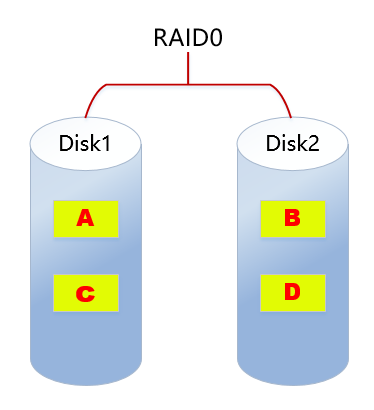
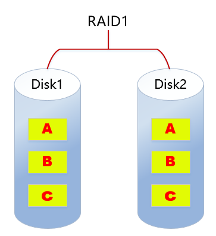
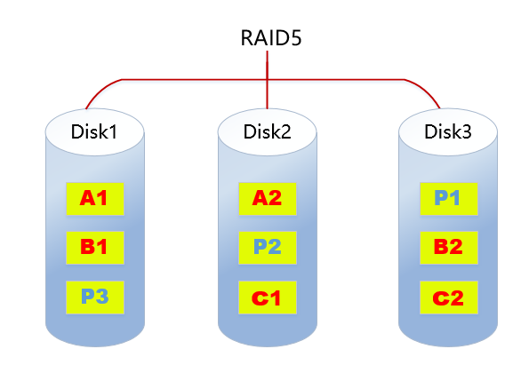
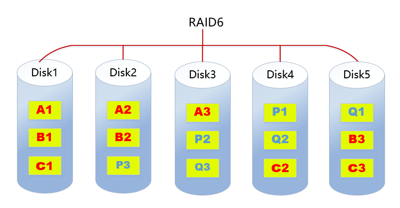
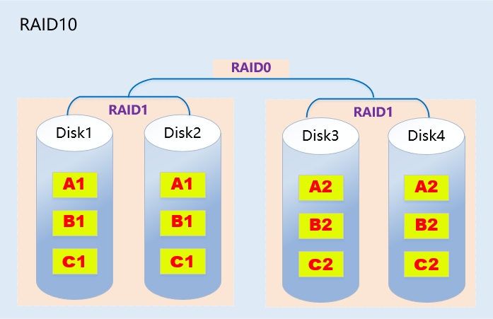
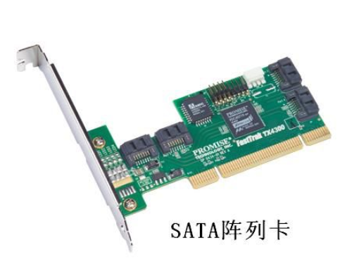
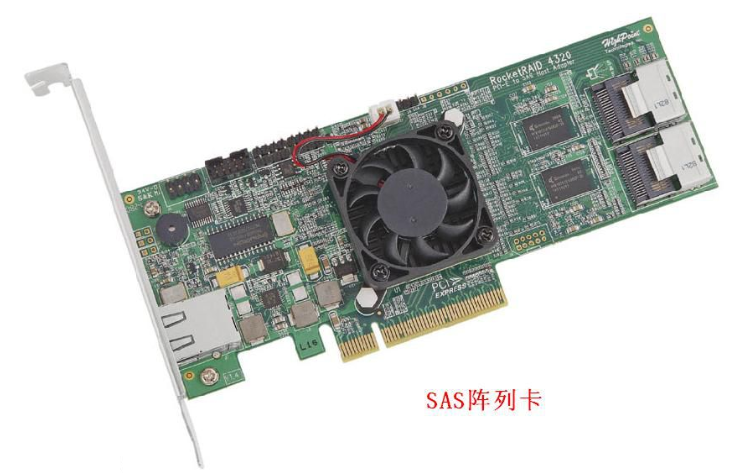
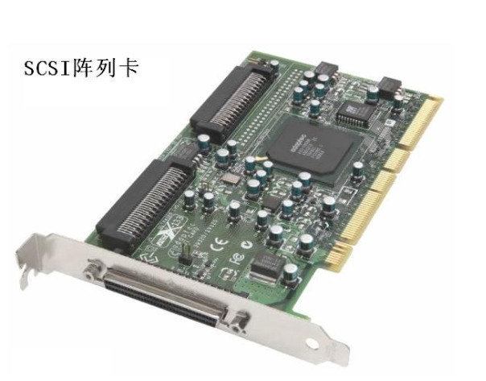

### 一、RAID介绍

RAID(Redundant Array of Independent Disk ==独立冗余磁盘阵列==)技术是加州大学伯克利分校1987年提出，最初是为了组合小的廉价磁盘来代替大的昂贵磁盘，同时希望磁盘失效时不会使对数据的访问受损失而开发出一定水平的数据保护技术。RAID就是一种由==多块廉价磁盘构成==的冗余阵列，在操作系统下是作为一个独立的==大型存储设备==出现。RAID可以充分发挥出多块硬盘的优势，可以==提升硬盘速度==，==增大容量==，提供==容错功能==，能够==确保数据安全性==，==易于管理==的优点，在任何一块硬盘出现问题的情况下都可以继续工作，不会 受到损坏硬盘的影响。

### 二、==常见的RAID级别==

#### 1. RAID0

 

**RAID0特点：**

- 至少需要两块磁盘
- 数据==条带化==分布到磁盘，==高的读写性能==，100%==高存储空间利用率==
- 数据==没有冗余策略==，一块磁盘故障，数据将无法恢复
- 应用场景：
  - 对性能要求高但对数据安全性和可靠性要求不高的场景，比如音频、视频等的存储。

#### 2. RAID1

 

**RAID1特点：**

- 至少需要2块磁盘
- 数据==镜像备份==写到磁盘上(工作盘和镜像盘)，==可靠性高==，磁盘利用率为50%
- 读性能可以，但写性能不佳
- 一块磁盘故障，不会影响数据的读写
- 应用场景：
  - 对数据安全可靠要求较高的场景，比如邮件系统、交易系统等。

#### 3. ==RAID5==

  

**RAID5特点：**

- 至少需要3块磁盘
- 数据==条带化==存储在磁盘，==读写性能好==，磁盘利用率为(n-1)/n
- 以奇偶校验(分散)做==数据冗余==
- 一块磁盘故障，可根据其他数据块和对应的校验数据重构损坏数据（消耗性能）
- 是目前综合==性能最佳==的==数据保护==解决方案
- 兼顾了存储性能、数据安全和存储成本等各方面因素（==性价比高==）
- 适用于大部分的应用场景

#### 4. RAID6

 

**RAID6特点：**

- 至少需要**4**块磁盘
- 数据==条带化==存储在磁盘，读取性能好，容错能力强
- 采用==双重校验==方式保证数据的安全性
- 如果==2块磁盘同时故障==，可以通过两个校验数据来重建两个磁盘的数据
- 成本要比其他等级高，并且更复杂
- 一般用于对数据安全性要求==非常高==的场合

#### 5. RAID10

  

**RAID10特点：**

- RAID10是raid1+raid0的组合
- 至少需要4块磁盘
- 两块硬盘为一组先做raid1，再将做好raid1的两组做raid0
- 兼顾==数据的冗余==（raid1镜像）和==读写性能==（raid0数据条带化）
- 磁盘利用率为50%，成本较高

#### 6. 总结

| 类型   | 读写性能                           | 可靠性            | 磁盘利用率  | 成本              |
| ------ | ---------------------------------- | ----------------- | ----------- | ----------------- |
| RAID0  | 最好                               | 最低              | 100%        | 较低              |
| RAID1  | 读正常；写两份数据                 | 高                | 50%         | 高                |
| RAID5  | 读:近似RAID0  写:多了校验          | RAID0<RAID5<RAID1 | (n-1)/n     | RAID0<RAID5<RAID1 |
| RAID6  | 读：近似RAID0  写:多了双重校验     | RAID6>RAID5       | RAID6<RAID5 | RAID6>RAID1       |
| RAID10 | 读：RAID10=RAID0  写：RAID10=RAID1 | 高                | 50%         | 最高              |

### 三、软硬RAID

#### 1. 软RAID

软RAID运行于==操作系统底层==，将SCSI或者IDE控制器提交上来的物理磁盘，虚拟成虚拟磁盘，再提交给管理程序来进行管理。软RAID有以下特点：

- 占用内存空间
- 占用CPU资源
- 如果程序或者操作系统故障就无法运行

**总结：**基于以上缺陷，所以现在企业很少用软raid。

#### 2. 硬RAID

通过用硬件来实现RAID功能的就是硬RAID，独立的RAID卡，主板集成的RAID芯片都是硬RAID。RAID卡就是用来实现RAID功能的板卡，通常是由I/O处理器、硬盘控制器、硬盘连接器和缓存等一系列零组件构成的。不同的RAID卡支持的RAID功能不同。支持RAlD0、RAID1、RAID4、RAID5、RAID10不等。 

 

 

 

### 四、软raid创建

#### 0. 环境准备

添加1个大小为20G的虚拟硬盘，并分10个分区。

#### 1. raid的创建

#####创建RAID==0==

~~~powershell
安装mdadm工具：
yum -y install mdadm

创建raid0：
[root@server ~]# mdadm --create /dev/md0 --raid-devices=2 /dev/sdc1 /dev/sdc2 --level=0
mdadm: Defaulting to version 1.2 metadata
mdadm: array /dev/md0 started.
或者
[root@server ~]# mdadm -C /dev/md0 -l 0 -n 2 /dev/sdc1 /dev/sdc2
-C:创建软raid
-l：指定raid级别
-n：指定raid中设备个数

查看RAID信息：
/proc/mdstat文件记录了所有raid信息
[root@server ~]# cat /proc/mdstat 
Personalities : [raid0] 
md0 : active raid0 sdc2[1] sdc1[0]
      2119680 blocks super 1.2 512k chunks
      
unused devices: <none>
查看指定的RAID信息：
[root@server ~]# mdadm -D /dev/md0
格式化挂载使用：
[root@server ~]# mkfs.ext4 /dev/md0
[root@server ~]# mount /dev/md0 /u01

测试：
[root@server ~]# iostat -m -d /dev/sdc[12] 2
[root@server ~]# dd if=/dev/zero of=/u01/file bs=1M count=1024

~~~

##### 创建RAID==1==

~~~powershell
创建raid1：
[root@server ~]# mdadm -C /dev/md1 -l1 -n 2 /dev/sdc[56]
查看状态信息：
[root@server ~]# watch -n 1 cat /proc/mdstat 	watch命令监控该文件变化情况,1秒钟显示一次
或者直接查看
[root@server ~]# cat /proc/mdstat 
Personalities : [raid0] [raid1] 
md1 : active raid1 sdc6[1] sdc5[0]
      1059200 blocks super 1.2 [2/2] [UU]
      [=====>...............]  resync = 25.2% (267520/1059200) finish=0.3min speed=38217K/sec
      以上信息说明两块盘在进行同步，100%说明同步完成
md0 : active raid0 sdc2[1] sdc1[0]
      2119680 blocks super 1.2 512k chunks
      
unused devices: <none>

[root@server ~]# cat /proc/mdstat 
Personalities : [raid0] [raid1] 
md1 : active raid1 sdc6[1] sdc5[0]
      1059200 blocks super 1.2 [2/2] [UU]		两个UU说明状态ok，一个盘故障则显示_U
      
md0 : active raid0 sdc2[1] sdc1[0]
      2119680 blocks super 1.2 512k chunks
      
unused devices: <none>

查看raid1详细信息
[root@server ~]# mdadm -D /dev/md1     

格式化挂载使用：
[root@server ~]# mkfs.ext4 /dev/md1
[root@server ~]# mount /dev/md1 /u02

测试验证热插拔：
1. 模拟一块盘故障（将磁盘标记为失效）
[root@server ~]# mdadm /dev/md1 -f /dev/sdc5
mdadm: set /dev/sdc5 faulty in /dev/md1

-f or --fail  表示失效

2. 查看raid1状态
[root@server ~]# cat /proc/mdstat 
Personalities : [raid0] [raid1] 
md1 : active raid1 sdc6[1] sdc5[0](F)			F表示失效失败
      1059200 blocks super 1.2 [2/1] [_U]		_表示有一块盘失效
      
md0 : active raid0 sdc2[1] sdc1[0]
      2119680 blocks super 1.2 512k chunks
      
unused devices: <none>

[root@server ~]# mdadm -D /dev/md1
。。。
  Number   Major   Minor   RaidDevice State
       0       0        0        0      removed
       1       8       38        1      active sync   /dev/sdc6

       0       8       37        -      faulty   /dev/sdc5	 失效盘等待移除
       
3. 移除故障或者失效硬盘（热拔）
[root@server ~]# mdadm /dev/md1 -r /dev/sdc5
mdadm: hot removed /dev/sdc5 from /dev/md1

-r or --remove 表示移除

[root@server ~]# mdadm -D /dev/md1
。。。
   Number   Major   Minor   RaidDevice State
       0       0        0        0      removed
       1       8       38        1      active sync   /dev/sdc6

4. 加入新的磁盘到raid1中（热插）
[root@server ~]# mdadm /dev/md1 -a /dev/sdc5
mdadm: added /dev/sdc5

-a or --add 表示增加

[root@server ~]# cat /proc/mdstat 
Personalities : [raid0] [raid1] 
md1 : active raid1 sdc5[2] sdc6[1]
      1059200 blocks super 1.2 [2/1] [_U]
      [====>................]  recovery = 21.4% (227392/1059200) finish=0.0min speed=227392K/sec
      
md0 : active raid0 sdc2[1] sdc1[0]
      2119680 blocks super 1.2 512k chunks
      
unused devices: <none>

~~~

##### 创建RAID==5==

~~~powershell
创建raid5:
[root@server ~]# mdadm -C /dev/md5 -l 5 -n 3 -x 1 /dev/sdc{7,8,9,10}
mdadm: Defaulting to version 1.2 metadata
mdadm: array /dev/md5 started.

-x, --spare-devices=  表示指定热备盘

[root@server ~]# cat /proc/mdstat 
Personalities : [raid0] [raid1] [raid6] [raid5] [raid4] 
md5 : active raid5 sdc9[4] sdc10[3](S) sdc8[1] sdc7[0]
      2117632 blocks super 1.2 level 5, 512k chunk, algorithm 2 [3/2] [UU_]
      [=====>...............]  recovery = 29.9% (317652/1058816) finish=0.3min speed=39706K/sec
等待同步完成再次查看：
[root@server ~]# cat /proc/mdstat 
Personalities : [raid0] [raid1] [raid6] [raid5] [raid4] 
md5 : active raid5 sdc9[4] sdc10[3](S) sdc8[1] sdc7[0]	S表示spare备份盘
      2117632 blocks super 1.2 level 5, 512k chunk, algorithm 2 [3/3] [UUU]

说明：热备盘表示当其中一块盘故障后，热备盘会立马顶上去，而不需要人为手动干预。

[root@server ~]# mdadm -D /dev/md5		查看详细信息
。。。
   Number   Major   Minor   RaidDevice State
       0       8       39        0      active sync   /dev/sdc7
       1       8       40        1      active sync   /dev/sdc8
       4       8       41        2      active sync   /dev/sdc9

       3       8       42        -      spare   /dev/sdc10

格式化挂载使用：
[root@server ~]# mkfs.ext4 /dev/md5
[root@server ~]# mount /dev/md1 /u03

查看空间使用情况：
[root@server ~]# df -h
Filesystem                Size  Used Avail Use% Mounted on
/dev/mapper/vg01-lv_root   18G  5.9G   11G  36% /
tmpfs                     931M     0  931M   0% /dev/shm
/dev/sda1                 291M   33M  244M  12% /boot
/dev/sr0                  4.2G  4.2G     0 100% /mnt
/dev/md0                  2.0G  1.1G  843M  57% /u01		利用率100%
/dev/md1                 1019M   34M  934M   4% /u02		利用率50%
/dev/md5                  2.0G   68M  1.9G   4% /u03		利用率(n-1)/n,即3-1/3*3g=2g

测试热备磁盘作用：
1. 标记一块活动盘失效
[root@server ~]# mdadm /dev/md5 -f /dev/sdc7
mdadm: set /dev/sdc7 faulty in /dev/md5

立即查看状态：
[root@server ~]# cat /proc/mdstat 
Personalities : [raid0] [raid1] [raid6] [raid5] [raid4] 
md5 : active raid5 sdc9[4] sdc10[3] sdc8[1] sdc7[0](F) 
说明：
sdc7(F)失效后，原来的sdc10(S)热备盘立马顶上去同步数据
      2117632 blocks super 1.2 level 5, 512k chunk, algorithm 2 [3/2] [_UU]
      [==>..................]  recovery = 13.0% (138052/1058816) finish=0.4min speed=34513K/sec
...            
unused devices: <none>

[root@server ~]# mdadm -D /dev/md5
...
  Number   Major   Minor   RaidDevice State
       3       8       42        0      active sync   /dev/sdc10
       1       8       40        1      active sync   /dev/sdc8
       4       8       41        2      active sync   /dev/sdc9

       0       8       39        -      faulty   /dev/sdc7
       
2. 移除失效的盘
[root@server ~]# mdadm /dev/md5 -r /dev/sdc7
mdadm: hot removed /dev/sdc7 from /dev/md5

[root@server ~]# cat /proc/mdstat 
Personalities : [raid0] [raid1] [raid6] [raid5] [raid4] 
md5 : active raid5 sdc9[4] sdc10[3] sdc8[1]
      2117632 blocks super 1.2 level 5, 512k chunk, algorithm 2 [3/3] [UUU]

3. 为了日后考虑，再次添加一个热备盘到raid5中
[root@server ~]# mdadm /dev/md5 -a /dev/sdc7
mdadm: added /dev/sdc7

课堂作业：
1. 创建一个raid5，raid5至少由3块磁盘设备组成
2. 模拟1块设备故障，检查raid5是否可以正常使用

~~~

#### 2. 保存RAID信息

~~~powershell
问：为什么要保存raid信息？
答：如果不做信息的保存，重启系统后raid不能自动被识别到（在rhel6里测试为重启后名字会变）。
1. 创建配置文件
[root@server ~]# vim /etc/mdadm.conf 
DEVICES /dev/sdc[1256789]
说明：该配置文件默认没有，手动创建，里面写上做了raid的所有硬盘设备。

2. 扫描raid信息保存到配置文件
[root@server ~]# mdadm -D --scan >> /etc/mdadm.conf 
[root@server ~]# cat /etc/mdadm.conf 
DEVICES /dev/sdc[1256789]
ARRAY /dev/md0 metadata=1.2 name=web.itcast.cc:0 UUID=3379fd89:1e427f0b:63b0c984:1615eee0
ARRAY /dev/md1 metadata=1.2 name=server:1 UUID=e3547ea1:cca35c51:11894931:e90525d7
ARRAY /dev/md5 metadata=1.2 name=server:5 UUID=18a60636:71c82e50:724a2a8f:e763fdcf

~~~

#### 3. raid停止与启动

~~~powershell
以RAID5为例说明：
停止raid:
1. 卸载raid
[root@server ~]# umount /u03
2. 使用命令停止raid
[root@server ~]# mdadm --stop /dev/md5
mdadm: stopped /dev/md5

启动raid：
1. 配置文件(/etc/mdadm.conf)存在如下启动
[root@server ~]# mdadm -A /dev/md5
mdadm: /dev/md5 has been started with 3 drives.

-A：Assemble a pre-existing array  表示装载一个已存在的raid

2. 配置文件(/etc/mdadm.conf)不存在如下启动
[root@server ~]# mdadm -A /dev/md5 /dev/sdc[789]
mdadm: /dev/md5 has been started with 3 drives.

3. 如果设备名不知道，可以去查看每个设备的raid信息，使用uuid把raid设备重新组合
[root@server ~]# mdadm -E /dev/sdc7
/dev/sdc7:
          Magic : a92b4efc
        Version : 1.2
    Feature Map : 0x0
     Array UUID : 18a60636:71c82e50:724a2a8f:e763fdcf
 说明：同一个raid里每个磁盘查看的UUID都是这个值
。。。
[root@server ~]# mdadm -E /dev/sdc8
/dev/sdc8:
          Magic : a92b4efc
        Version : 1.2
    Feature Map : 0x0
     Array UUID : 18a60636:71c82e50:724a2a8f:e763fdcf

通过以上方法找到后进行重新组合，如下：
[root@server ~]# mdadm -A --uuid=18a60636:71c82e50:724a2a8f:e763fdcf /dev/md5
mdadm: /dev/md5 has been started with 3 drives.

~~~

#### 4. raid的删除

~~~powershell
1. 卸载设备
[root@server ~]# umount /u03
2. 移除所有磁盘
[root@server ~]# mdadm /dev/md5 -f /dev/sdc[789]
mdadm: set /dev/sdc7 faulty in /dev/md5
mdadm: set /dev/sdc8 faulty in /dev/md5
mdadm: set /dev/sdc9 faulty in /dev/md5
[root@server ~]# mdadm /dev/md5 -r /dev/sdc[789]
mdadm: hot removed /dev/sdc7 from /dev/md5
mdadm: hot removed /dev/sdc8 from /dev/md5
mdadm: hot removed /dev/sdc9 from /dev/md5

3. 停止raid
[root@server ~]# mdadm --stop /dev/md5
mdadm: stopped /dev/md5

4. 擦出超级块（superblock）清除相关信息
[root@server ~]# mdadm --misc --zero-superblock /dev/sdc[789]

~~~

#### 5. 课后练习

创建RAID10并做相关的测试验证。

### 五、磁盘管理总结

 