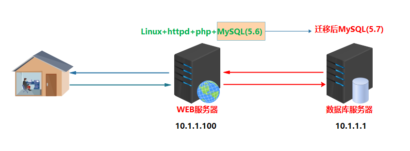
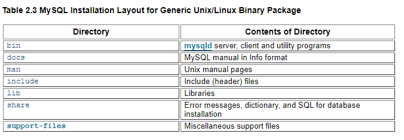
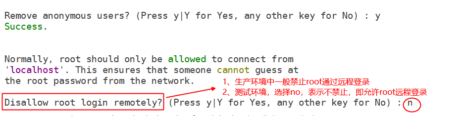
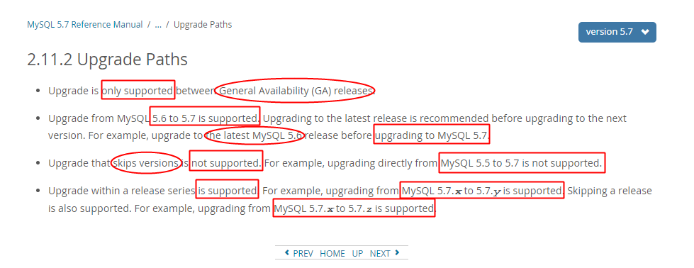

#任务背景

## 一、真实案例

​	某公司现在有几套不同版本的MySQL数据库，现在大部分的生产和测试环境都已经切换到5.7版本，由于历史原因，有一套测试环境版本为MySQL-5.5。现为了将测试环境版本统一，需要将原来测试环境数据库MySQL-==5.5==版本升级到现在的MySQL-==5.7.31==，并且保证数据完整。

​														——来自深圳2期马同学公司需求

## 二、案例背后的核心技术

1）不同版本MySQL的安装（花样安装MySQL）

2）MySQL数据库版本升级（升级需要注意什么）

3）如何经过自己思考，找到一种合适的解决方案

## 三、今日任务场景

​	由于用户访问量以及用户数据越来越多，原有的单机服务器（LAMP环境）已不能满足需求，在

需要保证数据完整的前提下，现需要将原有==数据库迁移==到另外一台单独的服务器上。迁移后，保证业务正常访问。

| 服务器角色        | IP         | 系统版本  | 数据库版本   |
| ----------------- | ---------- | --------- | ------------ |
| 老服务器（LAMP）  | 10.1.1.100 | Centos7.6 | MySQL-5.6.47 |
| 新服务器（MySQL） | 10.1.1.1   | Centos7.6 | MySQL-5.7.31 |

#任务要求

1. 在业务维护时间段对数据库进行==备份==
2. 将MySQL数据库从老服务器（LAMP）中迁移到新的单独MySQL数据库服务器，版本升级为5.7.31



#任务拆解

1. 新服务器安装Centos7.6，并且==安装MySQL-5.7.31==版本数据库
2. 停止监控、停止前端应用、停止MySQL数据库
3. 备份数据库（省略）
4. 迁移数据库——>同步数据库文件到新的环境中（rsync/scp）
5. 测试验证

#涉及知识点

1. 官方下载mysql软件包（根据需求）
2. MySQL数据库的安装部署
3. MySQL数据库管理员用户root密码的设置及修改
4. mysql客户端工具的使用

#理论储备

##一、MySQL概述

###1、关系型数据库

- RDBMS（relational database management system），既关系型数据库管理系统
- 简单来说，关系型数据库，是指采用了==二维表格==来组织数据的数据库。


- **常见的关系型数据库**

==oracle、mysql==、DB2（IBM）、Sybase、==SQL server==（Microsoft微软）、IBM Informix

关系型数据库的**最大特点就是==事务的一致性==**：所以也在对事物一致性的维护中有很大的开销.

###2、事务概述

#### ㈠ 什么是事务？

1）事务由一条或者多条sql语句组成；

2）在事务中的操作，这些sql语句要么都成功执行，要么都不执行，这就是一个事务。 

==举例说明：==

1.     登陆ATM机，输入密码； 
2.     连接数据库，验证密码； 
3.     验证成功，获得用户信息，比如存款余额等； 
4.     用户输入需要转账的金额，按下确认键；
5.     ==从后台数据库中减掉用户账户上的对应金额（update语句）；== 
6.     ==从后台数据库中给对方账户增加相应的金额（update语句）；== 
7.     确认，退卡，走人；

#### ㈡ 事务特点(ACID）

- 原子性(Atomicity)：

  事务中的全部操作在数据库中是不可分割的，要么==全部完成==，要么==均不执行==。

- 一致性(Consistency)：

  指事务必须使数据库从一个一致性状态变换到另一个一致性状态，也就是说一个事务执行之前和执行之后都必须处于一致性状态，不能破坏关系数据的完整性以及业务逻辑上的一致性。

- 隔离性(Isolation)：

  一个事务的执行不受其他事务的干扰，事务执行的中间结果对其他事务必须是透明的。隔离性是当多个用户并发访问数据库时，比如操作同一张表时，数据库为每一个用户开启的事务，不能被其他事务的操作所干扰，多个并发事务之间要相互隔离。 

- 持久性(Durability)：

  持久性是指一个事务一旦被提交了，那么对数据库中的数据的改变就是永久性的，即便是在数据库系统遇到故障的情况下也不会丢失提交事务的操作。 

#### ㈢ 应用场景

对数据的==一致性==要求较高;典型的==银行及支付系统类==；

###3、MySQL数据库介绍

- MySQL是一种关系型数据库管理系统
- 由瑞典MySQL AB 公司开发，目前属于Oracle旗下
- MySQL是C/S架构

###4、MySQL数据库版本

- **社区版：MySQL Community Edition  (==GPL==) **
  1. 可以看做是企业版的“广泛体验版（小白鼠版）”，未经各个专有系统平台的压力测试和性能测试
  2. 基于GPL协议发布，可以随意下载使用 
  3. 没有任何官方技术支持服务 

- **企业版：MySQL Enterprise Edition(==commercial==) **
  1. 提供了比较全面的高级功能、管理工具及技术支持 
  2. 安全性、稳定性、可扩展性比较好

- **集群版：MySQL Cluster CGE(==commercial==) **

**扩充：关于版本的命名方式如何定义？**

| 版本                       | 说明                                                         |
| -------------------------- | ------------------------------------------------------------ |
| α（Alpha）版               | 内测版，内部交流或者专业测试人员测试用。Bug较多，普通用户最好不要安装。 |
| β（Beta）版                | 公测版，专业爱好者大规模测试用，存在一些缺陷，该版本也不适合一般用户安装。 |
| γ ( Gamma )版              | 相当成熟的测试版，与即将发行的正式版相差无几。               |
| ==Final==                  | 正式版本                                                     |
| Free                       | 自由版本                                                     |
| ==Release==                | 发行版本                                                     |
| ==Standard==               | 标准版本                                                     |
| ==Mini==                   | 迷你精简版本,只有最基本的功能                                |
| Upgrade                    | 升级版本                                                     |
| ==GA(GenerallyAvailable)== | 开发团队认为该版本是稳定版,可以在较为关键的场合使用。        |
| Retail                     | 零售版                                                       |

###5、MySQL的获取

官网：www.mysql.com

###6、MySQL的安装方式

####㈠ 二进制方式安装

- RPM版本

命名：mysql-community-server-5.7.28-1.el7.x86_64.rpm ，需要在特定linux版本下安装。

- ==基于glibc版本==

命名：==mysql-5.7.28-linux-glibc2.12-x86_64.tar.gz== 

依赖[^glibc]库，可以安装在通用的Linux系统下

####㈡ 源代码编译安装

命名：mysql-5.7.31.tar.gz，通用的Linux下都可以编译安装。

####㈢ 安装方式总结

| 安装方式 | 优点                             | 缺点                                      |
| -------- | -------------------------------- | ----------------------------------------- |
| rpm      | 安装卸载简单                     | 可定制性差                                |
| glibc    | 可定制性相比rpm包灵活些          | 安装相比rpm包复杂些，需要手动初始化数据库 |
| 源码安装 | 可定制性最强，根据需求和功能定制 | 安装麻烦，需要手动初始化数据库            |

### 7、区分数据库和数据库实例

#### ㈠ 什么是MySQL数据库？

**数据库（database）：** 操作系统或存储上的==数据文件的集合==。mysql数据库中，数据库文件可以是* .frm、*.MYD、*.MYI、*.ibd等结尾的文件， 不同存储引擎文件类型不同。

#### ㈡ 什么是MySQL数据库实例？

**数据库实例（instance）：** 由==后台进程或者线程==以及一个==共享内存区==组成。共享内存可以被运行的后台线程所共享。 数据库实例才是真正操作数据库的。

注意：MySQL的后台守护程序==mysqld==是单进程多线程的工作模式。

#### ㈢ 什么是MySQL数据库服务器？

**数据库服务器(database server)：**部署==安装数据库实例==的服务器。

#### ㈣ 数据库和数据库实例之间的关系是什么？

通常情况下，数据库实例和数据库是一一对应的关系，也就是==一个数据库实例对应一个数据库==； 但是，在集群环境中存在==多个数据库实例共同使用一个数据库==。oracle RAC

##二、MySQL数据库的安装

###1、glibc方式安装

####㈠ 安装须知

- 软件包介绍

~~~powershell
mysql-5.7.31-linux-glibc2.12-x86_64.tar.gz
说明：通用linux下的二进制包，已编译好，只需放到相应的安装目录里即可
~~~

- 依赖库安装

```powershell
shell> yum install libaio
说明：如果已安装则可以忽略，没安装需要安装
```

 

- 默认相关选项

| 默认安装信息 | 默认存放位置          |
| ------------ | --------------------- |
| 安装路径     | /usr/local/mysql      |
| 数据目录     | /usr/local/mysql/data |
| 端口号       | 3306                  |
| socket文件   | /tmp/mysql.sock       |

####㈡ 安装步骤

参考官当：[MySQL-glibc安装手册](<https://dev.mysql.com/doc/refman/5.7/en/binary-installation.html>)

##### ① 安装需求

| 安装路径 | /mysql_3306      |
| -------- | ---------------- |
| 数据路径 | /mysql_3306/data |
| 端口号   | 3306             |

#####② 创建mysql用户

```powershell
[root@node1 ~]# useradd -rs /sbin/nologin mysql
[root@node1 ~]# id mysql
uid=998(mysql) gid=996(mysql) groups=996(mysql)
```

##### ③ 拷贝程序到安装目录

1）清空环境

```powershell
[root@node1 ~]# rm -f /etc/my.cnf
```

2）创建安装目录

```powershell
[root@node1 ~]# mkdir /mysql_3306
```

3）解压软件并拷贝到安装位置

```powershell
[root@node1 src]# pwd
/usr/src
[root@node1 src]# tar -xf mysql-5.7.31-linux-glibc2.12-x86_64.tar.gz
[root@node1 src]# mv mysql-5.7.31-linux-glibc2.12-x86_64/* /mysql_3306/
说明：将数据文件移动或拷贝到mysql的安装路径后，说明mysql数据库已经安装完成！！
```

##### ④ 修改文件的权限

```powershell
[root@node1 src]# cd /mysql_3306/
[root@node1 mysql_3306]# mkdir mysql-files
[root@node1 mysql_3306]# chown mysql:mysql mysql-files
[root@node1 mysql_3306]# chmod 750 mysql-files
说明：
mysql-files目录为secure_file_priv系统变量提供一个位置 ，该位置将导入和导出操作限制到特定目录。
```

##### ⑤ 初始化数据库

```powershell
[root@node1 mysql_3306]# bin/mysqld --initialize --user=mysql --basedir=/mysql_3306
特别注意：
如果更改了mysql的默认安装路径，则需要加--basedir=mysql安装路径来指定
```

##### ⑥ 设置安全加密连接

```powershell
[root@node1 mysql_3306]# bin/mysql_ssl_rsa_setup --datadir=/mysql_3306/data
特别注意：
由于更改了mysql的默认安装路径，则需要加--datadir=mysql数据路径来指定。
```

##### ⑦ 启动数据库

1）拷贝脚本文件到指定路径，并修改脚本文件里mysql的安装和数据目录

```powershell
[root@node1 mysql_3306]# cp support-files/mysql.server /etc/init.d/mysql_3306
[root@node1 mysql_3306]# grep -A 1 "^basedir" /etc/init.d/mysqld
basedir=/mysql_3306
datadir=/mysql_3306/data
注意：根据自己的安装位置和数据目录位置修改
```

2）启动数据库服务

```powershell
[root@node1 mysql_3306]# service mysqld start
```

3）查看端口是否监听

```powershell
[root@node1 mysql_3306]# netstat -nltp|grep 3306
```

#### ㈢ 安装完后续配置

##### ① 更改数据库管理员密码

- **方法1：**

```powershell
[root@node1 mysql_3306]# bin/mysqladmin -uroot password '123' -p
Enter password:输入刚刚初始化产生的临时密码
```

- **方法2**

```powershell
mysql> set password=password('456');   		//未来版本将会弃用
或者
mysql> set password='123';					//推荐
```

##### ② 配置环境变量

```powershell
[root@node1 mysql_3306]# echo "export PATH=$PATH:/mysql_3306/bin" >> /etc/profile
[root@node1 mysql_3306]# source /etc/profile
```

##### ③ 编写配置文件

```powershell
[root@node1 mysql_3306]# cat /mysql_3306/my.cnf
[mysqld]
basedir=/mysql_3306
datadir=/mysql_3306/data
socket=/tmp/mysql.sock
```

##### ④ 数据库安全配置

```powershell
[root@node1 mysql_3306]# mysql_secure_installation
```



###2、源码编译安装

参考官当：[MySQL-Source安装配置手册](https://dev.mysql.com/doc/refman/5.6/en/source-configuration-options.html)

**源码安装三步曲：配置——>编译——>安装**

####㈠ 安装须知

- 软件包介绍

~~~powershell
mysql-5.7.31.tar.gz						可在任意发行版的Linux下安装
~~~

#### ㈡  安装需求

| 安装需求            | 具体配置            |
| ------------------- | ------------------- |
| 安装目录（basedir） | /mysql_3307         |
| 数据目录（datadir） | /mysql_3307/data    |
| 端口号              | 3307                |
| socket文件位置      | $basedir/mysql.sock |
| 字符集              | utf8mb4             |

####㈢ ==了解配置选项==

- 常用配置选项

| 配置选项             | 描述                             | 默认值            | 建议值                                  |
| -------------------- | -------------------------------- | ----------------- | --------------------------------------- |
| CMAKE_INSTALL_PREFIX | 安装基目录(basedir)              | /usr/local/mysql  | 根据需求                                |
| MYSQL_DATADIR        | 数据目录(datadir)                | $basedir/data     | 根据需求                                |
| SYSCONFDIR           | 默认配置文件my.cnf路径           |                   | /etc                                    |
| MYSQL_TCP_PORT       | TCP/IP端口                       | 3306              | 非默认端口                              |
| MYSQL_UNIX_ADDR      | 套接字socket文件路径             | /tmp/mysql.sock   | $basedir/                               |
| DEFAULT_CHARSET      | 默认字符集                       | latin1            | **utf8mb4**                             |
| DEFAULT_COLLATION    | 默认校验规则                     | latin1_swedish_ci | utf8mb4_general_ci                      |
| WITH_EXTRA_CHARSETS  | 扩展字符集                       | all               | all                                     |
| ENABLED_LOCAL_INFILE | 是否启用本地加载外部数据文件功能 | OFF               | 建议开启                                |
| WITH_SSL             | SSL支持类型                      | system            | 建议显式指定                            |
| WITH_BOOST           | Boost库源代码的位置              |                   | Boost库是构建MySQL所必需的,建议事先下载 |

- 存储引擎相关配置项

**说明：**

以下选项值均为布尔值，0或1；0代表不编译到服务器中，1代表编译，建议都静态编译到服务器中。

其他的存储引擎可以根据实际需求在安装时通过WITH_xxxx_STORAGE_ENGINE=1的方式编译到服务器中。

| 配置选项                      | 描述                                                         |
| ----------------------------- | ------------------------------------------------------------ |
| WITH_INNOBASE_STORAGE_ENGINE  | 将InnoDB存储引擎插件构建为静态模块编译到服务器中；建议编译到服务器中 |
| WITH_PARTITION_STORAGE_ENGINE | 是否支持分区                                                 |
| WITH_FEDERATED_STORAGE_ENGINE | 本地数据库是否可以访问远程mysql数据                          |
| WITH_BLACKHOLE_STORAGE_ENGINE | 黑洞存储引擎，接收数据，但不存储，直接丢弃                   |
| WITH_MYISAM_STORAGE_ENGINE    | 将MYISAM存储引擎静态编译到服务器中                           |

####㈣ 安装步骤

##### ① 安装依赖包

1）安装相关依赖软件

~~~powershell
# yum -y install ncurses-devel cmake libaio-devel openssl-devel
说明：环境不一样，可能还需要安装其他依赖包，比如perl相关的包，自行解决。
~~~

2）下载Boost库源代码（选做）

```powershell
wget http://www.sourceforge.net/projects/boost/files/boost/1.59.0/boost_1_59_0.tar.gz
```

#####② 解压软件包

~~~powershell
[root@node1 src]# pwd
/usr/src
[root@node1 src]# tar xf mysql-5.7.31.tar.gz
~~~

##### ③ 根据需求进行配置

1）==进入到解压目录里配置==

```powershell
[root@node1 src]# cd mysql-5.7.31/
[root@node1 mysql-5.7.31]# pwd
/usr/src/mysql-5.7.31
```

2）编写脚本文件进行配置（不容易出错）

~~~powershell
[root@node1 mysql-5.7.31]# vim myconfig.sh 
cmake . \
-DCMAKE_INSTALL_PREFIX=/mysql_3307 \
-DMYSQL_DATADIR=/mysql_3307/data \
-DMYSQL_TCP_PORT=3307 \
-DMYSQL_UNIX_ADDR=/mysql_3307/mysql.sock \
-DWITH_INNOBASE_STORAGE_ENGINE=1 \
-DWITH_PARTITION_STORAGE_ENGINE=1 \
-DWITH_FEDERATED_STORAGE_ENGINE=1 \
-DWITH_BLACKHOLE_STORAGE_ENGINE=1 \
-DWITH_MYISAM_STORAGE_ENGINE=1 \
-DENABLED_LOCAL_INFILE=1 \
-DEXTRA_CHARSETS=all \
-DDEFAULT_CHARSET=utf8mb4 \
-DDEFAULT_COLLATION=utf8mb4_general_ci \
-DWITH_SSL=system \
-DWITH_BOOST=/mysql_3307/boost \
-DDOWNLOAD_BOOST=1（如果已经下载好，则不用再次下载）

[root@node1 mysql-5.7.31]# chmod +x myconfig.sh
[root@node1 mysql-5.7.31]# ./myconfig.sh
注意：
如果事先已经下载好了boost_1_59_0.tar.gz，则只需要-DWITH_BOOST=指定解压后的路径即可。
~~~

#####④ 编译并安装

~~~powershell
[root@node1 mysql-5.7.31]# make && make install
~~~

#####⑤ 初始化数据库

**注意：**进入到==安装目录==里/mysql_3307

1）进入到安装目录

```powershell
[root@node1 mysql-5.7.31]# cd /mysql_3307
[root@node1 mysql_3307]# pwd
/mysql_3307
```

2）创建系统变量`secure_file_priv`限制导入导出目录并修改权限

~~~powershell
[root@node1 mysql_3307]# mkdir mysql-files
[root@node1 mysql_3307]# chown -R mysql:mysql /mysql_3307
[root@node1 mysql_3307]# chmod 750 mysql-files
~~~

3）初始化数据库

```powershell
[root@node1 mysql_3307]# bin/mysqld --initialize --user=mysql --basedir=/mysql_3307 --datadir=/mysql_3307/data
注意：
千万注意需要指定当前数据库的安装路径和数据路径！
```

#####⑥ 启动数据库

~~~powershell
拷贝启动脚本到/etc/init.d/目录里
[root@node1 mysql_3307]# cp support-files/mysql.server /etc/init.d/mysql_3307
[root@node1 mysql_3307]# service mysql_3307 start
Starting MySQL. SUCCESS!
~~~

####㈤ ==安装完后续配置==

##### ① 编写配置文件

```powershell
[root@node1 mysql_3307]# vim /mysql_3307/my.cnf
[mysqld]
basedir=/mysql_3307
datadir=/mysql_3307/data
socket=/mysql_3307/mysql.sock
```

##### ② 设置数据库管理员密码

```powershell
[root@node1 mysql_3307]# bin/mysqladmin -uroot password '123' -p
Enter password:输入初始化临时产生的密码（不显示）

或者进入mysql后，设置密码
mysql> set password='456';
```

## 三、客户端工具使用

### 1、如何访问不同的数据库？

**方法一：**直接使用==**对应的客户**==端软件访问

```powershell
访问5.7.31版本数据库：
[root@node1 ~]# /mysql_3306/bin/mysql -uroot -p
Enter password:
Welcome to the MySQL monitor.  Commands end with ; or \g.
Your MySQL connection id is 3
Server version: 5.7.31 MySQL Community Server (GPL)

访问5.7.31版本数据库：
[root@node1 ~]# /mysql_3307/bin/mysql -uroot -p
Enter password:
Welcome to the MySQL monitor.  Commands end with ; or \g.
Your MySQL connection id is 7
Server version: 5.7.31 Source distribution

```

**方法二：**==定义别名==的方式访问

```powershell
[root@node1 ~]# alias mysql_3306="/mysql_3306/bin/mysql"
[root@node1 ~]# alias mysql_3307="/mysql_3307/bin/mysql"
[root@node1 ~]# mysql_3306 -uroot -p
Enter password:
Welcome to the MySQL monitor.  Commands end with ; or \g.
Your MySQL connection id is 4
Server version: 5.7.31 MySQL Community Server (GPL)

[root@node1 ~]# mysql_3307 -uroot -p
Enter password:
Welcome to the MySQL monitor.  Commands end with ; or \g.
Your MySQL connection id is 8
Server version: 5.7.31 Source distribution
```

**方法三：**==拷贝相应命令==到PATH可以识别的路径下==并重命名==

```powershell
[root@node1 ~]# unalias mysql_3306
[root@node1 ~]# unalias mysql_3307
+++++++++++++++++++++我是华丽分隔符+++++++++++++++++++++++++++
[root@node1 ~]# cp /mysql_3306/bin/mysql /usr/bin/mysql_3306
[root@node1 ~]# cp /mysql_3307/bin/mysql /usr/bin/mysql_3307
[root@node1 ~]# which mysql_3306
/usr/bin/mysql_3306
[root@node1 ~]# which mysql_3307
/usr/bin/mysql_3307
```

**深度思考：**我们之所以能够连接到数据库里的**==本质==**是什么？


### 2、客户端工具mysql使用

```powershell
mysql: mysql命令行工具，一般用来连接访问mysql数据库
```

| 选项               | 说明                                       |
| ------------------ | ------------------------------------------ |
| -u, --user=name    | 指定登录用户名                             |
| -p, --password     | 指定登录密码(注意是小写p),一定要放到最后面 |
| -h, --host=name    | 指定数据库的主机地址                       |
| -P, --port=xxx     | 指定数据库的端口号(大写P)                  |
| -S, --socket=name  | 指定socket文件                             |
| -e, --execute=name | 使用非交互式操作(在shell终端执行sql语句)   |

**扩展了解：**

| 默认库             | 描述                                                         |
| ------------------ | ------------------------------------------------------------ |
| information_schema | 1、==对象信息数据库==，提供对数据库元数据的访问 ，有关MySQL服务器的信息，例如数据库或表的名称，列的数据类型或访问权限等；<br>2、在INFORMATION_SCHEMA中，有数个只读表，它们实际上是视图，而不是基本表，因此你将无法看到与之相关的任何文件；<br>3、视图，是一个虚表，即视图所对应的数据不进行实际存储，数据库中只存储视图的定义，在对视图的数据进行操作时，系统根据视图的定义去操作与视图相关联的基本表 |
| mysql              | 1、mysql数据库是==系统数据库==。它包含存储MySQL服务器运行时所需的信息的表。比如权限表、对象信息表、日志系统表、时区系统表、优化器系统表、杂项系统表等。<br>2、==不可以删除==,也不要轻易修改这个数据库里面的表息。 |
| performance_schema | MySQL5.5开始新增一个数据库，主要用于==收集数据库服务器性能==；并且库里表的存储引擎均PERFORMANCE_SCHEMA，而用户是不能创建存储引擎为PERFORMANCE_SCHEMA的表 |
| sys                | 1、mysql5.7增加了sys 系统数据库，通过这个库可以快速的了解系统的元数据信息；<br>2、sys库方便DBA发现数据库的很多信息，解决性能瓶颈；<br>3、这个库是通过视图的形式把information_schema 和performance_schema结合起来，查询出更加令人容易理解的数据 |

### 3、客户端工具mysqladmin使用

```powershell
mysqladmin：客户端管理mysql数据库工具
```

#### ㈠ 常用选项

| 选项              | 描述                 |
| ----------------- | -------------------- |
| -h, --host=name   | 指定连接数据库主机   |
| -p, --password    | 指定数据库密码       |
| -P, --port=#      | 指定数据库端口       |
| -S, --socket=name | 指定数据库socket文件 |
| -u, --user=name   | 指定连接数据库用户   |

#### ㈡ 常用命令

| 命令                    | 描述                          |
| ----------------------- | ----------------------------- |
| password [new-password] | 更改密码                      |
| reload                  | 刷新授权表                    |
| shutdown                | 停止mysql服务                 |
| status                  | 简短查看数据库状态信息        |
| start-slave             | 启动slave                     |
| stop-slave              | 停止slave                     |
| variables               | 打印可用变量                  |
| version                 | 查看当前mysql数据库的版本信息 |

#### ㈢ 举例说明

```powershell
关闭数据库
[root@node1 ~]# mysqladmin shutdown -p
默认修改数据库管理员root密码
[root@node1 ~]# mysqladmin password 'newpass' -p
[root@node1 ~]# mysqladmin password '123' -uroot -h localhost -p

查看扩展信息，比如变量
[root@node1 ~]# mysqladmin proc extended-status -p
创建数据库
[root@node1 ~]# mysqladmin create db01 -p
删除数据库
[root@node1 ~]# mysqladmin drop db01 -p
```

##四、如何重置管理员root密码

**敲黑板：**找问题的解决方法很重要！

### 1、跳过授权表（通用）

#### ㈠ 跳过授权表重启数据库

##### ① 关闭数据库

```powershell
[root@node1 ~]# mysqladmin shutdown -p
Enter password:
```

##### ② 跳过授权表启动

**友情提示：**启动过程可能会一波三折，冷静分析看报错，必能解决！

```powershell
# /mysql_3306/bin/mysqld --defaults-file=/mysql_3306/my.cnf --skip-grant-tables --skip-networking=on  --user=mysql &
```

#### ㈡ 刷新授权表（重要）

```powershell
mysql> flush privileges;
Query OK, 0 rows affected (0.00 sec)
```

#### ㈢ 修改密码

```powershell
mysql> alter user 'root'@'localhost' identified by '123';
Query OK, 0 rows affected (0.00 sec)
```

**==补充：==**如果未能成功，则使用以下语句修改密码

```powershell
mysql> UPDATE mysql.user SET authentication_string = PASSWORD('MyNewPass')
WHERE User = 'root' AND Host = 'localhost';
mysql> FLUSH PRIVILEGES;
```

### 2、Unix和类Unix系统重置

#### ㈠ 停止数据库

```powershell
[root@node1 ~]# mysqladmin shutdown -p
Enter password:
```

#### ㈡ 编写创建密码语句到文件

```powershell
# echo "ALTER USER 'root'@'localhost' IDENTIFIED BY '123';" >> /mysql_3306/mysql.pass
注意：该文件一定要对启动用户如mysql有所有权限
# chown -R mysql. /mysql_3306
```

#### ㈢ 指定密码文件启动数据库

```powershell
# mysqld --defaults-file=/mysql_3306/my.cnf --init-file=/mysql_3306/mysql.pass  --user=mysql &
```

#### ㈣ 删除密码文件，并测试

```powershell
# rm -f /mysql_3306/mysql.pass
# mysql -uroot -p
```

## 五、数据库升级

**敲黑板：**找解决方案很重要！

### 1、升级前须知




### 2、根据实际情况找方案

#### ㈠ 当前实际情况


#### ㈡ 此次任务解决方案

1、就地升级后——>迁移数据到新服务器

2、新服务器安装新版本软件——>导入业务数据

### 3、落地实现


#### ㈠ 环境说明

| 服务器角色              | 数据库版本             | IP地址     | 主机名        |
| ----------------------- | ---------------------- | ---------- | ------------- |
| 原WEB服务器（LAMP）     | MySQL-5.6.47           | 10.1.1.100 | web.heima.cc  |
| 新数据库服务器（MySQL） | MySQL-5.7.25（已安装） | 10.1.1.1   | db01.heima.cc |

#### ㈡ 停止前端业务(web服务)

```powershell
[root@web ~]# systemctl stop httpd
```

#### ㈢ 从原数据库中导出所有数据(5.6.47)

```powershell
[root@web ~]# mysqldump -u root -p --add-drop-table --all-databases --force > /tmp/old_data_full.sql

[root@web ~]# systemctl stop mysqld		//转储完毕，停止原数据库服务
```

| 选项             | 描述                                                    |
| ---------------- | ------------------------------------------------------- |
| --add-drop-table | 在每个create table语句前执行drop table                  |
| --all-databases  | 转储所有数据库中的所有表                                |
| --force          | 忽略所有错误；即使在表转储期间发生SQL错误，也要继续操作 |

#### ㈣ 拷贝原所有数据到新数据库服务器

##### ① 确保新数据库服务器正常

**新数据库环境说明：**

| IP       | hostname      | basedir     | datadir       | port | socket          | version      |
| -------- | ------------- | ----------- | ------------- | ---- | --------------- | ------------ |
| 10.1.1.1 | db01.heima.cc | /mysql_3306 | $basedir/data | 3306 | /tmp/mysql.sock | mysql-5.7.25 |

**当前数据库状态：**

```powershell
[root@db01 ~]# netstat -nltp|grep 3306
tcp6       0      0 :::3306                 :::*                    LISTEN      7453/mysqld
[root@db01 ~]# mysql_3306 -uroot -e 'show databases;' -p
Enter password:
+--------------------+
| Database           |
+--------------------+
| information_schema |
| mysql              |
| performance_schema |
| sys                |
+--------------------+
```

##### ② 远程拷贝转储文件到新服务器

```powershell
[root@web ~]# scp /tmp/old_data_full.sql 10.1.1.1:/tmp/
```

#### ㈤ 导入数据到新的数据库中

```powershell
[root@db01 ~]# mysql_3306 -uroot -p < /tmp/old_data_full.sql
Enter password:
```

#### ㈥ 刷新授权表

```powershell
[root@db01 ~]# mysqladmin flush-privileges -uroot -p
```

#### ㈦ 检查所有表是否与当前版本不兼容

```powershell
[root@db01 ~]# mysql_upgrade -p
```

#### ㈧ 修改应用程序指向新数据库

```powershell
[root@web html]# pwd
/var/www/html
[root@web html]# vim config.php
<?php
$pe['db_host'] = '10.1.1.1'; //数据库主机地址
$pe['db_name'] = 'myshop'; //数据库名称
$pe['db_user'] = 'root'; //数据库用户名
$pe['db_pw'] = '123'; //数据库密码
$pe['db_coding'] = 'utf8';
$pe['url_model'] = 'pathinfo_safe'; //url模式,可选项(pathinfo/pathinfo_safe/php)
define('dbpre','pe_'); //数据库表前缀
?>
```

#### ㈨ 新数据库服务器添加授权

```powershell
mysql> create user root@10.1.1.100 identified by '123';
mysql> grant all on myshop.* to root@10.1.1.100;
mysql> flush privileges;
```

#### ㈩ 启动web服务测试验证

```powershell
[root@web html]# systemctl start httpd
```

### 4、经验分享

情况1：马同学接到任务后的一个神操作就是，自顾自的停数据库，进行迁移测试

情况2：

​	马同学好不容易把数据迁移到新版本了，结果发现启动报错，配置文件某个参数导致，二话不说就把它给删了，起来了。

**总结：这种操作简直就是马路杀手啊，同学们！**

#课程目标

- [ ] 能够通过官方网站获取相应的MySQL软件包及相关手册
- [ ] 理解MySQL数据库实例和数据库的含义
- [ ] 能够使用glibc方式安装MySQL数据库
- [ ] 能够使用源码包的MySQL数据库
- [ ] 能够使用客户端工具mysql连接数据库

#课后扩展

##一、字符集与字符编码

**==字符：==**

字符是各种**文字**和**符号**的总称，包括各个国家文字、标点符号、图形符号、数字等。

**==字符集：==**

字符集是多个**字符的集合**，字符集种类较多，每个字符集包含的字符个数不同,计算机要准确的处理各种字符集文字，需要进行字符编码，以便计算机能够识别和存储各种文字。也就是说***字符编码是字符集的实现方式。***

*需要注意的是：有的字符编码和字符集的名称是一致的。*

### 1、常见的字符集

| 字符集  | 描述                                                         |
| ------- | ------------------------------------------------------------ |
| Unicode | 统一字符集，它包含了几乎世界上所有的已经发现且需要使用的字符如:中文、日文、英文、德文等 |
| ASCII   | 早期的计算机系统只能处理英文，所以ASCII也就成为了计算机的缺省字符集，包含了英文所需要的所有字符 |
| GB2312  | 中文字符集，包含ASCII字符集                                  |
| GBK     | 是GB2312的扩展，但完整包含了GB2312的所有内容                 |
| GB18030 | 是GBK字符集的超集，常叫大汉字字符集，也叫CJK（Chinese，Japanese，Korea）字符集，包含了中、日、韩三国语言中的所有字符。 |

### 2、常见的字符编码

- ASCII

  在 ASCII 编码中，一个英文字母（不分大小写）占一个字节的空间，一个中文汉字占两个字节的空间

- UTF-8(Unicode)

  1）UTF-8编码是在互联网上使用最广的一种Unicode字符集的实现方式。其他实现方式还包括UTF-16和UTF-32，不过在互联网上基本不用。

  2）UTF-8编码最大的一个特点，就是它是一种变长的编码方式。它可以使用1~4个字节表示一个符号，根据不同的符号而变化字节长度。

  3）UTF-8编码中，一个英文字符等于一个字节，一个中文（含繁体）等于三个字节。中文标点占三个字节，英文标点占一个字节。

- GBK/GB2312(中文)和GB18030(CJK)

  国家编码，通用型不如UTF-8，每个字符均占2个字节。

### 3、MySQL中字符集的建议

1）非常肯定只有中文终端用户时，可选择gbk/gb2312字符集,否则选用utf8mb4字符集。

2）为了方便数据迁移、以及多种终端展示，最好使用utf8mb4。

3）在mysql中utf8最多存放3个字节，而非实际的1-4个字节，为了不必要的麻烦建议utf8mb4。

4）字符无需区分大小写时，采用默认的==xxx_general_ci==校验集，否则选择==xxx_bin==校验集(生产环境中,尽量不要修改校验集).

- **根据字符集查看校验集**

```powershell
mysql> show collation where charset = 'utf8mb4';
```

##二、systemd管理mysql

==注意：以下mysqld.service文件内容适用于mysql 5.7版本以后（参考）==

```powershell
[root@misshou ~]#vim /usr/lib/systemd/system/mysqld.service
[Unit]	#该小节包含与单元类型无关的通用信息
#描述信息
Description=MySQL Server
#帮助手册
Documentation=man:mysqld(8)
Documentation=http://dev.mysql.com/doc/refman/en/using-systemd.html
#定义unit启动顺序，After表示当前unit晚于以下两个单元启动
After=network.target
After=syslog.target
[Install] #该小节包含单元的启用信息，systemctl的enable与disable命令在启用/停用单元时才会使用此小节。
WantedBy=multi-user.target
#依赖multi-user.target单元，执行systemctl enable 启用命令之后，将会建立一个指向该单元文件的软链接/etc/systemd/system/multi-user.target.wants/mysql.service，表示将mysql.service包含到 multi-user.target目标中，这样，当启动multi-user.target目标时，将会自动起动mysql.service服务。 同时，systemctl disable 命令将会删除这个软连接。

[Service]
User=mysql
Group=mysql
#设置进程的启动类型， 必须设为 simple, forking, oneshot, dbus, notify, idle之一。
如果设为forking，那么表示ExecStart=xxx进程将会在启动过程中使用fork()系统调用。 这是传统UNIX守护进程的经典做法。也就是当所有的通信渠道都已建好、启动亦已成功之后,父进程将会退出，而子进程将作为该服务的主进程继续运行。 对于此种进程，建议同时设置 PIDFile=xxx选项，以帮助systemd准确定位该服务的主进程，进而加快后继单元的启动速度。
如果设置为simple表示ExecStart=xxx进程就是该服务的主进程.
Type=forking
PIDFile=/var/run/mysqld/mysqld.pid
# Disable service start and stop timeout logic of systemd for mysqld service.
#设置该服务允许的最大启动时长。 如果守护进程未能在限定的时长内发出"启动完毕"的信号，那么该服务将被视为启动失败，并会被关闭。 如果未指定时间单位，那么将视为以秒为单位。 例如设为"20"等价于设为"20s"。 设为 "infinity" 则表示永不超时。 当 Type=oneshot 时， 默认值为 "infinity" (永不超时)， 否则默认值等于 DefaultTimeoutStartSec= 的值(参见 systemd-system.conf(5) 手册)。
TimeoutSec=0
# Execute pre and post scripts as root
#设为yes表示所有与权限相关的执行选项(例如 User= 之类的选项),仅对 ExecStart= 中的程序有效，而对 ExecStartPre=, ExecStartPost=, ExecReload=, ExecStop=, ExecStopPost= 中的程序无效。 默认值 no表示所有与权限相关的执行选项，对所有 Exec*= 系列选项中的程序都有效。
PermissionsStartOnly=true
# Needed to create system tables
#设置在执行ExecStart=之前执行的命令行
ExecStartPre=/usr/bin/mysqld_pre_systemd
# Start main service
#在启动该服务时需要执行的命令行(命令+参数)。
ExecStart=/usr/sbin/mysqld --daemonize --pid-file=/var/run/mysqld/mysqld.pid $MYSQLD_OPTS
# Use this to switch malloc implementation
#设置进程的环境变量,文件必须用绝对路径表示(可以包含通配符)。但可在路径前加上"-"前缀表示忽略不存在的文件。可以多次使用此选项，以从多个不同的文件中读取设置。若设为空，则表示清空所有先前已经从文件中读取的环境变量。
EnvironmentFile=-/etc/sysconfig/mysql
# Sets open_files_limit
#进程打开文件的数量（文件描述符的数量），ulimit -n
LimitNOFILE = 5000
#当服务进程正常退出、异常退出、被杀死、超时的时候，是否重新启动该服务。on-failure表示仅在服务进程异常退出时重启
Restart=on-failure
#可以设为一系列以空格分隔的数字退出码或信号名称，当进程的退出码或收到的信号与此处的设置匹配时，无论 Restart= 是如何设置的，该服务都将无条件的禁止重新启动。这里1表示当进程的退出码为1和SIGHUP信号时不会导致该服务被自动重启。
RestartPreventExitStatus=1
#设为true表示在进程的文件系统名字空间中挂载私有的/tmp与/var/tmp目录，也就是不与名字空间外的其他进程共享临时目录。这样做会增加进程的临时文件安全性，但同时也让进程之间无法通过/tmp或/var/tmp目录进行通信。同时，当服务停止之后，所有先前在临时目录中创建的文件都将被删除。默认是false。注意，因为此选项的设置有可能在实际上无法落实(例如挂载名字空间不可用)， 所以，在编写单元文件的时候，不应该将单元的安全依赖于此选项必然生效的假定。
PrivateTmp=false

```

==以下文件内容，适用于mysql5.6版本（参考）：==

```powershell
[Unit]
Description=MySQL Server
Documentation=man:mysqld(8)
Documentation=http://dev.mysql.com/doc/refman/en/using-systemd.html
After=network.target
After=syslog.target
[Install]
WantedBy=multi-user.target
[Service]
User=mysql
Group=mysql
Type=simple
# Disable service start and stop timeout logic of systemd for mysqld service.
TimeoutSec=0
# Execute pre and post scripts as root
PermissionsStartOnly=true
# Needed to create system tables
#ExecStartPre=/usr/local/mysql/bin/mysqld_pre_systemd
# Start main service
#以下启动方式也可以使用mysqld_safe程序，助于5.6主程序不支持--daemonize选项
ExecStart=/usr/local/mysql/bin/mysqld --defaults-file=/etc/my.cnf
# Use this to switch malloc implementation
EnvironmentFile=-/etc/sysconfig/mysql
# Sets open_files_limit
LimitNOFILE = 5000
Restart=on-failure
PrivateTmp=false
RestartPreventExitStatus=1
```

## 三、关于5.7开启SSL连接讨论

1. MySQL5.7默认是开启SSL连接，如果强制用户使用SSL连接，那么应用程序的配置也需要明确指定SSL相关参数，否则程序会报错。

2. 虽然SSL方式使得安全性提高了，但是对于性能有相应影响，所以要谨慎选择，参考如下：

   1）对于非常敏感核心的数据，或者QPS(Queries Per Second)本来就不高的核心数据，可以采用SSL方式保障数据安全性；

   2）对于采用短链接、要求高性能的应用，或者不产生核心敏感数据的应用，性能和可用性才是首要，建议不要采用SSL方式；


**注解：**

[^glibc]: glibc是GNU发布的libc库，即c运行库;glibc是linux系统中最底层的api，几乎其它任何运行库都会依赖于glibc.