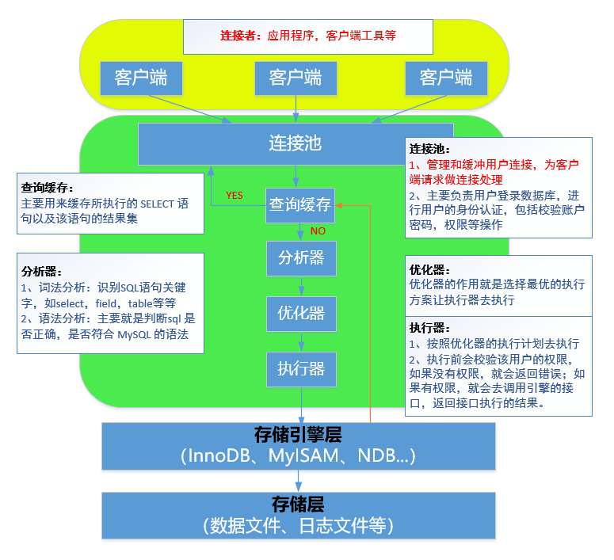
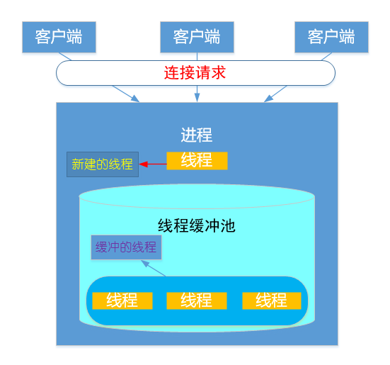
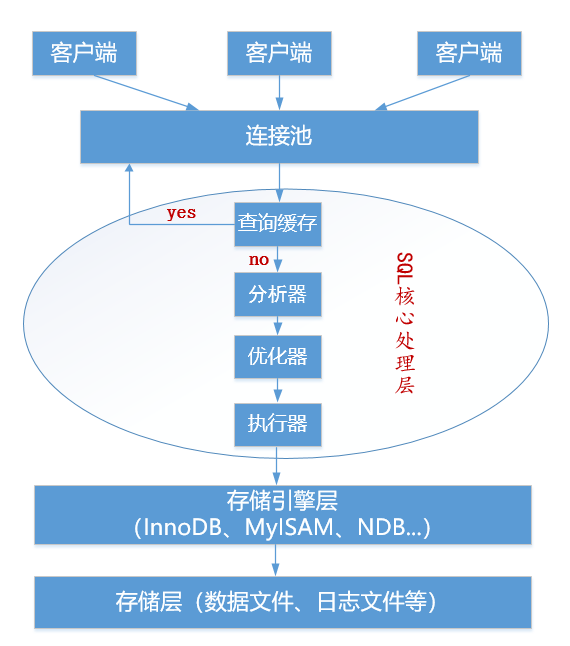
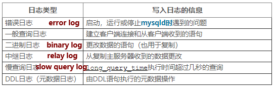
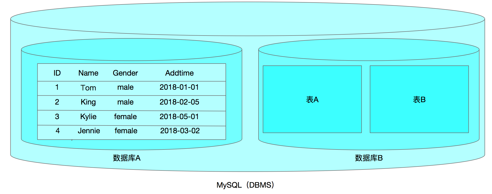

#课程目标

- [ ] 了解MySQL的体系结构
- [ ] ==了解MySQL常见的日志文件及作用==
- [ ] 了解事务的控制语句，提交和回滚
- [ ] 能够查看当前数据库的版本和用户
- [ ] 了解MySQL数据库如何存放数据
- [ ] 能在使用SQL语句==创建、删除数据库==

#一、MySQL的体系结构




##1、客户端(连接者)

- MySQL的客户端可以是==某个客户端软件==
- MySQL的客户端可以是不同的编程语言(PHP/Python等)编写的==应用程序==
- MySQL的客户端还可以是一些==API的接口==

##2、连接池（连接器）

​       **主要作用：**管理和缓冲用户连接，为客户端请求做连接处理；身份认证等。

  

## 3、SQL处理层

**主要作用:**接受用户的SQL请求，查询分析，权限处理，优化，结果缓存等。

 

##4、存储引擎层

- 什么是存储引擎？

1）存储引擎说白了就是==如何管理操作数据==(存储数据、如何更新、查询数据等)的==一种方法和机制==。

2）在MySql数据库中提供了==多种存储引擎，==各个存储引擎的优势各不一样。

3）用户可以根据不同需求为==数据表==选择不同的存储引擎，也可以根据自己需要编写自己的存储引擎。

4）甚至一个库中不同的表使用不同的存储引擎，这些都是允许的。

- 常用的存储引擎有哪些？

  最常用的存储引擎是==InnoDB==和MyISAM

| 存储引擎   | 描述                                                         |
| ---------- | ------------------------------------------------------------ |
| ==InnoDB== | ==支持==拥有ACID特性==事务==的存储引擎，并且提供行级的锁定，应用相当广泛。<br>比如OLTP（在线事务处理系统） |
| MyISAM     | 查询速度快，有较好的索引优化和数据压缩技术；但不支持事务。<br>适用于读多写少的应用场景，比如OLAP（在线分析处理系统） |
| NDB        | 用于MySQL Cluster的集群存储引擎，提供数据层面的高可用性      |
| MEMORY     | 存储数据的位置是内存，因此访问速度最快，但是安全上没有保障。<br>适合于需要快速的访问或临时表。 |
| BLACKHOLE  | 黑洞存储引擎，写入的任何数据都会消失，应用于主备复制中的分发主库（中继slave） |

##5、存储层

**核心作用：**

用来存储MySQL的==**数据文件**、**日志文件**==等==物理==文件。支持各种文件系统，如ext2~ext4，xfs，nas等。

## 6、MySQL体系结构总结

1. MySQL体系结构分为哪几层？
2. 每一层是如何工作的？
3. MySQL5.5版本以后默认的存储引擎是哪个？有什么特点？

# 二、MySQL数据库物理文件

##1、常见的日志文件

 

###㈠  ==错误日志==

**作用：**存放数据库的启动、停止或运行时的错误信息；

**场景：**==用于数据库启动排错==。

**如何开启？**

默认是**==开启==**的，可以通过修改my.cnf文件自定义，如：

```powershell
# vim /etc/my.cnf
[mysqld]
log_error=/path
注意：默认存在在$datadir/hostname.err
```

### ㈡ ==二进制日志==

**作用：**

二进制日志记录==数据库的所有更改==操作（DDL/DML/DCL），不包含select或者show这类语句。

**场景：**

1. 用于==主从复制==中，master主服务器将二进制日志中的更改操作发送给slave从服务器，从服务器执行这些更改操作是的和主服务器的更改相同。
2. 用于==数据的恢复==操作

**如何开启？**

默认binlog日志是==关闭==的，可以通过修改配置文件完成开启，如下：

```powershell
# vim /etc/my.cnf
[mysqld]
#指定二进制日志存放位置及文件名
log-bin=/path/binlog
```

**如何查看？**

二进制日志比较特殊，需要使用==mysqlbinlog==工具查看，如`mysqlbinlog  二进制日志文件`

### ㈢ 一般查询日志

**作用：**当客户端连接或断开时，服务器会将信息写入该日志，并记录从客户端收到的每一条SQL语句。

**场景：**当==怀疑客户端的错误==并想知道==客户端发送给mysqld的确切信息==时，该日志非常有用。 

**如何开启？**

默认情况下慢查询日志是==关闭==的，可以通过修改配置文件完成开启，如下：

~~~powershell
# vim /etc/my.cnf
[mysqld]
#打开或关闭一般通用日志,0表示关闭；1表示开启
general_log=1
#指定一般查询日志的路径及文件名，默认$datadir/hostname-slow.log
general_log_file=/path/file.log
#定义日志的输出目标
log-output=FILE
~~~

**说明：**
log-output参数用于定义一般通用日志和慢查询日志的==输出目标==，即log-output=[value,...]

value=[TABLE|FILE|NONE]，默认值为==FILE==

| value | 描述                                                |
| ----- | --------------------------------------------------- |
| TABLE | 表示将日志记录到表中，general_log表或者slow_log表中 |
| FILE  | 表示将日志记录的文本文件中                          |
| NONE  | 表示不记录到表或者文件                              |

**千万注意：**

- 如果log-output=NONE，则即使启用了日志，也不会写入条目。
- 如果log-output不等于NONE,但是没有启用日志也不会写入条目。

###㈣ 慢查询日志

**作用：**慢查询日志记录的是一些==SQL语句==，可用于查找需要很长时间才能执行的查询；

**场景：**用于找出长时间才能执行的查询语句，并对其进行优化。

>  但是，检查一个很长的慢查询日志可能成为一项艰巨的任务。为了简化这一过程，可以使用[**mysqldumpslow**](https://dev.mysql.com/doc/refman/5.7/en/mysqldumpslow.html)命令处理慢查询日志文件，以汇总日志中显示的查询。 

**如何开启？**

默认情况下慢查询日志是==关闭==的，可以通过修改配置文件完成开启，如下：

```powershell
# vim /etc/my.cnf
[mysqld]
#打开或关闭慢查询日志,0表示关闭；1表示开启
slow_query_log={1|0}
#指定慢查询日志的路径及文件名，默认$datadir/host_name-slow.log
slow_query_log_file=/path/file_name.log		
#定义日志的输出目标
log-output=FILE
#表示查询语句超过n秒被记录到slow log里，最小值为0，默认值为10	
long_query_time=n
```

###㈤ 中继日志

**作用：**记录从(slave)服务器接收来自主(master)服务器的二进制日志.

**场景：**用于==主从复制==

>  master主服务器将自己的二进制日志发送给slave从服务器，slave先保存在自己的==中继日志中==，然后再执行自己本地的relay log里的sql达到数据库更改和master保持一致。

**如何开启？**

默认中继日志==没有开启==，可以通过修改配置文件完成开启，如下：

```powershell
# vim /etc/my.cnf
[mysqld]
#指定二进制日志存放位置及文件名
relay-log=/path/xxxx.log
```

### ㈥ 常用日志文件小结

| 日志文件     | 作用 | 场景 |
| ------------ | ---- | ---- |
| 错误日志     |      |      |
| 二进制日志   |      |      |
| 一般查询日志 |      |      |
| 慢查询日志   |      |      |
| 中继日志     |      |      |

## 2、常见的数据文件

| 数据文件类型          | 描述                                                         |
| --------------------- | ------------------------------------------------------------ |
| *.frm  文件           | 1、任何存储引擎，每一个表都会有一个以表名命名的.frm文件。<br>2、与表相关的==元数据（meta)信息==都存放在此文件中，包括==表结构的定义==信息等 |
| *.MYD文件             | 1、myisam存储引擎专用，存放myisam表的数据（data)<br>2、每一个myisam表都会有一个.MYD文件与之呼应，同样存放在所属数据库的目录下 |
| *.MYI文件             | 1、myisam存储引擎专用，存放myisam表的索引相关信息<br>2、对于myisam存储引擎来说，可以被缓存(cache)的内容主要就是来源于.MYI文件中。 每一个myisam表对应一个.MYI文件 |
| *.ibd文件和ibdata文件 | 1、存放innoDB的数据文件（包括索引）<br>2、innoDB存储引擎有两种表空间方式：独享表空间和共享表空间。<br>3、独享表空间：使用.ibd文件来存放数据，且每个表一个.ibd文件。<br>4、共享表空间：使用.ibdata文件，所有表共同使用一个（或多个，自行配置）.ibdata文件。 |
| db.opt文件            | 此文件在每一个==自建的库==里都会有，记录这个库的默认使用的==字符集和校验规== |

#三、MySQL中的SQL语句

##1、什么是SQL？

SQL 是 Structure Query Language(==结构化查询语言==)的缩写,它是使用==关系模型的数据库应==
==用语言==,由 IBM 在 20 世纪 70 年代开发出来,作为 IBM 关系数据库原型 System R 的原型关
系语言,实现了关系数据库中的信息检索。

20 世纪 80 年代初,美国国家标准局(ANSI)开始着手制定 SQL 标准,最早的 ANSI 标准于
1986 年完成,就被叫作 SQL-86。标准的出台使 SQL 作为标准关系数据库语言的地位得到了
加强。SQL 标准目前已几经修改更趋完善。

正是由于 SQL 语言的标准化,所以大多数关系型数据库系统都支持 SQL 语言,它已经发展
成为多种平台进行交互操作的底层会话语言。

##2、SQL语句的分类

- DDL(Data Definition Languages)语句:

  ==数据定义语言==,这些语句定义了不同的数据段、数据库、表、列、索引等数据库对象的定义。常用的语句关键字主要包括 **create、drop、alter、rename、truncate**。

- DML(Data Manipulation Language)语句:

  ==数据操纵语句==,用于添加、删除、更新和查询数据库记录,并检查数据完整性,常用的语句关键字主要包括 **insert、delete、update**等。

- DCL(Data Control Language)语句:

  ==数据控制语句==,用于控制不同数据段直接的许可和访问级别的语句。这些语句定义了数据库、表、字段、用户的访问权限和安全级别。主要的语句关键字包括 **grant、revoke** 等。

- DQL(Data Query Language)语句:

  ==数据查询语句==，用于从一个或多个表中检索信息。主要的语句关键字包括 **select**

##3、MySQL中如何求帮助

- 亘古不变的官档

  [MySQL5.6官方文档](https://dev.mysql.com/doc/refman/5.6/en/sql-syntax.html)

  [MySQL5.7官方文档](https://dev.mysql.com/doc/refman/5.7/en/sql-syntax.html)

- man文档

  man文档可以对mysql的一些基本工具及后台命令求帮助，比如：

  ~~~powershell
  [root@db01 ~]# man mysql
  [root@db01 ~]# man mysql_install_db
  [root@db01 ~]# man mysqldump
  [root@db01 ~]# man mysqld
  ~~~

- MySQL的命令行求帮助

  ~~~powershell
  mysql> help;
  mysql> ?
  mysql> help create table;
  
  根据内容进行查找帮助
  mysql> ? contents
     Account Management
     Administration
     Data Definition
     Data Manipulation
     Data Types
     Functions
     Functions and Modifiers for Use with GROUP BY
     Geographic Features
     Language Structure
     Storage Engines
     Stored Routines
     Table Maintenance
     Transactions
     Triggers
     
  寻求账户管理的帮助（一级一级的向内部查）
  mysql> ? Account Management
  mysql> ? CREATE USER
  ~~~

# 四、MySQL数据库基本操作

##1、常用的一些命令

###㈠ ==事务控制语句==

> 问：默认情况下MySQL如何提交事务的？
> 答：自动提交事务
>
> 问：MySQL如何自动提交呢？
>
> 答：`autocommit变量控制`

- 查看`autocommit变量值`

```powershell
mysql> show variables like 'autocommit';
+---------------+-------+
| Variable_name | Value |
+---------------+-------+
| autocommit    | ON    |					
+---------------+-------+
1 row in set (0.00 sec)
说明：autocommit=ON表示自动提交
```

- 临时关闭自动提交

```powershell
mysql> set autocommit=OFF;
Query OK, 0 rows affected (0.00 sec)
```

- 永久关闭自动提交

```powershell
修改my.cnf配置文件
vim my.cnf
...
autocommit=0
或者
autocommit=OFF

补充：
DDL(数据定义语言)：当执行时，会自动提交上面未提交的事务。create/drop/alter
```

- 手动控制事务

```powershell
commit		提交
rollback		回滚
```

###㈡ 常见函数

```powershell
查看mysql支持字符加密函数：
select password('123');		
select md5('123');
select sha1('123');			
select encrypt('123');		基本上不用了

使用select来调度mysql中的常见函数：
select version();				当前数据库版本
select current_user();		当前用户
select current_time();		当前时间
select current_date();		当前日期
select now();					当前日期时间

查看数据库的基本信息
mysql> \s 或者status			
--------------
mysql  Ver 14.14 Distrib 5.6.35, for linux-glibc2.5 (x86_64) using  EditLine wrapper

Connection id:		4
Current database:	
Current user:		root@localhost
....
```

###㈢ 其他常用语句

~~~powershell
mysql> use 数据库名;			指定数据库,类似于进入到某个库里进行操作
mysql> show databases;		查看所有数据库
mysql> show schemas;			查看所有数据库
mysql> show tables;			查看所有表
mysql> show variables;		查看变量
mysql> show variables like '%char%';
mysql> show variables like '%data%';
mysql> show engines;			查看存储引擎

更改默认字符集为utf8mb4：
临时更改：
mysql> set character_set_database=utf8mb4;
Query OK, 0 rows affected (0.01 sec)

mysql> set character_set_server=utf8mb4;
Query OK, 0 rows affected (0.00 sec)

mysql> show variables like '%char%';
mysql> show variables like 'collation_server';
+------------------+--------------------+
| Variable_name    | Value              |
+------------------+--------------------+
| collation_server | utf8mb4_general_ci |
+------------------+--------------------+

永久更改：
vim my.cnf
[mysqld]
...
character_set_server=utf8mb4
collation_server=utf8mb4_general_ci	(可省略)
~~~

## 2、MySQL数据库如何存放数据



### ㈠ MySQL数据库库相关名词

| 名词   | 英文     |
| ------ | -------- |
| 数据库 | database |
| 数据表 | table    |
| 字段   | field    |
| 记录   | record   |

**说明：**

1）一个MySQL数据库实例，可以同时创建多个database数据库；

2）一个database数据库可以同时拥有多个table数据表；

3）每个表都有自己的表头信息，如ID、Name、Gender、Addtime，称为field字段

4）每个表可以拥有多个记录，如Tom、King、Kylie、Jennie等个人信息

**通过以上信息，我们可以得出，数据记录是如何保存和存储在数据库里的，即：**

1）==数据(记录record) —> 数据表(table) —> 数据库(database)==

2）所以，要存放一条记录，那么必须得先有==数据库—>数据表—>数据记录==

### ㈡ 数据库基本操作

#### ① 创建库(==create database==)

```powershell
创建db1库
create database db1;
创建db1库并指定默认字符集
create database db1 default charset gbk;
如果存在不报错(if not exists)
create database if not exists db1 default character  set utf8;
说明：不能创建相同名字的数据库！
```

#### ② 查看创建库的语句(show)

```powershell
show create database db1;
```

#### ③ 更改数据库信息(==alter database==)

```powershell
更改db1库的默认字符集
alter database db1 default character set gbk;
alter database db2 default charset utf8;
```

#### ④ 删除数据库(==drop database==)

```powershell
drop database db1;删除db1库
```