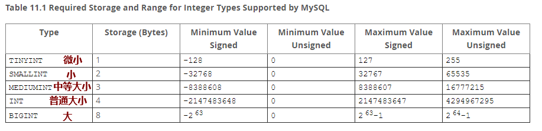
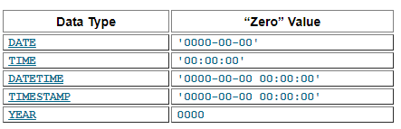

#课程目标

- [ ] 能够创建、删除数据表
- [ ] 能够对表里的==数据记录==进行==增加、删除、修改、查询操作==
- [ ] 能够==创建、删除用户==
- [ ] 能够给==用户授权并回收权限==
- [ ] 了解delete和truncate语句的区别

#一、数据库基本操作

##1、查看数据库相关信息

```powershell
mysql> show databases;		查看所有数据库
mysql> show schemas;			查看所有数据库
mysql> use 数据库名;			指定数据库,类似于进入到某个库里进行操作
mysql> show tables;			查看所有表
mysql> show variables;		查看变量
mysql> show variables like '%char%';
mysql> show variables like '%data%';
mysql> show engines;			查看存储引擎

说明：";"号代表一条sql语句结束，所以，每条SQL语句结束都需要加";"
```

## 2、服务器字符集设置

**注意：**只要是永久更改，必然更改配置文件！

```powershell
[mysqld]
basedir=/mysql_3306
datadir=/mysql_3306/data
socket=/tmp/mysql.sock
character-set-server=utf8mb4
collation-server=utf8mb4_general_ci
```

## 3、创建库(==create database==)

```powershell
创建db1库
create database db1;
创建db1库并指定默认字符集
create database db1 default charset gbk;
如果存在不报错(if not exists)
create database if not exists db1 default character set utf8;
说明：不能创建相同名字的数据库！
```

##4、更改数据库信息(==alter database==)

~~~powershell
更改db1库的默认字符集
alter database db1 default character set gbk;
alter database db2 default charset utf8;
~~~

##5、删除数据库(==drop database==)

```powershell
删除db1库
drop database db1;
```

#二、数据表基本操作

##1、创建表(==create table==)

###㈠ 语法格式

```powershell
create table 表名 (字段1,字段2，...)
create table 表名 (字段1 数据类型(字符长度)，字段2，...)
create table 表名 (字段1 数据类型(字符长度) 约束条件，字段2，...)
```

###㈡ 示例

```powershell
创建t1表，id列整型,name列字符串
int(10)
varchar(30)

create table t1 (id int,name varchar(10));
创建t2表，id列整型，并且为主键,name列字符串
create table t2 (id int key,name varchar(20) not null,......)
查看表的结构
desc t1;
describe t2;
```

##2、插入记录(==insert into==)

~~~powershell
以下是往表里插入数据的几种不同方法
insert into 表名 set 字段1=xx,字段2=xx;
insert into t1 set id=3,name='li';

insert into 表名 values(值1,值2),(值1,值2)
insert into t1 values(1,'zhang'),(2,'wang');

insert into 表名 (指定字段1,指定字段2) values(字段1值，字段2值)；
insert into t2 (id,name) values(3,'li');


insert into t1 select * from t2;
insert into t1(name) select name from t2;
说明：
1.插入的数据来自于另外一张表
2.一定要保证两张表的结构一致（插入表里字段数和后面表查找出来的字段要相匹配）
3.两张表结构完全一致；或者人造让两边字段一致

查询表里所有记录
select * from t1;
~~~

##3、删除记录(==delete from==)

```powershell
删除表里所有的记录
delete from 表名;

delete from t1;
truncate 表名;
根据条件删除
delete from t1 where id>3;
注意：
truncate不能加where条件删除数据；只能全部删除表里的所有记录。
```

##4、更新记录(==update 表名==)

###㈠ 语法

```powershell
update 表名 set 字段1=新值,字段2=新值,... where条件;
```

###㈡ 示例

```powershell
update t1 set name='harry' where id=1;
update t1 set name='jack',id=33 where id=3;
update t1 set id=222,name='wanger' where id=2;
```

##5、更改表属性信息(==alter table==)

```powershell
增加一列成为第一列
alter table t2 add id int first;
在id后面增加一列叫id2
alter table t2 add id2 int after id;
alter table t1 add sex varchar(10) not null;

删除id2这个列
alter table t2 drop id2;

修改列名和数据类型
alter table t2 change id ID bigint;
修改列的数据类型
alter table t2 modify ID int;

查看数据库有哪些存储引擎
show engines;
修改表的存储引擎
alter table t2 engine MyISAM;
查看修改存储引擎是否成功
show create table t2;
修改表的默认字符集
alter table t2 default charset=utf8;
```

##6、重命名或移动表(==rename table==)

```powershell
移动表到另一个库里并重命名
rename table db01.t1 to db02.t11;
或者
alter table db01.t1 rename db02.t11;

只重命名表名不移动
rename table tt1 to tt2;
或者
alter table tt1 rename  tt2;
```

##7、删除表(==drop table==)

```powershell
drop table 表名;
```

##8、delete/truncate/drop区别

- delete：删除==数据记录==
  - 数据操作语言（DML）
  - 在事务控制里，DML语句要么commit，要么rollback
  - 删除==大量==记录速度慢，==只删除数据==不回收高水位线
  - 可以==带条件==删除
- truncate：删除==所有数据记录==
  - 数据定义语言（DDL）
  - ==不在==事务控制里，DDL语句执行前会提交前面所有未提交的事务
  - 清里大量数据==速度快==，回收高水位线（high water mark）
  - ==不能带条件删除==
- drop：删除==数据库对象==
  - 数据定义语言（DDL）
  - 数据库对象包括库、表、用户等

#三、用户管理

##1、创建用户(==create user==)

注意：MySQL中不能单纯通过用户名来说明用户，必须要加上主机。如**==jack@10.1.1.1==**

###㈠ 语法

```powershell
创建用户不设置密码
create user 'user'@'host';

创建用户设置密码
create user 'user'@'host' identified by 'password';

说明：用户的信息保存在mysql数据库中的user表中，验证用户是否创建成功如下：
select user,host from mysql.user; 
```

###㈡ 示例

```powershell
create user 'tom'@'localhost' identified by '123';
create user 'harry'@'localhost' identified by '123';
create user 'tom'@'10.1.1.1' identified by '123';
create user  'jack'@'%' identified by '123';

```

###㈢ 用户主机表示方式

```powershell
'user'@'localhost'			表示user只能在本地通过socket登录数据库
'user'@'192.168.0.1'			表示user用户只能在192.168.0.1登录数据库
'user'@'192.168.0.0/24'		表示user用户可以在该网络任意的主机登录数据库
'user'@'%'						表示user用户可以在所有的机器上登录数据库;本机为匿名用户
```

## 2、删除用户(**==drop user==**)

### ㈠ 语法

```powershell
drop user 用户;
```

### ㈡ 示例

```powershell
删除'user01'@'localhost'用户
mysql> drop user 'user01'@'localhost';
默认删除user01从任意主机登录
mysql> drop user 'user01';
mysql> drop user 'user01'@'%';

重命名用户名
mysql> rename user 'harry'@'10.1.1.%' to 'harry'@'10.1.1.1';

删除一个匿名用户
mysql> drop user ''@'localhost';

删除mysql中的匿名用户
mysql> delete from mysql.user where user='';
删除root用户从本机::1登录（::1表示IPv6地址）
mysql> delete from mysql.user where user='root' and host='::1';
mysql> flush privileges;

注意：如果tcp/ip登录，服务器端口不是默认3306，则需要加端口号
```


## 3、用户权限管理(==grant==)

### ㈠ 权限说明

所有权限说明<https://dev.mysql.com/doc/refman/5.7/en/privileges-provided.html>

```powershell
USAGE	无权限,只有登录数据库,只可以使用test或test_*数据库
ALL	所有权限

以下权限为指定权限
select/update/delete/super/replication slave/reload...

with grant option 选项表示允许把自己的权限授予其它用户或者从其他用户收回自己的权限
```

###㈡ 权限保存位置

```powershell
mysql.user				所有mysql用户的账号和密码，以及用户对全库全表权限（*.*）
mysql.db					非mysql库的授权都保存在此(db.*)
mysql.table_priv		某库某表的授权(db.table)
mysql.columns_priv	某库某表某列的授权(db.table.col1)
mysql.procs_priv		某库存储过程的授权
```

###㈢ 给用户授权

####① 语法

```powershell
grant 权限1,权限 on 库.表 to 用户@主机
grant 权限(列1,列2,...) on 库.表 to 用户@主机
```

####② 用户授权示例

```powershell
给tom@10.1.1.1用户授予查看db01库里所有表权限
mysql> grant select on db01.* to 'tom'@'10.1.1.1';
刷新权限表
mysql> flush privileges;

给tom@10.1.1.1用户授予修改db01库的ID字段的权限
mysql> grant update(ID) on db01.tt1 to 'tom'@'10.1.1.1';
mysql> flush privileges;
查看当前用户权限
mysql> show grants;
查看指定用户权限
mysql> show grants for 'tom'@'10.1.1.1';
```

#### ③ 使用grant创建用户

说明：5.7以后==不推荐==，未来会被弃用！

```powershell
grant all on *.* to 'harry'@'10.1.1.%' identified by '123'; 
```

####④ with grant option选项

```powershell
with grant option:用户是否可以下放和回收权限

grant all on *.* to 'amy'@'10.1.1.%' identified by '123' with grant option;
grant all on *.* to 'harry'@'10.1.1.%' identified by '123'; 

测试harry用户和amy用户是否可以将自己的权限下放：
harry用户登录：

mysql> grant select on db01.* to 'tom'@'10.1.1.1';
ERROR 1044 (42000): Access denied for user 'harry'@'10.1.1.%' to database 'db01'

amy用户登录：
mysql> grant select on db01.* to 'tom'@'10.1.1.1';
```

####⑤ 总结

- 创建用户方法

  - `create user...` 	==需要单独grant授权==
  - `grant xxx`                  ==直接创建用户并授权==

- 扩展补充

  - 从MySQL 5.7.6开始，不赞成使用grant修改密码;使用 ALTER USER来代替。

  ```powershell
  ALTER USER 'jeffrey'@'localhost' IDENTIFIED BY 'mypass'; 
  ```

###㈣ 回收用户权限

```powershell
revoke 权限 on 库.表 from 用户;
撤消指定的权限
mysql> revoke update on db01.tt1 from 'tom'@'10.1.1.1';
撤消所有的权限
mysql> revoke select on db01.* from 'tom'@'10.1.1.1';
```

#四、查询语句

##1、常见符号

| 符号              | 说明                  |
| ----------------- | --------------------- |
| %                 | 匹配0个或任意多个字符 |
| _(下划线)         | 匹配单个字符          |
| like              | 模糊匹配              |
| =                 | 等于,精确匹配         |
| >                 | 大于                  |
| <                 | 小于                  |
| \>=               | 大于等于              |
| <=                | 小于等于              |
| !=和<>            | 不等于                |
| ! 和 not          | 逻辑非                |
| \|\| 和 or        | 逻辑或                |
| && 和 and         | 逻辑与                |
| between...and.... | 两者之间              |
| in (....)         | 在...                 |
| not in (....)     | 不在                  |

##2、其他关键字

| 符号     | 说明           |
| -------- | -------------- |
| regexp   | 使用正则来匹配 |
| order by | 排序           |
| asc      | 升序排列       |
| desc     | 降序排列       |
| group by | 聚合           |
| having   | 筛选           |
| distinct | 去除重复的行   |

##3、查询举例

###㈠ 基本简单查询

```powershell
select 字段1,字段2,... from 表名;

查看所有数据
select * from emp;
查看指定列
select empno,ename,job,sal from emp;
给列指定别名
select empno 工号,ename 姓名,job 工作,sal 工资 from emp;
或者
select empno as 工号,ename as 姓名,job as 工作,sal as 工资 from emp;
```

###㈡ 带where条件查询

```powershell
支持逻辑运算符,支持正则表达式
select * from t3 where english >60 && english <90;
select * from t3 where math >= 60 and english >= 60;
select * from t3 where math >= 60 or english >= 60;
select * from t3 where math >= 60 and not english >= 60;

select * from t3 where name regexp '^h';
select * from t1 where name regexp '.*[0-9]';
select * from t1 where name regexp '.*[0-9]+.*';
select * from t1 where name regexp '.*[0-9]{2}.*' ;

sal不在3000与5000之间的记录 
select * from emp where sal not between 3000 and 5000;

sal在500-1000或者3000-5000之间
select * from emp where sal >= 3000 and sal <= 5000 or sal >=500 and sal <=1000;
```

###㈢ 排序

```powershell
默认按照deptno列升序排列
select * from emp order by deptno;
指定按照deptno列升序排列
select * from emp order by deptno asc;
指定deptno列按降序排列
select * from emp order by deptno desc;
```

###㈣ 去重

```powershell
select distinct deptno from emp;
```

###㈤ group by和having

####① group by

根据给定==数据列==的查询结果进行分组统计，最终得到一个==分组汇总表==

注：一般情况下group by需与==统计函数==一起使用才有意义

| 常见统计函数 | 说明     |
| ------------ | -------- |
| max          | 求最大值 |
| min          | 求最小值 |
| sum          | 求和     |
| avg          | 求平均值 |
| count        | 求总行数 |

- 举例说明

```powershell
查找每个部门的最高工资：
select deptno,max(sal) from emp group by deptno;
每个部门最大工资和部门人数:
select deptno,max(sal),count(*) from emp group by deptno;
+--------+----------+----------+
| deptno | max(sal) | count(*) |
+--------+----------+----------+
|     10 |  5000.00 |        3 |
|     20 |  3000.00 |        5 |
|     30 |  2850.00 |        6 |
+--------+----------+----------+
查找10号和20号部门最大工资和人数
select deptno,max(sal),count(*) from emp where deptno in (10,20) group by deptno;
+--------+----------+----------+
| deptno | max(sal) | count(*) |
+--------+----------+----------+
|     10 |  5000.00 |        3 |
|     20 |  3000.00 |        5 |
+--------+----------+----------+
```

####② having

- having与where类似，根据条件对==数据==进行过滤筛选

- where==针对表中的列==发挥作用，查询数据

- having==针对查询结果集==发挥作用，筛选数据

**举例说明**

```powershell
查询员工数大于5个的部门编号和最大工资及员工数
select deptno,max(sal),count(*) from emp group by deptno having count(*)>5;
查询底薪+提成大于2000的员工相关信息
select empno,ename,sal+ifnull(comm,0) sum from emp having sum >2000;
查询每个部门最大工资的员工信息
select ename,empno,deptno,sal from emp where (deptno,sal) in (select deptno,max(sal) from emp group by deptno) ;
+-------+-------+--------+---------+
| ename | empno | deptno | sal     |
+-------+-------+--------+---------+
| BLAKE |  7698 |     30 | 2850.00 |
| SCOTT |  7788 |     20 | 3000.00 |
| KING  |  7839 |     10 | 5000.00 |
| FORD  |  7902 |     20 | 3000.00 |
+-------+-------+--------+---------+
4 rows in set (0.00 sec)


查询20和30号部门基本工资加提成大于2000的人员信息
select deptno,empno,ename,sal+ifnull(comm,0) sum from emp where deptno in(30,20)having sum >2000;
```

- IFNULL函数扩展

```powershell
IFNULL()函数：
MySQL中的IFNULL函数类似于Oracle中的NVL函数，其表达式为：IFNULL(expr1,expr2)，如果第一个参数不为空，则返回第一个参数，否则返回第二个参数。
ifnull(comm,0)

IFNULL(expr1,expr2)
If expr1 is not NULL, IFNULL() returns expr1; otherwise it returns expr2.

IF()函数：
IF(expr1,expr2,expr3)类似于Oracle中的NVL2函数，如果第一个表达式的值为TRUE（不为0或null），则返回第二个参数的值，否则返回第三个参数的值
       
IF(expr1,expr2,expr3)
If expr1 is TRUE (expr1 <> 0 and expr1 <> NULL), IF() returns expr2. Otherwise, it returns expr3.

NULLIF()函数：
NULLIF(expr1,expr2),如果expr1=expr2为真，返回null；否则返回expr1

NULLIF(expr1,expr2)
Returns NULL if expr1 = expr2 is true, otherwise returns expr1. This is the same as CASE WHEN expr1 = expr2 THEN NULL ELSE expr1 END.
```

###㈥ 合并列函数(concat)

```powershell
select concat(user,'    ',password) as 用户名和密码 from mysql.user;
create table t3(path1 varchar(255),homedir varchar(255));
insert into t3 set path1='/www/itcast',homedir='u01';
select concat(path1,'/', homedir) from t3;
select concat(path1,'/', homedir) as '家目录' from t3;
```

###㈦ 分页函数(limit)

```powershell
用法：limit 起始位置，偏移量			  起始位置从0开始
select * from t1 limit n;			显示前n行
select * from t1 limit n,m;		显示n+1行至表中的n+m行

select * from t1 limit 10;			显示前10行
select * from t1 limit 10,10;	   显示11至20行
select * from t1 limit 1;			显示第1行 
select * from t1 limit 0,2;		显示第1,2行 
select * from t1 limit 2,2;		显示3,4行
select * from t1 limit 4,2;		显示5,6行
select * from t1 limit 6,2;		显示第7,8行
```

###㈧ 多表联合查询

```powershell
常规查询表：
select * from emp,dept where emp.deptno=dept.deptno;

select dept.deptno,dept.dname,emp.ename,emp.job from emp,dept where emp.deptno=dept.deptno;

select e.ename,e.job,e.hiredate,d.dname,e.deptno from emp e,dept d where e.deptno=d.deptno;

表的连接:纵向连接/内连接/左连接/右连接

左连接（以左表为标准连接右表）:
left join=left [outer] join
select emp.ename,emp.job,dept.deptno from dept left join emp on emp.deptno=dept.deptno;

右连接（以右表为标准连接左表）:
right join= right [outer] join
select emp.ename,emp.job,dept.deptno from dept right join emp on emp.deptno=dept.deptno;

内连接:取多表之间的交集
inner join
select emp.ename,emp.job,dept.deptno from emp inner join dept on emp.deptno=dept.deptno;

纵向连接:合并【表结构相同】
select name,math,english,'' as 'chinese' from t2 union select name,math,english,chinese from t3;
```

###㈨ 四则运算

```powershell
select 1+2;
select 1-3;
select 1*4;
select 1/4;
select 1 + 1, (10-1)/3, 2*2/2;
select 1 + 1 from dual;		dual表,俗称万能表
乘幂需要调用函数：-3表示2的三次幂取倒数
mysql> select pow(2,3),power(2,3),pow(2,-3),power(2,-3);
+----------+------------+-----------+-------------+
| pow(2,3) | power(2,3) | pow(2,-3) | power(2,-3) |
+----------+------------+-----------+-------------+
|        8 |          8 |     0.125 |       0.125 | 
+----------+------------+-----------+-------------+
1 row in set (0.00 sec)
```

#五、扩展常见的数据类型

##1、数值类型

[常见的数值类型](https://dev.mysql.com/doc/refman/5.6/en/numeric-type-overview.html)

###㈠ 整数类型（精确值）



###㈡ 定点类型（精确值）

- DECIMAL和NUMERIC

`DECIMAL`和`NUMERIC` 类型的存储==精确的数值数据==。使用这些类型时，重要的是要保留==精确的精度==，例如使用**货币数据**。在MySQL中, `NUMERIC`被作为`DECIMAL`来应用，所以下面的举例`DECIMAL`同样适用于 `NUMERIC` 。

- 举例说明

~~~powershell
salary DECIMAL(5,2)
在上面的例子中，薪水字段的类型为decimal，表示精确的数字。其中，5代表精度，2代表刻度。
精度表示数值存储的有效位数，刻度表示小数点后面可存储的位数。
DECIMAL(5,2)能够存储五位数和两位小数的任何值，因此可以存储在salary 列中的值的范围-999.99是 999.99

特殊注意：
DECIMAL(M)和DECIMAL(M,0)是相等的，存储长度取决于M的值，默认情况下M值为10.刻度为0表示没有小数。
~~~

###㈢ 浮点类型（近似值）

- FLOAT和DOUBLE

`FLOAT`和`DOUBLE`类型代表近似数字数据值。MySQL对于单精度值使用四个字节，对于双精度值使用八个字节。 `FLOAT`单精度浮点数精确到约7位小数，`DOUBLE`双精度浮点数精确到大约15位小数 。`FLOAT`**类型会随着数值的增大精度会减小。**

- 举例说明

~~~powershell
FLOAT(M,D)，其中，M表示存储的有效位数，D代表小数点后面的位数；即整数位数+小数部分不能超过M值。
colum1 FLOAT(7,4)
上面例子中，如果你插入为999.00009到cloum1列，那么mysql在存储时会四舍五入变为999.0001插入。
~~~

- 对比总结

| 数值类型 | 精度   | 存储空间 | 精确性        |
| -------- | ------ | -------- | ------------- |
| FLOAT    | 单精度 | 4字节    | 低            |
| DOUBLE   | 双精度 | 8字节    | 低，比float高 |
| DECIMAL  | 高精度 | 变长     | 高            |

##2、字符串类型

[常见的字符类型](https://dev.mysql.com/doc/refman/5.6/en/string-type-overview.html)

###㈠ CHAR类型

CHAR类型的字符串为**定长**.长度范围是0到255之间的任何值.占用定长的存储空间,不足的部分用==空格==填充；读取时删掉后面的空格。

name char(10) 

- **存储空间**

CHAR(==M==)**类型的存储空间和字符集有关系**，一个中文在utf8字符集中占用3个bytes、gbk占用2个bytes、数字和字符统一用一个字符表示。

- **存储机制**

在不够M长度时，MySQL在存储数据时，需要填充特殊的空格.

- **举例说明**

`name CHAR(M),M表示字符数`

###㈡ VARCHAR类型

VARCHAR是==变长存储==,仅使用必要的存储空间.

name varchar(10) 

- **存储空间**

VARCHAR(M)类型的存储空间和字符集有关系，一个中文在utf8字符集中占用3个bytes、gbk统一占用2个bytes、数字和字符一个字符表示。

- **存储机制**

VARCHAR(M)字段存储实际是从**第二个字节开始存储**,然后用1到2个字节表示实际长度,剩下的才是可以存储数据的范围,因此最大可用存储范围是65535-3=65532字节;

第一个字节标识是否为空.（长度小于255字节,使用一个字节来表示长度;大于255字节使用两个字节来表示长度)。

###㈢ 其他

**BLOB：**保存二进制的大型数据（字节串），没有字符集，eg：图片、音频视频等。

**TEXT：**保存非二进制字符串（字符串）；有一个字符集。

**BINARY和VARBINARY：**类似CHAR和VARCHAR；保存字节字符串，而不是字符字符串，这意味着它们没有字符集 

##3、时间类型

 

###㈠ DATE类型

The `DATE` type is used for values with a date part but no time part. MySQL retrieves and displays `DATE` values in`'YYYY-MM-DD'` format. The supported range is `'1000-01-01'` to `'9999-12-31'`. 

###㈡ DATETIME

The `DATETIME` type is used for values that contain both date and time parts. MySQL retrieves and displays`DATETIME` values in `'YYYY-MM-DD HH:MM:SS'` format. The supported range is `'1000-01-01 00:00:00'` to `'9999-12-31 23:59:59'`. 

###㈢ TIMESTAMP

The `TIMESTAMP` data type is used for values that contain both date and time parts. `TIMESTAMP` has a range of `'1970-01-01 00:00:01'` UTC to `'2038-01-19 03:14:07'` UTC. 

**注意：**

Invalid `DATE`, `DATETIME`, or `TIMESTAMP` values are converted to the “zero” value of the appropriate type (`'0000-00-00'` or `'0000-00-00 00:00:00'`). 

无效的日期，日期时间等会被替换成‘0000-00-00’或‘0000-00-00 00:00:00’

###㈣ TIME

MySQL retrieves and displays `TIME` values in `'HH:MM:SS'` format (or `'HHH:MM:SS'` format for large hours values).`TIME` values may range from `'-838:59:59'` to `'838:59:59'`. 

**说明：**小时部分可以是这么大，因为可以使用TIME类型不仅代表一个时间(必须小于24小时),而且可以表示运行时间或两个事件之间的时间间隔(可能大于24小时,甚至负数)。 

**==注意：==**

TIME这一列如果存储缩写，需要注意mysql的解释方式。**无效的时间值会被转换成'00:00:00'** 。

`'11:12'` means `'11:12:00'`, not `'00:11:12'`. 

`'12'` and `12` are interpreted as `'00:00:12'`. 

###㈤ YEAR

`YEAR(4)` and `YEAR(2)` differ in display format, but have the same range of values. 

For 4-digit format, MySQL displays `YEAR` values in `YYYY` format, with a range of `1901` to `2155`, or `0000`. 

For 2-digit format, MySQL displays only the last two (least significant) digits; for example, `70` (1970 or 2070) or `69` (2069). 

**无效的值将会被转换成'0000'.**

# 六、课后练习

1、将SQL脚本（demo.sql）导入到数据库中

2、根据如下要求写出查询语句

1）查询英语前三名

2）查询总分，以降序排列

3）查询总分第一名

4）查询英语最高分的姓名及分数

5）查询总成绩的平均分第一名