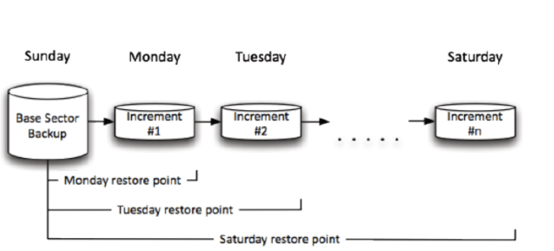
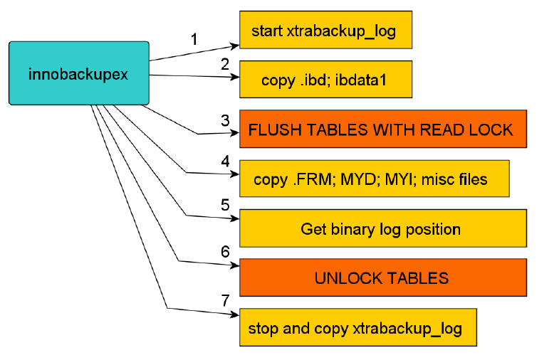
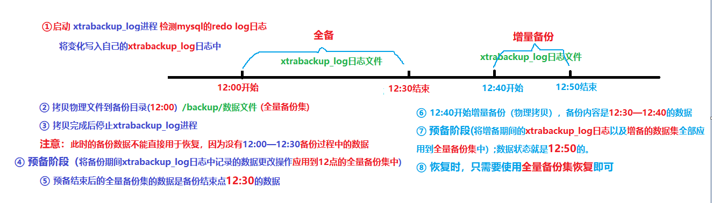

# 任务背景

## 一、真实案例

​	某天，公司领导安排刚入职不久的小冯同学将生产环境中的数据(MySQL数据库)全部导入到测试环境给测试人员使用。当小冯去拿备份数据时发现，备份数据是1个礼拜之前的。原因是之前运维同事通过脚本每天对数据库进行备份，根据结果判断应该是脚本的问题导致备份失败。于是乎，领导让小冯重新制定备份策略对数据库进行备份，并且把数据导入到测试环境。

​																——来自北京1期冯同学

## 二、案例背后的核心技术

​	1）掌握MySQL的备份工具使用及各自特点

​	2）熟悉SHELL脚本

​	3）熟悉MySQL数据的导入导出

## 三、今日任务场景

"手里有粮，心里不慌，数据有备，喜气洋洋"。对于重要的数据做好备份，是我们每个运维人员和DBA的重要职责。备份只==是一种手段==，我们最终目的是当数据出现问题时能够及时的通过备份==进行恢复==。所以，现在需要你对我们现有的MySQL数据库进行==备份策略的制定==以及实施。

#任务要求

1. 选择==合适的工具==和==方法==对mysql数据库进行备份
2. 编写脚本实现自动化备份

#课程目标

- [ ] 了解MySQL常见的==备份方式和类型==
- [ ] 能够使用==mysqldump工具==进行数据库的备份。如全库备份，库级别备份，表级别备份
- [ ] 能够使用mysqldump工具+binlog日志实现增量备份
- [ ] 理解==xtrabackup工具==实现增量备份的==原理==和方法
- [ ] 能够使用xtrabackup工具对数据库进行全备和增备

#理论储备

##一、MySQL备份概述

###1、关于备份你要知道的

**思考：**备份和冗余有什么区别？

备份： 能够防止由于**机械故障**以及**人为误操作**带来的数据丢失，例如将数据库文件保存在了其它地方。

冗余： 数据有多份冗余，但不等备份，**只能防止机械故障**带来的数据丢失，例如主备模式、数据库集群。 

###2、备份什么

数据库：==一堆物理文件的集合==；日志文件(二进制日志)+数据文件+配置文件

DBFILE	BINLOG	my.cnf

###3、备份过程须考虑的因素

- 必须制定==详细的备份计划(策略)==（备份频率、时间点、周期）
- 备份数据应该放在==非数据库本地==，并建议==有多份副本==
- 必须做好==**数据恢复的演练**==（每隔一段时间，对备份的数据在测试环境中进行模拟恢复，保证当出现数据灾难的时候能够及时恢复数据。）
- 根据数据应用的场合、特点==选择正确的备份工具==。
- 数据的一致性
- 服务的可用性

###4、备份类型

####㈠ 逻辑备份

- 备份的是**建表、建库、插入等操作所执行SQL语句**（DDL DML DCL）。
- 适用于==中小型数据库，效率相对较低==。 一般在数据库**正常提供服务**的前提下进行，如：**mysqldump**、mydumper、into outfile（表的导出导入）等。

####㈡ 物理备份

- 直接复制==数据库文件==
- 适用于==大型数据库==环境，不受存储引擎的限制，但不能恢复到不同的MySQL版本。 
- 一般是在==数据库彻底关闭或者不能完成正常提供服务==的前提下进行的备份）；如：tar、cp、==xtrabackup==（数据库可以==正常提供服务==）、lvm snapshot、rsync等

####㈢ 在线热备（冗余）

- MySQL的replication架构，如M-S|M-S-S|M-M-S等
- 实时在线备份

###5、备份工具

#### ㈠ 社区版安装包中的备份工具

##### ① mysqldump(逻辑备份，只能==全量备份==）

​	1）企业版和社区版都包含

​	2）本质上使用==SQL语句描述数据库==及数据并导出

​	3）在MYISAM引擎上锁表，Innodb引擎上锁行

​	4）数据量很大时不推荐使用

##### ② mysqlhotcopy(物理备份工具）

​	1）企业版和社区版都包含

​	2）perl写的一个脚本，本质上是使用锁表语句后再拷贝数据

​	3）==只==支持MYISAM数据引擎

#### ㈡ 企业版安装包中的备份工具

**mysqlbackup**

​	1）在线备份

​	2）增量备份

​	3）部分备份

​	4）在某个特定时间的一致性状态的备份

#### ㈢ 第三方备份工具

##### ① XtraBackup和innobackupex(物理备份）

​	1）Xtrabackup是一个对**InnoDB**做数据备份的工具，支持==在线热备份==（备份时不影响数据读写），是商业备份工具**InnoDB Hotbackup**的一个很好的替代品。

​	2）Xtrabackup有两个主要的工具：xtrabackup、innobackupex

​	a、xtrabackup只能备份==InnoDB和XtraDB==两种数据表，不能备份myisam类型的表。

​	b、innobackupex是将Xtrabackup进行封装的perl脚本，所以能同时备份处理innodb和myisam的存储引擎，但在处理myisam时需要加一个读锁。

##### ② mydumper(逻辑备份，备份SQL语句）

**多线程备份工具**

 https://launchpad.net/mydumper/mydumper-0.9.1.tar.gz        2015-11-06（最后更新时间）

###6、备份方法

- 完全备份（全备）
- 增量备份（增量备份基于全量备份）

 


##二、MySQL的逻辑备份

###1、mysqldump基本备份

**本质**：导出的是sql语句文件

**优点**：无论是什么存储引擎，都可以用mysqldump备成sql语句

**缺点**：速度较慢,导入时可能会出现格式不兼容的突发状况.==无法直接做增量备份==.

**提供三种级别的备份，表级，库级和全库级** 

####㈠ 基本语法

~~~powershell
表级别备份
mysqldump [OPTIONS] database [tables]
库级别备份
mysqldump [OPTIONS] --databases [OPTIONS] DB1 [DB2 DB3...]
全库级别备份
mysqldump [OPTIONS] --all-databases [OPTIONS]
~~~

#### ㈡ 常用参数

| 常用参数              | 描述说明                                                     |
| --------------------- | ------------------------------------------------------------ |
| --flush-logs, -F      | 开始备份前刷新日志                                           |
| --flush-privileges    | 备份包含mysql数据库时刷新授权表                              |
| --lock-all-tables, -x | MyISAM一致性，服务可用性（针对所有库所有表）                 |
| --lock-tables, -l     | 备份前锁表（针对要备份的库）                                 |
| --single-transaction  | 适用InnoDB引擎，保证一致性，服务可用性                       |
| --master-data=2       | 表示将二进制日志位置和文件名写入到备份文件并在dump文件中注释掉这一行 |
| --master-data=1       | 表示将二进制日志位置和文件名写入到备份文件,在dump文件中不注释这一行 |

**--master-data参数其他说明：**

1）恢复时会执行，默认是1
2）需要RELOAD privilege并必须打开二进制文件
3）这个选项会自动打开--lock-all-tables，关闭--lock-tables

####㈢ 举例说明

~~~powershell
表级备份：
# mysqldump -p123 db01 emp > /tmp/mysqlbak/emp.sql	备份单个表
# mysqldump -p123 db01 emp dept > /tmp/mysqlbak/emp.sql	备份多个表

表级恢复：
# mysql -p db01 </tmp/mysqlbak/emp.sql
或者在mysql数据库内使用source命令来执行外部的sql文件
mysql> source /tmp/mysqlbackup/emp.sql	

库级备份:
# mysqldump --databases db01 -p > /tmp/mysqlbak/db01.sql		备份单个库
# mysqldump --databases db01 db02 -p > /tmp/mysqlbak/db01.sql	备份多个库

库级恢复：
# mysql -p </tmp/mysqlbak/db01.sql 
mysql> source /tmp/mysqlbak/db01.sql 


全库级备份：
# mysqldump --all-databases --master-data --single-transaction > all.sql
~~~

#### ㈣ 小结

1. mysqldump工具备份的是==SQL语句==，故备份不需要停服务
2. 使用备份文件==恢复==时，要保证==数据库处于运行状态==
3. 只能实现全库，指定库，表级别的==某一时刻的备份==，本身==不能增量备份==
4. 适用于==中小型==数据库

###2、mysqldump实现增量备份

**核心思路：**结合binglog实现增量

1. ==备份的目的为了数据出问题进行恢复==
2. 二进制日志文件默认会记录下所有对数据库数据变化的操作(增、删、改)
3. 二进制文件同时还会记录具体sql执行时的环境、==时间以及起始位置和结束位置==（pos值）
4. 通过获取二进制文件里的SQL操作来进行==数据的恢复==

#### ㈠ 实现思路

1. 先做全量备份（mysqldump）
2. 对数据库做更改操作
3. 备份二进制日志文件
4. 模拟故障进行
5. 数据恢复
6. 测试验证

#### ㈡ 实现步骤

##### ① 全库备份

```powershell
# mysqldump --single-transaction --flush-logs --master-data=2 --all-databases > /tmp/all.sql -p
```

##### ② 更改数据库

```powershell
mysql> select * from db01.t1;
+------+--------+---------+-----------+
| id   | name   | salary  | dept      |
+------+--------+---------+-----------+
|    1 | harry  | 1300.00 | 市场部    |
|    2 | amy    | 2200.00 | 人事部    |
|    3 | tom    |  600.00 | 财务部    |
|    4 | jack   | 3300.00 | 市场部    |
|    5 | momo   | 1700.00 | 市场部    |
|    6 | sarsha | 1300.00 | 人事部    |
|    7 | xiaom  | 4300.00 | 市场部    |
+------+--------+---------+-----------+
mysql> select * from db02.t1;
+----+-------+
| id | name  |
+----+-------+
|  1 | harry |
|  2 | tom   |
+----+-------+
2 rows in set (0.00 sec)
更改：
mysql> delete from db01.t1 where id=7;

mysql> insert into db01.t1 values(88,'aaa',11111.23,'安保'),(99,'bbb',22222.22,'运维');

mysql> update db02.t1 set name='jack' where id=2;

mysql> select * from db01.t1;
+------+--------+----------+-----------+
| id   | name   | salary   | dept      |
+------+--------+----------+-----------+
|    1 | harry  |  1300.00 | 市场部    |
|    2 | amy    |  2200.00 | 人事部    |
|    3 | tom    |   600.00 | 财务部    |
|    4 | jack   |  3300.00 | 市场部    |
|    5 | momo   |  1700.00 | 市场部    |
|    6 | sarsha |  1300.00 | 人事部    |
|   88 | aaa    | 11111.23 | 安保      |
|   99 | bbb    | 22222.22 | 运维      |
+------+--------+----------+-----------+
8 rows in set (0.00 sec)
mysql> select * from db02.t1;
+----+-------+
| id | name  |
+----+-------+
|  1 | harry |
|  2 | jack  |
+----+-------+
2 rows in set (0.00 sec)
```

##### ③ 备份二进制文件

```powershell
方法1：直接拷贝物理文件
方法2：备份改变过的数据（SQL）
# mysqlbinlog --start-position=120 binlog.000005 > /opt/mybinlog.sql
```

##### ④ 故障模拟

```powershell
mysql> drop database db01;
Query OK, 7 rows affected (0.07 sec)

mysql> drop database db02;
Query OK, 3 rows affected (0.01 sec)
```

##### ⑤ 全量恢复

```powershell
1. 通过刚刚全量备份进行恢复
# mysql < /tmp/all.sql -p
2. 进入数据库查看结果
mysql> select * from db01.t1;
+------+--------+---------+-----------+
| id   | name   | salary  | dept      |
+------+--------+---------+-----------+
|    1 | harry  | 1300.00 | 市场部    |
|    2 | amy    | 2200.00 | 人事部    |
|    3 | tom    |  600.00 | 财务部    |
|    4 | jack   | 3300.00 | 市场部    |
|    5 | momo   | 1700.00 | 市场部    |
|    6 | sarsha | 1300.00 | 人事部    |
|    7 | xiaom  | 4300.00 | 市场部    |
+------+--------+---------+-----------+
7 rows in set (0.01 sec)
mysql> select * from db02.t1;
+----+-------+
| id | name  |
+----+-------+
|  1 | harry |
|  2 | tom   |
+----+-------+
2 rows in set (0.00 sec)
说明：以上数据不是最新数据
```

##### ⑥ ==二进制日志恢复到最新状态==

```powershell
# mysqlbinlog --start-position=120 /opt/mybinlog.000002 |mysql -p
说明：
1.只有起始位置--start-position=120说明从120往后所有记录
2.一般SQL语句前面的at xxx代表该语句的position值
mysql> select * from db01.t1;
+------+--------+----------+-----------+
| id   | name   | salary   | dept      |
+------+--------+----------+-----------+
|    1 | harry  |  1300.00 | 市场部    |
|    2 | amy    |  2200.00 | 人事部    |
|    3 | tom    |   600.00 | 财务部    |
|    4 | jack   |  3300.00 | 市场部    |
|    5 | momo   |  1700.00 | 市场部    |
|    6 | sarsha |  1300.00 | 人事部    |
|   88 | aaa    | 11111.23 | 安保      |
|   99 | bbb    | 22222.22 | 运维      |
+------+--------+----------+-----------+
```

####㈢ 小结

1. mysqldump工具只能恢复到==备份那一时刻==
2. 通过==二进制日志==来恢复到最新数据
3. 二进制日志也可以跳过sql恢复
4. 二进制日志恢复数据的==重点就是找对相应的position值或者时间点==

###3、逻辑导入导出（==了解==）

无论是什么存储引擎，以下方式本身是一种数据导出的方法，同时可以用来辅助备份，它可以对一个表的其中一列或者某几列做备份。备份的是==数据记录。==

####㈠ 语法

导出数据：

```powershell
select  字段  into outfile '/path/file' from table_name; 
select * into outfile '/tmp/emp.txt' from db01.emp;
```

恢复数据：

```powershell
方法1：
load data local infile '/tmp/emp.txt' into table emp; 
说明：该方法要求在编译数据库时要加上--enable-local-infile参数才可以使用
+---------------+-------+
| Variable_name | Value |
+---------------+-------+
| local_infile  | ON   |
+---------------+-------+
方法2：
# mysqlimport dbname /path/file
```

####㈡ 举例说明1

把db01库的emp表导出成文本，然后误删掉数据后进行恢复

~~~powershell
mysql> select * into outfile '/tmp/backup/emp.bak' from emp;
ERROR 1290 (HY000): The MySQL server is running with the --secure-file-priv option so it cannot execute this statement
原因：没有给目录授权
解决：修改配置文件加入以下内容，重启数据库
secure_file_priv=/tmp/backup/

mysql> select * into outfile '/tmp/backup/emp.bak' from emp;
ERROR 1 (HY000): Can't create/write to file '/tmp/backup/emp.bak' (Errcode: 13 - Permission denied)
原因：mysql用户没有权限在/tmp/backup目录里创建文件
解决办法：
[root@mysql01 ~]# ll -d /tmp/backup/
drwxr-xr-x 2 root root 22 Aug  3 16:35 /tmp/backup/
[root@mysql01 ~]# setfacl -m u:mysql:rwx /tmp/backup/
~~~

####㈢ 举例说明2

创建一个表，把你系统里的/etc/passwd导入到数据库

```powershell
1. 创建表password
CREATE TABLE `password` (
  `uname` varchar(50) DEFAULT NULL,
  `pass` char(2) DEFAULT NULL,
  `uid` int(11) DEFAULT NULL,
  `gid` int(11) DEFAULT NULL,
  `comment` varchar(255) DEFAULT NULL,
  `home` varchar(50) DEFAULT NULL,
  `shell` varchar(50) DEFAULT NULL
) ENGINE=InnoDB DEFAULT CHARSET=utf8mb4;

2. 创建password.txt文件(文件内容必须是\t分割的多列)并导入到数据库
方法一：使用sed或者awk处理成新文本
方法二：直接用mysqlimport指定分隔符
# mysqlimport db01 --fields-terminated-by=':' --lines-terminated-by='\n' /tmp/mysqlbak/password -p

\n 代表linux系统回车键的行结束符号
windows默认为\r\n
```

##三、MySQL的物理备份

###1、xtrabackup备份介绍

####㈠ xtrabackup优缺点

**优点：** 

1. 备份过程==快速、可靠(==因为是物理备份)；
2. 支持==增量备份==，更为灵活
3. 备份过程**不会打断正在执行的事务**；
4. 能够基于压缩等功能节约磁盘空间和流量；
5. 自动实现备份检验；
6. ==还原速度快==； 

**缺点：**

1.  只能对==innodb表增量备份==，myisam表增量备份时是全备
2.  innobackupex备份MyISAM表之前要对全库进行加READ LOCK，阻塞写操作，若备份是在从库上进行的话会影响主从同步，造成延迟。对InnoDB表备份不会阻塞读写。

####㈡ ==xtrabackup备份原理==

1. innobackupex首先会==启动==一个==xtrabackup_log==后台检测的进程，实时检测mysql的==redo log==的变化，一旦发现redo有新的日志写入，立刻将日志写入到日志文件==xtrabackup_log==中。
2. ==物理==拷贝i==nnodb的数据文件和系统表空间文件idbdata1==到对应的以默认时间戳为备份目录的地方
3. 复制结束后，执行==flush table with read lock==操作进行全库锁表准备备份非InnoDB文件
4. 物理复制.frm .myd .myi等非InnoDB引擎文件到备份目录
5. 查看二进制日志的位置
6. 解锁表unlock tables
7. ==停止==xtrabackup_log进程



​										图片来自网络

####㈢ ==xtrabackup备份恢复原理==


**具体文字描述如下（了解）：**

- 在InnoDB内部会维护一个redo日志文件，我们也可以叫做事务日志文件。事务日志会存储每一个InnoDB表数据的记录修改。当InnoDB启动时，InnoDB会检查数据文件和事务日志，并执行两个步骤：它应用（前滚）已经提交的事务日志到数据文件，并将修改过但没有提交的数据进行回滚操作。
- xtrabackup在启动时会记住log sequence number（LSN），并且复制所有的数据文件。复制过程需要一些时间，所以这期间如果数据文件有改动，那么将会使数据库处于一个不同的时间点。这时，xtrabackup会运行一个后台进程，用于监视事务日志，并从事务日志复制最新的修改。xtrabackup必须持续的做这个操作，是因为事务日志是会轮转重复的写入，并且事务日志可以被重用。所以xtrabackup自启动开始，就不停的将事务日志中每个数据文件的修改都记录下来。
- 上面就是xtrabackup的备份过程。接下来是准备（prepare）过程。在这个过程中，xtrabackup使用之前复制的事务日志，对各个数据文件执行灾难恢复（就像MySQL刚启动时要做的一样）。当这个过程结束后，数据库就可以做恢复还原了。
- 以上的过程在xtrabackup的编译二进制程序中实现。程序innobackupex可以允许我们备份MyISAM表和frm文件从而增加了便捷和功能。Innobackupex会启动xtrabackup，直到xtrabackup复制数据文件后，然后执行FLUSH TABLES WITH READ LOCK来阻止新的写入进来并把MyISAM表数据刷到硬盘上，之后复制MyISAM数据文件，最后释放锁。
- 备份MyISAM和InnoDB表最终会处于一致，在准备（prepare）过程结束后，InnoDB表数据已经前滚到整个备份结束的点，而不是回滚到xtrabackup刚开始时的点。这个时间点与执行FLUSH TABLES WITH READ LOCK的时间点相同，所以MyISAM表数据与InnoDB表数据是同步的。类似Oracle的recover和restore，InnoDB的prepare过程可以称为recover（恢复），MyISAM的数据复制过程可以称为restore（还原）。 
- ==Mysql5.7.3以后开启二进制日志需要加上server-id选项，不然报错==

###2、xtrabackup全备及恢复

#### ㈠ 实现思路

1. innobackupex工具安装
2. innobackupex进行全备，备份集==不能直接用于恢复==
3. ==预备阶段==，备份过程中产生的xtrabackup_log==应用到全量备份集==
4. 模拟故障（删除数据）
5. 进行全库恢复
6. 测试验证

#### ㈡ 实现步骤

##### ① 安装工具

```powershell
[root@db01 ~]# yum -y install libev-4.15-3.el7.x86_64.rpm
[root@db01 ~]# yum -y install percona-xtrabackup-24-2.4.7-2.el7.x86_64.rpm
[root@db01 ~]# rpm -ql percona-xtrabackup-24
/usr/bin/innobackupex
/usr/bin/xbcloud
/usr/bin/xbcloud_osenv
/usr/bin/xbcrypt
/usr/bin/xbstream
/usr/bin/xtrabackup
/usr/share/doc/percona-xtrabackup-24-2.4.7
/usr/share/doc/percona-xtrabackup-24-2.4.7/COPYING
/usr/share/man/man1/innobackupex.1.gz
/usr/share/man/man1/xbcrypt.1.gz
/usr/share/man/man1/xbstream.1.gz
/usr/share/man/man1/xtrabackup.1.gz
```

##### ② 全库备份

###### 1）创建测试表

```mysql
create database db02;
use db02
create table t1(id int,name varchar(10)) engine=myisam;
insert into t1 values(1,'mona');
create table t2(id int,name varchar(10)) engine=innodb;
insert into t2 values(2,'tom');
mysql> select * from db02.t1;
+------+------+
| id   | name |
+------+------+
|    1 | mona |
+------+------+
1 row in set (0.00 sec)

mysql> select * from db02.t2;
+------+------+
| id   | name |
+------+------+
|    2 | tom  |
+------+------+
1 row in set (0.00 sec)
```

###### 2）创建备份用户并授权

说明：管理员root用户拥有所有权限，可以省略

```powershell
创建备份用户admin，并授予相应权限
mysql> grant reload,process,lock tables,replication client on *.* to 'admin'@'localhost' identified by '123';
mysql> flush privileges;

说明：
在数据库中需要以下权限：
RELOAD和LOCK TABLES权限:为了执行FLUSH TABLES WITH READ LOCK
REPLICATION CLIENT权限：为了获取binary log位置
PROCESS权限：显示有关在服务器中执行的线程的信息（即有关会话执行的语句的信息），允许使用SHOW ENGINE
```

###### 3）全库备份

```powershell
[root@db01 ~]# innobackupex --user=admin --password=123 /full_xtrabackup
说明：备份目录默认会自动创建，也可以手动创建

[root@db01 ~]# ll /full_xtrabackup/2019-01-23_22-57-28/

了解相关文件：
xtrabackup_checkpoints：
备份类型（如完全或增量）、备份状态（如是否已经为prepared状态）和LSN(日志序列号)范围信息；每个InnoDB页(通常为16k大小)都会包含一个日志序列号，即LSN。
LSN是整个数据库系统的系统版本号，每个页面相关的LSN能够表明此页面最近是如何发生改变的。
xtrabackup_binlog_info：
mysql服务器当前正在使用的二进制日志文件及至备份这一刻为止二进制日志事件的位置。
xtrabackup_info：
xtrabackup工具在备份时记录的使用工具及数据库信息
backup-my.cnf：备份命令用到的配置选项信息
xtrabackup_logfile：xtrabackup记录innodb事物日志的信息
```

#####③ 应用日志到备份集(==预备==)

```powershell
--apply-log	表示应用日志到备份集
[root@db01 ~]# innobackupex --user=admin --password=123 --apply-log /full_xtrabackup/2019-01-23_22-57-28/
说明：
在实现“准备”的过程中，innobackupex通常还可以使用--use-memory选项来指定其可以使用的内存的大小，默认通常为100M。如果有足够的内存可用，可以多划分一些内存给prepare的过程，以提高其完成速度。
```

#####④ 故障模拟

```powershell
删除数据目录里的所有文件
[root@db01 ~]# rm -rf /usr/local/mysql/data/*
停止mysql服务
[root@db01 ~]# ps -ef|grep mysqld
```

#####⑤ 数据恢复

```powershell
--copy-back 表示从备份集拷贝文件到数据目录
# innobackupex --copy-back /full_xtrabackup/2019-01-23_22-57-28/

说明：
1. innobackupex工具是物理拷贝文件，所以在恢复时不需要连接数据库，这样就不需要初始化数据库并启动服务。
2. 数据目录必须是为空的，innobackupex --copy-back不会覆盖已存在的文件，除非指定--force-non-empty-directories参数；
3. 还要注意，还原时需要先关闭服务

如遇以下错误：
innobackupex version 2.4.7 based on MySQL server 5.7.13 Linux (x86_64) (revision id: 05f1fcf)
Error: datadir must be specified.

原因：innobackupex工具不知道数据目录在哪里
解决：指定配置文件位置--defaults-file=/path/my.cnf
```

说明：恢复完毕务必要==更改数据文件权限==！

```powershell
[root@db01 ~]# chown -R mysql.mysql /usr/local/mysql/data/
启动数据库：
[root@db01 ~]# service mysql start         
Starting MySQL. SUCCESS! 
```

#####⑥ 测试验证

```powershell
mysql> select * from db02.t1;
+------+------+
| id   | name |
+------+------+
|    1 | mona |
+------+------+
1 row in set (0.00 sec)

mysql> select * from db02.t2;
+------+------+
| id   | name |
+------+------+
|    2 | tom  |
+------+------+
1 row in set (0.00 sec)
```

#### ㈢ 小结


###3、xtrabackup增量备份及恢复

####㈠ 增备恢复原理



#### ㈡ 实现思路

1. 全量备份（==增量基于全备==）
2. 应用日志到全量备份集中（预备）
3. 更改数据
4. 增量备份
5. 应用==增备的备份集到全量备份集中==
6. 模拟故障
7. 数据恢复
8. 测试验证

#### ㈢ 实现步骤

##### ① xtrabackup全量备份

```powershell
清空环境
[root@db01 ~]# rm -rf /full_xtrabackup/*
[root@db01 ~]# innobackupex --user=admin --password=123 /full_xtrabackup
```

##### ② 应用日志到全量备份集

```powershell
--apply-log	表示应用日志
--redo-only	表示只应用已经提交的事务，不回滚未提交的事务
注意：如果已经回滚了未提交事务，那么就无法再应用增量备份。
[root@db01 ~]# innobackupex --user=admin --password=123 --apply-log --redo-only /full_xtrabackup/2019-01-23_23-59-58/
```

#####③ 修改数据

```powershell
mysql> insert into db02.t1 values(2,'harry'),(3,'jack');
mysql> select * from db02.t1;
+------+-------+
| id   | name  |
+------+-------+
|    1 | mona  |
|    2 | harry |
|    3 | jack  |
+------+-------+
```

##### ④ xtrabackup增量备份

```powershell
语法：
innobackupex --incremental /incre_backup --incremental-basedir=BASEDIR
说明：
1.BASEDIR指的是完全备份所在的目录;/incre_backup目录中产生以时间命名的目录以存放所有的增量备份数据。
2.在执行过增量备份之后再一次进行增量备份时，其--incremental-basedir应该指向上一次的增量备份所在的目录。

[root@db01 ~]# innobackupex --user=admin --password=123 --incremental /incre_backup --incremental-basedir=/full_xtrabackup/2019-01-23_23-59-58/
```

##### ⑤ 应用增备备份集到全量备份集

```powershell
语法：
innobackupex --apply-log /全量备份集目录 --incremental-dir=/增量备份集

[root@db01 ~]# innobackupex --user=admin --password=123 --apply-log /full_xtrabackup/2019-01-23_23-59-58/ --incremental-dir=/incre_backup/2019-01-24_00-13-41/

说明：
1.--redo-only除了最后一个不用加之外，其他的增量应用都要加，最后一个应用的时候可以直接进入回滚未提交事务阶段;如果加了也没事，服务启动的时候会进入recovery过程，来回滚
2.应用增量备份的时候只能按照备份的顺序来应用。如果应用顺序错误，那么备份就不可用。如果无法确定顺序，可以使用xtrabackup-checkpoints来确定顺序。
```

##### ⑥ 模拟故障

```powershell
删除所有数据库文件并停止mysql进程
[root@db01 ~]# rm -rf /usr/local/mysql/data/*
[root@db01 ~]# pkill -9 mysqld
```

##### ⑦ 数据恢复

```powershell
注意：在准备步骤完成后，还原时只需要还原完全备份即可
[root@db01 ~]# innobackupex --user=admin --password=123 --copy-back /full_xtrabackup/2019-01-23_23-59-58/
修改数据目录权限
[root@db01 ~]# chown -R mysql. /usr/local/mysql/data/
启动数据库
[root@db01 ~]# service mysql start
Starting MySQL.Logging to '/usr/local/mysql/data/mysql3307.err'.
. SUCCESS!
```

##### ⑧ 测试验证

```powershell
mysql> select * from db02.t1;
+------+-------+
| id   | name  |
+------+-------+
|    1 | mona  |
|    2 | harry |
|    3 | jack  |
+------+-------+
3 rows in set (0.01 sec)
```

## 四、MySQL备份经验分享

### 1、逻辑备份(mysqldump)

​	某同学使用mysqldump工具对数据库每天进行备份，有一天数据库有问题需要进行恢复，他发现数据不能恢复到最新状态，原因是因为他只是全库备份数据，没有备份二进制日志文件导致。

​	**所以，大家一定要明白：**

​	① mysqldump工具只能恢复到==备份那一时刻==

​	② 通过==二进制日志==来恢复到最新数据

### 2、物理备份(xtrabackup)

​	① 如果数据库在第1次增量备份后发生故障，那么数据恢复时只能够使用xtrabackup全量备份加xtrabackup增量备份的时间点，即==恢复到第1次增量备份结束的点==

​	② 如果要将数据库恢复到最新状态，需要==结合binlog日志恢复==

​	③ 以上全量和增量的备份集是不能用的，需要将xtrabackup_log(事务日志，在备份过程中数据库的更改)应用到全量的备份集中才有效（应用日志==必须按照顺序去应用==：全备—>增备1—>增备2...）

​	④ 应用所有日志到全量备份集中时，需注意

​	1) 除了==最后一次增量备份==应用日志可以不加--redo-only外,其他都要加;只应用已经提交的事务，不回滚未提交的事务!!!

​	2) 应用日志到全量备份集中时一定要==严格按照时间顺序执行，否则无效==！

​	3) 在恢复数据时，确保数据目录为空；数据库服务是停止状态


#课后实战

根据任务要求完成MySQL数据库的备份。

1. 备份策略制定（了解业务|运营）|备份周期（1周）、备份时间点（避开业务高峰）
2. 备份工具选择（mysqldump |xtrabackup）
3. 脚本编写
4. 计划任务执行

~~~powershell
30 01 * * 0  bash full_backup.sh
30 01 * * 1	 bash incremental1_backup.sh
30 01 * * 2  bash incremental2_backup.sh
30 01 * * 3  bash full_backup.sh
30 01 * * 4  bash incremental1_backup.sh
30 01 * * 5  bash full_backup.sh
30 01 * * 6  bash incremental1_backup.sh

或者
30 01 * * 0,3,5  bash full_backup.sh
30 01 * * 1,4,6  bash incremental1_backup.sh
30 01 * * 2  bash incremental2_backup.sh
~~~


