# 任务背景

##一、真实案例

​	某同学刚入职公司，在熟悉公司业务环境的时候，发现他们的数据库架构是一主两从，但是两台从数据库和主库不同步。询问得知，已经好几个月不同步了，但是每天会全库备份主服务器上的数据到从服务器上，由于数据量不是很大，所以一直没有人处理主从不同步的问题。这次正好问到了，于是乎就安排该同学处理一下这个主从不同步的问题。

​																——来自北京6期刘同学

## 二、案例背后核心技术

1、熟悉MySQL数据库常见的主从架构

2、理解MySQL主从架构的实现原理

3、掌握MySQL主从架构的搭建

## 三、今日任务场景

​	随着业务量不断增长，公司对数据的安全性越来越重视，由于常规的备份不能够实时记录下数据库的所有状态，为了能够保障数据库的实时备份冗余，希望将现有单机数据库变成双机热备。

#任务要求

- [ ] 备份数据库
- [ ] 搭建双机热备数据库架构M-S

#课程目标

- [ ] 了解什么是MySQL的Replication
- [ ] **理解MySQL的Replication的架构原理**
- [ ] ==**掌握MySQL的基本复制架构的搭建（M-S重点**==）
- [ ] 了解和掌握基于GTIDs的复制特点及搭建

#理论储备

##一、MySQL集群概述

###1、集群的主要类型

- 高可用集群（High Available Cluster，HA）
- 高可用集群是指通过**特殊的软件**把独立的服务器连接起来，组成一个能够**提供故障切换**（Fail Over）功能的集群

###2、如何衡量高可用

| 可用性级别(指标) | 年度宕机时间 | 描述         | 叫法 |
| ---------------- | ------------ | ------------ | ---- |
| 99%              | 3.65天/年    | 基本可用系统 | 2个9 |
| 99.9%            | 8.76小时/年  | 可用系统     | 3个9 |
| 99.99%           | 52.6分钟/年  | 高可用系统   | 4个9 |
| 99.999%          | 5.3分钟/年   | 抗故障系统   | 5个9 |
| 99.9999%         | 32秒/年      | 容错系统     | 6个9 |

**计算方法：**

~~~powershell
1年 = 365天 = 8760小时
99% = 8760 * 1% = 8760 * 0.01 = 87.6小时=3.65天
99.9 = 8760 * 0.1% = 8760 * 0.001 = 8.76小时
99.99 = 8760 * 0.0001 = 0.876小时 = 0.876 * 60 = 52.6分钟
99.999 = 8760 * 0.00001 = 0.0876小时 = 0.0876 * 60 = 5.26分钟
~~~

###3、常用的集群架构

- ==**MySQL Replication**==
- MySQL Cluster
- MySQL Group Replication （MGR）   5.7.17
- MariaDB Galera Cluster 
- ==MHA==|Keepalived|HeartBeat|Lvs，Haproxy等技术构建高可用集群   

##二、MySQL复制简介

###1、什么是MySQL复制

- Replication可以实现将数据从一台数据库服务器（master）复制到一台到多台数据库服务器(slave)
- 默认情况下，属于**异步**复制，所以无需维持长连接

###2、 MySQL复制原理

简单来说，master将数据库的改变写入**==二进制日志==**，slave同步这些二进制日志，并根据这些二进制日志进行**==数据重演操作==**，实现数据异步同步。

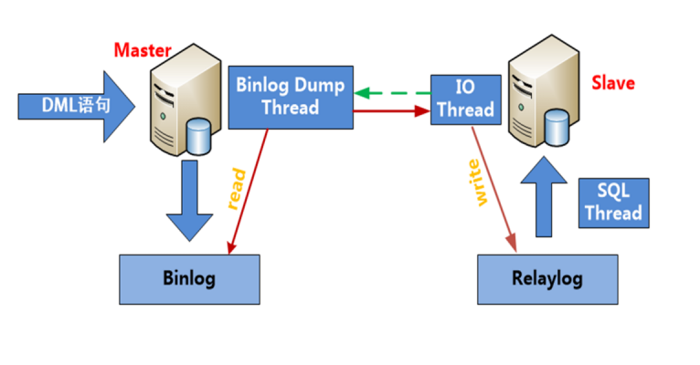

**详细描述：**

1. slave端的IO线程发送请求给master端的binlog dump线程
2. master端binlog dump线程==获取二进制日志==信息(==文件名和位置信息==)发送给slave端的IO线程
3. salve端IO线程获取到的内容==依次==写到slave端relay log里，并把master端的bin-log文件名和位置记录到master.info里
4. salve端的SQL线程，检测到relay  log中内容更新，就会解析relay log里更新的内容，并==执行这些操作==，从而达到和master数据一致

###3、MySQL复制架构

####㈠  双机热备（AB复制）

 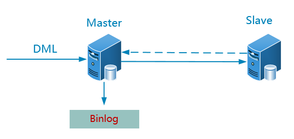

**默认情况下，master接受读写请求，slave只接受读请求以减轻master的压力。**

####㈡  级联复制

 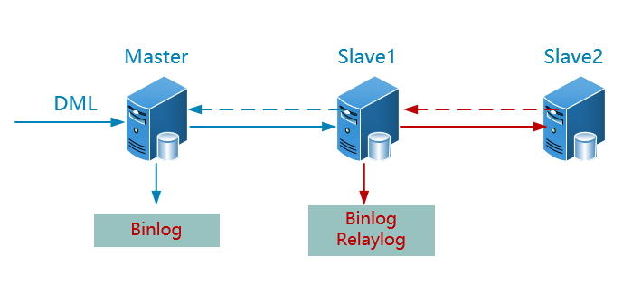

**优点：**进一步分担读压力

**缺点：**slave1 出现故障，后面的所有级联slave服务器都会同步失败

####㈢ 并联复制

 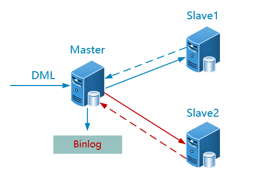

**优点：**解决上面的slave1的单点故障，同时也分担读压力

**缺点：**间接增加master的压力（传输二进制日志压力）

####㈣ 双主复制

 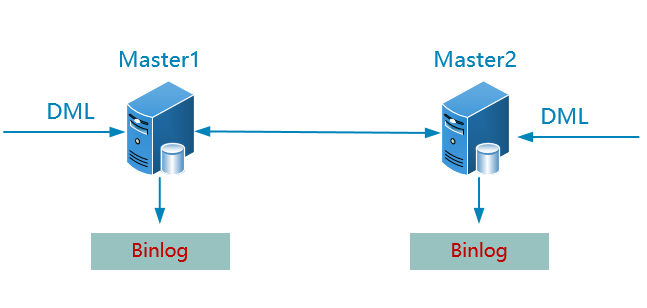

**特点：**

从命名来看，两台master好像都能接受读、写请求，但实际上，往往运作的过程中，同一时刻只有其中一台master会接受写请求，另外一台接受读请求。

##三、MySQL复制搭建

###1、传统AB复制架构(M-S)

**说明**：当前环境中master上已有mysql数据库，版本为5.7.31

####㈠ 环境说明

| IP        | 主机名                     | 角色       |
| --------- | -------------------------- | ---------- |
| 10.1.1.10 | db01.heima.cc  别名:master | master(主) |
| 10.1.1.20 | db02.heima.cc  别名:slave  | salve(从)  |

####㈡ 安装前环境准备

1、关闭防火墙和selinux

```shell
# systemctl stop firewalld
# systemctl disable firewalld
# systemctl list-unit-files|grep firewalld
# setenforce 0
# sed -i '/^SELINUX=/cSELINUX=disabled' /etc/selinux/config
```

2、修改主机名

```shell
master上
# hostnamectl set-hostname db01.heima.cc
slave上
# hostnamectl set-hostname db02.heima.cc
```

3、绑定IP地址和主机名到hosts文件

说明：主从两台服务器一起完成

```powershell
# cat /etc/hosts
追加以下内容
10.1.1.10 db01.heima.cc master
10.1.1.20 db02.heima.cc slave

```

4、同步系统时间

说明：保证两台服务器系统时间一致即可

####㈢ 搭建主从复制思路

1. slave必须安装相同版本的mysql数据库软件
2. master端必须开启==二进制日志==；slave端必须开启==relay log日志==
3. master端和slave端的server-id号==不能一致==
4. slave端配置向master来同步数据
   - master端必须创建一个复制用户
   - 保证master和slave端==初始数据一致==
   - 配置主从复制（slave端）

####㈣ 主从搭建步骤

#####① Slave安装MySQL软件

```powershell
# useradd -r -s /sbin/nologin mysql
# tar -xf mysql-5.7.31-linux-glibc2.12-x86_64.tar.gz
# mv mysql-5.7.31-linux-glibc2.12-x86_64 /usr/local/mysql
# echo "export PATH=$PATH:/usr/local/mysql/bin" >> /etc/profile
# source /etc/profile
# cd /usr/local/mysql
# cp support-files/mysql.server /etc/init.d/mysql

注意：
暂时不需要初始化数据库文件，只是安装好了和master相同版本的mysql数据库软件；后面向master来同步所有数据。
```

#####② 修改主从配置文件

注意：master和slave都要修改！

- Master服务器配置文件

```powershell
[root@db01 ~]# cat /etc/my.cnf
[mysqld]
basedir=/usr/local/mysql
datadir=/usr/local/mysql/data
socket=/usr/local/mysql/mysql.sock
port=3310
log-error=/usr/local/mysql/db01-master.err
log-bin=/usr/local/mysql/data/binlog
server-id=10
character_set_server=utf8mb4
```

- Slave服务器配置文件

```powershell
[root@db02 ~]# cat /etc/my.cnf
[mysqld]
basedir=/usr/local/mysql
datadir=/usr/local/mysql/data
socket=/usr/local/mysql/mysql.sock
port=3320
log-error=/usr/local/mysql/db02-slave.err
relay-log=/usr/local/mysql/data/relaylog
server-id=20
character_set_server=utf8mb4
```

#####③ 同步master数据到slave

1）停止master上的mysql服务

```powershell
# service mysql stop
```

2）==删除master上auto.cnf文件==

```powershell
[root@db01 data]# pwd
/usr/local/mysql/data
[root@db01 data]# rm -f auto.cnf
说明：auto.cnf文件里保存的是每个数据库实例的UUID信息，代表数据库的唯一标识
```

3）同步master数据到slave

```powershell
[root@db01 ~]# rsync -av /usr/local/mysql/data 10.1.1.20:/usr/local/mysql/
```

4）启动master和slave数据库

```powershell
[root@db02 ~]# service mysql start
[root@db01 ~]# service mysql start
```

#####④ 配置slave同步master数据

1）==master==端创建授权用户

```powershell
mysql> create user 'slave'@'10.1.1.%' identified by '123';
Query OK, 0 rows affected (0.00 sec)

mysql> grant replication slave on *.* to 'slave'@'10.1.1.%';
Query OK, 0 rows affected (0.00 sec)

mysql> flush privileges;
Query OK, 0 rows affected (0.00 sec)
```

2）查看==master==上正在写的二进制文件名和位置

```powershell
先加锁，防止两边数据不一致
mysql> flush tables with read lock;
查看当前数据库的二进制日志写到什么位置（只有打开二进制日志，这句命令才有结果）
mysql> show master status;
```

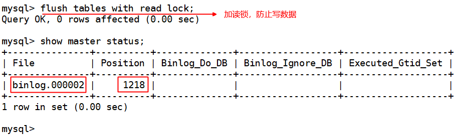

3）==slave==上配置同步信息

```powershell
mysql> change master to
    -> master_host='10.1.1.10',
    -> master_user='slave',
    -> master_password='123',
    -> master_port=3310,
    -> master_log_file='binlog.000002',
    -> master_log_pos=1218;


说明：
master_host   		master的IP
master_user	  		复制的用户
master_password  	复制用户密码
master_port			master的端口号
master_log_file	master正在写的二进制文件名，锁表后查看的
master_log_pos    master正在写的二进制位置
```

4）启动复制线程，开始同步

```powershell
mysql> start slave;
mysql> show slave status\G;
				.....
            Slave_IO_Running: Yes 代表成功连接到master并且下载日志
            Slave_SQL_Running: Yes 代表成功执行日志中的SQL语句
启动slave报如下错误：
mysql> start slave;
ERROR 1872 (HY000): Slave failed to initialize relay log info structure from the repository
解决：删除relay-log.info，重启mysql服务或者mysql>reset slave;
```

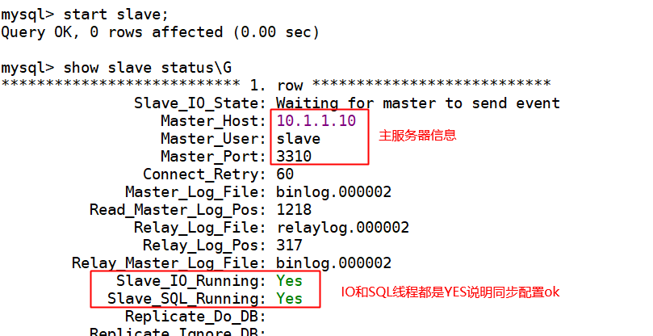

5）master上解锁

```powershell
mysql> unlock tables;
Query OK, 0 rows affected (0.00 sec)
```

6）测试验证

#####⑤ 主从配置总结

1. 主从复制必须保证两台数据库实例的==server-id不一致==
2. 主服务器==必须开启二进制日志==；从服务器==必须开启中继日志==
3. 主从复制搭建==必须保证初始数据一致==
4. 主服务器必须要给从服务器==创建一个复制用户，并授予复制权限==
5. Master—>Slave架构，==主写会同步到从==；而==从写不会同步到主==

#####⑥ 数据不一致导致同步失效

问：

如果由于人为操作或者其他原因直接将数据更改到从服务器导致数据同步失效，怎么解决？

答：可以通过变量`sql_slave_skip_counter`临时跳过事务进行处理

```powershell
SET GLOBAL sql_slave_skip_counter = N  	N代表跳过N个事务
举例说明：
mysql> SET GLOBAL sql_slave_skip_counter=1;
mysql> stop slave;
mysql> start slave;
注意：
1. 跳过事务应该在slave上进行
2. 传统的AB复制方式可以使用变量：sql_slave_skip_counter，基于GTIDs的方式不支持
```

###2、基于GTIDs的AB复制架构(M-S)

####㈠ 关于GTIDs概述

- **什么是GTIDs以及有什么特点？**

1. GTIDs（Global transaction identifiers）==全局事务标识符==，是mysql 5.6新加入的一项技术

2. 当使用GTIDs时，每一个事务都可以被==识别并且跟踪== 

3. 添加新的slave或者当发生故障需要将master身份或者角色迁移到slave上时，都无需考虑是哪一个二进制日志以及哪个position值，==极大简化了相关操作==

4. GTIDs是完全基于事务的，因此==不支持MYISAM存储引擎== 

5. ==GTID由source_id和transaction_id组成==： 

   1）source_id来自于server_uuid,可以在auto.cnf中看到

   2）transation_id是一个序列数字，自动生成.

- **使用GTIDs的限制条件有哪些？**

1. 不支持非事务引擎（MyISAM），因为可能会导致多个gtid分配给同一个事务
2. create table ... select 语句不支持（主库语法报错）
3. create/drop **temporary table** 语句不支持
4. 必须使用enforce-gtid-consistency参数 
5. sql-slave-skip-counter不支持(传统的跳过错误方式) 
6. GTID复制环境中必须要求统一开启和GTID或者关闭GTID 
7. 在mysql 5.6.7之前，使用==mysql_upgrade==命令会出现问题

####㈡ 基于GTIDs的配置

在生产环境中，大多数情况下使用的MySQL5.6基本上都是从5.5或者更低的版本升级而来，这就意味着之前的mysql replication方案是基于传统的方式部署，并且已经在运行，因此，接下来我们就利用已有的环境升级至基于GITDs的Replication

#####〇 思路

1. 修改配置文件支持GTIDs  (主+从)
2. 重启数据库  (主+从)
3. 为了保证数据一致性，master和slave设置为只读模式 (主+从)
4. ==从服务器上重新配置同步== （从）

##### ① 修改配置文件支持GTIDs

```powershell
[root@db01 ~]# cat /etc/my.cnf
[mysqld]
basedir=/usr/local/mysql
datadir=/usr/local/mysql/data
socket=/usr/local/mysql/mysql.sock
port=3310
log-error=/usr/local/mysql/db01-master.err
log-bin=/usr/local/mysql/data/binlog
server-id=10
character_set_server=utf8mb4
gtid-mode=on
log-slave-updates=1
enforce-gtid-consistency

[client]
socket=/usr/local/mysql/mysql.sock

[root@db02 ~]# cat /etc/my.cnf
[mysqld]
basedir=/usr/local/mysql
datadir=/usr/local/mysql/data
socket=/usr/local/mysql/mysql.sock
port=3320
log-error=/usr/local/mysql/db02-slave.err
relay-log=/usr/local/mysql/data/relaylog
server-id=20
character_set_server=utf8mb4
log-slave-updates=1
gtid-mode=on
enforce-gtid-consistency
skip-slave-start

[client]
socket=/usr/local/mysql/mysql.sock


说明：
1）开启GITDs需要在master和slave上都配置gtid-mode，log-bin，log-slave-updates，enforce-gtid-consistency（该参数在5.6.9之前是--disable-gtid-unsafe-statement）
2）其次，slave还需要增加skip-slave-start参数,目的是启动的时候，先不要把slave起来，需要做一些配置
3）基于GTIDs复制从服务器必须开启二进制日志！
```

##### ② 重起主从数据库服务

```powershell
[root@db01 ~]# service mysql restart
Shutting down MySQL............ SUCCESS!
Starting MySQL.. SUCCESS!
[root@db02 ~]# service mysql restart
Shutting down MySQL.... SUCCESS!
Starting MySQL.. SUCCESS! 
```

#####③ 主从设置只读模式

```powershell
mysql> set @@global.read_only=ON;
```

#####④ slave重新配置同步

```powershell
mysql> change master to master_host='10.1.1.10',master_user='slave',master_password='123',master_port=3310,master_auto_position=1;

注意：
1.确保有复制用户
2.主要区别于传统复制的参数是：master_auto_position=1
```

#####⑤ slave上启动同步线程

```powershell
mysql> start slave;
```

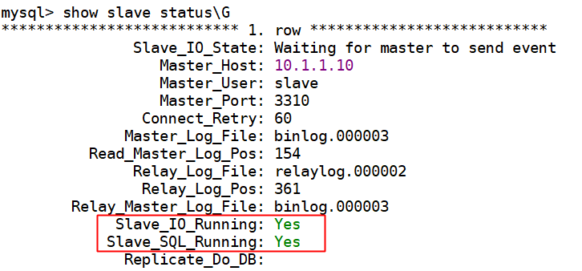

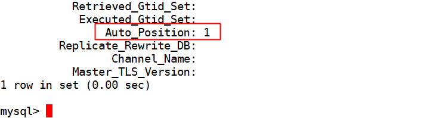

#####⑥ 关闭master只读模式

```powershell
mysql> set @@global.read_only=OFF;
```

#####⑦ 测试验证


####㈢ 基于GTIDs手动跳过事务

~~~powershell
指定需要跳过的GTIDs编号
SET GTID_NEXT='aaa-bbb-ccc-ddd:N';
开始一个空事务
BEGIN;
COMMIT;
使用下一个自动生成的全局事务ID。
SET GTID_NEXT='AUTOMATIC';

举例说明：
mysql> stop slave;
mysql> SET @@SESSION.GTID_NEXT= '044e6392-cf9b-11e8-a748-000c294ca304:3';
mysql> BEGIN;
mysql> commit;
mysql> SET @@SESSION.GTID_NEXT= 'AUTOMATIC';	
mysql> start slave;
mysql> show slave status\G

说明：需要跳过哪个事务，需要手动查看relaylog文件得到
[root@slave1 data]# ../bin/mysqlbinlog relay.000003|less
。。。。
# at 756
#181015 12:04:45 server id 10  end_log_pos 817 CRC32 0x5374f49e         GTID [commit=yes]
SET @@SESSION.GTID_NEXT= '044e6392-cf9b-11e8-a748-000c294ca304:3'/*!*/;
~~~

###3、其他复制架构

####㈠ M-S1-S2

**核心：**

1. 中间==slave1==机器打开`log-slave-updates=1`参数，将master上的二进制日志同事保存到自己的二进制日志中，以便其他从服务器来同步
2. 其他配置和M-S架构一样
3. 测试验证
   - master上更新数据，slave1和slave2都可以同步
   - 关闭slave1，再次更新master数据，slave2不能同步
   - 启动slave1后，slave1和slave2又再次同步了数据

####㈡ M1-M2

1. 配置和M-S一样，再互换角色配置同步
2. 测试验证：M1写数据M2同步；M2写数据M1同步

###4、复制总结

​        上面的复制架构==默认都是异步==的，也就是主库将binlog日志发送给从库，这一动作就结束了，并==不会验证从库是否接受完毕==。这样可以提供==最佳的性能==。但是同时也带来了很高的风险，当主服务器或者从服务器发生故障时，极有可能从服务器没有接到主服务器发过来的binglog日志，这样就会==导致主从数据不一致==，甚至导致数据丢失。为了解决该问题，mysql5.5引入了==半同步复制模式。==

###5、半同步复制

 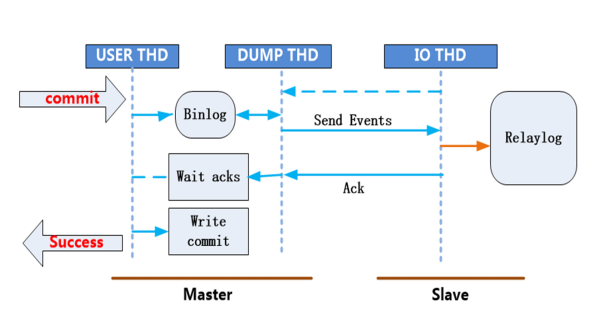

所谓的半同步复制就是master每commit一个事务(简单来说就是做一个改变数据的操作）,要确保slave接受完主服务器发送的binlog日志文件==并写入到自己的中继日志relay log里==，然后会给master信号，告诉对方已经接收完毕，这样master才能把事物成功==commit==。这样就保证了master-slave的==数据绝对的一致==（但是以牺牲==master的性能为代价==).但等待时间也是可以调整的。

####㈠ 准备M-S复制架构

```powershell
自己准备完成
```

####㈡ 半同步复制配置步骤

#####① 安装插件

插件存放目录：``$basedir/lib/plugin/`

- master上安装插件

```powershell
mysql> install plugin rpl_semi_sync_master soname 'semisync_master.so';
Query OK, 0 rows affected (0.00 sec)
查看是否安装成功
mysql> show global variables like 'rpl_semi_sync%';
+------------------------------------+-------+
| Variable_name                      | Value |
+------------------------------------+-------+
| rpl_semi_sync_master_enabled       | OFF   |
是否启用master的半同步复制
| rpl_semi_sync_master_timeout       | 10000 |
默认主等待从返回信息的超时间时间，10秒。动态可调
| rpl_semi_sync_master_trace_level   | 32    |
用于开启半同步复制模式时的调试级别，默认是32 
| rpl_semi_sync_master_wait_no_slave | ON    |
是否允许每个事物的提交都要等待slave的信号.on为每一个事物都等待，off则表示slave追赶上后，也不会开启半同步模式，需要手动开启
+------------------------------------+-------+

```

- slave上安装插件

```powershell
mysql> install plugin rpl_semi_sync_slave soname 'semisync_slave.so';
mysql> show global variables like 'rpl_semi_sync%';
+---------------------------------+-------+
| Variable_name                   | Value |
+---------------------------------+-------+
| rpl_semi_sync_slave_enabled     | OFF   |   slave是否启用半同步复制
| rpl_semi_sync_slave_trace_level | 32    |
+---------------------------------+-------+
```

#####② 激活半同步复制

- master上

```powershell
mysql>  set global rpl_semi_sync_master_enabled =on;

mmysql> show global status like 'rpl_semi_sync%';
+--------------------------------------------+-------+
| Variable_name                              | Value |
+--------------------------------------------+-------+
| Rpl_semi_sync_master_clients               | 1     |
有一个从服务器启用半同步复制
| Rpl_semi_sync_master_net_avg_wait_time     | 0     |
master等待slave回复的平均等待时间。单位毫秒
| Rpl_semi_sync_master_net_wait_time         | 0     |
master总的等待时间。单位毫秒
| Rpl_semi_sync_master_net_waits             | 0     |
master等待slave回复的总的等待次数
| Rpl_semi_sync_master_no_times              | 0     |
master关闭半同步复制的次数
| Rpl_semi_sync_master_no_tx                 | 0     |
表示从服务器确认的不成功提交的数量
| Rpl_semi_sync_master_status                | ON    |
标记master现在是否是半同步复制状态
| Rpl_semi_sync_master_timefunc_failures     | 0     |
master调用时间（如gettimeofday())失败的次数	
| Rpl_semi_sync_master_tx_avg_wait_time      | 0     |
master花在每个事务上的平均等待时间
| Rpl_semi_sync_master_tx_wait_time          | 0     |
master花在事物上总的等待时间
| Rpl_semi_sync_master_tx_waits              | 0     |
master事物等待次数
| Rpl_semi_sync_master_wait_pos_backtraverse | 0     |
后来的先到了，而先来的还没有到的次数
| Rpl_semi_sync_master_wait_sessions         | 0     |
当前有多少个session因为slave回复而造成等待
| Rpl_semi_sync_master_yes_tx                | 0     |
表示从服务器确认的成功提交数量
+--------------------------------------------+-------+
```

- slave上

```powershell
mysql> set global rpl_semi_sync_slave_enabled=on;
mysql> show global status like 'rpl_semi_sync%';
+----------------------------+-------+
| Variable_name              | Value |
+----------------------------+-------+
| Rpl_semi_sync_slave_status | ON    |
+----------------------------+-------+
```

#####③ 重启slave的IO线程

```powershell
mysql> stop slave IO_THREAD;
mysql> start slave IO_THREAD;
```

#####④ 测试验证

==原理：==

当slave从库的IO_Thread 线程将binlog日志接受完毕后，要给master一个确认，如果超过10s未收到slave的接收确认信号，那么就会自动转换为传统的异步复制模式。

1）master插入一条记录，查看slave是否有成功返回

```powershell
mysql> insert into a values (3);
Query OK, 1 row affected (0.01 sec)

mysql> show global status like 'rpl_semi_sync%_yes_tx'; 
+-----------------------------+-------+
| Variable_name               | Value |
+-----------------------------+-------+
| Rpl_semi_sync_master_yes_tx |  1    |
表示这次事物成功从slave返回一次确认信号
+-----------------------------+-------+
```

2）slave上模拟故障查看返回时间

当slave挂掉后，master这边更改操作

```powershell
# service stop mysql
或者直接停止slave的IO_thread线程
mysql> stop slave io_thread;

mysql> insert into a values (4);
Query OK, 1 row affected (10.00 sec)
这次插入一个值需要等待10秒（默认的等待时间)

mysql> insert into a values (5);
Query OK, 1 row affected (0.01 sec)
现在自动转成了原来的异步模式
```

3）再次启动slave，查看同步模式

```powershell
mysql> show global status like 'rpl_semi_sync%';
+----------------------------+-------+
| Variable_name              | Value |
+----------------------------+-------+
| Rpl_semi_sync_slave_status | OFF    |
+----------------------------+-------+
如需要再次半同步复制，则按照以上步骤重新开启就可以

mysql> set global rpl_semi_sync_slave_enabled=on;
mysql> stop slave IO_THREAD;
mysql> start slave IO_THREAD;

或者可以将该参数写入到配置文件中：
master：rpl_semi_sync_master_enabled=1
slave：rpl_semi_sync_slave_enabled=1  

```

4、测试结果

5、master需要等到slave确认后才能提交，如果等不到确认消息，master等待10s种后自动变成异步同步;slave启起来后，master上改变的数据还是会自动复制过来，数据又回到一致。

6、等待时间可以在master上动态调整，如下

~~~powershell
mysql> set global rpl_semi_sync_master_timeout=3600000;
mysql> show global variables like 'rpl_semi_sync%';
+------------------------------------+---------+
| Variable_name                      | Value   |
+------------------------------------+---------+
| rpl_semi_sync_master_enabled       | ON      |
| rpl_semi_sync_master_timeout       | 3600000 |
| rpl_semi_sync_master_trace_level   | 32      |
| rpl_semi_sync_master_wait_no_slave | ON      |
+------------------------------------+---------+
~~~

##### ⑤ 卸载插件

```powershell
mysql> select plugin_name,load_option from information_schema.plugins;
mysql> uninstall plugin plugin_name;
```

###6、经验值分享

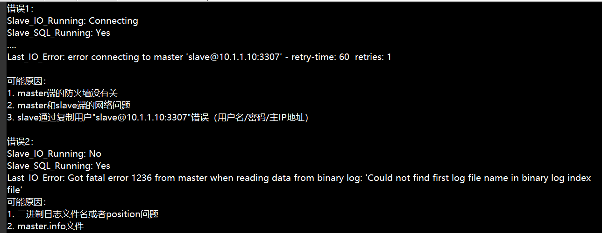

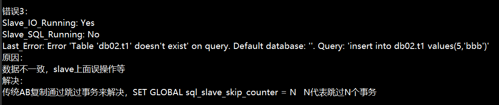

###7、扩展补充

- 跟复制相关的文件

```powershell
master.info
用于保存slave连接至master的相关信息，包括服务器地址，用户名，密码等
relay-log.info
保存在当前的slave节点上已经复制的当前二进制日志和本地relay log日志的对应关系
```

- 复制的监控和维护

```powershell
purge 命令 
    mysql> purge binary logs to 'mysql-bin.000008'; 
    指明这个二进制文件之前的所有的文件都会被清理

    mysql> purge binary logs before '2017-04-23 20:46:26'; 
    指明二进制日志文件中这个时间点之前的所有的事件都会被清理

监控操作
    mysql> show master status; 显示主节点正在写哪个二进制日志文件
    mysql> show binlog events; 显示在二进制文件中记录了哪些信息
    mysql> show binary logs ; 显示记录了哪些二进制日志文件
    mysql> show slave status; 显示从服务器的状态
    mysql> show processlist; 显示当前启用的线程
```

#课后实战

使用今天所学，完成今天的任务，形成技术文档

