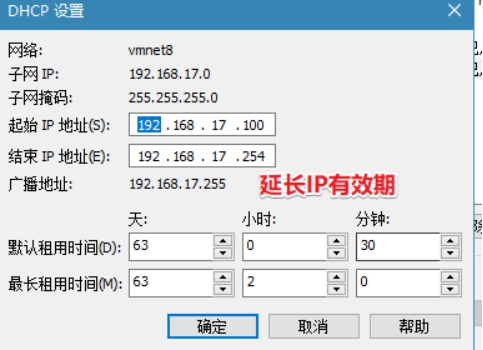
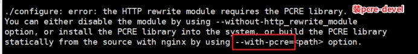

# 公司企业架构LNMP(单点服务器部署)

> **学习目标和内容**
>
> 1、能够描述项目流程
>
> 2、能够了解PV、QPS、DAU等参数
>
> 3、能够实现服务器基本环境配置
>
> 4、能够部署配置MySQL生产环境
>
> 5、能够部署配置Nginx生产环境
>
> 6、能够部署配置PHP生产环境
>
> 7、能够理解PHP-FPM和Nginx关联关系
>
> 8、能够配置Nginx关联到PHP-FPM

# 一、运维十年演变发展史

## 1、项目开发流程

公司老板和产品经理根据市场调查，决定开发的一整套互联网产品

==互动社交+**电商**+用户论坛（BBS）==

> 产品决策（老板+产品+UI设计）=》代码开发（程序开发人员[前端开发[客户端页面或者APP]和后端开发[java php python node ruby]）=》测试工作（测试人员）=》部署上线（运维人员）（SA、dev 开发ops 运维）

项目从开始策划，实施，上线，维护，一直到结束。称之为==项目的生命周期==。

**作为运维人员来说，不仅仅是在上线流程中参与。**

需要在策划，实施之初，就进行准备工作。学习对应架构和方案的知识点等。

比如：

①项目代码使用lnmp架构   那么就需要对lnmp架构熟悉

②开发人员需要多人协作开发，合并代码，就需要服务器上搭建代码版本控制器

③测试人员需要用到的测试环境等等

## 2、企业架构分布式集群解决方案

> **集群：多台服务器在一起作同样的事 。**
>
> **分布式 ：多台服务器在一起作不同的事 。**
>
> ​	小饭店原来只有一个厨师，切菜洗菜备料炒菜全干。后来客人多了，厨房一个厨师忙不过来，又请了个厨师，两个厨师都能炒一样的菜，这两个厨师的关系是集群。为了让厨师专心炒菜，把菜做到极致，又请了个配菜师负责切菜，备菜，备料，厨师和配菜师的关系是分布式，一个配菜师也忙不过来了，又请了个配菜师，两个配菜师关系是集群

最终的架构图示

实现负载均衡LB、高可用HA、数据库主从复制M-S、读写分离R-W、缓存中间件[memcached、Redis]  nosql[mongodb]·······


## 3、业务背景

> 年份：2008-2010
>
> 发布产品类型：互联网动态站点 社区论坛 商城 社交类站点
>
> ⽤户数量： 100-500
>
> **PV** ： 1000-3000（24小时访问次数总和  8小时） 页面访问数量  点击量
>
> **QPS**： 5-10（每秒访问查询次数） 并发量  吞吐量  TPS  RPS 
>
> **DAU**： 10-50（每日活跃用户数） 日活数  根据用户登录等方式
>
> **QPS 两种方法：**
>
> **①计算  pv/时间 = qps**
>
> **②压测 使用ab等并发测试软件   在规定时间发送一定的请求数量**

# 二、服务器基本环境部署

为了学习的方便和需要，需要先进行基本环境的搭建

> 1、安装一台虚拟机，centos6.9操作系统
>
> 2、网络配置
>
> 3、机器名FQDN设置
>
> 4、DNS解析设置  本地Hosts解析
>
> 5、各类防火墙暂时关闭
>
> 6、配置需要的yum环境及其源地址
>
> 7、vim安装配置
>
> 8、网络校时 ntpd

## 1、虚拟机软件搭建

可以参考文档《虚拟机和镜像.doc》

## 2、准备好ISO镜像文件

这里安装系统镜像，采用==minimal的方式==，自定义==选择开发工具==。安装更加快速，系统也更加轻便。

可以参考文档《虚拟机和镜像.doc》

以上操作完成基本服务器镜像系统的安装

## 3、网络配置和检测

维护的机器数量比较多时，单独配置静态IP是很繁琐。这里使用NAT模式，DHCP自动分配IP

**①vmware NAT连接方式，本地DHCP服务启用**


注意NAT服务和DHCP服务需要启动


**②IP租约和续约**



> **不管采用何种方式获取到IP都可以，能够管理清晰和使用明白即可。**

## 4、FQDN设置（重要）

在集群中配置FQDN，有助于进行区分主机身份。

server01   server01.lnmp.com

**①添加修改/etc/hosts**

```shell
shell > vim /etc/hosts
#在文件里追加一行
192.168.17.102 server01.lnmp.com server01
```

**②网卡配置/etc/sysconfig/network**

```shell
shell > vim /etc/sysconfig/network
#修改HOSTNAME的值为server01
HOSTNAME=server01
```

## 5、防火墙关闭

centos6.x系列中

**①关闭iptables**

```shell
#关闭iptables
shell > service iptables stop
#关闭开机自启动
shell > chkconfig iptables off
```

**②关闭selinux**

```shell
#临时关闭
shell > setenforce 0 &>>/dev/null
#修改配置文件  永久关闭
shell > sed -i "s/SELINUX=enforcing/SELINUX=disabled/" /etc/selinux/config;
```

## 6、yum源环境配置

配置本地光盘源，使用centos的两个光盘：

**①虚拟机添加新光驱并选择光盘路径**

注意添加设备，需要关闭虚拟机里的操作系统


**②linux挂载多个光盘**

```shell
#建立光盘挂载目录文件夹
shell > mkdir /dvd1 /dvd2
#手动挂载光盘 顺便调整光盘顺序
shell > mount /dev/sr0 /dvd2
shell > mount /dev/sr1 /dvd1
#lsblk查看是否挂载成功
#添加到开启加载脚本  开机自动挂载光盘
shell > echo "mount /dev/sr0 /dvd2" >> /etc/rc.local
shell > echo "mount /dev/sr1 /dvd1" >> /etc/rc.local
```

**③配置yum本地光盘源**

```shell
shell > cd /etc/yum.repos.d
shell > mkdir bak
#移动默认源 备份并使其失效
shell > mv ./* ./bak
#按照挂载光盘位置，配置光盘源
```

## 7、安装vim编辑器并配置

**①yum 安装vim配置显示行号**

```shell
shell > yum -y install vim
#配置vim默认显示行号
shell > echo "set nu" >> /root/.vimrc
```

**②grep搜索关键字高亮显示**

```shell
#搜索关键字高亮
shell > sed -i "8calias grep='grep --color'" /root/.bashrc
#当前窗口重新加载配置
shell > source /root/.bashrc
```


## 8、网络校时（重要）

> 服务器校时的原因：
>
> ①因为计划任务要执行，提供准确的时间
>
> ②服务器间进行通信时，需要统一的一致时间

```shell
#安装校时命令和服务
shell > yum -y install ntp
#开启ntpd服务
shell > service ntpd start
#开机自启ntpd
shell > chkconfig ntpd on
```

国内第三方NTP校时网址

<https://opsx.alibaba.com/service?lang=zh-cn&activeKey=2>

# 三、企业服务器LNMP环境搭建

> 常见的软件架构：
>
> **①C/S  client/server**
>
> **②B/S  browser/server**
>
> ​		 不管是C还是B，都是属于客户端属于前端。那么运维人员主要负责和管理的是server端，也统称为服务器端。为了能够提供快速的提供服务端使用，互联网中有多种解决方案和架构，其中以下两种架构有着广泛的使用基础。
>
> **1> LAMP   Linux+Apache+MySQL+PHP**
> **2> LNMP   Linux+Nginx+MySQL+PHP**
>
> lnmpa  nginx+mysql+php+apache
>
> lnmt   nginx+mysql+tomcat（jdk）
>
> nginx+mysql+（python+nodejs|ruby)

之前已经学习过了LAMP架构，接上来学习==LNMP架构解决方案==。

在企业中搭建实际业务环境时，一般依赖文件（小文件）使用yum安装解决，生产业务环境需要使用源码编译的方式进行安装。

> 源码编译预估时间:
>
> Mysql 852s≈15m
>
> Nginx 27s≈1m
>
> PHP  564s≈10m

## 1、MySQL

###1.1、相关参数介绍

**编译参数的说明**

| -DCMAKE_INSTALL_PREFIX          | 安装到的软件目录                  |
| ------------------------------- | --------------------------------- |
| -DMYSQL_DATADIR                 | 数据文件存储的路径                |
| -DSYSCONFDIR                    | 配置文件路径  (my.cnf)            |
| -DENABLED_LOCAL_INFILE=1        | 使用localmysql客户端的配置        |
| -DWITH_PARTITION_STORAGE_ENGINE | 使mysql支持分表                   |
| -DEXTRA_CHARSETS                | 安装支持的字符集                  |
| -DDEFAULT_CHARSET               | 默认字符集使用  这里配置为utf8mb4 |
| -DDEFAULT_COLLATION             | 连接字符集                        |
| -DWITH_SSL                      | 开启mysql的ssl使用                |

**初始化参数说明**

| --basedir | 安装到的软件目录 |
| --------- | ---------------- |
| --datadir | 数据文件存储路径 |
| --user    | mysql使用的用户  |

###1.2、脚本实现安装及其初始化

```shell
#!/bin/bash
#源码编译安装MySQL
mysql_install() {
	#1、创建用户
`id mysql` &>/dev/null
[ $? -ne 0 ] && useradd -s /sbin/nologin -M mysql
#2、解决依赖
yum install -y cmake
yum install -y ncurses-devel
#3、编译安装
cd /root/soft
tar zxvf mysql-5.6.33.tar.gz
cd mysql-5.6.33
cmake \
-DCMAKE_INSTALL_PREFIX=/usr/local/mysql \
-DMYSQL_DATADIR=/usr/local/mysql/data \
-DSYSCONFDIR=/etc \
-DENABLED_LOCAL_INFILE=1 \
-DWITH_PARTITION_STORAGE_ENGINE=1 \
-DEXTRA_CHARSETS=all \
-DDEFAULT_CHARSET=utf8mb4 \
-DDEFAULT_COLLATION=utf8mb4_general_ci\
-DWITH_SSL=bundled
make && make install
#配置文件
rm -rf /etc/my.cnf
cp /usr/local/mysql/support-files/my-default.cnf /etc/my.cnf
#授权并初始化数据库
chown -R mysql:mysql /usr/local/mysql
/usr/local/mysql/scripts/mysql_install_db --basedir=/usr/local/mysql --datadir=/usr/local/mysql/data --user=mysql
#配置服务、自启动和环境变量
cp /usr/local/mysql/support-files/mysql.server /etc/init.d/mysqld
service mysqld start
chkconfig --add mysqld
echo 'PATH=/usr/local/mysql/bin:$PATH' >> /etc/profile
#删除匿名用户
#设置root域名的密码
rpm -qa|grep expect
if [ $? -ne 0 ];then
   yum -y install expect
fi
#导入环境变量PATH
export PATH=/usr/local/mysql/bin:$PATH
#初始化root密码 删除匿名用户
echo '#!/usr/bin/expect
set timeout 60
spawn mysql_secure_installation
expect {
"enter for none" { send "\r"; exp_continue}
"Y/n" { send "Y\r" ; exp_continue}
"password" { send "123456\r"; exp_continue}
"Cleaning up" { send "\r"}
}
interact ' > mysql_secure_installation.exp
chmod +x mysql_secure_installation.exp
./mysql_secure_installation.exp
}
#脚本开始时间
start_time=`date +%s`
#执行的脚本代码
mysql_install
#脚本结束时间
end_time=`date +%s`
#脚本执行花费时间
const_time=$((end_time-start_time))
echo 'Take time is: '$const_time's'
```

## 2、Nginx

### 2.1、介绍


**常见用法：**

> **1) web服务器软件 httpd http协议**
>
> 同类的web服务器软件：apache nginx(俄罗斯) IIS(微软 fastcgi) lighttpd(德国)
>
> **2)代理服务器   反向代理**  
>
> 3)邮箱代理服务器  IMAP POP3 SMTP
>
> **4)负载均衡功能  LB  loadblance**

**Nginx架构的特点：**

> ①**高可靠**：稳定性  master进程 管理调度请求分发到哪一个worker=> worker进程 响应请求   一master多worker
>
> ②**热部署** ：（1）平滑升级  （2）可以快速重载配置
>
> ③**高并发**：可以同时响应更多的请求  事件 epoll模型   几万
>
> ④**响应快**：尤其在处理静态文件上，响应速度很快  sendfile
>
> ⑤**低消耗**：cpu和内存   1w个请求  内存2-3MB
>
> ⑥**分布式支持** ：反向代理  七层负载均衡

官方网址：<http://nginx.org/>

### 2.2、安装

常见安装方式：

①yum安装配置，需使用Nginx官方源或者EPEL源

**②源码编译**

> ==问题编译过程中出现问题：==
>
> 
>
> 
>
> 
>
> ==依赖解决==
>
> ```shell
> shell > yum -y install pcre-devel zlib-devel openssl-devel
> ```

**安装步骤及其脚本**

```shell
#!/bin/bash
#编译安装Nginx
nginx_install(){
#创建软件运行用户
`id www` &>>/dev/null
if [ $? -ne 0 ];then
   useradd -s/sbin/nologin -M www
fi
#安装依赖
yum -y install pcre-devel zlib-devel openssl-devel
#编译安装
cd /root/soft
tar xvf nginx-1.14.2.tar.gz
cd nginx-1.14.2
./configure --prefix=/usr/local/nginx --user=www --group=www --with-http_ssl_module --with-http_stub_status_module --with-http_realip_module && make && make install
}
#脚本开始时间
start_time=`date +%s`
#执行的脚本代码
nginx_install
#脚本结束时间
end_time=`date +%s`
#脚本执行花费时间
const_time=$((end_time-start_time))
echo 'Take time is: '$const_time's'
```

编译参数说明

| 参数                           | 作用                                                         |
| ------------------------------ | ------------------------------------------------------------ |
| --prefix                       | 编译安装到的软件目录                                         |
| --user                         | worker进程运行用户                                           |
| --group                        | worker进程运行用户组                                         |
| --with-http_ssl_module         | 支持https  需要==**pcel-devel**==依赖                        |
| --with-http_stub_status_module | 基本状态信息显示       查看请求数、连接数等                  |
| --with-http_realip_module      | 定义客户端地址和端口为header头信息     常用于反向代理后的真实IP获取 |

###2.3、目录介绍

查看安装目录/usr/local/nginx

| 目录 | 作用                                 |
| ---- | ------------------------------------ |
| conf | 配置文件                             |
| html | 网站默认目录                         |
| logs | 日志                                 |
| sbin | 可执行文件  [软件的启动 停止 重启等] |

###2.4、软件操作参数

**查看nginx的二进制可执行文件的相关参数**

```shell
shell > cd /usr/local/nginx/sbin
shell > ./nginx -h
```

**执行后显示**

```shell
nginx version: nginx/1.14.2
Usage: nginx [-?hvVtTq] [-s signal] [-c filename] [-p prefix] [-g directives]

Options:
#查看帮助
  -?,-h         : this help
#查看版本并退出
  -v            : show version and exit
#查看版本和配置选项并退出
  -V            : show version and configure options then exit
#检测配置文件语法并退出
  -t            : test configuration and exit
#检测配置文件语法打印它并退出
  -T            : test configuration, dump it and exit
#在配置测试期间禁止显示非错误信息
  -q            : suppress non-error messages during configuration testing
#发送信号给主进程  stop强制退出  quit优雅的退出  reopen重开日志   reload重载配置
  -s signal     : send signal to a master process: stop, quit, reopen, reload
#设置nginx目录  $prefix路径
  -p prefix     : set prefix path (default: /usr/local/nginx/)
#指定启动使用的配置文件
  -c filename   : set configuration file (default: conf/nginx.conf)
#在配置文件之外设置全局指令
  -g directives : set global directives out of configuration file
```

> 一般主要使用：
>
> **-s**参数控制管理nginx服务
>
> **-V**参数查看nginx开启的模块和编译参数
>
> **-t**参数检测配置文件是否有错误

### 2.5、服务配置

**①使用社区的服务配置文件**

nginx编译包里默认没有服务启动脚本模板，可以通过社区获得

<https://www.nginx.com/resources/wiki/start/topics/examples/redhatnginxinit/>

上传脚本到/etc/init.d目录下

```
shell > vim /etc/init.d/nginx
```

修改软件和配置路径

```shell
#执行文件路径  第22行
nginx="/usr/local/nginx/sbin/nginx"
#配置文件路径  第25行
NGINIX_CONF_FILE="/usr/local/nginx/conf/nginx.conf"
```

**②添加自启动**

```shell
shell > chmod +x /etc/init.d/nginx
shell > chkconfig --add nginx
shell > chkconfig nginx on
```

注意在服务脚本中，有chkconfig配置开启模式、开启顺序、关闭顺序设置

```shell
#!/bin/sh
#
# nginx - this script starts and stops the nginx daemon
#              开启模式(0-6)   开启顺序  关闭顺序      
# chkconfig:   - 85 15
```

## 3、PHP

### 3.1、介绍


> ​	==**PHP**==（外文名:PHP: Hypertext Preprocessor，中文名：“超文本预处理器”）是一种通用开源脚本语言。语法吸收了C语言、Java和Perl的特点，利于学习，使用广泛，==**主要适用于Web开发领域**==。PHP 独特的语法混合了C、Java、Perl以及PHP自创的语法。它可以比CGI或者Perl更快速地执行动态网页。用PHP做出的动态页面与其他的编程语言相比，==**PHP是将程序嵌入到HTML（标准通用标记语言下的一个应用）文档中去执行，执行效率比完全生成HTML标记的CGI要高许多**==；PHP还可以执行编译后代码，编译可以达到加密和优化代码运行，使代码运行更快。

> ​	==**PHP-FPM(FastCGI Process Manager：FastCGI进程管理器**==)对于PHP 5.3.3之前的php来说，是一个补丁包 ，旨在将FastCGI进程管理整合进PHP包中。
> 相对Spawn-FCGI，PHP-FPM在CPU和内存方面的控制都更胜一筹，而且前者很容易崩溃，必须用crontab定时进行监控，而PHP-FPM则没有这种烦恼。
> PHP5.3.3已经集成php-fpm了，不再是第三方的包了。PHP-FPM提供了更好的PHP进程管理方式，可以有效控制内存和进程、可以平滑重载PHP配置，比spawn-fcgi具有更多优点，所以被PHP官方收录了。==**在./configure的时候带 –enable-fpm参数即可开启PHP-FPM**。==

**页面分类：**

**静态页面**  **一般普通访问到的页面**

**动态页面   用户可以和服务器进行交互页面**

执行动态页面，需要和服务器进行交互，使用后端语言进行开发

**LNMP 使用php进行开发交互**


**LAMP和LNMP在使用和配置PHP的区别：**


### 3.2、安装

解压进入目录

```shell
shell > tar zxf php-7.2.12.tar.gz
shell > cd php-7.2.12
```

编译参数配置

```shell
shell > ./configure --prefix=/usr/local/php --with-config-file-path=/usr/local/php/etc --enable-fpm --with-fpm-user=www --with-fpm-group=www --with-mysqli=mysqlnd --with-pdo-mysql=mysqlnd --with-iconv-dir --with-freetype-dir --with-jpeg-dir --with-png-dir --with-zlib --with-libxml-dir --enable-xml --disable-rpath --enable-bcmath --enable-shmop --enable-sysvsem --enable-inline-optimization --with-curl --enable-mbregex --enable-mbstring --enable-ftp --with-gd --with-openssl --with-mhash --enable-pcntl --enable-sockets --with-xmlrpc --with-libzip --enable-soap --without-pear --with-gettext --disable-fileinfo --enable-maintainer-zts
```

> --with 代表需要手动开启  可能需要加载第三方模块  第三方模块没有，就会error
>
> --enable 代表开启php的默认功能
>
> --without  关闭默认加载的模块

**解决遇到的依赖软件问题**


```shell
shell > yum -y install libxml2-devel libjpeg-devel libpng-devel freetype-devel curl-devel openssl-devel
```

**编译并安装到目录**

```shell
shell > make && make install
```

**查看PHP的安装目录**

```
shell > cd /usr/local/php
shell > ls
```

| 目录名称 | 作用                                                         |
| -------- | ------------------------------------------------------------ |
| bin      | php相关命令目录  php      phpize、php-config在源码编译扩展时用 |
| etc      | 配置文件目录                                                 |
| include  | php默认类库                                                  |
| lib      | php第三方扩展类库                                            |
| php      | man文档文件                                                  |
| sbin     | php-fpm执行文件                                              |
| var      | log日志目录  run运行目录  保存pid文件                        |

### 3.3、配置

> 使用php-fpm进行管理php服务，有两个配置文件：
>
> ①php.ini                  #默认php配置文件
>
> ②php-fpm.conf       #php-fpm相关的配置 

**复制配置文件**

```shell
shell > cp /usr/local/php/etc/php-fpm.conf.default /usr/local/php/etc/php-fpm.conf
shell > cp /usr/local/php/etc/php-fpm.d/www.conf.default /usr/local/php/etc/php-fpm.d/www.conf
shell > cp /root/soft/php-7.2.12/php.ini-development /usr/local/php/etc/php.ini
```

**添加启动服务**

```shell
shell > cp /root/soft/php-7.2.12/sapi/fpm/init.d.php-fpm /etc/init.d/php-fpm
shell > chmod +x /etc/init.d/php-fpm
shell > chkconfig --add php-fpm
```

**添加环境变量**（方便php、phpize、phpconfig查找使用）

```shell
shell > echo 'PATH=/usr/local/php/bin:$PATH' >> /etc/profile
shell > source /etc/profile
```

**php安装脚本及其初始化配置**

以下脚本，作为编译安装和配置php的参考

```shell
#!/bin/bash
php_install(){
#php编译安装
#和nginx使用相同的用户,如果没有就创建
`id www` &> /dev/null
[ $? -ne 0 ] && useradd -s /sbin/nologin -M www
#解决依赖
yum -y install libxml2-devel libjpeg-devel libpng-devel freetype-devel curl-devel openssl-devel
#解压
tar xvf php-7.2.12.tar.gz
cd php-7.2.12
#编译安装php
./configure --prefix=/usr/local/php --with-config-file-path=/usr/local/php/etc --enable-fpm --with-fpm-user=www --with-fpm-group=www --with-mysqli=mysqlnd --with-pdo-mysql=mysqlnd --with-iconv-dir --with-freetype-dir --with-jpeg-dir --with-png-dir --with-zlib --with-libxml-dir --enable-xml --disable-rpath --enable-bcmath --enable-shmop --enable-sysvsem --enable-inline-optimization --with-curl --enable-mbregex --enable-mbstring --enable-ftp --with-gd --with-openssl --with-mhash --enable-pcntl --enable-sockets --with-xmlrpc --with-libzip --enable-soap --without-pear --with-gettext --disable-fileinfo --enable-maintainer-zts && make && make install
#配置文件初始化
cp php.ini-development /usr/local/php/etc/php.ini
#php-fpm服务配置文件
cp /usr/local/php/etc/php-fpm.conf.default /usr/local/php/etc/php-fpm.conf
#php-fpm服务子配置文件
cp /usr/local/php/etc/php-fpm.d/www.conf.default /usr/local/php/etc/php-fpm.d/www.conf
#配置服务及其环境变量
cp /root/soft/php-7.2.12/sapi/fpm/init.d.php-fpm /etc/init.d/php-fpm
chmod +x /etc/init.d/php-fpm
service php-fpm start
chkconfig --add php-fpm
echo 'PATH=/usr/local/php/bin:$PATH' >> /etc/profile
}
#脚本开始时间
start_time=`date +%s`
#执行的脚本代码
php_install
#脚本结束时间
end_time=`date +%s`
#脚本执行花费时间
const_time=$((end_time-start_time))
echo 'Take time is: '$const_time's'
```

### 3.4、Nginx+php-fpm配置

**①编写测试文件**

```shell
shell > vim /usr/local/nginx/html/index.php
```

文件内容

```php
<?php
	phpinfo();
```

**②在nginx.conf中配置**

修改配置文件，告知nginx如果接收到.php结尾的请求，交由给php-fpm进行处理

```shell
shell  > vim /usr/local/nginx/conf/nginx.conf
```

打开location .php 结尾那一段注释，并修改script为$document_root

```nginx
#1、把root变量提升上层 
root html;
        location / {
            #root   html;
            index  index.html index.htm;
        }

        #error_page  404              /404.html;

        # redirect server error pages to the static page /50x.html
        #
        error_page   500 502 503 504  /50x.html;
        location = /50x.html {
            root   html;
        }

        # proxy the PHP scripts to Apache listening on 127.0.0.1:80
        #
        #location ~ \.php$ {
        #    proxy_pass   http://127.0.0.1;
        #}

        # pass the PHP scripts to FastCGI server listening on 127.0.0.1:9000
        #
        location ~ \.php$ {
          #2、默认使用上层的root变量
        #    root           html;
            fastcgi_pass   127.0.0.1:9000;
            fastcgi_index  index.php;
          #3、把script修改为$document_root  $document_root 就是上面的root
            fastcgi_param  SCRIPT_FILENAME  $document_root$fastcgi_script_name;
            include        fastcgi_params;
        }

```