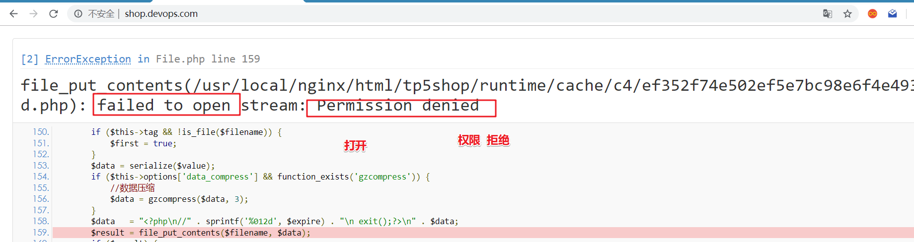

#企业级Nginx使用-day1

**学习目标和内容**

> 1、能够了解Nginx的信号参数
>
> 2、能够进行平滑升级Nginx
>
> 3、能够配置server虚拟机
>
> 4、能够部署上线项目到LNMP架构中
>
> 5、能够了解Nginx的常用官方模块
>
> 6、能够了解日志相关使用

# 一、重装和升级

在实际业务场景中，需要使用软件新版本的功能、特性。就需要对原有软件进行升级或者重装操作。

> 旧statble 稳定版  1.14
>
> stable 稳定版  1.16
>
> mainline 主线版本   最新的 1.17

## 1、信号参数

Kill  命令 传输信号给进程  Nginx的主进程

> TERM, INT（快速退出，当前的请求不执行完成就退出） -s stop
>
> **QUIT** （优雅退出，执行完当前的请求后退出）  -s quit
>
> **HUP** （重新加载配置文件，用新的配置文件启动新worker进程，并优雅的关闭旧的worker进程） -s reload
>
> USR1 （重新打开日志文件）  -s reopen
>
> **USR2** （平滑的升级nginx二进制文件  拉起一个新的主进程  旧主进程不停止）
>
> **WINCH** （优雅的关闭worker进程）

以上几个信息命令都是发送给master主进程的

语法：

```shell
Kill 选项参数  pid
##关闭nginx
##快速关闭
kill -INT pid
##优雅关闭
kill -QUIT pid
```

## 2、重新安装

①停止掉服务，删除编译的安装的软件包和源码包

②重新解压编译安装即可

注意：如果有需要，请备份配置文件和网站目录里的资源文件

## 3、平滑升级

升级软件版本之后，需要启动新的版本，启动不了，端口已经被占用

如果直接把旧版本的服务停止掉，会影响线上业务的使用

> 最佳解决办法：
>
> ①旧的不先停掉
>
> ②新的又可以起来
>
> ③旧的和新的同时提供服务，旧的请求完成之后，就停掉旧进程
>
> -USR2  平滑启动一个进程（平滑升级）
>
> -WINCH  优雅的关闭子进程
>
> -QUIT   优雅关闭主进程

**①编译安装新版本**

```shell
shell > tar xvf nginx-1.16.0.tar.gz
shell > cd nginx-1.16.0
shell > ./configure  --prefix=/usr/local/nginx --user=www --group=www --with-http_ssl_module --with-http_stub_status_module --with-http_realip_module
shell > make && make install
```

升级新版本，需要把软件的安装路径，指定到旧版本上。

> 以上操作完成之后，会把原来的旧版本备份为nginx.old

**②新旧版本同时运行**

```shell
shell > kill -USR2 主进程号
```

**③停止掉旧进程**

查看旧的主进程号，并使用kill -WINCH 优雅的关闭的子进程,再关闭旧的主进程

```shell
shell > kill -WINCH 旧的主进程号
shell > kill -QUIT 旧的主进程号
```

在nginx中，默认提供了平滑升级的操作，只需要执行以下命令

```shell
#注意先configure  在nginx源码包执行
shell > make install && make upgrade
```

## 4、配置文件介绍

**查看nignx目录下的配置文件**

/usr/local/nginx/nginx.conf

```nginx
#nginx子进程启动用户
#user  nobody;
#子进程数量  一般调整为cpu核数或者倍数
worker_processes  1;
#错误日志定义
#error_log  logs/error.log;
#error_log  logs/error.log  notice;
#error_log  logs/error.log  info;

#进程pid 存储文件
#pid        logs/nginx.pid;

#事件
events {
    #每个子进程的连接数         nginx当前并发量  worker_processes * worker_connections
    worker_connections  1024;
}

#http协议段
http {
    #引入  文件扩展名和与文件类型映射表
    include       mime.types;
    #默认文件类型   
    default_type  application/octet-stream;
    #访问日志access.log的格式
    #log_format  main  '$remote_addr - $remote_user [$time_local] "$request" '
    #                  '$status $body_bytes_sent "$http_referer" '
    #                  '"$http_user_agent" "$http_x_forwarded_for"';
    #访问日志存储路径
    #access_log  logs/access.log  main;
    #linux内核  提供文件读写的机制
    sendfile        on;
    #tcp_nopush     on;

    #keepalive_timeout  0;
    #长连接超时时间  单位为s
    keepalive_timeout  65;
    #gzip压缩
    #gzip  on;
    #server虚拟主机的配置
    server {
        #监听端口
        listen       80;
        #域名  可以有多个 用空格分隔
        server_name  localhost;
        #默认编码
        #charset koi8-r;

        #access_log  logs/host.access.log  main;
        #location 用来匹配url
        location / {
            #默认访问的网站路径
            root   html;
            #默认访问页面 从前往后的顺序查找
            index  index.html index.htm;
        }

        #error_page  404              /404.html;

        # redirect server error pages to the static page /50x.html
        #
        error_page   500 502 503 504  /50x.html;
        location = /50x.html {
            root   html;
        }

        # proxy the PHP scripts to Apache listening on 127.0.0.1:80
        #
        #location ~ \.php$ {
        #    proxy_pass   http://127.0.0.1;
        #}

        # pass the PHP scripts to FastCGI server listening on 127.0.0.1:9000
        #
        #location ~ \.php$ {
        #    root           html;
        #    fastcgi_pass   127.0.0.1:9000;
        #    fastcgi_index  index.php;
        #    fastcgi_param  SCRIPT_FILENAME  /scripts$fastcgi_script_name;
        #    include        fastcgi_params;
        #}

        # deny access to .htaccess files, if Apache's document root
        # concurs with nginx's one
        #
        #location ~ /\.ht {
        #    deny  all;
        #}
    }


    # another virtual host using mix of IP-, name-, and port-based configuration
    #
    #server {
    #    listen       8000;
    #    listen       somename:8080;
    #    server_name  somename  alias  another.alias;

    #    location / {
    #        root   html;
    #        index  index.html index.htm;
    #    }
    #}


    # HTTPS server
    #
    #server {
    #    listen       443 ssl;
    #    server_name  localhost;

    #    ssl_certificate      cert.pem;
    #    ssl_certificate_key  cert.key;

    #    ssl_session_cache    shared:SSL:1m;
    #    ssl_session_timeout  5m;

    #    ssl_ciphers  HIGH:!aNULL:!MD5;
    #    ssl_prefer_server_ciphers  on;

    #    location / {
    #        root   html;
    #        index  index.html index.htm;
    #    }
    #}

}
```

> 主要注意：
>
> http=>==server===>location    递进关系

# 二、企业中常见使用方式

##1、server配置

###1.1、server虚拟主机配置

在实际生产业务环境中，一台web服务器，需要使用多个网站部署。搭建vhost虚拟机主机实现不同域名，解析绑定到不同的目录。

**核心语法**

```nginx
#基于http的web服务
server{
    #监听端口
    listen 80
    #配置虚拟机
    server_name shop.lnmp.com
    root html/tp5shop;
    location / {
        index index.php index.html index.htm
    }
    location ~ \.php$ {
        fastcgi_pass   127.0.0.1:9000;
        fastcgi_index  index.php;
        fastcgi_param  SCRIPT_FILENAME  $document_root$fastcgi_script_name;
        include        fastcgi_params;
    }
}
```

> **一般server虚拟主机配置有三类：**
>
> **①基于域名，将域名配置到server_name上**
>
> **②基于IP，将IP配置到server_name上**
>
> **③基于端口，将端口配置到listen**

==案例一：基于域名的虚拟机配置==

**①建立网站访问目录**

```shell
shell > cd /usr/local/nginx/html
shell > mkdir tp5shop
shell > cd tp5shop
#创建测试文件
shell > echo "shop.lnmp.com" >> index.html
shell > echo "shop site by php" >> index.php
```

**②解析域名并绑定**

当前客户端是通过windows的浏览器，需要在win下的hosts文件(C:\Windows\System32\drivers\etc\hosts)进行解析域名

nginx配置文件绑定域名

```nginx
server {
      #监听端口
      listen 80;
      #绑定域名
      server_name shop.lnmp.com;
      #网站目录
      root html/tp5shop;
      #默认访问页面
      index index.html;
      #这段一定不要忘了配置，需要解析php使用到
      location ~ \.php$ {
        fastcgi_pass   127.0.0.1:9000;
        fastcgi_index  index.php;
        fastcgi_param  SCRIPT_FILENAME  $document_root$fastcgi_script_name;
        include        fastcgi_params;
    }
 }
```

**③浏览器访问查看效果**

==案例二：配置基于端口的虚拟主机==

还是使用上面创建好的tp5shop目录

修改listen配置进行测试

==案例三：配置基于IP的虚拟主机==

**①添加IP**

```shell
#临时绑定IP
shell > ifconfig eth0:1 192.168.17.220
#查看IP是否绑定成功
shell > ip a
```

**②nginx配置文件添加**

```nginx
server {
    listen 80;
    server_name 192.168.17.220;
    root html/ip;
}
```

**③建立一个IP测试目录**

```shell
shell > cd /usr/local/nginx/html
shell > mkdir ip
shell > echo "ip site" >> index.html
```

##2、案例：上线商城项目

**①上传项目文件到服务器**

```shell
shell > cd /usr/local/nginx/html
#把项目压缩包解压
shell > unzip tp5shop.zip
```

**②配置server虚拟机，客户端配置host解析**

```shell
#编辑配置文件
shell > vim /usr/local/nginx/conf/nginx.conf
```

```nginx
#在配置文件中配置server虚拟主机段
 server {
        listen 80;
        server_name shop.lnmp.com;
        #tp5shop商城项目基于thinkphp5框架开发，需要绑定默认网站目录为public
        root html/tp5shop/public;
        index index.php index.html;
        location ~ \.php$ {
        #    root           html;
            fastcgi_pass   127.0.0.1:9000;
            fastcgi_index  index.php;
            fastcgi_param  SCRIPT_FILENAME  $document_root$fastcgi_script_name;
            include        fastcgi_params;
        }
}
```

> **解析域名进行访问，如果是在windows下，就在c:\Windows\System32\drivers\etc\hosts解析**

**③创建数据库，导入数据迁移文件**

遇到问题：数据没有导入，没有配置项目连接数据库


```shell
#创建数据库
mysql > create database tp5shop;
#使用数据库
mysql > use tp5shop;
#通过sql文件导入恢复数据
mysql > source /usr/local/nginx/html/tpshop.sql
```

**④配置项目连接数据库**

**修改项目的连接数据库配置文件**

```shell
shell > vim /usr/local/nginx/html/tp5shop/application/database.php
```

**需要修改的内容说明**


```php
//注意主要连接地址、数据库名称、用户名称、用户密码、连接端口号等参数
//hostname，database，username，password，hostport等参数，根据实际请求修改即可
```

```php
return [
    // 数据库类型
    'type'            => 'mysql',
    // 服务器地址
    'hostname'        => '127.0.0.1',
    // 数据库名
    'database'        => 'tp5shop',
    // 用户名
    'username'        => 'root',
    // 密码
    'password'        => '123456',
    // 端口
    'hostport'        => '3306',
```

**⑤测试访问**

遇到问题：项目需要在runtime文件夹中写入缓存信息（需要写权限）



分析：

①nginx 读取静态文件   用户www

②php-fpm  读取、写入、解析php文件  用户www

应该把runtime目录的所属关系赋予www

```shell
shell > cd /usr/local/nginx/html/tp5shop
shell > chown -R www:www ./runtime
```

##3、默认官方模块

###3.1、Gzip压缩

压缩文件，使文件变小，传输更快了。目前市场上大部分浏览器是支持GZIP的。IE6以下支持不好，会出现乱码情况。

**官方文档**：<http://nginx.org/en/docs/http/ngx_http_gzip_module.html>

**示例语法：**

```nginx
#配置到http段里，使整个http服务都启用gzip压缩
#开启gzip压缩
gzip on;
#http协议版本
gzip_http_version 1.0;
#IE浏览器不开启gzip  IE6以下会乱码
gzip_disable 'MSIE [1-6].';
#开启gzip 文件的格式
gzip_types image/jpeg image/jpg image/png text/plain text/css;
```

验证文件是否开启gzip


### 3.2、客户端缓存

B/S架构里  browser浏览器  就是客户端

告知浏览器获取的信息是在某个区间时间段是有效的。

官方文档：<http://nginx.org/en/docs/http/ngx_http_headers_module.html#expires>

**示例语法：**

```nginx
location ~ \.(js|css)$ {
    #单位参数 d day 天|H hour 小时  M 分
    expires 1h;
}

#在整个http中生效  配置到http段里
expires 1h
```

###3.3、基于IP的访问控制

基于ngx_http_access_module模块，默认可使用

官方文档：<http://nginx.org/en/docs/http/ngx_http_access_module.html>

> 语法：
>
> ==deny ip==  禁止ip访问
>
> allow ip  允许访问

### 3.4、基于用户的访问控制

基于ngx_http_auth_basic_module模块，默认可用

官方文档：<http://nginx.org/en/docs/http/ngx_http_auth_basic_module.html>

> 语法：
>
> auth_basic "提示信息"
>
> auth_basic_user_file  /etc/nginx/htpasswd;

**配置实现：**
**①创建用户名和密码存储文件**

```shell
shell > cd /usr/local/nginx/conf
#htpasswd 如果不存在就通过  yum -y install httpd-tools安装
#生成用户名称和密码
shell > htpasswd -c ./passwd.db lnmp
#输入密码并再次确认密码
#查看passwd.db文件是否创建成功
```

**②在配置文件中进行配置**

```shell
shell > vim /usr/local/nginx/conf/nginx.conf
```

配置文件内容 

```nginx
#根据业务需求，配置到server段里
#登录框显示的标题提示
auth_basic "test login"
#加载用户名称和密码校验文件
auth_basic_user_file  /usr/local/nginx/conf/passwd.db; 
```

**③测试查看**

### 3.5、目录列表显示

显示文件列表，或者需要做一个下载列表

官方文档：<http://nginx.org/en/docs/http/ngx_http_autoindex_module.html#autoindex>

**示例语法：**

```nginx
#开启目录列表显示
autoindex on;
#index  当index默认找不到时，才会使用目录列表
index index;
```

> 注意：如果目录中没有配置的默认index访问项，而autoindex又没有开启，不能够查看访问目录列表，就会报出403错误。

###  3.6、反向代理

**正向代理**


特点：知道自己使用了代理，需要填写代理服务器的IP等相关连接信息

​            **==常见于代理客户端上网等操作。==**

**反向代理**


特点：用户是无感知的，不知道使用了代理服务器。反向代理服务器是和真实访问的服务器是在一起的，有关联的。

作用：可以根据实际业务需求，分发代理页面到不同的解释器

​      可以隐藏真实服务器的路径

  **==常见于代理后端服务器==**

官方文档：<http://nginx.org/en/docs/http/ngx_http_proxy_module.html>

**①配置反向代理**

LNMPA


==**验证例子：**==

**①安装httpd  需改端口8080**

```shell
#安装apache
shell > yum install -y httpd
#配置apache的配置文件
shell > vim /etc/httpd/conf/httpd.conf
```

修改配置项

```apache
listen 8080
```

**②配置nginx的server并进行转发**

```nginx
location / {
    proxy_pass http：//127.0.0.1:8080;
}
```

# 三、日志管理

> 日志类型：
>
> ①access.log 访问日志   查看统计用户的访问信息  流量
>
> ②error.log 错误日志  错误信息  重写信息

## 1、访问日志

官方文档：http://nginx.org/en/docs/http/ngx_http_log_module.html

**①查看access.log**

```shell
shell > cd /usr/local/nginx/logs
shell > cat access.log
```

access.log日志文件内容示例

```nginx
127.0.0.1 - - [06/Oct/2017:11:46:16 +0800] "GET /phpinfo.php HTTP/1.1" 200 25206 "-" "Mozilla/5.0 (Windows NT 10.0; Win64; x64) AppleWebKit/537.36 (KHTML, like Gecko) Chrome/62.0.3202.9 Safari/537.36"
```

**②查看配置解析参数说明**

```shell
shell > vim nginx.conf
```

查看访问日志相关参数

```nginx
#定义日志格式  格式命名    详细格式参数
#log_format  main  '$remote_addr - $remote_user [$time_local] "$request" '
    #                  '$status $body_bytes_sent "$http_referer" '
    #                  '"$http_user_agent" "$http_x_forwarded_for"';
#访问日志的存储路径配置               调用的日志格式
    #access_log  logs/access.log  main;
```

| 参数                  | 意义                                                 |
| --------------------- | ---------------------------------------------------- |
| **$remote_addr**      | 客户端的ip地址(代理服务器，显示代理服务ip)           |
| $remote_user          | 用于记录远程客户端的用户名称（一般为“-”）            |
| $time_local           | 用于记录访问时间和时区                               |
| **$request**          | 用于记录请求的url以及请求方法                        |
| $status               | 响应状态码，例如：200成功、404页面找不到等。         |
| $body_bytes_sent      | 给客户端发送的文件主体内容字节数                     |
| **$http_user_agent**  | 用户所使用的代理（一般为浏览器）                     |
| $http_x_forwarded_for | 可以记录客户端IP，通过代理服务器来记录客户端的ip地址 |
| $http_referer         | 可以记录用户是从哪个链接访问过来的                   |

访问日志，可以统计分析用户的流量的相关情况。客情分析

## 2、错误日志

记录一些启动和运行过程中的错误信息

```nginx
# 定义开启错误日志    日志位置    日志级别
#error_log  logs/error.log;
#error_log  logs/error.log  notice;
#error_log  logs/error.log  info;
```

官方文档：<http://nginx.org/en/docs/ngx_core_module.html#error_log>

```shell
shell > cat /usr/local/nginx/logs/error.log
```

格式示例：

```nginx
2019/06/06 11:42:43 [error] 25356#0: *38 open() "/usr/local/nginx/html/favicon.ico" failed (2: No such file or directory), client: 192.168.17.1, server: localhost, request: "GET /favicon.ico HTTP/1.1", host: "192.168.17.220", referrer: "http://192.168.17.220/index.php"
```

## 3、基于域名日志分割

**①开启日志的定义规则**

```nginx
#定义日志格式  定义http里
log_format  mylogs  '$remote_addr - $remote_user [$time_local] "$request" '
                      '$status $body_bytes_sent "$http_referer" '
                      '"$http_user_agent" "$http_x_forwarded_for"';
```

**②重启nginx测试查看**

```nginx
#访问日志的存储路径配置        调用的日志格式
#在server段里面配置  也就是在当前server里的访问日志，会被写入定义的这里
access_log  logs/shop.lnmp.com_access.log  mylogs;
```

日志切割的方式有很多种：

①基于域名分开存储

②日志轮转   时间段

③自定义脚本  定时检测大小  根据文件大小进行切割