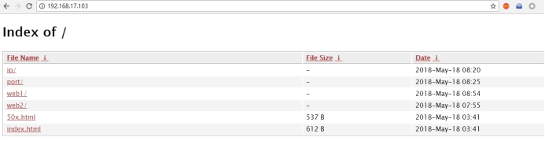
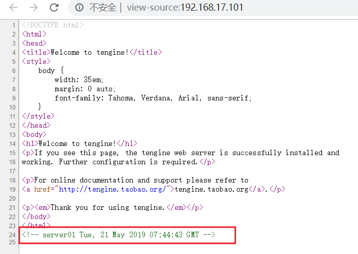
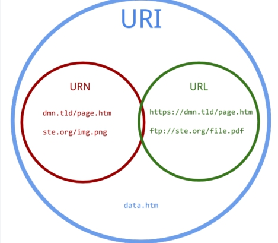
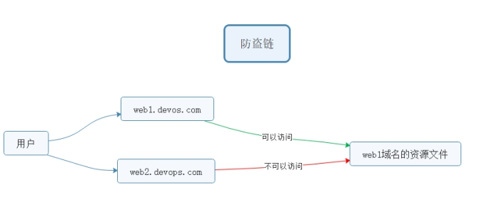

# 企业级Nginx使用-day2

**学习目标和内容**

> 1、能够编译安装并使用第三方模块
>
> 2、能够理解location语法的作用
>
> 3、能够了解URL的rewrite重写规则
>
> 4、能够理解防盗链原理和实现


# 一、第三方模块使用

​			Nginx官方没有的功能，开源开发者定制开发一些功能，把代码公布出来，可以通过**编译加载第三方模块**的方式，**使用新的功能**。

第三方模块网址：https://www.nginx.com/resources/wiki/modules

##1、编译安装第三方模块

**①上传第三方模块压缩包**

上传==ngx-fancyindex-v0.4.3.tar.gz==和==tar xvf echo-nginx-module-0.61.tar.gz==，到/root/soft下。

编译安装以上两个Nginx的第三方模块。

**②编译升级安装，并升级**

```shell
shell > tar xvf ngx-fancyindex-v0.4.3.tar.gz
shell > tar xvf echo-nginx-module-0.61.tar.gz
shell > cd /root/soft/nginx-1.16.0
shell > ./configure  --prefix=/usr/local/nginx --user=www --group=www --with-http_ssl_module --with-http_stub_status_module --with-http_realip_module --add-module=/root/soft/ngx-fancyindex-0.4.3/ --add-module=/root/soft/echo-nginx-module-0.61
shell > make && make install && make upgrade
```

## 2、fancy-index

**文档介绍**：<https://www.nginx.com/resources/wiki/modules/fancy_index/>

<https://github.com/aperezdc/ngx-fancyindex>

**fancy-index模块美化列表效果**



实现操作步骤：

**①查看确认编译模块参数**

```shell
#查看版本号及其编译参数
shell > /usr/local/nginx/sbin/nginx -V
```

确认是否包含ngx-fancyindex模块

**②配置实现**

```nginx
#可以配置到http、server、location等下。推荐配置到server下
#开启fancy indexes 列表显示功能
fancyindex on;
#显示更为可读的文件大小
fancyindex_exact_size off;
```

## 3、echo

echo模块常用来进行调试用，比如输出打印Nginx默认系统变量

**示例语法：**

```nginx
location / {
    #输出为文本类型
    default_type text/plain;
    #default_type text/html;
    #打印输出查看变量信息
    echo $document_root;
}
```

验证是否一下$document_root是否和root设定的值一致

#二、发行版本

## 1、Nginx社区免费版

<https://nginx.org/>

## 2、NGINX+商业版

<https://www.nginx.com/>

##3、淘宝的tengine

<http://tengine.taobao.org/>

> tengine是alibaba公司，在Nginx的基础上，开发定制，更加服务自己业务的服务器软件。后来进行了开源。

```shell
#解压编译安装
shell > tar xvf tengine-2.3.0.tar.gz
shell > cd tengine-2.3.0
#tengine从2.3.0版本之后，tengine的模块被分离到modules，需要自己手动编译安装
shell > ./configure --prefix=/usr/local/tengine --add-module=/root/soft/tengine-2.3.0/modules/ngx_http_footer_filter_module
shell > make && make install
#查看默认加载的模块和参数信息
shell > /usr/local/tengine/sbin/nginx -V
#tengine 默认提供-m参数  查看已经编译加载的模块
```

**案例：通过tengine内置模块 自动添加页脚信息  标识服务器信息**

使用ngx_http_footer_filter_module包含的语法  注意确认是否已经加载此模块

**①修改配置文件并重载服务**

```
shell > vim /usr/local/tengine/conf/nginx.conf
```

**语法规则：**

```nginx
#可定义在http、server、location中，建议在server中
#定义需要插入footer的响应类型（Response Content-Type）。
footer_types "text/plain" "text/css" "application/x-javascript";
#在上面定义的HTTP响应的正文结尾插入指定的format内容。如果format中含有变量，会被替换为变量当前的值。
footer "$host_comment";
```

**示例配置：**

```nginx
server {
  listen 80；
  server_name localhost;
  root html;
  #开启加载注释页脚信息
  footer_types "text/plain" "text/css" "application/x-javascript";
  footer "$host_comment";
}
```

**②访问页面查看**



## 4、OpenResty

> openresty  在Nginx的基础上，结合lua脚本实现高并发的web平台。作者章亦春
>
> WAF nginx+lua+redis  实现应用型防火墙    动态把IP加入黑名单

**官方网址**：<http://openresty.org/cn/>

**编译安装步骤：**

```shell
#解压编译并安装
shell > tar xvf openresty-1.15.8.1.tar.gz
shell > cd openresty-1.15.8.1
shell > ./configure --prefix=/usr/local/openresty
shell > make && make install
#查看默认编译参数及其模块
shell > /usr/local/openresty/sbin/openresty -V
```

**案例:使用lua模块语法**

**①修改配置文件**

```shell
shell > vim /usr/local/openresty/nginx/conf/nginx.conf
```

**示例配置：**

```nginx
location / {
    root html;
    index index.html index.htm;
    #默认返回类型
    default_type text/html;
    #调用lua模块的语法
    content_by_lua 'ngx.say("hello openresty")';
}
```

**②访问页面查看**

# 三、URL匹配之location

> Location  配置语法
>
> <http://nginx.org/en/docs/http/ngx_http_core_module.html#location>

##1、location匹配规则



**①   =  精确匹配**

```nginx
location = / {
    #规则
}
```

> 则匹配到 http://www.example.com/ 这种请求

**② ~  大小写敏感   区分大小写**

```nginx
location ~ /Example/ {
    #规则
}
```

> 请求示例
> http://www.example.com/Example/  [成功]
> http://www.example.com/example/  [失败]

**③  ~* 大小写忽略**

```nginx
location ~* /Example/ {
    #规则
}
```

> 请求示例
> http://www.example.com/Example/  [成功]
> http://www.example.com/example/  [成功]

**④  ^~ 只匹配以 uri 开头**

```nginx
location ^~ /img/ {
    #规则
}
```

>请求实例
>以 /img/ 开头的请求，都会匹配上
>http://www.example.com/img/a.jpg   [成功]
>http://www.example.com/img/b.mp4 [成功]
>http://www.example.com/bimg/b.mp4 [失败]
>http://www.example.com/Img/b.mp4 [失败]

**⑤ /     其他匹配都不成功  就匹配此项**

```nginx
location / {
   #规则
}
```

如果路径是资源文件是存在的，会优先获取资源文件

> **location匹配优先级**
>
> (location =) > (location 完整路径) > (location ^~ 路径) > (location ~,~* 正则顺序) > (location 部分起始路径) > (/)

##2、location匹配跳转

**@+name**
@，nginx内部跳转

```nginx
location /img/ {
    #如果状态码是404  就指定404的页面为什么
    error_page 404 = @img_err;
}    

location @img_err {    
    # 规则
    return  503；
}
```

>以 /img/ 开头的请求，如果链接的状态为 404。则会匹配到 @img_err 这条规则上

#四、URL重写

> ==**ngx_http_rewrite_module**==模块用于使用PCRE正则表达式更改请求URI，返回重定向，以及有条件地选择配置

**官方文档地址**：<http://nginx.org/en/docs/http/ngx_http_rewrite_module.html

## 1、return

该指令用于结束规则的执行并返回状态码给客户端.

> 403 Forbidden.服务器已经理解请求,但是拒绝执行它
>
> 404 Not Found.请求失败,请求所希望得到的资源未在服务器上发现.404这个状态码被⼴泛应⽤于当服务器不想揭示为何请求被拒绝,或者没有其他适合的响应可⽤的情况下.
>
> 500 Internal Server Error.服务器遇到⼀个未曾预料的状况,导致它无法完成对请求的处理.⼀般来说,这个问题都会在服务器的程序码出错时出现.
>
> 502 Bad Gateway.作为网关或代理工作的服务器尝试执行请求时,从上游服务器接收到无效的响应.
>
> 503 Service Unavailable.由于临时的服务器维护或过载,服务器当前无法处理请求.这个状况是临时的,并且将在一段时间以后恢复.503状态码的存在并不意味着服务器在过载的时候必须使⽤它.某些服务器只不过是希望拒绝客户端的连接.
>
> 504 Gateway Timeout作为网关或代理工作的服务器尝试执行请求时,未能及时从上游服务器(URI标识出的服务器,例如HTTP,FTP,LDAP)或辅助服务器(例如DNS)收到响应。

请求状态码：

<https://developer.mozilla.org/zh-CN/docs/Web/HTTP/Status>

**示例语法：**

```nginx
#可以匹配到server location if中，推荐配置到location中
return 403;
```

## 2、rewrite

rewrite  匹配到请求URI，重写到新的URI

> rewrite语法 匹配到，替换为其他内容
>
> 语法  rewrite 匹配内容 替代内容  标记

**官方文档地址**：<http://nginx.org/en/docs/http/ngx_http_rewrite_module.html#rewrite>

> flag标记说明：
>
> last  #本条规则匹配完成后，继续向下匹配新的location URI规则，客户端URL地址不会发生跳转
>
> break  #本条规则匹配完成即终止，不再匹配后面的任何规则，客户端URL地址不会发生跳转
>
> redirect  #返回302临时重定向，浏览器地址会显示跳转后的URL地址
>
> permanent  #返回301永久重定向，浏览器地址栏会显示跳转后的URL地址

**匹配顺序**：多条rewrite，从上到下匹配，匹配到之后就不在匹配其他rewrite规则。

#五、URL相关案例实现

## 1、案例：资源重定向实现

**业务需求描述：**

实际业务不存在index.html，需要重写访问index.php

URL为index.html，而实际访问的是index.php，对外被认为是html静态页面

以上方案就是==seo优化伪静态==的使用，把真实的后端的页面，伪装为静态html页面。

**①修改配置**

```shell
shell > vim /usr/local/nginx/conf/nginx.conf
```

添加配置

```nginx
rewrite /index.html /index.php last;
```

**③重载配置测试访问**

## 2、案例：域名重定向实现

网站的域名升级了，需要启用新的域名使用。

但是用户却不知道，还可能使用旧的域名访问网站。

需要把通过旧域名访问的来源，重定向到新的域名。

把shop.lnmp.com的请求全部重定向到新域名www.shop.com

```nginx
rewrite / http://www.shop.com permanent;
```

**示例配置：**

```nginx
#shop.lnmp.com的请求全部重定向到www.shop.com中
server {
               listen 80;
               server_name shop.lnmp.com;
               rewrite / http://www.shop.com permanent;
        }
        server {
                listen 80;
                #绑定新域名即可
                server_name www.shop.com;
                root html/tp5shop/public;
                index index.php index.html;
                #deny 192.168.17.1;
                #auth_basic "shop login";
                #auth_basic_user_file  /usr/local/nginx/conf/passwd.db;
                access_log  logs/shop.lnmp.com_access.log  mylogs;
                location / {
                  rewrite /index.html /index.php last;
                }
                location ~ \.php$ {
                        fastcgi_pass   127.0.0.1:9000;
                        fastcgi_index  index.php;
                        fastcgi_param  SCRIPT_FILENAME  $document_root$fastcgi_script_name;
                        include        fastcgi_params;
                }
                #location ~ \.(js|css) {
                #     expires 2h;
                #}
        }

```

注意新域名www.shop.com 记得在客户端的hosts文件中解析。

## 3、案例：防盗链原理和实现



**业务需求描述：**

域名A的资源文件，经常被域名B直接调用访问。

而用户经常访问域名B，看到的资源（图片等）以为是域名B的，实际则是域名A的。

但是域名A没有从中获得任何收益，缺要给域名B来源的访问耗费服务器资源和带宽。

所以，禁止域名B直接访问和调用域名A的资源的方式，就被称为"防止盗链"

> 语法：
>
> 定义允许访问的域名来源
>
> valid_referers none blocked servername
>
> none blocked  没有referer的情况，直接访问资源的情况
>
> if ($invalid_referer) {}

1、在ip的虚拟主机，静态文件调用图片

2、shop的虚拟主机，禁止ip的虚拟主机调用图片

**①ip虚拟主机目录建立静态文件访问shop虚拟主机的图片资源**

```shell
shell > cd /usr/local/nginx/html
shell > echo '' >> img.html
```

**②在shop虚拟主机配置中，防止其他虚拟机主机盗链**

```nginx
#定义在server里  shop的server
#图片请求防盗链
location ~* \.(jpg|png|jpeg|gif|bmp) {
    valid_referers www.shop.com;
	if ($invalid_referer) {
  	    return 404;
	}
}
```

# 六、安全

## 1、反向代理

实现隐藏真实服务的操作，起到一定安全作用

## 2、隐藏版本号

Nginx对外提供服务，为了避免被针对某个版本的漏洞进行攻击。经常做法是隐藏掉软件的版本信息。提供一定的安全性。

```nginx
#将以下配置加入到http段配置中
server_tokens off
```

## 3、Https和CA

```nginx
   server {
        listen       443 ssl;
        #绑定好域名
        server_name  web1.heimadevops.top;
        #指定证书相关位置
        ssl_certificate      /usr/local/nginx/conf/1_web1.heimadevops.top_bundle.crt;
        ssl_certificate_key  /usr/local/nginx/conf/2_web1.heimadevops.top.key;

        ssl_session_cache    shared:SSL:1m;
        ssl_session_timeout  5m;

        ssl_ciphers  HIGH:!aNULL:!MD5;
        ssl_prefer_server_ciphers  on;

        location / {
            root   html;
            index  index.html index.htm;
        }
    }
#http跳转到https
server {
    listen 80；
    server_name web1.heimadevops.top;
    rewrite / https://web1.heimadevops.top permanent;
}
```

客户端注意解析域名

#Tip：Nginx支持pathinfo路径  重写方式

需求

```php
http://www.shop.com/home/goods/index/cate_id/187.html  默认不支持访问
重写成为
http://www.shop.com/index.php?s=home/goods/index/cate_id/187.html
```

语法规则示例

```nginx
location / {
   rewrite /index.html /index.php last;
   #判断请求的路径 不存在
   if (!-e $request_filename) {
      # 捕获到所有路径信息   重写为index.php的s参数   last需要匹配之后的location规则
      rewrite ^(.*)$   /index.php?s=$1 last;
   }
}
```

