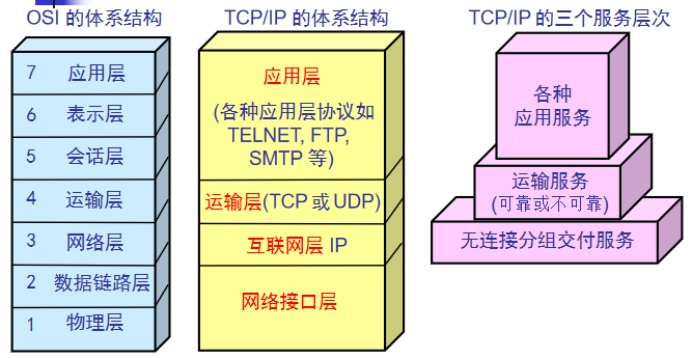

# 企业架构双点服务器HA

> **学习目标和内容**
>
> 1、能够描述高可用HA的作用
>
> 2、能够理解VIP的切换
>
> 3、能够描述keepalived作用
>
> 4、能够理解主master和备backup服务器关系
>
> 5、能够实现主备服务器高可用配置
>
> 6、能够实现模拟业务宕机服务切换

# 一、背景描述及其方案设计

## 1、业务背景描述

> 时间：2009.6-2010.9
>
> 发布产品类型：互联网动态站点 商城
>
> ⽤户数量： 2000-4000（⽤户量猛增 翻了4倍）
>
> PV ： 8000-50000（24⼩时访问次数总和）
>
> QPS： 50-100*（每秒访问次数）
>
> DAU： 200-400（每⽇活跃⽤户数）

​         随着用户量增多，单台WEB服务器，压力越来越大。虽然单台WEB服务器，目前可以完成工作任务。但是如果一旦宕机，用户就完全失去服务了，用户体验特别不好。需要备用一台服务器进行使用，主服务器宕机之后，快速切换为备用服务器

## 2、模拟运维设计方案

在之前架构中，先将数据库服务器单独迁移


 针对web服务器单点故障，升级为主备服务器架构


# 二、数据库服务器迁移

## 1、克隆复制虚拟机

> server01 WEB服务器  master   192.168.17.102
>
> server02 数据库服务器   192.168.17.100
>
> server03 WEB服务器  backup   192.168.17.101

## 2、服务器基本配置

根据之前的服务器基本环境的要求进行配置

因为是克隆获取虚拟机，所以只需要进行IP和MAC地址的修改即可。

```shell
#1、删除原有网卡mac地址记录信息
shell > cd /etc/udev/rules.d
shell > rm -rf 70-persistent-net.rules
#2、删除eth0里的mac地址项 HWADDR参数
#3、修改主机名称
shell > sed -i "s/server01/server02/" /etc/sysconfig/network;
#4、启动之后，把hosts文件对应也做解析
```

##3、数据备份和迁移

**①源数据库服务器导出数据**

```shell
#源数据库是server01 在server01上操作
shell > mysqldump -uroot -p --database tp5shop > /root/tp5shop.sql
```

**②导入数据到新数据库服务器**

```mysql
#因为数据库服务器克隆来的，所有本身具有数据 可以删除了库，模拟新机器，重新导入
mysql > drop database tp5shop;
#创建数据库并导入数据
mysql > create database tp5shop;
mysql > use tp5shop;
mysql > source /root/tp5shop.sql;
```

**③在server02 MySQL服务器中建立远程连接用户并授予权限**

```mysql
mysql > grant all on tp5shop.* to 'tp5shop'@'192.168.17.%' identified by '$Abc3721';
```

**④修改项目数据库配置文件**

```shell
shell > vim /usr/local/nginx/html/tp5shop/application/database.php
```

修改参考示例：

```php
return [
    // 数据库类型
    'type'            => 'mysql',
    // 服务器地址
    'hostname'        => '192.168.17.100',
    // 数据库名
    'database'        => 'tp5shop',
    // 用户名
    'username'        => 'tp5shop',
    // 密码
    'password'        => '$Abc3721',
    // 端口
    'hostport'        => '3306',
```

**⑤访问页面，查看业务使用情况** 

# 三、高可用服务搭建

## 1、HA高可用

​        高可用HA（High Availability）是分布式系统架构设计中必须考虑的因素之一，它通常是指通过设计，减少系统服务不可用的时间。假设系统一直能够提供服务，我们说系统的可用性是100%。如果系统每运行100个时间单位，会有1个时间单位无法提供服务，我们说系统的可用性是99%。==很多公司的高可用目标是4个9，也就是99.99%，这就意味着，系统的年停机时间为0.876个小时==。

| **描述**                         | **通俗叫法** | **可用性级别** | **年度停机时间** |
| -------------------------------- | ------------ | -------------- | ---------------- |
| 基本可用性                       | 2个9         | 99%            | 87.6小时         |
| 较高可用性                       | 3个9         | 99.9%          | 8.8小时          |
| **具有故障自动恢复能力的可用性** | **4个9**     | **99.99%**     | **53分钟**       |
| 极高可用性                       | 5个9         | 99.999%        | 5分钟            |

> **实现高可用的核心点：**
>
> ①冗余（多台服务器）
>
> ②自动切换

备份服务器：

冷备  服务器不启用（域名不解析），使用的时候再开启，需要手动切换

热备  服务器在等待状态（监控主服务器状态），一旦主宕机，备就接管，自动切换

实现热备，引入VIP的切换


**通过VIP的方式，切换主备服务器**

①默认VIP绑定在主服务器（master）

②master不可用，就切换VIP到备份服务器（backup）

③用户可以使用到连续性更好的服务，通过VIP访问服务器

**常用来单独实现高可用的软件：**

==①keepalived==

②heartbeat  较早  属于redhat HA工程的一部分

## 2、keepalived介绍

​	     Keepalived软件起初是专为LVS负载均衡软件设计的，用来管理并监控LVS集群系统中各个服务节点的状态，后来又加入了可以实现高可用的VRRP功能。因此，Keepalived除了能够管理LVS软件外，还可以作为其他服务（例如：Nginx、Haproxy、MySQL等）的高可用解决方案软件

## 3、keepalived组成和原理

​         Keepalived软件主要是通过VRRP协议实现高可用功能的。

​          VRRP是Virtual Router RedundancyProtocol(虚拟路由器冗余协议）的缩写，VRRP出现的目的就是为了解决静态路由单点故障问题的，它能够保证当个别节点宕机时，整个网络可以不间断地运行。

​         虚拟路由冗余协议，可以认为是实现路由器高可用的协议，即将N台提供相同功能的路由器组成一个路由器组，这个组里面有一个master和多个backup，master上面有一个对外提供服务的vip（该路由器所在局域网内其他机器的默认路由为该vip），master会发组播，当backup收不到vrrp包时就认为master宕掉了，这时就需要根据VRRP的优先级来选举一个backup当master。这样的话就可以保证路由器的高可用了。




Keepalived的功能体系结构，大致分两层：**用户空间（user space）和内核空间（kernel space）**。

**内核空间：**

主要包括IPVS（IP虚拟服务器，用于实现网络服务的负载均衡）和NETLINK（提供高级路由及其他相关的网络功能）两个部份。

**用户空间：**

> WatchDog：负载监控checkers和VRRP进程的状况
>
> VRRP Stack：负载均衡器之间的失败切换FailOver，如果只用一个负载均衡器，则VRRP不是必须的。
>
> Checkers：负责真实服务器的健康检查healthchecking，是keepalived最主要的功能。换言之，可以没有VRRP Stack，但健康检查healthchecking是一定要有的。
>
> IPVS wrapper：用户发送设定的规则到内核ipvs代码
>
> Netlink Reflector：用来设定vrrp的vip地址等。

keepalived主要使用三个模块，分别是core、check和vrrp。

core模块为keepalived的核心，负责主进程的启动、维护以及全局配置文件的加载和解析。

check负责健康检查，包括常见的各种检查方式。

vrrp模块是来实现VRRP协议的。

## 4、安装配置启动keepalived

master和backup都需要进行安装，也就是server01和server03机器

```shell
#安装keepalived
shell > yum -y install keepalived
```

| 主机名称 | 服务器IP       |        |
| -------- | -------------- | ------ |
| server01 | 192.168.17.102 | master |
| server03 | 192.168.17.101 | backup |

**keepalived需要使用的目录和文件：**

| 文件或者目录                    | 作用           |
| ------------------------------- | -------------- |
| /etc/keepalived/keepalived.conf | 生效的配置文件 |
| /etc/init.d/keepalived          | 服务器管理脚本 |
| /var/log/messages               | 日志信息       |

**配置keepalived**

**①备份主备服务器的配置文件**

```shell
shell > cd  /etc/keepalived
shell > cp keepalived.conf keepalived.conf_bak
```

**②分别修改主备服务器配置文件**

```
shell > vim keepalived.conf
```

**示例配置文件说明**

```shell
! Configuration File for keepalived
#发送邮件的配置
global_defs {
   notification_email {
     acassen@firewall.loc
     failover@firewall.loc
     sysadmin@firewall.loc
   }
   notification_email_from Alexandre.Cassen@firewall.loc
   smtp_server 192.168.200.1
   smtp_connect_timeout 30
   router_id LVS_DEVEL
}
#vrrp协议的配置
vrrp_instance VI_1 {
    #工作模式
    state MASTER
    #监听的网卡
    interface eth0
    #虚拟路由id 需要和备服务器一致
    virtual_router_id 51
    #权重 优先级
    priority 100
    #vrrp包的发送周期  1s
    advert_int 1
    #权限验证
    authentication {
        auth_type PASS
        auth_pass 1111
    }
    #需要绑定切换的VIP
    virtual_ipaddress {
        192.168.200.16
        192.168.200.17
        192.168.200.18
    }
}
```

主服务器

```shell
! Configuration File for keepalived
global_defs {
   notification_email {
     acassen@firewall.loc
     failover@firewall.loc
     sysadmin@firewall.loc
   }
   notification_email_from Alexandre.Cassen@firewall.loc
   smtp_server 192.168.200.1
   smtp_connect_timeout 30
   router_id LVS_DEVEL
}
vrrp_instance VI_1 {
    state MASTER
    interface eth0
    virtual_router_id 51
    priority 100
    advert_int 1
    authentication {
        auth_type PASS
        auth_pass 1111
    }
    #master默认只需要修改使用VIP即可
    virtual_ipaddress {
        192.168.17.200
    }
}
```

备服务器

```shell
! Configuration File for keepalived
global_defs {
   notification_email {
     acassen@firewall.loc
     failover@firewall.loc
     sysadmin@firewall.loc
   }
   notification_email_from Alexandre.Cassen@firewall.loc
   smtp_server 192.168.200.1
   smtp_connect_timeout 30
   router_id LVS_DEVEL
}
vrrp_instance VI_1 {
    #修改工作模式为备
    state BACKUP
    interface eth0
    virtual_router_id 51
    priority 100
    advert_int 1
    authentication {
        auth_type PASS
        auth_pass 1111
    }
    #注意修改VIP
    virtual_ipaddress {
        192.168.17.200
    }
}
```

**③分别按照顺序启动主服务器和备服务器的keepalived**

```shell
shell > service keepalived start
```

**④查看主备服务器的网卡信息**

```shell
#需要通过ip a命令查看  分别在server01和server03查看
shell > ip a
```

##5、模拟服务器不可用VIP切换

服务器整机不可用，常见于服务器断网，或者断电关机等。

**方法一：模拟主服务器断电关闭**

```shell
#关闭主服务器  VIP所在服务器
shell > poweroff
```

**方法二：模拟主服务器断网**

```shell
#关闭VIP所在服务器的网卡  使其不能够联网
shell > service network stop
```

通过以上实验检测，发现当主服务器整机不可用时，VIP会切换到备用服务器

# 四、实现服务HA

​         通过keepalived可以直接实现主服务器整机不可用，实现VIP的切换。保证用户可以通过VIP进行访问服务。

但是实际情况下，往往并不是服务器整机不可用，只是对应的服务或者软件不可用。

比如说：nginx提供的web服务，nginx进程关闭

就需要检测当nginx不可用时，就切换VIP

**实现过程分析：**

VIP实际是由keepalived进行绑定的，所以当nginx服务不可用时，就关闭当前机器的keepalived即可，释放VIP。进而绑定到其他备用服务器。

①编写服务检测脚本，实现检测nginx是否可用，不可用则关闭当前所在主机的keepalived

②在keepalived配置中调用检测服务脚本

## 1、Nginx服务可用检测脚本

主备服务器都要实现此脚本

**①编写测试脚本  赋予执行权限**

```
shell > cd /etc/keepalived
shell > vim check_nginx.sh
```

**脚本内容：**

```shell
#!/bin/bash
nginx_status=`ps -C nginx --no-header | wc -l`
if [ $nginx_status -eq 0 ];then
   service keepalived stop
fi
```

赋予脚本执行权限    方便之后其他软件调用执行

```shell
shell > chmod +x check_nginx.sh
```

**②测试脚本可用性**

启动nginx和keepalived  

关闭nginx   执行脚本  查看keepalived是否也关闭

## 2、模拟宕机实现服务切换

在多台服务器中配置keepalived定时触发检测nginx的脚本模块

```shell
#在vrrp_instance外上面定义
vrrp_script check_nginx {
   #调用脚本地址
   script  /etc/keepalived/check_nginx.sh
   #检测间隔时间
   interval 3
}
#在vrrp_instance里调用
track_script {
    #上线定义的名称
    check_nginx
}
```

##3、实现web服务器高可用

以上案例已经实现了，服务不可用VIP切换到可用服务器。

现在需求用户的服务是连续不间断的，故**用户需要通过VIP进行访问**

**①解析域名到VIP**

**②模拟用户访问**

# 五、keepalived的配置补充

> 脑裂（裂脑）：vip出现在了多台机器上。网络不通畅，禁用了数据包，主备服务器没法通讯，造成备服务器认为主服务器不可用，绑定VIP，主服务器VIP不会释放。
>
> 解决方案：
>
> ①双备或者多备模式  BACKUP  通过priority权重来区分谁的优先级更高
>
> ②单播(定向广播)的方式 (一些特定环境禁用了组播方式)
>
> ③时间不同步  服务器时间校时

## 1、非抢占模式

**①nopreempt**

在主备服务器的配置文件，vrrp_instance段中

**②设置state工作模式为BACKUP**
两个keepalived节点都启动后，默认都是BACKUP状态，双方在发送组播信息后，会根据优先级来选举一个MASTER出来。由于两者都配置了nopreempt，所以MASTER从故障中恢复后，不会抢占vip。这样会避免VIP切换可能造成的服务延迟。

## 2、单播模式

一些特定环境下不允许发送组播，造成备服务器无法收到vrrp包，可能会造成脑裂现象。可以通过单播的方式解决。

**单播示例配置：**注意此语法在keepalived1.2.11版本以上支持

> unicast_src_ip 192.168.1.21##（本地IP地址）
>
> unicast_peer {
>
> ​		192.168.1.22##（对端IP地址）此地址一定不能忘记
>
> }

**主服务器server01配置**

```shell
#在vrrp_instace段中加入
#本地IP
unicast_src_ip 192.168.17.102
unicast_peer {
    #对象IP  发送vrrp包给备服务器
    192.168.17.101
}
```

**备服务器server03配置**

```shell
#在vrrp_instace段中加入
#本地IP
unicast_src_ip 192.168.17.101
unicast_peer {
    #对象IP  发送vrrp包给备服务器
    192.168.17.102
}
```

**tcpdump抓vrrp包的方式：**

```shell
shell > tcpdump vrrp -n
```