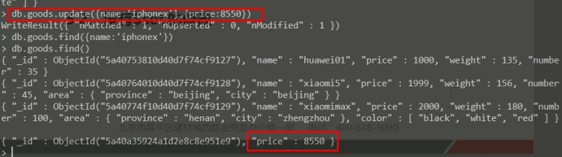
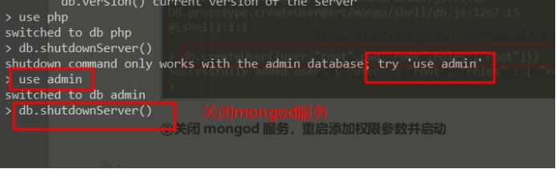

# 企业架构NOSQL数据库之MongoDB

> **学习目标和内容**
>
> 1、能够简单描述MongoDB的使用特点
>
> 2、能够安装配置启动MongoDB
>
> 3、能够使用命令行客户端简单操作MongoDB
>
> 4、能够实现基本的数据操作
>
> 5、能够实现MongoDB基本安全设置
>
> 6、能够操作安装php的MongoDB扩展

# 一、背景描述及其方案设计

## 1、业务背景描述

> 时间：2017.6.-2017.9
>
> 发布产品类型：互联网动态站点 商城
>
> ⽤户数量： 10000-12000（⽤户量猛增）
>
> PV ： 1000000-5000000（24小时访问次数总和）
>
> QPS： 50-100*（每秒访问次数）  300
>
> DAU： 2000~*000（每日活跃用户数）

根据业务需求：

用户访问日志是在web服务器access.log存储


统计每日访问量，峰值访问量

把每次访问存储到mongodb中，mongodb用来筛选日志

## 2、模拟运维设计方案


根据以上业务需求，采用mongodb数据库存储用户的访问日志，使用单台服务器

①访问日志存储

②在mongo中筛选查看信息

# 二、Mongodb介绍


## 1、nosql介绍

数据库排名：<https://db-engines.com/en/ranking>

关系数据库 RDBMS   设计表结构，通过SQL语句进行操作。连表关系

常见的关系型数据库：mysql oracle（商业） DB2（IBM） sqlserver（微软） access（微软） sqlite3（小型 嵌入到APP中） postgresql（加州伯克利大学）

nosql 泛指非关系数据库 存储格式key=>value

memcached   redis 内存缓存数据库

mongodb  具有更多的功能，可以适用于大部分的mysql场景	document store  文档型数据库

## 2、产品特点

### 2.1、存储性

比较适合存储大量的没有规则、无序的数据。未经过处理的数据

存储量大：单表实现存储PB级别的数据  1PB = 1024TB

### 2.2、效率性

数据的效率，就是指存储和读写速度。


### 2.3、结构


# 三、安装和配置

## 1、安装方式介绍

yum方式安装：<https://docs.mongodb.com/manual/tutorial/install-mongodb-on-red-hat/>

手动通用安装：<https://docs.mongodb.com/manual/tutorial/install-mongodb-on-linux/>

## 2、二进制可执行安装

**①上传安装包到服务器目录**


**②解压到安装目录 并移动**

```shell
shell > tar xvf mongodb-linux-x86_64-rhel62-3.6.5.tgz
shell > mv mongodb-linux-x86_64-rhel62-3.6.5 /usr/local/mongodb
```


**③创建数据存储目录和日志目录**

```shell
shell > cd /usr/local/mongodb
shell > mkdir data
shell > mkdir logs
```

**④启动mongod服务**

```shell
shell > cd /usr/local/mongodb/bin
shell > ./mongod --dbpath=/usr/local/mongodb/data --logpath=/usr/local/mongodb/logs/log.txt --fork
#可以通过进程和端口的方式检测是否启动成功
shell > ps aux|grep mongod
shell > netstat -lntp|grep mongod
```

> 参数介绍：
>
> dbpath 数据存储路径
>
> logpath 日志存储路径  指向到一个文件
>
> fork  后台启动
>
> auth  权限开启
>
> bind_ip  指定绑定网卡ip


## 3、命令行客户端操作


# 四、数据结构类型操作	CURD

## 1、添加数据

mongodb里存储数据的格式文档形式，以bson格式的文档形式。


在mongodb中，可有无需创建数据库和集合，使用的时候会自动创建

**创建一个库devops**


> 语法：
>
> db.集合名称.insert（bson格式数据）

### 1.1、普通数据添加

```sql
db.goods.insert({name:'huawei01',price:1000,weight:135,number:35})
```


### 1.2、多维数据对象添加

```sql
db.goods.insert({name:'xiaomi5',price:1999,weight:156,number:45,area:{province:'beijing',city:'beijing'}})
```


### 1.3、数组信息添加

```sql
db.goods.insert({name:'xiaomimax',price:2000,weight:180,number:100,area:{province:'henan',city:'zhengzhou'},color:['black','white','red']})
```


## 2、查询数据

> 语法：db.集合名称.find(查询条件)
>
> ​                findOne(查询条件)

### 2.1、笼统方式查询

不进行条件限制，全部取出来。

findOne会取出符合结果的第一条信息，并且以格式化形式返回


### 2.2、条件限制查询

条件格式，所见及所得

```sql
db.goods.find({name:'xiaomimax'})
db.goods.findOne({name:'xiaomimax'})
```


### 2.3、范围条件查询

> mysql   <     <=   >   >=    !=
>
> mongo  \$lt   \$lte  \$gt  \$gte  \$ne

```sql
db.goods.find({price:{'$lte':1999}})
db.goods.find({price:{'$lt':1999}})
```


### 2.4、多个条件查询

类似mysql中的AND语法

```sql
db.goods.find({price:{'$lte':1999},number:{'$gte':40}})
```


### 2.5、多维字段查询

通过多维字段的值进行查询

```sql
db.goods.find({'area.city':'zhengzhou'});
```


注意：多维字段需要用引号包含起来

### 2.6、数组条件查询

**①查询满足其中之一即可显示**

```sql
db.goods.find({color:'black'})
```


**②满足查询条件所有的才可显示**

> db.集合名称.find({字段(数组):{‘$all’:[v1,v2]}})

```sql
db.goods.insert({name:'iphonex',price:8398,weight:100,number:200,area:{province:'jiangsu',city:'nanjing'},color:['gray','black','white','gold']})

db.goods.find({color:{'$all':['black','gold']}})
```


### 2.7、限制查询字段

在实际使用环境，不需要查询并显示太多的字段。可以选择设定显示。

> 语法：db.集合名称.find({查询条件},{筛选条件})
>
> 显示为1,不显示为0   要是1都是1，要是0都是0  _id除外


```sql
db.goods.find({color:{'$all':['black','gold']}},{name:1,_id:0})
```


注意采用合适的方式，显示出查询字段值内容


> _id是mongodb数据库里的集合中，默认的主键id，具有索引内容，通过主键查询，会很快的查询速度。不要随意修改此值，使用默认即可。

### 2.8、$or查询

满足其中之一的条件就可以显示，类似mysql的中的or条件语法

select * from goods where price > 5000 or number >= 100

```sql
db.goods.find({'$or':[{price:{'$gt':5000}},{number:{'$gte':100}}]})
```


### 2.9、count 语法

返回结果的数量统计

链式操作

```sql
db.goods.count()
db.goods.find({price:{'$gt':5000}}).count()
db.goods.count({price:{'$gt':5000}})
```


### 2.10、limit语法 skip语法

类似于mysql中的limit（skip,length）语法

limit()  取几个

skip()   跳过几个

```sql
db.goods.find().limit(1);
db.goods.find().skip(1).limit(1);
```


mongodb语法和SQL语句的对比


## 3、修改数据

> 语法：db.集合名称.update({查询条件},{修改条件})
>
> ​                 updateOne()  修改匹配的第一条
>
> ​                 updateMany()  修改匹配所有条

### 3.1、有$set的修改

```sql
db.goods.update({name:'iphonex'},{'$set':{price:8500}})
```


```sql
db.goods.updateOne({name:'xiaomi5'},{'$set':{price:1500}})
```


### 3.2、没有$set的修改

没有$set关键字语法，把设置的字段进行修改,没有设置的就会被删除掉

```sql
db.goods.update({name:'iphonex'},{price:8550})
```



## 4、删除数据

### 4.1、删除记录

> 语法： db.集合名称.remove({查询条件})
>
> ​                  deleteOne()  删除匹配的第一条
>
> ​                  deleteMany()  删除匹配的多条

```sql
db.goods.remove({price:8550})
```


```sql
db.goods.deleteMany({price:{'$lte':2000}})
```


### 4.2、删除字段

可以删除某个字段的操作，使用的是update语法的$unset

```sql
db.goods.update({name:'huawei01'},{'$unset':{weight:0}})
```


值给一个就可以删除了

真实业务当中，一般不做物理删除，会使用一个标识，来确认是否已经被删除的数据


# 五、安全设置

<https://docs.mongodb.com/manual/tutorial/create-users/>

mongodb安全事件：<https://www.jianshu.com/p/48d17a69e190>

## 1、限制登录

**①使用另外一台虚拟机，使用mongo命令行端进行测试**

远程登录方法


**②关闭mongodb**

正常情况下不要kill -9 mongod，使用mongo命令客户端里的关机命令


**③添加启动的脚本，启动mongod**

```shell
shell > vim /etc/init.d/mongodb
```

bind绑定是外网通讯的网卡


**④使用远程登录mongod服务**


## 2、用户权限管理

需求：设置一个超级管理员账户，对于所有库具有读写权限

> 语法：
>
> db.createUser({user:"root",pwd:"root",roles:["root"]})

实现步骤：

**①切换admin库，进行用户创建**


**②关闭mongod服务，重启添加权限参数并启动**

关闭



在启动脚本中加入--auth参数


**③测试使用**


添加用户，限制用的库的权限，只读


# 六、业务实例

## 1、PHP扩展安装

安装到web服务器server01和server03上

**①上传php扩展包**

**②解压编译安装**

```shell
shell > tar xvf mongodb-1.5.3.tgz
shell > cd mongodb-1.5.3
shell > phpize
shell > ./configure && make && make install
```


**③添加php.ini匹配**

```shell
shell > vim /usr/local/php/etc/php.ini
```


**④重启php-fpm查看phpinfo**

```shell
shell > service php-fpm restart
```


## 2、桌面管理使用

软件是绿色版本，直接解压，点击使用即可


填写相关参数


测试是否可以正常连接


点击连接


查看数据


## 3、日志统计展示

很多网站需要统计某个页面或者某个功能访问量，如果访问量比较大，需要记录的组件具有很快的读写效率。可以使用功能性更多的mongodb来完成此业务。mongodb具有更多的数据灵活性。

> **网站访问日志记录的信息：**
>
> ip 用户访问的来源ip
>
> url  用户访问的地址  功能模块页面地址
>
> time  访问时间  记录用户访问的时间值
>
> user_agent 用户访问的客户端信息

操作实现步骤：

**①删除原来的文件**


**②上传修改好的文件**

php中获取代理的真实IP的方式，但是一定要注意必须是代理服务器有传真实IP


**③访问页面之后，可以查看到访问已经被记录**


