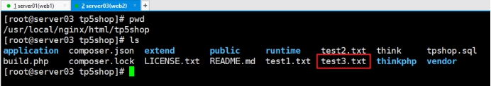

# 企业架构web服务器的文件及时同步

> **学习目标和内容**
>
> 1、能够理解为何要服务器间文件同步
>
> 2、能够简单描述实现文件同步的几种方式
>
> 3、能够实现服务器文件实时同步的案例

# 一、同步文件介绍

## 1、服务器文件同步的必要性


根据业务发展需求，业务网站架构已经发展到以上模式。实现了线上服务的提供，可以给用户提供稳定的整个的web服务。但是，在最近的操作中，也发现了一些问题。

①当业务代码发生改变上传到web服务器时，因为架构已经不是单台服务器提供服务器，而是由多台web服务器提供服务，业务代码需要同时上传到多台web服务器，在操作上带来了很多不便。

故需要解决以上问题， 就需要web服务器中的业务代码能够及时同步，保证业务代码的一致性。

业务集群：

线上  对外提供服务的   10台   提供给用户对外服务   存储（分布式存储  解决服务器单例硬盘资源不够的情况）

线下  代码发布（CI CD git、jenkins、gitlab）灰度发布,监控（主机、服务 zabbix），日志收集分析（ELK elasticsearch（elasticsearch-head） logstash kibana kafka消息队列）

## 2、同步文件的几种方式

> server01  web1服务器        /usr/local/nginx/html/tp5shop
>
> server03  web2服务器        /usr/local/nginx/html/tp5shop

**①scp**

scp是 secure copy的缩写, scp是linux系统下基于ssh登陆进行安全的远程文件拷贝命令   ==全量同步==

问题：全部复制过去  比较慢 效率低一些  scp不能够远程删除

**②rsync**

rsync命令是一个远程数据同步工具，可通过LAN/WAN快速同步多台主机间的文件。rsync使用所谓的“rsync算法”来使本地和远程两个主机之间的文件达到同步，这个算法==只传送两个文件的不同部分==，而不是每次都整份传送，因此速度相当快    ==增量同步==

问题：当文件变动，不能够实时同步

**③rsync+sersync**

inotify-tools和sersync属于同类

sersync是基于inotify+rsync的大量文件的多服务器自动同步程序

使用==Linux 2.6 内核的 inotify 监控 Linux 文件系统事件==，被监听目录下如果有文件发生修改，sersync 将通过内核自动捕获到事件，并将该文件利用 rsync 同步到多台远程服务器。sersync 仅仅同步发生增、删、改事件的单个文件或目录，不像rsync镜像同步那样需要比对双方服务器整个目录下数千万的文件，并且支持多线程同步，因此效率非常高


sersync主要用于服务器同步，web镜像等功能。基于boost1.43.0,inotify api,rsync command.开发

特点：

1、sersync是使用c++编写，而且对linux系统文件系统产生的临时文件和重复的文件操作进行过滤（详细见附录，这个过滤脚本程序没有实现），所以在结合rsync同步的时候，节省了运行时耗和网络资源。因此更快。

相比较上面两个项目，sersync配置起来很简单，其中bin目录下已经有基本上静态编译的

2、二进制文件，配合bin目录下的xml配置文件直接使用即可。

另外本项目相比较其他脚本开源项目，使用多线程进行同步，尤其在同步较大文件时，能够保证多个服务器实时保持同步状态。

3、本项目有出错处理机制，通过失败队列对出错的文件重新同步，如果仍旧失败，则按设定时长对同步失败的文件重新同步。

4、本项目自带crontab功能，只需在xml配置文件中开启，即可按您的要求，隔一段时间整体同步一次。无需再额外配置crontab功能。

5、本项目socket与http插件扩展，满足您二次开发的需要。

# 二、同步文件案例

> 源服务器  web1  server01  原文件所在服务器    192.168.19.102
>
> 目标服务器  web2  server03  需要复制到的服务器  192.168.19.101

## 1、scp


语法：scp 本地文件路径   用户名@远程IP：远程存储路径

由于需要远程登录，故需要输入密码不是很方便，添加机器的公钥到允许列表中

**①生成公钥（源服务器）**

```
shell > ssh-keygen
```


**②添加公钥到允许文件（源服务器）**


web2允许web1登录，不需要输入密码

**③测试远程登录**


**④测试修改业务代码**

源服务器操作


**⑤通过scp推送同步**

源服务器操作

```shell
shell > scp -r /usr/local/nginx/html/tp5shop root@192.168.17.102:/usr/local/nginx/html
```


可以把以上推送命令，写入到脚本中，业务代码变化之后，直接执行脚本就可以

## 2、rsync


**①web1文件变动**


**②在web1执行推送**

```shell
shell > rsync -av /usr/local/nginx/html/tp5shop root@192.168.17.102:/usr/local/nginx/html
```

**③在web2上查看**




**--delete**

delete extraneous files from destination dirs

从目的地目录删除无关文件

以上操作，可以增量同步，删除已经无关的文件。

问题：不能够文件变动就同步，想折中的版本通过计划任务（crontab），crontab默认一分钟

**①添加到脚本中**


注意执行权限

**②添加计划任务**


**③查看计划任务日志**


**Tip:更新时间间隔频繁的方式**

**①定时脚本实现**


**②启动脚本**


**③查看日志**


## 3、rsync+sersync


> 实现方式：
>
> 源服务器    安装sersync 监控文件（inotify）的变动        调用rsync传输数据给目标服务器
>
> 目标服务器    启动rsync的服务

###3.1、目标服务器配置

####配置rsync服务

#### 1、安装rsync

```shell
yum -y install rsync
```

#### 2、配置rsync

```shell
vim /etc/rsyncd.conf
```

配置文件内容

```shell
uid = root
gid = root
use chroot = no
#设置允许登录的ip，这里没有限制IP
hosts allow=*
#设置最大连接数
max connections = 3
#设置启动rsync服务器的文件
pid file = /var/run/rsyncd.pid
lock file = /var/run/rsync.lock
#同步模块
[tp5shop]
#需要的文件及其文件夹路径
path = /usr/local/nginx/html/tp5shop
#备注
comment = tp5shop
#只读关闭
read only = false
```

#### 3、以守护进程方式启动rsync

```shell
/usr/bin/rsync --daemon
```

###3.2、源服务器配置

```shell
shell > mv sersync2.5.4_64bit_binary_stable_final.tar.gz /usr/local/
shell > cd /usr/local/
shell > tar xvf sersync2.5.4_64bit_binary_stable_final.tar.gz
shell > mv GNU-Linux-x86 sersync
```


**配置serync示例文件说明**

```shell
<?xml version="1.0" encoding="ISO-8859-1"?>
<head version="2.5">
<host hostip="localhost" port="8008"></host> #保留字段，默认即可
<debug start="false"/> #是否开启调试模式,默认false即可
<fileSystem xfs="true"/> #是否开启支持xfs文件系统，Centos7默认都是xfs的了，所以建议true开启
<filter start="false"> #是否开启过滤模式，根据需求开启，例:过滤以.php结尾的文件(.*)\.php
<exclude expression="(.*)\.svn"></exclude> #过滤以.svn结尾的文件
<exclude expression="(.*)\.gz"></exclude> #过滤以.gz结尾的文件
<exclude expression="^info/*"></exclude> #过滤监控目录下的info路径
<exclude expression="^static/*"></exclude> #过滤监控目录下的static路径
<exclude expression="wwwroot/blogwhsir/*"></exclude> #过滤wwwroot/blogwhsir/目录下所有文件
</filter>
<inotify> #inotify监控事件
<delete start="true"/> #如果不开启此项，在删除监控目录下的文件时，目标服务器的文件则不会同时删除，根据需求开启
<createFolder start="true"/> #不开启不能监控子目录，建议true
<createFile start="false"/> #关闭提高通讯性能，默认就好
<closeWrite start="true"/>
<moveFrom start="true"/>
<moveTo start="true"/>
<attrib start="false"/>
<modify start="false"/>
</inotify>
 
<sersync>
<localpath watch="/opt/tongbu"> #指定要监控的本地目录
<remote ip="127.0.0.1" name="tongbu1"/> #指定要同步的目标服务器的IP地址，及目标服务器rsync的[模块]
<!--<remote ip="192.168.8.39" name="tongbu"/>-->
<!--<remote ip="192.168.8.40" name="tongbu"/>-->
</localpath>
<rsync> #配置rsync
<commonParams params="-artuz"/> #rsync的参数
<auth start="false" users="root" passwordfile="/etc/rsync.pas"/> #是否开启rsync的认证模式，需要配置users及passwordfile，根据情况开启（如果开启，注意密码文件权限一定要是600）
<userDefinedPort start="false" port="874"/><!-- port=874 --> #远程目标服务器的端口不是默认端口时使用
<timeout start="false" time="100"/><!-- timeout=100 --> #是否开启rsync的超时时间
<ssh start="false"/>
</rsync>
<failLog path="/tmp/rsync_fail_log.sh" timeToExecute="60"/><!--default every 60mins execute once--> #目标服务器传输失败时会重新传输，再次失败会写入rsync_fail_log中，每隔一段时间（timeToExecute）执行脚本再次传输
<crontab start="false" schedule="600"><!--600mins--> #对监控目录与目标服务器每隔一段时间进行一次整体同步，默认600分钟，根据个人情况是否开启
<crontabfilter start="false"> #如果之前开启了文件过滤，这里也要设置过滤
<exclude expression="*.php"></exclude>
<exclude expression="info/*"></exclude>
</crontabfilter>
</crontab>
<plugin start="false" name="command"/>
</sersync>
 
<plugin name="command"> #下面就是插件的设置（不做过多说明）
<param prefix="/bin/sh" suffix="" ignoreError="true"/> <!--prefix /opt/tongbu/mmm.sh suffix-->
<filter start="false">
<include expression="(.*)\.php"/>
<include expression="(.*)\.sh"/>
</filter>
</plugin>
 
<plugin name="socket">
<localpath watch="/opt/tongbu">
<deshost ip="192.168.138.20" port="8009"/>
</localpath>
</plugin>
<plugin name="refreshCDN">
<localpath watch="/data0/htdocs/cms.xoyo.com/site/">
<cdninfo domainname="ccms.chinacache.com" port="80" username="xxxx" passwd="xxxx"/>
<sendurl base="https://blog.whsir.com"/>
<regexurl regex="false" match="cms.xoyo.com/site([/a-zA-Z0-9]*).xoyo.com/images"/>
</localpath>
</plugin>
</head>
```

**修改使用配置文件**

```xml
<?xml version="1.0" encoding="ISO-8859-1"?>
<head version="2.5">
    <host hostip="localhost" port="8008"></host>
    <debug start="false"/>
    <fileSystem xfs="false"/>
    <filter start="false">
	<exclude expression="(.*)\.svn"></exclude>
	<exclude expression="(.*)\.gz"></exclude>
	<exclude expression="^info/*"></exclude>
	<exclude expression="^static/*"></exclude>
    </filter>
    <inotify>
	<delete start="true"/>
	<createFolder start="true"/>
	<createFile start="false"/>
	<closeWrite start="true"/>
	<moveFrom start="true"/>
	<moveTo start="true"/>
	<attrib start="false"/>
	<modify start="false"/>
    </inotify>

    <sersync>
    <!--1、监控本地目录-->
	<localpath watch="/usr/local/nginx/html/tp5shop">
	<!--2、目标服务器IP，同步到的服务器 name为目标服务器rsyncd.conf里配置的模块名称-->
	    <remote ip="192.168.17.101" name="tp5shop"/>
	    <!--<remote ip="192.168.8.39" name="tongbu"/>-->
	    <!--<remote ip="192.168.8.40" name="tongbu"/>-->
	</localpath>
	<rsync>
	    <commonParams params="-artuz"/>
	    <auth start="false" users="root" passwordfile="/etc/rsync.pas"/>
	    <userDefinedPort start="false" port="874"/><!-- port=874 -->
	    <timeout start="false" time="100"/><!-- timeout=100 -->
	    <ssh start="false"/>
	</rsync>
	<failLog path="/tmp/rsync_fail_log.sh" timeToExecute="60"/><!--default every 60mins execute once-->
	<crontab start="false" schedule="600"><!--600mins-->
	    <crontabfilter start="false">
		<exclude expression="*.php"></exclude>
		<exclude expression="info/*"></exclude>
	    </crontabfilter>
	</crontab>
	<plugin start="false" name="command"/>
    </sersync>

    <plugin name="command">
	<param prefix="/bin/sh" suffix="" ignoreError="true"/>	<!--prefix /opt/tongbu/mmm.sh suffix-->
	<filter start="false">
	    <include expression="(.*)\.php"/>
	    <include expression="(.*)\.sh"/>
	</filter>
    </plugin>

    <plugin name="socket">
	<localpath watch="/opt/tongbu">
	    <deshost ip="192.168.138.20" port="8009"/>
	</localpath>
    </plugin>
    <plugin name="refreshCDN">
	<localpath watch="/data0/htdocs/cms.xoyo.com/site/">
	    <cdninfo domainname="ccms.chinacache.com" port="80" username="xxxx" passwd="xxxx"/>
	    <sendurl base="http://pic.xoyo.com/cms"/>
	    <regexurl regex="false" match="cms.xoyo.com/site([/a-zA-Z0-9]*).xoyo.com/images"/>
	</localpath>
    </plugin>
</head>

```


**启动sersync服务**

```shell
/usr/local/sersync/sersync2 -n 10 -d -o /usr/local/sersync/confxml.xml
```

-n 启用线程数量 -d daemon方式启动 -o 指定配置文件 

**过滤不需要同步的文件**

```xml
第6行开始
<filter start="true">
          <exclude expression="(.*)\.cfg"></exclude>
          <!--<exclude expression="(.*)\.svn"></exclude>
          <exclude expression="(.*)\.gz"></exclude>
          <exclude expression="^info/*"></exclude>
          <exclude expression="^static/*"></exclude>-->
</filter>
```

# 三、企业业务架构回顾

## 1、企业LNMP单点部署

单点服务器满足基本业务需求，用户可以通过线上服务访问网站业务


## 2、企业数据库服务器单点部署

**①多个业务软件，同时在一个服务器，会有资源争抢的现象**

**②数据库服务器，数据是最重要的，需要单独进行管理**


数据库服务器进行严格的权限要求:

> 特定的用户操作特定库 一个业务一个用户

## 3、企业架构双点热备单活HA

HA  高可用  多个(起码两个以上)服务器节点，如果单点服务器出现问题，就由其他服务器进行接管服务。整个业务服务，是高度可用的。业务不受影响


VIP  虚拟IP   多台服务器，同时争抢一个IP

vrrp  网卡mac地址 => IP  确定VIP是否被绑定

使用keepalived


主master备backup    默认主优先

双备                   优先级  可以设置不争抢

多备模式  权重

vip切换  脑裂（裂脑）    通信不顺畅

①防火墙禁用发包

②禁止发广播（组播）  可以使用单播  unicast

## 4、企业架构HA、LB

单点web服务器，已经不能够满足业务流量需求，需要增加服务器同时进行提供业务服务

SLB server load blance  把业务流量[平均]分配（分发）到多台服务器

二层  mac地址  

三层  ip地址

四层  ip+port

七层  http  url

lvs  四层以下   nat 四层和三层 、二层   

NAT 跨网段转发  CIP192.168.39.72   

​          DS两个网段（192.168.39.73，192.168.17.104）   RS （192.168.17.101 ，103）

DR  DS和RS都绑定VIP ，默认访问时，RS不要响应通过VIP访问的请求，由DS响应，DS分发到RS上，RS找VIP发现是自己，返回数据给CIP即可。  请求通过DS，返回直接通过RS给CS 。DS和RS在同一个网段    二层修改了mac地址


nginx  七层     proxy_pass转发 请求  到  upstream 分发

四层

haproxy  四层  model   tcp  主动监测后端服务是否可用

七层  model http


浏览器（app）=>web服务器=>后端服务（php）=> 数据库

## 5、企业架构MySQL数据服务器主从复制


主从类型：  M-S   M-S-S   M  S S S   M-M

一主多从的使用最多

延时复制  从同步主的延迟时间，作为误操作的一个备份

半同步   默认主从是异步，为了保证数据实时一致性，主确认从已经写入relay-log，才完成写入，返回用户，有一个等待时间


mysql的安全权限控制

grant 权限  on 数据库.数据表 to  用户名@主机 idetified  by ‘密码’；

revoke

日志（错误、二进制、中继、慢查询[mysql优化] ） 备份

二进制日志开启： bin-log = 存储路径和名称   server-id   服务器唯一识别标识

备份：tar 打包   mysqldump   xtrabackup   innobackupex、percona

备份的影响：冷备份   温备份   热备份

备份的类型：物理（copy）  逻辑（sql导出再执行）

备份的粒度：全量  增量

主从复制：bin-log

slave 通过读取master的bin-log  写入relay-log中，再进行重放操作，复制同步数据。

默认异步线程的

master   auto.cnf

①开启bin-log  server-id  1

②授权slave  replication slave 权限

③mysql > show master status;

slave

①配server-id  2

②配置slave服务

mysql > stop  slave

mysql > change master  masterhost  ，masteruser ·	········

日志文件名称 logfile  日志记录位置  position

mysql > start slave;

mysql > show slave status\G;

两个yes，一个yes就看看下面的报错信息，解决

## 6、企业架构读写分离


M-S  S不能写

S 用来读

M 又读又写   来回切换模式，效率不高

M写   S读    读写分离   S down  为了业务可用性 M可以提供读服务

实现读写分离的两种方式：

①业务代码分离

②中间件（mycat）

mycat  java编写 

jdk   jre

jdk ：openjdk  oraclejdk     授权方式不一样  java8 之后99.99%

mycat两种：

双写   writeHost  writeHost   M宕机  S不影响，可以读  也可以写  业务上S不让写   在S的配置上写read-only

单写单读  writeHost  readHost   M宕机  S不可用

mycat  客户端口  8066

管理端口  9066    mysql > show @@heartbeat;

## 7、企业架构缓存memcached


①LB的业务模式下，session出现不能够访问的情况

ip_hash  session入库 memcached

②高速内存缓存软件   缓存了首页的category栏目数据

memcached

nosql  key=>value

内存存储数据   要注意数据的备份

memcached redis  key=>value  store

mongodb   doucument  store

默认允许在11211端口

./memcached  -uroot -d -p 11211 -m 内存大小  -M 禁用LRU机制

存储缓存机制

①懒惰机制 当key过期后，不会直接删除 当被使用时，确认过期，才会删除

  节省系统的资源

②LRU  如果一个key存储的时候，发现存储空间不足。先删除已经过期的key，删了已经过期key还是不能够存储。会删除最近最少使用的key。删除这个key，存储新的key。

这个也是缓存的一种理想模式。不用的话，就没有必须占用内存空间

-M 可以禁用LRU

## 8、企业架构缓存redis


redis比memcache

①数据类型丰富

string  缓存字符串  计算器  incr

list   可以进行数据的双向操作

set  交集  并集  差集   sns 好友圈

zset   排序     score 权排序    score从大到小  或者从小到大  控制排序也就是控制score的大小

hash    key：（field:value）

②数据持久化   snappshotting  快照   dump.rdb   save

​               save  900  1

​               save  300  10

​               save  60   10000

​               aof  append only file  文件追加写

​                每次  每秒   根据系统资源情况  闲时

③redis  主从模式

④redis默认存储string的value 512BM  memcached 1M

⑤redis 单核    memcached  多核

redis  hash  效果高  压缩高  返回数据快

memcached  超过100k以上，效果好一些

一般使用，缓存都可以   它们的每秒并发都可以达到几w级别

商城业务使用redis：

set记录登录的用户数，统计活跃用户及其数量

master-slave

master  bind  127.0.0.1  外网访问网卡

requirepass  密码

slave   配置master slave of  ~~~~

masterauth  ~~~~

## 9、企业架构nosql之mongodb


mongodb用来进行访问日志记录

mongodb特点：

①存储   PB    bson结构   存储灵活

②效率  读写

③结构   collection 集合     document  文档    field  域

CURD

use  devops；

db.student.insert({name:1})

db.student.find({name:1},{age:1,_id:0})

db.student.remove()

db.student.update({查询条件},{‘$set’:{}})


基础知识点技术：

ssh、sftp、gcc、make、cmake、nginx（tengine、openresty）

server01-server10

server01 web1  nginx php-fpm keepalived sersync

server02  master MySQL  mysql

server03 web2  nginx php-fpm keepalived rsync

server04 LB    nginx|haproxy|lvs  keepalived

server05 backupLB  nginx|haproxy|lvs  keepalived

server06  slave MySQL  mysql

server07 mycat   mycat  java

server08  master cache   memcached  redis

server09  slave cache  redis

server10  mongodb

# 四、模拟压力测试

## 1、web测试

ab 是httpd apache内置的一个压力测试工具，可以通过模拟并发的方式，检测出请求所用时间，每秒吞吐量。

ab的安装，可以源码编译的httpd中在/usr/local/httpd/bin里

rpm安装需要yum -y install httpd_tools


ab  --help  查看相关参数

常见使用语法：

ab -c 并发次数[同时请求数]  -n 总的请求数  访问URI路径

静态页面（html）

单机测试


负载均衡

动态页面（php）

单机测试


负载均衡


动态页面使用负载均衡提供了并发量，实际是有多个PHP-FPM可使用了。

单机优化，cpu和内存资源没有完全使用到。70%-90%

单机多实例php测试


sysbench  mysql压力测试工具

