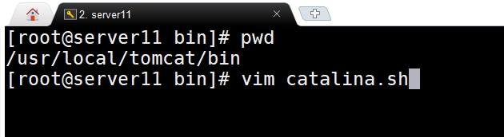
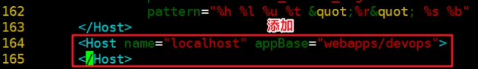

# Tomcat

> **学习目标和内容**
>
> 1、能够描述Tomcat的使用场景
>
> 2、能够简单描述Tomcat的工作原理
>
> 3、能够实现部署安装Tomcat
>
> 4、能够实现配置Tomcat的service服务和自启动
>
> 5、能够实现Tomcat的Host的配置
>
> 6、能够实现Nginx反向代理Tomcat
>
> 7、能够实现Nginx负载均衡到Tomcat

# 一、Tomcat介绍


## 1、简介

Tomcat是Apache 软件基金会（Apache Software Foundation）的Jakarta 项目中的一个核心项目，由Apache、Sun 和其他一些公司及个人共同开发而成。由于有了Sun 的参与和支持，最新的Servlet 和JSP 规范总是能在Tomcat 中得到体现，Tomcat支持最新的Servlet和JSP规范。因为Tomcat 技术先进、性能稳定，而且免费，因而深受Java 爱好者的喜爱并得到了部分软件开发商的认可，成为目前比较流行的Web 应用服务器。

同类软件：

jboss  jetty

weblogic   ORACLE 商业用付费   EJB企业支持  重载配置

websphere  IBM  商业授权

Resin是CAUCHO公司的产品，是一个非常流行的application server，对servlet和JSP提供了良好的支持，性能也比较优良，resin自身采用JAVA语言开发。

## 2、工作原理图示


coyote是tomcat的Connector框架的名字，简单说就是coyote来处理底层的socket，并将http请求、响应等字节流层面的东西，包装成Request和Response两个类（这两个类是tomcat定义的，而非servlet中的ServletRequest和ServletResponse），供容器使用

> 1、用户点击网页内容，请求被发送到本机端口8080，被在那里监听的Coyote HTTP/1.1 Connector获得。
>
> 2、Connector把该请求交给它所在的Service的Engine来处理，并等待Engine的回应。
>
> 3、Engine获得请求localhost/test/index.jsp，匹配所有的虚拟主机Host。
>
> 4、Engine匹配到名为localhost的Host（即使匹配不到也把请求交给该Host处理，因为该Host被定义为该Engine的默认主机），名为localhost的Host获得请求/test/index.jsp，匹配它所拥有的所有的Context。Host匹配到路径为/test的Context（如果匹配不到就把该请求交给路径名为“ ”的Context去处理）。
>
> 5、path=“/test”的Context获得请求/index.jsp，在它的mapping table中寻找出对应的Servlet。Context匹配到URL PATTERN为*.jsp的Servlet,对应于JspServlet类。
>
> 6、构造HttpServletRequest对象和HttpServletResponse对象，作为参数调用JspServlet的doGet（）或doPost（）.执行业务逻辑、数据存储等程序。
>
> 7、Context把执行完之后的HttpServletResponse对象返回给Host。
>
> 8、Host把HttpServletResponse对象返回给Engine。
>
> 9、Engine把HttpServletResponse对象返回Connector。
>
> 10、Connector把HttpServletResponse对象返回给客户Browser。

# 二、安装和配置

## 1、安装方式介绍

①yum方式安装 加载epel源，版本目前为tomcat7.0

②二进制方式安装  直接下载，部署好java环境，即可运行（推荐）

③源码方式安装    需要下载Apache Ant进行编译安装

## 2、二进制安装

**①上传获取软件**


**②部署java环境**

```shell
shell > tar zxvf jdk-8u192-linux-x64.tar.gz
shell > mkdir /usr/local/java
shell > mv jdk1.8.0_192 /usr/local/java
#tomcat配置环境变量的两种方式  三种使用其中一种即可
#第一种tomat依赖JAVA_HOME环境变量
shell > echo "export JAVA_HOME=/usr/local/java/" >> /etc/profile
#第二种tomcat依赖java环境变量
shell > echo "PATH=/usr/local/java/bin:$PATH" >> /etc/profile
#第三中tomcat依赖JRE_HOME变量
shell > echo "export JRE_HOME=/usr/local/java/jre" >> /etc/profile
shell > . /etc/profile
```

如果配置JAVA_HOME路径配置到jdk下就可以，不需要配置到bin下。

如果配置java的环境环境变量PATH，就指定到bin下。

如果启动tomcat，遇到如下问题

①没有安装jre jdk

②环境变量没有配置

③启动的软件找不到需要的java相关软件


**③部署tomcat**

```shell
shell > tar xvf apache-tomcat-9.0.11.tar.gz
shelll > mv apache-tomcat-9.0.11 /usr/local/tomcat
```

软件部署之后的目录结构


## 3、目录介绍


**bin** 存放启动和关闭Tomcat的脚本文件

**conf** 存放Tomcat服务器的各种全局配置⽂文件，其中最重要的是server.xml和web.xml

lib 存放Tomcat服务器所需的各种JAR文件

**logs** 存放Tomcat执行时的日志文件

temp 此目录是tomcat存放的临时文件

**webapps** tomcat默认存放应用程序的目录，好比apache的默认网页存放路径是/var/www/html一样

work 用于存放JSP应用程序在部署时编译后产生的class文件

**项目代码目录**


docs tomcat文档

examples tomcat自带的一个独立的web应用程序例子

host-manager tomcat的主机管理应用程序

manager tomcat的管理应用程序

**ROOT** 指tomcat的应用程序的根，如果应用程序部署在ROOT中，则

可直接通过http://ip:port 访问到

**配置文件目录**


catalina.policy 配置tomcat对文件系统中目录或文件的读、写执行等权限，及对一些内存，session等的管理权限

catalina.properties 配置tomcat的classpath等

context.xml tomcat的默认context容器

logging.properties 配置tomcat的日志输出方式

**server.xml** tomcat的主配置文件  host配置

tomcat-users.xml tomcat的角色(授权用户)配置文件

**web.xml** tomcat的应用程序的部署描述符文件

## 4、启动相关说明

tomcat的相关管理命令在$prefix/bin目录下

经常使用的命令：

catalina.sh  主命令脚本

**configtest.sh   检测配置文件**

**shutdown.sh   关闭**

**startup.sh    启动**

version.sh  查看版本


**①测试启动tomcat**

```shell
shell > /usr/local/tomcat/bin/startup.sh
shell > ps aux |grep tomcat
shell > netstat -lntp |grep 8080
```


**②查看页面效果**


**③测试关闭tomcat**


## 5、配置服务

tomcat提供了方便的启动命令脚本，但是却没有提供服务器中经常管理使用的service脚本。可以自行编写服务管理脚本

**①编辑启动脚本，生成tomcat.pid**




**②脚本实现**


## 6、配置开机自启动服务

根据编写的service脚本，通过chkconfig管理即可


自行编写的service脚本，使用chkconfig管理启动，需要加入chkconfig参数


# 三、企业中常见使用方式

## 1、简单代码测试


**①默认访问目录**


**②编写测试文件**


**③查看测试效果**


## 2、基于域名访问的Host配置

tomcat单实例运行多个tomcat应用的案列

**①建立项目目录并写入测试文件**


**②编辑配置文件**

```shell
shell > /usr/local/tomcat/conf/server.xml
```



name可以填写域名


**③检测配置并重启**

```shell
shell > service tomcat configtest
shell > service tomcat restart
```

**④访问主机解析域名**


**⑤测试访问**


> Tip:
>
> tomcat支持serverlet和jsp规范
>
> 项目源码：
>
> ①jsp   jsp=>java代码=>class字节码=>加载jvm运行=>解析字符串=>container容器=>connector连接=>浏览器
>
> ②java代码

## 3、服务器状态查看


默认访问报错


**①去掉访问IP限制**


**②创建用户和密码开启访问权限**


**③查看页面**


## 4、应用管理查看


**①测试关闭**


**②访问测试**


start之后即可重新访问正常显示

## 5、虚拟机Host管理查看


遇到上面类似的错误


修改host-manager目录下的context.xml


根据以上配置解决即可


## 6、Nginx前端反向代理

实际业务环境中，用户是直接通过域名访问。基于协议一般是http、https等。默认tomcat运行在8080端口。一般会通过前端服务器反向代理到后端tomcat的方式，来实现用户可以直接通过域名访问到tomcat的webapp


动静分离：动态页面的请求交由后端处理（tomcat+java）,静态资源直接返回

**实现配置**

配置文件参考：

```nginx
 server{
          listen       80;
              server_name  tomcat.devops.com;
          #和tomcat的host配置一致
          root /usr/local/tomcat/webapps/devops/ROOT;
          #静态不需要进行转发
          location ~ \.(html|css|js|png|jpg|jpeg)$ {
              #default_type text/plain;
              #echo 'html';
              #alias /;
              #root /usr/local/tomcat/webapps/devops/ROOT;
          }
          #其他识别不是静态资源的，统统发送到后端tomcat
          location / {
               proxy_pass http://127.0.0.1:8080;
               proxy_set_header Host      $host;
               proxy_set_header X-Real-IP $remote_addr;
               #default_type text/plain;
               #echo $host;
               #echo $remote_addr;
               #echo $proxy_add_x_forwarded_for;
          }
    }
```

**nginx单独访问静态页面，出现403的问题：**

分析：没有读权限


**解决方案：**

当nginx和tomcat网站根目录一致的情况，注意nginx是否有权限读到tomcat网站目录的权限。

一般性解决方案网站目录文件夹，赋予一个公共用户www

```shell
shell > cd /usr/local/tomcat
shell > chown -R www:www webapps
```

**访问查看：**


## 7、Nginx负载均衡

随着业务的发展，单实例服务已经不能够满足业务使用需要

pv 页面访问数量    

qps  每秒查询次数    并发量

DAU  每日活跃用户数

单实例无法满足，扩容为多实例

**常见的业务运行方式**

> 单实例单应用 一个tomcat一个webapps
>
> 单实例多应用   一个tomcat多个webapps host
>
> 多实例单应用   多个tomcat同一个webapps

**多实例实现方式：**

①多台服务器一个运行一个实例（性能好） 

②单台服务器运行多个实例（监听不同的端口，性价比高）伪集群

多实例多应用

业务流程图示


> server04  nginx负载均衡
>
> server01   tomcat1
>
> server03   tomcat2

实施步骤：

**①复制虚拟机，多实例**

两台tomcat里项目里的内容要一致

在server03上配置和server01一样的实现：

1>建立项目文件夹目录，绑定host主机域名

2>nginx做反向代理

**②配置nginx负载均衡**

在server04上进行配置

```nginx
upstream tomcat {
        #ip_hash;
        server 192.168.17.102:80;
        server 192.168.17.101:80;
    }
    server {
        listen 80;
        server_name tomcat.devops.com;
        location / {
           proxy_pass http://tomcat;
           proxy_set_header Host      $host;
           proxy_set_header X-Real-IP $remote_addr;
        }
    }
```

# 四、项目部署

## 1、项目介绍

ZrLog是使用 Java 开发的博客/CMS程序，具有简约，易用，组件化，内存占用低等特点。自带 Markdown 编辑器，让更多的精力放在写作上。

<https://github.com/94fzb/zrlog>

## 2、项目部署

**①解析域名**


注意域名解析需要先解析到单例服务器，不要给负载均衡

**②建立项目目录，上传项目程序**


**③绑定域名**


**④开源项目的初始化过程**


**需要建立一个数据库**


**此项目的数据库密码配置文件**


