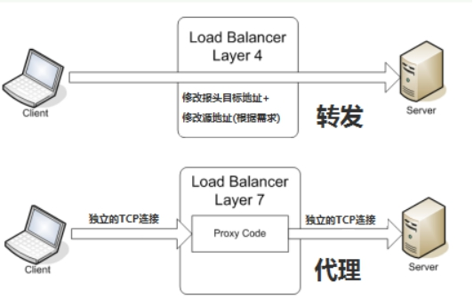

# 企业架构LNMP高可用负载均衡服务器之Nginx

> **学习目标和内容**
>
> 1、能够描述负载均衡的作用 
>
> 2、能够了解负载均衡常见实现方式
>
> 3、能够使用Nginx实现负载均衡
>
> 4、能够描述Nginx的常见负载均衡算法

# 一、背景描述及其方案设计

## 1、业务背景描述

> 时间：2011.6.-2013.9
>
> 发布产品类型：互联网动态站点 商城
>
> ⽤户数量： 4000-8000（用户量猛增）
>
> PV ： 16000-100000（24⼩时访问次数总和）
>
> QPS： 50-100*（每秒访问次数）
>
> DAU： 400-800（每日活跃用户数）

​         随着业务量骤增，之前单点服务器，已经不能够满足业务使用需要。如果主服务器宕机，备服务器提供服务，因为流量太大，备也宕机。需要多台服务器，同时提供服务。

## 2、模拟运维设计方案


以上架构服务器，已经不能够满足以上提到的业务需求。架构发生如下变化


# 二、服务器基本环境部署

## 1、克隆复制虚拟机

> server01  web1   192.168.17.102
>
> server02  mysql   192.168.17.100
>
> server03  web2   192.168.17.101
>
> server04  lb load balance  192.168.17.103

## 2、基础环境配置

网卡IP、主机名称、hosts解析

# 三、负载均衡服务器搭建

## 1、引入负载均衡技术

负载均衡技术 （load blance）  是一种概念  把资源的使用进行平均分配。

负载均衡：分发流量、请求到不同的服务器。使流量平均分配（理想的状态的）

**作用：**

服务器容灾   流量分发

**主要作用：**

①流量分发  请求平均  降低单例压力

**其他作用：**

②安全  隐藏后端真实服务

③屏蔽非法请求（七层负载均衡）

## 2、负载均衡分类


**1）二层负载均衡（mac）**

根据OSI模型分的二层进行负载，一般是用虚拟mac地址方式，外部对虚拟MAC地址请求，负载均衡接收后，再分配后端实际的MAC地址响应 

**2）三层负载均衡（ip） **

一般采用虚拟IP地址方式，外部对虚拟的ip地址请求，负载均衡接收后，再分配后端实际的IP地址响应

**3）四层负载均衡（tcp）**  网络运输层面的负载均衡

在三层负载均衡的基础上，用ip+port接收请求，再转发到对应的机器

**4）七层负载均衡（http）**  智能型负载均衡

根据虚拟的url或IP，主机接收请求，再转向（反向代理）相应的处理服务器

## 3、常见实现方式

> 实现方式分类：
>
> ①软件级别  性价比高  可控性强
>
> ②硬件级别   性能好  价格高  几万到几十万不等

**硬件是实现方式：**

F5 BIG-IP   四层和七层

**软件实现方式：**

| OSI分层 | 实现方式                         |
| ------- | -------------------------------- |
| 七层    | Nginx、HAProxy                   |
| 四层    | LVS、HAProxy、Nginx（1.9版本后） |



**四层和七层对比:**


## 4、Nginx负载均衡配置

**官方文档**：<http://nginx.org/en/docs/http/ngx_http_upstream_module.html>

> **架构分析：**
>
> ①用户访问请求Nginx负载均衡服务器 
>
> ②Nginx负载均衡服务器再分发请求到web服务器
>
> **实际配置负载均衡，只需修改作为负载均衡服务器的Nginx即可。当前架构中的server04**

**①在客户端解析域名到负载均衡服务器**

**②在负载均衡的Nginx配置**

```shell
#注意本次架构中  server04的Nginx服务器是负载均衡服务器
shell > cd /usr/local/nginx/conf/nginx.conf
```

**配置文件示例**：

```nginx
#在http段进行配置
#分发请求到后端服务器
upstream shop {
    #web1 server01
    server 192.168.17.102;
    #web2 server02
    server 192.168.17.101；
}
#修改之前的shop的server段配置
server {
    listen 80；
    server_name www.shop.com;
    location / {
        #代理转发到shop段  匹配到上面的upstream
        proxy_pass http://shop;
        #以下两条配置，实质是设置了传输的header头信息  
        #传输域名给后端服务器  进行识别  方便匹配对应server虚拟主机
        proxy_set_header Host $host;
        #发送客户端IP  给后端服务器  用来方便后端服务器识别用户真实IP
        proxy_set_header X-Real-IP $remote_addr;
    }
}
```

**③重载负载均衡服务器Nginx配置测试查看效果**

可以停掉其中一台web服务器进行测试

## 5、查看确认负载均衡

> 如何确认服务器是否实现了负载均衡？
>
> ①在不同的web服务器同路由访问的文件中，写入不同的信息，以示区别。
>
> ②通过查看后端web服务器的访问日志进行确定

==**方法一：在不同服务器写入不同信息**==

**①分别修改web服务器的信息**

```shell
shell > vim /usr/local/nginx/html/tp5shop/application/home/controller/Base.php
```

写入一个动态参数，根据php语法自动调用当前主机名称


**②访问查看负载均衡效果**


**方法二：查看后端web服务器的访问日志**

```shell
shell > cat /usr/local/nginx/logs/access.log
```

##6、负载均衡后获取客户端IP

> 负载均衡之后，在后端的web服务器获取到的是负载均衡服务器的IP，而不能够获取到客户端的真实IP。
>
> 需要进行以下特殊配置：
>
> ①首先在负载均衡服务器中配置，转发客户端IP给后端web服务器
>
> ②后端web服务器需要配置，识别从负载均衡服务器传输过来的客户端真实IP

**官方网址**：<http://nginx.org/en/docs/http/ngx_http_realip_module.html>

**使用ngx_http_realip_module模块提供的set_real_ip_from语法，默认此模块没有安装，需要编译时添加编译参数**

web服务器上配置set_real_ip_from  代表从哪儿来源的IP，需要识别真实客户端IP

**示例配置：**

```nginx
#此配置在web服务器上的nginx
#可配置到http、server、location中，推荐配置到server中
#配置需要识别的IP来源   负载均衡的IP
set_real_ip_from  192.168.17.103
```

##7、upstream中server的关键字

> upstream中的分发之后的几个关键字：
>
> backup  备  其他的没有backup标识的都无响应，才分发到backup
>
> down   此条配置，不会被分发到

```nginx
upstream shop {
    server 192.168.17.102 down;
    server 192.168.17.101 backup；
}
```

##8、session一致性问题

**访问管理后端页面，登录发现验证码不通过**


**分析原因：**

①比如分发到web1服务器，生成验证码，存储到session中，默认在服务器本地

②再次校验的时候，请求分发到web2服务器了，所有验证码一直校验不通过

**解决方案思路：**

①生成和验证session都请求同一台服务器

②共享session  nfs  mysql ==内存缓存软件（memcached、redis）==

## 9、Nginx的负载均衡算法

> **Nginx 官方默认3种负载均衡的算法**
>
> ①==Round-Robin  RR轮询（默认）==  一次一个的来（理论上的，实际实验可能会有间隔）
>
> ②==weight 权重==  权重高多分发一些  服务器硬件更好的设置权重更高一些
>
> ③==ip_hash==  同一个IP，所有的访问都分发到同一个web服务器

Tip：

第三方模块实现的调度算法  需要编译安装第三方模块

④fair  根据后端服务器的繁忙程度  将请求发到非繁忙的后端服务器

⑤url_hash  如果客户端访问的url是同一个，将转发到同一台后端服务器

**验证一：验证加权轮询算法**

**示例配置：**

```nginx
upstream shop {
    #web1 server01
    server 192.168.17.102 weight=5;
    #web2 server02
    server 192.168.17.101 weight=3；
}
```

server01   web 1      1    1   1   1   1

server03   web 2      1    1   1

8次中，server01分发5次，server03分发3次

**验证二：ip一致性算法**

**示例配置:**

```nginx
upstream shop {
    #ip hash 一致性算法配置  设置此项  weight就失效了
    ip_hash;
    #web1 server01
    server 192.168.17.102 weight=5;
    #web2 server02
    server 192.168.17.101 weight=3；
}
```

## 10、实现负载均衡高可用

所有的请求流量，都要经过负载均衡服务器，负载均衡服务器压力很大，防止它宕机，导致后端服务所有都不可用，需要对负载均衡服务器，做高可用


给负载均衡服务器server04做一台备用服务器server05，通过keepalived实现高可用。

通过keepalived实现VIP在负载均衡服务器组的切换。

> server04   master LB   192.168.17.103
>
> server05   backup LB  192.168.17.50

主负载均衡的keepalived配置

```shell
vrrp_instance VI_1 {
    state BACKUP
    interface eth0
    #虚拟路由ID 新ID 不要之前的冲突
    virtual_router_id 52
    priority 100
    nopreempt
    advert_int 1
    authentication {
        auth_type PASS
        auth_pass 1111
    }
    virtual_ipaddress {
        #添加新VIP
        192.168.17.201
    }
    track_script {
        check_nginx
    }
}
```

备负载均衡的keepalived配置

```shell
vrrp_instance VI_1 {
    state BACKUP
    interface eth0
    #修改route_id
    virtual_router_id 52
    priority 99
    nopreempt
    advert_int 1
    authentication {
        auth_type PASS
        auth_pass 1111
    }
    #unicast_src_ip 192.168.17.101
    #unicast_peer {
    #    192.168.17.102
    #}
    virtual_ipaddress {
        #新VIP
        192.168.17.201
    }
    track_script {
        check_nginx
    }
}

```