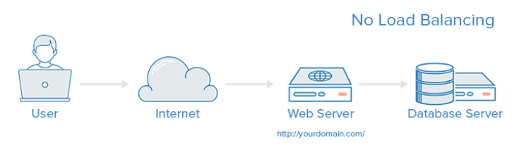
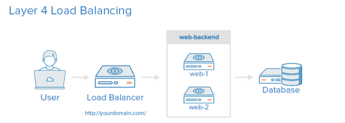
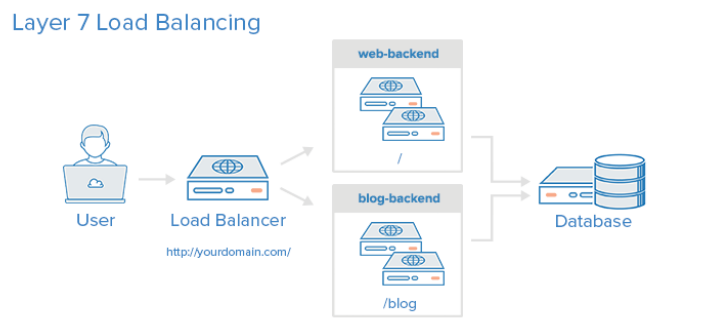

## 企业架构LB-服务器的负载均衡之HAProxy实现

> **学习目标和内容**
>
> 1、能够通过HAProxy实现负载均衡

### 1、介绍

**Introduction**

HAProxy, which stands for High Availability Proxy, is a popular opensource software TCP/HTTP LoadBalancer and proxying solution which can be run on Linux, Solaris, and FreeBSD. Its most common use is to improve the performance and reliability of a server environment by distributing the workload across multiple servers(e.g. web, application, database). It is used in many high-profile environments, including: GitHub, Imgur, Instagram, and Twitter.
In this guide, we will provide a general overview of what HAProxy is,basic load-balancing terminology, and examples of how it might be used to improve the performance and reliability of your own server environment.

**No Load Balancing**

A simple web application environment with no load balancing might look like the following:
In this example, the user connects directly to your web server, at your domain.com and there is no load balancing. If your single webserver goes down, the user will no longer be able to access your webserver. Additionally, if many users are trying to access your server simultaneously and it is unable to handle the load, they may have a slow experience or they may not be able to connect at all.



**Layer 4 Load Balancing**

The simplest way to load balance network traffic to multiple servers is to use layer 4 (transport layer) load balancing. Load balancing this way will forward user traffic based on IP range and port (i.e. if a request comes in for http://yourdomain.com/anything, the traffic will be forwarded to the backend that handles all the requests for yourdomain.com on port 80). For more details on layer 4, check out the TCP subsection of our Introduction to Networking.
Here is a diagram of a simple example of layer 4 load balancing:
The user accesses the load balancer, which forwards the user's request to the web-backend group of backend servers. Whichever backend server is selected will respond directly to the user's request.
Generally, all of the servers in the web-backend should be serving identical content--otherwise the user might receive inconsistent content. Note that both web servers connect to the same database server.



**Layer 7 Load Balancing**

Another, more complex way to load balance network traffic is to use layer 7 (application layer) load balancing. Using layer 7 allows the load balancer to forward requests to different backend servers based on the content of the user's request. This mode of load balancing allows you to run multiple web application servers under the same domain and port. For more details on layer 7, check out the HTTP subsection of our Introduction to Networking.
Here is a diagram of a simple example of layer 7 load balancing:
In this example, if a user requests yourdomain.com/blog, they are forwarded to the blog backend, which is a set of servers that run a blog application. Other requests are forwarded to web-backend,which might be running another application. Both backends use the same database server, in this example



###2、安装

yum方式安装

```shell
shell > yum install haproxy
```

源码编译方式安装 

###3、配置

<http://cbonte.github.io/haproxy-dconv/1.8/intro.html>

源配置文件说明

```shell
# cd /etc/haproxy/
# cp haproxy.cfg haproxy.cfg.bak
# vim haproxy.cfg
**********************************************************************
#---------------------------------------------------------------------
# Example configuration for a possible web application.  See the
# full configuration options online.
#
#   http://haproxy.1wt.eu/download/1.4/doc/configuration.txt
#
#---------------------------------------------------------------------
 
#---------------------------------------------------------------------
# Global settings    
#---------------------------------------------------------------------
global    #全局配置文件
    # to have these messages end up in /var/log/haproxy.log you will
    # need to:     #配置日志
    #
    # 1) configure syslog to accept network log events.  This is done
    #    by adding the '-r' option to the SYSLOGD_OPTIONS in
    #    /etc/sysconfig/syslog    #修改syslog配置文件
    #
    # 2) configure local2 events to go to the /var/log/haproxy.log
    #   file. A line like the following can be added to
    #   /etc/sysconfig/syslog    #定义日志设备
    #
    #    local2.*                       /var/log/haproxy.log
    #
    log         127.0.0.1 local2        #日志配置，所有的日志都记录本地，通过local2输出
 
    chroot      /var/lib/haproxy        #改变haproxy的工作目录
    pidfile     /var/run/haproxy.pid    #指定pid文件的路径
    maxconn     4000                    #最大连接数的设定
    user        haproxy                 #指定运行服务的用户
    group       haproxy                 #指定运行服务的用户组
    daemon
 
    # turn on stats unix socket
    stats socket /var/lib/haproxy/stats
 
#---------------------------------------------------------------------
# common defaults that all the 'listen' and 'backend' sections will
# use if not designated in their block
#---------------------------------------------------------------------
defaults
     
    mode                    http                  #默认使用协议,可以为{http|tcp|health} http:是七层协议 tcp:是四层 health：只返回OK
    log                     global                #全局日志记录
    option                  httplog               #详细记录http日志
    option                  dontlognull           #不记录空日志
    option http-server-close                      #启用http-server-close
    option forwardfor       except 127.0.0.0/8    #来自这些信息的都不forwardfor
    option                  redispatch            #重新分发，ServerID对应的服务器宕机后，强制定向到其他运行正常的服务器
    retries                 3                      #3次连接失败则认为服务不可用
    timeout http-request    10s                    #默认http请求超时时间
    timeout queue           1m                     #默认队列超时时间
    timeout connect         10s                    #默认连接超时时间
    timeout client          1m                     #默认客户端超时时间
    timeout server          1m                     #默认服务器超时时间
    timeout http-keep-alive 10s                    #默认持久连接超时时间
    timeout check           10s                    #默认检查时间间隔
    maxconn                 3000                   #最大连接数
 
#---------------------------------------------------------------------
# main frontend which proxys to the backends
#---------------------------------------------------------------------
frontend  main *:5000
    #定义ACL规则以如".html"结尾的文件；-i：忽略大小写
    acl url_static       path_beg       -i /static /images /javascript /stylesheets
    acl url_static       path_end       -i .jpg .gif .png .css .js
 
    use_backend static          if url_static    #调用后端服务器并检查ACL规则是否被匹配
    default_backend             app              #客户端访问时默认调用后端服务器地址池
 
#---------------------------------------------------------------------
# static backend for serving up images, stylesheets and such
#---------------------------------------------------------------------
backend static                    #定义后端服务器
    balance     roundrobin        #定义算法;基于权重进行轮询
    server      static 127.0.0.1:4331 check    check:启动对后端server的健康状态检测
 
#---------------------------------------------------------------------
# round robin balancing between the various backends
#---------------------------------------------------------------------
backend app
    balance     roundrobin
    server  app1 127.0.0.1:5001 check
    server  app2 127.0.0.1:5002 check
    server  app3 127.0.0.1:5003 check
    server  app4 127.0.0.1:5004 check
```

实际配置文件使用

```shell
#---------------------------------------------------------------------
# Example configuration for a possible web application.  See the
# full configuration options online.
#
#   http://haproxy.1wt.eu/download/1.4/doc/configuration.txt
#
#---------------------------------------------------------------------

#---------------------------------------------------------------------
# Global settings
#---------------------------------------------------------------------
global
    # to have these messages end up in /var/log/haproxy.log you will
    # need to:
    #
    # 1) configure syslog to accept network log events.  This is done
    #    by adding the '-r' option to the SYSLOGD_OPTIONS in
    #    /etc/sysconfig/syslog
    #
    # 2) configure local2 events to go to the /var/log/haproxy.log
    #   file. A line like the following can be added to
    #   /etc/sysconfig/syslog
    #
    #    local2.*                       /var/log/haproxy.log
    #
    log         127.0.0.1 local2

    chroot      /var/lib/haproxy
    pidfile     /var/run/haproxy.pid
    maxconn     4000
    user        haproxy
    group       haproxy
    daemon

    # turn on stats unix socket
    stats socket /var/lib/haproxy/stats

#---------------------------------------------------------------------
# common defaults that all the 'listen' and 'backend' sections will
# use if not designated in their block
#---------------------------------------------------------------------
defaults
    mode                    http
    log                     global
    option                  httplog
    option                  dontlognull
    option http-server-close
    option forwardfor       except 127.0.0.0/8
    option                  redispatch
    retries                 3
    timeout http-request    10s
    timeout queue           1m
    timeout connect         10s
    timeout client          1m
    timeout server          1m
    timeout http-keep-alive 10s
    timeout check           10s
    maxconn                 3000
listen stats
    mode http
    bind *:1090
    stats enable
    stats hide-version
    stats uri    /hadmin?stats
    stats realm  Haproxy\ Statistics
    stats auth    admin:admin
    stats admin if TRUE
#---------------------------------------------------------------------
# main frontend which proxys to the backends
#---------------------------------------------------------------------
#1、修改haproxy默认监听在80端口
frontend  main *:80
    #2、下面几行注释掉
    #stats uri /status
    #acl url_static       path_beg       -i /static /images /javascript /stylesheets
    #acl url_static       path_end       -i .jpg .gif .png .css .js

    #use_backend static          if url_static
    #3、代理转发到后端服务器  app段
    default_backend             app

#---------------------------------------------------------------------
# static backend for serving up images, stylesheets and such
#---------------------------------------------------------------------
#backend static
#    balance     roundrobin
#    server      static 127.0.0.1:4331 check

#---------------------------------------------------------------------
# round robin balancing between the various backends
#---------------------------------------------------------------------
#4、后端app段定义
backend app
    balance     roundrobin
    #定义真实后端服务器IP
    server  app1 192.168.17.100:80 check
    server  app2 192.168.17.104:80 check
    #server  app1 192.168.17.100:80 weight 1
    #server  app2 192.168.17.104:80 weight 1
    #server  app3 127.0.0.1:5003 check
    #server  app4 127.0.0.1:5004 check
```