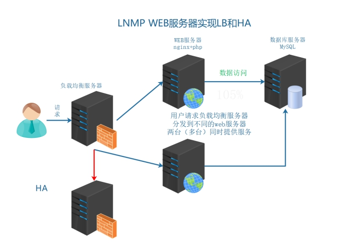
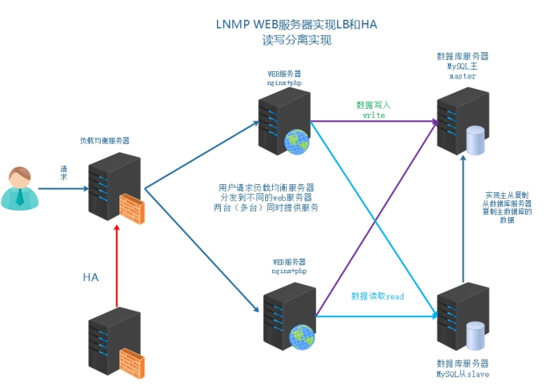
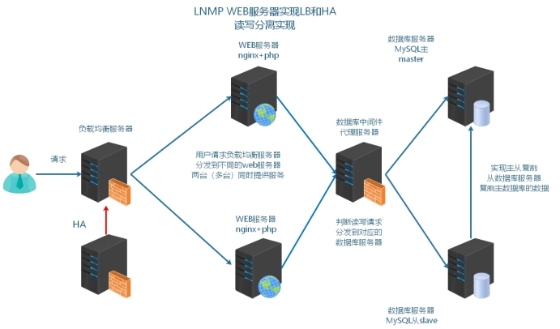
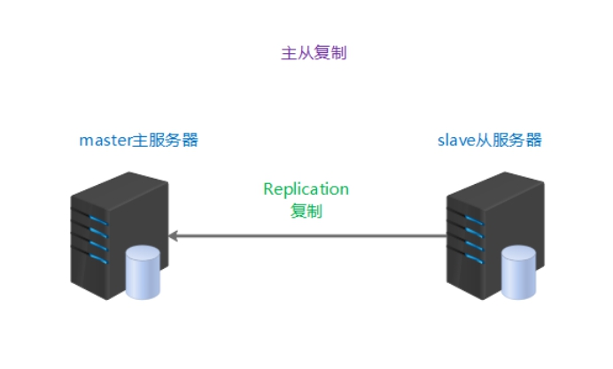
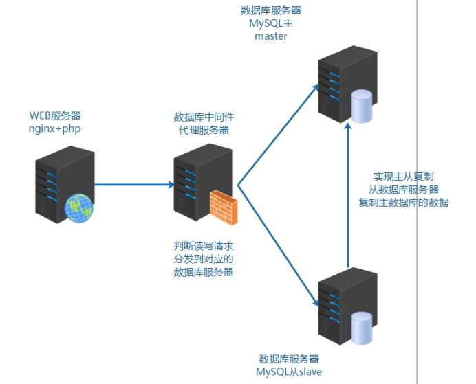
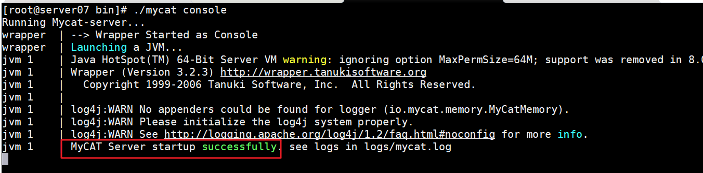
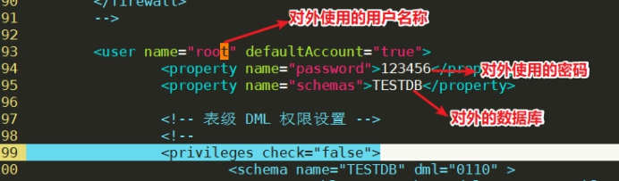

# 企业架构MySQL读写分离

> **学习目标和内容**
>
> 1、能够理解读写分离的目的
>
> 2、能够描述读写分离的常见实现方式
>
> 3、能够通过项目框架配置文件实现读写分离
>
> 4、能够通过中间件实现读写分离

# 一、背景描述及其方案设计

## 1、业务背景描述

> 时间：2014.6.-2015.9
>
> 发布产品类型：互联网动态站点 商城
>
> 用户数量： 10000-12000（用户量猛增）
>
> PV ： 100000-500000（24小时访问次数总和）
>
> QPS： 50-100*（每秒访问次数）
>
> DAU： 2000（每日活跃⽤户数）

​         之前业务中是单台MySQL提供服务，使用多台MySQL数据库服务器，降低单台压力，实现集群架构的稳定性和高可用性    数据的一致性  完整性  replication

通过业务比对和分析发现，随着活跃用户数增多，读取数据的请求变多，故着重解决读取数据的压力

## 2、模拟运维设计方案



根据以上业务需求，在之前业务架构的基础上实现数据的读写分离




# 二、MySQL读写分离介绍

## 1、读写分离的目的

**数据库负载均衡**：

​        当数据库请求增多时，单例数据库不能够满足业务需求。需要进行数据库实例的扩容。多台数据库同时相应请求。也就是说需要对数据库的请求，进行==负载均衡==

​        但是由于数据库服务特殊原因，数据库扩容基本要求为：==数据的一致性和完整性==。所以要==保证多台数据库实例的数据一致性和完整性==，以MySQL为例来说，官方提供了==主从复制机制==。

**读写分离：**

​         数据库的负载均衡不同于其他服务的负载均衡，数据要求一致性。==基于主从复制的基础上，常见的数据库负载均衡使用的是读写分离方式。写入主数据库，读取到从数据库==。可以认为==数据库读写分离，是一种特殊的负载均衡实现。==

**实际业务中，读写分离存在的一个问题，不够实时性。**

对于要求实时性高的业务

①缓存  写主库  写缓存  读缓存

②可以读主

③添加完数据之后，有一个跳转等待的时间（5s），数据正在审核中

## 2、读写分离常见的实现方式

**①业务代码的读写分离**

需要在业务代码中，判断数据操作是读还是写，读连接从数据服务器操作，写连接主数据库服务器操作

以当前LNMP为例，需要通过PHP代码实现读写分离

**②中间件代理方式的读写分离**

在业务代码中，数据库的操作，不直接连接数据库，而是先请求到中间件服务器（代理）

由代理服务器，判断是读操作去从数据服务器，写操作去主数据服务器

| MySQL Proxy | MySQL官方 测试版 不再维护                                 |
| ----------- | --------------------------------------------------------- |
| Atlas       | 奇虎360 基于MySQL Proxy https://github.com/Qihoo360/Atlas |
| DBProxy     | 美团点评                                                  |
| Amoeba      | 早期阿里巴巴                                              |
| cobar       | 阿里巴巴                                                  |
| MyCat       | 基于阿里开源的Cobar                                       |
| kingshared  | go语言开发https://github.com/flike/kingshard              |
| proxysql    | <http://www.proxysql.com/>                                |

也就是如下图示架构



问：如何选择？

①业务实现读写分离，操作方便，成本低，当前的开发框架基本支持读写分离

②中间件代理服务器，除了能够实现读写分离，还可以作为数据库集群的管理平台

# 三、MySQL读写分离案列实现

## 0、搭建M-S复制

主从复制的原理 ：主服务器开启bin-log（记录了写操作） 从服务器获取到主服务器的bin-log  记录到relay-log中。从服务器在通过异步的线程方式，对于relay-log进行重放操作。

 

> server02   mysql master     192.168.17.100
>
> server06   mysql  slave       192.168.17.105

### 1、master配置

**①在master服务器授权，slave服务器replication slave权限**

slave是通过MySQL连接登录到master上来读取二进制日志的，因此需要在

master上给slave配置权限

```mysql
mysql > grant replication slave on *.* to 'slave'@'192.168.17.%'identified by '123456';
```

**②master服务器打开bin-log日志，并标识server-id**

```shell
shell > vim /etc/my.cnf
```

配置文件内容

```shell
[mysqld]
log-bin = mysql-index
server-id = 1
```

注意重启mysql使配置生效

**③制作一个完整的备份**

如果确认主从的数据库，默认开始数据是一致的，可以不做备份

```shell
shell > mysqldump -uroot -p'123456' --all-databases > /root/mysql.sql
```

**④查看master上的bin-log及其position位置**

```mysql
mysql > show master status;
```

查看并记录File的值，Position的值。之后需要在从服务器上，指向这些信息

| 参数     | 作用                        |
| -------- | --------------------------- |
| File     | 记录到的bin-log日志文件名称 |
| Position | bin-log日志文件所记录的位置 |

### 2、slave配置

**①恢复备份文件**

如果slave和master的数据本身就是相同的，可以不选择备份和导入

**②配置server-id，标识服务器**

```shell
shell > vim /etc/my.cnf
```

配置文件内容

```shell
[mysqld]
server-id=2 
```

由于是克隆获取的MySQL实例，所以auto.conf里记录的UUID一样，需要==删除/usr/local/mysql/data/auto.conf文件==，否则主从无法识别互相身份，重启自动生成新的即可。

**③配置slave replication**

```mysql
mysql > stop slave;
mysql> change master to master_host='192.168.17.101',master_user='slave1',master_password='123456',master_log_file='mysql-bin.000002',master_log_pos=333;
mysql > start slave;
```

> **参数说明**
>
> master_host  主master的IP
>
> master_user  主master允许登录，拥有replication slave权限
>
> master_password 用户的密码
>
> 需要通过mysql > show master status; 在master执行
>
> master_log_file  主master记录的bin-log日志文件名称
>
> master_log_pos  主master记录的bin-log日志文件对应的位置

 **④启动replication，并检查结果**

```mysql
mysql > show slave status\G;  
```

查看到两个yes，主从复制成功。否则，查看显示最下面信息，通过error信息进行排查问题。

## 1、简单业务代码实现

示例语法代码：

```php
<?php
//创建类
class Mysql {
  //构造方法
  //当类被实例化时,会触发此方法
  public function __construct(){
     $this->master = @new mysqli('192.168.17.100','tp5shop','$Abc3721','tp5shop');
	 $this->slave = @new mysqli('192.168.17.105','tp5shop','$Abc3721','tp5shop');
     // 如果从连接报错,就连接主
     if($this->slave->connect_errno){
      $this->slave=$this->master;
     }
  }
  // SQL执行方法
  public function query($sql){
    //判断语句中是否存在selete
    if(strpos($sql, 'select') !== false){
      //这是查询操作
      $rs = $this->slave->query($sql);
    }else{
      $rs = $this->master->query($sql);
    }
    return $rs;
  }
}
$mysql = new Mysql();
$sql = "select * from tpshop_goods";
$rs = $mysql->query($sql);
while($row = $rs->fetch_assoc()){
    var_dump($row['goods_name']);
}
```

将此代码上传到web服务器，测试是否可以实现读写分离。注意修改对应的连接地址、用户名称、密码等信息。

```shell
#命令行执行php代码的方式
#php需要提前配置环境变量  xxx.php为需要执行的php脚本文件
shell > php  xxx.php
```

## 2、框架配置实现读写分离

**①通过查看thinkphp5手册找到处理方案**

**②修改项目配置文件**

一定要先去确定主从数据库的数据一致（tp5shop），用户名称和密码可以进行登录使用

```shell
shell > vim /usr/local/nginx/html/tp5shop/application/database.php
```

配置文件示例

```php
return [
    // 数据库类型
    'type'            => 'mysql',
    // 服务器地址
    // 1、主从数据库的连接地址  主在前  从在后
    'hostname'        => '192.168.17.100,192.168.17.105',
    // 2、主从数据库的名称、用户、密码一样的话，只配置一份即可。如果不一样，按照先后顺序，逗号分隔
    // 数据库名
    'database'        => 'tp5shop',
    // 用户名
    'username'        => 'tp5shop',
    // 密码
    'password'        => '$Abc3721',
    // 端口
    'hostport'        => '3306',
    // 连接dsn
    'dsn'             => '',
    // 数据库连接参数
    'params'          => [],
    // 数据库编码默认采用utf8
    'charset'         => 'utf8',
    // 数据库表前缀
    'prefix'          => 'tpshop_',
    // 数据库调试模式
    'debug'           => true,
    // 3、项目框架的业务代码实现读写分离，使用的是分布式（主从服务器）  配置为1
    // 数据库部署方式:0 集中式(单一服务器),1 分布式(主从服务器)
    'deploy'          => 1,
    // 4、数据库读写分离是业务代码实现的，配置为true
    // 数据库读写是否分离 主从式有效
    'rw_separate'     => true,
    // 读写分离后 主服务器数量
    'master_num'      => 1,
    // 指定从服务器序号
    'slave_no'        => '',
    // 是否严格检查字段是否存在
```

测试down主库，看从库是否可以访问。thinkphp5中，如果slave宕机，master提供读服务。

## 3、MyCAT实现读写分离

### 3.1、介绍



准备一台服务器，作为数据库的中间件服务器，配置基本环境，网卡、FQDN

> server01 web1  192.168.17.102
>
> server02 master 192.168.17.100
>
> server06 slave 192.168.17.105
>
> server07 mycat 192.168.17.106

Mycat 数据库中间件

国内最活跃的、性能最好的开源数据库中间件！

官方网址：<http://www.mycat.io/>

<https://github.com/MyCATApache/MyCAT-Server/>

因为mycat是由java语言开发，必须使用java的运行环境才能进行启动和操作

### 3.2、jdk安装

java 静态编译的编程语言 代码编译成机器码  执行机器码输出结果。

编译jdk  javac 编译java代码

运行 jre  编译好的机器码（可以执行文件）  java

**问：公司服务器部署的java环境是jdk还是jre？**

答：jre  java解析运行环境  一般情况编译过的可执行的java程序 ，jre就够用了。

jdk  javac 编译的环境  如果服务器上传是源代码文件 就可以编译，之后再执行。

实际业务环境中，如果存在需要编译的情况，就选择jdk。

**①下载安装jdk**

<https://www.oracle.com/technetwork/java/javase/downloads/jdk8-downloads-2133151.html>

选择下载x64架构.tar.gz包

上传mycat和jdk到soft目录下

```shell
shell > tar xvf jdk-8u192-linux-x64.tar.gz
shell > mv jdk1.8.0_192 /usr/local/java
```

**②配置环境变量**

```shell
#追加环境变量
shell > echo "PATH=/usr/local/java/bin:$PATH" >> /etc/profile
shell > source /etc/profile
#检测java环境变量  如果看到版本信息即为成功 
shell > java -version
```

### 3.3、mycat安装和测试启动

**①解压安装MyCAT**

```shell
shell > tar xvf Mycat-server-1.6.5-release-20180122220033-linux.tar.gz -C /usr/local
```

实际解压到目录即可，无需安装

**②软件目录介绍**

| 目录或文件 | 作用               |
| ---------- | ------------------ |
| **bin**    | 相关软件管理命令等 |
| **conf**   | 配置文件目录       |
| **logs**   | 日志目录           |

**③启动mycat**

默认情况下启动mycat是可以启动的

```shell
#通过控制台  进行前端启动   可以看到执行过程
shell > /usr/local/mycat/bin/mycat console
```



注意如果启动不成功，可能是由于没有解析==主机名称==。==需要在hosts文件中进行解析==。

###3.4、配置读写分离

读写分离的配置文件：

| 文件名称   | 作用                                                 |
| ---------- | ---------------------------------------------------- |
| server.xml | 配置mycat的对外的用户、密码、映射数据库名称等信息    |
| schema.xml | 配置后端真实数据库的用户、密码、真实数据库名称等信息 |

Mycat是由java开发，java开发的软件大部分配置文件是xml格式。注意它的基本格式。

> xml格式注意点：
>
> 1、xml声明信息
>
> 2、具有一个根标签
>
> 3、双标签和单标签格式 
>
> 4、注意闭合标签 
>
> 5、注释格式为  <!--  这里是注释内容 -->

**①查看server.xml**

默认server.xml可以不用修改

```shell
shell > /usr/local/mycat/conf
shell > vim server.xml
```

修改server.xml

配置mycat对外的使用用户信息



**②修改schema.xml**

schema标签里配置name的server.xml里的虚拟数据库名称，dataNode 填写后面使用的dataNode名称

dataNode标签和dataHost指定配置使用

dataHost标签里配置writeHost和readHost（密码，地址，用户名称）

> schema=>dataNode=>dataHost=>writeHost=>readHost

可以使用给大家精简过的配置文件

```xml
<?xml version="1.0"?>
<!DOCTYPE mycat:schema SYSTEM "schema.dtd">
<mycat:schema xmlns:mycat="http://io.mycat/">
    <!-- 1、TESTDB和server.xml配置文件中的映射的数据库名称要一致   dataNone填写下面的dataNode名称 -->
	<schema name="TESTDB" checkSQLschema="false" sqlMaxLimit="100" dataNode="dn3"></schema>
	<!-- 2、dataNode name和上面的一致  dataHost填写下面的dataHost的name名称  database填写后端真实数据库名称-->
    <dataNode name="dn3" dataHost="localhost1" database="tp5shop" />
    <!-- 3、可以配置负载均衡、读写分离算法   暂时可以不用动-->
	<dataHost name="localhost1" maxCon="1000" minCon="10" balance="0" writeType="0" dbType="mysql" dbDriver="native" switchType="1"  slaveThreshold="100">
        <!-- 对后端数据库服务器 发送的心跳检测 -->
		<heartbeat>select user()</heartbeat>
		<!-- can have multi write hosts -->
        <!-- 4、配置后端真实数据库的相关登录信息 -->
		<writeHost host="hostM1" url="192.168.17.100:3306" user="tp5shop" password="$Abc3721">
			<!-- can have multi read hosts -->
			<readHost host="hostS2" url="192.168.17.105:3306" user="tp5shop" password="$Abc3721" />
		</writeHost>
		<!-- <writeHost host="hostS1" url="localhost:3316" user="root" password="123456" />-->
		<!-- <writeHost host="hostM2" url="localhost:3316" user="root" password="123456"/> -->
	</dataHost>
</mycat:schema>
```

注意修改第7行，真实数据库的名称

**③启动mycat服务**

```shell
shell > /usr/local/mycat/bin/mycat start
#确认mycat是否真的启动，查看它的端口 9066 8066
shell > netstat -lntp|grep 8066
```

Tip:如果配置之后，启动mycat，不能够启动

通过查看/usr/local/mycat/logs/wrapper.log

### 3.5、mycat客户端

连接mycat客户端

```shell
shell > mysql -h127.0.0.1 -uroot -p123456 -P8066
```

执行查询命令测试结果

```mysql
mysql > show databases;
mysql > use TESTDB;
mysql > show tables;
```

###3.6、mycat管理端

连接mycat管理端

```shell
shell > mysql -h127.0.0.1 -uroot -p123456 -P9066
```

执行管理命令查看

```mysql
mysql > show @@help;  //查看管理监控端的所有帮助命令
mysql > show @@heartbeat;  //查看服务器状态
```

### 3.7、业务代码配置

​         使用数据库中间件服务器实现读写分离和后端真实数据库的管理。==对于前端业务来说==，数据操作需要连接的是数据库中间件服务器。==操作连接的是数据库中间件服务器，而不直接连接多实例的真实服务器了==。

**①修改项目数据库配置文件**

```shell
shell > vim /usr/local/nginx/html/tp5shop/application/database.php
```

配置文件示例

```php
return [
    // 数据库类型
    'type'            => 'mysql',
    // 服务器地址
    // 1、连接mycat数据库中间件服务器
    'hostname'        => '192.168.17.106',
    // 2、mycat对外映射的数据库名称
    // 数据库名
    'database'        => 'TESTDB',
    // 3、mycat对外映射的用户
    // 用户名
    'username'        => 'root',
    // 4、mycat对外映射的密码和端口
    // 密码
    'password'        => '123456',
    // 端口
    'hostport'        => '8066',
    // 连接dsn
    'dsn'             => '',
    // 数据库连接参数
    'params'          => [],
    // 数据库编码默认采用utf8
    'charset'         => 'utf8',
    // 数据库表前缀
    'prefix'          => 'tpshop_',
    // 数据库调试模式
    'debug'           => true,
    // 5、使用数据库中间件，对于前端业务服务器来说，属于使用集中式单一服务器  配置为0
    // 数据库部署方式:0 集中式(单一服务器),1 分布式(主从服务器)
    'deploy'          => 0,
    // 6、集中式单一服务器  不在业务代码进行读写分离，交由数据库中间件去做  配置为false
    // 数据库读写是否分离 主从式有效
    'rw_separate'     => false,
    // 读写分离后 主服务器数量
    'master_num'      => 1,
    // 指定从服务器序号
    'slave_no'        => '',
    // 是否严格检查字段是否存在
```

**②测试访问**

mycat默认writeHost和readHost，如果writeHost不可用，则readHost也不可用。用两个writeHost，从的writeHost变成可写的了，要在slave服务器上设置readonly

### 3.8、balance属性和writeType属性

**balance 属性**

负载均衡类型,目前的取值有 3 种:

> 1、balance="0", 不开启读写分离机制,所有读操作都发送到当前可用的 writeHost 上。
> 2、balance="1", 全部的 readHost 与 stand by writeHost 参与 select 语句的负载均衡,简单的说,当双主双从模式(M1->S1,M2->S2,并且 M1 与 M2 互为主备),正常情况下,M2,S1,S2 都参与 select 语句的负载均衡。
> 3、balance="2", 所有读操作都随机的在 writeHost、readhost 上分发。
> 4、balance="3", 所有读请求随机的分发到 writerHost 对应的 readhost 执行,writerHost 不负担读压力,注意 balance=3 只在 1.4 及其以后版本有,1.3 没有。

**writeType 属性**

负载均衡类型,目前的取值有 3 种:

> 1、writeType="0", 所有写操作发送到配置的第一个 writeHost,第一个挂了切到还生存的第二个writeHost,重新启动后已切换后的为准.
> 2、writeType="1",所有写操作都随机的发送到配置的 writeHost,1.5 以后废弃不推荐

**switchType 属性**

> -1 表示不自动切换
>
> 1 默认值，自动切换
>
> 2 基于 MySQL 主从同步的状态决定是否切换