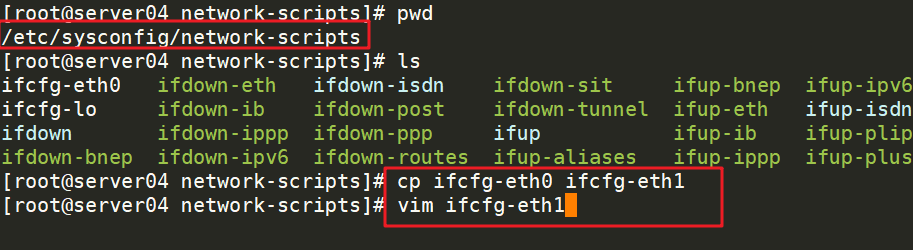

# 企业架构LB-服务器的负载均衡之LVS实现

> **学习目标和内容**
>
> 1、能够了解LVS的基本工作方式
>
> 2、能够安装配置LVS实现负载均衡
>
> 3、能够了解LVS-NAT的配置方式
>
> 4、能够了解LVS-DR的配置方式

#一、LVS介绍和安装

> ​		==**LVS**==（Linux Virtual Server）即Linux虚拟服务器，是由章文嵩博士主导的开源负载均衡项目，目前LVS已经被集成到Linux内核模块中。该项目==**在Linux内核中实现了基于IP的数据请求负载均衡调度方案**==。
>
> ​       LVS的IPVS模块在Linux内核2.4之后以上都被默认支持了，只需要安装ipvsadm管理配置软件即可。

作用和优势：

>①工作在网络层，可以实现高性能，高可用的服务器集群技术。 
>②廉价，可把许多低性能的服务器组合在一起形成一个超级服务器。 
>③易用，配置非常简单，且有多种负载均衡的方法。 
>④稳定可靠，即使在集群的服务器中某台服务器无法正常工作，也不影响整体效果。 
>⑤可扩展性非常好。

安装ipvsadm   只在负载均衡调度服务器上安装即可

```shell
shell > yum -y install ipvsadm
```

LVS的常见工作方式：

> ①NAT(地址转换)
> ②DR(直接路由)

LVS调度算法：
**1.Fixed Scheduling Method 静态调度方法**

**①RR  轮询**
调度器通过"轮叫"调度算法将外部请求按顺序轮流分配到集群中的真实服务器上，它均等地对待每一台服务器，而不管服务器上实际的连接数和系统负载。

**②WRR  加权轮询**
调度器通过"加权轮叫"调度算法根据真实服务器的不同处理能力来调度访问请求。 这样可以保证处理能力强的服务器处理更多的访问流量。调度器 可以自动问询真实服务器的负载情况，并动态地调整其权值。

**③DH  目标地址hash**
算法也是针对目标IP地址的负载均衡，但它是一种静态映射算法，通过一个散列（Hash）函数将一个目标IP地址映射到一台服务器。
目标地址散列调度算法先根据请求的目标IP地址，作为散列键（Hash Key）从静态分配的散列表找出对应的服务器，若该服务器是可用的且未超载，将请求发送到该服务器，否则返回空。

**④SH  源地址hash**
算法正好与目标地址散列调度算法相反，它根据请求的源IP地址，作为散列键（Hash Key）从静态分配的散列表找出对应的服务器，若该服务器是 可用的且未超载，将请求发送到该服务器，否则返回空。
它采用的散列函数与目标地址散列调度算法的相同。除了将请求的目标IP地址换成请求的源IP地址外，它的算法流程与目标地址散列调度算法的基本相似。在实际应用中，源地址散列调度和目标地址散列调度可以结合使用在防火墙集群中，它们可以保证整个系统的唯一出入口。

**2.Dynamic Scheduling Method 动态调度方法**

**①LC  最少连接** 
调度器通过"最少连接"调度算法动态地将网络请求调度到已建立的链接数最少的服务器上。 如果集群系统的真实服务器具有相近的系统性能，采用"最小连接"调度算法可以较好地均衡负载。

**②WLC 加权最少连接**
在集群系统中的服务器性能差异较大的情况下，调度器采用"加权最少链接"调度算法优化负载均衡性能，具有较高权值的服务器将承受较大比例的活动连接负载。调度器可以自动问询真实服务器的负载情况，并动态地调整其权值。

**③SED 最少期望延迟**
基于wlc算法，举例说明：ABC三台机器分别权重123，连接数也分别是123，name如果使用WLC算法的话一个新请求 进入时他可能会分给ABC中任意一个，使用SED算法后会进行这样一个运算
A:(1+1)/2    
B:(1+2)/2    
C:(1+3)/3
根据运算结果，把连接交给C

**④NQ  从不排队调度方法**
无需列队，如果有台realserver的连接数=0 就直接分配过去，不需要进行sed运算.

**⑤LBLC   基于本地的最少连接**
"基于局部性的最少链接" 调度算法是针对目标IP地址的负载均衡，目前主要用于Cache集群系统。
该算法根据请求的目标IP地址找出该 目标IP地址最近使用的服务器，若该服务器 是可用的且没有超载，将请求发送到该服务器；
若服务器不存在，或者该服务器超载且有服务器处于一半的工作负载，则用"最少链接"的原则选出一个可用的服务器，将请求发送到该服务器。

**⑥LBLCR   带复制的基于本地的最少连接**
"带复制的基于局部性最少链接"调度算法也是针对目标IP地址的负载均衡，目前主要用于Cache集群系统。
它与LBLC算法的不同 之处是它要维护从一个 目标IP地址到一组服务器的映射，而LBLC算法维护从一个目标IP地址到一台服务器的映射。
该算法根据请求的目标IP地址找出该目标IP地址对应的服务器组，按"最小连接"原则从服务器组中选出一台服务器，
若服务器没有超载，将请求发送到该服务器；若服务器超载，则按"最小连接"原则从这个集群中选出一 台服务器 ，将该服务器加入到服务器组中，将请求发送到该服务器。同时，当该服务器组有一段时间没有被修改， 将最忙的服务器从服务器组中删除，以降低复制的程度。

#二、LVS实现负载均衡

## 1、LVS-NAT实现

需要知道的几个名词概念：

> 服务类型  所充当的**角色**
>
> DS  负载均衡调度服务器
>
> RS  真实服务器
>
> 
>
> IP的类型和**作用**
>
> CIP 客户端IP
>
> DIP 负载均衡调度服务器IP 
>
> VIP  负载均衡调度服务器的虚拟IP  对外提供服务的IP  用户访问的IP
>
> RIP 真实服务器IP
>
> **不管采用什么网络工作方式**
>
> **用户访问的服务器IP永远是通过VIP，域名必须绑定解析到VIP上**

###1.1、模式介绍


> 1、用户请求VIP(也可以说是CIP请求VIP)
> 2、Director Server 收到用户的请求后,发现源地址为CIP请求的目标地址为VIP,那么Director Server会认为用户请求的是一个集群服务,那么Director Server 会根据此前设定好的调度算法将用户请求负载给某台Real Server。
> 假如说此时Director Server 根据调度的结果会将请求分摊到RealServer1上去,那么Director Server 会将用户的请求报文中的目标地址,从原来的VIP改为RealServer1的IP,然后再转发给RealServer1
> 3、此时RealServer1收到一个源地址为CIP目标地址为自己的请求,那么RealServer1处理好请求后会将一个源地址为自己目标地址为CIP的数据包通过Director Server 发出去,
> 4、当Driector Server收到一个源地址为RealServer1 的IP 目标地址为CIP的数据包,此时Driector Server 会将源地址修改为VIP,然后再将数据包发送给用户

###1.2、案例实现


| server   | type                             | IP                                                   |
| -------- | -------------------------------- | ---------------------------------------------------- |
| 客户端   |                                  |                                                      |
| server04 | 负载均衡调度服务器            DS | 192.168.24.52(对外访问的VIP)     192.168.17.103(DIP) |
| server01 | 真实服务器   web服务器    RS     | 192.168.17.102(RIP)                                  |
| server03 | 真实服务器   web服务器    RS     | 192.168.17.101(RIP)                                  |

> 给server04增加一块网卡，命名为eth1 桥接模式，自动获取IP即可，例子中IP获取为192.168.1.5


在centos系统中建立网卡配置文件




启动网卡


注意如果获取不到IP信息，查看桥接模式的对应网卡，是否选择正确


**①RS上web服务正常运行，这个之前案例已经实现，可以沿用**

```shell
#启动web服务，能够正常访问
#添加默认路由网关
#如果有默认路由网关删除掉即可
shell > route del default
shell > route add default gw 192.168.17.103
```

**②在DS上通过ipvsadm配置调度规则**

```shell
#定义一个集群服务
#定义IP为VIP
shell > ipvsadm -A -t 192.168.24.52:80 -s rr 
#添加RealServer并指定工作模式为NAT
shell > ipvsadm -a -t 192.168.24.52:80 -r 192.168.17.102 -m 
shell > ipvsadm -a -t 192.168.24.52:80 -r 192.168.17.101 -m
#查看ipvs定义的规则列表
shell > ipvsadm -L -n
#启动Linux的路由转发功能
shell > echo 1 > /proc/sys/net/ipv4/ip_forward 
```

> 常用参数说明
>
> -A 增加一个虚拟服务
>
> -t  配置虚拟机服务的地址
>
> -s 负载均衡调度算法
>
> -a 增加一个真实服务器
>
> -r 真实服务器的地址
>
> -m NAT工作模式
>
> -C 清楚所有规则
>
> -g  DR工作模式
>
> -w 权重

**③访问查看效果**

**④修改测试调度算法**

通过-s重新指定负载均衡调度算法

```shell
shell > ipvsadm -E -t 192.168.24.52:80 -s dh
```

解决session生成和验证一致性问题

> **扩展：使用shell脚本编写lvs启动工具**
>
> lvs_nat_ds.sh  调度服务器使用脚本    注意修改对应的VIP和RIP
>
> lvs_nat_rs.sh    真实服务器使用脚本   注意修改对应的网关到RS服务器的RIP
>
> 分别上到各服务器，进行执行即可。

## 2、LVS-DR实现

###2.1、模式介绍


> 1、首先用户用CIP请求VIP
>
> 2、根据上图可以看到，不管是Director Server还是Real Server上都需要配置VIP，那么当用户请求到达我们的集群网络的前端路由器的时候，请求数据包的源地址为CIP目标地址为VIP，此时路由器会发广播问谁是VIP，那么我们集群中所有的节点都配置有VIP，此时谁先响应路由器那么路由器就会将用户请求发给谁，这样一来我们的集群系统是不是没有意义了，那我们可以在网关路由器上配置静态路由指定VIP就是Director Server，或者使用一种机制不让Real Server 接收来自网络中的ARP地址解析请求，这样一来用户的请求数据包都会经过Director Servrer
>
> 3、当Director Server收到用户的请求后根据此前设定好的调度算法结果来确定将请求负载到某台Real Server上去，假如说此时根据调度算法的结果，会将请求负载到RealServer 1上面去，此时Director Server 会将数据帧中的目标MAC地址修改为Real Server1的MAC地址,然后再将数据帧发送出去
>
> 4、当Real Server1 收到一个源地址为CIP目标地址为VIP的数据包时,Real Server1发现目标地址为VIP,而VIP是自己，于是接受数据包并给予处理，当Real Server1处理完请求后，会将一个源地址为VIP目标地址给CIP的数据包发出去，此时的响应请求就不会再经过Director Server了，而是直接响应给用户。

###2.2、案例实现


| server   | type                       | IP                                             |
| -------- | -------------------------- | ---------------------------------------------- |
| 客户端   |                            |                                                |
| server04 | 负载均衡调度服务器  DS     | 192.168.17.103(DIP)       192.168.17.205(VIP)  |
| server01 | 真实服务器   web服务器  RS | 192.168.17.102(RIP)        192.168.17.205(VIP) |
| server03 | 真实服务器   web服务器  RS | 192.168.17.101(RIP)        192.168.17.205(VIP) |

**①在RS上配置**

```shell
#设置arp的通告模式  通过VIP请求到DS服务器
shell > echo 1 > /proc/sys/net/ipv4/conf/lo/arp_ignore
shell > echo 2 > /proc/sys/net/ipv4/conf/lo/arp_announce
shell > echo 1 > /proc/sys/net/ipv4/conf/all/arp_ignore
shell > echo 2 > /proc/sys/net/ipv4/conf/all/arp_announce
#绑定VIP到网卡
shell > ifconfig lo:0 192.168.17.205  broadcast 192.168.17.205 netmask 255.255.255.255 up
#添加主机路由
shell > route add -host 192.168.17.205 dev lo:0
```

**②在DS上配置**

```shell
#配置DS上的VIP
shell > ifconfig eth0:0 192.168.17.205 broadcast 192.168.17.205 netmask 255.255.255.255 up
#添加主机路由
shell > route add -host 192.168.17.205 dev eth0:0
#配置转发规则
shell > ipvsadm -C
shell > ipvsadm -A -t 192.168.17.205:80 -s rr
shell > ipvsadm -a -t 192.168.17.205:80 -r 192.168.17.102 -g
shell > ipvsadm -a -t 192.168.17.205:80 -r 192.168.17.101 -g
```

作业：通过lvs或者haproxy实现mysql的连接转发

①mysql需要建立可以允许远程登录的用户

②lvs配置对应的转发规则即可  注意端口是3306

③haproxy需要修改mode工作模式为tcp模式