# 企业架构缓存中间件分布式memcached

>**学习目标和内容**
>
>1、能够理解描述网站业务访问流程
>
>2、能够理解网站业务的优化方向
>
>3、能够描述内存缓存软件Memcached的作用
>
>4、能够通过命令行操作Memcached
>
>5、能够操作安装php的memcached扩展 extension
>
>6、能够实现session存储到memcached的案例
>
>7、能够实现启动memcached多实例

# 一、大型网站优化

## 1、网站访问流程

随着网站迭代开发，访问会变慢

LNMP架构中网站应用访问流程

> 浏览器（app）=>web服务器=>后端服务（php)=>数据库（mysql）

访问流程越多，访问速度和出现问题的几率也越大

优化访问速度，就需要减少访问步骤或者提高单步骤的速度

## 2、如何优化

根据网页的访问流程，可以进行以下优化：

①提高web服务器并发  负载均衡（多台服务器架构） nginx

②页面静态化  把经常访问，但是数据不经常发生变动的动态页面，制作为静态页面

③内存缓存优化   把经常访问的数据，加载到内存中使用

④数据库优化   很多时候，还需要取数据库信息，所以优化数据库本身

# 二、背景描述及其方案设计

## 1、业务背景描述

> 时间：2016.6.-2016.9
>
> 发布产品类型：互联⽹动态站点 商城
>
> ⽤户数量： 10000-12000（⽤户量猛增）
>
> PV ： 100000-500000（24⼩时访问次数总和）
>
> QPS： 50-100*（每秒访问次数）
>
> DAU： 2000（每⽇活跃⽤户数）

随着业务量增加，访问量越来越大，用户在访问某些页面数据时，通过慢查询日志发现慢查询SQL，经过优化之后效果还是不够明显。而此类数据发生变动的频率又较小，故提出使用缓存中间件（一般会将数据存储到内存中）的方式，降低MySQL的读压力，提高整个业务架构集群的稳定和快速响应能力

## 2、模拟运维设计方案

根据以上业务需求，准备加入缓存中间件服务器


根据以上业务需求和方案，服务器架构升级为如下示意图

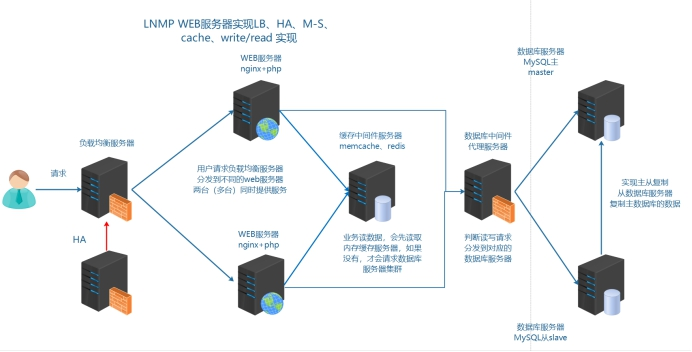

在本次业务架构中，使用缓存中间件解决以下两个问题：

①session共享

②缓存热点数据，首页面的分类信息

# 三、memcached介绍和安装启动

## 1、介绍

memory  cache   cache in memory   缓存放入内存中

Memcached 是国外 社区 网站 LiveJournal  的开发团队开发的 ==高性能的分布式内存缓存服务器==。一般的使用目的是，通过==缓存数据库查询结果，减少数据库访问次数==，以==提高动态 Web 应用的速度==、提高可扩展性

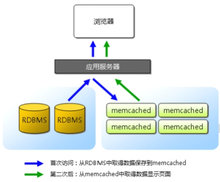

关于缓存的过期，有效期问题，由业务编程代码实现

## 2、安装启动软件

**官方网址**：<http://memcached.org/>

**①上传软件到服务器**

软件包名称memcached-1.5.8.tar.gz

**②解压并编译安装**

```shell
#memcache依赖libevent  安装libevent-devel解决
shell > yum -y install libevent-devel
#编译安装memcached
shell > tar xvf memcached-1.5.8.tar.gz
shell > cd memcached-1.5.8
shell > ./configure --prefix=/usr/local/memcached
shell > make && make install
```

**③查看软件启动参数，并启动**

```shell
shell > cd /usr/local/memcached/bin
shell > ./memcached -h
```

> -p是设置Memcache监听的端口，最好是1024以上的端口；
>
> -d是启动一个守护进程；
>
> -m是分配给Memcache使用的内存数量，单位是MB；
>
> -u是运行Memcache的用户；
>
> -l是监听的服务器IP地址，可以有多个地址；
>
> -c是最大运行的并发连接数，默认是1024；
>
> -P是设置保存Memcache的pid文件

启动memcached

```shell
#进入memcached文件目录
shell > cd /usr/local/memcached/bin
#后台启动memcached  可以创建一个普通用户（memcached）  用来启动管理memcached软件
shell > ./memcached -uroot -d
#进程查看是否启动成功
shell > ps aux |grep memcached
```

#四、memcached使用

## 1、命令行连接和操作

### 1.1、telnet连接使用

memcached默认使用启动服务占用tcp 11211端口。可以通过telnet进行连接使用。

```shell
#安装telnet客户端
shell > yum -y install telnet
#通过telnet连接11211端口
shell > telnet 127.0.0.1 11211
#连接之后敲击多次，如果看到error，即为连接成功
#显示error的原因是，没有输入命令，所以memcached服务器回复error
```

### 1.2、存储命令

**语法：set**

set 命令用于将 value(数据值) 存储在指定的 key(键) 中

如果set的key已经存在，该命令可以更新该key所对应的原来的数据，也就是实现更新的作用
devops

>set key flag exptime bytes
>
>value

flag 服务端提供的一个标识，默认没什么意义，默认可以传个0，这个标识是为了编程语言一个状态，例如:flag（0,1） 代表是否采用压缩机制  0代表不压缩，1代表压缩

bytes  字节  计算机存储的最小单位   KB MB GB TB BB YB ZB

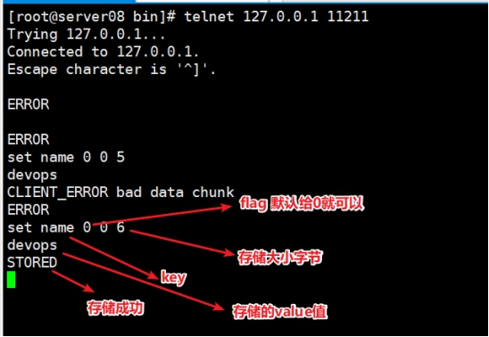

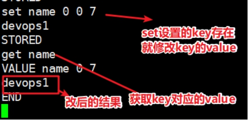

**语法：add**

add 命令用于将 value(数据值) 存储在指定的 key(键) 中

如果 add 的 key 已经存在，则不会更新数据(过期的 key 会更新)，之前的值将仍然保持相同，并且您将获得响应 NOT_STORED

> add key flag exptime bytes
>
> value

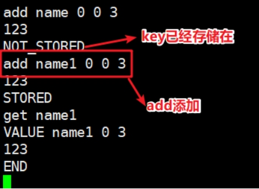

**语法：replace**

replace 命令用于替换已存在的 key(键) 的 value(数据值)

如果 key 不存在，则替换失败，并且您将获得响应 NOT_STORED

> replace key flag exptime bytes
>
> value

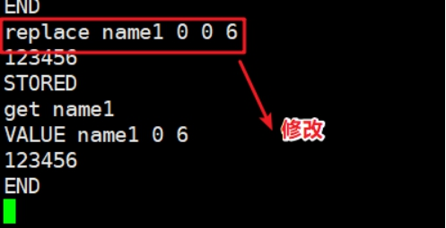

**语法：append**

append 命令用于向已存在 key(键) 的 value(数据值) 后面追加数据

> append key flag exptime bytes
>
> value

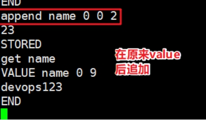

**语法：prepend**

prepend 命令用于向已存在 key(键) 的 value(数据值) 前面追加数据

> prepend key exptime bytes value

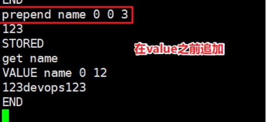

###1.3、删除命令

**语法：delete**

delete 命令用于删除已存在的 key(键)

> delete key

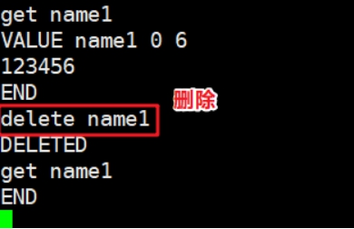

**语法：flush_all**

> 注意此命令，在业务线上环境禁止执行。如果执行，可能会造成所有缓存清空不存在，所有的数据请求都直接到了数据库服务器。造成数据库压力瞬间变大。数据库宕机。

flush_all 命令用于清理缓存中的所有 key=>value(键=>值) 对

该命令提供了一个可选参数 time，用于在制定的时间后执行清理缓存操作

> flush_all [time]

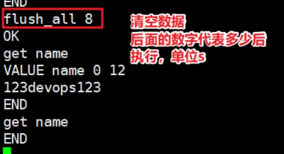

### 1.4、查找和计算命令

**语法：get**

get 命令获取存储在 key(键) 中的 value(数据值) ，如果 key 不存在，则返回空

> get key1 key2 key3

**语法：incr(相加)/decr（相减）**

计数器  每做一次操作 +1

incr 与 decr 命令用于对已存在的 key(键) 的数字值进行自增或自减操作

incr 与 decr 命令操作的数据必须是十进制的32位无符号整数

> incr key value
>
> decr key value

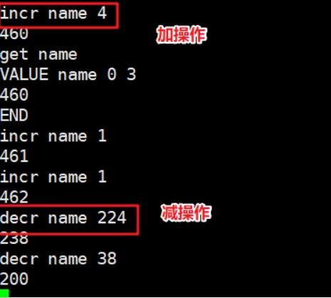

### 1.5、统计状态命令

**语法：stats**

stats 命令用于返回统计信息例如 PID(进程号)、版本号、连接数等

> stats

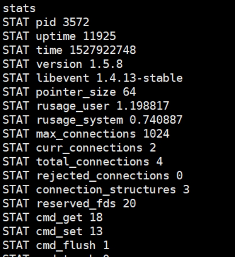

stats的参数参考

> pid：	memcache服务器进程ID
>
> uptime：服务器已运行秒数
>
> time：服务器当前Unix时间戳
>
> 启动时间： time-uptime
>
> version：memcache版本
>
> pointer_size：操作系统指针大小
>
> rusage_user：进程累计用户时间
>
> rusage_system：进程累计系统时间
>
> curr_connections：当前连接数量
>
> total_connections：Memcached运行以来连接总数
>
> connection_structures：Memcached分配的连接结构数量
>
> cmd_get：get命令请求次数
>
> cmd_set：set命令请求次数
>
> cmd_flush：flush命令请求次数
>
> get_hits：get命令命中次数
>
> get_misses：get命令未命中次数
>
> delete_misses：delete命令未命中次数
>
> delete_hits：delete命令命中次数
>
> incr_misses：incr命令未命中次数
>
> incr_hits：incr命令命中次数
>
> decr_misses：decr命令未命中次数
>
> decr_hits：decr命令命中次数
>
> cas_misses：cas命令未命中次数
>
> cas_hits：cas命令命中次数
>
> cas_badval：使用擦拭次数
>
> auth_cmds：认证命令处理的次数
>
> auth_errors：认证失败数目
>
> bytes_read：读取总字节数
>
> bytes_written：发送总字节数
>
> limit_maxbytes：分配的内存总大小（字节）
>
> accepting_conns：服务器是否达到过最大连接（0/1）
>
> listen_disabled_num：失效的监听数
>
> threads：当前线程数
>
> conn_yields：连接操作主动放弃数目
>
> bytes：当前存储占用的字节数
>
> curr_items：当前存储的数据总数
>
> total_items：启动以来存储的数据总数
>
> evictions：LRU释放的对象数目
>
> reclaimed：已过期的数据条目来存储新数据的数目

**缓存命中率**：命中数（get获取到数据）/获取次数（get的次数）

**get_hits/cmd_get**,如果命中率低，业务代码缓存有问题，命中率为0，缓存没有起作用

==缓存穿透==  

​        访问的数据，数据库不存在的数据，每次都不能够生成缓存，每次请求都直接访问数据库，穿透了缓存，缓存没有起到作用。数据库压力没有得到缓解。

​         解决方案，数据库查不到的，也做一个空缓存。

==缓存雪崩== 

​         缓存具有失效时间，如果缓存失效时间都是一样，本来应该请求缓存的，但是因为缓存失效了，全部请求到了数据库，数据库压力剧增，可能会造成数据库宕机，进而造成系统崩溃。

​         解决方案，设置缓存的失效时间均匀分布。

## 2、小工具

memcached_tool.php软件，可以查看memcached运行状态、key(item)的数量了、内存使用量等

需要php的运行环境

**①上传memcached_tool.php到web服务器**

上传到虚拟机主机可以访问的目录即可。

本次上传到了server01服务器的/usr/local/nginx/html/tp5shop/public下

**②修改连接参数**

```shell
shell > vim /usr/local/nginx/html/tp5shop/public/memcached_tool.php
```

示例配置

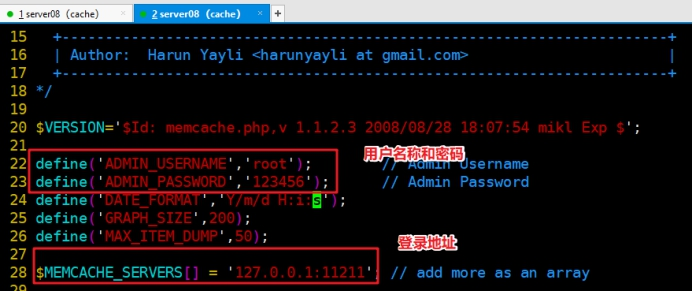

登录地址看实际的地址，演示用，软件脚本在server01上，memcached服务在server08上，所以地址应该填写memcached服务所在地址server08的IP（192.168.17.107）

**③查看使用**

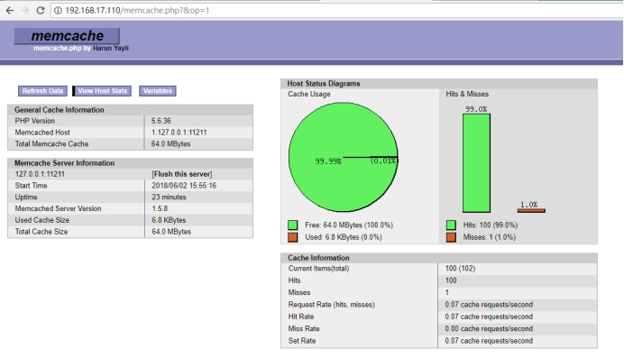

## 3、失效机制（了解）

**①如果key过期了，value会及时删除么，空间会及时清空么？**

**②如果分配的存储空间，写满了，还允许写么?**

### 6.1 Lazy Expiration     

memcached 内部不会监视记录是否过期，而是在 get时查看记录的时间戳，检查记录是否过期。这种技术被称为 lazy（惰性）expiration。因此，memcached 不会在过期监视上耗费 CPU 时间

比如php的里session机制 懒惰机制 php垃圾回收机制 gc回收  python 变量垃圾回收机制

编程语言中，变量分配  栈空间（变量名称）  堆空间（变量值）   

 ==memcached1.4.25之后 就不是懒惰机制了。==

### 6.2 LRU

memcached 会优先使用已超时的记录的空间，但即使如此，也会发生追加新记录时空间不足的情况，此时就要使用名为 Least Recently Used（LRU）机制来分配空间。顾名思义，这是删除“最近最少使用”的记录的机制。因此，当 memcached 的内存空间不足时，就从最近未被使用的记录中搜索，并将其空间分配给新的记录。从缓存的实用角度来看，该模型十分理想

不过，有些情况下 LRU 机制反倒会造成麻烦。memcached 启动时通过“­M”参数可以禁止 LRU

#五、PHP使用memcached

## 1、PHP扩展安装

在LNMP架构中，如果需要使用到memcached。首先需要安装对应的扩展，php7以上需要安装memcached扩展。

**官方扩展地址**：<http://pecl.php.net/>

**①上传PHP扩展源码包**

==需要在web服务器的上安装扩展，server01和server03==

memcached-3.1.3.tgz php的扩展   依赖libmemcached1.x以上版本

> yum 本地源的 libmemcached依赖版本太低，不能够满足php扩展的依赖需要，需要手动源码编译libmemcached

libmemcached-1.0.18.tar.gz  依赖

**②解压编译安装**

```shell
#1、解决libmemcached依赖
shell > tar xvf libmemcached-1.0.18.tar.gz
shell > cd libmemcached-1.0.18
shell > ./configure --prefix=/usr/local/libmemcached && make && make install
#2、源码编译php扩展
shell > tar xvf memcached-3.1.3.tgz
shell > cd memcached-3.1.3
#扩展源码包和php关联生成configure文件  
#如果执行找不到phpize,说明之前没有给php安装目录bin目录配置环境变量，重新配置即可
shell > phpize
#编译安装php的memcached扩展
shell > ./configure --with-libmemcached-dir=/usr/local/libmemcached --disable-memcached-sasl
shell > make && make install
```

编译完成生成的扩展文件

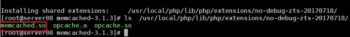

**③在php.ini配置文件里开启**

```shell
shell > vim /usr/local/php/etc/php.ini
```

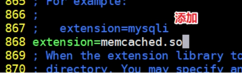

==重启php-fpm服务==

**④检测扩展**

==方法一：php -m==

通过php -m调用查看php所加载的依赖模块

```shell
shell > php -m |grep memcached
```

==方法二：通过web页面访问phpinfo==

```php
<?php
phpinfo();
```

编写一个页面，通过web访问

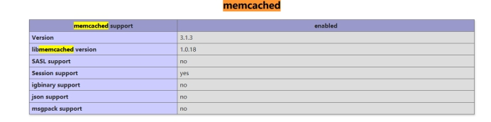

## 2、PHP测试连接代码

php代码测试使用memcached

示例代码

```php
<?php
//实例化类
$mem = new memcached();
//调用连接memcached方法 注意连接地址和端口号
$mem->addServer('192.168.17.107',11211);
//存数据
var_dump($mem->set('name','lnmp'));
//取数据
var_dump($mem->get('name'));
```

# 四、企业案例实现

## 1、session入memcached共享

session共享：

分布式负载均衡架构中，web服务器间的session是不共享（默认session存储在本地的文件的），会造成session校验不一致。校验验证码不通过，登录之后session不一致，造成无法判断是否登录。

解决方案：

①session生成校验在同一台服务器   nginx调度算法  ip_hash

②session共享   多台web服务器可以调用到session

文档参考

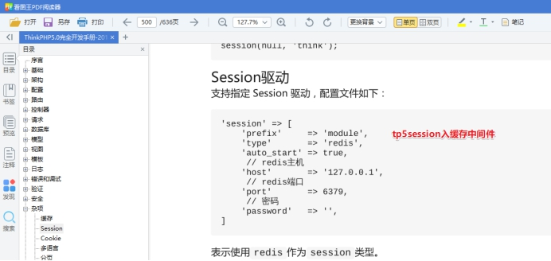

**①修改项目配置文件**

server01和server03都需要修改,并且web服务器都要安装好memcached扩展

```shell
shell > vim /usr/local/nginx/html/tp5shop/application/config.php
```


修改完成之后，之后的请求所生成的session，就被写入到memcached中了。

**②访问测试**

> 在memcached中，session_id作为key，session的内容作为value进行存储。
>
> 都是在业务代码中实现，服务架构中，只要按需配置即可。

## 2、缓存热点数据

把经常访问到的数据，发生变动较小，可以存储到内存缓存中，提供使用速度


注意修改web服务器的文件时，一定要都修改web1和web2

**①修改缓存数据**

修改代码文件

```shell
shell > /usr/local/nginx/html/tp5shop/application/home/controller/Base.php
```

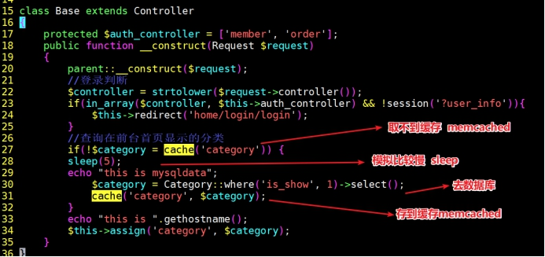

**②修改项目缓存配置**

```shell
shell > vim /usr/local/nginx/html/tp5shop/application
```

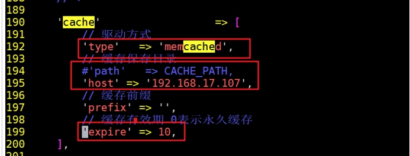

