# 任务背景

公司的集群架构已越来越robust(健壮), 但应用服务器上的代码升级和新产品的发布效率不高，甚至有代码发布到生产服务器后BUG太多，客户反应强烈的情况出现。公司的产品项目从需求分析,设计,研发,代码测试到发布上线的流程有问题，开发者开发的代码提交后有BUG没有反馈，运维也没有在测试环境下做有效地压力测试, 都是导致问题的原因。

所以我们需要运用devops(开发与运维工作流有效结合)思路，通过CICD(持续集成持续交付)来实现自动化的集成与交付工作。

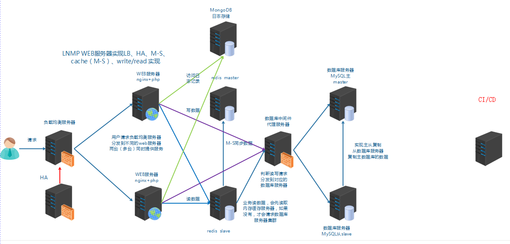

# 任务要求

1, 使用git提交代码到仓库

2, 实现自动代码发布系统

# 任务拆解

1, 了解DevOps的发展历程与思想

2, 学会git版本控制

3, 会使用github公有仓库与gitlab私有仓库

4, 了解CICD

5, 使用jenkins实现自动发布

# **学习目标**

- [ ] 了解DevOps的发展历程

- [ ] 了解版本控制

- [ ] 掌握git的安装

- [ ] 掌握git的基本使用

# DevOps的发展历程

​		DevOps是一种实现Dev(开发)与Ops(运维)工作流有效联合的思想。

​	   那么，我们为什么要了解什么是DevOps呢？因为我们下面所讲的课程内容最终的目的就是为了体现开发与运维有效结合方法，越是高级应用，越接近我们DevOps思想所阐述的做事方法。

​	  首先我们先来了解一下软件开发层面从软件开发出现时起至今，都经历了些什么？

## 原始开发时代

**时代特色：**软件程序员（单一物种）能做到**一专多能**，是**多面小能手**。

软件程序员的公司那时还被称作**实验室**，程序员那时被叫做**科学家**。

为了开发出一套优秀的软件，程序员们必须深入了解他们需要的应用相关的所有问题。

他们必须清楚知道这个软件应用在什么场合，这个软件是必须在什么系统上运行。

本质上说，程序员对所要开发的软件的所有环节都有透彻的了解，从规格说明书编写、到软件开发、到测试、到部署、再到技术支持。

随着技术发展，人类需要软件程序员在软件开发方面具备更快的速度、更全面的功能，以便获取更多的用户等

而软件程序员对自身的要求是一专多能，多面小能手，这样就制约了在软件开发方面的开发速度及添加更多功能的可能性。

当然人类不会允许这种情况出现的，如果因为一个软件程序员开发速度跟不上，那么就要想办法进行优化，把软件程序员的工作进行细化、分配。在分配的过程中，就逐渐衍生出了类软件程序员的新物种，例如：软件工程师、网络管理员、数据库开发者、网页开发者、系统架构师、测试工程师等。

随时新物种的诞生，被各物种划分的领域门头林立，各自为王，很少进行交流互动，只有在迫不得已的时刻才会进行沟通。

由于新物种之间的分隔，导致客户的项目开发过程中出现的问题一拖再拖，无法进行有效解决，更无法在交付日期进行准时交付，让客户付出了昂贵的开发代价，甚至项目以失败告终。

面对这种混乱的情况，有人想到了一种开发模式：瀑布开发。

## 瀑布开发时代

**时代特色**：各物种一专、多人瀑布流式协作

这是一个非常了不起的创意，因为它利用了不同团队的开发者们只在必须的时候才进行沟通的这个事实。当一个团队完成了他们的工作的时候，它就会和下游的团队进行交流并把任务进行往下传，如此一级接一级的传递下去，永不回首。

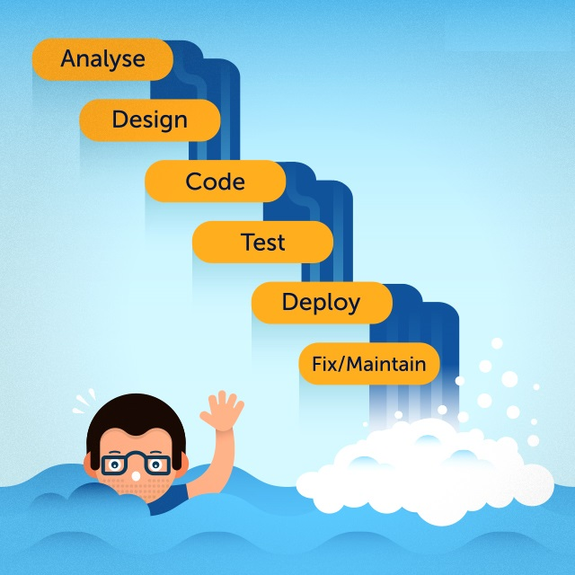

> Analyse          分析
>
> Design           设计
>
> Code             开发
>
> Test                测试
>
> Deploy           部署
>
> Fix/Maintain 加固/维护

这种方式在一段时间内发挥了效用，但很快，一如既往，客户又开始提出更多的诉求。他们希望能够更多地参加到整个软件的开发流程中来，不时的提出他们的建议，甚至在很晚的时候还提出改需求这种丧心病狂的事情来。结果就是如大家有目共睹的事实一样，软件项目非常容易失败这个说法已经作为一个行业标准被人们所接受。

数据表明超过50%的项目最终都是以失败告终的。更可悲的是，在当时看来，人们对这种情况是束手无策。

值得庆幸的是，每一个时代总会有那么几个思想开放的英雄如漆黑中的萤火虫般冒出来。他们知道这些不同团队的开发者们必须要找到一个可以协同工作、进行交流、并且能够弹性的向客户保证对方将会拿到最优的解决方案的方式。这就是敏捷开发。

## 敏捷开发时代

​	**时代特色**：物种一专、多人有效沟通、 协作、 拥抱变化

​	最早可以追溯到1957年，伟大的约翰·冯·诺依曼和同行们的努力。但是我们最终却是等到2001年才收获到革命的果实，当时行业的十多个精英创造出了如今闻名世界的“敏捷宣言”。

**敏捷宣言**十二条原则：

1. 首要任务是通过**尽早地、持续地、交付可评价的软件**来使客户满意
2. **乐于接受需求变更**，即使是在开发后期也应如此。敏捷过程能够驾驭变化，从而为客户赢得竞争优势。
3. **频繁交付可使用的软件，交付间隔越短越好**，可以从几个星期到几个月。
4. 在整个项目开发期间，业务人员和开发人员必须朝夕**工作在一起**。
5. 围绕那些**有推动力的人们来构建项目**。给予他们所需的环境和支持，并且信任他们能够把工作完成好。
6. 与开发团队以及在开发团队内部最快速、有效的传递信息的方法就是：**面对面的交谈**。
7. **可使用的软件**是进度的主要衡量指标。
8. 敏捷过程提倡**可持续发展**。出资人、开发人员以及使用者应该总是**共同维持稳定的开发速度**。
9. 为了增强敏捷能力，应**持续关注技术上的杰出成果和良好的设计**。
10. **简洁**，做工作量减法。
11. 最好的架构、需求和设计都**源自自我组织的团队**。
12. 团队应该定期**反思如何能变得更有战斗力**。

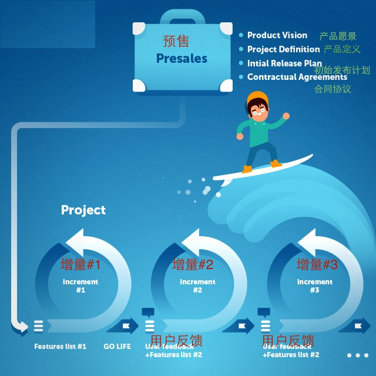

**敏捷宣言好处**

​	敏捷宣言是各物种间迈出各自领域很重要的第一步。这是在以往各物种很长的时间里隔阂后，第一次将不同的关键项目关系人连接在了一起。人们开始互相交流，进行基本的碰头会议，并开始不断的交流意见和看法。他们开始意识到他们是有着很多比想象中还多的共同点，客户也开始成为他们中的一员，而不再是像以往一样只是往项目砸钱然后开始求神拜佛祈求一切顺利如愿。

敏捷意味着开放和拥抱(需求)改变。但是，如果改变过多的话，人们就**很难专注**到**最终的目标**和**交付**上来。

此时精益软件开发就开始破土而出了。

## 精益开发时代

​	**时代特色**：精益求精

​	软件开发行业向软件之外的行业进行学习，目的是为了进一步减少项目风险，实现快速交付。

​	精益开发思想是从丰田汽车生产系统借鉴而来的，把他们的精益生产经验应用到软件开发上面。

​	**精益7原则：**

1. 杜绝浪费

   通过杜绝浪费，达到发挥资源的效率。

2. 内建质量

   质量把关,提升客户对产品整体质量良好感受。

3. 增强学习能力

   通过轮岗方式使得员工取得多种工作技能。

4. 延迟决策（尽量延迟决策）

   以不变，应万变；根据事实而非假设来做决策。

5. 快速发布

   越早获得客户反馈，越早安排开发事项；越短开发周期，越快从市场获取实时信息，为应变市场变化获取时间。

6. 授权与尊重

   让团队成员知道工作全貌；团队领导者要有支持和帮助，克服困难，维持团队合作默契。

7. 系统思考

​	鼓励人与人之间沟通，促进探讨如何生产最好的产品和服务，从而避免局部性思考带来的整合时出现相依性的问题。

​	将这些放到敏捷开发上去的话，精益原则就能让人们在从精神上**关注做正确的事情**，同时还能够让整个开发流程拥有**足够的弹性**。

​	一旦敏捷和精益软件开发被软件开发团队采纳，那么下一步就是把这一套原则应用到IT团队上来。把IT也纳入到整体战略上，这就是我们前面给前面给大家提到的DevOps思想。

## DevOps

​	软件开发团队成员一般会包括项目经理，系统架构师、前端开发者，后端开发者，测试工程师，网络工程师，运维工程师等。软件先由后端开发者，前端开发者进行开发，当软件开发完成，需要部署时，软件会通过自动化手段达到系统架构师，运维工程师等这些运维人员的手上，由运维人员进行部署、发布即可。

如何让软件在开发、测试、运维及最终发布之间进行有效的流动，这就是DevOps所要关注的重点。

DevOps是整个IT架构实施中使用敏捷开发及精益原则的结果，利用精益原则可以使用开发与运维无缝结合。

DevOps是一种文化，一种理念，是一种把开发（Dev）、测试（Test）、运维（Ops）及最终发布（CR）工作流进行联合的思想。

**利用DevOps思想工作的三种方式及实践方法**

**第一种：系统思考**

强调全局优化，而非局部改进。
大到部门职能划分（例如研发部和运维部门），小到个人（开发和系统工程师）。

这种方式将关注点放在整个业务价值流上。换句话说，整个团队应该关注在从需求被定义到开发，再到运维这个过程，直到价值被以服务的形式交付给最终用户。

将这种方式带到实践中的产出便是永远不要将已知的缺陷传递到下游工作，永远不要为了局部优化影响了整体价值流交付，总是为了增加价值流动努力，永远追求对架构的深刻理解。

​		**实践方法**

- 所有环境和代码使用同一个仓库，将软件包纳入版本管理
- 团队共同决定发布流程
- 保持 DEV、TEST、PRODUCTION 环境的一致性
- 自动化回归测试
- 小步提交，每日部署；而不是一次部署大量变更 
- 更快、更频繁发布

> 回归测试是指修改了旧代码后，重新进行测试以确认修改没有引入新的错误或导致其他代码产生错误。

**第二种：放大反馈环**

​	创建从开发过程下游至上游的反馈环。几乎所有的流程改进都是为了从时间上缩短和从覆盖面上放大反馈循环，从而可以不断地进行必要的改正。

​	产出是关注到价值流中所有涉及到的用户，包括价值流内部和外部的，缩短和放大反馈回路，并且可以随时定位到需要改进的地方。

​		**实践方法**

- 代码审查及配置变更检查
- 有纪律的自动化测试，使许多同时的小型敏捷团队能够有效地工作
- 尽早设置监控预警
- 修复 bug 为团队最高优先级
- 团队成员之间高度互相信任
- 团队之间保持沟通和良好合作

​	

**第三种：持续实验和学习的文化**

​	提倡持续做试验，承担风险、从失败中学习；通过反复实践来达到精通。

​	我们需要实验和冒着失败的风险，及时不断地尝试将我们置于一个危险的境地，我们要通过反复试错来掌握使我们远离危险的技能。

​		**实践方法**

- 对服务器正在承载的业务进行故障模拟，把人工错误引入系统中，加强系统的健壮性
- 生产中部署一台服务器用于进行故障训练，以便练习服务器经常处于失效状态下的故障恢复能力。

​	**DevOps清单**

团队有没有按照DevOps的思想去工作，可以按以下清单进行对照即可

- [ ] 开发团队和运维团队之间没有障碍。两者皆是DevOps统一流程的一部分。

- [ ] 从一个团队流到另一个团队的工作都能够得到高质量的验证

- [ ] 工作没有堆积，所有的瓶颈都已经被处理好。

- [ ] 开发团队没有占用运维团队的时间，因为部署和维护都是处于同一个时间段。

- [ ] 开发团队不会在周五下午5点后把代码交付进行部署，剩下运维团队周末加班加点部署

- [ ] 开发环境标准化，运维人员可以很容易將之扩展并进行部署

- [ ] 开发团队可以找到合适的方式交付新版本，且运维团队可以轻易的进行部署。

- [ ] 每个团队之间的通信线路都很明确

- [ ] 所有的团队成员都有时间去为改善系统进行试验和实践

- [ ] 常规性的引入(或者模拟)缺陷到系统中来并得到处理。每次学习到的经验都应该文档化下来并分享给相关人员。事故处理成为日常工作的一部分，且处理方式是已知的

# 版本控制概念

## **什么是版本?**

答: centos6.9,centos7.3,centos7.5这些属于操作系统的版本。

​      nginx-1.10,nginx1.14这些属于软件的版本。

​      一个配置文件或一个代码文件被多次修改,也会有对应的版本。

## **什么是版本控制?**

版本控制软件提供完备的**版本管理功能**，用于**存储、追踪目录（文件夹）和文件的修改历史**，是软件开发者的必备工具，是软件公司的基础设施。版本控制软件的最高目标，是支持软件公司的配置管理活动，追踪多个版本的开发和维护活动，及时发布软件。

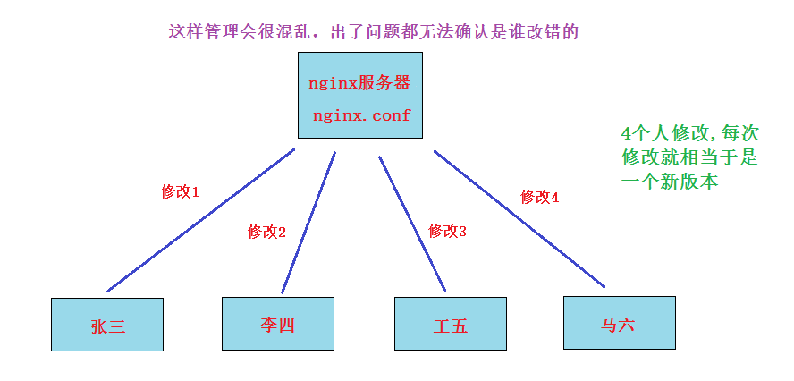

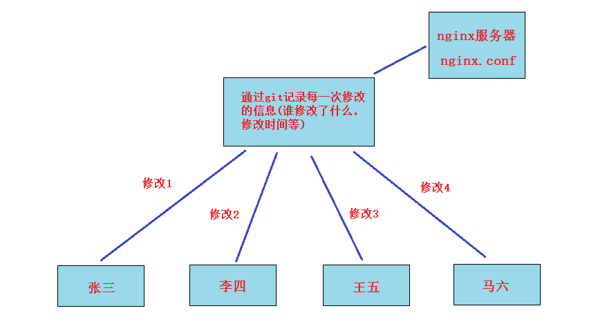

## **常见的版本控制系统及比较**

cvs,svn,git都是版本控制系统

腾讯 tapd, 百度 icafe, 阿里 云效等也是一站式的版本控制。

cvs和svn都是**==集中式==**版本控制系统,而git是**==分布式==**版本控制系统。

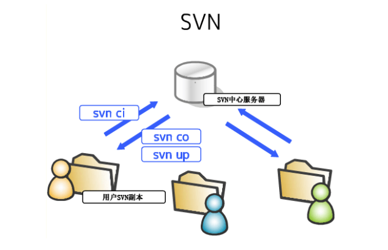

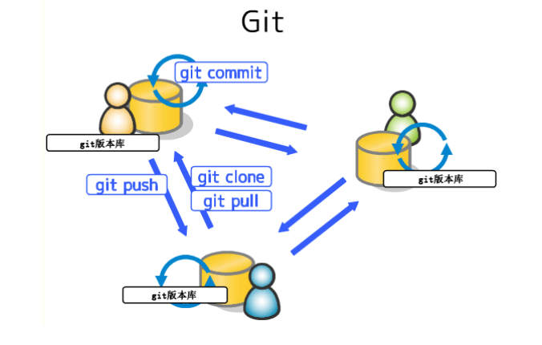

**比较**

* 集中式版本控制系统必须联网才能工作，如果在局域网内还好，带宽够大，速度够快，可如果在互联网上，遇到网速慢的话，呵呵。分布式版本控制系统可以不连网工作, 因为版本库就在你自己的电脑上。

* 集中式版本控制系统如果中央服务器挂了,就完蛋了。分布式版本控制系统可以没有中央服务器，每个人的电脑上都是一个完整的版本库，可靠性高。分布式版本控制系统也可以有一台充当“中央服务器”的电脑，但这个服务器的作用仅仅是用来方便“交换”大家的修改，没有它大家也一样干活，只是交换修改不方便而已。

# git的安装

官网: https://git-scm.com/

**git安装**

~~~powershell
[root@vm1 ~]# yum install git

[root@vm1 ~]# git --version
git version 1.8.3.1
~~~

**查看参数帮助**

~~~powershell
查看参数帮助
[root@vm1 ~]# git --help  
git的操作可以说只需要git一条命令加参数即可
~~~

# git应用

## git身份设置

因为git是分布式版本控制系统,不同的人提交代码需要区分,所以每个人都要设置一个身份标识。如果不设置的话谁会知道你这个开发者是张三，李四，还是王五呢?

~~~powershell
[root@vm1 ~]# git config --global user.name "daniel"
[root@vm1 ~]# git config --global user.email "daniel@itcast.cn"
[root@vm1 ~]# git config --global color.ui true

[root@vm1 ~]# git config --list
user.name=daniel
user.email=daniel@itcast.cn
color.ui=true
~~~

## 创建本地仓库

**==工作目录==**(working directory): 也可叫**==工作区==**. 是存放项目代码文件的一个目录。

**==仓库==**(repository) : 也可叫**==版本库==**. 在git init命令初始化工作目录后会产生一个隐藏的子目录.git, 可以将其理解为git的仓库或版本库。

仓库分为**==本地仓库==**与**==远程仓库==**

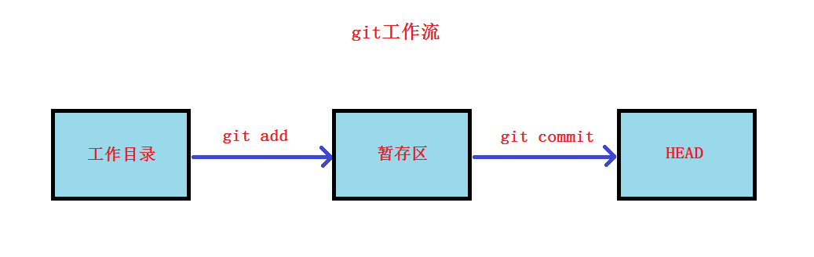

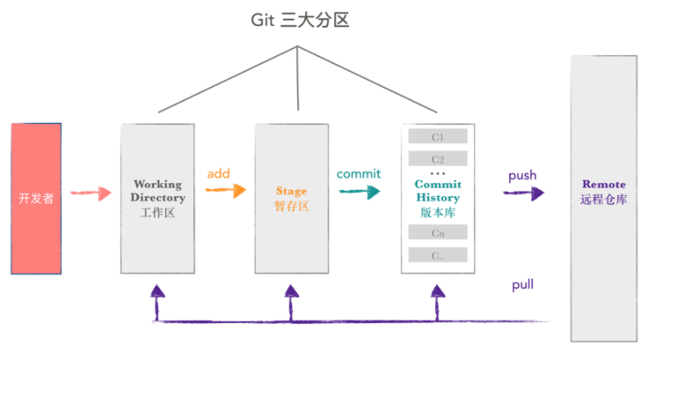

创建本地仓库的步骤:

1. 创建工作目录

~~~powershell
[root@vm1 ~]# mkdir GitTest
~~~

2. 在对应的工作目录中创建本地仓库

~~~powershell
[root@vm1 ~]# cd GitTest/
[root@vm1 GitTest]# git init
Initialized empty Git repository in /root/GitTest/.git/
会产生一个.git子目录,所有除代码数据外的相关数据都在此目录,不要修改它.
(它就是仓库或叫版本库)
[root@vm1 GitTest]# ls .git/
branches  config  description  HEAD  hooks  info  objects  refs
~~~

**小结:** `mkdir`创建一个工作目录, 然后`cd`进去, 使用`git init`就创建好了本地仓库。开发者就可以在工作目录里开发项目代码文件了。

## 暂存区

**==暂存区==**(stage或index): 也有叫**==缓存区==**

暂存区就看作**是一个缓区区域，临时保存你的改动**。

如果在工作目录创建了一个新文件，需要将新文件添加到暂存区。

### **添加文件到暂存区**

1, 准备一个文件

~~~powershell
[root@vm1 GitTest]# cat 1.py 
print("hello world")
~~~

2, 使用`git add`命令提交到暂存区（逆向操作为`git rm --cached 1.py`)

~~~powershell
[root@vm1 GitTest]# git add 1.py
~~~

3, 提交第一个文件后,版本库.git子目录里就多了一个index

~~~powershell
[root@vm1 GitTest]# ls .git/
branches  config  description  HEAD  hooks  index  info  objects  refs
~~~

4, 使用`strings`命令查看可以看到`git add`的文件列表

~~~powershell
[root@vm2 GitTest]# strings .git/index 
DIRC
1.py									这里可以看到1.py文件添加到了index文件里了
~~~

## git版本控制

### 提交文件(第1个版本)

代码文件需要**==commit==**提交后才能纳入版本控制。

1, 可以使用`git status`查看工作目录里有哪些文件需要提交

~~~powershell
[root@vm1 GitTest]# git status
# On branch master
#
# Initial commit
#
# Changes to be committed:
#   (use "git rm --cached <file>..." to unstage)
#
#	new file:   1.py
#
~~~

2, 使用`git commit`提交; -m 后接提交的说明信息

~~~powershell
[root@vm1 GitTest]# git commit -m "提交1.py"
[master (root-commit) 4e67190] 提交1.py
 1 file changed, 1 insertion(+)
 create mode 100644 1.py
~~~

3, 再次`git status`查看状态,没有需要提交的文件了

~~~powershell
[root@vm1 GitTest]# git status
# On branch master
nothing to commit, working directory clean
~~~

### 修改再提交(第2个版本)

1, 修改1.py文件,我这里加了一句print("hello python")

~~~powershell
[root@vm1 GitTest]# cat 1.py
print("hello world")
print("hello python")
~~~

2, 使用`git status`查看，信息告诉我们1.py被修改了

~~~powershell
[root@vm1 GitTest]# git status
# On branch master
# Changes not staged for commit:
#   (use "git add <file>..." to update what will be committed)
#   (use "git checkout -- <file>..." to discard changes in working directory)
#
#	modified:   1.py
#
no changes added to commit (use "git add" and/or "git commit -a")
~~~

3, 使用`git diff`查看修改了什么

~~~powershell
[root@vm1 GitTest]# git diff 1.py
diff --git a/1.py b/1.py
index 8cde782..5da7641 100644
--- a/1.py
+++ b/1.py
@@ -1 +1,2 @@
 print("hello world")
+print("hello python")
~~~

4, 提交修改(add+commit)

~~~powershell
[root@vm1 GitTest]# git add 1.py
[root@vm1 GitTest]# git commit -m "添加了一行代码打印hello python"
[master 0e9371b] 添加了一行代码打印hello python
 1 file changed, 1 insertion(+)
~~~

### 再修改再提交(第3个版本)

~~~powershell
再增加一句代码print("hello linux")
[root@vm1 GitTest]# cat 1.py
print("hello world")
print("hello python")
print("hello linux")

[root@vm1 GitTest]# git add 1.py

[root@vm1 GitTest]# git commit -m "添加了一行代码打印hello linux"
[master b679b01] 添加了一行代码打印hello linux
 1 file changed, 1 insertion(+)
~~~

**小结:** 

* 工作目录中写好的代码文件需要先`git add 文件名`添加到暂存区,再`git commit 文件名`提交。以后每次修改都要重复前两步。
* `git status`查看工作目录中的状态
* `git diff 文件名`查看文件修改了什么

### 查看提交历史

1, 使用`git log`查看提交的历史版本信息

~~~powershell
[root@vm1 GitTest]# git log
commit b679b01f2ee42c1c4a7e14ed5d37e02da131a98e
Author: daniel <daniel@itcast.cn>
Date:   Wed Jan 16 14:00:44 2019 +0800

    添加了一行代码打印hello linux

commit 0e9371bfdbc27049c31017773248ae8333b5bf3f
Author: daniel <daniel@itcast.cn>
Date:   Tue Jan 15 23:43:58 2019 +0800

    添加了一行代码打印hello python

commit 4e67190ec3c57f1708702c9eca5aebe88017bdd2
Author: daniel <daniel@itcast.cn>
Date:   Tue Jan 15 23:23:26 2019 +0800

    提交1.py
~~~

2, 使用`git log --pretty=oneline`查看提交的历史版本信息, 查看的显示信息更简洁。

​    前面字符串你可以看作就是一个**版本号**(commit id)。

~~~powershell
[root@vm1 GitTest]# git log --pretty=oneline
b679b01f2ee42c1c4a7e14ed5d37e02da131a98e 添加了一行代码打印hello linux
0e9371bfdbc27049c31017773248ae8333b5bf3f 添加了一行代码打印hello python
4e67190ec3c57f1708702c9eca5aebe88017bdd2 提交1.py
~~~

### 版本回退与还原

1, 使用`git reset --hard HEAD^`回退到上一个版本(也就是第2个版本)

~~~powershell
[root@vm1 GitTest]# git reset --hard HEAD^
HEAD is now at 0e9371b 添加了一行代码打印hello python

[root@vm1 GitTest]# cat 1.py 
print("hello world")
print("hello python")
~~~

2, 使用`git reset --hard 第3个版本号 `还原到第3个版本。

​    但如果我忘了第3个版本号是什么了,使用`git reflog`查看所有的操作历史。

~~~powershell
[root@vm1 GitTest]# git reflog
0e9371b HEAD@{0}: reset: moving to HEAD^
b679b01 HEAD@{1}: commit: 添加了一行代码打印hello linux
0e9371b HEAD@{2}: commit: 添加了一行代码打印hello python
4e67190 HEAD@{3}: commit (initial): 提交1.py
~~~

3, 还原到第3个版本

~~~powershell
[root@vm1 GitTest]# git reset --hard b679b01
HEAD is now at b679b01 添加了一行代码打印hello linux

[root@vm1 GitTest]# cat 1.py 
print("hello world")
print("hello python")
print("hello linux")
~~~

4, 回退到**上上**一个版本, 也就是回退两个版本,使用`git reset --hard HEAD^^`

回退三个版本,使用`git reset --hard HEAD^^^`, 以此类推。

如果回退100个版本，那用100个^符号不方便，可以换成`git reset  --hard HEAD~100`

~~~powershell
[root@vm1 GitTest]# git reset --hard HEAD^^
HEAD is now at 4e67190 提交1.py

[root@vm1 GitTest]# cat 1.py 
print("hello world")
~~~

**小结:** 

* 提交后的代码文件，使用`git log`查看当前版本及以前的历史版本。
* 使用`git reset --hard HEAD^`或者`git reset --hard HEAD~100`实现版本回退。
* 使用`git reflog`查看提交的所有操作及版本号

* 使用`git reset --hard 版本号`你可以自由的在不同版本之间来回切换。

**git工作流再次理解与应用拓展**

* 工作目录里任何修改或增加的文件，都要git add到暂存区，让暂存区和工作目录的状态一致，这样才能提交一个版本。

* git commit提交的是在暂存区里的所有文件状态。**==也就是说是整个工作目录里的状态保存为一个版本，而不是某一个文件==**。

* git版本控制不仅仅是用于项目开发，你也可以用于一个软件包仓库的版本控制。

### 撤销修改

如果开发者状态不好,今天写的代码一团乱,想吃后悔药,git也提供了撤销的方法。

1, 准备一行或一段写错的代码

~~~powershell
[root@vm1 GitTest]# cat 1.py 
print("hello world")
print("hello python")
print("hello linux")
print("hey,xxx is a gay")				这是写错的代码，需要反悔
~~~

想要撤销修改有以下方法:

* 直接把写错的代码删除就好, 但如果改变的代码很多，开发者自己都忘了具体改了哪些代码，这种做法就不方便了
* 使用`git checkout -- 文件名`就可以直接撤销修改了
* 如果写乱了代码，添加暂存区但还没有commit提交。使用`git reset HEAD 文件名`取消暂存区添加，再`git checkout -- 文件名`来撤销修改
* 如果写乱了代码，添加暂存区并提交了。则使用版本回退

### 误删恢复

1, 只要文件`git add`到了暂存区, 无论有没有`git commit`提交。误删除后都可以使用 `git checkout -- 文件名`来恢复。

~~~powershell
[root@vm1 GitTest]# touch 2.py
[root@vm1 GitTest]# git add 2.py
[root@vm1 GitTest]# rm 2.py  -rf
[root@vm1 GitTest]# ls
1.py
[root@vm1 GitTest]# git checkout -- 2.py
[root@vm1 GitTest]# ls
1.py  2.py
~~~

2, 如果文件没有`git add`到暂存区, 误删除了就没了。

~~~powershell
[root@vm1 GitTest]# touch 3.py
[root@vm1 GitTest]# rm 3.py  -rf

下面命令恢复报错
[root@vm1 GitTest]# git checkout -- 3.py
error: pathspec '2.py' did not match any file(s) known to git.
~~~

### 文件删除

1, 没有`git add`到暂存区的文件**直接rm删除就ok**

2, `git add`添加到暂存区,但没有`git commit`提交的文件。需要**rm删除本地,还要git rm 文件名删除**

~~~powershell
[root@vm1 GitTest]# touch 3.py
[root@vm1 GitTest]# git add 3.py

[root@vm1 GitTest]# rm 3.py -rf
[root@vm1 GitTest]# git rm 3.py
rm '3.py'
~~~

3,  `git add`添加到暂存区,并且已经`git commit`提交的文件。需要**rm删除本地,再git rm 文件名删除,最后再提交删除**

~~~powershell
[root@vm1 GitTest]# touch 3.py
[root@vm1 GitTest]# git add 3.py
[root@vm1 GitTest]# git commit -m "提交了3.py"
[master 0236aef] 提交了3.py
 1 file changed, 0 insertions(+), 0 deletions(-)
 create mode 100644 3.py

[root@vm1 GitTest]# rm 3.py -rf
[root@vm1 GitTest]# git rm 3.py
rm '3.py'
[root@vm1 GitTest]# git commit -m "删除了3.py"
[master dc4ee5e] 删除了3.py
 1 file changed, 0 insertions(+), 0 deletions(-)
 delete mode 100644 3.py
~~~

### git版本控制小结

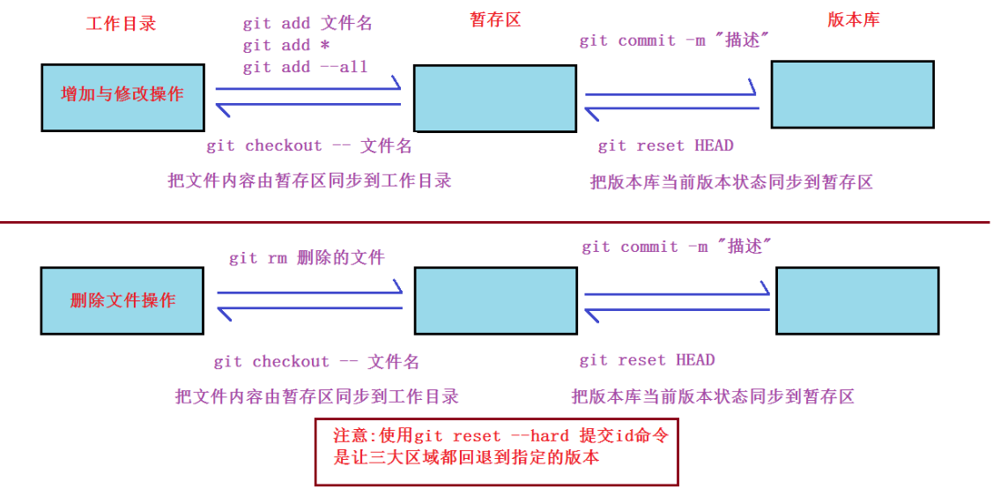

## git分支管理

先来考虑一个问题: 开发者A开发软件的某一个功能模块, 还没有开发完成，但害怕进度丢失就提交。假设另一位开发者B并不知道A没有完成, 而直接使用了A开发的文件,这造成了问题。

解决方法:  开发者A创建一个属于自己的分支，这个分支只属于A，不会影响其他人。开发完成后，合并到项目主分支即可。

分支可以看作为平行空间

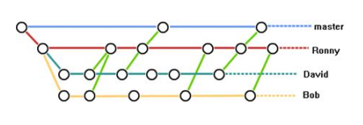

### 查看分支

默认只有一个master分支, 前面有*号的代表为当前分支。

~~~powershell
[root@vm1 GitTest]# git branch
* master
~~~

### 创建分支

使用`git branch 分支名`来创建分支

~~~powershell
[root@vm1 GitTest]# git branch dev

[root@vm1 GitTest]# git branch 
  dev
* master
~~~

### 切换分支

使用`git checkout 分支名`来切换分支

~~~powershell
[root@vm1 GitTest]# git checkout dev
Switched to branch 'dev'
[root@vm1 GitTest]# git branch 
* dev
  master
~~~

### 合并分支

1, 在dev分支上新开发了一个代码文件,添加并提交

~~~powershell
[root@vm1 GitTest]# git branch 
* dev						确认为dev分支
  master

[root@vm1 GitTest]# echo "new feature" > 5.py
[root@vm1 GitTest]# git add 5.py
[root@vm1 GitTest]# git commit -m "增加了新特性"
[dev 4a0c78e] 增加了新特性
 1 file changed, 1 insertion(+)
 create mode 100644 5.py
~~~

2, 切换到master上分支后,却发现根本没有这个文件

~~~powershell
[root@vm1 GitTest]# git checkout master
Switched to branch 'master'
[root@vm1 GitTest]# cat 5.py 
cat: 5.py: No such file or directory
~~~

3, 合并分支,再查看能在master分支上查看到了

~~~powershell
[root@vm1 GitTest]# git merge dev
Updating dc4ee5e..4a0c78e
Fast-forward
 5.py | 1 +
 1 file changed, 1 insertion(+)
 create mode 100644 5.py
 
[root@vm1 GitTest]# cat 5.py 
new feature
~~~

### 分支冲突

有些复杂的情况会造成冲突，这个时候git就不能帮我们自动的合并分支。我们就要手动处理冲突。

1, 在dev分支修改文件

~~~powershell
[root@vm1 GitTest]# git checkout dev
Switched to branch 'dev'
[root@vm1 GitTest]# echo "冲突测试" >> 5.py 
[root@vm1 GitTest]# cat 5.py 
new feature
冲突测试
~~~

2, 提交dev分支上的修改

~~~powershell
[root@vm1 GitTest]# git add 5.py
[root@vm1 GitTest]# git commit -m "冲突测试"
[dev de5075c] 冲突测试
 1 file changed, 1 insertion(+)
~~~

3, 切回master分支,也修改相同的文件

~~~powershell
[root@vm1 GitTest]# git checkout master
Switched to branch 'master'
[root@vm1 GitTest]# echo "哈哈" >> 5.py 
[root@vm1 GitTest]# cat 5.py 
new feature
哈哈
~~~

4, 提交master分支上的修改

~~~powershell
[root@vm1 GitTest]# git add 5.py
[root@vm1 GitTesgit commit -m "冲突测试"
[master c17f325] 冲突测试
 1 file changed, 1 insertion(+)
~~~

5, 合并dev分支到master，就会出现冲突了

~~~powershell
[root@vm1 GitTest]# git merge dev
Auto-merging 5.py
CONFLICT (content): Merge conflict in 5.py
Automatic merge failed; fix conflicts and then commit the result.
~~~

6, 手工解决冲突

git使用`<<<<<<<<<,=========,>>>>>>>>`符号分割冲突的内容，手动删除这些符号，并修改成你想要的内容

~~~powershell
解决冲突前:
[root@vm1 GitTest]# cat 5.py 
new feature
<<<<<<< HEAD
哈哈
=======
冲突测试
>>>>>>> dev

解决冲突后:
[root@vm1 GitTest]# cat 5.py 
new feature
冲突解决
~~~

7, 解决冲突后添加并提交,最后再合并

~~~powershell
[root@vm1 GitTest]# git add 5.py
[root@vm1 GitTest]# git commit -m "冲突解决"
[master fb05c2f] 冲突解决
[root@vm1 GitTest]# git merge dev
Already up-to-date.
~~~

### 删除分支

使用`git branch -d 分支名`来删除分支。**==注意:==** **不能删除当前使用的分支.**

~~~powershell
[root@vm1 GitTest]# git branch
  dev
* master

[root@vm1 GitTest]# git branch -d dev
Deleted branch dev (was de5075c).

[root@vm1 GitTest]# git branch
* master
~~~

# windows版git(拓展)

## windows上安装git

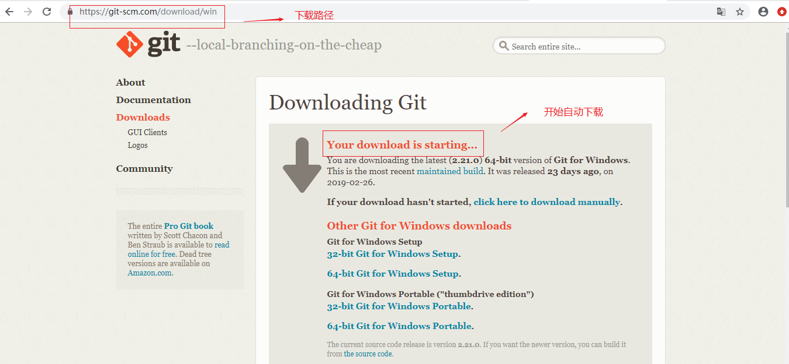

windows上安装git

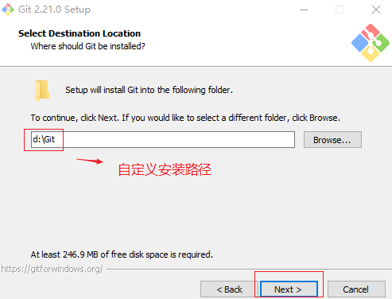

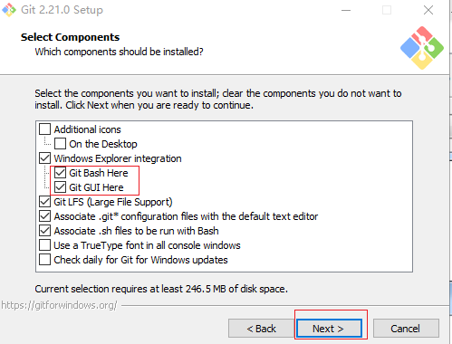

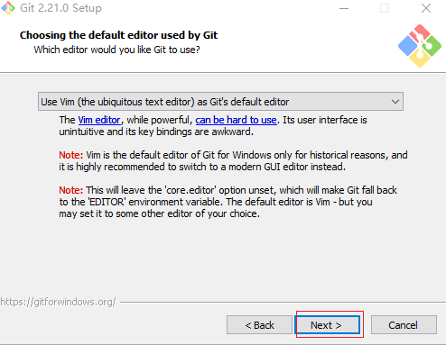

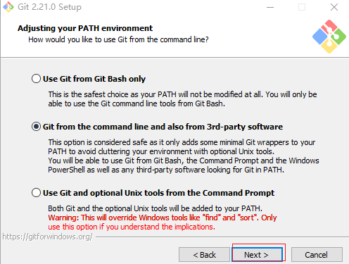

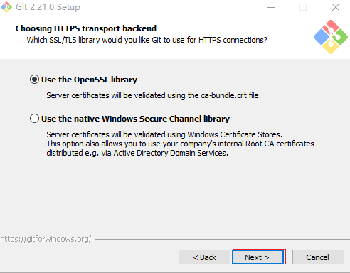

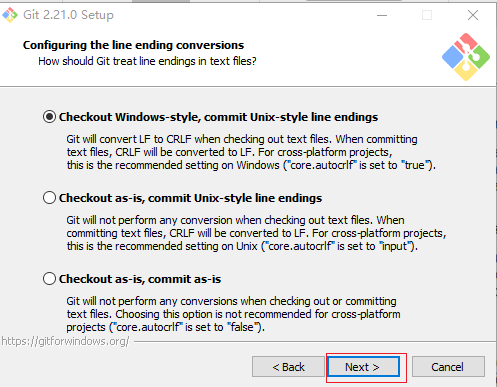

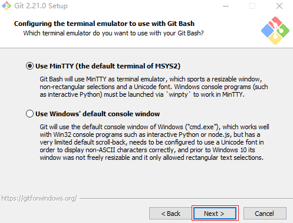

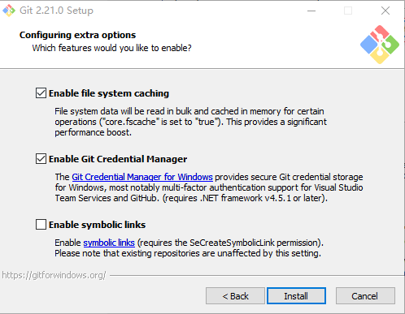

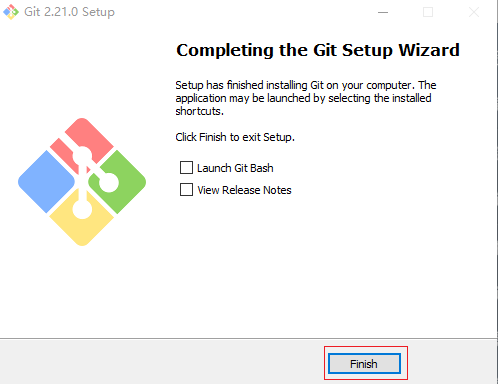

## windows上使用git

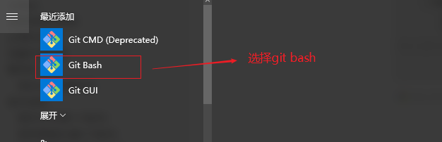

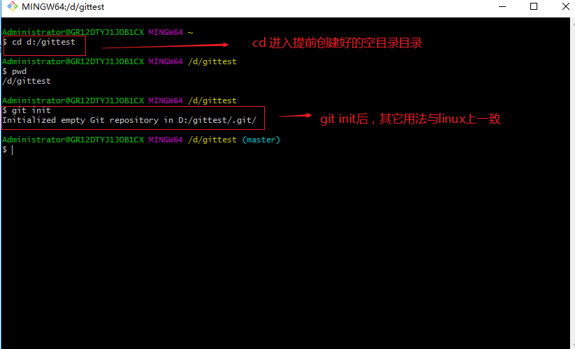