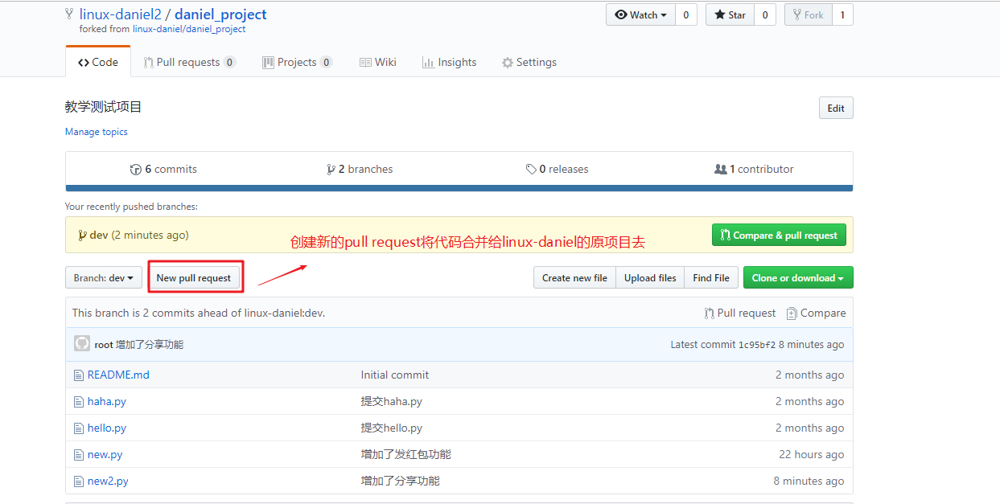
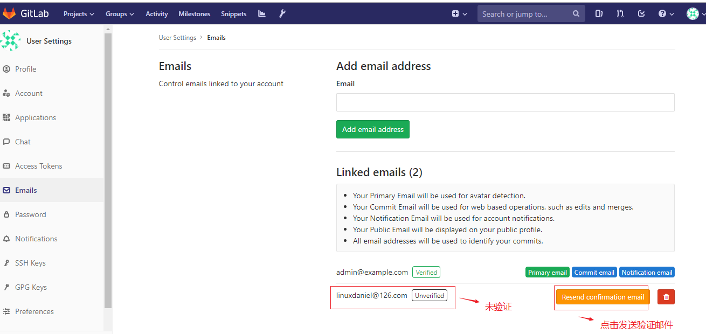
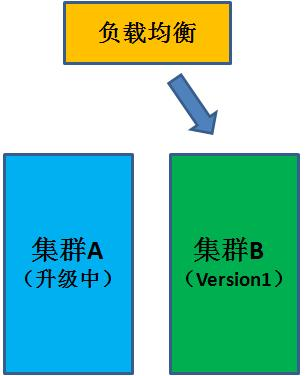

**学习目标**

- [ ] 能够使用GitHub创建远程仓库并使用

- [ ] 能够安装部署GitLab服务器

- [ ] 能够使用GitLab创建仓库并使用

- [ ] 掌握CI/CD的概念

- [ ] 掌握蓝绿部署, 滚动更新,灰度发布的概念

GitHub是目前最火的开源项目代码托管平台。它是基于web的Git仓库，提供公有仓库和私有仓库，但私有仓库是需要付费的。

GitLab可以创建免费的私有仓库。

GitLab是利用 Ruby开发的一个开源的版本管理系统，实现一个自托管的Git项目仓库，可通过Web界面进行访问公开的或者私人项目。它拥有与Github类似的功能，能够浏览源代码，管理缺陷和注释。可以管理团队对仓库的访问，它非常易于浏览提交过的版本并提供一个文件历史库。团队成员可以利用内置的简单聊天程序(Wall)进行交流。它还提供一个代码片段收集功能可以轻松实现代码复用，便于日后有需要的时候进行查找。

# github

## 注册github账号

github官网地址: https://www.github.com

登录注册账号时填写的邮箱，找到github发的邮件，打开并点击里面的Verify email address

## 创建项目

我们就创建好了第一个项目。

## 使用github远程仓库

第1步:  在gibhub上获取克隆地址

第2步:  克隆项目到本地linux,默认克隆到当前目录

~~~powershell
[root@vm1 ~]# git clone https://github.com/linux-daniel/daniel_project.git
Cloning into 'daniel_project'...
remote: Enumerating objects: 3, done.
remote: Counting objects: 100% (3/3), done.
remote: Total 3 (delta 0), reused 0 (delta 0), pack-reused 0
Unpacking objects: 100% (3/3), done.

[root@vm1 ~]# ls daniel_project/
README.md

[root@vm1 ~]# cat daniel_project/README.md 
# daniel_project
教学测试项目
~~~

第3步:  提交代码文件

~~~powershell
在克隆下来的仓库里准备一个代码文件
[root@vm1 ~]# cd daniel_project/
[root@vm1 daniel_project]# vim hello.py 
print("hello world")

[root@vm1 daniel_project]# git add hello.py
[root@vm1 daniel_project]# git commit -m "提交hello.py"
[master b59e1d6] 提交hello.py
 1 file changed, 1 insertion(+)
 create mode 100644 hello.py
~~~

第4步:   使用`git push`推送到github

~~~powershell
[root@vm1 daniel_project]# git push -u origin master
warning: push.default is unset; its implicit value is changing in
Git 2.0 from 'matching' to 'simple'. To squelch this message
and maintain the current behavior after the default changes, use:

  git config --global push.default matching

To squelch this message and adopt the new behavior now, use:

  git config --global push.default simple

See 'git help config' and search for 'push.default' for further information.
(the 'simple' mode was introduced in Git 1.7.11. Use the similar mode
'current' instead of 'simple' if you sometimes use older versions of Git)

Username for 'https://github.com': linux-daniel					这里输入你的github账号名
Password for 'https://linux-daniel@github.com': 				再输入你的github密码
Counting objects: 4, done.
Delta compression using up to 8 threads.
Compressing objects: 100% (2/2), done.
Writing objects: 100% (3/3), 302 bytes | 0 bytes/s, done.
Total 3 (delta 0), reused 0 (delta 0)
To https://github.com/linux-daniel/daniel_project.git
   2ff4805..b59e1d6  master -> master
~~~

第5步:   回到github验证

补充:

使用下面的命令可以实现https的密码缓存(下次不用再输密码了)

~~~powershell
# git config --global credential.helper store
~~~

## 免密push

免密push其实就是利用了ssh免密登录的原理:

1. 在本地产生空密码密钥对
2. 本地保留私钥，把公钥给对方
3. 实现本地到远程的免密

第1步:   开发者电脑产生ssh空密码密钥对

~~~powershell
[root@vm1 daniel_project]# ssh-keygen -t rsa -f /root/.ssh/id_rsa -C "root@daniel.cluster.com"  -N ""
~~~

第2步:  把公钥文件的内容复制到剪贴板

~~~powershell
[root@vm1 daniel_project]# cat /root/.ssh/id_rsa.pub 
ssh-rsa AAAAB3NzaC1yc2EAAAADAQABAAABAQCz2rKSMbJwvdRN5VnsaRA0ydDDtm0ruTQY0ZVsynuj15RcFuKjrlYAEF3rU2AowL7n68xWabf3lC9l6WZjLa6cibfjW1wNnroPE2kzZADSoxcAAYxKVg/wkG2j5lPC4jJRPiSLg/yCyDA7go567ShvUCH8goMXMyMzKx1eIaU2nZoLnh7ulBv4URs5jPSE9kwhQ9MnUIzihQRvz9tqURYKIzmthSkm0CyXAlT6qufTdaNp/KmoH2Idj+rXufEsLF5qHD0lKaSM4bKZvqWNhd4a6XrF9DpoeSpeI63P3ZZkVTbmTSFgbBM8+KgxvGyUxfvjimo8Ed8TY5TGA6qC+g7F root@daniel.cluster.com
~~~

第3步:  github上添加开发者的公钥

第4步: 获取ssh克隆方式地址

第5步: 开发者再git clone项目到本地

~~~powershell
[root@vm1 ~]# rm daniel_project/ -rf
[root@vm1 ~]# git clone git@github.com:linux-daniel/daniel_project.git
Cloning into 'daniel_project'...
The authenticity of host 'github.com (13.229.188.59)' can't be established.
RSA key fingerprint is SHA256:nThbg6kXUpJWGl7E1IGOCspRomTxdCARLviKw6E5SY8.
RSA key fingerprint is MD5:16:27:ac:a5:76:28:2d:36:63:1b:56:4d:eb:df:a6:48.
Are you sure you want to continue connecting (yes/no)? yes
Warning: Permanently added 'github.com,13.229.188.59' (RSA) to the list of known hosts.
remote: Enumerating objects: 6, done.
remote: Counting objects: 100% (6/6), done.
remote: Compressing objects: 100% (3/3), done.
remote: Total 6 (delta 0), reused 3 (delta 0), pack-reused 0
Receiving objects: 100% (6/6), done.
~~~

第6步:  再准备一个新的代码文件, 添加并提交

~~~powershell
[root@vm1 ~]# cd daniel_project/

我这里准备一个haha.py文件
[root@vm1 daniel_project]# cat haha.py 
print("haha")

[root@vm1 daniel_project]# git add haha.py
[root@vm1 daniel_project]# git commit -m "提交haha.py"
[master 2186bae] 提交haha.py
 1 file changed, 1 insertion(+)
 create mode 100644 haha.py
~~~

第7步:   这次再使用`git push`就会发现不需要输入账号密码了

~~~powershell
[root@vm1 daniel_project]# git push
~~~

第8步:  github上验证

**小结:**  github有两种连接方式:

1. #### Clone with HTTPS

2. #### Clone with SSH(通过ssh免密密钥对实现免密push)

## github分支(拓展)

第1步: 在github上创建一个新的dev分支

第2步: 开发者电脑的dev分支上开发，并上传到github的dev分支 (这里可以再次git clone，也可以直接在本地对应的创建dev分支,还可以git pull进行同步更新)

~~~powershell
[root@vm1 daniel_project]# git pull
[root@vm1 daniel_project]# git branch dev
[root@vm1 daniel_project]# git checkout dev
Switched to branch 'dev'
[root@vm1 daniel_project]# echo "新功能" > new.py
[root@vm1 daniel_project]# git add new.py
[root@vm1 daniel_project]# git commit -m "增加了发红包功能"
[dev 2d38f8e] 增加了发红包功能
 1 file changed, 1 insertion(+)
 create mode 100644 new.py
[root@vm1 daniel_project]# git push -u origin dev
Counting objects: 4, done.
Delta compression using up to 8 threads.
Compressing objects: 100% (2/2), done.
Writing objects: 100% (3/3), 295 bytes | 0 bytes/s, done.
Total 3 (delta 1), reused 0 (delta 0)
remote: Resolving deltas: 100% (1/1), completed with 1 local object.
To git@github.com:linux-daniel/daniel_project.git
   2186bae..2d38f8e  dev -> dev
Branch dev set up to track remote branch dev from origin.
~~~

第3步: 在github上创建pull request将dev分支的新代码merge到master分支

第4步: 验证最终效果

## 多人协作(拓展)

如果有多个开发者开发项目的话，如何代码合并呢? 下面我们来演示这样的过程

fork me on github

**clone与fork的区别:**

clone: 任何人都可以下载作者的整个项目,但非作者不能push到作者的项目里(因为没有作者的账号密码)

fork: 

* 张三fork了作者的项目,相当于可以下载作者的一个项目副本。
* 张三开发完后再上传到张三自己的账号里
* 张三请求合并到作者的账号项目里
* 作者可以同意或拒绝这个请求

第1步: 再申请一个github账号模拟第二位开发者(我这里新申请的账号为linux-daniel2)，登录后查找linux-daniel第一位开发者的项目

第2步: 第二位开发者Fork第一们开发者的项目，就会在自己的账号里得到项目代码的副本

第3步: 第二位开发者使用自己的电脑(这里我使用vm5来模拟)进行开发，然后上传

~~~powershell
[root@vm5 ~]# git clone https://github.com/linux-daniel2/daniel_project.git
Cloning into 'daniel_project'...
remote: Enumerating objects: 13, done.
remote: Counting objects: 100% (13/13), done.
remote: Compressing objects: 100% (7/7), done.
remote: Total 13 (delta 1), reused 9 (delta 1), pack-reused 0
Unpacking objects: 100% (13/13), done.

[root@vm5 ~]# cd daniel_project/

[root@vm5 daniel_project]# git branch dev
[root@vm5 daniel_project]# git checkout dev
Switched to branch 'dev'

[root@vm5 daniel_project]# echo "分享功能" > new2.py
[root@vm5 daniel_project]# git add new2.py

[root@vm5 daniel_project]# git commit -m "增加了分享功能"

[root@vm5 daniel_project]# git push -u origin dev
Username for 'https://github.com': linux-daniel2
Password for 'https://linux-daniel2@github.com':
Counting objects: 4, done.
Delta compression using up to 8 threads.
Compressing objects: 100% (2/2), done.
Writing objects: 100% (3/3), 313 bytes | 0 bytes/s, done.
Total 3 (delta 1), reused 0 (delta 0)
remote: Resolving deltas: 100% (1/1), completed with 1 local object.
To https://github.com/linux-daniel2/daniel_project.git
   2d38f8e..1c95bf2  dev -> dev
Branch dev set up to track remote branch dev from origin.
~~~

第4步: 第二位开发者确认开发的代码上传到自己的github仓库成功

第5步: 第二位开发者创建pull request将代码请求合并到第一位开发者的原项目里去

第6步: 回到第一位开发者的账号，对第二位开发者的请求进行合并确认

第7步: 因为是合并到原项目的dev分支，如果没问题的话，还需要合并到master分支。(请小伙伴们自行完成)

最终结果图如下:

步骤小结:

开发者1为项目拥有者, 开发者2帮开发者1开发新功能

1. 开发者2 Fork 开发者1的项目(相当于copy一个副本)

2. 开发者2使用git clone这个项目副本到自己的开发电脑
3. 开发者2开发新功能，并push到项目副本
4. 开发者2使用pull request将开发好的新功能请求合并到开发者1的项目仓库
5. 开发者1确认

# gitlab

## gitlab下载

## gitlab安装与配置

准备一台新虚拟机来安装(内存可适当调大点,比如1.5G)

安装

~~~powershell
[root@vm2 ~]# rpm -ivh gitlab-ce-11.8.2-ce.0.el7.x86_64.rpm
~~~

配置

~~~powershell
[root@vm2 ~]# vim /etc/gitlab/gitlab.rb
13 external_url 'http://10.1.1.12'				修改成gitlab服务器的IP地址，对外服务
~~~

初始化

~~~powershell
[root@vm2 ~]# gitlab-ctl reconfigure			
时间较久,需要3分钟左右时间，会自动帮助配置各个组件,并启动
~~~

查看状态

~~~powershell
[root@vm2 ~]# gitlab-ctl status	
run: alertmanager: (pid 10563) 36s; run: log: (pid 10234) 64s
run: gitaly: (pid 10343) 39s; run: log: (pid 9380) 163s
run: gitlab-monitor: (pid 10417) 38s; run: log: (pid 10082) 80s
run: gitlab-workhorse: (pid 10364) 39s; run: log: (pid 9835) 104s
run: logrotate: (pid 9916) 93s; run: log: (pid 9952) 90s
run: nginx: (pid 9876) 99s; run: log: (pid 9908) 96s
run: node-exporter: (pid 10399) 38s; run: log: (pid 10003) 84s
run: postgres-exporter: (pid 10585) 35s; run: log: (pid 10267) 60s
run: postgresql: (pid 9499) 158s; run: log: (pid 9562) 157s
run: prometheus: (pid 10452) 37s; run: log: (pid 10161) 70s
run: redis: (pid 9275) 170s; run: log: (pid 9296) 169s
run: redis-exporter: (pid 10426) 38s; run: log: (pid 10127) 74s
run: sidekiq: (pid 9787) 111s; run: log: (pid 9808) 110s
run: unicorn: (pid 9731) 117s; run: log: (pid 9781) 114s
~~~

## gitlab登录

设置密码(密码需要最少8位)

## gitlab设置

配置邮箱服务的用途：

* 账号注册时，邮件验证

* 有合并请求时，邮件通知

* 修改密码时，通过邮件修改

## 开发者设置ssh密钥

第1步: 在开发者电脑上产生空密码密钥

(==**注意:**== 可以直接使用上面实验的github开发者的密钥，也可以模拟新的开发者重新产生，再做一遍。这里我们再做一次)

~~~powershell
[root@vm1 ~]# ssh-keygen -t rsa -f /root/.ssh/id_rsa -C "dev1@itcast.cn" -N ""
~~~

第2步: 查看并复制公钥

~~~powershell
[root@vm1 ~]# cat /root/.ssh/id_rsa.pub 
ssh-rsa AAAAB3NzaC1yc2EAAAADAQABAAABAQDAJW+LIFdcC0DI6oM6eOf6+EPks2ODyPaR/cAWKeFcfnSvuU84ZFYtziQyJYf1RdXwxo6vH+XyBNwOGrTLB1m33RvAgUznVhBH3KA9l1OimYSqEdQJ+4g+LVDkrgj/vIRc1dv7wDglyYGOOFfRftRK/QEHK911MOyJCK1nH0rr7eE7sP33aD6I6DoIfaSC0UUDPfwHDg/bQUDsF/ez4tEPOTSeJ2jVyytArHOAjtflL1+ZvP25F4osdSXju6IG8i7HHiZ0sz1WuQEYH8KzrY/zf8DBFrnOB4vl2UTNwP/NjT06TY78gKMJqcpf1maZR3YIeYlA03ccSOWSZuqq50eP dev1@itcast.cn
~~~

第3步: 在gitlab界面添加公钥

## gitlab创建仓库

第1步: 在gitlab上创建项目(其实也就是存放代码的仓库)

第2步: 自定义项目名称，描述等

第3步: 验证创建好的项目

## 克隆远程仓库到本地

第1步: 查看gitlab上的帮助

第2步: 在开发者电脑上设置身份标识

~~~powershell
[root@vm1 ~]# git config --global user.name "daniel"
[root@vm1 ~]# git config --global user.email "daniel@itcast.cn"
[root@vm1 ~]# git clone git@10.1.1.12:root/mywebsite.git
~~~

第3步: 在开发者电脑上使用git命令clone，并上传项目

~~~powershell
[root@vm1 ~]# cd mywebsite/

[root@vm1 mywebsite]# echo "test web" > README.md
[root@vm1 mywebsite]# git add .
[root@vm1 mywebsite]# git commit -m "add README.md"

[root@vm1 mywebsite]# git push -u origin master
~~~

第4步: 验证

**小结**

git  分布式版本控制工具

github和gitlab都属于远程仓库

git clone: 把远程仓库的项目代码下载到本地

git push: 把本地的项目代码上传到远程仓库

git pull:  把远程仓库的项目代码更新到本地

远程仓库两种访问方法:

* http  
* ssh  使用空密码密钥做免密

# 持续集成(CI)

**Continuous integration,简称CI**

​       是一种软件开发实践，即团队开发成员经常集成他们的工作，通常每个成员每天至少集成一次，也就意味着每天可能会发生多次集成。每次集成都通过自动化的构建（包括编译，发布，自动化测试)来验证，从而尽快地发现集成错误。

**目的**

​        持续集成的目的不是减少build失败的次数，而是**==尽早发现问题，在最短的时间内解决问题==**，减少风险和浪费。从而让产品开发流程更加敏捷，缩短产品开发周期，在产品上线后，让用户用得更加顺畅。

​        在没有应用持续集成之前，传统的开发模式是项目一开始就划分模块，每个开发人员分别负责一个模块，等所有的代码都开发完成之后再集成到一起提交给测试人员，随着软件技术团队的发展，软件已经不能简单地通过划分模块的方式来开发，需要项目内部相互协作，划分模块这种传统的模式的弊端也越来越明显。由于很多bug在项目早期的设计、编码阶段就引入，到最后集成测试时才发现问题，开发人员需要花费大量的时间来定位bug，加上软件的复杂性，bug的定位就更难了，甚至出现不得不调整底层架构的情况。这种情况的发生不仅仅对测试进度造成影响，而且会拖长整个项目周期。

​       而持续集成可以有效解决软件开发过程中的许多问题，在集成测试阶段之前就帮助开发人员发现问题，从而可以有效的确保软件质量，减小项目的风险，使软件开发团队从容的面对各种变化。持续集成报告中可以体现目前项目进度，哪部分需要已经实现，哪些代码已经通过自动化测试，代码质量如何，让开发团队和项目组了解项目的真实状况。

​	

# 持续交付(CD)

**Continuous Delivery，简称CD**

​       持续交付是指软件开发过程，从原始需求到最终产品开发过程中，较短周期内以需求的小颗粒度（小批量）频繁提交的过程。主要指集成后的代码在类生产环境(测试环境,预发布环境等)中测试并及时反馈的过程.

**目的**

1. 开发过程的快速迭代，小步快跑，及时纠正偏离主线
2. 小颗粒度实现，避免颗粒度大，出现问题解决麻烦
3. 迅速反馈软件功能，避免方向性错误
4. 团队角色（含客户）协作密切，减少时间浪费

##持续部署

**Continuous Deployment，简称CD**

​      基于持续交付的基础上，把功能稳定，符合产品需求的版本有方法地部署至生产环境中。可以看作是持续交付的最后一环。

## 持续发布

**Continuous Release，简称CR**

​    发布是周期性或不定期地对项目在部署后，进行整体软件版本的更新，例如，更新新功能或展示页面框架等。

**目的**

1. 产品的快速迭代，小步快跑
2. 适应市场变化
3. 匹配市场策略
4. 应对市场风险

## 持续测试

**Continuous Testing,简称CT**

​       持续测试是贯穿着整个软件开发过程，验证程序员提交代码，检验合规性及降低bug,减少最终错误，实现敏捷及精益开发。

**目的**

1. 为了降低开发、部署、发布等可能出现的错误
2. 防止代码出错
3. 防止功能出错
4. 防止业务逻辑出错等

# 代码更新方法

## 蓝绿部署

海豚的秘密

大家都知道海豚是一种可爱的海洋动物。但又有多少人知道，海豚可以**永远不睡觉**。

是什么样的能力，使得海豚可以永远保持清醒呢？

依靠的是海豚大脑特殊的运作方式。

像人一样，海豚的大脑也分为左脑和右脑两个部分。

在海豚活跃的状态下，左脑和右脑都是清醒的：

当然，海豚也是血肉之躯，也是需要休息的。在海豚休息的状态下，其中一半大脑会进入睡眠，另一半大脑仍然保持清醒，以面对各种外界情况。

每隔两个小时，这种一半睡眠一半清醒的状态会进行交替，比如这一刻左脑睡眠右脑清醒，下一刻左脑清醒右脑睡眠。

这就是海豚永远不会真正睡觉的秘密。

蓝绿部署，英文名Blue Green Deployment，是一种可以保证系统在不间断提供服务的情况下上线代码的部署方式。

如何保证系统不间断提供服务呢？

蓝绿部署的模型中包含两个集群，就好比海豚的左脑和右脑。

在正常情况下（没有上线操作），集群A和集群B的代码版本是一致的，并且同时对外提供服务。

在有项目代码上线的时候，我们首先把一个集群（比如集群A）从负载列表中摘除，进行新版本的部署。集群B仍然继续提供服务。

当集群A升级完毕，我们把负载均衡重新指向集群A，再把集群B从负载列表中摘除，进行新版本的部署。集群A重新提供服务。

最后，当集群B也升级完成，我们把集群B也恢复到负载列表当中。这个时候，两个集群的版本都已经升级，并且对外的服务几乎没有间断过。

## 滚动更新

滚动更新，英文Rolling update，同样是一种可以保证系统在不间断提供服务的情况下上线代码的部署方式。

和蓝绿部署不同的是，滚动部署对外提供服务的版本并不是非此即彼，而是在更细的粒度下平滑完成版本的升级。

如何做到细粒度平滑升级版本呢？

滚动部署只需要一个集群，集群下的不同节点可以独立进行版本升级。比如在一个16节点的集群中，我们选择每次升级4个节点：

以此类推，最终所有的节点都升级了版本。

**蓝绿部署与滚动更新对比**

## 灰度发布（A/B测试、金丝雀部署）

灰度发布是指在黑与白之间，能够平滑过渡的一种发布方式。

AB test就是一种灰度发布方式，让一部分用户继续用A，一部分用户开始用B，如果用户对B没有什么反对意见，那么逐步扩大范围，把所有用户都迁移到B上面来。

灰度发布可以保证整体系统的稳定，在初始灰度的时候就可以发现、调整问题，以保证其影响度，而我们平常所说的金丝雀部署也就是灰度发布的一种方式。

灰度发布/金丝雀部署步骤：

1. 准备好部署各个阶段的工件，包括：构建工件，测试脚本，配置文件和部署清单文件。

2. 从负载均衡列表中移除掉“金丝雀”服务器。

3. 升级“金丝雀”应用（排掉原有流量并进行部署）。

4. 对应用进行自动化测试。

5. 将“金丝雀”服务器重新添加到负载均衡列表中（连通性和健康检查）。

6. 如果“金丝雀”在线使用测试成功，升级剩余的其他服务器。（否则就回滚）

除此之外灰度发布还可以设置路由权重，动态调整不同的权重来进行新老版本的验证。

>17世纪，英国矿井工人发现，金丝雀对瓦斯这种气体十分敏感。空气中哪怕有极其微量的瓦斯，金丝雀也会停止歌唱；而当瓦斯含量超过一定限度时，虽然鲁钝的人类毫无察觉，金丝雀却早已毒发身亡。当时在采矿设备相对简陋的条件下，工人们每次下井都会带上一只金丝雀作为“瓦斯检测指标”，以便在危险状况下紧急撤离。

