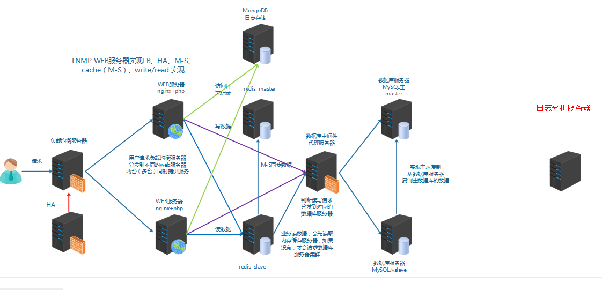
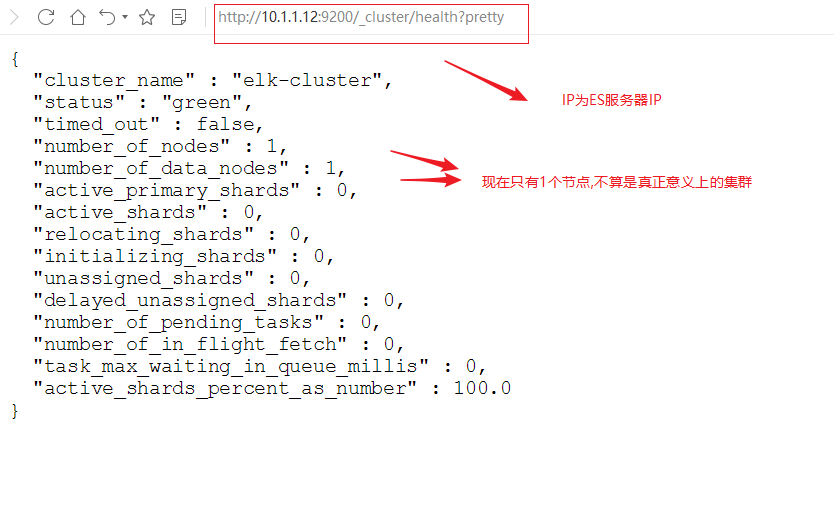

# 任务背景

运维人员需要对系统和业务日志进行精准把控，便于分析系统和业务状态。日志分布在不同的服务器上，传统的使用传统的方法依次登录每台服务器查看日志，既繁琐又效率低下。所以我们需要**==集中化==**的日志管理工具将**位于不同服务器上的日志收集到一起, 然后进行分析,展示**。

前面我们学习过rsyslog,它就可以实现集中化的日志管理，可是rsyslog集中后的日志实现统计与检索又成了一个问题。使用wc, grep, awk等相关命令可以实现统计与检索，但如果要求更高的场景，这些命令也会力不从心。所以我们需要一套专业的日志收集分析展示系统。

总结：

1、日志是用于记录系统或业务的状态

2、通过日志可以获得系统或业务的状态，并进行分析。

3、早期的日志是分散在各主机上

4、通过rsyslog实现本地日志管理，收集，轮转，集中管理

5、早期的日志分析方法：wc,grep,awk

6、集中式的日志收集、分析、展示系统

# 任务要求

1, 搭建ELK集群

2, 收集日志信息并展示

# 任务拆解

1, 认识ELK

2, 部署elasticsearch集群并了解其基本概念

3, 安装elasticsearch-head实现图形化操作

4, 安装logstash收集日志

5, 安装kibana日志展示

6, 安装file beat实现轻量级日志收集

# **学习目标**

- [ ] 能够说出ELK的应用场景

- [ ] 能够区分ELK架构中elasticsearch,logstash,kibina三个软件各自的主要功能

- [ ] 能够单机部署elasticsearch

- [ ] 能够部署elasticsearch集群

- [ ] 理解ELK中索引的概念

- [ ] 能够部署logstash

- [ ] 能够使用logstash做日志采集

# 认识ELK

ELK是一套开源的日志分析系统，由elasticsearch+logstash+Kibana组成。

官网说明:https://www.elastic.co/cn/products

首先: 先一句话简单了解E,L,K这三个软件

elasticsearch: 分布式搜索引擎

logstash: 日志收集与过滤，输出给elasticsearch

Kibana: 图形化展示

elk下载地址:https://www.elastic.co/cn/downloads

环境准备:

四台机器(**内存建议大于1G，比如1.5G; filebeat服务器可为1G**) :

1,静态IP(要求能上公网,最好用虚拟机的NAT网络类型上网)

2,主机名及主机名绑定

~~~powershell
10.1.1.11	vm1.cluster.com		kibana
10.1.1.12	vm2.cluster.com		elasticsearch
10.1.1.13	vm3.cluster.com		logstash
10.1.1.14	vm4.cluster.com		filebeat
~~~

3, 关闭防火墙和selinux

~~~powershell
# systemctl stop firewalld
# systemctl disable firewalld
# iptables -F
# setenforce 0
setenforce: SELinux is disabled
~~~

4, 时间同步

~~~powershell
# systemctl restart ntpd
# systemctl enable ntpd
~~~

5, yum源(centos安装完系统后的默认yum源就OK)

# elasticsearch

## elasticsearch简介

Elasticsearch(简称ES)是一个**开源的分布式搜索引擎**,Elasticsearch还是一个**分布式文档数据库**。所以它提供了大量数据的**存储**功能,快速的**搜索**与**分析**功能。

提到搜索,大家肯定就想到了百度,谷歌,必应等。当然也有如下的搜索场景。

## elasticsearch部署

第1步: 在elasticsearch服务器上(我这里为vm2),确认jdk(使用系统自带的**openjdk**就OK)

~~~powershell
[root@vm2 ~]# rpm -qa |grep openjdk
java-1.8.0-openjdk-headless-1.8.0.161-2.b14.el7.x86_64
java-1.8.0-openjdk-1.8.0.161-2.b14.el7.x86_64
[root@vm2 ~]# java -version
openjdk version "1.8.0_161"
OpenJDK Runtime Environment (build 1.8.0_161-b14)
OpenJDK 64-Bit Server VM (build 25.161-b14, mixed mode)
~~~

第2步: es的安装,配置

~~~powershell
[root@vm2 ~]# wget https://artifacts.elastic.co/downloads/elasticsearch/elasticsearch-6.5.2.rpm
[root@vm2 ~]# rpm -ivh elasticsearch-6.5.2.rpm
~~~

第3步: 单机es的配置与服务启动

~~~powershell
[root@vm2 ~]# cat /etc/elasticsearch/elasticsearch.yml |grep -v "#"
cluster.name: elk-cluster	可以自定义一个集群名称,不配置的话默认会取名为elasticsearch
path.data: /var/lib/elasticsearch
path.logs: /var/log/elasticsearch
network.host: 0.0.0.0							打开注释,并修改为监听所有
http.port: 9200									打开注释,监听端口9200

[root@vm2 ~]# systemctl start elasticsearch
[root@vm2 ~]# systemctl enable elasticsearch

启动有点慢和卡,稍等1分钟左右,查看到以下端口则表示启动OK
[root@vm2 ~]# netstat -ntlup |grep java
tcp6       0      0 :::9200                 :::*                    LISTEN      5329/java           
tcp6       0      0 :::9300                 :::*                    LISTEN      5329/java

9200则是数据传输端口
9300端口是集群通信端口(我们暂时还没有配置集群,现在是单点elasticsearch)
~~~

第4步: 查看状态

使用curl命令或浏览器访问http://10.1.1.12:9200/_cluster/health?pretty地址(IP为ES服务器IP)

~~~powershell
[root@vm2 ~]# curl http://10.1.1.12:9200/_cluster/health?pretty
~~~

## elasticsearch集群部署

集群部署主要注意以下几个方面

1. 集群配置参数：		

   * discovery.zen.ping.unicast.hosts，Elasticsearch默认使用Zen Discovery来做节点发现机制，推荐使用unicast来做通信方式，在该配置项中列举出Master节点。

   * discovery.zen.minimum_master_nodes，该参数表示集群中Master节点可工作Master的最小票数，默认值是1。为了提高集群的可用性，避免脑裂现象。官方推荐设置为(N/2)+1，其中N是具有Master资格的节点的数量。

   * discovery.zen.ping_timeout，表示节点在发现过程中的等待时间，默认值是30秒，可以根据自身网络环境进行调整，一定程度上提供可用性。

2. 集群节点: 

   * 节点类型主要包括Master节点和data节点(client节点和ingest节点不讨论)。通过设置两个配置项node.master和node.data为true或false来决定将一个节点分配为什么类型的节点。
   * 尽量将Master节点和Data节点分开，通常Data节点负载较重，需要考虑单独部署。

3. 内存:
   * Elasticsearch默认设置的内存是1GB，对于任何一个业务部署来说，这个都太小了。通过指定ES_HEAP_SIZE环境变量，可以修改其堆内存大小，服务进程在启动时候会读取这个变量，并相应的设置堆的大小。建议设置系统内存的一半给Elasticsearch，但是不要超过32GB。

4. 硬盘空间:
   * Elasticsearch默认将数据存储在/var/lib/elasticsearch路径下，随着数据的增长，一定会出现硬盘空间不够用的情形，大环境建议把分布式存储挂载到/var/lib/elasticsearch目录下以方便扩容。

配置参考文档: https://www.elastic.co/guide/en/elasticsearch/reference/index.html

首先在ES集群所有节点都安装ES(步骤省略)

可以使用两台或两台以上ES做集群, 以下就是两台ES做集群的配置

~~~powershell
[root@vm1 ~]# cat /etc/elasticsearch/elasticsearch.yml |grep -v "#"
cluster.name: elk-cluster
node.name: 10.1.1.11					本机IP或主机名
node.master: false						指定不为master节点
path.data: /var/lib/elasticsearch
path.logs: /var/log/elasticsearch
network.host: 0.0.0.0
http.port: 9200
discovery.zen.ping.unicast.hosts: ["10.1.1.11", "10.1.1.12"]		集群所有节点IP
~~~

~~~powershell
[root@vm2 ~]# cat /etc/elasticsearch/elasticsearch.yml |grep -v "#"
cluster.name: elk-cluster
node.name: 10.1.1.12					本机IP或主机名
node.master: true						指定为master节点
path.data: /var/lib/elasticsearch
path.logs: /var/log/elasticsearch
network.host: 0.0.0.0
http.port: 9200
discovery.zen.ping.unicast.hosts: ["10.1.1.11", "10.1.1.12"]		集群所有节点IP
~~~

启动或重启服务

~~~powershell
[root@vm1 ~]# systemctl restart elasticsearch
[root@vm1 ~]# systemctl enable elasticsearch
[root@vm2 ~]# systemctl restart elasticsearch
~~~

查看状态

**json(java script object notation)java对象表示法**

## elasticsearch基础概念

主要的基础概念有:Node, Index,Type,Document,Field,shard和replicas.

Node(节点)：运行单个ES实例的服务器

Cluster(集群)：一个或多个节点构成集群

Index(索引)：索引是多个文档的集合

Type(类型)：一个Index可以定义一种或多种类型，将Document逻辑分组

Document(文档)：Index里每条记录称为Document，若干文档构建一个Index

Field(字段)：ES存储的最小单元

Shards(分片)：ES将Index分为若干份，每一份就是一个分片

Replicas(副本)：Index的一份或多份副本

为了便于理解,我们和mysql这种关系型数据库做一个对比:

| 关系型数据库(如mysql,oracle等) | elasticsearch |
| ------------------------------ | ------------- |
| database或schema               | index         |
| table                          | type          |
| row                            | document      |
| column或field                  | field         |

ES是分布式搜索引擎，每个索引有一个或多个分片(shard)，索引的数据被分配到各个分片上。你可以看作是一份数据分成了多份给不同的节点。

当ES集群增加或删除节点时,shard会在多个节点中均衡分配。默认是5个primary shard(主分片)和1个replica shard(副本,用于容错)。

## elaticsearch基础API操作

前面我们通过http://10.1.1.12:9200/_cluster/health?pretty查看ES集群状态,其实就是它的一种API操作。

> 什么是API?
>
> API(Application Programming Interface)**应用程序编程接口**,就是无需访问程序源码或理解内部工作机制就能实现一些相关功能的接口。

### **RestFul API 格式**

~~~shell
curl -X<verb> ‘<protocol>://<host>:<port>/<path>?<query_string>’-d ‘<body>’
~~~

|   **参数**   | **描述**                                              |
| :----------: | ----------------------------------------------------- |
|     verb     | HTTP方法，比如GET、POST、PUT、HEAD、DELETE            |
|     host     | ES集群中的任意节点主机名                              |
|     port     | ES   HTTP服务端口，默认9200                           |
|     path     | 索引路径                                              |
| query_string | 可选的查询请求参数。例如?pretty参数将返回JSON格式数据 |
|      -d      | 里面放一个GET的JSON格式请求主体                       |
|     body     | 自己写的 JSON格式的请求主体                           |

elasticseearch的API很多, 我们运维人员主要用到以下几个要介绍的较简单的API。

更多API参考: https://www.elastic.co/guide/en/elasticsearch/reference/6.2/index.html

### 查看节点信息

通过curl或浏览器访问http://10.1.1.12:9200/_cat/nodes?v(ip为ES节点IP,如果有ES集群,则为ES任意节点IP)

~~~powershell
[root@vm2 ~]# curl http://10.1.1.12:9200/_cat/nodes?v
ip        heap.percent ram.percent cpu load_1m load_5m load_15m node.role master name
10.1.1.12           29          94   2    2.33    1.88     0.85 mdi       -      10.1.1.12
10.1.1.11           26          92   0    0.24    0.37     0.33 mdi       *      10.1.1.11
~~~

### **查看索引信息**

通过curl或浏览器访问http://10.1.1.12:9200/_cat/indices?v

~~~powershell
[root@vm2 ~]# curl http://10.1.1.12:9200/_cat/indices?v
health status index uuid pri rep docs.count docs.deleted store.size pri.store.size
默认现在没有任何索引
~~~

### **新增索引**

~~~powershell
[root@vm2 ~]# curl -X PUT http://10.1.1.12:9200/nginx_access_log
{"acknowledged":true,"shards_acknowledged":true,"index":"nginx_access_log"}

[root@vm2 ~]# curl  http://10.1.1.12:9200/_cat/indices?v
health status index            uuid                   pri rep docs.count docs.deleted store.size pri.store.size
green  open   nginx_access_log 90Z7DvInTz6seXMBYhHVAw   5   1          0            0      2.2kb          1.1kb
         460b
~~~

green：所有的主分片和副本分片都已分配。你的集群是100%可用的。

yellow：所有的主分片已经分片了，但至少还有一个副本是缺失的。不会有数据丢失，所以搜索结果依然是完整的。不过，你的高可用性在某种程度上被弱化。如果 更多的 分片消失，你就会丢数据了。把 yellow 想象成一个需要及时调查的警告。

red：至少一个主分片（以及它的全部副本）都在缺失中。这意味着你在缺少数据：搜索只能返回部分数据，而分配到这个分片上的写入请求会返回一个异常。

---------------------

### **删除索引**

~~~powershell
[root@vm2 ~]# curl -X DELETE http://10.1.1.12:9200/nginx_access_log
{"acknowledged":true}
~~~

## **ES查询语句**（拓展了解）

ES提供一种可用于执行查询JSON式的语言，被称为Query DSL。

> 针对elasticsearch的操作，可以分为增、删、改、查四个动作。

**查询匹配条件：**

- match_all
- from,size
- match
- bool
- range

**查询应用案例：**

导入数据源

使用官方提供的示例数据：

1, 下载并导入进elasticsearch

~~~powershell
[root@vm2 ~]# wget https://raw.githubusercontent.com/elastic/elasticsearch/master/docs/src/test/resources/accounts.json

导入进elasticsearch
[root@vm2 ~]# curl -H "Content-Type: application/json" -XPOST "10.1.1.12:9200/bank/_doc/_bulk?pretty&refresh" --data-binary "@accounts.json"

查询确认
[root@vm2 ~]# curl "10.1.1.12:9200/_cat/indices?v"
health status index      uuid                   pri rep docs.count docs.deleted store.size pri.store.size
green  open   bank       CzFQ_Gu1Qr2-bpV5MF0OBg   5   1       1000            0    874.7kb        434.4kb
~~~

2, 查询bank索引的数据(**使用查询字符串进行查询**)

~~~powershell
[root@vm2 ~]# curl -X GET "10.1.1.12:9200/bank/_search?q=*&sort=account_number:asc&pretty"

说明:
默认结果为10条
_search  属于一类API，用于执行查询操作
q=* ES批量索引中的所有文档
sort=account_number:asc 表示根据account_number按升序对结果排序
pretty调整显示格式
~~~

3, 查询bank索引的数据 (**使用json格式进行查询**)

~~~powershell
[root@vm2 ~]# curl -X GET "10.1.1.12:9200/bank/_search" -H 'Content-Type: application/json' -d'
{
  "query": { "match_all": {} },
  "sort": [
    { "account_number": "asc" }
  ]
}
'
注意: 最后为单引号
~~~

问题: 怎么将上面json格式进行pretty查询?

**查询匹配动作及案例：**

- match_all
  - 匹配所有文档。默认查询
  - 示例：查询所有，默认只返回10个文档

~~~shell
[root@vm2 ~]# curl -X GET "10.1.1.12:9200/bank/_search?pretty" -H 'Content-Type: application/json' -d'
{
  "query": { "match_all": {} }
}
'

# query告诉我们查询什么
# match_all是我们查询的类型
# match_all查询仅仅在指定的索引的所有文件进行搜索
~~~

- from，size
  - 除了query参数外，还可以传递其他参数影响查询结果，比如前面提到的sort，接下来使用的size

~~~powershell
[root@vm2 ~]# curl -X GET "10.1.1.12:9200/bank/_search?pretty" -H 'Content-Type: application/json' -d'
{
  "query": { "match_all": {} },
  "size": 1
}
'
查询1条数据
~~~

指定位置与查询条数

~~~powershell
[root@vm2 ~]# curl -X GET "10.1.1.12:9200/bank/_search?pretty" -H 'Content-Type: application/json' -d'
{
  "query": { "match_all": {} },
  "from": 0,								
  "size": 2
}
'
from 0表示从第1个开始
size 指定查询的个数
~~~

示例: 查询account_number从第501条到510条的数据

~~~powershell
curl -X GET "10.1.1.12:9200/bank/_search?pretty" -H 'Content-Type: application/json' -d'
{
  "query": { "match_all": {} },
  "from": 500,
  "size": 10,
  "sort": [
    { "account_number": "asc" }
  ]
}
' 2>/dev/null |grep account_number
~~~

- 匹配查询字段
  - 返回_source字段中的片段字段

~~~powershell
[root@vm2 ~]# curl -X GET "10.1.1.12:9200/bank/_search?pretty" -H 'Content-Type: application/json' -d'
{
  "query": { "match_all": {} },
  "_source": ["account_number", "balance"]
}
'
~~~

- match
  - 基本搜索查询，针对特定字段或字段集合进行搜索

查询编号为20的账户

~~~powershell
[root@vm2 ~]# curl -X GET "10.1.1.12:9200/bank/_search?pretty" -H 'Content-Type: application/json' -d'
{
  "query": { "match": { "account_number": 20 } }
}
'
~~~

返回地址中包含mill的账户

~~~powershell
[root@vm2 ~]# curl -X GET "10.1.1.12:9200/bank/_search?pretty" -H 'Content-Type: application/json' -d'
{
  "query": { "match": { "address": "mill" } }
}
'
~~~

返回地址有包含mill或lane的所有账户

~~~powershell
[root@vm2 ~]# curl -X GET "10.1.1.12:9200/bank/_search?pretty" -H 'Content-Type: application/json' -d'
{
  "query": { "match": { "address": "mill lane" } }			# 空格就是或的关系
}
'
~~~

- bool

~~~powershell
bool must 查询的字段必须同时存在
查询包含mill和lane的所有账户

[root@vm2 ~]# curl -X GET "10.1.1.12:9200/bank/_search?pretty" -H 'Content-Type: application/json' -d'
{
  "query": {
    "bool": {
      "must": [
        { "match": { "address": "mill" } },
        { "match": { "address": "lane" } }
      ]
    }
  }
}
'

bool should 查询的字段仅存在一即可
查询包含mill或lane的所有账户

[root@vm2 ~]# curl -X GET "10.1.1.12:9200/bank/_search?pretty" -H 'Content-Type: application/json' -d'
{
  "query": {
    "bool": {
      "should": [
        { "match": { "address": "mill" } },
        { "match": { "address": "lane" } }
      ]
    }
  }
}
'
~~~

- range
  - 指定区间内的数字或者时间
  - 操作符：gt大于，gte大于等于，lt小于，lte小于等于

~~~powershell
查询余额大于或等于20000且小于等于30000的账户

[root@vm2 ~]# curl -X GET "10.1.1.12:9200/bank/_search?pretty" -H 'Content-Type: application/json' -d'
{
  "query": {
    "bool": {
      "must": { "match_all": {} },
      "filter": {
        "range": {
          "balance": {
            "gte": 20000,
            "lte": 30000
          }
        }
      }
    }
  }
}
'
~~~

## elasticsearch-head

elasticsearch-head是集群管理、数据可视化、增删改查、查询语句可视化工具。从ES5版本后安装方式和ES2以上的版本有很大的不同,在ES2中可以直接在bin目录下执行plugin install xxxx 来进行安装,但是在ES5中这种安装方式变了,要想在ES5中安装Elasticsearch Head必须要安装NodeJs,然后通过NodeJS来启动Head。

官网地址:https://github.com/mobz/elasticsearch-head

### elasticsearch-head安装

**第1步: 下载相关软件并上传到服务器**

官网有安装说明,可以通过git安装,也可以下载zip包解压安装

下载相应的软件包,并拷贝到ES集群的一个节点上(我这里拷贝到10.1.1.12这台,也就是vm2上)

nodejs下载页面: https://nodejs.org/en/download/

**第2步: 安装nodejs**

~~~powershell
[root@vm2 ~]# tar xf node-v10.15.0-linux-x64.tar.xz -C /usr/local/
[root@vm2 ~]# mv /usr/local/node-v10.15.0-linux-x64/ /usr/local/nodejs/
[root@vm2 ~]# ls /usr/local/nodejs/bin/npm 
/usr/local/nodejs/bin/npm				确认有此命令
[root@vm2 ~]# ln -s /usr/local/nodejs/bin/npm /bin/npm
[root@vm2 ~]# ln -s /usr/local/nodejs/bin/node /bin/node
~~~

**第3步: 安装es-head**

安装方法1(需要网速好):

~~~powershell
[root@vm2 ~]# git clone git://github.com/mobz/elasticsearch-head.git
[root@vm2 ~]# cd elasticsearch-head

先使用npm安装grunt
npm(node package manager):node包管理工具,类似yum
Grunt是基于Node.js的项目构建工具
[root@vm2 elasticsearch-head]# npm install -g grunt-cli

安装时间较久,还会在网上下载phantomjs包
[root@vm2 elasticsearch-head]# npm install			
~~~

安装可能有很多错误,我这里出现了下面的错误(**重点是注意红色的ERR!,黄色的WARN不用管**)

**解决方法:**

~~~powershell
[root@vm2 elasticsearch-head]# npm install phantomjs-prebuilt@2.1.16 --ignore-script
此命令执行后不用再返回去执行npm install了，直接开始启动

[root@vm2 elasticsearch-head]# nohup npm run start &
~~~

安装方法二 : (**==网速特别慢导致安装时间过长的话可以尝试以下方法==**)

~~~powershell
git clone慢的话就使用下载好的zip压缩包解压安装
[root@vm2 ~]# unzip elasticsearch-head-master.zip -d /usr/local/
[root@vm2 ~]# mv /usr/local/elasticsearch-head-master/ /usr/local/es-head/
[root@vm2 ~]# cd /usr/local/es-head/
[root@vm2 es-head]# npm install -g grunt-cli --registry=http://registry.npm.taobao.org

[root@vm2 es-head]# npm install --registry=http://registry.npm.taobao.org
当安装出现下载phantomjs软件包特别慢的时候，可以ctrl+c取消，拷贝下载好的phantomjs包到特定位置再重新安装
[root@vm2 es-head]# cp phantomjs-2.1.1-linux-x86_64.tar.bz2 /tmp/phantomjs/
注意：phantomjs请改成自己的绝对路径
[root@vm2 es-head]# npm install --registry=http://registry.npm.taobao.org

[root@vm2 es-head]# nohup npm run start &
~~~

==**注意: 运行`nohup npm run start &`必须要先cd到es-head的目录**==

**第4步:浏览器访问** 

浏览器访问`http://es-head节点IP:9100` ,并在下面的地址里把localhost改为es-head节点IP(**浏览器与es-head不是同一节点就要做**)

**第5步: 修改ES集群配置文件,并重启服务**

~~~powershell
[root@vm1 ~]# cat /etc/elasticsearch/elasticsearch.yml |grep -v "#"
cluster.name: elk-cluster
node.name: 10.1.1.11
node.master: false
path.data: /var/lib/elasticsearch
path.logs: /var/log/elasticsearch
network.host: 0.0.0.0
http.port: 9200
discovery.zen.ping.unicast.hosts: ["10.1.1.11", "10.1.1.12"]
http.cors.enabled: true
http.cors.allow-origin: "*"					加上最后这两句

[root@vm2 ~]# cat /etc/elasticsearch/elasticsearch.yml |grep -v "#"
cluster.name: elk-cluster
node.name: 10.1.1.12
node.master: true
path.data: /var/lib/elasticsearch
path.logs: /var/log/elasticsearch
network.host: 0.0.0.0
http.port: 9200
discovery.zen.ping.unicast.hosts: ["10.1.1.11", "10.1.1.12"]
http.cors.enabled: true
http.cors.allow-origin: "*"					加上最后这两句

[root@vm1 ~]# systemctl restart elasticsearch
[root@vm2 ~]# systemctl restart elasticsearch
~~~

**第6步: 再次连接就可以看到信息了**

**新建个索引试试**

**删除此索引**

### es-head查询验证

# logstash

## logstash简介

logstash是一个开源的数据采集工具,通过数据源采集数据.然后进行过滤,并自定义格式输出到目的地。

数据分为:

1. 结构化数据  如:mysql数据库里的表等
2. 半结构化数据  如: xml,yaml,json等
3. 非结构化数据 如:文档,图片,音频,视频等 

logstash可以采集任何格式的数据,当然我们这里主要是讨论采集系统日志,服务日志等日志类型数据。

官方产品介绍:https://www.elastic.co/cn/products/logstash

input插件:  用于导入日志源 (**==配置必须==**) 

<https://www.elastic.co/guide/en/logstash/current/input-plugins.html>

filter插件:  用于过滤(**==不是配置必须的==**)

https://www.elastic.co/guide/en/logstash/current/filter-plugins.html

output插件:  用于导出(**==配置必须==**) 

https://www.elastic.co/guide/en/logstash/current/output-plugins.html

## logstash部署

在logstash服务器上确认openjdk安装

~~~powershell
[root@vm3 ~]# java -version
openjdk version "1.8.0_161"
OpenJDK Runtime Environment (build 1.8.0_161-b14)
OpenJDK 64-Bit Server VM (build 25.161-b14, mixed mode)
~~~

在logstash服务器上安装logstash

~~~powershell
[root@vm3 ~]# wget https://artifacts.elastic.co/downloads/logstash/logstash-6.5.2.rpm
[root@vm3 ~]# rpm -ivh logstash-6.5.2.rpm 
~~~

配置logstash主配置文件

~~~powershell
[root@vm3 ~]# cat /etc/logstash/logstash.yml |grep -v '#' |grep -v '^$'
path.data: /var/lib/logstash
path.config: /etc/logstash/conf.d/					打开注释,并加上配置目录路径
http.host: "10.1.1.13"	打开注释,并改为本机IP(这是用于xpack监控用,但要收费,所以在这里不配置也可以)
path.logs: /var/log/logstash
~~~

启动测试

~~~powershell
[root@vm3 ~]# cd /usr/share/logstash/bin
使用下面的空输入和空输出启动测试一下
[root@vm3 bin]# ./logstash -e 'input {stdin {}} output {stdout {}}'
运行后，输入字符将被stdout做为标准输出内容输出
~~~

关闭启动

测试能启动成功后,ctrl+c取消,则关闭了

**另一种验证方法：**

~~~powershell
#上述测试还可以使用如下方法进行：
[root@vm3]# vim /etc/logstash/conf.d/test.conf

input {
        stdin {
        }
}

filter {
}

output {
        stdout {
                codec => rubydebug				
        }
}

[root@vm3 bin]# pwd
/usr/share/logstash/bin

[root@vm3 bin]# ./logstash --path.settings /etc/logstash -f /etc/logstash/conf.d/test.conf -t
......
Config Validation Result: OK. Exiting Logstash

--path.settings 指定logstash主配置文件目录
-f 指定片段配置文件
-t 测试配置文件是否正确
codec => rubydebug这句可写可不定,默认就是这种输出方式
~~~

~~~powershell
[root@vm3 bin]# ./logstash --path.settings /etc/logstash -r -f /etc/logstash/conf.d/test.conf
......

haha
{
    "@timestamp" => 2019-07-02T10:40:10.839Z,
       "message" => "haha",
          "host" => "vm3.cluster.com",
      "@version" => "1"
}
hehe
{
    "@timestamp" => 2019-07-02T10:40:11.794Z,
       "message" => "hehe",
          "host" => "vm3.cluster.com",
      "@version" => "1"
}

-r参数很强大,会动态装载配置文件,也就是说启动后,可以不用重启修改配置文件
~~~

## 日志采集

### 采集messages日志

这里以/var/log/messages为例,只定义input输入和output输出,不考虑过滤

~~~powershell
[root@vm3 bin]# vim /etc/logstash/conf.d/test.conf
input {
    file {
        path => "/var/log/messages"
        start_position => "beginning"
    }
}

output {
    elasticsearch{
        hosts => ["10.1.1.12:9200"]
        index => "test-%{+YYYY.MM.dd}"
    }
}

[root@vm3 bin]# ./logstash --path.settings /etc/logstash/ -r -f /etc/logstash/conf.d/test.conf  &

后台运行如果要杀掉,请使用pkill java或ps查看PID再kill -9清除
~~~

通过浏览器访问es-head验证   

**请自行练习验证**:

1, 在logstash那台服务器上做一些操作(比如,重启下sshd服务),  让/var/log/message有新的日志信息，然后验证es-head里的数据。

结果: 会自动更新, 浏览器刷新就能在es-head上看到更新的数据。

2, kill掉logstash进程(相当于关闭), 也做一些操作让/var/log/message日志有更新，然后再次启动logstash。

结果: 会自动连上es集群, es-head里也能查看到数据的更新。

### 采集多日志源

~~~powershell
[root@vm3 bin]# vim /etc/logstash/conf.d/test.conf

input {
        file {
                path => "/var/log/messages"
                start_position => "beginning"
                type => "messages"
        }

        file {
                path => "/var/log/yum.log"
                start_position => "beginning"
                type => "yum"
        }
}

filter {

}

output {
        if [type] == "messages" {
        elasticsearch {
                hosts => ["10.1.1.12:9200","10.1.1.11:9200"]
                index => "messages-%{+YYYY-MM-dd}"
                }
        }

        if [type] == "yum" {
        elasticsearch {
                hosts => ["10.1.1.12:9200","10.1.1.11:9200"]
                index => "yum-%{+YYYY-MM-dd}"
                }
        }
}
~~~

