**学习目标**

- [ ] 能够部署kibana并连接elasticsearch集群

- [ ] 能够通过kibana查看elasticsearch索引信息

- [ ] 知道用filebeat收集日志相对于logstash的优点

- [ ] 能够安装filebeat

- [ ] 能够使用filebeat收集日志并传输给logstash

# kibana

## kibana介绍

Kibana是一个开源的可视化平台,可以为ElasticSearch集群的管理提供友好的Web界面,帮助汇总,分析和搜索重要的日志数据。

文档路径: https://www.elastic.co/guide/en/kibana/current/setup.html

## kibana部署

第1步: 在kibana服务器(我这里是VM1)上安装kibana

~~~powershell
[root@vm1 ~]# wget https://artifacts.elastic.co/downloads/kibana/kibana-6.5.2-x86_64.rpm
[root@vm1 ~]# rpm -ivh kibana-6.5.2-x86_64.rpm 
~~~

第2步: 配置kibana

~~~powershell
[root@vm1 ~]# cat /etc/kibana/kibana.yml |grep -v '#' |grep -v '^$'
server.port: 5601								端口
server.host: "0.0.0.0"							监听所有,允许所有人能访问
elasticsearch.url: "http://10.1.1.12:9200"		ES集群的路径
logging.dest: /var/log/kibana.log				我这里加了kibana日志,方便排错与调试

日志要自己建立,并修改owner和group属性
[root@vm1 ~]# touch /var/log/kibana.log
[root@vm1 ~]# chown kibana.kibana /var/log/kibana.log
~~~

第3步: 启动kibana服务

~~~powershell
[root@vm1 ~]# systemctl start kibana
[root@vm1 ~]# systemctl enable kibana

[root@vm1 ~]# lsof -i:5601
COMMAND   PID   USER   FD   TYPE DEVICE SIZE/OFF NODE NAME
node    10420 kibana   11u  IPv4 111974      0t0  TCP *:esmagent (LISTEN)
~~~

第4步: 通过浏览器访问 **http://kibana服务器IP:5601**

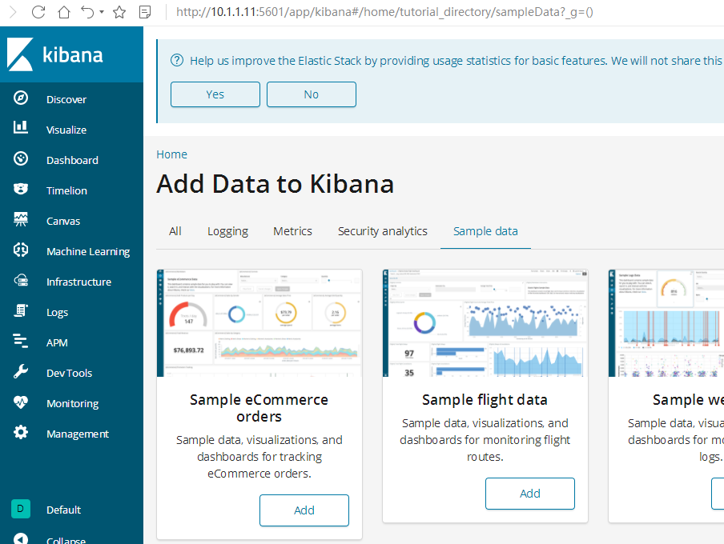

## kibana汉化

https://github.com/anbai-inc/Kibana_Hanization/

~~~powershell
[root@vm1 ~]# wget https://github.com/anbai-inc/Kibana_Hanization/archive/master.zip

[root@vm1 ~]# unzip Kibana_Hanization-master.zip -d /usr/local
[root@vm1 ~]# cd /usr/local/Kibana_Hanization-master/

这里要注意:1,要安装python; 2,rpm版的kibana安装目录为/usr/share/kibana/
[root@vm1 Kibana_Hanization-master]# python main.py /usr/share/kibana/

汉化完后需要重启
[root@vm1 Kibana_Hanization-master]# systemctl stop kibana
[root@vm1 Kibana_Hanization-master]# systemctl start kibana
~~~

再次通过浏览器访问  **http://kibana服务器IP:5601**

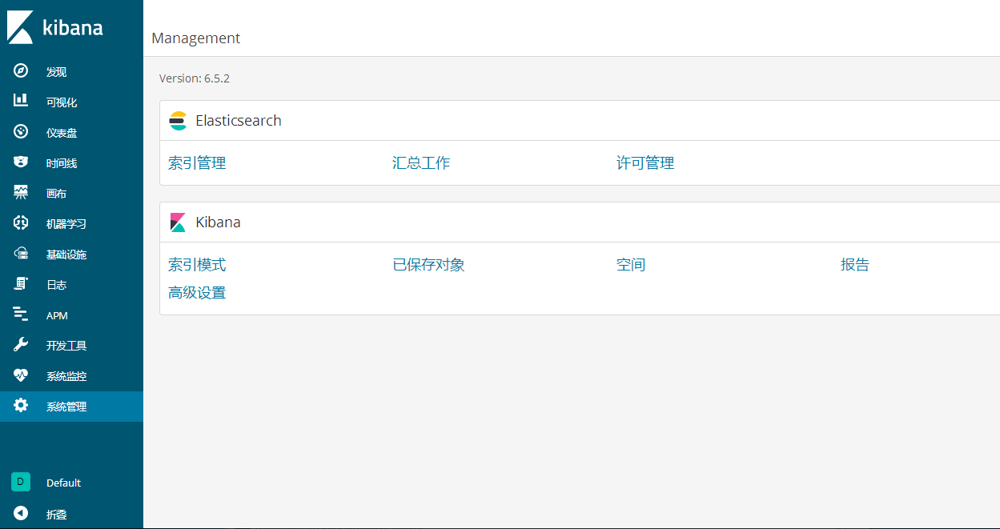

### 通过kibana查看集群信息

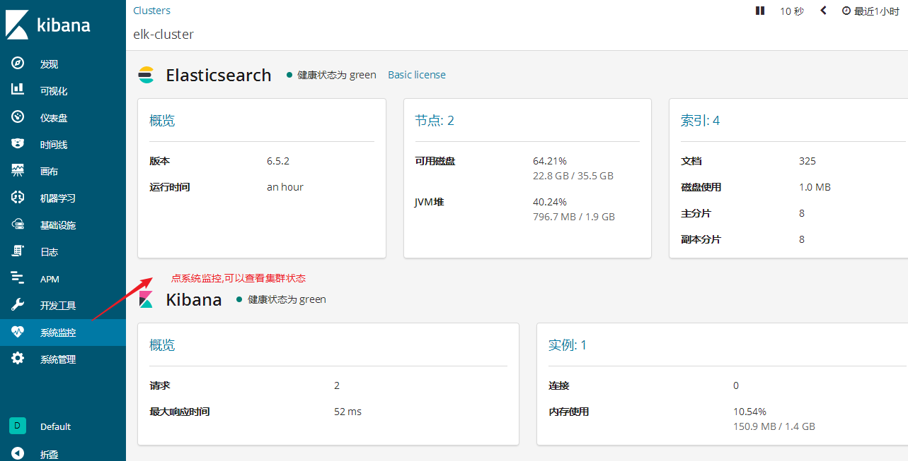

### 通过kibana查看logstash收集的日志索引

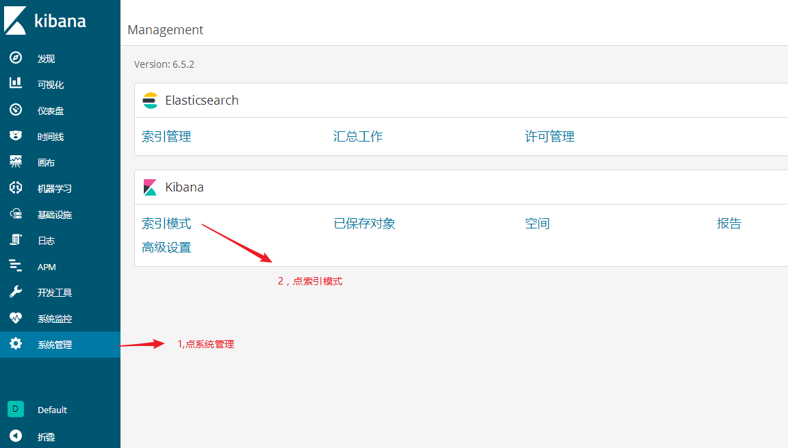

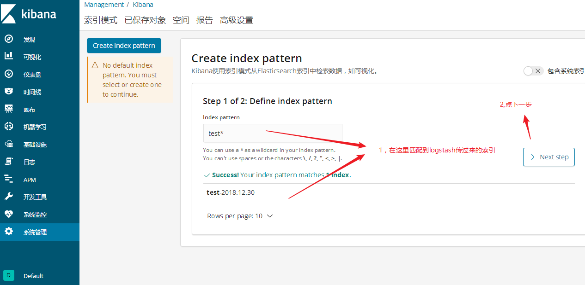

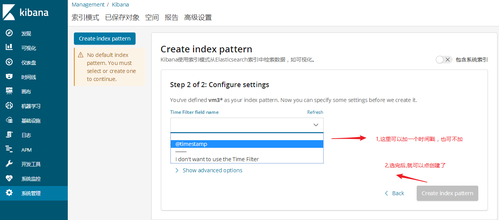

最后点发现查看

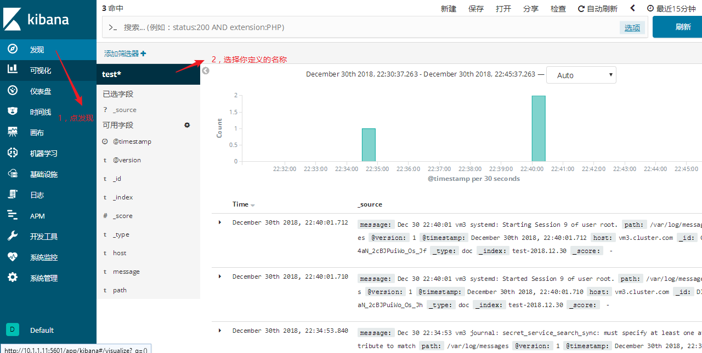

### 通过kibana做可视化图形

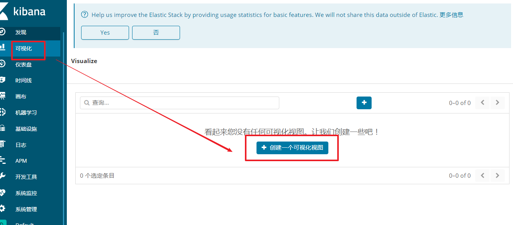

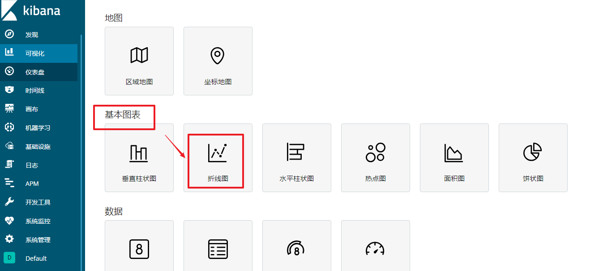

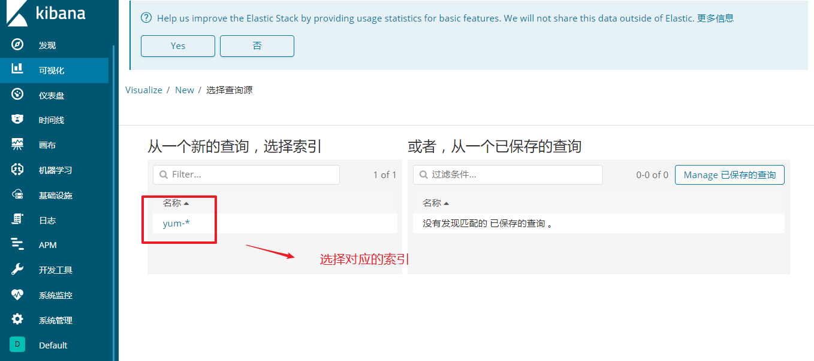

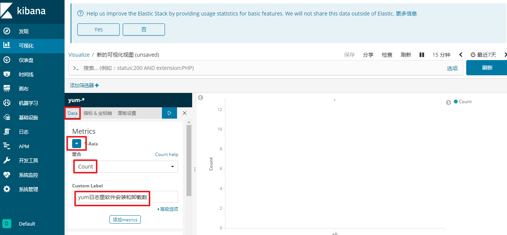

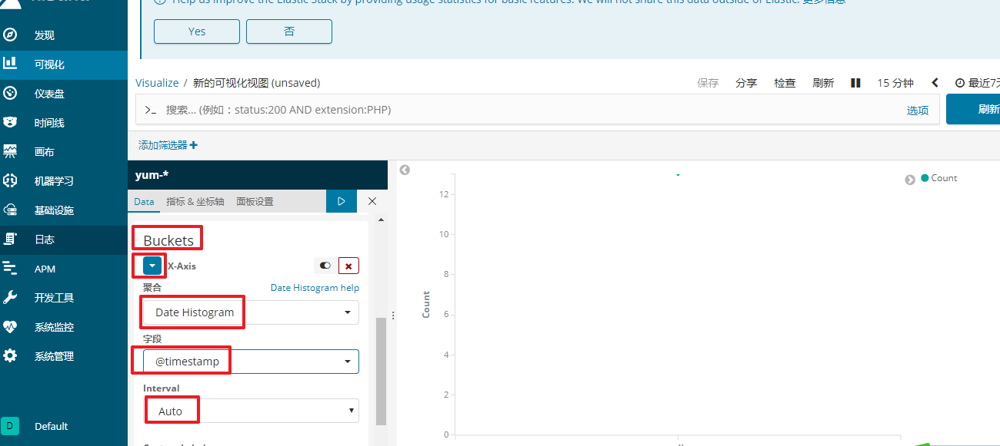

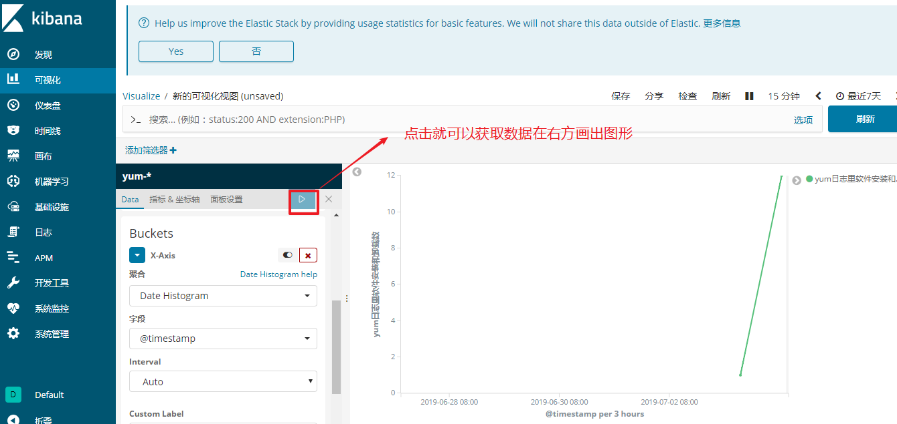

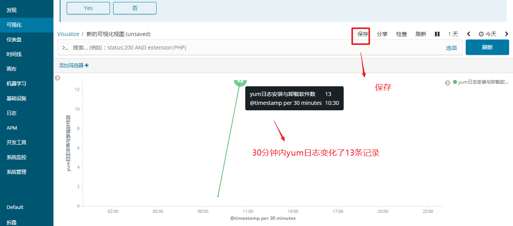

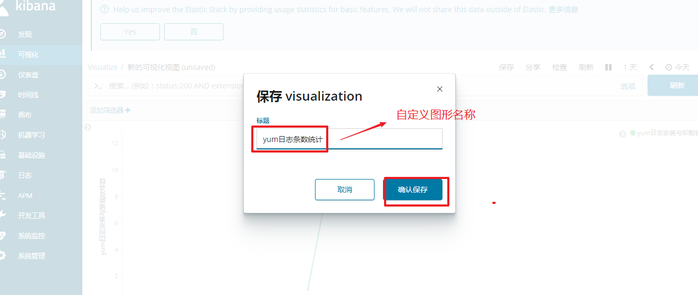

# filebeat

因为**logstash消耗内存等资源太高**,如果在要采集的服务上都安装logstash,这样对应用服务器的压力增加。所以我们要用**轻量级**的采集工具才更高效,更省资源。

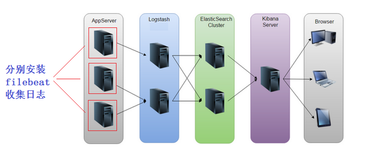

beats是轻量级的日志收集处理工具，Beats占用资源少

* Packetbeat： 网络数据（收集网络流量数据）
* Metricbeat： 指标 （收集系统、进程和文件系统级别的 CPU 和内存使用情况等数据）
* Filebeat： 文件（收集日志文件数据）
* Winlogbeat： windows事件日志（收集 Windows 事件日志数据）
* Auditbeat：审计数据 （收集审计日志）
* Heartbeat：运行时间监控 （收集系统运行时的数据）

我们这里主要是收集日志信息, 所以只讨论filebeat。

filebeat可以直接将采集的日志数据传输给ES集群（EFK), 也可以给logstash(**==5044==**端口接收)。

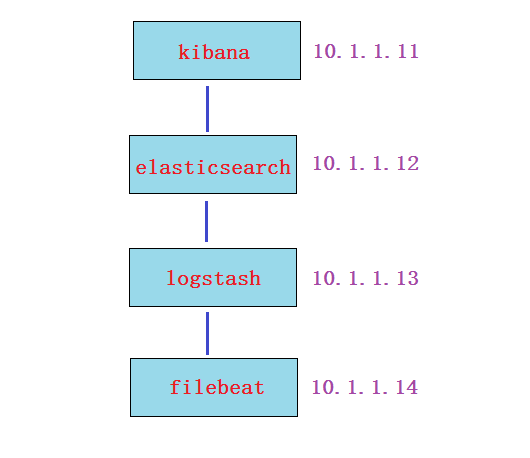

## filebeat收集日志直接传输给ES集群

第1步: 下载并安装filebeat(再开一台虚拟机vm4模拟filebeat, 内存1G就够了, 安装filebeat)

~~~powershell
[root@vm4 ~]# wget https://artifacts.elastic.co/downloads/beats/filebeat/filebeat-6.5.2-x86_64.rpm
[root@vm4 ~]# rpm -ivh filebeat-6.5.2-x86_64.rpm
~~~

第2步: 配置filebeat收集日志

~~~powershell
[root@vm4 ~]# cat /etc/filebeat/filebeat.yml |grep -v '#' |grep -v '^$'
filebeat.inputs:
- type: log
  enabled: true						改为true
  paths:
    - /var/log/*.log				收集的日志路径
filebeat.config.modules:
  path: ${path.config}/modules.d/*.yml
  reload.enabled: false
setup.template.settings:
  index.number_of_shards: 3
setup.kibana:
output.elasticsearch:				输出给es集群
  hosts: ["10.1.1.12:9200"]			es集群节点ip
processors:
  - add_host_metadata: ~
  - add_cloud_metadata: ~
~~~

第3步: 启动服务

~~~powershell
[root@vm4 ~]# systemctl start filebeat
[root@vm4 ~]# systemctl enable filebeat
~~~

第4步: 验证

在es-head和kibana上验证(验证过程省略, 参考前面的笔记)

**练习:**可以尝试使用两台filebeat收集日志，然后在kibana用筛选器进行筛选过滤查看。(可先把logstash那台关闭logstash进行安装filebeat测试)

## filebeat传输给logstash

第1步: 在logstash上要重新配置，开放5044端口给filebeat连接，并重启logstash服务

~~~powershell
[root@vm3 ~]# vim /etc/logstash/conf.d/test.conf 
input {
    beats {
        port => 5044
    }
}

output {
    elasticsearch {
        hosts => ["10.1.1.12:9200"]
        index =>  "filebeat2-%{+YYYY.MM.dd}"
    }
    stdout {									再加一个标准输出到屏幕,方便实验环境调试
    }
}
[root@vm3 ~]# cd /usr/share/logstash/bin/

如果前面有使用后台跑过logstash实例的请kill掉先
[root@vm3 bin]# pkill java

[root@vm3 bin]# ./logstash --path.settings /etc/logstash/ -r -f /etc/logstash/conf.d/test.conf
~~~

第2步: 配置filebeat收集日志

~~~powershell
[root@vm4 ~]# cat /etc/filebeat/filebeat.yml |grep -v '#' |grep -v '^$'
filebeat.inputs:
- type: log
  enabled: true						改为true
  paths:
    - /var/log/*.log				收集的日志路径
filebeat.config.modules:
  path: ${path.config}/modules.d/*.yml
  reload.enabled: false
setup.template.settings:
  index.number_of_shards: 3
setup.kibana:
output.logstash:					这两句非常重要,表示日志输出给logstash
  hosts: ["10.1.1.13:5044"]			IP为logstash服务器的IP;端口5044对应logstash上的配置
processors:
  - add_host_metadata: ~
  - add_cloud_metadata: ~
~~~

第3步: 启动服务

~~~powershell
[root@vm4 ~]# systemctl stop filebeat
[root@vm4 ~]# systemctl start filebeat
~~~

第5步: 去ES-head上验证

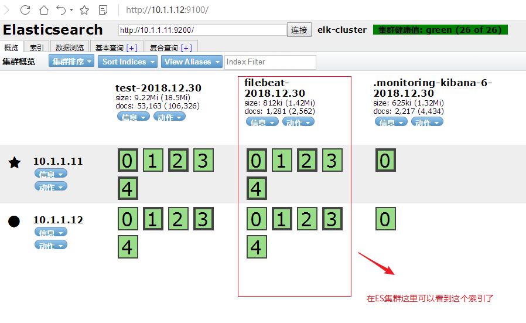

第6步:在kibana创建索引模式(过程省略，参考上面的笔记操作),然后点发现验证

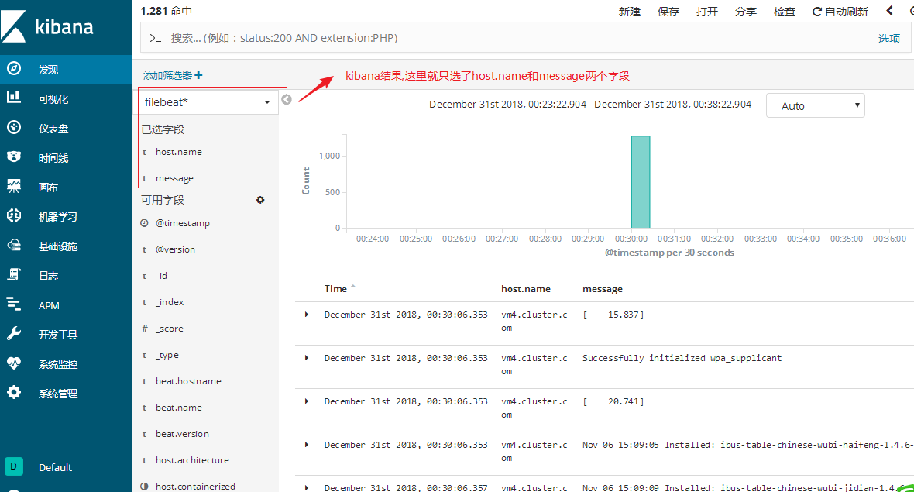

## filebeat收集nginx日志

1, 在filebeat这台服务器上安装nginx,启动服务。并使用浏览器访问刷新一下，模拟产生一些相应的日志(**==强调==**: 我们在这里是模拟的实验环境，一定要搞清楚实际情况下是把filebeat安装到nginx服务器上去收集日志)

~~~powershell
[root@vm4 ~]# yum install epel-release -y
[root@vm4 ~]# yum install nginx -y
[root@vm4 ~]# systemctl restart nginx
[root@vm4 ~]# systemctl enable nginx
~~~

2, 修改filebeat配置文件,并重启服务

~~~powershell
[root@vm4 ~]# cat /etc/filebeat/filebeat.yml |grep -v '#' |grep -v '^$'
filebeat.inputs:
- type: log
  enabled: true
  paths:
    - /var/log/*.log
    - /var/log/nginx/access.log			只在这里加了一句nginx日志路径(按需求自定义即可)
filebeat.config.modules:
  path: ${path.config}/modules.d/*.yml
  reload.enabled: false
setup.template.settings:
  index.number_of_shards: 3
setup.kibana:
output.logstash:
  hosts: ["10.1.1.13:5044"]
processors:
  - add_host_metadata: ~
  - add_cloud_metadata: ~
  
[root@vm4 ~]# systemctl stop filebeat
[root@vm4 ~]# systemctl start filebeat
~~~

3, 验证(在kibana或es-head上查询)

**练习:** 尝试收集httpd,mysql日志

实验中易产生的问题总结:

* filebeat配置里没有把output.elasticsearch改成output.logstash
* filebeat在收集/var/log/*.log日志时，需要对日志进行数据的改变或增加，才会传。当/var/log/yum.log增加了日志数据会传输，但不会触发配置里的其它日志传输。(每个日志的传输是独立的)
* filebeat收集的日志没有定义索引名称, 我这个实验是在logstash里定义的。(此例我定义的索引名叫filebeat2-%{+YYYY.MM.dd})
* es-head受资源限制可能会关闭了，你在浏览器上验证可能因为缓存问题，看不到变化的结果。
* 区分索引名和索引模式(index pattern)名

## filebeat日志简单过滤

~~~powershell
[root@vm4 ~]# grep -Ev '#|^$' /etc/filebeat/filebeat.yml
filebeat.inputs:
- type: log
  enabled: true
  paths:
    - /var/log/yum.log
    - /var/log/nginx/access.log
  include_lines: ['Installed']		表示收集的日志里有Installed关键字才会收集
filebeat.config.modules:
  path: ${path.config}/modules.d/*.yml
  reload.enabled: false
setup.template.settings:
  index.number_of_shards: 3
setup.kibana:
output.logstash:
  hosts: ["10.1.1.13:5044"]
processors:
  - add_host_metadata: ~
  - add_cloud_metadata: ~

[root@vm4 ~]# systemctl restart filebeat

~~~

测试方法:

通过`yum install`和`yum remove` 产生日志,检验结果

结果为: `yum install`安装可以收集,`yum remove`卸载的不能收集

其它参数可以自行测试

* exclude_lines

* exclude_files

