综合案例

# ELK+filebeat+nginx+json

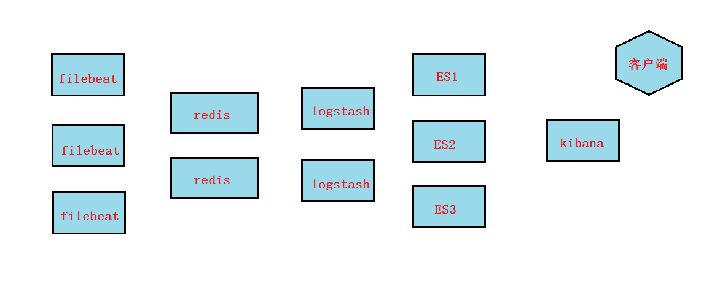

## nginx配置

1,在nginx服务器上安装nginx

~~~shell
# yum install epel-release
# yum install nginx
~~~

2,将nginx日志改成json格式,这样各个字段就方便最终在kibana进行画图统计了

~~~powershell
# vim /etc/nginx/nginx.conf

http {
    log_format  main  '$remote_addr - $remote_user [$time_local] "$request" '
                      '$status $body_bytes_sent "$http_referer" '
                      '"$http_user_agent" "$http_x_forwarded_for"';

    log_format json '{ "@timestamp": "$time_iso8601", '
         '"remote_addr": "$remote_addr", '
         '"remote_user": "$remote_user", '
         '"body_bytes_sent": "$body_bytes_sent", '
         '"request_time": "$request_time", '
         '"status": "$status", '
         '"request_uri": "$request_uri", '
         '"request_method": "$request_method", '
         '"http_referer": "$http_referer", '
         '"http_x_forwarded_for": "$http_x_forwarded_for", '
         '"http_user_agent": "$http_user_agent"}';

    access_log  /var/log/nginx/access.log  json;		把main格式换为json格式
    
    
 # systemctl restart nginx
 # systemctl enable nginx
~~~

3，使用浏览器或`curl`或`elinks`访问nginx.然后查看日志,发现都变成可以转成json格式的格式

~~~powershell
# tail -1 /var/log/nginx/access.log
{ "@timestamp": "2019-07-04T17:19:27+08:00", "remote_addr": "10.1.1.1", "remote_user": "-", "body_bytes_sent": "3650", "request_time": "0.000", "status": "404", "request_uri": "/favicon.ico", "request_method": "GET", "http_referer": "-", "http_x_forwarded_for": "-", "http_user_agent": "Mozilla/5.0 (Windows NT 10.0; WOW64) AppleWebKit/537.36 (KHTML, like Gecko) Chrome/55.0.2883.75 Safari/537.36 Maxthon/5.1.5.1000"}
~~~

## filebeat配置

1,在nginx服务器上安装filebeat安装(filebeat要安装到nginx服务器上收集)

过程省略

2,配置filebeat输出给redis

~~~powershell
# cat /etc/filebeat/filebeat.yml | grep -v "#" | grep -v "^$"
filebeat.inputs:
- type: log
  enabled: true
  paths:
    - /var/log/nginx/access.log
filebeat.config.modules:
  path: ${path.config}/modules.d/*.yml
  reload.enabled: false
output.redis:
  hosts: ["10.1.1.14"]									IP为redis服务器IP
  password: "123456"									redis的密码
  key: "filebeattoredis"
  db: 0
  datatype: list
processors:
  - add_host_metadata: ~
  - add_cloud_metadata: ~

# systemctl restart filebeat
# systemctl enable filebeat
~~~

## redis配置

1, 在redis服务器上,安装redis并启动(需要epel源)

~~~powershell
# yum install redis -y

# vim /etc/redis.conf
61  bind 10.1.1.14						需要filebeat可以连接,或者改为0.0.0.0

480 requirepass 123456

# systemctl start redis
# systemctl enable redis
~~~

~~~powershell
# redis-cli -h 10.1.1.14 -a 123456
10.1.1.14:6379> keys *
1) "filebeattoredis"
10.1.1.14:6379> llen filebeattoredis
(integer) 6							 使用浏览器访问nginx,这里就会有相关信息,6表示有6条日志在队列中
~~~

## logstash配置

1, 在logstash服务器上安装logstash

过程省略

2, 配置logstash,输入为redis,输出给es

~~~shell
# vim /etc/logstash/conf.d/logstash_from_redis.conf
input {
    redis {
        host => "10.1.1.14"
        port => 6379
        password => "123456"
        db => "0"
        data_type => "list"
        key => "filebeattoredis"
    }
}

filter {

}

output {
        elasticsearch {
              hosts  => ["http://10.1.1.12:9200","http://10.1.1.11:9200"]
              index  => "filebeattoredis-%{+YYYY.MM.dd}"
        }
        stdout {
        
        }
}

# /usr/share/logstash/bin/logstash --path.settings /etc/logstash -f /etc/logstash/conf.d/logstash_from_redis.conf
~~~

3, 在redis服务器上查看

~~~powershell
# redis-cli -h 10.1.1.14 -a 123456
10.1.1.14:6379> LLEN filebeattoredis
(integer) 0							   为0了,表示上面6条信息被传到了logstash
~~~

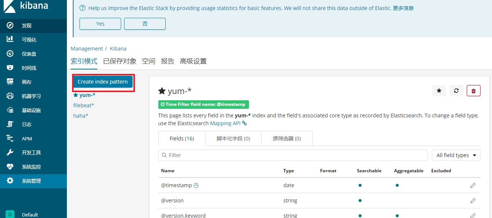

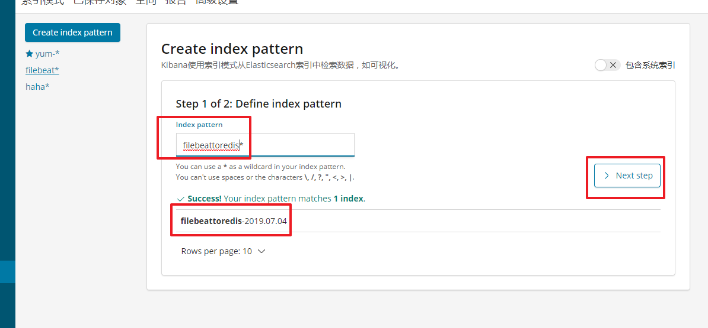

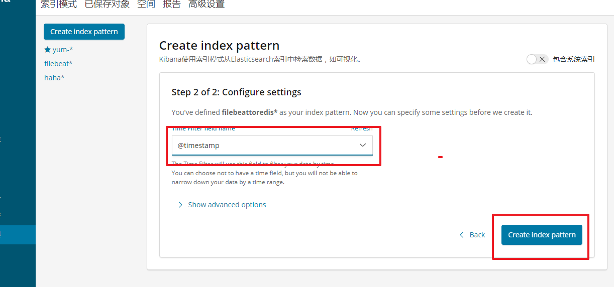

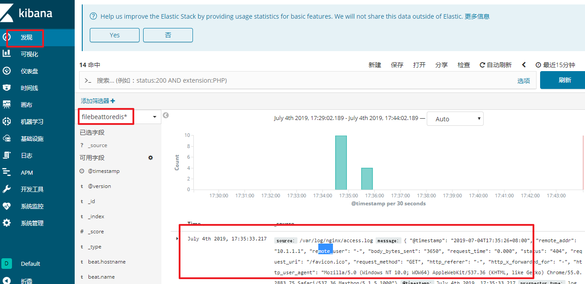

~~~powershell
# cat /etc/logstash/conf.d/logstash_from_redis.conf
input {
    redis {
        host => "10.1.1.14"
        port => 6379
        password => "123456"
        db => "0"
        data_type => "list"
        key => "filebeattoredis"
    }
}

filter {
	json {
		source => "message"
	}

}

output {
        elasticsearch {
            hosts  => ["http://10.1.1.12:9200","http://10.1.1.11:9200"]
            index  => "filebeattoredis-logstashfromredis-%{+YYYY.MM.dd}"
        }
        stdout { 
            
        }
}

注意:这次使用了json插件,索引名请再修改一个新的
如果要画图的话,请重新创建索引模式来匹配新的索引，才能在图形里找到remote_addr这个字段**

# /usr/share/logstash/bin/logstash --path.settings /etc/logstash -f /etc/logstash/conf.d/logstash_from_redis.conf
~~~

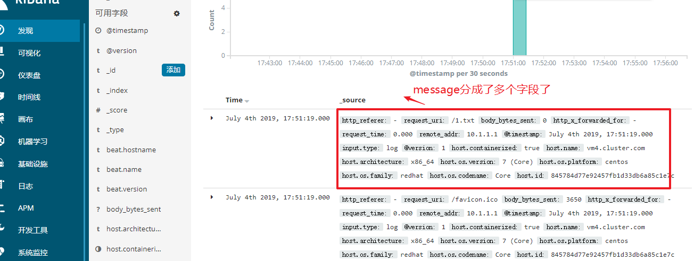

# ELK+filebeat+nginx+grok+geoip

上面的做法还不够高级，下面使用grok插件与geoip插件来实现

1, 停掉前面的logstash进程

* 如果是前台启动,直接ctrl+c即可
* 如果是后台启动, 使用`ps -ef |grep java `找出pid,再`kill -9 PID`

2, 修改nginx日志格式

~~~powershell
# vim /etc/nginx/nginx.conf

http {
    log_format  main  '$remote_addr - $remote_user [$time_local] "$request" '
                      '$status $body_bytes_sent "$http_referer" '
                      '"$http_user_agent" "$http_x_forwarded_for"';

    access_log  /var/log/nginx/access.log  main;		改为main格式

 # systemctl restart nginx

~~~

3, 清空日志

~~~powershell
# echo > /var/log/nginx/access.log
可以让客户端重新访问几次,确认日志格式正常
~~~

4, 配置filebeat并重启

~~~shell
[root@app ~]# cat /etc/filebeat/filebeat.yml
filebeat.inputs:
- type: log
  enabled: true
  paths:
  - /var/log/nginx/access.log
  fields:
    app: www
    type: nginx
  fields_under_root: true

output.redis:
  hosts: ["10.1.1.14"]
  password: "123456"
  key: "filebeattoredis2"
  db: 0
  datatype: list
  
# systemctl restart filebeat
~~~

5, 客户端访问nginx, 查看redis是否有队列

~~~shell
# redis-cli -h 10.1.1.14 -a 123456
10.1.1.14:6379> keys *
1) "filebeattoredis2"
10.1.1.14:6379> llen filebeattoredis2
(integer) 2
~~~

6, 使用logstash grok插件完成对nginx日志格式化

~~~powershell
# vim /etc/logstash/conf.d/logstash_nginx_format.conf
input {
    redis {
        host => "10.1.1.14"
        port => 6379
        password => "123456"
        db => "0"
        data_type => "list"
        key => "filebeattoredis2"
    }
}

filter {
  if [app] == "www" {
    if [type] == "nginx" {
      grok {
        match => {
          "message" => "%{IPV4:remote_addr} - (%{USERNAME:remote_user}|-) \[%{HTTPDATE:time_local}\] \"%{WORD:request_method} %{URIPATHPARAM:request_uri} HTTP/%{NUMBER:http_protocol}\" %{NUMBER:http_status} %{NUMBER:body_bytes_sent} \"%{GREEDYDATA:http_referer}\" \"%{GREEDYDATA:http_user_agent}\" \"(%{IPV4:http_x_forwarded_for}|-)\""
        }
        overwrite => ["message"]
      }
      geoip {
          source => "remote_addr"
          target => "geoip"
          database => "/opt/GeoLite2-City.mmdb"
          add_field => ["[geoip][coordinates]", "%{[geoip][longitude]}"]
          add_field => ["[geoip][coordinates]", "%{[geoip][latitude]}"]
      }
      date {
          locale => "en"
          match => ["time_local", "dd/MMM/yyyy:HH:mm:ss Z"]
      }
      mutate {
          convert => ["[geoip][coordinates]", "float"]
      }
    }
  }
}

output {
  elasticsearch {
      hosts  => ["http://10.1.1.12:9200","http://10.1.1.11:9200"]
      index  => "logstash-nginx-log-format-%{type}-%{+YYYY.MM.dd}"
  }
  stdout{
  }
}

# /usr/share/logstash/bin/logstash --path.settings /etc/logstash -f /etc/logstash/conf.d/logstash_nginx_format.conf
~~~

7, 确认redis队列为0,说明传给了logstash

~~~powershell
# redis-cli -h 10.1.1.14 -a 123456
10.1.1.14:6379> keys *
1) "filebeattoredis2"
10.1.1.14:6379> llen filebeattoredis2
(integer) 2
~~~

8, 模拟假的客户端访问数据(主要是模拟一些假的公网IP)

可手动在nginx服务器上`vim /var/log/nginx/access.log`复制粘贴多行,然后改成不同的公网IP

9, 在kibana创建索引模式

过程省略

10, 在kibana创建可视化图形

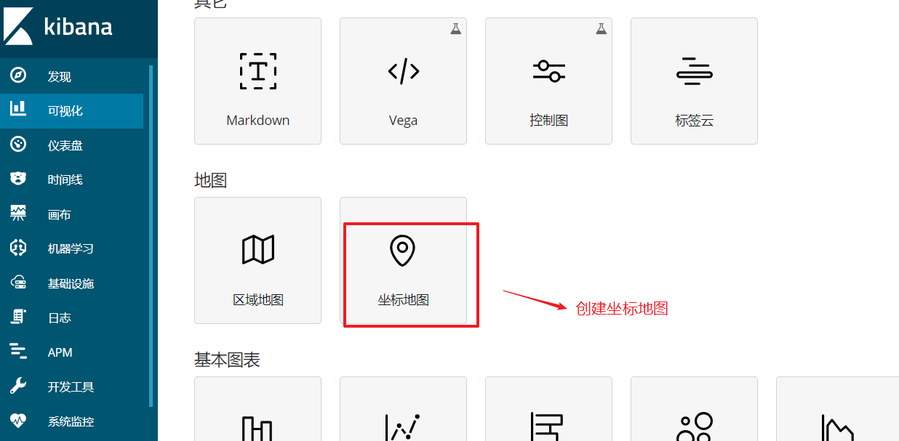

**使用unique count用于计算地图区域的客户端IP统计**

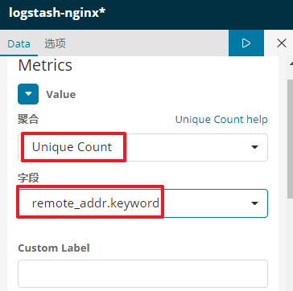

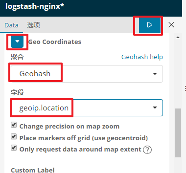

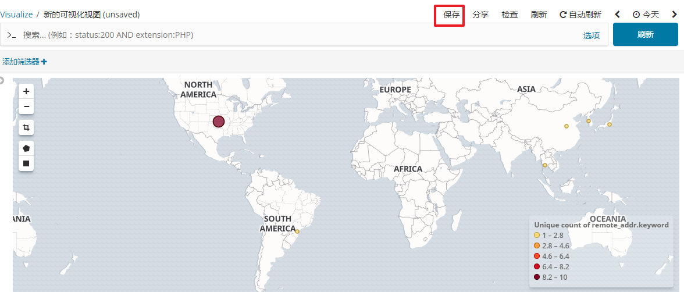

11, 可选择创建仪表盘,将图形加入仪表盘

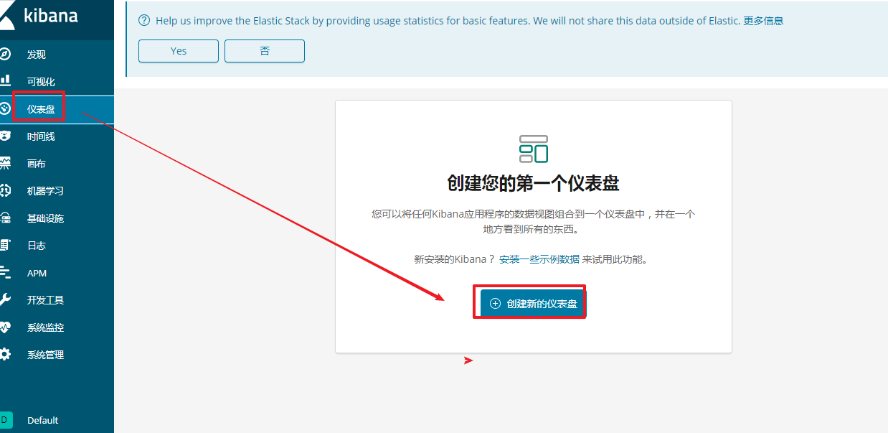

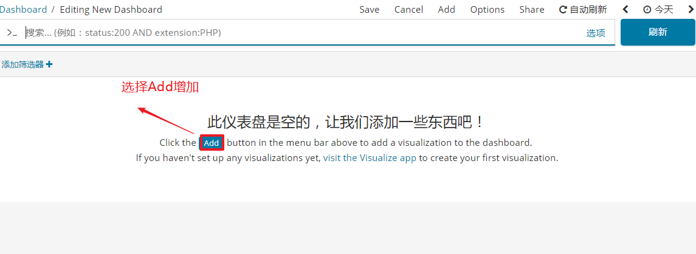

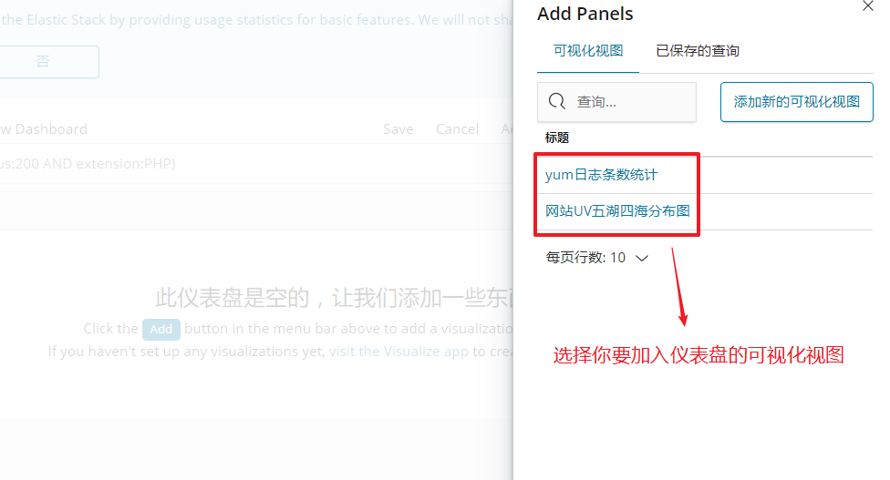

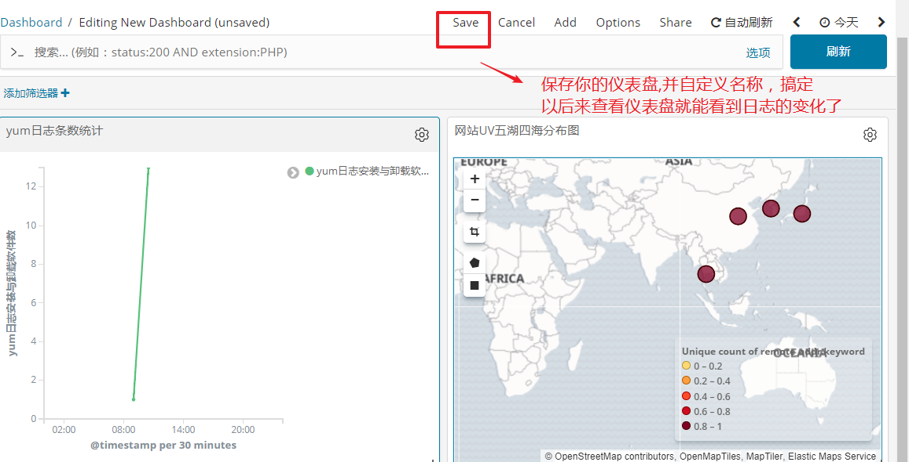