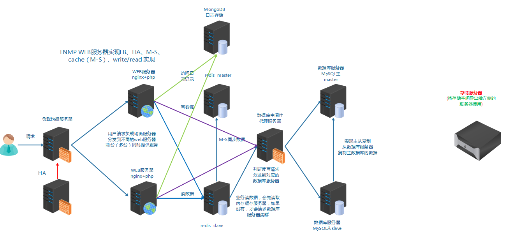
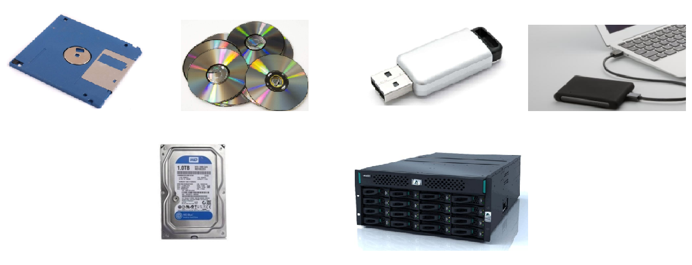
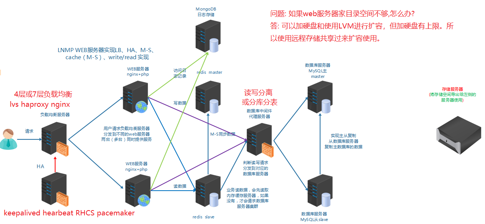
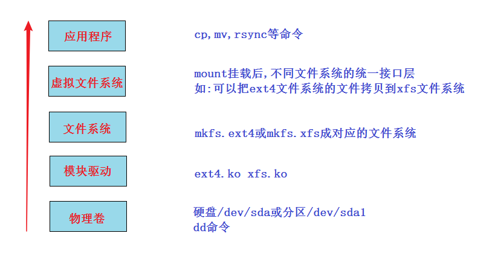
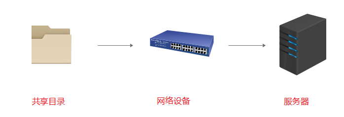
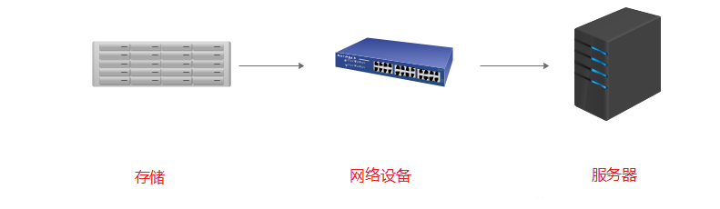
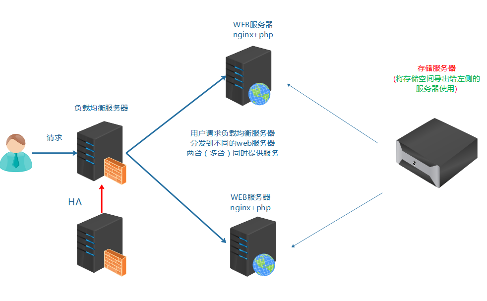
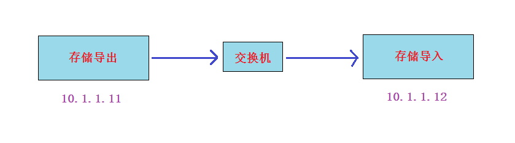

# 任务背景

​       随着某些业务数据的增大, 公司服务器硬盘空闲空间越来越小, 服务器上也无法再拓展硬盘, 所以我们考虑使用**==网络存储方式远程共享存储给服务器使用==**。



# **任务要求**

实现存储通过远程共享给应用服务器使用


# 任务拆解

1, 需要知道存储有哪些方式可以通过网络共享给服务器使用,如何选择合理的方式

2, 需要知道存储共享给服务器后是一种什么形式,是一个目录呢, 还是一个块设备

3, 使用什么样的软件来实现

4, 配置实现


# **学习目标**

- [ ] 能够区分DAS,NAS,SAN三种存储分类
- [ ] 能够区分文件存储类型与块存储类型
- [ ] 能够使用iscsi实现IP-SAN


# 知识储备

## 存储介绍

> 存储(storage)是什么?




**简单来说，存储就是==存放数据的介质==。**

我们在这里不是学习这些硬件知识，而是学习**Linux平台下的存储技术**。


在前面学习的架构基础上再加上**远程存储**。





## Linux存储分层(了解)

问题: linux上如何挂载ntfs格式的移动硬盘?

linux内核支持ntfs,但centos7系统并没有加上此功能，解决方法两种:

* 重新编译内核,在内核加上支持ntfs(此方法不推荐,因为编译内核会造成内核运行不稳定, 没有过硬的实力不要做)
* 安装软件，为内核加上支持ntfs的模块

~~~powershell
安装
# yum install epel-release  -y
# yum install ntfs-3g        

挂载命令
# mount.ntfs-3g /dev/sdb1 /mnt
~~~


一个新的硬盘在linux系统里使用一般来说就三步:(分区,格式化)-挂载-使用

**Linux存储五层:**



上面比较难理解的是虚拟文件系统: 又名VFS (Virtual File System),作用就是采用标准的Unix系统调用读写位于**不同物理介质上的不同文件系统**,即为各类文件系统提供了一个统一的操作界面和应用编程接口。

简单来说,就是使用上层应用程序不用关注底层是什么文件系统, 统一使用。


## 存储的分类

**存储的分类**(重点)

| 存储分类                                               | 描述                                                         |
| ------------------------------------------------------ | ------------------------------------------------------------ |
| **==DAS==** 直连式存储 (direct  access/attach storage) | 如:机箱里的disk，或通过接口直连到系统总线上的disk(如U盘，移动硬盘) |
| **==NAS==** 网络附加存储(network attched storage)      | 通过交换机,路由器连接起来,共享的是**目录**。如:nfs,samba,ftp |
| **==SAN==** 存储区域网络(storage area network)         | 通过交换机,路由器连接起来的高速存储网络,共享的是**块设备**   |

DAS: 直接连接系统，不受网速限制，速度快; 扩展容量有上限。

NAS与SAN: 通过网络设备连接的远程存储，速度受网络影响; 但扩展方便，几乎无上限。


NAS和SAN都是通过网络(通过了网络设备,如路由器，交换机等)的，但NAS共享的是**应用层的目录**,而SAN共享的是/dev/sdb1或/dev/sdb这种**块设备**。








## 存储类型的分类

| 存储类型分类     | 描述                                                         |
| ---------------- | ------------------------------------------------------------ |
| **==文件存储==** | NAS都属于这一类。简单来说就是mount后直接使用的               |
| **==块存储==**   | SAN都属于这一类。简单来说就是类似/dev/sdb这种，要分区,格式化后才能mount使用 |
| ==**对象存储**== | 通俗来讲，就是存储是什么形式，怎么做的都不用关注。使用的人只要直接使用程序接口去访问, 进行get下载与put上传就好 |

文件存储: 类似一个大的目录，多个客户端都可以挂载过来使用。

- 优点: 利于数据共享
- 缺点: 速度较慢

块存储: 类似一个block设备，客户端可以格式化，挂载并使用，和用一个硬盘一样。

- 优点: 和本地硬盘一样,直接使用,速度较快
- 缺点: 数据不共享

对象存储: 一个对象我们可以看成一个文件, 综合了文件存储和块存储的优点。

- 优点: 速度快,数据共享
- 缺点: 成本高, 不兼容现有的模式


如果两台nginx服务器想要实现web家目录里的数据一致, 请问怎么做?




小结:

* 存储要通过远程的方法共享

* 有可能要考虑数据共享的问题

* 存储分类:DAS,NAS,SAN

* 存储类型分类: 文件存储,块存储, 对象存储


# SAN

## SAN的分类

两种SAN:

1. **FC-SAN**: 早期的SAN, 服务器与交换机的数据传输是通过光纤进行的,  服务器把SCSI指令传输到存储设备上，不能走普通LAN网的IP协议。
2. **IP-SAN**: 用IP协议封装的SAN, 可以完全走普通网络,因此叫做IP-SAN, 最典型的就是ISCSI。

FC-SAN优缺点: 速度快(2G,8G,16G), 成本高。

IP-SAN优缺点:  速度较慢(已经有W兆以太网标准), 成本低。


## IP-SAN之iscsi实现

iscsi: internat small computer system interface   

(网络小型计算机接口,就是一个通过网络可以实现SCSI接口的协议)

**实验: Linux平台通过iscsi实现IP-SAN**

**实验准备: 两台虚拟机（centos7平台)同网段（比如vmnet8), 交换机不用模拟,因为同网段的虚拟机就相当于连在同一个交换机上**



1. 静态IP（两台IP互通就行,网关和DNS不做要求）
2. 都配置主机名及其主机名互相绑定
3. 关闭防火墙,selinux
4. 时间同步
5. 配置好yum(需要加上epel源)
6. 在存储导出端模拟存储(模拟存储可以使用多种形式,如硬盘:/dev/sdb,分区:/dev/sdb1,软raid:/dev/md0,逻辑卷:/dev/vg/lv01,`dd if=/dev/zero of=/tmp/storage_file bs=1M count=1000`创建的大文件等等), **本实验请自行加一个硬盘来模拟**


**实验步骤:**

1. export导出端安装软件, 配置导出的存储，启动服务
2. import导入端安装软件, 导入存储，启动服务

**实验过程:**

**第1步: 在导出端上安装iscsi-target-utils软件包**

```powershell
export# yum install epel-release -y		  	没有安装epel源的,再次确认安装
export# yum install scsi-target-utils -y
```

**第2步: 在导出端配置存储的导出**

```powershell
export# cat /etc/tgt/targets.conf |grep -v "#"   （配置完后的结果如下)

default-driver iscsi

<target iscsi:data>						# 共享名,也就是存储导入端发现后看到的名称
        backing-store /dev/sdb			# /dev/sdb是实际要共享出去的设备
</target>
```

**第3步: 导出端启动服务并验证**

```powershell
export# systemctl start tgtd				
export# systemctl enable tgtd
验证端口和共享资源是否ok
export# lsof -i:3260
export# tgt-admin --show
```

**第4步: 导入端安装iscsi-initiator-utils软件包**

```powershell
import# yum install iscsi-initiator-utils
```

**第5步: 导入端导入存储**

在登录前必须要先连接并发现资源(discovery)

```powershell
import# iscsiadm -m discovery -t sendtargets -p 10.1.1.11
10.1.1.11:3260,1 iscsi:data
```

发现资源成功后，就可以进行资源登录了

```powershell
登录发现的存储:
import# iscsiadm -m node -l
```

登录成功后，直接使用`fdisk -l`查看

~~~powershell
import# fdisk -l
~~~

**第6步: import端启动服务**

```powershell
启动服务，并做成开机自启动（目的:import端服务器reboot后还能自动登录discovery发现的存储)
import# systemctl start iscsi
import# systemctl enable iscsi

import# systemctl start iscsid
import# systemctl enable iscsid
```

**补充: 关于取消连接的操作**

```powershell
取消登录:
import# iscsiadm -m node -u

删除登录过的信息：
import# iscsiadm -m node --op delete
```


问题: 如果再加一个新的导入服务器，两个导入服务器导入同一个存储，然后格式化，挂载。能实现同读同写吗?

~~~powershell
答: 不可以
~~~


**拓展:**  可以对导出的存储配置验证功能，导入端配置正确的用户名和密码才能登陆

只有两个地方不一样:

1. 在导出端配置时加上用户名和密码验证功能

~~~powershell
<target iscsi:data>
        backing-store /data/storage
        incominguser daniel daniel123		验证功能，此用户自定义即可，与系统用户无关
</target>
~~~

2. 在导入端配置时需要多配置下面一步，对应导出端的用户名与密码

~~~powershell
如果export端有源被配置了验证功能，那么import端需要配置正确的用户名和密码才OK
CHAP (Challenge-Handshake Authentication Protocol) 挑战握手验证协议

import# vim /etc/iscsi/iscsid.conf 		
57 node.session.auth.authmethod = CHAP		
61 node.session.auth.username = daniel
62 node.session.auth.password = daniel123

71 discovery.sendtargets.auth.authmethod = CHAP
75 discovery.sendtargets.auth.username = daniel
76 discovery.sendtargets.auth.password = daniel123
做完这一步后, 就可以发现资源并登录了
~~~


 