#   任务背景

实现了远程的存储共享(NAS或SAN)后, 公司业务发展迅速, 存储空间还需要增大。使用NAS或SAN都不方便扩容，NAS可以增加新的挂载目录, SAN可以增加新的硬盘，但我们希望直接在原来挂载的业务目录上实现**在线扩容**，数据体量越来越大, 这个时候我们就可以考虑使用**==分布式存储==**了。


# 任务要求

1, 将远程**多台**服务器的空闲存储空间整合,**组合成一个大存储**给应用服务器(如apache,nginx,tomcat,mysql等)使用

2, 考虑高可用与负载均衡原则，并能实现在线扩容

# 任务拆解

1  , 了解分布式存储的概念与原理

2, 选择对应的分布式存储软件

3, 准备多台有空闲空间的服务器做存储服务器

4, 搭建集群将多台存储服务器组合

5, 将组合的大存储划分成卷共享给应用服务器使用

6, 实现在线扩容

# **学习目标**

- [ ] 能够说出分布式存储的优点

- [ ] 能够成功搭建glusterfs集群

- [ ] 掌握常见的glusterfs卷模式的创建与使用

- [ ] 能够对特定的glusterfs卷实现在线裁减或扩容


# 分布式存储介绍

我们已经学习了NAS是远程通过网络共享**目录**, SAN是远程通过网络共享**块设备**。

那么分布式存储你可以看作**==拥有多台存储服务器连接起来的存储导出端==**。把这多台存储服务器的存储合起来做成一个整体再通过网络进行远程共享,共享的方式有目录(文件存储),块设备(块存储),对象网关或者说一个程序接口(对象存储)。

常见的分布式存储开源软件有:GlusterFS,Ceph,HDFS,MooseFS,FastDFS等。

分布式存储一般都有以下几个优点: 

1. 扩容方便，轻松达到PB级别或以上
2. 提升读写性能(LB)或数据高可用(HA)
3. 避免单个节点故障导致整个架构问题
4. 价格相对便宜，大量的廉价设备就可以组成，比光纤SAN这种便宜很多


 

# Glusterfs

## glusterfs介绍

glusterfs是一个免费,开源的分布式文件系统（它属于**文件存储类型**）。

https://www.gluster.org/


## raid级别回顾(拓展)

raid级别有很多种，下面主要介绍常用的几种:

**raid0**   读写性能佳，坏了其中一块，数据挂掉，可靠性低（stripe条带化），磁盘利用率100％

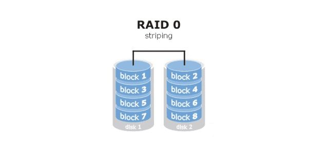


**raid1**  镜像备份（mirror)，同一份数据完整的保存在多个磁盘上，写的性能不佳，可靠性高，读的性能还行，磁盘利用率50%	

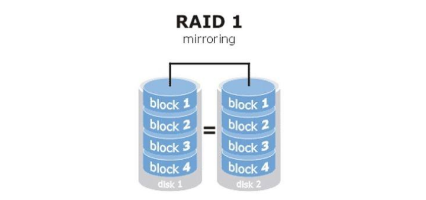


**raid10**  先做raid 1 再做raid 0

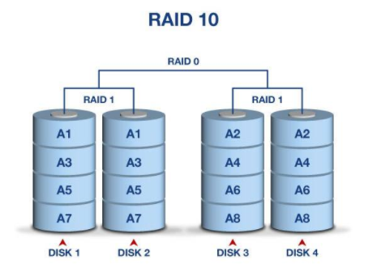


**raid5**  由多块磁盘做raid 5，磁盘利用率为n-1/n,  其中一块放校验数据，允许坏一块盘，数据可以利用校验值来恢复

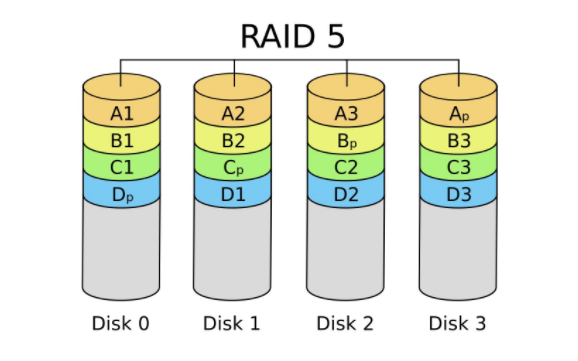


**raid6**  在raid5的基础上再加一块校验盘，进一步提高数据可靠性

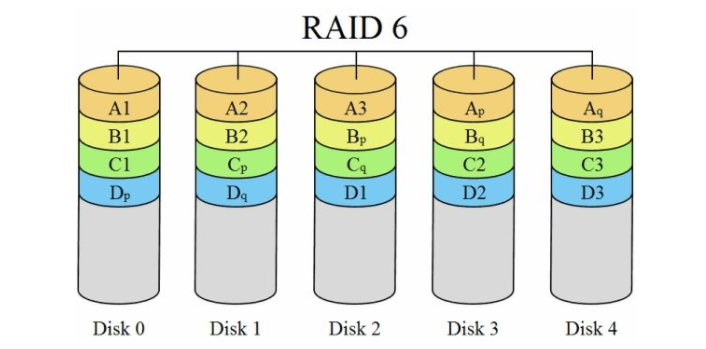


**生产环境中最常用的为raid5和raid10**


## 常见卷的模式

| 卷模式                                                     | 描述                    |
| ---------------------------------------------------------- | ----------------------- |
| **Replicated**                                             | 复制卷，类似raid1       |
| **Striped(了解,新版本将会放弃此模式及其它相关的组合模式)** | 条带卷，类似raid0       |
| **Distributed**                                            | 分布卷                  |
| **Distribute Replicated**                                  | 分布与复制组合          |
| **Dispersed**                                              | 纠删卷，类似raid5,raid6 |

**glusterfs看作是一个将多台服务器存储空间组合到一起，再划分出不同类型的文件存储卷给导入端使用。**


**Replicated卷**

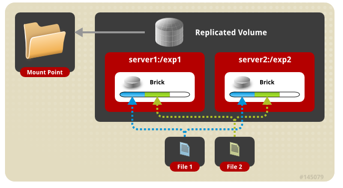

**Striped卷**

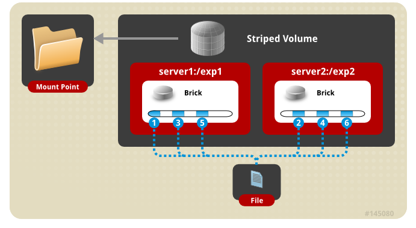

**Distributed卷**

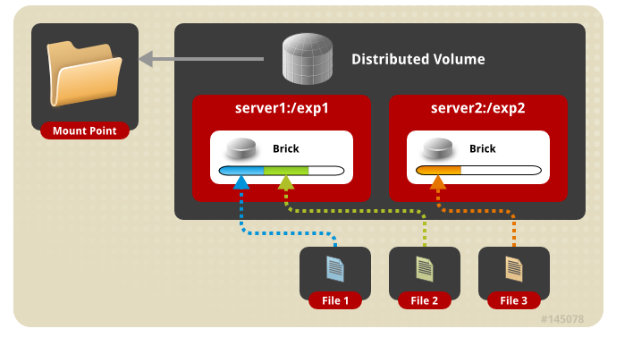

**Distribute Replicated卷**

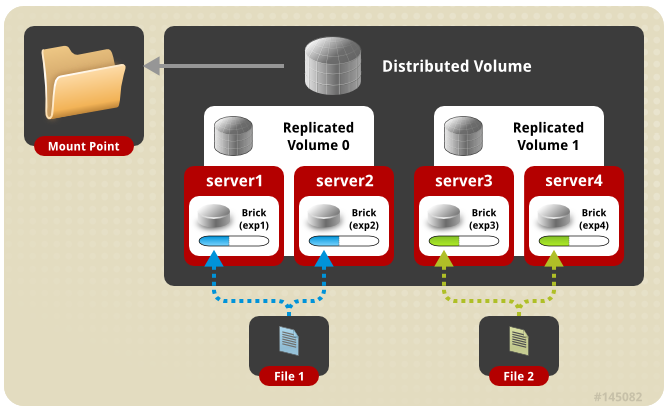


**其它模式请参考官网**: https://docs.gluster.org/en/latest/Administrator%20Guide/Setting%20Up%20Volumes/


## glusterfs集群

**实验准备:**

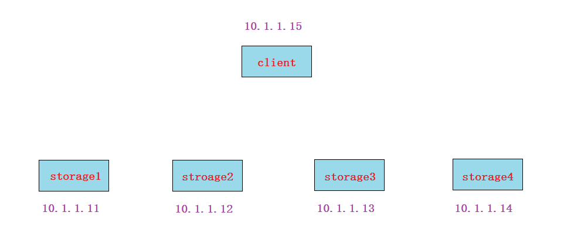

1. **所有节点(包括client)**静态IP（NAT网络，能上外网）
2. **所有节点(包括client)**都配置主机名及其主机名互相绑定（这次我这里做了别名,方便使用)

```powershell
10.1.1.11	vm1.cluster.com		storage1
10.1.1.12	vm2.cluster.com		storage2
10.1.1.13	vm3.cluster.com		storage3
10.1.1.14	vm4.cluster.com		storage4
10.1.1.15	vm5.cluster.com		client
```

3. **所有节点(包括client)**关闭防火墙,selinux

   ~~~powershell
   # systemctl stop firewalld
   # systemctl disable firewalld
   # iptables -F
   ~~~

4. **所有节点(包括client)**时间同步

5. **所有节点(包括client)**配置好yum(需要加上glusterfs官方yum源)

```powershell
# vim /etc/yum.repos.d/glusterfs.repo
[glusterfs]
name=glusterfs
baseurl=https://buildlogs.centos.org/centos/7/storage/x86_64/gluster-4.1/
enabled=1
gpgcheck=0
```

yum源说明:

* 可按照以上yum路径去查找`glusterfs5`或`glusterfs6`版本的yum源路径(目前我们使用4.1版)
* 如果网速太慢，可下载我共享的软件做本地yum源安装


**实验步骤:**

1. 在所有storage服务器上安装相关软件包,并启动服务
2. 所有storage服务器建立连接, 成为一个集群
3. 所有storage服务器准备存储目录
4. 创建存储卷
5. 启动存储卷
6. client安装挂载软件
7. client挂载使用


**实验过程:**

**第1步, 在所有storage服务器上(不包括client)安装glusterfs-server软件包，并启动服务**

```powershell
下面的命令所有存储服务器都要做
# yum install glusterfs-server

# systemctl start glusterd
# systemctl enable glusterd
# systemctl status glusterd
```

分布式集群一般有两种架构:

* 有中心节点的	  中心节点一般指管理节点，后面大部分分布式集群架构都属于这一种
* 无中心节点的      所有节点又管理又做事,glusterfs属于这一种


**第2步, 所有storage服务器建立连接，成为一个集群** 

```powershell
4个storage服务器建立连接不用两两连接，只需要找其中1个,连接另外3个各一次就OK了

下面我就在storage1上操作
storage1# gluster peer probe storage2		
storage1# gluster peer probe storage3
storage1# gluster peer probe storage4		--这里使用ip,主机名,主机名别名都可以

然后在所有存储上都可以使用下面命令来验证检查
# gluster peer status	
```

**==注意==**:

如果这一步建立连接有问题（一般问题会出现在网络连接,防火墙,selinux,主机名绑定等);

如果想重做这一步，可以使用gluster peer detach  xxxxx [force] 来断开连接，重新做


**第3步, 所有storage服务器准备存储目录（可以用单独的分区，也可以使用根分区)**

```powershell
因为我让大家准备的storage服务器没有准备额外的硬盘，所以这里用根分区来做实验
但生产环境肯定是不建议数据盘和系统盘在一起的
# mkdir -p /data/gv0 　 
```


**第4步, 创建存储卷(在任意一个storage服务器上做)**

**==注意==**: ==改变的操作(create,delete,start,stop)等只需要在任意一个storage服务器上操作，查看的操作(info)等可以在所有storage服务器上操作==

```powershell
下面命令我是在storage1上操作的
因为在根分区创建所以需要force参数强制
replica 4表示是在4台上做复制模式(类似raid1)

storage1# gluster volume create gv0 replica 4 storage1:/data/gv0/ storage2:/data/gv0/ storage3:/data/gv0/ storage4:/data/gv0/ force
volume create: gv0: success: please start the volume to access data
```

```powershell
所有storage服务器上都可以查看
# gluster volume info gv0
 
Volume Name: gv0
Type: Replicate				模式为replicate模式
Volume ID: 328d3d55-4506-4c45-a38f-f8748bdf1da6
Status: Created				这里状态为created,表示刚创建，还未启动,需要启动才能使用
Snapshot Count: 0
Number of Bricks: 1 x 4 = 4
Transport-type: tcp
Bricks:
Brick1: storage1:/data/gv0
Brick2: storage2:/data/gv0
Brick3: storage3:/data/gv0
Brick4: storage4:/data/gv0
Options Reconfigured:
transport.address-family: inet
nfs.disable: on
```

**第5步, 启动存储卷**

```powershell
storage1# gluster volume start gv0
```

```powershell
# gluster volume info gv0

Volume Name: gv0
Type: Replicate
Volume ID: 328d3d55-4506-4c45-a38f-f8748bdf1da6
Status: Started			现在看到状态变为started，那么就表示可以被客户端挂载使用了
Snapshot Count: 0
Number of Bricks: 1 x 4 = 4
Transport-type: tcp
Bricks:
Brick1: storage1:/data/gv0
Brick2: storage2:/data/gv0
Brick3: storage3:/data/gv0
Brick4: storage4:/data/gv0
Options Reconfigured:
transport.address-family: inet
nfs.disable: on
```

**第6步, client安装软件**

```powershell
客户端上操作
client# yum install glusterfs glusterfs-fuse -y
```

说明:

fuse(Filesystem in Userspace): 用户空间文件系统,是一个客户端挂载远程文件存储的模块

**第7步, client挂载使用**

**==注意==:**客户端也需要在/etc/hosts文件里绑定存储节点的主机名，才可以挂载（因为我前面做的步骤是用名字的)

```powershell
client# mkdir /test0
client# mount -t glusterfs storage1:gv0 /test0

这里client是挂载storage1，也可以挂载storage2,storage3,storage4任意一个。（也就是说这4个storage既是老板,又是员工。这是glusterfs的一个特点，其它的分布式存储软件基本上都会有专门的管理server)
```


## **replica卷测试**

读写测试方法:

在客户端使用dd命令往挂载目录里写文件，然后查看在storage服务器上的分布情况(具体验证详细过程参考授课视频)

(**==注意: 读写操作请都在客户端进行，不要在storage服务器上操作==**)

~~~powershell
client# dd if=/dev/zero of=/test0/file1 bs=1M count=100
~~~

1. 读写测试结果: 结果类似raid1
2. 同读同写测试: 有条件的可以再开一台虚拟机做为client2，两个客户端挂载gv0后实现同读同写(文件存储类型的特点)


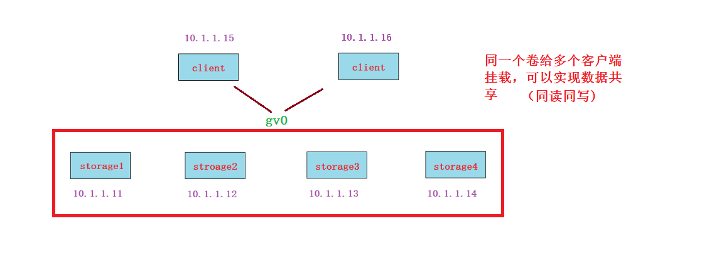

运维思想: 

搭建OK后,你要考虑性能,稳定, 高可用，负载均衡，健康检查, 扩展性等

如果某一个节点挂了,你要考虑是什么挂了(网卡,服务,进程,服务器关闭了),如何解决?


请测试如下几种情况:

* 将其中一个storage节点关机

~~~powershell
客户端需要等待10几秒钟才能正常继续使用,再次启动数据就正常同步过去
~~~

* 将其中一个storage节点网卡down掉

~~~powershell
客户端需要等待10几秒钟才能正常继续使用,再次启动数据就正常同步过去
~~~

* 将其中一个storage节点glusterfs相关的进程kill掉

~~~powershell
客户端无需等待就能正常继续使用,但写数据不会同步到挂掉的storage节点,等它进程再次启动就可以同步过去了
~~~


结论: 作为一名运维工程师，HA场景有不同的挂法:

* 服务器关闭
* 网卡坏了
* 网线断了
* 交换机挂了
* 服务进程被误杀等等

但我们需要去考虑，当软件无法把我们全自动实现时，我们可能需要使用脚本来辅助。有一个简单的方法为: 如果一个节点没死透，我们就干脆将它关机，让它死透:joy:

请参考拓展: RHCS,pacemaker里的fence,stonish(shoot the other node in the head)等概念。


## **卷的删除**

**第1步: 先在客户端umount已经挂载的目录(在umount之前把测试的数据先删除)**

~~~powershell
client# rm /test0/* -rf   		
client# umount /test0
~~~

**第2步:  在任一个storage服务器上使用下面的命令停止gv0并删除，我这里是在storage1上操作**

```powershell
storage1# gluster volume stop gv0
Stopping volume will make its data inaccessible. Do you want to continue? (y/n) y
volume stop: gv0: success

storage1# gluster volume delete gv0 
Deleting volume will erase all information about the volume. Do you want to continue? (y/n) y
volume delete: gv0: success
```

**第3步: 在所有storage服务器上都可以查看，没有gv0的信息了，说明这个volumn被删除了**

~~~powershell
# gluster volume info gv0 
Volume gv0 does not exist
~~~

**问题:** 我在不删除gv0的情况下，能否再创建一个叫gv1的卷? 

~~~powershell
当然可以,换个目录再创建就OK
~~~


## **stripe模式**(条带)

**第1步: 再重做成stripe模式的卷(重点是命令里的stripe 4参数)(在任一个storage服务器上操作, 我这里是在storage1上操作）**

```powershell
storage1# gluster volume create gv0 stripe 4 storage1:/data/gv0/ storage2:/data/gv0/ storage3:/data/gv0/ storage4:/data/gv0/ force
volume create: gv0: success: please start the volume to access data
```

**第2步: 启动gv0(在任一个storage服务器上操作, 我这里是在storage1上操作）**

~~~powershell
storage1# gluster volume start gv0
~~~

**第3步: 客户端挂载**

~~~powershell
client# mount -t glusterfs storage1:gv0 /test0
~~~

**第4步:读写测试**

**读写测试结果:**  文件过小,不会平均分配给存储节点。有一定大小的文件会平均分配。类似raid0。

* 磁盘利率率100%(前提是所有节点提供的空间一样大，如果大小不一样，则按小的来进行条带)
* 大文件会平均分配给存储节点（LB）
* 没有HA，挂掉一个存储节点，此stripe存储卷则不可被客户端访问


## **distributed模式**

**第1步: 准备新的存储目录(所有存储服务器上都要操作)**

~~~powershell
# mkdir -p /data/gv1
~~~

**第2步: 创建distributed卷gv1(不指定replica或stripe就默认是Distributed的模式, 在任一个storage服务器上操作, 我这里是在storage1上操作)**

~~~powershell
storage1# gluster volume create gv1 storage1:/data/gv1/ storage2:/data/gv1/ storage3:/data/gv1/ storage4:/data/gv1/ force
~~~

**第3步: 启动gv1(在任一个storage服务器上操作, 我这里是在storage1上操作)**

~~~powershell
storage1# gluster volume start gv1
~~~

**第4步: 客户端挂载**

```powershell
client# mkdir /test1
client# mount -t glusterfs storage1:gv1 /test1
```

**第5步:读写测试(测试方法与replica模式一样，具体过程参考授课视频)**

**读写测试结果:** 测试结果为随机写到不同的存储里，直到所有写满为止。

* 利用率100%

* 方便扩容
* 不保障的数据的安全性(挂掉一个节点,等待大概1分钟后,这个节点就剔除了,被剔除的节点上的数据丢失)
* 也不提高IO性能


## **distributed-replica模式**

**第1步: 准备新的存储目录(所有存储服务器上都要操作)**

~~~powershell
# mkdir -p /data/gv2
~~~

**第2步:** **创建distributed-replica卷gv2(在任一个storage服务器上操作, 我这里是在storage1上操作)**

```powershell
storage1# gluster volume create gv2 replica 2 storage1:/data/gv2/ storage2:/data/gv2/ storage3:/data/gv2/ storage4:/data/gv2/ force  
```

**第3步: 启动gv2(在任一个storage服务器上操作, 我这里是在storage1上操作)**

~~~powershell
storage1# gluster volume start gv2
~~~

**第4步: 客户端挂载**

~~~powershell
client# mkdir /test2
client# mount -t glusterfs storage1:gv2 /test2
~~~

**第5步:读写测试**

**读写测试结果:** 4个存储分为两个组，这两个组按照distributed模式随机。但在组内的两个存储会按replica模式镜像复制。

特点:

* 结合了distributed与replica的优点:可以扩容，也有HA特性


## dispersed模式

disperse卷是v3.6版本后发布的一种卷模式，类似于raid5/6

**第1步: 准备新的存储目录(所有存储服务器上都要操作)**

~~~powershell
# mkdir -p /data/gv3
~~~

**第2步:** **创建卷gv3(在任一个storage服务器上操作, 我这里是在storage1上操作)**

~~~powershell
storage1# gluster volume create gv3 disperse 4 storage1:/data/gv3/ storage2:/data/gv3/ storage3:/data/gv3/ storage4:/data/gv3/ force
There is not an optimal redundancy value for this configuration. Do you want to create the volume with redundancy 1 ? (y/n) y
volume create: gv3: success: please start the volume to access data

注意:没有指定冗余值，默认为1，按y确认
~~~

**第3步: 启动gv3(在任一个storage服务器上操作, 我这里是在storage1上操作)**

~~~powershell
storage1# gluster volume start gv3

storage1# gluster volume info gv3
Volume Name: gv3
Type: Disperse					
Volume ID: 767add4e-48c4-4a2d-a5d1-467076d73afd
Status: Started
Snapshot Count: 0
Number of Bricks: 1 x (3 + 1) = 4				这里看到冗余数为1
Transport-type: tcp
Bricks:
Brick1: storage1:/data/gv3
Brick2: storage2:/data/gv3
Brick3: storage3:/data/gv3
Brick4: storage4:/data/gv3
Options Reconfigured:
transport.address-family: inet
nfs.disable: on
~~~

**第4步: 客户端挂载**

~~~powershell
client# mkdir /test3
client# mount -t glusterfs storage1:gv3 /test3
~~~

**第5步:读写测试(测试方法与replica模式一样，具体过程参考授课视频)**

读写测试结果: 写100M,每个存储服务器上占33M左右。因为4个存储1个为冗余(与raid5一样)。

**课后测试:** 如果想要实现2个冗余，则最少需要5台存储服务器

~~~powershell
# gluster volume create gv4 disperse 4 redundancy 2 storage1:/data/gv4/ storage2:/data/gv4/ storage3:/data/gv4/ storage4:/data/gv4/ force
redundancy must be less than 2 for a disperse 4 volume
这里指定disperse 4 redundancy 2参数，但报错为冗余值必须要比disperse值少2以上
~~~


## **在线裁减与在线扩容**

在线裁减要看是哪一种模式的卷,比如stripe模式就不允许在线裁减。下面我以distributed卷来做裁减与扩容

**在线裁减**(注意要remove没有数据的brick)

~~~powershell
# gluster volume remove-brick gv1 storage4:/data/gv1 force  
Removing brick(s) can result in data loss. Do you want to Continue? (y/n) y
volume remove-brick commit force: success
~~~

**在线扩容**

~~~powershell
# gluster volume add-brick gv1 storage4:/data/gv1 force
volume add-brick: success
~~~

问题1: 4个存储节点想扩容为5个存储节点怎么做?

~~~powershell
答案: 第5个存储服务器安装服务器软件包，启动服务，然后gluster peer probe storage5加入集群
~~~

问题2: 一个卷里已经有4个brick，想在线扩容brick，怎么做?

~~~powershell
只有distributed模式或带有distributed组合的模式才能在线扩容brick
~~~


**glusterfs小结:**

属于文件存储类型，优点:可以数据共享  缺点: 速度较低 


**卷类型:**

见xmind文件


