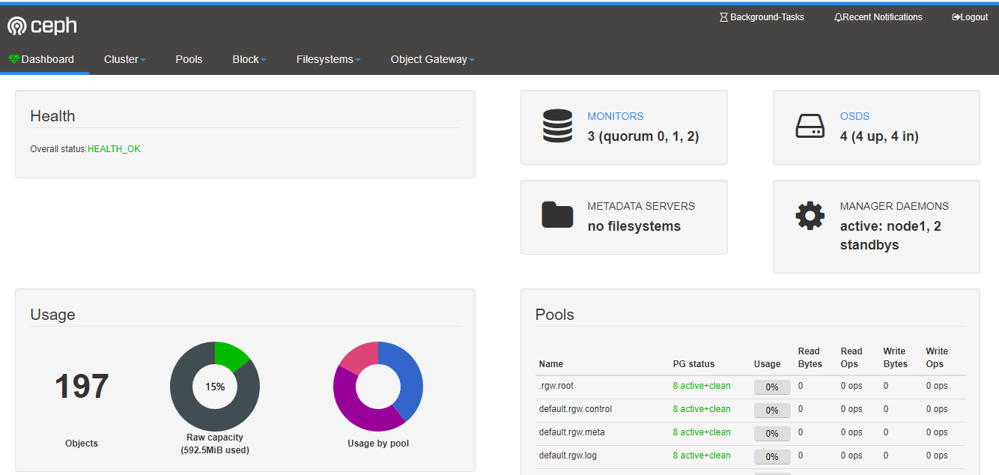
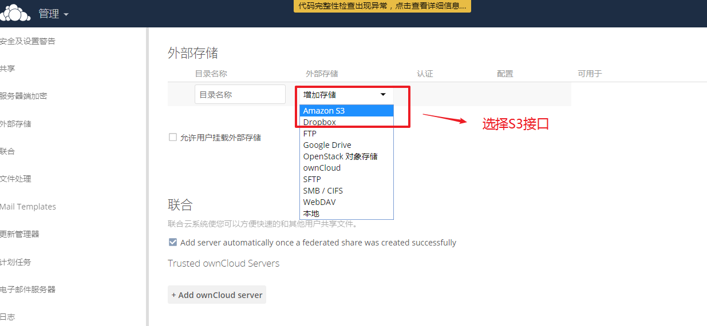

 

# 任务背景

虽然使用了分布式的glusterfs存储, 但是对于爆炸式的数据增长仍然感觉力不从心。对于大数据与云计算等技术的成熟, 存储也需要跟上步伐. 所以这次我们选用**对象存储**.


# 任务要求

1, 搭建ceph集群

2, 实现对象存储的应用


# 任务拆解

1, 了解ceph

2, 搭建ceph集群

3, 了解rados原生数据存取

4, 实现ceph文件存储

5, 实现ceph块存储

6, 实现ceph对象存储


# 学习目标

- [ ] 能够成功部署ceph集群
- [ ] 能够使用ceph共享文件存储,块存储与对象存储
- [ ] 能够说出对象存储的特点


# 一、认识Ceph

Ceph是一个能提供的**文件存储**,**块存储**和**对象存储**的分布式存储系统。它提供了一个可无限伸缩的Ceph存储集群。


# 二、ceph架构

参考官档: https://docs.ceph.com/docs/master/


**RADOS**: Ceph的高可靠,高可拓展,高性能,高自动化都是由这一层来提供的, 用户数据的存储最终也都是通过这一层来进行存储的。

可以说RADOS就是ceph底层原生的数据引擎, 但实际应用时却不直接使用它,而是分为如下4种方式来使用:

* **LIBRADOS**是一个库, 它允许应用程序通过访问该库来与RADOS系统进行交互，支持多种编程语言。如Python,C,C++等.  **简单来说,就是给开发人员使用的接口**。
* **CEPH FS**通过Linux内核客户端和FUSE来提供文件系统。**(文件存储)**
* **RBD**通过Linux内核客户端和QEMU/KVM驱动来提供一个分布式的块设备。**(块存储)**

* **RADOSGW**是一套基于当前流行的RESTFUL协议的网关，并且兼容S3和Swift。**(对象存储)**


## **拓展名词**

**RESTFUL**: RESTFUL是一种架构风格,提供了一组设计原则和约束条件,http就属于这种风格的典型应用。REST最大的几个特点为：资源、统一接口、URI和无状态。

* 资源: 网络上一个具体的信息: 一个文件,一张图片,一段视频都算是一种资源。
* 统一接口:  数据的元操作，即CRUD(create, read, update和delete)操作，分别对应于HTTP方法
  * GET（SELECT）：从服务器取出资源(一项或多项)。
  * POST（CREATE）：在服务器新建一个资源。
  * PUT（UPDATE）：在服务器更新资源(客户端提供完整资源数据)。
  * PATCH（UPDATE）：在服务器更新资源(客户端提供需要修改的资源数据)。
  * DELETE（DELETE）：从服务器删除资源。
* URI(统一资源定位符):  每个URI都对应一个特定的资源。要获取这个资源，访问它的URI就可以。最典型的URI即URL
* 无状态: 一个资源的定位与其它资源无关，不受其它资源的影响。


**S3 (Simple Storage Service 简单存储服务)**: 可以把S3看作是一个超大的硬盘, 里面存放数据资源(文件,图片,视频等),这些资源统称为**对象**.这些对象存放在**存储段**里,在S3叫做**bucket**. 

和硬盘做类比, 存储段(bucket)就相当于目录,对象就相当于文件。

硬盘路径类似`/root/file1.txt`

S3的URI类似`s3://bucket_name/object_name`

  

**swift:** 最初是由Rackspace公司开发的高可用分布式对象存储服务，并于2010年贡献给OpenStack开源社区作为其最初的核心子项目之一.


# 三、Ceph集群

## 集群组件

Ceph集群包括**Ceph OSD**,**Ceph Monitor**两种守护进程。

**Ceph OSD**(Object Storage Device): 功能是存储数据,处理数据的复制、恢复、回填、再均衡,并通过检查其他OSD守护进程的心跳来向Ceph Monitors提供一些监控信息。
**Ceph Monitor**: 是一个监视器,监视Ceph集群状态和维护集群中的各种关系。

Ceph存储集群至少需要一个Ceph Monitor和两个 OSD 守护进程。


## 集群环境准备


**准备工作:**

准备四台服务器，需要能上外网,IP静态固定 (**==除client外每台最少加1个磁盘，最小1G，不用分区==**); 

1, 配置主机名和主机名绑定(**所有节点都要绑定**)

(==**注意:这里都全改成短主机名,方便后面实验。如果你坚持用类似vm1.cluster.com这种主机名,或者加别名的话,ceph会在后面截取你的主机名vm1.cluster.com为vm1,造成不一致导致出错**==)

~~~powershell
# hostnamectl set-hostname --static node1
# vim /etc/hosts
10.1.1.11	node1
10.1.1.12	node2
10.1.1.13	node3
10.1.1.14	client
~~~

2, 关闭防火墙,selinux(**使用iptables -F清一下规则**)

~~~powershell
# systemctl stop firewalld
# systemctl disable firewalld

# iptables -F

# setenforce 0
~~~

3, 时间同步(**==启动ntpd服务并确认所有节点时间一致==**)

~~~powershell
# systemctl restart ntpd
# systemctl enable ntpd
~~~

4, 配置yum源(==**所有节点都要配置,包括client**==)

ceph的yum源方法2种:

* 公网ceph源(**==centos7默认的公网源+epel源+ceph的aliyun源==**)

~~~powershell
# yum install epel-release -y
# vim /etc/yum.repos.d/ceph.repo
[ceph]
name=ceph
baseurl=http://mirrors.aliyun.com/ceph/rpm-mimic/el7/x86_64/
enabled=1
gpgcheck=0
priority=1

[ceph-noarch]
name=cephnoarch
baseurl=http://mirrors.aliyun.com/ceph/rpm-mimic/el7/noarch/
enabled=1
gpgcheck=0
priority=1

[ceph-source]
name=Ceph source packages
baseurl=http://mirrors.aliyun.com/ceph/rpm-mimic/el7/SRPMS
enabled=1
gpgcheck=0
priority=1
~~~

* 本地ceph源(**==centos7默认的公网源+ceph本地源==**)
  * 公网源下载网络慢,而且公网源可能更新会造成问题。可使用下载好的做本地ceph源

将共享的ceph_soft目录拷贝到**所有节点**上(比如:/root/目录下)

~~~powershell
# vim /etc/yum.repos.d/ceph.repo
[local_ceph]
name=local_ceph
baseurl=file:///root/ceph_soft
gpgcheck=0
enabled=1
~~~


## 集群部署过程

### 第1步: 配置ssh免密

**以node1为==部署配置节点==,在node1上配置ssh等效性(要求ssh node1,node2,node3 ,client都要免密码)**

说明: 此步骤不是必要的，做此步骤的目的: 

* 如果使用ceph-deploy来安装集群,密钥会方便安装
* 如果不使用ceph-deploy安装,也可以方便后面操作: 比如同步配置文件

```powershell
[root@node1 ~]# ssh-keygen 
[root@node1 ~]# ssh-copy-id -i node1
[root@node1 ~]# ssh-copy-id -i node2
[root@node1 ~]# ssh-copy-id -i node3
[root@node1 ~]# ssh-copy-id -i client
```

### 第2步: 在node1上安装部署工具

**(其它节点不用安装)**

~~~powershell
[root@node1 ~]# yum install ceph-deploy -y
~~~

### 第3步: 在node1上创建集群

**建立一个集群配置目录**

**==注意: 后面的大部分操作都会在此目录==**

~~~powershell
[root@node1 ~]# mkdir /etc/ceph
[root@node1 ~]# cd /etc/ceph
~~~

**创建一个ceph集群**

~~~powershell
[root@node1 ceph]# ceph-deploy new node1

[root@node1 ceph]# ls
ceph.conf  ceph-deploy-ceph.log  ceph.mon.keyring

说明:
ceph.conf  				集群配置文件
ceph-deploy-ceph.log  	使用ceph-deploy部署的日志记录
ceph.mon.keyring		mon的验证key文件
~~~

### 第4步: ceph集群节点安装ceph

前面准备环境时已经准备好了yum源,在这里==**所有集群节点(不包括client)**==都安装以下软件

~~~powershell
# yum install ceph ceph-radosgw -y

# ceph -v
ceph version 13.2.6 (02899bfda814146b021136e9d8e80eba494e1126) mimic (stable)
~~~

**补充说明:** 

* 如果公网OK,并且网速好的话,可以用`ceph-deploy install node1 node2 node3`命令来安装,但网速不好的话会比较坑
* 所以这里我们选择直接用准备好的本地ceph源,然后`yum install ceph ceph-radosgw -y`安装即可。


### 第5步: 客户端安装`ceph-common`

~~~powershell
[root@client ~]# yum install ceph-common -y
~~~


### 第6步: 创建mon(监控)

**增加public网络用于监控**

~~~powershell
在[global]配置段里添加下面一句（直接放到最后一行)
[root@node1 ceph]# vim /etc/ceph/ceph.conf 	
public network = 10.1.1.0/24			监控网络
~~~

**监控节点初始化,并同步配置到所有节点(node1,node2,node3,不包括client)**

~~~powershell
[root@node1 ceph]# ceph-deploy mon create-initial
[root@node1 ceph]# ceph health			
HEALTH_OK										状态health（健康）

将配置文件信息同步到所有节点
[root@node1 ceph]# ceph-deploy admin node1 node2 node3
~~~

~~~powershell
[root@node1 ceph]# ceph -s
  cluster:
    id:     c05c1f28-ea78-41b7-b674-a069d90553ac
    health: HEALTH_OK							健康状态为OK

  services:
    mon: 1 daemons, quorum node1				1个监控
    mgr: no daemons active
    osd: 0 osds: 0 up, 0 in

  data:
    pools:   0 pools, 0 pgs
    objects: 0  objects, 0 B
    usage:   0 B used, 0 B / 0 B avail
    pgs:
~~~


**为了防止mon单点故障，你可以加多个mon节点(建议奇数个，因为有quorum仲裁投票)**

回顾: 什么是quorum(仲裁,法定人数)? 

~~~powershell
[root@node1 ceph]# ceph-deploy mon add node2	
[root@node1 ceph]# ceph-deploy mon add node3


[root@node1 ceph]# ceph -s
  cluster:
    id:     c05c1f28-ea78-41b7-b674-a069d90553ac
    health: HEALTH_OK								健康状态为OK
 
  services:
    mon: 3 daemons, quorum node1,node2,node3		3个监控
    mgr: no daemons active							
    osd: 0 osds: 0 up, 0 in
 
  data:
    pools:   0 pools, 0 pgs
    objects: 0  objects, 0 B
    usage:   0 B used, 0 B / 0 B avail
    pgs:     
~~~


#### 监控到时间不同步的解决方法

**ceph集群对时间同步要求非常高, 即使你已经将ntpd服务开启,但仍然可能有`clock skew deteted`相关警告**


请做如下尝试:

1, 在ceph集群所有节点上(`node1`,`node2`,`node3`)不使用ntpd服务,直接使用crontab同步

~~~powershell
# systemctl stop ntpd
# systemctl disable ntpd

# crontab -e
*/10 * * * * ntpdate ntp1.aliyun.com				每5或10分钟同步1次公网的任意时间服务器
~~~

2, 调大时间警告的阈值

~~~powershell
[root@node1 ceph]# vim ceph.conf
[global]								在global参数组里添加以下两行						
......
mon clock drift allowed = 2				# monitor间的时钟滴答数(默认0.5秒)
mon clock drift warn backoff = 30		# 调大时钟允许的偏移量(默认为5)
~~~

3, 同步到所有节点

~~~powershell
[root@node1 ceph]# ceph-deploy --overwrite-conf admin node1 node2 node3

前面第1次同步不需要加--overwrite-conf参数
这次修改ceph.conf再同步就需要加--overwrite-conf参数覆盖
~~~

4, **所有ceph集群节点**上重启ceph-mon.target服务

~~~powershell
# systemctl restart ceph-mon.target
~~~


### 第7步: 创建mgr(管理)

ceph luminous版本中新增加了一个组件：Ceph Manager Daemon，简称ceph-mgr。

 该组件的主要作用是分担和扩展monitor的部分功能，减轻monitor的负担，让更好地管理ceph存储系统。

**创建一个mgr**

~~~powershell
[root@node1 ceph]# ceph-deploy mgr create node1

[root@node1 ceph]# ceph -s
  cluster:
    id:     c05c1f28-ea78-41b7-b674-a069d90553ac
    health: HEALTH_OK

  services:
    mon: 3 daemons, quorum node1,node2,node3
    mgr: node1(active)							node1为mgr
    osd: 0 osds: 0 up, 0 in

  data:
    pools:   0 pools, 0 pgs
    objects: 0  objects, 0 B
    usage:   0 B used, 0 B / 0 B avail
    pgs:

~~~

**添加多个mgr可以实现HA**

~~~powershell
[root@node1 ceph]# ceph-deploy mgr create node2
[root@node1 ceph]# ceph-deploy mgr create node3

[root@node1 ceph]# ceph -s
  cluster:
    id:     c05c1f28-ea78-41b7-b674-a069d90553ac
    health: HEALTH_OK								健康状态为OK
 
  services:
    mon: 3 daemons, quorum node1,node2,node3		3个监控
    mgr: node1(active), standbys: node2, node3		看到node1为主,node2,node3为备
    osd: 0 osds: 0 up, 0 in							看到为0个磁盘
 
  data:
    pools:   0 pools, 0 pgs
    objects: 0  objects, 0 B
    usage:   0 B used, 0 B / 0 B avail
    pgs:     
~~~


### 第8步: 创建osd(存储盘)

~~~powershell
[root@node1 ceph]# ceph-deploy disk --help

[root@node1 ceph]# ceph-deploy osd --help
~~~

列表所有节点的磁盘,都有sda和sdb两个盘,sdb为我们要加入分布式存储的盘

~~~powershell
列表查看节点上的磁盘
[root@node1 ceph]# ceph-deploy disk list node1
[root@node1 ceph]# ceph-deploy disk list node2
[root@node1 ceph]# ceph-deploy disk list node3


zap表示干掉磁盘上的数据,相当于格式化
[root@node1 ceph]# ceph-deploy disk zap node1 /dev/sdb
[root@node1 ceph]# ceph-deploy disk zap node2 /dev/sdb
[root@node1 ceph]# ceph-deploy disk zap node3 /dev/sdb

将磁盘创建为osd
[root@node1 ceph]# ceph-deploy osd create --data /dev/sdb node1
[root@node1 ceph]# ceph-deploy osd create --data /dev/sdb node2
[root@node1 ceph]# ceph-deploy osd create --data /dev/sdb node3
~~~

~~~powershell
[root@node1 ceph]# ceph -s
  cluster:
    id:     c05c1f28-ea78-41b7-b674-a069d90553ac
    health: HEALTH_OK
 
  services:
    mon: 3 daemons, quorum node1,node2,node3
    mgr: node1(active), standbys: node2, node3
    osd: 3 osds: 3 up, 3 in									看到这里有3个osd
 
  data:
    pools:   0 pools, 0 pgs
    objects: 0  objects, 0 B
    usage:   41 MiB used, 2.9 GiB / 3.0 GiB avail			大小为3个磁盘的总和
    pgs:  
~~~


osd都创建好了，那么怎么存取数据呢?


## 集群节点的扩容方法

假设再加一个新的集群节点node4

1, 主机名配置和绑定

2, 在node4上`yum install ceph ceph-radosgw -y`安装软件

3, 在部署节点node1上同步配置文件给node4. `ceph-deploy admin node4`

4, 按需求选择在node4上添加mon或mgr或osd等


# 四、RADOS原生数据存取演示

上面提到了RADOS也可以进行数据的存取操作, 但我们一般不直接使用它，但我们可以先用RADOS的方式来深入了解下ceph的数据存取原理。


## 存取原理

要实现数据存取需要创建一个pool,创建pool要先分配PG。


如果客户端对一个pool写了一个文件, 那么这个文件是如何分布到多个节点的磁盘上呢?

答案是通过**CRUSH算法**。


**CRUSH算法**

* CRUSH(Controlled Scalable Decentralized Placement of Replicated Data)算法为可控的,可扩展的,分布式的副本数据放置算法的简称。

* PG到OSD的映射的过程算法叫做CRUSH 算法。(一个Object需要保存三个副本，也就是需要保存在三个osd上)。

* CRUSH算法是一个伪随机的过程，他可以从所有的OSD中，随机性选择一个OSD集合，但是同一个PG每次随机选择的结果是不变的，也就是映射的OSD集合是固定的。


**小结:** 

* 客户端直接对pool操作(但文件存储,块存储,对象存储我们不这么做)
* pool里要分配PG
* PG里可以存放多个对象
* 对象就是由客户端写入的数据分离的单位
* CRUSH算法将客户端写入的数据映射分布到OSD,从而最终存放到物理磁盘上(这个具体过程是抽象的,我们运维工程师可不用再深挖,因为分布式存储对于运维工程师来说就一个大硬盘)


## 创建pool

创建test_pool,指定pg数为128

~~~powershell
[root@node1 ceph]# ceph osd pool create test_pool 128
pool 'test_pool' created
~~~

查看pg数量,可以使用ceph osd pool set test_pool pg_num 64这样的命令来尝试调整

~~~powershell
[root@node1 ceph]# ceph osd pool get test_pool pg_num
pg_num: 128
~~~

说明: **pg数与ods数量有关系**

* pg数为2的倍数,一般5个以下osd,分128个PG或以下即可(分多了PG会报错的,可按报错适当调低)
* 可以使用`ceph osd pool set test_pool pg_num 64`这样的命令来尝试调整


## 存储测试

1, 我这里把本机的/etc/fstab文件上传到test_pool,并取名为newfstab

~~~powershell
[root@node1 ceph]# rados put newfstab /etc/fstab --pool=test_pool
~~~

2, 查看

~~~powershell
[root@node1 ceph]# rados -p test_pool ls
newfstab
~~~

3, 删除

~~~powershell
[root@node1 ceph]# rados rm newfstab --pool=test_pool
~~~


## 删除pool

1, 在部署节点node1上增加参数允许ceph删除pool

~~~powershell
[root@node1 ceph]# vim /etc/ceph/ceph.conf 
mon_allow_pool_delete = true
~~~

2, 修改了配置, 要同步到其它集群节点

~~~powershell
[root@node1 ceph]# ceph-deploy --overwrite-conf admin node1 node2 node3
~~~

3, 重启监控服务

~~~powershell
[root@node1 ceph]# systemctl restart ceph-mon.target
~~~

4, 删除时pool名输两次，后再接`--yes-i-really-really-mean-it`参数就可以删除了

~~~powershell
[root@node1 ceph]# ceph osd pool delete test_pool test_pool --yes-i-really-really-mean-it
~~~


# 五、创建Ceph文件存储

要运行Ceph文件系统, 你必须先创建至少带一个mds的Ceph存储集群.

(Ceph块设备和Ceph对象存储不使用MDS)。

**Ceph MDS**: Ceph文件存储类型存放与管理==元数据metadata==的服务


## 创建文件存储并使用

第1步: 在node1部署节点上同步配置文件,并创建mds服务(也可以做多个mds实现HA)

~~~powershell
[root@node1 ceph]# ceph-deploy mds create node1 node2 node3
我这里做三个mds
~~~

第2步:  一个Ceph文件系统需要至少两个RADOS存储池，一个用于数据，一个用于元数据。所以我们创建它们。

~~~powershell
[root@node1 ceph]# ceph osd pool create cephfs_pool 128
pool 'cephfs_pool' created
[root@node1 ceph]# ceph osd pool create cephfs_metadata 64
pool 'cephfs_metadata' created

[root@node1 ceph]# ceph osd pool ls |grep cephfs
cephfs_pool
cephfs_metadata
~~~

第3步: 创建Ceph文件系统,并确认客户端访问的节点

~~~powershell
[root@node1 ceph]# ceph fs new cephfs cephfs_metadata cephfs_pool
[root@node1 ceph]# ceph fs ls
name: cephfs, metadata pool: cephfs_metadata, data pools: [cephfs_pool ]

[root@node1 ceph]# ceph mds stat
cephfs-1/1/1 up  {0=ceph_node3=up:active}, 2 up:standby		这里看到node3为up状态
~~~

第4步: 客户端准备验证key文件 

* 说明: ceph默认启用了cephx认证, 所以客户端的挂载必须要验证

在集群节点(node1,node2,node3)上任意一台查看密钥字符串

~~~powershell
[root@node1 ~]# cat /etc/ceph/ceph.client.admin.keyring
[client.admin]
        key = AQDEKlJdiLlKAxAARx/PXR3glQqtvFFMhlhPmw==		后面的字符串就是验证需要的
        caps mds = "allow *"
        caps mgr = "allow *"
        caps mon = "allow *"
        caps osd = "allow *"
~~~

在客户端上创建一个文件记录密钥字符串

~~~powershell
[root@client ~]# vim admin.key			# 创建一个密钥文件,复制粘贴上面得到的字符串
AQDEKlJdiLlKAxAARx/PXR3glQqtvFFMhlhPmw==
~~~

第5步:  客户端挂载(**挂载ceph集群中跑了mon监控的节点, mon监控为6789端口**)

~~~powershell
[root@client ~]# mount -t ceph node1:6789:/ /mnt -o name=admin,secretfile=/root/admin.key
~~~

第6步: 验证

~~~powershell
[root@client ~]# df -h |tail -1
node1:6789:/  3.8G     0  3.8G   0% /mnt # 大小不用在意,场景不一样,pg数,副本数都会影响
~~~


如要验证读写请自行验证

可以使用两个客户端, 同时挂载此文件存储,可实现同读同写


## 删除文件存储方法

**如果需要删除文件存储,请按下面操作过程来操作**

第1步: 在客户端上删除数据,并umount所有挂载

~~~powershell
[root@client ~]# rm /mnt/* -rf
[root@client ~]# umount /mnt/
~~~

第2步: 停掉所有节点的mds(只有停掉mds才能删除文件存储)

~~~powershell
[root@node1 ~]# systemctl stop ceph-mds.target
[root@node2 ~]# systemctl stop ceph-mds.target
[root@node3 ~]# systemctl stop ceph-mds.target
~~~

第3步: 回到集群任意一个节点上(node1,node2,node3其中之一)删除

==如果要客户端删除,需要在node1上`ceph-deploy admin client`同步配置才可以==

~~~powershell
[root@client ~]# ceph fs rm cephfs --yes-i-really-mean-it

[root@client ~]# ceph osd pool delete cephfs_metadata cephfs_metadata --yes-i-really-really-mean-it
pool 'cephfs_metadata' removed

[root@client ~]# ceph osd pool delete cephfs_pool cephfs_pool --yes-i-really-really-mean-it
pool 'cephfs_pool' removed
~~~

第4步: 再次mds服务再次启动

~~~powershell
[root@node1 ~]# systemctl start ceph-mds.target
[root@node2 ~]# systemctl start ceph-mds.target
[root@node3 ~]# systemctl start ceph-mds.target
~~~


# 六、创建Ceph块存储

## 创建块存储并使用

第1步: 在node1上同步配置文件到client

~~~powershell
[root@node1 ceph]# ceph-deploy admin client
~~~

第2步:建立存储池,并初始化

**==注意:在客户端操作==**

~~~powershell
[root@client ~]# ceph osd pool create rbd_pool 128		
pool 'rbd_pool' created

[root@client ~]# rbd pool init rbd_pool
~~~

第3步:创建一个存储卷(我这里卷名为volume1,大小为5000M)

**注意: volume1的专业术语为image, 我这里叫存储卷方便理解**

~~~powershell
[root@client ~]# rbd create volume1 --pool rbd_pool --size 5000

[root@client ~]# rbd ls rbd_pool
volume1

[root@client ~]# rbd info volume1 -p rbd_pool
rbd image 'volume1':						可以看到volume1为rbd image
        size 4.9 GiB in 1250 objects
        order 22 (4 MiB objects)
        id: 149256b8b4567
        block_name_prefix: rbd_data.149256b8b4567
        format: 2							格式有1和2两种,现在是2
        features: layering, exclusive-lock, object-map, fast-diff, deep-flatten   特性
        op_features:
        flags:
        create_timestamp: Sat Aug 17 19:47:51 2019
~~~

第4步: 将创建的卷映射成块设备

* 因为rbd镜像的一些特性，OS kernel并不支持，所以映射报错

~~~powershell
[root@client ~]# rbd map rbd_pool/volume1
rbd: sysfs write failed
RBD image feature set mismatch. You can disable features unsupported by the kernel with "rbd feature disable rbd_pool/volume1 object-map fast-diff deep-flatten".
In some cases useful info is found in syslog - try "dmesg | tail".
rbd: map failed: (6) No such device or address
~~~

* 解决方法: disable掉相关特性

~~~powershell
[root@client ~]# rbd feature disable rbd_pool/volume1 exclusive-lock object-map fast-diff deep-flatten
~~~

* 再次映射

~~~powershell
[root@client ~]# rbd map rbd_pool/volume1
/dev/rbd0
~~~

第5步: 查看映射(如果要取消映射, 可以使用`rbd unmap /dev/rbd0`)

~~~powershell
[root@client ~]# rbd showmapped
id pool     image   snap device    
0  rbd_pool volume1 -    /dev/rbd0
~~~

第6步: 格式化,挂载

~~~powershell
[root@client ~]# mkfs.xfs /dev/rbd0

[root@client ~]# mount /dev/rbd0 /mnt/

[root@client ~]# df -h |tail -1
/dev/rbd0        4.9G   33M  4.9G   1%   /mnt
~~~

可自行验证读写

**==注意: 块存储是不能实现同读同写的,请不要两个客户端同时挂载进行读写==**


## 块存储扩容与裁减

在线扩容

经测试,分区后`/dev/rbd0p1`不能在线扩容,直接使用`/dev/rbd0`才可以

~~~powershell
扩容成8000M
[root@client ~]# rbd resize --size 8000 rbd_pool/volume1

[root@client ~]# rbd info rbd_pool/volume1  |grep size
        size 7.8 GiB in 2000 objects


查看大小,并没有变化
[root@client ~]# df -h |tail -1
/dev/rbd0        4.9G   33M  4.9G   1%   /mnt

[root@client ~]# xfs_growfs -d /mnt/
再次查看大小,在线扩容成功
[root@client ~]# df -h |tail -1
/dev/rbd0        7.9G   33M  7.9G   1%   /mnt
~~~

块存储裁减

不能在线裁减.裁减后需重新格式化再挂载，所以请提前备份好数据.

~~~powershell
再裁减回5000M
[root@client ~]# rbd resize --size 5000 rbd_pool/volume1 --allow-shrink

重新格式化挂载
[root@client ~]# umount /mnt/
[root@client ~]# mkfs.xfs -f /dev/rbd0
[root@client ~]# mount /dev/rbd0 /mnt/
再次查看,确认裁减成功
[root@client ~]# df -h |tail -1
/dev/rbd0        4.9G   33M  4.9G   1%   /mnt
~~~


## 删除块存储方法

~~~powershell
[root@client ~]# umount /mnt/

[root@client ~]# rbd unmap /dev/rbd0

[root@client ~]# ceph osd pool delete rbd_pool rbd_pool --yes-i-really-really-mean-it
pool 'rbd_pool' removed
~~~


# 七、Ceph对象存储

## 测试ceph对象网关的连接

第1步: 在node1上创建rgw

~~~powershell
[root@node1 ceph]# ceph-deploy rgw create node1
[root@node1 ceph]# lsof -i:7480
COMMAND  PID USER   FD   TYPE DEVICE SIZE/OFF NODE NAME
radosgw 6748 ceph   40u  IPv4  49601      0t0  TCP *:7480 (LISTEN)
~~~


第2步: 在客户端测试连接对象网关

~~~powershell
创建一个测试用户,需要在部署节点使用ceph-deploy admin client同步配置文件给client
[root@client ~]# radosgw-admin user create --uid="testuser" --display-name="First User"
{
    "user_id": "testuser",
    "display_name": "First User",
    "email": "",
    "suspended": 0,
    "max_buckets": 1000,
    "auid": 0,
    "subusers": [],
    "keys": [
        {
            "user": "testuser",
            "access_key": "36ROCI84S5NSP4BPYL01",
            "secret_key": "jBOKH0v6J79bn8jaAF2oaWU7JvqTxqb4gjerWOFW"
        }
    ],
    "swift_keys": [],
    "caps": [],
    "op_mask": "read, write, delete",
    "default_placement": "",
    "placement_tags": [],
    "bucket_quota": {
        "enabled": false,
        "check_on_raw": false,
        "max_size": -1,
        "max_size_kb": 0,
        "max_objects": -1
    },
    "user_quota": {
        "enabled": false,
        "check_on_raw": false,
        "max_size": -1,
        "max_size_kb": 0,
        "max_objects": -1
    },
    "temp_url_keys": [],
    "type": "rgw",
    "mfa_ids": []
}
~~~


上面一大段主要有用的为access_key与secret_key，用于连接对象存储网关

~~~powershell
[root@client ~]# radosgw-admin user create --uid='testuser' --display-name='First User' |grep -E 'access_key|secret_key'
            "access_key": "36ROCI84S5NSP4BPYL01",
            "secret_key": "jBOKH0v6J79bn8jaAF2oaWU7JvqTxqb4gjerWOFW"
~~~


## S3连接ceph对象网关

AmazonS3是一种面向Internet的对象存储服务.我们这里可以使用s3工具连接ceph的对象存储进行操作


第1步: 客户端安装s3cmd工具,并编写ceph连接配置文件

~~~powershell
[root@client ~]# yum install s3cmd

创建并编写下面的文件,key文件对应前面创建测试用户的key
[root@client ~]# vim /root/.s3cfg
[default]
access_key = 36ROCI84S5NSP4BPYL01  #复制上一步生成key
secret_key = jBOKH0v6J79bn8jaAF2oaWU7JvqTxqb4gjerWOFW 
host_base = 10.1.1.11:7480    #配置要连接的ip
host_bucket = 10.1.1.11:7480/%(bucket)
cloudfront_host = 10.1.1.11:7480
use_https = False
~~~

第2步: 命令测试

~~~powershell
列出bucket,可以查看到先前测试创建的my-new-bucket
[root@client ~]# s3cmd ls
2019-01-05 23:01  s3://my-new-bucket
再建一个桶
[root@client ~]# s3cmd mb s3://test_bucket
上传文件到桶
[root@client ~]# s3cmd put /etc/fstab s3://test_bucket
upload: '/etc/fstab' -> 's3://test_bucket/fstab'  [1 of 1]
 501 of 501   100% in    1s   303.34 B/s  done
下载到当前目录
[root@client ~]# s3cmd get s3://test_bucket/fstab

更多命令请见参考命令帮助
[root@client ~]# s3cmd --help
~~~


# ceph dashboard(拓展)

通过ceph dashboard完成对ceph存储系统可视化监视。

第1步：查看集群状态确认mgr的active节点

```powershell
[root@node1 ~]# ceph -s
  cluster:
    id:     6788206c-c4ea-4465-b5d7-ef7ca3f74552
    health: HEALTH_OK

  services:
    mon: 3 daemons, quorum node1,node2,node3
    mgr: node1(active), standbys: node3, node2		 	确认mgr的active节点为node1
    osd: 4 osds: 4 up, 4 in
    rgw: 1 daemon active

  data:
    pools:   6 pools, 48 pgs
    objects: 197  objects, 2.9 KiB
    usage:   596 MiB used, 3.4 GiB / 4.0 GiB avail
    pgs:     48 active+clean
```

第2步：开启dashboard模块

```powershell
[root@node1 ~]# ceph mgr module enable dashboard
```

第3步：创建自签名证书

```powershell
[root@node1 ~]# ceph dashboard create-self-signed-cert
Self-signed certificate created
```

第4步: 生成密钥对,并配置给ceph mgr

```powershell
[root@node1 ~]# mkdir /etc/mgr-dashboard

[root@node1 ~]# cd /etc/mgr-dashboard/

[root@node1 mgr-dashboard]# openssl req -new -nodes -x509 -subj "/O=IT-ceph/CN=cn" -days 365 -keyout dashboard.key -out dashboard.crt -extensions v3_ca
Generating a 2048 bit RSA private key
.+++
.....+++
writing new private key to 'dashboard.key'
-----

[root@node1 mgr-dashboard]# ls
dashboard.crt  dashboard.key
```


第5步: 在ceph集群的active mgr节点上(我这里为node1)配置mgr services

使用dashboard服务，主要配置dashboard使用的IP及Port

```powershell
[root@node1 mgr-dashboard]# ceph config set mgr mgr/dashboard/server_addr 10.1.1.11
[root@node1 mgr-dashboard]# ceph config set mgr mgr/dashboard/server_port 8080
```

第6步: 重启dashboard模块,并查看访问地址

~~~powershell
[root@node1 mgr-dashboard]# ceph mgr module disable dashboard                 
[root@node1 mgr-dashboard]# ceph mgr module enable dashboard                    

[root@node1 mgr-dashboard]# ceph mgr services
{
    "dashboard": "https://10.1.1.11:8080/"
}
~~~

第7步：设置访问web页面用户名和密码

```powershell
[root@node1 mgr-dashboard]# ceph dashboard set-login-credentials daniel daniel123
Username and password updated
```

第8步：通过本机或其它主机访问





# ceph对象存储结合owncloud打造云盘(拓展)


1,在ceph的客户端上准备好bucket和相关的连接key

~~~powershell
[root@client ~]# s3cmd mb s3://owncloud
Bucket 's3://owncloud/' created

[root@client ~]# cat /root/.s3cfg
[default]
access_key = 36ROCI84S5NSP4BPYL01
secret_key = jBOKH0v6J79bn8jaAF2oaWU7JvqTxqb4gjerWOFW 
host_base = 10.1.1.11:7480
host_bucket = 10.1.1.11:7480/%(bucket)
cloudfront_host = 10.1.1.11:7480
use_https = False
~~~

2, 在client端安装owncloud云盘运行所需要的web环境

owncloud需要web服务器和php支持. 目前最新版本owncloud需要php7.x版本,在这里我们为了节省时间,使用rpm版安装 

~~~powershell
[root@client ~]# yum install httpd mod_ssl php-mysql php php-gd php-xml php-mbstring -y

[root@client ~]# systemctl restart httpd
~~~

3, 上传owncloud软件包, 并解压到httpd家目录

~~~powershell
[root@client ~]# tar xf owncloud-9.0.1.tar.bz2 -C /var/www/html/

[root@client ~]# chown apache.apache -R /var/www/html/
需要修改为运行web服务器的用户owner,group,否则后面写入会出现权限问题
~~~

4,  通过浏览器访问`http:10.1.1.14/owncloud`,进行配置





5, 文件上传下载测试

~~~powershell
[root@client ~]# s3cmd put /etc/fstab s3://owncloud
upload: '/etc/fstab' -> 's3://owncloud/fstab'  [1 of 1]
 501 of 501   100% in    0s     6.64 kB/s  done
~~~


因为默认owncloud上传文件有限制,不能超过2M。所以需要修改

~~~powershell
[root@client ~]# vim /var/www/html/owncloud/.htaccess

<IfModule mod_php5.c>
  php_value upload_max_filesize 2000M				修改调大
  php_value post_max_size 2000M						修改调大


[root@client ~]# vim /etc/php.ini

post_max_size = 2000M								修改调大		
upload_max_filesize = 2000M							修改调大

[root@client ~]# systemctl restart httpd
~~~


 