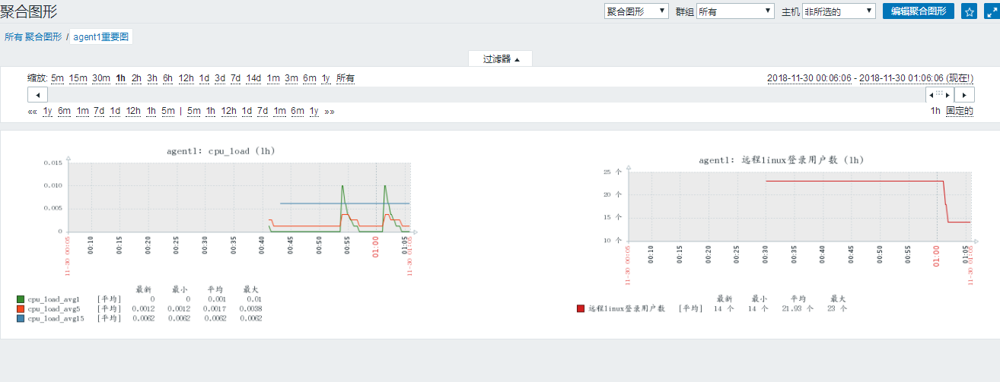

# 任务背景

公司的服务器里经常会有CPU很繁忙, 内存不够, 磁盘空间快满了, 网络很卡, 客户端连接不上等各种问题。我们运维工程师不能总是盯着服务器去查看，那样的话就太繁琐了, 而且很可能发现问题不及时。所以我们需要建立一套完善的监控系统，将所有需要监控的服务器及其各种需要的状态数据都实时地**收集**, 并**图形化的展示**，并可以进行**报警**, 让机器主动及时地与人沟通。


# 任务要求

1, 搭建监控服务器

2, 能够按照思路自定义监控并实现图形展示与报警


# 任务拆解

1, zabbix服务器搭建

2, 监控本机与远程主机

3, 学会创建监控项

4, 为监控项创建图形

5, 为图形创建触发器

6, 设定报警


# **学习目标**

- [ ] 能够安装zabbix服务器

- [ ] 能够使用zabbix-agent监控本机

- [ ] 能够管理zabbix用户与用户群组

- [ ] 能够使用zabbix-agent监控远程linux机器并加入主机群组

- [ ] 能够添加一个自定义监控项

- [ ] 能够为添加的监控项创建图形

- [ ] 能够为监控主机创建聚合图形

- [ ] 能够为监控项设定简单的触发器


 

# 认识监控

**为什么要监控?**

答: 实时收集数据，通过报警及时发现问题，及时处理。数据为优化也可以提供依据。


**生活中的监控:**


那么**请问linux系统中的监控主要监控什么**?

答: 任何你所想要监控的数据,如cpu负载,cpu的idle时间,内存使用量,内存利用率,io,network等等。


## 主流的开源监控平台介绍

* **mrtg**	(Multi Router Traffic Grapher)通过**snmp**协议得到设备的流量信息，并以包含PNG格式的图形的HTML文档方式显示给用户。

* **cacti**       (仙人掌) 用php语言实现的一个软件，它的主要功能是用snmp服务获取数据，然后用rrdtool储存和更新数据。官网地址: https://www.cacti.net/
* **ntop**      官网地址: https://www.ntop.org/
* **nagios**   能够跨平台,插件多,报警功能强大。官网地址: https://www.nagios.org/
* **centreon**  底层使用的就是nagios。是一个nagios整合版软件。官网地址:https://www.centreon.com/
* **ganglia**    设计用于测量数以千计的节点,资源消耗非常小。官网地址:http://ganglia.info/
* **open-falcon**  小米发布的运维监控软件，高效率，高可用。时间较短，用户基数小。官网地址: http://open-falcon.org/
* **==zabbix==**     跨平台，画图，多条件告警，多种API接口。使用基数特别大。官网地址: https://www.zabbix.com/
* **==prometheus==**   是一个基于时间序列的数值数据的容器监控解决方案。官网地址: https://prometheus.io/


# zabbix

**环境准备:**


1. 静态ip 

2. 主机名

~~~powershell
各自配置好主机名
# hostnamectl set-hostname --static zabbixserver.cluster.com
三台都互相绑定IP与主机名
# vim /etc/hosts			
10.1.1.11  zabbixserver.cluster.com
10.1.1.12  agent1.cluster.com
10.1.1.13  agent2.cluster.com
~~~

3. 时间同步

~~~powershell
# systemctl restart ntpd
# systemctl enable ntpd
~~~

3. 关闭防火墙,selinux

~~~powershell
# systemctl stop firewalld
# systemctl disable firewalld
# iptables -F

# setenforce 0
setenforce: SELinux is disabled
~~~

3. 配置yum(安装完centos后默认的yum源+下面zabbix源)

~~~powershell
所有机器(zabbix服务器和所有被监控端)加上zabbix源
# vim /etc/yum.repos.d/zabbix.repo
[zabbix]
name=zabbix
baseurl=https://mirrors.tuna.tsinghua.edu.cn/zabbix/zabbix/3.4/rhel/7/x86_64/
enabled=1
gpgcheck=0
[zabbix_deps]
name=zabbix_deps
baseurl=https://mirrors.tuna.tsinghua.edu.cn/zabbix/non-supported/rhel/7/x86_64/
enabled=1
gpgcheck=0
~~~


## zabbix服务器安装


1,安装zabbix和mariadb数据库

~~~powershell
[root@zabbixserver ~]# yum install zabbix-server-mysql zabbix-web-mysql mariadb-server
~~~

2, 在mysql(mariadb)里建立存放数据的库并授权，然后导入zabbix所需要用的表和数据

~~~powershell
[root@zabbixserver ~]# systemctl restart mariadb.service
[root@zabbixserver ~]# systemctl enable mariadb.service

[root@zabbixserver ~]# mysql
MariaDB [(none)]> create database zabbix default charset utf8;		这里一定要用utf8字符集，否则后面zabbix很多中文用不了(比如创建中文名用户就创建不了)
MariaDB [(none)]> grant all on zabbix.* to zabbix@'localhost' identified by '123';
MariaDB [(none)]> flush privileges;
MariaDB [(none)]> quit
~~~

3, 导入表数据

~~~powershell
下面这条命令不要乱复制粘贴,如果你版本不一样(或者官网yum源版本升级),3.4.15就要改成对应版本
[root@zabbixserver ~]# zcat /usr/share/doc/zabbix-server-mysql-3.4.15/create.sql.gz |mysql -u zabbix -p123 zabbix
~~~

4, 配置zabbix主配置文件，并启动服务,确认端口

找到并确认如下参数（**==默认值正确的不用打开注释==**.默认值不对的，要修改正确并打开注释）

~~~powershell
我这里只需要改连接数据的密码和socket
[root@zabbixserver ~]# vim /etc/zabbix/zabbix_server.conf
ListenPort=10051
DBHost=localhost
DBName=zabbix
DBUser=zabbix
DBPassword=123						--这里要对应上面第2步的授权进行修改
DBSocket=/var/lib/mysql/mysql.sock 	--这里默认的socket路径不对，改成我这个路径
ListenIP=0.0.0.0

[root@zabbixserver ~]# systemctl restart zabbix-server
[root@zabbixserver ~]# systemctl enable zabbix-server

[root@zabbixserver ~]# lsof -i:10051	
~~~

5, 配置zabbix的httpd子配置文件,并启动httpd

~~~powershell
打开第20行注释，并修改成你的时区
[root@zabbixserver ~]# vim /etc/httpd/conf.d/zabbix.conf

20 php_value date.timezone Asia/Shanghai

[root@zabbixserver ~]# systemctl restart httpd 
[root@zabbixserver ~]# systemctl enable httpd
~~~

6, 使用浏览器访问http://10.1.1.11/zabbix，并按提示进行安装

~~~powershell
按照图示过程安装
1,welcome
2,Check of pre-requisites
3,Configure DB connection
数据库用户名填zabbix,密码填123（前面授权过的）
4,Zabbix server details
在name选项填上你zabbix服务器的IP或者主机名
5,Pre-Installation summary
6,install

完成后
登陆用户名为:admin
登陆密码为:zabbix
~~~

7,右上角点一个类似小人的图标   --》 语言选 chinese zh-cn  --》 点 update后换成中文件界面


## 监控本机

1.在master上安装zabbix-agent

~~~powershell
[root@zabbixserver ~]# yum install zabbix-agent
~~~

2,启动zabbix-agent服务

```powershell
[root@zabbixserver ~]# vim /etc/zabbix/zabbix_agentd.conf	
下面两个常见选项都为默认值，不用配置
Server=127.0.0.1		--zabbix服务器的IP，这里是本机
ListenPort=10050		--监控服务器连接被监控客户端的端口

[root@zabbixserver ~]# systemctl restart zabbix-agent
[root@zabbixserver ~]# systemctl enable  zabbix-agent

[root@zabbixserver ~]# lsof -i:10050
```

3,回到web管理界面 －－》点配置－－》点主机－－》默认看到叫Zabbix server的本机，但状态是停用的－－》点击并启用


4,点zabbix server里的图形－－》任意选一张图后点预览－－》看到图上有乱码


5, 解决乱码方法: 换一个字体

~~~powershell
下载我共享的ttf-arphic-ukai.tar.gz软件包,并做如下修改
# tar xf ttf-arphic-ukai.tar.gz -C /usr/share/zabbix/fonts/
# mv /usr/share/zabbix/fonts/ukai.ttc /usr/share/zabbix/fonts/ukai.ttf
# vim /usr/share/zabbix/include/defines.inc.php

54 define('ZBX_GRAPH_FONT_NAME',           'ukai');   --修改原来的graphfont字体改成ukai
~~~

6, 做完后,不用重启服务,回到zabbix的web界面刷新查看图形就会发现没有乱码了


## 通过zabbix-agent监控远程机器

1,在agent1上安装zabbix-agent包

~~~powershell
[root@agent1 ~]# yum install zabbix-agent
~~~

2,配置zabbix-agent端的配置文件,启动服务并做成开机自动启动

~~~powershell
[root@agent1 ~]# vim /etc/zabbix/zabbix_agentd.conf

97 Server=10.1.1.11				修改成zabbix监控服务器的IP

[root@agent1 ~]# systemctl restart zabbix-agent
[root@agent1 ~]# systemctl enable zabbix-agent

[root@agent1 ~]# lsof -i:10050
~~~

3, 回到web管理界面－－》点配置－－》点主机 －－》 点创建主机


4,为主机添加要监控的模板－－》点模板－－》点选择－－》把 Template OS Linux　前面打勾(其它模板视随意加)－－》点选择 －－》点添加 －－》最后点右下角的添加


5,确认


## zabbix用户与用户群组

**用户(user)**：zabbix提供多用户管理,不同的用户可以设置不同的权限,不同的语言,不同的报警方式等。


web管理界面－－》管理 －－》用户


**用户群组(group)**: 对用户进行分组管理.


web管理界面－－》管理 －－》用户群组


**练习:** 

1. 添加一个用户群组叫usergroup1
2. 再添加一个用户叫张三,加入usergroup1组和Zabbix administrators组


## 主机和主机群组

**主机(host)**: 指被监控的一个设备(服务器,交换机等)


web管理界面－－》管理 －－》主机

前面监控本机和远程机器时操作过，这里不再截图


**主机群组(hostgroup)**: 指被监控的一组主机（主要应用在有特别多主机的情况，方便分组区分)


web管理界面－－》管理 －－》主机群组


练习: 把前面做的agent1这个被监控端加入一个新的组，组名为webservers，也保留agent1属于原来的Linux servers组。


## 监控项与应用集(重点)

**监控项(item)**: 是从主机收集的数据信息,代表收集数据或监控的一个**最小单位**。

**应用集(applications)**: 代表多个监控项目合成的组。


### 创建监控项

web管理界面－－》配置－－》主机－－》监控项（**这里我选的agent1的主机的监控项**;也就是说每个主机都是各自的监控项，选谁的就是配置谁的)－－》右上角点创建监控项


上面创建的agent.hostname默认就在Template OS Linux模板里，也就是说**已经被使用了，就不允许你创建**了。


**==注意: 监控项的键值写法是难点，如果不知道应该怎么传参数，可以参考模板里已经有的监控项。==**

**练习:** **把agent1已经链接的模板取消**(因为cpu负载的监控项在Template OS Linux模板里也已经存在了)，然后参考下图为agent1创建以下几个监控项

1. cpu负载(1分钟） 
2. cpu负载(5分钟)
3. cpu负载(15分钟)


**答案:**


按下图所示创建三个监控项


### 为监控项创建图形

web管理界面－－》配置－－》主机－－》图形(选agent1主机的图形)－－》右上角点创建图形－－》选择图形名称，并在下面添加刚才定义好的监控项－－》添加后，预览图形


过一段时间后的图形效果如下:


### 自定义监控项

自带的键值用得还是不习惯，或者有些想监控的却没有相关的键值，我们还可以**自定义键值**。

下面我们就来创建一个自定义的监控项：

监控agent1上的用户登录数(默认有一个键值叫system.users.num可以实现监控登录用户数，但我这里实验使用的是自己定义的键值)

1, 在被监控端agent1上，随意多打开几个终端，模拟多个登录用户

~~~powershell
[root@agent1 ~]# who |wc -l
14						我这里确认登录用户数为14
~~~

2, 在被监控端agent1上，定义用户参数

~~~powershell
[root@agent1 ~]# vim /etc/zabbix/zabbix_agentd.conf 

295 UserParameter=loginusers,who | wc -l

说明: loginusers是我自定义的一个键值名称（会在创建监控项时用到),后面的who |wc -l就要被监控的命令


[root@agent1 ~]# systemctl restart zabbix-agent
~~~

3, 在zabbix server服务器上先测试是否能得到被监控端agent1的结果

~~~powershell
需要zabbix官方yum源来安装zabbix-get命令
[root@zabbixserver ~]# yum install zabbix-get

使用此命令就可以得到被监控端的结果，则测试ok
[root@zabbixserver ~]# zabbix_get -s 10.1.1.12 -k loginusers
14					--可以确认得到的值确实为agent1的
~~~

4，web管理界面－－》配置－－》主机－－》监控项（选agent1的监控项)－－》右上角点创建监控项


5, 点添加后确认是否添加成功


### 为自定义监控项创建图形

6,web管理界面－－》配置－－》主机－－》图形(还是选的agent1的主机的图形)－－》右上角点创建图形－－》选择图形名称，并在下面添加刚才定义好的监控项－－》添加后，预览图形


## 聚合图形

在上面监控项的配置里，我们定义了图形。而**聚合图形就是把多个重要常用的数据整合一起来显示,方便查看.**


假设我觉得agent1上cpu负载和远程linux登录用户数这2个图形非常重要，经常要查看，我现在想把它们聚合到一起。


点 agent1重要图 - -》点右上角编辑聚合图形 - -》点更改


另一张图同理，最终效果如下:




## 触发器(重点)

**触发器(trigger)**: 定义监控项到达一个临界值(阈值)或者满足一个条件，就会发现状态变化(OK变为Problem，Problem变为OK)


下面我把监控agent1的登录用户数做一个触发器(大于20个登录用户就警告)

1, web管理界面－－》配置－－》主机－－》触发器（选远程agent1的触发器)－－》右上角点创建触发器


2,创建完触发器后，可以尝试去agent1上再多开几个终端，让其登录用户数超过20个，然后就可以去下面两图显示的地方去查看确认效果了。


# 监控nginx(拓展)

nginx有一个状态页，通过查看状态页信息可以连接到nginx服务负载情况.

下面我们假设监控agent1的nginx

1,在agent1上安装nginx

~~~powershell
[root@agent1 ~]# yum install epel-release
[root@agent1 ~]# yum install nginx
~~~

2,在nginx里的server{}配置段里加上下面一段，然后重启服务

~~~powershell
[root@agent1 ~]# vim /etc/nginx/nginx.conf

		location /status {
                stub_status on;
                allow 10.1.1.11; # 必须要允许zabbix server访问(或zabbix_proxy)
                allow 127.0.0.1; # 允许本机访问
                allow 10.1.1.1;	 # 加这个IP是为了windows宿主机访问用的
                deny all;
                access_log off;
        } 
        
[root@agent1 ~]# systemctl restart nginx
[root@agent1 ~]# systemctl enable nginx
~~~

3, 通过浏览器访问http://10.1.1.12/status就能看到如下nginx状态信息

~~~powershell
Active connections: 1 
server accepts handled requests
 59 59 115 
Reading: 0 Writing: 1 Waiting: 0 

Active  connections：当前所有处于打开状态的活动连接数
accepts ：已经接收连接数
handled ： 已经处理过的连接数
requests ： 已经处理过的请求数，在保持连接模式下，请求数量可能会大于连接数量

Reading: 正处于接收请求的连接数
Writing: 请求已经接收完成，处于响应过程的连接数
Waiting : 保持连接模式，处于活动状态的连接数
~~~

4, 在agent1上准备一个脚本,并给执行权限

~~~powershell
[root@agent1 ~]# vim /opt/nginx_status.sh
#!/bin/bash

HOST="127.0.0.1"
PORT="80"

function ping {						# 这个不是ping，是判断nginx进程是否存在
    /sbin/pidof nginx | wc -l
}

function active {
    /usr/bin/curl "http://$HOST:$PORT/status/" 2>/dev/null| grep 'Active' | awk '{print $NF}'
}
function accepts {
    /usr/bin/curl "http://$HOST:$PORT/status/" 2>/dev/null| awk NR==3 | awk '{print $1}'
}
function handled {
    /usr/bin/curl "http://$HOST:$PORT/status/" 2>/dev/null| awk NR==3 | awk '{print $2}'
}
function requests {
    /usr/bin/curl "http://$HOST:$PORT/status/" 2>/dev/null| awk NR==3 | awk '{print $3}'
}
function reading {
    /usr/bin/curl "http://$HOST:$PORT/status/" 2>/dev/null| grep 'Reading' | awk '{print $2}'
}
function writing {
    /usr/bin/curl "http://$HOST:$PORT/status/" 2>/dev/null| grep 'Writing' | awk '{print $4}'
}
function waiting {
    /usr/bin/curl "http://$HOST:$PORT/status/" 2>/dev/null| grep 'Waiting' | awk '{print $6}'
}
$1

[root@agent1 ~]# chmod 755 /opt/nginx_status.sh 
~~~

5, 在agent1上定义UserParameter，并重启服务

~~~powershell
在配置文件里加上下面一句
[root@agent1 ~]# vim /etc/zabbix/zabbix_agentd.conf 
UserParameter=nginx_status[*],/opt/nginx_status.sh $1

[root@agent1 ~]# systemctl restart zabbix-agent
~~~

6, 在zabbix_server上(如果使用了使用zabbix_proxy则这里就在zabbix_proxy上操作)zabbix_get测试

~~~powershell
[root@zabbixserver ~]# zabbix_get -s 10.1.1.12 -k nginx._tatus[ping]
1
[root@zabbixserver ~]# zabbix_get -s 10.1.1.12 -k nginx_status[handled]
76
~~~

7,测试能成功监控取到值，说明监控OK。

图形上定义监控项的过程请自行练习完成。


# 课后练习

1, 自定义监控agent1所有进程数量,并设定触发器(当大于200就警告，当大于300就严重警告，超过400个就灾难）

~~~powershell

~~~

2, 自定义监控agent1上mariadb的当前登录用户数, 并设定触发器(当大于50个就警告，当大于100就严重警告，超过150个就灾难)

~~~powershell

~~~

3, 自定义监控agent1上的tcp连接数量, 并自定义触发器

~~~powershell

~~~

4, 监控某分区磁盘使用率，并自定义触发器

~~~powershell

~~~

5, 监控可用内存，并自定义触发器

~~~powershell

~~~


