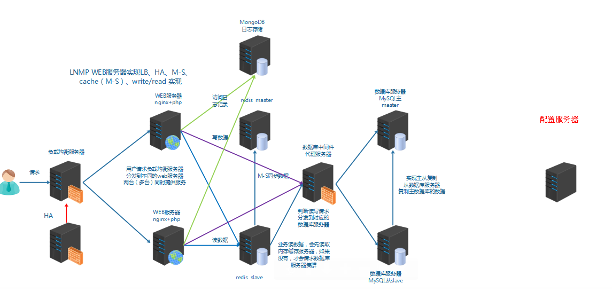
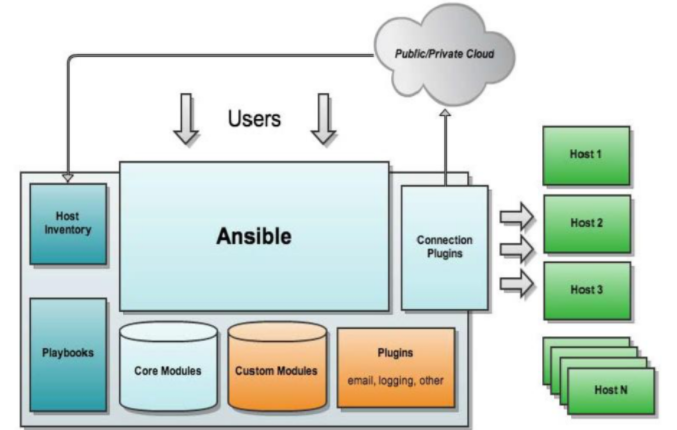
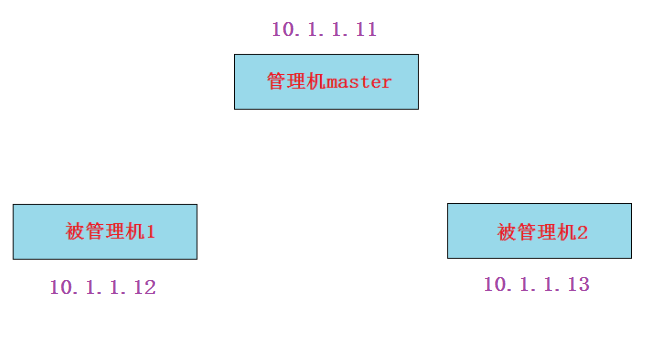

# 任务背景

公司的服务器越来越多, 维护一些简单的事情都会变得很繁琐。用shell脚本来管理少量服务器效率还行, 服务器多了之后, shell脚本无法实现高效率运维。这种情况下，我们需要引入**==自动化运维==**工具, 对多台服务器实现高效运维。



# 任务要求

通过管理服务器能够按照需求灵活高效地管理所有应用服务器的运维操作


# 任务拆解

1,  需要一台服务器做管理端, 来连接管理所有的应用服务器

2,  考虑如果只针对一部分应用服务器进行运维操作如何实现(服务器分组)

3,  学会将平台烂熟于心的linux操作命令转化为自动化运维的方式(常见模块的学习)

4,  如果操作非常的冗长, 学会使用playbook和role的方式来管理


# **学习目标**

- [ ] 能够安装ansible服务器和客户端
- [ ] 能够定义ansible主机清单进行服务器分组
- [ ] 能够使用hostname模块修改主机名
- [ ] 能够使用file模块做基本的文件操作
- [ ] 能够使用copy模块把文件拷贝到远程机器
- [ ] 能够使用fetch模块把文件从远程拷贝到本地
- [ ] 能够使用user模块管理用户
- [ ] 能够使用group模块管理用户组
- [ ] 能够使用cron模块管理时间任务
- [ ] 能够使用yum_repository模块配置yum
- [ ] 能够使用yum模块安装软件包
- [ ] 能够使用service模块控制服务的启动,关闭,开机自启动

- [ ] 能够使用script模块在远程机器上执行本地脚本

- [ ] 能够使用command与shell模块远程执行命令

- [ ] 能够编写playbook实现httpd

- [ ] 能够使用roles实现lamp


# 一、认识自动化运维

**问题:** 

假设我要去1000台服务上做一个操作（如nginx服务器修改配置文件里的某一个参数), 下面两种方法缺点明显:

1. 按传统的方法, 一台连着一台服务器的ssh上去手动操作。 

   缺点:  

   * 效率太低。

2. 写个shell脚本来做。

   缺点: 

   * 管理的机器平台不一致，脚本可能不具备通用性。

   * 传密码麻烦(在非免密登录的环境下, 需要expect来传密码)

   * 效率较低，循环1000次也需要一个一个的完成，如果用`&`符放到后台执行，则会产生1000个进程。


**自动化运维**: 将日常IT运维中大量的**重复性工作**，小到简单的日常检查、配置变更和软件安装，大到整个变更流程的组织调度，由过去的手工执行转为自动化操作，从而减少乃至消除运维中的延迟，实现“零延时”的IT运维。


## 自动化运维主要关注的方面

假如管理很多台服务器，主要关注以下几个方面:

1. **管理机与被管理机的连接**(管理机如何将管理指令发送给被管理机)

2. **服务器信息收集**  (如果被管理的服务器有centos7.5外还有其它linux发行版,如suse,ubuntu等。当你要做的事情在不同OS上有所不同,你需要收集信息,并将其分开处理)

3. **服务器分组**（因为有些时候我要做的事情不是针对所有服务器,可能只针对某一个分组） 

4. **管理内容的主要分类**

* **文件目录管理**(包括文件的创建,删除,修改,查看状态,远程拷贝等)

* **用户和组管理**
* **cron时间任务管理**					

* **yum源配置与通过yum管理软件包**

* **服务管理**

* **远程执行脚本**

* **远程执行命令**


## **常见的开源自动化运维工具比较** 

1. puppet(拓展)	

   基于ruby语言，成熟稳定。适合于大型架构，相对于ansible和saltstack会复杂些。

2. saltstack(拓展)

   基于python语言。相对简单，大并发能力比ansible要好, 需要维护被管理端的服务。如果服务断开,连接就会出问题。

3. ansible

   基于python语言。简单快捷，被管理端不需要启服务。直接走ssh协议,需要验证所以机器多的话速度会较慢。


# 二、ansible


ansible是一种由Python开发的自动化运维工具，集合了众多运维工具（puppet、cfengine、chef、func、fabric）的优点，实现了批量系统配置、批量程序部署、批量运行命令等功能。

特点:

* 部署简单
* **默认使用ssh进行管理，基于python里的==paramiko==模块开发**
* 管理端和被管理端不需要启动服务
* 配置简单，功能强大，扩展性强
* 能过playbook(剧本)进行多个任务的编排





## ansible环境搭建

**实验准备:** 三台机器，一台管理，两台被管理



1. 静态ip
2. 主机名及主机名互相绑定
3. 关闭防火墙, selinux
4. 时间同步
5. 确认和配置yum源(需要epel源)


**实验过程:**

**第1步: 管理机上安装ansible，被管理节点必须打开ssh服务.**

~~~powershell
# yum install epel-release
# yum install ansible
# ansible --version
ansible 2.8.4
  config file = /etc/ansible/ansible.cfg
  configured module search path = [u'/root/.ansible/plugins/modules', u'/usr/share/ansible/plugins/modules']
  ansible python module location = /usr/lib/python2.7/site-packages/ansible
  executable location = /usr/bin/ansible
  python version = 2.7.5 (default, Oct 30 2018, 23:45:53) [GCC 4.8.5 20150623 (Red Hat 4.8.5-36)]
~~~

**第2步:  实现master对agent的免密登录，只在master上做。(如果这一步不做，则在后面操作agent时都要加-k参数传密码;或者在主机清单里传密码)**

~~~powershell
master# ssh-keygen

master# ssh-copy-id -i 10.1.1.12
master# ssh-copy-id -i 10.1.1.13
~~~

**第3步: 在master上定义主机组,并测试连接性**

~~~powershell
master# vim /etc/ansible/hosts 
[group1]
10.1.1.12
10.1.1.13
~~~

~~~powershell
master# ansible -m ping group1
10.1.1.13 | SUCCESS => {
    "changed": false, 
    "ping": "pong"
}
10.1.1.12 | SUCCESS => {
    "changed": false, 
    "ping": "pong"
}    
~~~

~~~powershell
master# ansible -m ping all
10.1.1.13 | SUCCESS => {
    "changed": false, 
    "ping": "pong"
}
10.1.1.12 | SUCCESS => {
    "changed": false, 
    "ping": "pong"
}
~~~


## 服务器分组

ansible通过一个主机清单功能来实现服务器分组。

Ansible的默认主机清单配置文件为/etc/ansible/hosts.

**示例:** 

~~~powershell
[nginx]					组名
apache[1:10].aaa.com	表示apache1.aaa.com到apache10.aaa.com这10台机器
nginx[a:z].aaa.com		表示nginxa.aaa.com到nginxz.aaa.com共26台机器
10.1.1.[11:15]			表示10.1.1.11到10.1.1.15这5台机器
~~~

**示例:** 

~~~powershell
[nginx]
10.1.1.13:2222			表示10.1.1.13这台，但ssh端口为2222
~~~

**示例: 定义10.1.1.12:2222这台服务器的别名为nginx1**

~~~powershell
nginx1 ansible_ssh_host=10.1.1.13 ansible_ssh_port=2222
~~~

**示例: 没有做免密登录的服务器可以指定用户名与密码**

~~~powershell
nginx1  ansible_ssh_host=10.1.1.13 ansible_ssh_port=2222 ansible_ssh_user=root ansible_ssh_pass="123456"
~~~

**示例: 利用别名来分组**

~~~powershell
nginx1  ansible_ssh_host=10.1.1.13 ansible_ssh_port=2222 ansible_ssh_user=root ansible_ssh_pass="123456"
nginx2  ansible_ssh_host=10.1.1.12

[nginx]
nginx1
nginx2
~~~

**小结:**

主机清单的作用: 服务器分组。

主机清单的常见功能:

1. 可以通过IP范围来分, 主机名名字的范围来分

2. 如果ssh端口不是22的，可以传入新的端口。

3. 没有做免密登录，可以传密码。


**练习:** 不论你用哪种环境(免密或不免密，端口是否22）, 请最终将两台被管理机器加入到group1组即可


## ansible模块

ansible是基于模块工作的，本身没有批量部署的能力。真正具有批量部署的是ansible所运行的模块，ansible只是提供一种框架。

ansible支持的模块非常的多，我们并不需要把每个模块都记住，而只需要熟悉一些常见的模块，其它的模块在需要用到时再查询即可。

**查看所有支持的模块**

~~~powershell
# ansible-doc -l		
a10_server                                           Manage A10 Networks AX/SoftAX...
a10_server_axapi3                                    Manage A10 Networks AX/SoftAX...
a10_service_group                                    Manage A10 Networks AX/SoftAX...
a10_virtual_server                                   Manage A10 Networks AX/SoftAX...
aci_aaa_user                                         Manage AAA users (aaa:User)
。。。。。。

如果要查看ping模块的用法，使用下面命令（其它模块以此类推)
# ansible-doc ping
~~~

官网模块文档地址: https://docs.ansible.com/ansible/latest/modules/list_of_all_modules.html


### hostname模块

hostname模块用于修改主机名（**注意**: 它不能修改/etc/hosts文件)

https://docs.ansible.com/ansible/latest/modules/hostname_module.html#hostname-module

将其中一远程机器主机名修改为agent1.cluster.com

~~~powershell
master# ansible 10.1.1.12  -m hostname -a 'name=agent1.cluster.com'
基本格式为: ansible 操作的机器名或组名 -m 模块名 -a "参数1=值1 参数2=值2"
~~~


### file模块(重点)

file模块用于对文件相关的操作(创建, 删除, 软硬链接等)

https://docs.ansible.com/ansible/latest/modules/file_module.html#file-module

创建一个目录

~~~powershell
master# ansible group1 -m file -a 'path=/test state=directory'
~~~

创建一个文件

~~~powershell
master# ansible group1 -m file -a 'path=/test/111 state=touch'
~~~

递归修改owner,group,mode

~~~powershell
master# ansible group1 -m file -a 'path=/test recurse=yes owner=bin group=daemon mode=1777'
~~~

删除目录（连同目录里的所有文件)

~~~powershell
master# ansible group1 -m file -a 'path=/test state=absent'
~~~

创建文件并指定owner,group,mode等

~~~powershell
master# ansible group1 -m file -a 'path=/tmp/111 state=touch owner=bin group=daemon mode=1777'
~~~

删除文件

~~~powershell
master# ansible group1 -m file -a 'path=/tmp/111 state=absent'
~~~

创建软链接文件

~~~powershell
master# ansible group1 -m file -a 'src=/etc/fstab path=/tmp/fstab state=link'
~~~

创建硬链接文件

~~~powershell
master# ansible group1 -m file -a 'src=/etc/fstab path=/tmp/fstab2 state=hard'
~~~


### stat模块(了解)

stat模块类似linux的stat命令，用于获取文件的状态信息。

https://docs.ansible.com/ansible/latest/modules/stat_module.html#stat-module

获取/etc/fstab文件的状态信息

~~~powershell
master# ansible group1 -m stat -a 'path=/etc/fstab'
~~~


### copy模块(重点)

copy模块用于对文件的远程拷贝操作（如把本地的文件拷贝到远程的机器上)

https://docs.ansible.com/ansible/latest/modules/copy_module.html#copy-module

在master上准备一个文件，拷贝此文件到group1的所有机器上

~~~powershell
master# echo master > /tmp/222
master# ansible group1 -m copy -a 'src=/tmp/222 dest=/tmp/333'
~~~

使用content参数直接往远程文件里写内容（会覆盖原内容）

~~~powershell
master# ansible group1 -m copy -a 'content="ha ha\n" dest=/tmp/333'
注意:ansible中-a后面的参数里也有引号时，记得要单引双引交叉使用，如果都为双引会出现问题
~~~

使用force参数控制是否强制覆盖

~~~powershell
如果目标文件已经存在，则不覆盖
master# ansible group1 -m copy -a 'src=/tmp/222 dest=/tmp/333 force=no'
如果目标文件已经存在，则会强制覆盖
master# ansible group1 -m copy -a 'src=/tmp/222 dest=/tmp/333 force=yes'
~~~

使用backup参数控制是否备份文件

~~~powershell
backup=yes表示如果拷贝的文件内容与原内容不一样，则会备份一份
group1的机器上会将/tmp/333备份一份（备份文件命名加上时间），再远程拷贝新的文件为/tmp/333
master# ansible group1 -m copy -a 'src=/etc/fstab dest=/tmp/333 backup=yes owner=daemon group=daemon mode=1777'
~~~

copy模块拷贝时要注意拷贝目录后面是否带"/"符号

~~~powershell
/etc/yum.repos.d后面不带/符号，则表示把/etc/yum.repos.d整个目录拷贝到/tmp/目录下
master# ansible group1 -m copy -a 'src=/etc/yum.repos.d dest=/tmp/'
/etc/yum.repos.d/后面带/符号，则表示把/etc/yum.repos.d/目录里的所有文件拷贝到/tmp/目录下
master# ansible group1 -m copy -a 'src=/etc/yum.repos.d/ dest=/tmp/'
~~~

**练习: 在master上配置好所有的yum源，然后拷贝到group1的远程机器上（要求目录内的内容完全一致)**

~~~powershell
master# ansible group1 -m file -a "path=/etc/yum.repos.d/ state=absent"
master# ansible group1 -m copy -a "src=/etc/yum.repos.d dest=/etc/"
~~~

**练习: 使用hostname模块修改过主机名后.在master上修改/etc/hosts文件，并拷贝到group1的远程机器上**

~~~powershell
先在master上修改好/etc/hosts文件，然后使用下面命令拷贝过去覆盖
master# ansible group1 -m copy -a "src=/etc/hosts dest=/etc/hosts"
~~~

 

**关于DNS的补充:**

* 域名为公网的唯一名字,主机名为内网的名字(可以重名,但最好不要这么做)

* 目前自建DNS做域名解析已经很少了, 但可以通过DNS解析主机名来实现内网多台服务器的解析
* 现在学了ansible的hostname与copy模块,轻松实现N多台服务器的主机名管理,DNS也不需要再搭建了


### template模块(拓展)

与copy模块功能几乎一样.

template模块首先使用变量渲染jinja2模板文件成普通文件,然后再复制过去.而copy模块不支持.(jinja2是一个基于python的模板引擎)

https://docs.ansible.com/ansible/latest/modules/template_module.html#template-module

```powershell
master# ansible -m template group1 -a "src=/etc/hosts dest=/tmp/hosts"
```

template模块不能拷贝目录

~~~powershell
master# ansible -m template group1 -a "src=/etc/yum.repos.d/ dest=/etc/yum.repos.d/"
~~~


### fetch模块

fetch模块与copy模块类似，但作用相反。用于把远程机器的文件拷贝到本地。

https://docs.ansible.com/ansible/latest/modules/fetch_module.html#fetch-module

第1步: 在两台被管理机上分别创建一个同名文件（但内容不同)

~~~powershell
agent1# echo agent1 > /tmp/1.txt
agent2# echo agent2 > /tmp/1.txt
~~~

第2步: 从master上fecth文件(因为group1里有2台机器,为了避免同名文件文件冲突，它使用了不同的目录)

~~~powershell
master# ansible group1  -m fetch -a 'src=/tmp/1.txt dest=/tmp/'
10.1.1.12 | CHANGED => {
    "changed": true, 
    "checksum": "d2911a028d3fcdf775a4e26c0b9c9d981551ae41", 
    "dest": "/tmp/10.1.1.12/tmp/1.txt", 	10.1.1.12的在这里
    "md5sum": "0d59da0b2723eb03ecfbb0d779e6eca5", 
    "remote_checksum": "d2911a028d3fcdf775a4e26c0b9c9d981551ae41", 
    "remote_md5sum": null
}
10.1.1.13 | CHANGED => {
    "changed": true, 
    "checksum": "b27fb3c4285612643593d53045035bd8d972c995", 
    "dest": "/tmp/10.1.1.13/tmp/1.txt", 	10.1.1.13的在这里
    "md5sum": "cd0bd22f33d6324908dbadf6bc128f52", 
    "remote_checksum": "b27fb3c4285612643593d53045035bd8d972c995", 
    "remote_md5sum": null
}

~~~

第3步: 先删除上面fetch过来的, 然后尝试只fetch其中一台机器的，也会使用名称来做子目录区分

~~~powershell
master# rm /tmp/10.1.1.* -rf


master# ansible 10.1.1.12  -m fetch -a 'src=/tmp/1.txt dest=/tmp/'
10.1.1.12 | CHANGED => {
    "changed": true, 
    "checksum": "d2911a028d3fcdf775a4e26c0b9c9d981551ae41", 
    "dest": "/tmp/10.1.1.12/tmp/1.txt", 	只fetch一个，也会这样命名
    "md5sum": "0d59da0b2723eb03ecfbb0d779e6eca5", 
    "remote_checksum": "d2911a028d3fcdf775a4e26c0b9c9d981551ae41", 
    "remote_md5sum": null
}
~~~

**注意**: fetch模块不能从远程拷贝目录到本地


### user模块

user模块用于管理用户账号和用户属性。

https://docs.ansible.com/ansible/latest/modules/user_module.html#user-module

创建aaa用户,默认为普通用户,创建家目录

~~~powershell
master# ansible group1 -m user -a ‘name=aaa state=present’
~~~

创建bbb系统用户,并且登录shell环境为/sbin/nologin

~~~powershell
master# ansible group1 -m user -a ‘name=bbb state=present system=yes  shell="/sbin/nologin"’
~~~

创建ccc用户, 使用uid参数指定uid, 使用password参数传密码

~~~powershell
master# echo 123456 | openssl passwd -1 -stdin
$1$DpcyhW2G$Kb/y1f.lyLI4MpRlHU9oq0

下一句命令注意一下格式，密码要用双引号引起来，单引号的话验证时会密码不正确
master# ansible group1 -m user -a 'name=ccc uid=2000 state=present password="$1$DpcyhW2G$Kb/y1f.lyLI4MpRlHU9oq0"'
~~~

创建一个普通用户叫hadoop,并产生空密码密钥对

~~~powershell
master# ansible group1 -m user -a 'name=hadoop generate_ssh_key=yes'
~~~

删除aaa用户,但家目录默认没有删除

~~~powershell
master# ansible group1 -m user -a 'name=aaa state=absent'
~~~

删除bbb用户,使用remove=yes参数让其删除用户的同时也删除家目录

~~~powershell
master# ansible group1 -m user -a 'name=bbb state=absent remove=yes'
~~~


### group模块

group模块用于管理用户组和用户组属性。

https://docs.ansible.com/ansible/latest/modules/group_module.html#group-module

创建组

~~~powershell
master# ansible group1 -m group -a 'name=groupa gid=3000 state=present'
~~~

删除组（如果有用户的gid为此组，则删除不了)

~~~powershell
master# ansible group1 -m group -a 'name=groupa state=absent'
~~~


### cron模块

cron模块用于管理周期性时间任务

https://docs.ansible.com/ansible/latest/modules/cron_module.html#cron-module

创建一个cron任务,不指定user的话,默认就是root（因为我这里是用root操作的)。
如果minute,hour,day,month,week不指定的话，默认都为*

~~~powershell
master# ansible group1 -m cron -a 'name="test cron1" user=root job="touch /tmp/111" minute=*/2' 
~~~

删除cron任务

~~~powershell
master# ansible group1 -m cron -a 'name="test cron1" state=absent'
~~~


### yum_repository模块

yum_repository模块用于配置yum仓库。

https://docs.ansible.com/ansible/latest/modules/yum_repository_module.html

增加一个/etc/yum.repos.d/local.repo配置文件

~~~powershell
master# ansible group1 -m yum_repository -a "name=local description=localyum baseurl=file:///mnt/ enabled=yes gpgcheck=no"
~~~

~~~powershell
注意：此模块只帮助配置yum仓库,但如果仓库里没有软件包，安装一样会失败。所以可以手动去挂载光驱到/mnt目录
# mount /dev/cdrom /mnt
~~~

删除/etc/yum.repos.d/local.repo配置文件

~~~powershell
master# ansible group1 -m yum_repository -a "name=local state=absent" 
~~~


### yum模块(重点)

yum模块用于使用yum命令来实现软件包的安装与卸载。

https://docs.ansible.com/ansible/latest/modules/yum_module.html#yum-module

使用yum安装一个软件（前提:group1的机器上的yum配置都已经OK）

~~~powershell
master# ansible group1 -m yum -a 'name=vsftpd state=present'
~~~

使用yum安装httpd,httpd-devel软件,state=latest表示安装最新版本

~~~powershell
master# ansible group1 -m yum -a 'name=httpd,httpd-devel state=latest' 
~~~

使用yum卸载httpd,httpd-devel软件

~~~powershell
master# ansible group1 -m yum -a 'name=httpd,httpd-devel state=absent' 
~~~


### service模块(重点)

service模块用于控制服务的启动,关闭,开机自启动等。

https://docs.ansible.com/ansible/latest/modules/service_module.html#service-module

启动vsftpd服务，并设为开机自动启动

~~~powershell
master# ansible group1 -m service -a 'name=vsftpd state=started enabled=on'
~~~

关闭vsftpd服务，并设为开机不自动启动

~~~powershell
master# ansible group1 -m service -a 'name=vsftpd state=stopped enabled=false'
~~~


**练习: 在group1的被管理机里的mariadb里创建一个abc库**

~~~powershell

~~~

**练习:**

**假设我主机清单里定义的group1里有多台机器，它们现在要做一个集群。此集群要求实现一个名为hadoop的普通用户之间的两两免密登录，如何实现(要求只在master上进行操作)?**

~~~powershell

~~~


### script模块

script模块用于在远程机器上执行**本地**脚本。

https://docs.ansible.com/ansible/latest/modules/script_module.html#script-module

```powershell
在master上准备一个脚本
master# vim /tmp/1.sh
#!/bin/bash
mkdir /tmp/haha
touch /tmp/haha/{1..10}

在group1的远程机器里都执行master上的/tmp/1.sh脚本（此脚本不用给执行权限)
master# ansible group1 -m script -a '/tmp/1.sh'
```


**扩展:** 使用shell脚本实现在group1的被管理机里的mariadb里创建一个abc库

~~~powershell
#!/bin/bash

yum install mariadb-server -y  &> /dev/null

systemctl start mariadb
systemctl enable mariadb

mysql << EOF
create database abc;
quit
EOF

把上面的脚本使用script模块在group1被管理机里执行即可
~~~


### command与shell模块

两个模块都是用于执行linux命令的,这对于命令熟悉的工程师来说，用起来非常high。

shell模块与command模块差不多（command模块不能执行一些类似$HOME,>,<,|等符号，但shell可以)

https://docs.ansible.com/ansible/latest/modules/command_module.html

https://docs.ansible.com/ansible/latest/modules/shell_module.html

```powershell
master# ansible -m command group1 -a "useradd user2"
master# ansible -m command group1 -a "id user2"

master# ansible -m command group1 -a "cat /etc/passwd |wc -l"		--报错
master# ansible -m shell group1 -a "cat /etc/passwd |wc -l"		--成功

master# ansible -m command group1 -a "cd $HOME;pwd"	　　--报错
master# ansible -m shell 　group1 -a "cd $HOME;pwd"	　　--成功
```

**注意:** shell模块并不是百分之百任何命令都可以,比如vim或ll别名就不可以。不建议大家去记忆哪些命令不可以，大家只要养成任何在生产环境里的命令都要先在测试环境里测试一下的习惯就好。


# 三、playbook

playbook(剧本): 是ansible用于配置,部署,和管理被控节点的剧本。用于ansible操作的编排。

参考:https://docs.ansible.com/ansible/latest/user_guide/playbooks_intro.html

使用的格式为**yaml**格式（saltstack,elk,docker,docker-compose,kubernetes等也都会用到yaml格式) 


## YMAL格式

* 以.yaml或.yml结尾

- 文件的第一行以 "---"开始，表明YMAL文件的开始(可选的)
- 以#号开头为注释 
- 列表中的所有成员都开始于相同的缩进级别, 并且使用一个 `"- "` 作为开头(一个横杠和一个空格)
- 一个字典是由一个简单的 `键: 值` 的形式组成(这个冒号后面必须是一个空格)
- **==注意: 写这种文件不要使用tab键，都使用空格==**

参考: https://docs.ansible.com/ansible/latest/reference_appendices/YAMLSyntax.html#yaml-syntax

下面看一个官方的示例感受一下

```powershell
---
# 一位职工记录
name: Example Developer
job: Developer
skill: Elite
employed: True
foods:
    - Apple
    - Orange
    - Strawberry
    - Mango
languages:
    ruby: Elite
    python: Elite
    dotnet: Lame
```


## playbook实例

先直接来看一个实例

**第1步: 创建一个存放playbook的目录(路径自定义)**

```powershell
master# mkdir /etc/ansible/playbook
```

**第2步: 准备httpd配置文件,并修改成你想要的配置**

```powershell
master# yum install httpd -y

按需要修改你想要的配置(为了测试可以随意改动标记一下)
master# vim /etc/httpd/conf/httpd.conf
```

**第3步: 写一个playbook文件(后缀为.yml或.yaml)**

```powershell
# vim /etc/ansible/playbook/example.yaml
---
- hosts: group1
  remote_user: root
  tasks:  
  - name: ensure apache is at the latest version	
    yum: name=httpd,httpd-devel state=latest
    
  - name: write the apache config file		
    copy: src=/etc/httpd/conf/httpd.conf dest=/etc/httpd/conf/httpd.conf
    
    notify:
    - restart apache
    
  - name: ensure apache is running (and enable it at boot)
    service: name=httpd state=started enabled=yes
    
  handlers:	
    - name: restart apache
      service: name=httpd state=restarted
```

第4步: 执行写好的palybook

- 会显示出执行的过程，并且执行的每一步都有ok,changed,failed等标识
- 执行如果有错误(failed)会回滚，解决问题后，直接再执行这条命令即可,并会把failed改为changed（幂等性)

```powershell
# ansible-playbook /etc/ansible/playbook/example.yaml
```


## Playbook常见语法

**hosts:** 用于指定要执行任务的主机，其可以是一个或多个由冒号分隔主机组.

**remote_user:** 用于指定远程主机上的执行任务的用户.

```powershell
- hosts: group1			
  remote_user: root	
```


**tasks:** 任务列表, 按顺序执行任务. 

- 如果一个host执行task失败, 整个tasks都会回滚, 修正playbook 中的错误, 然后重新执行即可.

```powershell
  tasks:
  - name: ensure apache is at the latest version	
    yum: name=httpd,httpd-devel state=latest
    
  - name: write the apache config file		
    copy: src=/etc/httpd/conf/httpd.conf dest=/etc/httpd/conf/httpd.conf
```


**handlers:**  类似task，但需要使用notify通知调用。

- 不管有多少个通知者进行了notify，等到play中的所有task执行完成之后，handlers也只会被执行一次.
- handlers最佳的应用场景是用来重启服务,或者触发系统重启操作.除此以外很少用到了.

```powershell
    notify:				  
    - restart apache
    
  - name: ensure apache is running (and enable it at boot)
    service: name=httpd state=started enabled=yes
    
  handlers:
    - name: restart apache
      service: name=httpd state=restarted
```


**练习:** 修改httpd的端口为8080,再执行playbook测试


**variables:** 变量

- 定义变量可以被多次方便调用

```powershell
master# vim /etc/ansible/playbook/example2.yaml
---
 - hosts: group1
   remote_user: root
   vars:
   - user: test1
   tasks:
   - name: create user
     user: name={{user}} state=present
```

```powershell
master# ansible-playbook /etc/ansible/playbook/example2.yaml
```


### 案例: playbook编排vsftpd

写一个playbook实现 

1. 配置yum
2. 安装vsftpd包
3. 修改配置文件(要求拒绝匿名用户登录)
4. 启动服务并实现vsftpd服务开机自动启动

```powershell
---
- hosts: group1                 
  remote_user: root                     
  tasks:                                
  - name: rm yum repository      
    file: path=/etc/yum.repos.d/ state=absent
    
  - name: 同步master上的yum源到group1
    copy: src=/etc/yum.repos.d dest=/etc/
    
  - name: ensure vsftpd is at the latest version        
    yum: name=vsftpd state=latest
    
  - name: write the apache config file          
    copy: src=/etc/vsftpd/vsftpd.conf dest=/etc/vsftpd/vsftpd.conf 
    
    notify:                             
    - restart vsftpd
    
  - name: ensure vsftpd is running (and enable it at boot)
    service: name=vsftpd state=started enabled=yes
    
  handlers:                     
    - name: restart vsftpd              
      service: name=vsftpd state=restarted
```


## **playbook编排多个hosts任务**

~~~powershell
---			# ---代表开始(可选项,不写也可以)
- hosts: 10.1.1.12
  remote_user: root
  tasks:
  - name: 创建/test1/目录
    file: path=/test1/ state=directory
# 这里不能用---分隔,会报语法错误(后面课程玩k8s编排也写YAML文件,是可以用---来分隔段落的)
- hosts: 10.1.1.13
  remote_user: root
  tasks:
  - name: 创建/test2/目录
    file: path=/test2/ state=directory
...			# ...代表结束(可选项,不写也可以)
~~~


### 案例: 编排nfs搭建与客户端挂载

1, 在master上准备nfs配置文件

~~~powershell
# vim /etc/exports
/share  *(ro)
~~~

2, 编写yaml编排文件

~~~powershell
# vim /etc/ansible/playbook/nfs.yml
---
- hosts: 10.1.1.12
  remote_user: root
  tasks:
  - name: 安装nfs服务相关软件包
    yum: name=nfs-utils,rpcbind,setup  state=latest

  - name: 创建共享目录
    file: path=/share/ state=directory

  - name: 同步nfs配置文件
    copy: src=/etc/exports dest=/etc/exports

    notify: restart nfs

  - name: 启动rpcbind服务,并设置为开机自启动
    service: name=rpcbind state=started enabled=on

  - name: 启动nfs服务,并设置为开机自启动
    service: name=nfs state=started enabled=on

  handlers:
  - name: restart nfs
    service: name=nfs state=restarted

- hosts: 10.1.1.13
  remote_user: root
  tasks:
  - name: 安装nfs客户端软件包
    yum: name=nfs-utils state=latest

  - name: 挂载nfs服务器的共享
    shell: mount 10.1.1.12:/share /mnt
~~~

3, 执行playbook

~~~powershell
# ansible-playbook /etc/ansible/playbook/nfs.yaml
~~~


# 四、roles(难点)

## roles介绍

roles(角色): 就是通过分别将variables, tasks及handlers等放置于单独的目录中,并可以便捷地调用它们的一种机制。

假设我们要写一个playbook来安装管理lamp环境，那么这个playbook就会写很长。所以我们希望把这个很大的文件分成多个功能拆分, 分成apache管理,php管理,mysql管理，然后在需要使用的时候直接调用就可以了，以免重复写。就类似编程里的模块化的概念，以达到代码复用的效果。


## **创建roles的目录结构**

```powershell
files：用来存放由copy模块或script模块调用的文件。
tasks：至少有一个main.yml文件，定义各tasks。
handlers:有一个main.yml文件，定义各handlers。
templates：用来存放jinjia2模板。
vars：有一个main.yml文件，定义变量。
meta：有一个main.yml文件，定义此角色的特殊设定及其依赖关系。
```

**注意:** 在每个角色的目录中分别创建files, tasks,handlers,templates,vars和meta目录，用不到的目录可以创建为空目录.


## 通过roles实现lamp

需定制三个角色: httpd,mysql,php

**第1步: 创建roles目录及文件,并确认目录结构**

```powershell
master# cd /etc/ansible/roles/
master# mkdir -p {httpd,mysql,php}/{files,tasks,handlers,templates,vars,meta}
master# touch {httpd,mysql,php}/{tasks,handlers,vars,meta}/main.yml

master# yum install tree -y
master# tree /etc/ansible/roles/
/etc/ansible/roles/
├── httpd
│   ├── files
│   ├── handlers
│   │   └── main.yml
│   ├── meta
│   │   └── main.yml
│   ├── tasks
│   │   └── main.yml
│   ├── templates
│   └── vars
│       └── main.yml
├── mysql
│   ├── files
│   ├── handlers
│   │   └── main.yml
│   ├── meta
│   │   └── main.yml
│   ├── tasks
│   │   └── main.yml
│   ├── templates
│   └── vars
│       └── main.yml
└── php
    ├── files
    ├── handlers
    │   └── main.yml
    ├── meta
    │   └── main.yml
    ├── tasks
    │   └── main.yml
    ├── templates
    └── vars
        └── main.yml
```

**第2步: 准备httpd服务器的主页文件,php测试页和配置文件等**

```powershell
master# echo "test main page" > /etc/ansible/roles/httpd/files/index.html


master# echo -e "<?php\n\tphpinfo();\n?>" > /etc/ansible/roles/httpd/files/test.php 


master# yum install httpd -y
按需求修改配置文件后,拷贝到httpd角色目录里的files子目录
master# vim /etc/httpd/conf/httpd.conf
master# cp /etc/httpd/conf/httpd.conf /etc/ansible/roles/httpd/files/
```


**第3步: 编写httpd角色的main.yml文件**

```powershell
---
 - name: 安装httpd
   yum: name=httpd,httpd-devel state=present

 - name: 同步httpd配置文件
   copy: src=/etc/ansible/roles/httpd/files/httpd.conf dest=/etc/httpd/conf/httpd.conf

   notify: restart httpd

 - name: 同步主页文件
   copy: src=/etc/ansible/roles/httpd/files/index.html dest=/var/www/html/index.html

 - name: 同步php测试页
   copy: src=/etc/ansible/roles/httpd/files/test.php dest=/var/www/html/test.php

 - name: 启动httpd并开机自启动
   service: name=httpd state=started enabled=yes
```

**第4步: 编写httpd角色里的handler**

```powershell
master# vim /etc/ansible/roles/httpd/handlers/main.yml
---
- name: restart httpd
  service: name=httpd state=restarted
```

**第5步: 编写mysql角色的main.yml文件**

```powershell
---
- name: 安装mysql
  yum: name=mariadb,mariadb-server,mariadb-devel state=present

- name: 启动mysql并开机自启动
  service: name=mariadb state=started enabled=yes
```

**第6步: 编写php角色的main.yml文件**

```powershell
master# vim /etc/ansible/roles/php/tasks/main.yml
---
- name: 安装php及依赖包
  yum: name=php,php-gd,php-ldap,php-odbc,php-pear,php-xml,php-xmlrpc,php-mbstring,php-snmp,php-soap,curl,curl-devel,php-bcmath,php-mysql state=present

  notify: restart httpd
```

**第7步:编写lamp的playbook文件调用前面定义好的三个角色**

```powershell
master# vim /etc/ansible/playbook/lamp.yaml
---
- hosts: group1
  remote_user: root
  roles:
    - httpd
    - mysql
    - php
```

**第8步: 执行lamp的playbook文件**

```powershell
master# ansible-playbook /etc/ansible/playbook/lamp.yaml
```


## 拓展案例: 通过roles实现lamp并安装discuz

**第1步: 创建roles目录及文件,并确认目录结构**

~~~powershell
master# cd /etc/ansible/roles/
master# mkdir -p {httpd,mysql,php}/{files,tasks,handlers,templates,vars,meta}
master# touch {httpd,mysql,php}/{tasks,handlers,vars,meta}/main.yml
~~~

**第2步: 准备httpd相关文件**

~~~powershell
master# ls /etc/ansible/roles/httpd/files/
Discuz_X3.2_SC_UTF8.zip  					Discuz相关软件包
httpd.conf 									配置好的httpd.conf配置文件
~~~

**第3步: 编写httpd角色的main.yml文件**

~~~powershell
master# vim /etc/ansible/roles/httpd/tasks/main.yml
- name: 安装httpd相关软件包
  yum: name=httpd,httpd-devel state=latest

- name: 同步配置文件
  copy: src=/etc/ansible/roles/httpd/files/httpd.conf dest=/etc/httpd/conf/httpd.conf

  notify: restart httpd

- name: 拷贝discuz压缩包
  copy: src=/etc/ansible/roles/httpd/files/Discuz_X3.2_SC_UTF8.zip dest=/tmp/

- name: 解压并mv网站文件到httpd家目录
  shell: rm -rf /var/www/html/*  && rm -rf /test/ && mkdir -p /test/ &&  unzip /tmp/Discuz_X3.2_SC_UTF8.zip -d /test/ &> /dev/null  && mv /test/upload/* /var/www/html/ && chown -R apache.apache /var/www/html/
# 上面的命令有点多,可以写成脚本,然后使用script模块来调用执行

- name: 启动httpd并开机自启动
  service: name=httpd state=started enabled=on

~~~

**第4步: 编写httpd角色里的handler**

```powershell
master# vim /etc/ansible/roles/httpd/handlers/main.yml
---
- name: restart httpd
  service: name=httpd state=restarted
```

**第5步: 编写mysql角色的main.yml文件**

~~~powershell
master# vim /etc/ansible/roles/mysql/tasks/main.yml
---
- name: 安装mariadb相关软件包
  yum: name=mariadb-server,mariadb-devel state=latest

- name: 启动mariadb服务并设置开机自启动
  service: name=mariadb state=started enabled=on

- name: 执行建库脚本
  script: /etc/ansible/roles/mysql/files/create.sh
~~~

**第6步: 编写mysql的建库脚本**

~~~powershell
master# vim /etc/ansible/roles/mysql/files/create.sh

#!/bin/bash

mysql << EOF
create database if not exists discuz default charset=utf8;
grant all on discuz.* to 'discuz'@'localhost' identified by '123';
flush privileges;
EOF
~~~

**第7步: 编写php角色的main.yml文件**

~~~powershell
master# vim /etc/ansible/roles/php/tasks/main.yml
---
- name: 安装php相关软件包
  yum: name=php,php-gd,php-ldap,php-odbc,php-pear,php-xml,php-xmlrpc,php-mbstring,php-snmp,php-soap,curl,curl-devel,php-bcmath,php-mysql state=present

  notify: restart httpd
~~~


**第8步:编写lamp的playbook文件调用前面定义好的三个角色**

```powershell
master# vim /etc/ansible/playbook/lamp.yaml
---
- hosts: group1
  remote_user: root
  roles:
    - httpd
    - mysql
    - php
```

**第9步: 执行lamp的playbook文件**

```powershell
master# ansible-playbook /etc/ansible/playbook/lamp.yaml
```


## **练习**

**请使用role来实现lnmp**

 