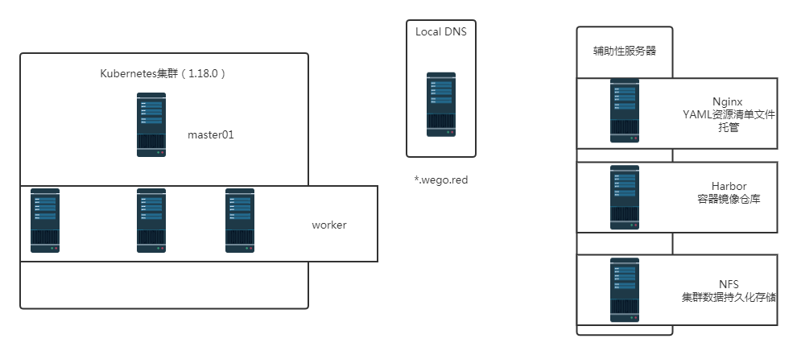

# 环境说明

# 一、Kubernetes版本

- 2020年3月份kubernetes 1.18.0版本发布
- 本次使用的kubernetes集群版本为1.18.0
- 部署工具为kubeadm

> 关于二进制部署kubernetes集群方法，可预约相关课程。

# 二、kubernetes集群架构

- 单master节点
- 3台worker节点

# 三、kubernetes集群周边辅助性服务

