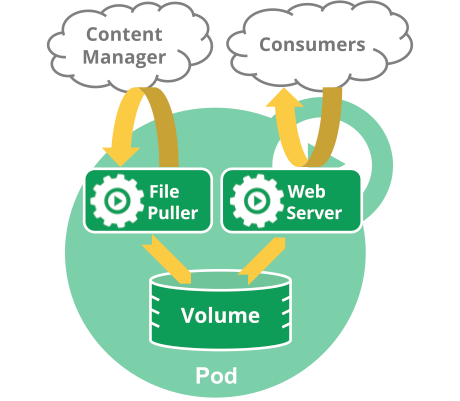
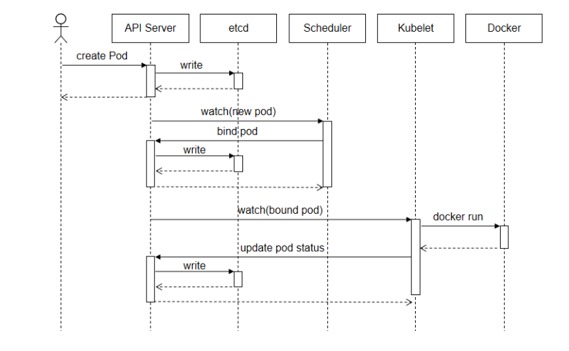
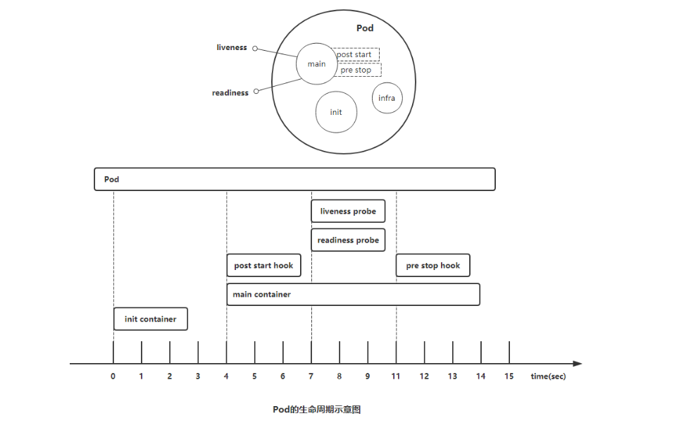
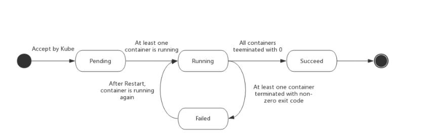
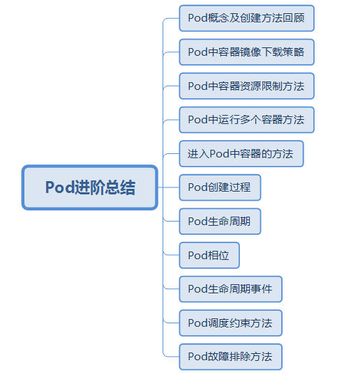

# k8s集群核心概念 Pod进阶

# 一、场景

Pod在kubernetes集群中是核心资源对象之一，前期我们已经在《kubernetes极速入门》课程中讲解了Pod创建及Pod删除方法，但是实际企业应用中，Pod使用远比我们想像复杂，本次课程我们接着为大家讲解Pod进阶。


# 二、学习目标

- [ ] 回顾Pod概念及其创建方法
- [ ] 了解Pod中容器镜像下载策略
- [ ] 掌握Pod中容器资源限制方法
- [ ] 了解Pod中运行多个容器方法
- [ ] 了解通过在Pod容器执行命令的方法
- [ ] 掌握Pod生命周期管理
- [ ] 掌握Pod生命周期事件
- [ ] 掌握Pod调度约束方法
- [ ] 掌握Pod故障排除方法


# 三、学习步骤

|  1   | 回顾Pod概念及其创建方法     |      |
| :--: | --------------------------- | :--: |
|  2   | Pod中容器镜像下载策略       |      |
|  3   | Pod中容器资源限制方法       |      |
|  4   | Pod中运行多个容器方法       |      |
|  5   | 通过在Pod容器执行命令的方法 |      |
|  6   | Pod生命周期管理             |      |
|  7   | Pod生命周期事件             |      |
|  8   | Pod调度约束方法             |      |
|  9   | Pod故障排除方法             |      |


# 四、课程内容

## 4.1 Pod概念及创建方法回顾

### 4.1.1 Pod

- kubernetes集群最小调度管理单元

- 用于封装容器

- 实际应用中我们很少直接在`kubernetes`中创建单个`Pod`。因为`Pod`的生命周期是短暂的，用后即焚的实体。

  **Pod特征**


- 当`Pod`被创建后（不论是由你直接创建还是被其它`Controller`创建），都会被`Kubernetes`调度到集群的节点上。直到`Pod`的进程终止、被删掉、因为缺少资源而被驱逐，在`Node`故障之前这个`Pod`都会一直保持在那个`Node`上。


- `Pod`不会自愈。如果`Pod`运行的`Node`故障，或者是调度器本身故障，这个`Pod`就会被删除。同样的，如果`Pod`所在`Node`缺少资源或者`Pod`处于维护状态，`Pod`也会被驱逐。

  **Pod管理方法**

- `Kubernetes`使用更高级的称为`Controller`的抽象层，来管理`Pod`实例。虽然可以直接使用`Pod`，但是在`Kubernetes`中通常是使用`Controller`来管理`Pod`的。

- `Controller`可以创建和管理多个`Pod`，提供副本管理、滚动升级和集群级别的自愈能力。例如，如果一个`Node`故障，`Controller`就能自动将该节点上的`Pod`调度到其他健康的`Node`上。


### 4.1.2 创建方法

#### 4.1.2.1 命令中创建Pod

> kubernetes版本1.18.0

~~~powershell
命令行创建Pod
[root@master01 ~]# kubectl run nginxpod1 --image=harbor.wego.red/library/nginx:1.9.0 --image-pull-policy=IfNotPresent
~~~

#### 4.1.2.2 使用资源清文件创建

~~~powershell
创建Pod资源清单文件
[root@master01 ~]# cat 01-create-pod.yaml
apiVersion: v1
kind: Pod
metadata:
  name: pod1
spec:
  containers:
  - name: c1
    image: harbar.wego.red/library/nginx:1.9.0
~~~


#### 4.1.2.3 内嵌帮助方法

~~~powershell
获取帮助方法
# kubectl explain pod
~~~


#### 4.1.2.4 以yaml文件格式查看Pod资源清单文件

~~~powershell
查看
# kubectl get pods -o yaml
或
# kubectl get pods -o json
~~~


## 4.2 Pod中容器镜像下载策略

### 4.2.1 策略类型

在kubernetes集群中提供镜像下载策略有三种方式

- Always 每次运行pod都需要下载镜像
- Never 每次运行pod只使用本地镜像
- IfNotPresent 每次运行pod，本地有镜像就使用本地镜像，如果本地没有镜像，就去下载

### 4.2.2 策略类型应用

#### 4.2.2.1 Always

~~~powershell
[root@master01 ~]# cat 02-imagepullpolicy-pod2.yaml
apiVersion: v1
kind: Pod
metadata:
  name: pod2
spec:
  containers:
  - name: c1
    image: harbro.wego.red/library/nginx:1.9.0
    imagePullPolicy: Always #注意此处
    
~~~


#### 4.2.2.2 Never

~~~powershell
[root@master01 ~]# cat 04-imagepullpolicy-pod3.yaml
apiVersion: v1
kind: Pod
metadata:
  name: pod3
spec:
  containers:
  - name: c1
    image: harbro.wego.red/library/nginx:1.9.0
    imagePullPolicy: Never #注意此处
    
~~~


#### 4.2.2.3 IfNotPresent

~~~powershell
[root@master01 ~]# cat 05-imagepullpolicy-pod4.yaml
apiVersion: v1
kind: Pod
metadata:
  name: pod4
spec:
  containers:
  - name: c1
    image: harbro.wego.red/library/nginx:1.9.0s
    imagePullPolicy: IfNotPresent #注意此处
   
~~~


## 4.3 Pod中容器资源限制方法

### 4.3.1 资源限制的作用

- 降低Pod大量使用主机资源风险，避免物理主机处于宕机状态

### 4.3.2 资源限制方法

- resources
  - requests 请求资源
  - limits 限制资源


- 本次实验所使用的物料
  - 镜像：stress：latest
  - 内存限制


#### 4.3.2.1 使用的资源在限定范围内

~~~powershell
[root@master01 ~]# cat 06-limit-mem.yaml
---
apiVersion: v1
kind: Namespace
metadata:
  name: mem-test

---
apiVersion: v1
kind: Pod
metadata:
  name: pod5
  namespace: mem-test
spec:
  containers:
  - name: c1
    image: harbro.wego.red/library/stress:latest
    imagePullPolicy: IfNotPresent
    resources:
      requests:
        memory: "100Mi"
      limits:
        memory: "200Mi"
    command: ["stress"]
    args: ["--vm","1","--vm-bytes","150M","--vm-hang","1"]
~~~


#### 4.3.2.1 使用的资源超出限定范围

~~~powershell
[root@master01 ~]# cat 07-limit-mem.yaml
---
apiVersion: v1
kind: Namespace
metadata:
  name: mem-test

---
apiVersion: v1
kind: Pod
metadata:
  name: smartgopod07
  namespace: mem-test
spec:
  containers:
  - name: c1
    image: harbro.wego.red/library/stress:latest
    imagePullPolicy: IfNotPresent
    resources:
      requests:
        memory: "100Mi"
      limits:
        memory: "200Mi"
    command: ["stress"]
    args: ["--vm","1","--vm-bytes","250M","--vm-hang","1"]
~~~


## 4.4 Pod中运行多个容器方法

### 4.4.1 一个Pod中运行一个Container

~~~powershell
[root@master01 ~]# cat 02-create-pod.yaml
apiVersion: v1
kind: Pod
metadata:
  name: pod1
spec:
  containers:
  - name: c1
    image: harbor.wego.red/library/nginx:1.9.0
~~~


### 4.4.2 一个pod中运行多个Container

`Pod`中可以同时运行多个进程（作为容器运行）协同工作。同一个`Pod`中的容器会自动的分配到同一个`node`上。同一个`Pod`中的容器共享资源、网络环境和依赖，它们总是被同时调度。

注意在一个`Pod`中同时运行多个容器是一种比较高级的用法。只有当你的容器需要紧密配合协作的时候才考虑用这种模式。例如，你有一个容器作为`web`服务器运行，需要用到共享的`volume`，有另一个`“sidecar”`容器来从远端获取资源更新这些文件，如下图所示：




`Pod`中可以共享两种资源：网络和存储

**网络**：每个`pod`都会被分配一个唯一的`IP`地址。`Pod`中的所有容器共享网络空间，包括`IP`地址和端口。`Pod`内部的容器可以使用`localhost`互相通信。`Pod`中的容器与外界通信时，必须分配共享网络资源（例如使用宿主机的端口映射）。

**存储**：可以为一个`Pod`指定多个共享的`Volume`。`Pod`中的所有容器都可以访问共享的`volume`。`Volume`也可以用来持久化`Pod`中的存储资源，以防容器重启后文件丢失。


~~~powershell
[root@master01 ~]# cat 08-one-pod-multi-container.yaml
apiVersion: v1
kind: Pod
metadata:
  name: pod7ss
  namespace: default
spec:
  containers:
  - name: c1
    image:harbor.wego.red/library/stress:latest
    imagePullPolicy: IfNotPresent
    
  - name: c2
    image: harbor.wego.red/library/stress:latest
    imagePullPolicy: IfNotPresent
~~~


## 4.5 进入Pod中容器的方法

- 由于Pod是用后即焚的，不建议进入Pod中，如果进入基本上属于测试使用。


### 4.5.1 一个pod中运行一个Container


~~~powershell
创建资源单文件
[root@master01 ~]# cat 02-create-pod.yaml
apiVersion: v1
kind: Pod
metadata:
  name: pod1
spec:
  containers:
  - name: c1
    image: harbor.wego.red/library/stress:latest
    command: ["stress"]
    args: ["--vm","1","--vm-bytes","150M","--vm-hang","1"]


应用资源清单文件
[root@master01 ~]# kubectl apply -f 02-create-pod.yaml
pod/pod1 created


查看已创建的pod
[root@master01 ~]# kubectl get pods
NAME     READY   STATUS    RESTARTS   AGE
pod1     1/1     Running   0          16s


进入pod中的容器
[root@master01 ~]# kubectl exec -it pod1 bash
bash-4.3# ls
bin    etc    lib    mnt    root   sbin   sys    usr
dev    home   media  proc   run    srv    tmp    var
bash-4.3# touch /root/123.txt
bash-4.3# exit

直接在当前主机命令行操作pod中容器目录
[root@master01 ~]# kubectl exec -it pod1 -- ls /root
123.txt
~~~


### 4.5.2 一个pod中运行多个Container


~~~powershell
创建资源清单文件

[root@master01 ~]# cat 08-one-pod-multi-container.yaml
apiVersion: v1
kind: Pod
metadata:
  name: onepodmultic
  namespace: default
spec:
  containers:
  - name: c1
    image: harbor.wego.red/library/stress:latest
    imagePullPolicy: IfNotPresent
    resources:
      limits:
        memory: "200Mi"
      requests:
        memory: "100Mi"
    command: ["stress"]
    args: ["--vm","1","--vm-bytes","150M","--vm-hang","1"]
  - name: c2
    image: polinux/stress:latest
    imagePullPolicy: IfNotPresent
    resources:
      limits:
        memory: "200Mi"
      requests:
        memory: "100Mi"
    command: ["stress"]
    args: ["--vm","1","--vm-bytes","150M","--vm-hang","1"]


应用资源清单文件
[root@master01 ~]# kubectl apply -f 08-one-pod-multi-container.yaml

查看已创建pod
[root@master01 ~]# kubectl get pods
NAME     READY   STATUS    RESTARTS   AGE
onepodmultic   2/2     Running   0          21m

进入onepodmultic第一个容器
-C 选项为了指定需要进入容器
[root@master01 ~]# kubectl exec -it -c c1 onepodmultic bash
bash-4.3# ls
bin    etc    lib    mnt    root   sbin   sys    usr
dev    home   media  proc   run    srv    tmp    var
bash-4.3# exit

进入onepodmultic第二个容器
[root@master01 ~]# kubectl exec -it -c c2 onepodmultic bash
bash-4.3# ls
bin    etc    lib    mnt    root   sbin   sys    usr
dev    home   media  proc   run    srv    tmp    var
bash-4.3# exit


直接在当前主机命令行操作pod中容器目录
[root@master01 ~]# kubectl exec -it -c c1 onepodmultic -- ls /root
[root@master01 ~]# kubectl exec -it -c c2 onepodmultic -- ls /root
~~~


## 4.6 Pod创建过程

`Pod`是`kubernetes`集群最小调度管理单元，下图描述了一个`Pod`资源对象的典型创建过程。





~~~powershell
pod创建过程
1. 用户通过kubectl或其它API客户端提交了Pod Spec给API Server。
2. API Server尝试着将Pod对象的相关信息存入etcd中，待写入操作执行完成，API Server即会返回确认信息至客户端。
3. API Server开始反馈etcd中的状态变化。
4. 所有的kubernetes组件均使用watch机制来跟踪检查API Server上的相关的变化。
5. kube-scheduler（调度器）通过其watcher觉察到API Server创建了新的Pod对象但尚未绑定至任何工作节点。
6. kube-scheduler为Pod对象挑选一个工作节点并将结果信息更新至API Server。
7. 调度结果信息由API Server更新至etcd存储系统，而且API Server也开始反映此Pod对象的调度结果。
8. Pod被调度到的目标工作节点上的kubelet尝试在当前节点上调用Docker启动容器，并将容器的结果状态返回送至API Server。
9. API Server将Pod状态信息存入etcd系统中。
10. 在etcd确认写入操作成功完成后，API Server将确认信息发送至相关的kubelet告之其Pod状态。
~~~


## 4.7 Pod生命周期

`Pod`对象自从其创建开始至其终止退出的时间范围称为其生命周期。

在这段时间中，`Pod`会处于多种不同的状态，并执行一些操作；其中，创建主容器（`main container`）为必需的操作，其他可选的操作还包括运行初始化容器（`init container`）、容器启动后钩子（`post start hook`）、容器的存活性探测（`liveness probe`）、就绪性探测（`readiness probe`）以及容器终止前钩子（`pre stop hook`）等，这些操作是否执行则取决于`Pod`的定义。如下图所示：





### 4.7.1 Pod启动

1. pod中的容器在创建前,有初始化容器(init container)来进行初始化环境
2. 初化完后,主容器(main container)开始启动
3. 主容器启动后,有一个**post start**的操作(启动后的触发型操作,或者叫启动后钩子)
4. post start后,就开始做健康检查
   - 第一个健康检查叫存活状态检查(liveness probe )，用来检查主容器存活状态的
   - 第二个健康检查叫准备就绪检查(readiness probe)，用来检查主容器是否启动就绪


### 4.7.2 Pod终止

1. 可以在容器终止前设置pre stop操作(终止前的触发型操作,或者叫终止前钩子)
2. 如果容器重启策略允许,则会终止容器。
3. 当出现特殊情况不能正常销毁pod时,大概等待30秒会强制终止


### 4.7.3 pod启动时HealthCheck方式

- HealthCheck

当Pod启动时，容器可能会因为某种错误(服务未启动或端口不正确)而无法访问等。

- Health Check方式

kubelet拥有两个检测器，它们分别对应不同的触发器(根据触发器的结构执行进一步的动作)

| 方式                         | 说明                                                         |
| ---------------------------- | ------------------------------------------------------------ |
| Liveness Probe(存活状态探测) | 检查后不健康，重启pod                                        |
| readiness Probe(就绪型探测)  | 检查后不健康，将容器设置为Notready;如果使用service来访问,流量不会转发给此种状态的pod |


### 4.7.4 pod启动时HealthCheck Probe控制方式

- Probe探测方式

| 方式    | 说明                  |
| ------- | --------------------- |
| Exec    | 执行命令              |
| HTTPGet | http请求某一个URL路径 |
| TCP     | tcp连接某一个端口     |

### 4.7.5 Pod中容器重启策略

`Pod.Spec`中有一个`restartPolicy`字段，可能的值为`Always`、`OnFailure`和`Never`。默认为`Always`。`restartPolicy`适用于`Pod`中的所有容器。而且它仅用于控制在同一节点上重新启动`Pod`对象的相关容器。首次需要重启的容器，将在其需要时立即进行重启，随后再次需要重启的操作将由`kubelet`延迟一段时间后进行，且反复的重启操作的延迟时长依次为`10秒、20秒、40秒... 300秒`是最大延迟时长。事实上，一旦绑定到一个节点，`Pod`对象将永远不会被重新绑定到另一个节点，它要么被重启，要么终止，直到节点发生故障或被删除。

- Always：表示容器挂了总是重启，这是默认策略 
- OnFailure：表容器状态为错误时才重启，也就是容器正常终止时不重启 
- Never：表示容器挂了不予重启 
- 对于Always这种策略，容器只要挂了，就会立即重启，这样是很耗费资源的。所以Always重启策略是这么做的：第一次容器挂了立即重启，如果再挂了就要延时10s重启，第三次挂了就等20s重启...... 依次类推 


## 4.8 Pod状态（相位 phase）

`Pod`的`status`字段是一个`PodStatus`的对象，`PodStatus`中有一个`phase`字段。

无论是手动创建还是通过`Deployment`等控制器创建，`Pod`对象总是应该处于其生命进程中以下几个相位（`phase`）之一。

- 挂起（`Pending`）：`API Server`创建了`pod`资源对象已存入`etcd`中，但它尚未被调度完成，或者仍处于从仓库下载镜像的过程中。
- 运行中（`Running`）：`Pod`已经被调度至某节点，并且所有容器都已经被`kubelet`创建完成。
- 成功（`Succeeded`）：`Pod`中的所有容器都已经成功终止并且不会被重启
- 失败（`Failed`）：`Pod`中的所有容器都已终止了，并且至少有一个容器是因为失败终止。即容器以`非0`状态退出或者被系统禁止。
- 未知（`Unknown`）：`Api Server`无法正常获取到`Pod`对象的状态信息，通常是由于无法与所在工作节点的`kubelet`通信所致。





## 4.9 Pod生命周期中重要行为

### 4.9.1 初始化容器

初始化容器（`init container`）即应用程序的主容器启动之前要运行的容器，常用于为主容器执行一些预置操作，它们具有两种典型特征。

1）初始化容器必须运行完成直至结束，若某初始化容器运行失败，那么`kubernetes`需要重启它直到成功完成。（注意：如果`pod`的`spec.restartPolicy`字段值为“`Never`”，那么运行失败的初始化容器不会被重启。）

2）每个初始化容器都必须按定义的顺序串行运行。

### 4.9.2 容器探测

容器探测（`container probe`）是`Pod`对象生命周期中的一项重要的日常任务，它是`kubelet`对容器周期性执行的健康状态诊断，诊断操作由容器的处理器（`handler`）进行定义。`Kubernetes`支持三种处理器用于`Pod`探测：

- `ExecAction`：在容器内执行指定命令，并根据其返回的状态码进行诊断的操作称为`Exec`探测，状态码为`0`表示成功，否则即为不健康状态。
- `TCPSocketAction`：通过与容器的某`TCP`端口尝试建立连接进行诊断，端口能够成功打开即为正常，否则为不健康状态。
- `HTTPGetAction`：通过向容器`IP`地址的某指定端口的指定`path`发起`HTTP GET`请求进行诊断，响应码为`2xx`或`3xx`时即为成功，否则为失败。

任何一种探测方式都可能存在三种结果：`“Success”（成功）`、`“Failure”（失败）`、`“Unknown”（未知）`，只有`success`表示成功通过检测。


容器探测分为两种类型：

- **存活性探测（livenessProbe）**：用于判定容器是否处于“运行”（`Running`）状态；一旦此类检测未通过，`kubelet`将杀死容器并根据重启策略（`restartPolicy`）决定是否将其重启；未定义存活检测的容器的默认状态为“`Success`”。
- **就绪性探测（readinessProbe）**：用于判断容器是否准备就绪并可对外提供服务；未通过检测的容器意味着其尚未准备就绪，端点控制器（如`Service`对象）会将其`IP`从所有匹配到此`Pod`对象的`Service`对象的端点列表中移除；检测通过之后，会再将其`IP`添加至端点列表中


### 4.9.3 使用探针(liveness和readiness)的时机

如果容器中的进程能够在遇到问题或不健康的情况下自行崩溃，则不一定需要存活探针，`kubelet`将根据`Pod`的`restartPolicy`自动执行正确的操作。

如果希望容器在探测失败时被杀死并重新启动，那么请指定一个存活探针，并指定`restartPolicy`为`Always`或`OnFailure`。

如果要仅在探测成功时才开始向`Pod`发送流量，请指定就绪探针。在这种情况下，就绪探针可能与存活探针相同，但是`spec`中的就绪探针的存在意味着`Pod`将在没有接收到任何流量的情况下启动，并且只有在探针探测成功才开始接收流量。

如果希望容器能够自行维护，可以指定一个就绪探针，该探针检查与存活探针不同的端点。

> 如果只想在`Pod`被删除时能够排除请求，则不一定需要使用就绪探针；在删除`Pod`时，`Pod`会自动将自身置于未完成状态，无论就绪探针是否存在。当等待`Pod`中的容器停止时，`Pod`仍处于未完成状态。


## 4.10 Pod中容器探针应用案例

### 4.10.1 liveness

#### 4.10.1.1 livenessProbe行为属性

~~~powershell
[root@master01 ~]# kubectl explain pods.spec.containers.livenessProbe
KIND:     Pod
VERSION:  v1

RESOURCE: livenessProbe <Object>

exec   command 的方式探测，例如 ps 一个进程是否存在

failureThreshold    探测几次失败 才算失败， 默认是连续三次

initialDelaySeconds  初始化延迟探测，即容器启动多久之后再开始探测，默认为0秒

periodSeconds  每隔多久探测一次，默认是10秒

successThreshold  处于失败状态时，探测操作至少连续多少次的成功才算通过检测，默认为1秒

timeoutSeconds  存活性探测的超时时长，默认为1秒

httpGet   http请求探测

tcpSocket    端口探测
~~~


#### 4.10.1.2 liveness-exec案例

- 准备YAML文件


```powershell
[root@master01 ~]# vim 01_pod_liveness_exec.yaml
apiVersion: v1
kind: Pod
metadata:
  name: liveness-exec
  namespace: default
spec:
  containers:
  - name: liveness
    image: harbor.wego.red/library/busyboxplus:latest
    imagePullPolicy: IfNotPresent
    args:
    - /bin/sh
    - -c
    - touch /tmp/healthy; sleep 30; rm -rf /tmp/healthy; sleep 600
    livenessProbe:
      exec:
        command:
        - cat
        - /tmp/healthy
      initialDelaySeconds: 5 				# pod启动延迟5秒后探测
      periodSeconds: 5 						# 每5秒探测1次
```


~~~powershell
说明：
上面的资源清单中定义了一个pod对象，基于busyboxplus镜像启动一个运行touch /tmp/healthy; sleep 30; rm -rf /tmp/healthy; sleep 600命令的容器，此命令在容器启动时创建了/tmp/healthy文件，并于30秒之后将其删除。

存活性探针运行cat /tmp/healthy命令检查/tmp/healthy文件的存在性，若文件存在则返回状态码0，表示成功通过测试。

在30秒内使用kubectl describe pods/liveness-exec-pod查看其详细信息，其存活性探测不会出现错误。

而超过30秒之后，再执行该命令查看详细信息，可以发现存活性探测出现了故障，并且还可通过kubectl get pods查看该pod的重启的相关信息。
~~~


-  应用YAML文件

```powershell
[root@master01 ~]# kubectl apply -f 01_pod_liveness_exec.yaml
```


- 通过下面的命令观察

```powershell
[root@master01 ~]# kubectl describe pod liveness-exec
......
Events:
  Type     Reason     Age   From               Message
  ----     ------     ----  ----               -------
  Normal   Scheduled  40s   default-scheduler  Successfully assigned default/liveness-exec to node1
  Normal   Pulled     38s   kubelet, node1     Container image "busybox" already present on machine
  Normal   Created    37s   kubelet, node1     Created container liveness
  Normal   Started    37s   kubelet, node1     Started container liveness
  Warning  Unhealthy  3s    kubelet, node1     Liveness probe failed: cat: can't open '/tmp/healthy': No such file or directory

看到40s前被调度以node1节点,3s前健康检查出问题
```


- 过几分钟再观察

```powershell
[root@master01 ~]# kubectl describe pod liveness-exec
......
Events:
  Type     Reason     Age                  From               Message
  ----     ------     ----                 ----               -------
  Normal   Scheduled  3m42s                default-scheduler  Successfully assigned default/liveness-exec to node1
  Normal   Pulled     70s (x3 over 3m40s)  kubelet, node1     Container image "busybox" already present on machine
  Normal   Created    70s (x3 over 3m39s)  kubelet, node1     Created container liveness
  Normal   Started    69s (x3 over 3m39s)  kubelet, node1     Started container liveness
  Warning  Unhealthy  26s (x9 over 3m5s)   kubelet, node1     Liveness probe failed: cat: can't open '/tmp/healthy': No such file or directory
  Normal   Killing    26s (x3 over 2m55s)  kubelet, node1     Container liveness failed liveness probe, will be restarted
```


```powershell
[root@master01 ~]# kubectl get pod
NAME            READY   STATUS    RESTARTS   AGE
liveness-exec   1/1     Running   3          4m12s

看到重启3次,慢慢地重启间隔时间会越来越长
```


#### 4.10.1.3: liveness-httpget案例


~~~powershell
基于HTTP的探测（HTTPGetAction）向目标容器发起一个HTTP请求，根据其响应码进行结果判定，响应码如2xx或3xx时表示测试通过。

通过该命令”`# kubectl explain pod.spec.containers.livenessProbe.httpGet`“查看`httpGet`定义的字段
~~~


~~~powershell
host    <string>：请求的主机地址，默认为Pod IP，也可以在httpHeaders中使用“Host:”来定义。
httpHeaders    <[]Object>：自定义的请求报文首部。
port    <string>：请求的端口，必选字段。
path    <string>：请求的HTTP资源路径，即URL path。
scheme    <string>：建立连接使用的协议，仅可为HTTP或HTTPS，默认为HTTP。
~~~


- 编写YMAL文件


```powershell
[root@master01 ~]# vim 02_pod_liveness_httpget.yaml
apiVersion: v1
kind: Pod
metadata:
  name: liveness-httpget
  namespace: default
spec:
  containers:
  - name: liveness
    image: harbor.wego.red/library/nginx:latest
    imagePullPolicy: IfNotPresent
    ports:
    - name: http
      containerPort: 80
    livenessProbe:
      httpGet:                          # 使用httpGet方式
        port: http                      # http协议
        path: /index.html               # 探测家目录下的index.html
      initialDelaySeconds: 3            # 延迟3秒开始探测
      periodSeconds: 5                  # 每隔5s钟探测一次
```


- 应用YAML文件

```powershell
[root@master01 ~]# kubectl apply -f pod-liveness-httpget.yml
```


- 验证查看

```powershell
[root@master01 ~]# kubectl get pods
NAME               READY   STATUS             RESTARTS   AGE
liveness-httpget   1/1     Running            0          9s
```


- 交互删除nginx里的主页文件

```powershell
[root@master01 ~]# kubectl exec -it liveness-httpget -- rm -rf /usr/share/nginx/html/index.html
```


- 验证查看会发现

```powershell
[root@master01 ~]# kubectl get pod
NAME               READY   STATUS    RESTARTS   AGE
liveness-httpget   1/1     Running   1          11m
```


#### 4.10.1.4  liveness-tcpSocket案例


- 编写YAML文件

```powershell
[root@master01 ~]# vim 03_pod_liveness_tcp.yaml
apiVersion: v1
kind: Pod
metadata:
  name: liveness-tcp
  namespace: default
spec:
  containers:
  - name: c1
    image: harbor.wego.red/library/nginx:latest
    imagePullPolicy: IfNotPresent
    ports:
    - name: http
      containerPort: 80
    livenessProbe:
      tcpSocket:                        # 使用tcp连接方式
        port: 80                        # 连接80端口进行探测
      initialDelaySeconds: 3
      periodSeconds: 5
```


-  应用YAML文件创建pod

```powershell
[root@master01 ~]# kubectl apply -f pod-liveness-tcp.yml
pod/liveness-tcp created
```


- 查看验证

```powershell
[root@master01 ~]# kubectl get pod
NAME               READY   STATUS             RESTARTS   AGE
liveness-tcp       1/1     Running            0          14s
```


- 交互关闭nginx

```powershell
[root@master01 ~]# kubectl exec -it liveness-tcp -- /usr/sbin/nginx -s stop
```


- 再次验证查看

```powershell
[root@master01 ~]# kubectl get pod
NAME               READY   STATUS    RESTARTS   AGE
liveness-tcp       1/1     Running   1          5m13s

也只重启1次,重启后重新初始化了
```


### 4.10.2 readiness

`Pod`对象启动后，容器应用通常需要一段时间才能完成其初始化过程，例如加载配置或数据，甚至有些程序需要运行某类的预热过程，若在这个阶段完成之前即接入客户端的请求，势必会等待太久。因此，这时候就用到了就绪性探测（`readinessProbe`）。

与存活性探测机制类似，就绪性探测是用来判断容器就绪与否的周期性（默认周期为10秒钟）操作，它用于探测容器是否已经初始化完成并可服务于客户端请求，探测操作返回`”success“`状态时，即为传递容器已经”就绪“的信号。

就绪性探测也支持`Exec`、`HTTPGet`和`TCPSocket`三种探测方式，且各自的定义机制也都相同。但与存活性探测触发的操作不同的是，探测失败时，就绪探测不会杀死或重启容器以保证其健康性，而是通知其尚未就绪，并触发依赖于其就绪状态的操作（例如，从`Service`对象对应的端点列表中移除此`Pod`对象）以确保不会有客户端请求接入此`Pod`对象。


#### 4.10.2.1: readiness案例


-  编写YAML文件


```powershell
[root@master01 ~]# vim 04_pod_readiness_httpget.yaml
apiVersion: v1
kind: Pod
metadata:
  name: readiness-httpget
  namespace: default
spec:
  containers:
  - name: c1
    image: harbor.wego.red/library/nginx:latest
    imagePullPolicy: IfNotPresent
    ports:
    - name: http
      containerPort: 80
    readinessProbe:                     # 这里由liveness换成了readiness
      httpGet:
        port: http
        path: /index.html
      initialDelaySeconds: 3
      periodSeconds: 5
---
apiVersion: v1
kind: Service
metadata:
  name: readiness-svc
spec:
  type: ClusterIP
  ports:
  - port: 80
    targetPort: 80
  selector:
    app: nginx
```


- 应用YAML文件

```powershell
[root@master01 ~]# kubectl apply -f pod-readiness-httpget.yaml
pod/readiness-httpget created
```


- 验证查看

```powershell
[root@master01 ~]# kubectl get pod
NAME                READY   STATUS             RESTARTS   AGE
readiness-httpget   1/1     Running            0          10s
```


- 交互删除nginx主页

```powershell
[root@master01 ~]# kubectl exec -it readiness-httpget -- rm -rf /usr/share/nginx/html/index.html
```


- 再次验证

```powershell
[root@master01 ~]# kubectl get pod
NAME                READY   STATUS    RESTARTS   AGE
readiness-httpget   0/1     Running   0          2m49s

READY状态为0/1
```


- 交互创建nginx主页文件再验证

```powershell
[root@master01 ~]# kubectl exec -it readiness-httpget -- touch /usr/share/nginx/html/index.html
```

```powershell
[root@master01 ~]# kubectl get pod
NAME                READY   STATUS             RESTARTS   AGE
readiness-httpget   1/1     Running            0          3m10s

READY状态又为1/1了
```


通过上面测试可以看出，当我们删除了`nginx`主页文件后，`readinessProbe`发起的测试就会失败，此时我们再查看`pod`的状态会发现并不会将`pod`删除重新启动，只是在`READY字段`可以看出，当前的`Pod`处于未就绪状态。


### 4.10.3 liveness+readiness综合案例

- 第一种方法：liveness+readiness
- 第二种方法：readiness+liveness


- 编写YAML文件

```powershell
[root@master01 ~]# vim 05_Pod_liveness_readiness.yaml
apiVersion: v1
kind: Pod
metadata:
  name: liveness-readiness-httpget
  namespace: default
spec:
  containers:
  - name: liveness-readiness
    image: harbor.wego.red/library/nginx:latest
    imagePullPolicy: IfNotPresent
    ports:
    - name: http
      containerPort: 80
      
    livenessProbe:
      httpGet:
        port: http
        path: /index.html
      initialDelaySeconds: 1
      periodSeconds: 3
      
    readinessProbe:
      httpGet:
        port: http
        path: /index.html
      initialDelaySeconds: 5
      periodSeconds: 5  
```


- 应用YAML文件

```powershell
[root@master01 ~]# kubectl apply -f 05_pod_liveness_readiness.yaml
pod/liveness-readiness-httpget created
```


-  验证

```powershell
[root@master01 ~]# kubectl get pod
NAME                         READY   STATUS             RESTARTS   AGE
liveness-readiness-httpget   0/1     Running            0          6s

```

```powershell
[root@master01 ~]# kubectl get pod
NAME                         READY   STATUS             RESTARTS   AGE

liveness-readiness-httpget   1/1     Running            0          11s

```


## 4.11 Pod生命周期事件

Pod生命周期事件是在Pod中容器启动后及容器关闭前所执行的事件。


### 4.11.1 pod生命周期事件 post start

- 编写YAML文件

```powershell
[root@master01 ~]# vim 07_Pod_poststart.yaml
apiVersion: v1
kind: Pod
metadata:
  name: poststart
  namespace: default
spec:
  containers:
  - name: poststart
    image: harbor.wego.red/library/nginx:latest
    imagePullPolicy: IfNotPresent
    lifecycle:                                       # 生命周期事件
      postStart:
        exec:
          command: ["/bin/sh","-c","echo  'hello post start' > /usr/share/nginx/html/index.html"]
```


- 应用YMAL文件

```powershell
[root@master01 ~]# kubectl apply -f 07_Pod_poststart.yaml
```


- 验证

```powershell
[root@master01 ~]# kubectl get pods
NAME                         READY   STATUS             RESTARTS   AGE
poststart                    1/1     Running            0          25s
```


```powershell
[root@master01 ~]# kubectl exec -it poststart -- cat /usr/share/nginx/html/index.html
hello post start
```


### 4.11.2 pod生命周期事件 pre stop

- 容器终止前执行的命令


- 编写YAML文件

~~~powershell
[root@master01 ~]# vim 08_Pod_prestop.yaml
apiVersion: v1
kind: Pod
metadata:
  name: prestop
  namespace: default
spec:
  containers:
  - name: prestop
    image: harbor.wego.red/library/nginx:latest
    imagePullPolicy: IfNotPresent
    volumeMounts:
    - name: message
      mountPath: /usr/share/nginx/html/
    lifecycle:
      preStop: 
        exec:
          command: ["/bin/sh","-c","echo 'Web Server stopped' > /usr/share/nginx/html/index.html"]
          
  volumes:
  - name: message
    hostPath:
      path: /tmp
~~~


- 应用YAML文件创建pod

```powershell
[root@master01 ~]# kubectl apply -f 08_Pod_prestop.yaml
pod/prestop created
```


- 删除pod验证

```powershell
[root@master01 ~]# kubectl delete -f 08_Pod_prestart.yml
pod "prestop" deleted				
```


- 查看文件

~~~powershell
[root@master01 ~]# kubectl get pods -o wide
NAME      READY   STATUS    RESTARTS   AGE   IP             NODE       NOMINATED NODE   READINESS GATES
prestop   1/1     Running   0          21s   10.224.19.90   worker03   <none>           <none>

[root@master01 ~]# ssh worker03.wego.red                                      
[root@worker03 ~]# ls /tmp
index.html

[root@worker03 ~]# cat /tmp/index.html
Web Server stopped
~~~


## 4.12 pod调度约束方法

我们为了实现容器主机资源平衡使用, 可以使用约束把pod调度到指定的worker节点

- nodeName 用于将pod调度到指定的worker名称上
- nodeSelector 用于将pod调度到匹配Label的worker上

### 4.12.1 nodeName


- 编写YAML文件

```powershell
[root@master01 ~]# vim 09_Pod_nodename.yaml
apiVersion: v1
kind: Pod
metadata:
  name: pod-nodename
spec:
  nodeName: worker01                       # 通过nodeName调度到worker01节点
  containers:
  - name: nginx
    image: harbor.wego.red/library/nginx:latest
```


- 应用YAML文件创建pod

```powershell
[root@master01 ~]# kubectl apply -f 09_Pod_nodename.yaml
pod/pod-nodename created
```


- 验证

```powershell
[root@master01 ~]# kubectl describe pod pod-nodename |tail -6
Events:
  Type    Reason   Age   From            Message
  ----    ------   ----  ----            -------
  Normal  Pulled   40s   kubelet, worker01  Container image "harbor.wego.red/library/nginx:latest" already present on machine
  Normal  Created  40s   kubelet, worker01  Created container nginx
  Normal  Started  39s   kubelet, worker01  Started container nginx

倒数第3行没有使用scheduler,而是直接给worker01了,说明nodeName约束生效
```


### 4.12.2 nodeSelector


- 为worker02打标签

```powershell
[root@master01 ~]# kubectl label nodes worker02 app=webserver
node/worker02 labeled
```


- 编写YAML文件

```powershell
[root@master01 ~]# vim 10_Pod_nodeselector.yml
apiVersion: v1
kind: Pod
metadata:
  name: pod-nodeselect
spec:
  nodeSelector:                         # nodeSelector节点选择器
    app: webserver                    # 指定调度到标签为app=webserver的节点
  containers:
  - name: nginx
    image: harbor.wego.red/library/nginx:latest
```


- 应用YAML文件创建pod

```powershell
[root@master01 ~]# kubectl apply -f 10_Pod_nodeselector.yaml
pod/pod-nodeselect created
```


- 验证

```powershell
[root@master01 ~]# kubectl describe pod pod-nodeselect |tail -6
  Type    Reason     Age   From               Message
  ----    ------     ----  ----               -------
  Normal  Scheduled  10s   default-scheduler  Successfully assigned default/pod-nodeselect to worker02
  Normal  Pulled     8s    kubelet, worker02     Container image "nginx:1.15" already present on machine
  Normal  Created    8s    kubelet, worker02     Created container nginx
  Normal  Started    7s    kubelet, worker02     Started container nginx

仍然经过了scheduler,但确实分配到了worker02上
```


## 4.13 pod故障排除方法

| 状态             | 描述                                                         |
| ---------------- | ------------------------------------------------------------ |
| Pending          | pod创建已经提交到Kubernetes。但是，因为某种原因而不能顺利创建。例如下载镜像慢，调度不成功。 |
| Running          | pod已经绑定到一个节点，并且已经创建了所有容器。至少有一个容器正在运行中，或正在启动或重新启动。 |
| completed        | Pod中的所有容器都已成功终止，不会重新启动。                  |
| Failed           | Pod的所有容器均已终止，且至少有一个容器已在故障中终止。也就是说，容器要么以非零状态退出，要么被系统终止。 |
| Unknown          | 由于某种原因apiserver无法获得Pod的状态，通常是由于Master与Pod所在主机kubelet通信时出错。 |
| CrashLoopBackOff | 多见于CMD语句错误或者找不到container入口语句导致了快速退出,可以用kubectl logs 查看日志进行排错 |


| 排错命令                                            | 作用            |
| :-------------------------------------------------- | :-------------- |
| kubectl describe pod  pod名                         | 查看Pod描述     |
| kubectl logs pod  [-c CONTAINER]                    | 查看Pod日志     |
| kubectl exec POD [-c CONTAINER] --COMMAND [args...] | 在Pod中执行命令 |


# 五、学习总结





# 六、课程预约

深入学习kubernetes，可以预约《kubernetes集群从入门到企业应用实战》相关课程。


