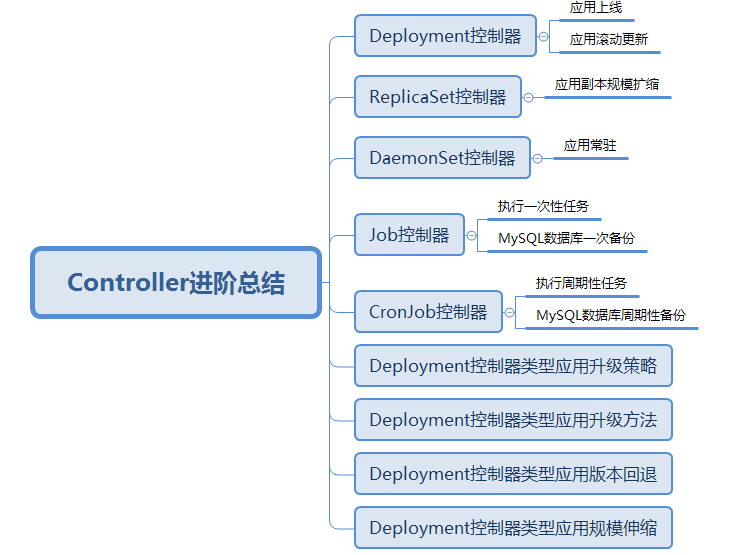

# kubernetes集群应用 Controller进阶

# 一、场景

Pod在实际应用中，大多数都是带有Controller对其进行管理和控制，控制器能够监视到Pod状态并对Pod进行拉起或关闭或更新操作等，根据不同类型的控制器，可以实现应用服务的管理方法的不同。


# 二、学习目标

- [x] 掌握deployment控制器应用
- [x] 掌握replicaSet控制器应用
- [x] 掌握daemonSet控制器应用
- [x] 掌握job控制器应用
- [ ] 掌握Cronjob控制器应用
- [ ] 掌握deployment控制器类型应用升级策略
- [ ] 掌握deployment控制器类型应用升级
- [ ] 掌握deployment控制器类型应用版本回退
- [ ] 掌握deployment控制器类型应用规模自动伸缩


# 三、学习步骤

| 序号 | 步骤                                 | 备注 |
| :--: | ------------------------------------ | :--: |
|  1   | deployment控制器应用                 |      |
|  2   | replicaSet控制器应用                 |      |
|  3   | daemonSet控制器应用                  |      |
|  4   | job控制器应用                        |      |
|  5   | Cronjob控制器应用                    |      |
|  6   | deployment控制器类型应用升级策略     |      |
|  7   | deployment控制器类型应用升级         |      |
|  8   | deployment控制器类型应用版本回退     |      |
|  9   | deployment控制器类型应用规模自动伸缩 |      |


# 四、课程内容

## 4.1 deployment控制器介绍

- Deployment控制器具备上线部署、滚动升级、创建副本、回滚到以前某一版本（成功/ 稳定）的Deployment等功能
- Deployment控制器结合了ReplicaSet控制能够对Pod进行更复杂的操作，例如：Pod扩容或缩容等。
- 除非需要自定义升级功能或者根本不需要升级Pod，否则还是建议使用Deployment而不直接使用ReplicaSet 。


### 4.1.1 通过yaml文件创建deployment控制器类型的应用

- 编写用于创建deployment控制器类型应用的资源清单文件

```powershell
[root@master01 ~]# cat 01-create-deployment-app-nginx.yaml
apiVersion: apps/v1
kind: Deployment
metadata:
  name: nginx-deployment
spec:
  replicas: 1
  selector:
    matchLabels:
      app: nginx
  template:
    metadata:
      labels:
        app: nginx
    spec:
      containers:
      - name: c1
        image: harbor.wego.red/library/nginx:1.9.0
        imagePullPolicy: IfNotPresent
        ports:
        - containerPort: 80
```


- 应用创建deployment控制器类型资源清单文件

```powershell
[root@master01 ~]# kubectl apply -f 01-create-deployment-app-nginx.yaml
deployment.apps/nginx-deployment created
```


- 验证

```powershell
验证deployment控制器类型应用创建结果
[root@master01 ~]# kubectl get deployment
NAME               READY   UP-TO-DATE   AVAILABLE   AGE

nginx-deployment   1/1     1            1           31s

查看deployment控制器类型应用创建的pod
[root@master01 ~]# kubectl get pods
NAME                                READY   STATUS    RESTARTS   AGE

nginx-deployment-58d4d484ff-cjg52   1/1     Running   0          48s

查看deployment控制器类型应用创建的pod详细信息
[root@master01 ~]# kubectl get pods -o wide
NAME                                READY   STATUS    RESTARTS   AGE   IP           NODE    NOMINATED NODE   READINESS GATES

nginx-deployment-58d4d484ff-cjg52   1/1     Running   0          61s   172.16.1.8   node2   <none>           <none>
```


### 4.1.2 删除deployment控制器类型的应用


#### 4.1.2.1 通过deployment控制器名称删除

```powershell
查看是否有deployment控制器类型的应用
[root@master01 ~]# kubectl get deployment
NAME               READY   UP-TO-DATE   AVAILABLE   AGE
nginx-deployment   1/1     1            1           38h
或使用以下方法查看
[root@master01 ~]# kubectl get deployment.apps
NAME               READY   UP-TO-DATE   AVAILABLE   AGE
nginx-deployment   1/1     1            1           38h

通过deployment控制器类型应用名称删除对应的应用
[root@master01 ~]# kubectl delete deployment.apps nginx-deployment
deployment.apps "nginx-deployment" deleted

查看是否删除pod
[root@master01 ~]# kubectl get pods
NAME                                READY   STATUS    RESTARTS   AGE
nginx-deployment-58d4d484ff-cjg52   1/1     Running   0          39h
onepod                              2/2     Running   0          40h
pod1                                1/1     Running   0          40h

验证查看是否删除
[root@master01 ~]# kubectl get deployment.apps
NAME               READY   UP-TO-DATE   AVAILABLE   AGE
nginx-deployment   1/1     1            1           39h
```


#### 4.1.2.2 删除通过yaml文件部署的应用

```powershell
查看已部署的deployment控制器类型的应用
[root@master01 ~]# kubectl get deployment.apps
NAME               READY   UP-TO-DATE   AVAILABLE   AGE
nginx-deployment   1/1     1            1           39h


通过deployment控制器类型应用资源清单文件删除应用
[root@master01 yamldir]# kubectl delete -f 01-create-deployment-app-nginx.yaml
deployment.apps "nginx-deployment" deleted

验证是否被删除
[root@master01 yamldir]# kubectl get deployment.apps
No resources found.
```


## 4.2 replicaSet控制器

- 它可以利用预先创建好的模板(容器镜像)定义副本数量(用户期望值)并自动控制
- 通过改变Pod副本数量实现Pod的扩容和缩容

### 4.2.1 创建replicaset控制器类型应用资源清单文件

```powershell
[root@master01 ~]# cat 02_rs.yaml
apiVersion: apps/v1
kind: ReplicaSet
metadata:
  name: nginx-rs
  namespace: default
spec:                    # replicaset的spec
  replicas: 2            # 副本数
  selector:              # 标签选择器,对应pod的标签
    matchLabels:
      app: nginx         # 匹配的label
  template:
    metadata:
      name: nginx		# pod名
      labels:           # 对应上面定义的标签选择器selector里面的内容
        app: nginx
    spec:               # pod的spec
      containers:
      - name: nginx
        image: harbor.wego.red/library/nginx:1.9.0
        ports:
        - name: http
          containerPort: 80
```


### 4.2.2 应用创建replicaset控制器类型的应用资源清单文件

```powershell
[root@master01 ~]# kubectl apply -f 02_rs.yaml
replicaset.apps/nginx-rs created
```


### 4.2.3 验证应用是否创建

```powershell
[root@master01 ~]# kubectl get rs
NAME       DESIRED   CURRENT   READY   AGE
nginx-rs   2         2         2       23s
```

```powershell
[root@master01 ~]# kubectl get pods
NAME             READY   STATUS    RESTARTS   AGE
nginx-rs-6slkh   1/1     Running   0          49s
nginx-rs-f6f2p   1/1     Running   0          49s
```


```powershell
[root@master01 ~]# kubectl get deployment
No resources found.

找不到deployment,说明创建rs并没有创建deployment
```


## 4.3 daemonSet控制器

- DaemonSet能够让所有（或者特定）的节点运行同一个pod
- 实现某些应用的常驻
- DaemonSet一般应用于日志收集、监控采集、分布式存储守护进程、ingress等
- 当节点加入到K8S集群中，pod会被（DaemonSet）调度到该节点上运行，当节点从K8S集群中被移除，被DaemonSet调度的pod会被移除
- 如果删除DaemonSet，所有跟这个DaemonSet相关的pods都会被删除。
- 如果一个DaemonSet的Pod被杀死、停止、或者崩溃，那么DaemonSet 将会重新创建一个新的副本在这台计算节点上。

### 4.3.1 创建daemonset控制器类型应用资源清单文件

```powershell
[root@master01 ~]# cat 03_nginx-daemonset.yaml
apiVersion: apps/v1
kind: DaemonSet
metadata:
  name: nginx-daemonset
spec:
  selector:
    matchLabels:
      app: nginx
  template:
    metadata:
      labels:
        app: nginx
    spec:
      tolerations:                         # tolerations代表容忍
      - key: node-role.kubernetes.io/master  # 能容忍的污点key
        effect: NoSchedule   # kubectl explain pod.spec.tolerations查看(能容忍的污点effect)
      containers:
      - name: nginx
        image: harbor.wego.red/library/nginx:1.9.0
        imagePullPolicy: IfNotPresent
        resources:    # resources资源限制是为了防止master1节点的资源被占太多(根据实际情况配置)
          limits:
            memory: 100Mi
          requests:
            memory: 100Mi
```


### 4.3.2 应用用于创建daemonset控制器类型应用资源清单文件

```powershell
[root@master01 ~]# kubectl apply -f 03_nginx-daemonset.yaml
daemonset.apps/nginx-daemonset created
```


### 4.3.3 验证应用是否创建

```powershell
[root@master01 ~]# kubectl get daemonset.apps
NAME              DESIRED   CURRENT   READY   UP-TO-DATE   AVAILABLE   NODE SELECTOR   AGE
nginx-daemonset   3         3         3       3            3           <none>          117s
```

```powershell
[root@master01 ~]# kubectl get pods |grep nginx-daemonset
nginx-daemonset-8rqwl     1/1     Running            0          2m18s
nginx-daemonset-f4dz6     1/1     Running            0          2m18s
nginx-daemonset-shggq     1/1     Running            0          2m18s
```


## 4.4 job控制器

- 对于ReplicaSet而言，它希望pod保持预期数目、持久运行下去，除非用户明确删除，否则这些对象一直存在，它们针对的是耐久性任务，如web服务等。
- 对于非耐久性任务，比如备份文件、压缩文件，任务完成后，pod需要结束运行，不需要pod继续保持在系统中，这个时候就要用到Job。
- Job负责批量处理短暂的一次性任务(short lived one-off tasks)，即仅执行一次的任务，它保证批处理任务的一个或多个Pod成功结束。

### 4.4.1  创建job控制器应用案例1

> 计算圆周率2000位 

#### 4.4.1.1 创建job控制器类型应用资源清单文件

```powershell
[root@master1 ~]# vim 01_job.yaml
apiVersion: batch/v1
kind: Job
metadata:
  name: pi                      # job名
spec:
  template:
    metadata:
      name: pi          # pod名
    spec:
      containers:
      - name: pi        # 容器名
        image: harbor.wego.red/library/perl:latest     # 此镜像有800多M,可提前导入到所有节点,也可能指定导入到某一节点然后指定调度到此节点
        imagePullPolicy: IfNotPresent
        command: ["perl",  "-Mbignum=bpi", "-wle", "print bpi(2000)"]
      restartPolicy: Never   # 执行完后不再重启
```


#### 4.4.1.2 应用创建job控制器类型应用资源清单文件

```powershell
[root@master01 ~]# kubectl apply -f 01_job.yaml
job.batch/pi created
```


#### 4.4.1.3 验证job控制器类型应用是否创建

```powershell
[root@master01 ~]# kubectl get jobs
NAME   COMPLETIONS   DURATION   AGE
pi     1/1           11s        18s
```

```powershell
[root@master01 ~]# kubectl get pods
NAME                         READY   STATUS             RESTARTS   AGE
pi-tjq9b                     0/1     Completed          0         27s

Completed状态,也不再是ready状态
```

```powershell
[root@master1 ~]# kubectl logs pi-tjq9b
3.1415926535897932384626433832795028841971693993751058209749445923078164062862089986280348253421170679821480865132823066470938446095505822317253594081284811174502841027019385211055596446229489549303819644288109756659334461284756482337867831652712019091456485669234603486104543266482133936072602491412737245870066063155881748815209209628292540917153643678925903600113305305488204665213841469519415116094330572703657595919530921861173819326117931051185480744623799627495673518857527248912279381830119491298336733624406566430860213949463952247371907021798609437027705392171762931767523846748184676694051320005681271452635608277857713427577896091736371787214684409012249534301465495853710507922796892589235420199561121290219608640344181598136297747713099605187072113499999983729780499510597317328160963185950244594553469083026425223082533446850352619311881710100031378387528865875332083814206171776691473035982534904287554687311595628638823537875937519577818577805321712268066130019278766111959092164201989380952572010654858632788659361533818279682303019520353018529689957736225994138912497217752834791315155748572424541506959508295331168617278558890750983817546374649393192550604009277016711390098488240128583616035637076601047101819429555961989467678374494482553797747268471040475346462080466842590694912933136770289891521047521620569660240580381501935112533824300355876402474964732639141992726042699227967823547816360093417216412199245863150302861829745557067498385054945885869269956909272107975093029553211653449872027559602364806654991198818347977535663698074265425278625518184175746728909777727938000816470600161452491921732172147723501414419735685481613611573525521334757418494684385233239073941433345477624168625189835694855620992192221842725502542568876717904946016534668049886272327917860857843838279679766814541009538837863609506800642251252051173929848960841284886269456042419652850222106611863067442786220391949450471237137869609563643719172874677646575739624138908658326459958133904780275901
```


### 4.4.2  创建job控制器应用案例2

> 创建固定次数job 

#### 4.4.2.1 创建固定次数job控制器类型应用资源清单文件

```powershell
[root@master01 ~]# vim 02_job.yaml
apiVersion: batch/v1
kind: Job
metadata:
  name: busybox-job
spec:
  completions: 10                                               # 执行job的次数
  parallelism: 1                                                # 执行job的并发数
  template:
    metadata:
      name: busybox-job-pod
    spec:
      containers:
      - name: busybox
        image: harbor.wego.red/library/busyboxplus:latest
        imagePullPolicy: IfNotPresent
        command: ["echo", "hello"]
      restartPolicy: Never
```


#### 4.4.2.2 应用创建固定次数job控制器类型应用资源清单文件

```powershell
[root@master01 ~]# kubectl apply -f 02_job.yaml
job.batch/busybox-job created
```


#### 4.4.2.3 验证是否创建固定次数job控制器类型的应用

```powershell
[root@master1 ~]# kubectl get job
NAME          COMPLETIONS   DURATION   AGE
busybox-job   2/10          9s         9s

[root@master1 ~]# kubectl get job
NAME          COMPLETIONS   DURATION   AGE
busybox-job   3/10          12s        12s

[root@master1 ~]# kubectl get job
NAME          COMPLETIONS   DURATION   AGE
busybox-job   4/10          15s        15s

[root@master1 ~]# kubectl get job
NAME          COMPLETIONS   DURATION   AGE
busybox-job   10/10         34s        48s

34秒左右结束
```


```powershell
[root@master1 ~]# kubectl get pods
NAME                         READY   STATUS             RESTARTS   AGE
busybox-job-5zn6l            0/1     Completed          0          34s
busybox-job-cm9kw            0/1     Completed          0          29s
busybox-job-fmpgt            0/1     Completed          0          38s
busybox-job-gjjvh            0/1     Completed          0          45s
busybox-job-krxpd            0/1     Completed          0          25s
busybox-job-m2vcq            0/1     Completed          0          41s
busybox-job-ncg78            0/1     Completed          0          47s
busybox-job-tbzz8            0/1     Completed          0          51s
busybox-job-vb99r            0/1     Completed          0          21s
busybox-job-wnch7            0/1     Completed          0          32s
```


### 4.4.3 创建job控制器应用案例3  

> 通过Job控制器创建应用备份MySQL数据库

#### 4.4.3.1 MySQL数据库准备

~~~powershell
[root@nginx jobcontroller]# cat 00_mysql.yaml
apiVersion: v1
kind: Service
metadata:
  name: mysql-test
  namespace: default
spec:
  ports:
  - port: 3306
    name: mysql
  clusterIP: None
  selector:
    app: mysql-dump

---

apiVersion: apps/v1
kind: StatefulSet
metadata:
  name: db
  namespace: default
spec:
  selector:
    matchLabels:
      app: mysql-dump
  serviceName: "mysql-test"
  template:
    metadata:
      labels:
        app: mysql-dump
    spec:
      nodeName: worker03
      containers:
      - name: mysql
        image: harbor.wego.red/library/mysql:5.7
        env:
        - name: MYSQL_ROOT_PASSWORD
          value: "abc123"
        ports:
        - containerPort: 3306
        volumeMounts:
        - mountPath: "/var/lib/mysql"
          name: mysql-data
      volumes:
      - name: mysql-data
        hostPath:
          path: /opt/mysqldata
~~~


#### 4.4.3.2 创建用于实现任务的资源清单文件

~~~powershell
[root@nginx jobcontroller]# cat 03_job.yaml
apiVersion: batch/v1
kind: Job
metadata:
  name: mysql-dump
spec:
  template:
    metadata:
      name: mysql-dump
    spec:
      nodeName: worker01
      containers:
      - name: mysql-dump
        image: harbor.wego.red/library/mysql:5.7
        command: ["/bin/sh","-c","mysqldump --host=mysql-test -uroot -pabc123 --databases mysql > /root/mysql2020.sql"]
        volumeMounts:
        - mountPath: "/root"
          name: mysql-data
      restartPolicy: Never
      volumes:
      - name: mysql-data
        hostPath:
          path: /opt/mysqldump
~~~


## 4.5 Cronjob控制器

- 类似于Linux系统的crontab，在指定的时间周期运行相关的任务

### 4.5.1 Cronjob控制器应用案例1


#### 4.5.1.1 创建Cronjob控制器类型应用资源清单文件

```powershell
[root@master01 ~]# vim 04_cronjob.yaml
apiVersion: batch/v1beta1
kind: CronJob
metadata:
  name: cronjob1
spec:
  schedule: "* * * * *"                 # 分时日月周
  jobTemplate:
    spec:
      template:
        spec:
          containers:
          - name: hello
            image: harbor.wego.red/library/busyboxplus:latest
            imagePullPolicy: IfNotPresent
            args:
            - /bin/sh
            - -c
            - date; echo hello kubernetes
          restartPolicy: OnFailure
```


#### 4.5.1.2 应用创建Cronjob控制器类型应用资源清单文件

```powershell
[root@master01 ~]# kubectl apply -f 04_cronjob.yaml
cronjob.batch/cronjob created
```


#### 4.5.1.3 验证Cronjob控制器类型应用是否创建

```powershell
[root@master01 ~]# kubectl get cronjob
NAME      SCHEDULE    SUSPEND   ACTIVE   LAST SCHEDULE   AGE
cronjob1   * * * * *   False     0        <none>          5s
```

```powershell
[root@master01 ~]# kubectl get pods
NAME                         READY   STATUS             RESTARTS   AGE
cronjob-1564993080-qlbgv     0/1     Completed          0          2m10s
cronjob-1564993140-zbv7f     0/1     Completed          0          70s
cronjob-1564993200-gx5xz     0/1     Completed          0          10s

看AGE时间,每分钟整点执行一次
```


### 4.5.2 Cronjob控制器应用案例2

> 周期性备份MySQL数据库


#### 4.5.2.1 MySQL数据库准备

~~~powershell
[root@nginx jobcontroller]# cat 00_mysql.yaml
apiVersion: v1
kind: Service
metadata:
  name: mysql-test
  namespace: default
spec:
  ports:
  - port: 3306
    name: mysql
  clusterIP: None
  selector:
    app: mysql-dump

---

apiVersion: apps/v1
kind: StatefulSet
metadata:
  name: db
  namespace: default
spec:
  selector:
    matchLabels:
      app: mysql-dump
  serviceName: "mysql-test"
  template:
    metadata:
      labels:
        app: mysql-dump
    spec:
      nodeName: worker03
      containers:
      - name: mysql
        image: harbor.wego.red/library/mysql:5.7
        env:
        - name: MYSQL_ROOT_PASSWORD
          value: "abc123"
        ports:
        - containerPort: 3306
        volumeMounts:
        - mountPath: "/var/lib/mysql"
          name: mysql-data
      volumes:
      - name: mysql-data
        hostPath:
          path: /opt/mysqldata
~~~


#### 4.5.2.2 Cronjob控制器类型应用资源清单文件

~~~powershell
[root@nginx jobcontroller]# cat 05_cronjob.yaml
apiVersion: batch/v1beta1
kind: CronJob
metadata:
  name: mysql-dump
spec:
  schedule: "*/1 * * * *"
  jobTemplate:
    spec:
      template:
        spec:
          nodeName: worker02
          containers:
          - name: c1
            image: harbor.wego.red/library/mysql:5.7
            command: ["/bin/sh","-c","mysqldump --host=mysql-test -uroot -pabc123 --databases mysql > /root/mysql`date +%Y%m%d%H%M`.sql"]
            volumeMounts:
              - name: mysql-data
                mountPath: "/root"
          restartPolicy: Never
          volumes:
            - name: mysql-data
              hostPath:
                path: /opt/mysqldump
~~~


## 4.6 deployment控制器类型应用升级策略

### 4.6.1 升级方法

- Recreate 删除原有的pod，使用新的镜像重新运行pod
- RollingUpdate 滚动更新，可同时更新或逐步更新


### 4.6.2 创建用于升级的deployment控制器类型的应用

- 通过yaml文件创建deployment应用

```powershell
#准备yaml文件
[root@master01 ~]# cat 07_create_deployment_app_nginx_update.yaml
apiVersion: apps/v1
kind: Deployment
metadata:
  name: nginx-app
spec:
  replicas: 1
  selector:
    matchLabels:
      app: nginx
  template:
    metadata:
      labels:
        app: nginx
    spec:
      containers:
      - name: c1
        image: harbor.wego.red/library/nginx:1.9.0
        imagePullPolicy: IfNotPresent
        ports:
        - containerPort: 80

#应用yaml文件
[root@master01 ~]# kubectl create -f 07_create_deployment_app_nginx_update.yaml
deployment.apps/nginx-app created


#查看
[root@master01 ~]# kubectl get pods
NAME                          READY   STATUS    RESTARTS   AGE
nginx-app-58d4d484ff-xqr7g   1/1     Running   0          97s

[root@master01 ~]# kubectl get deployment.apps
NAME         READY   UP-TO-DATE   AVAILABLE   AGE
nginx-app   1/1     1            1           116s

[root@master01 ~]# kubectl exec -it nginx-app-58d4d484ff-xqr7g -- nginx -v
nginx version: nginx/1.9.0
```


## 4.7 deployment控制器类型应用升级

- 升级通过yaml创建的应用

```powershell
[root@master01 ~]# kubectl get deployment.apps
NAME         READY   UP-TO-DATE   AVAILABLE   AGE

nginx-app2   1/1     1            1           21m

[root@master01 ~]# kubectl get pods
NAME                          READY   STATUS    RESTARTS   AGE

nginx-app2-58d4d484ff-xqr7g   1/1     Running   0          22m

[root@master01 ~]# kubectl describe pod nginx-app-58d4d484ff-xqr7g
Name:           nginx-app2-58d4d484ff-xqr7g
Namespace:      default
Priority:       0
Node:           node3/192.168.122.30
Start Time:     Sat, 27 Jul 2019 10:30:19 +0800
Labels:         app=nginx
                pod-template-hash=58d4d484ff
Annotations:    cni.projectcalico.org/podIP: 172.16.2.7/32
Status:         Running
IP:             172.16.2.7
Controlled By:  ReplicaSet/nginx-app2-58d4d484ff
Containers:
  c1:
    Container ID:   docker://48339423b8ba335697ffdb35af8e8a7cdd3d9a20cd93f59ef6141b7faa4b2a31
    Image:          nginx:1.9.0
    Image ID:       docker://sha256:7e156d496c9f91c8340cc1cd66d687908f6e410d8341232a96a897c26ba1cc5e
    Port:           80/TCP
    Host Port:      0/TCP
    State:          Running
      Started:      Sat, 27 Jul 2019 10:30:20 +0800
    Ready:          True
    Restart Count:  0
    Environment:    <none>
    Mounts:
      /var/run/secrets/kubernetes.io/serviceaccount from default-token-dq97t (ro)
Conditions:
  Type              Status
  Initialized       True
  Ready             True
  ContainersReady   True
  PodScheduled      True
Volumes:
  default-token-dq97t:
    Type:        Secret (a volume populated by a Secret)
    SecretName:  default-token-dq97t
    Optional:    false
QoS Class:       BestEffort
Node-Selectors:  <none>
Tolerations:     node.kubernetes.io/not-ready:NoExecute for 300s
                 node.kubernetes.io/unreachable:NoExecute for 300s
Events:
  Type    Reason     Age   From               Message
  ----    ------     ----  ----               -------
  Normal  Scheduled  22m   default-scheduler  Successfully assigned default/nginx-app2-58d4d484ff-xqr7g to node3
  Normal  Pulled     22m   kubelet, node3     Container image "nginx:1.9.0" already present on machine
  Normal  Created    22m   kubelet, node3     Created container smartgogo
  Normal  Started    22m   kubelet, node3     Started container smartgogo


[root@master01 ~]# kubectl set image deployment.apps nginx-app c1=harbor.wego.red/library/nginx:latest --record=true
deployment.apps/nginx-app2 image updated

[root@master01 ~]# kubectl get pods
NAME                          READY   STATUS    RESTARTS   AGE
nginx-app2-674f69749d-lcmr4    1/1     Running   0          10m
nginx-app2-76cf9779f4-kcfbb   1/1     Running   0          47s

[root@master01 ~]# kubectl exec -it nginx-app2-76cf9779f4-kcfbb -- nginx -v
nginx version: nginx/1.15.6
```


## 4.8 deployment控制器类型应用版本回退

### 4.8.1 查看升级历史

```powershell
[root@master01 ~]# kubectl rollout history deployment.v1.apps
deployment.apps/nginx-app
REVISION  CHANGE-CAUSE
1         <none>
2         kubectl set image deployment.apps nginx-app c1=nginx:latest --record=true

[root@master01 ~]# kubectl rollout history deployment.v1.apps nginx-app
deployment.apps/nginx-app
REVISION  CHANGE-CAUSE
1         <none>
2         kubectl set image deployment.apps nginx-app c1=nginx:latest --record=true
```


### 4.8.2 查看指定回滚版本信息

```powershell
[root@master01 ~]# kubectl rollout history deployment.apps nginx-app2 --revision=1
deployment.apps/nginx-app2 with revision #1
Pod Template:
  Labels:       pod-template-hash=857b7687fc
        run=nginx-app2
  Containers:
   nginx-app2:
    Image:      nginx:1.9.0
    Port:       <none>
    Host Port:  <none>
    Environment:        <none>
    Mounts:     <none>
  Volumes:      <none>
```


### 4.8.3 执行回滚操作

```powershell
[root@master01 ~]# kubectl get deployment.apps
NAME         READY   UP-TO-DATE   AVAILABLE   AGE
nginx-app2   1/1     1            1           48m
[root@master01 ~]# kubectl get pods
NAME                          READY   STATUS    RESTARTS   AGE
nginx-app2-76cf9779f4-kcfbb   1/1     Running   0          25m
onepod                        2/2     Running   0          41h
pod1                          1/1     Running   0          41h
[root@master01 ~]# kubectl exec -it nginx-app2-674f69749d-lcmr4 -- nginx -v
nginx version: nginx/1.15.6

[root@master01 ~]# kubectl rollout undo deployment.apps nginx-app2 --to-revision=1
deployment.apps/nginx-app2 rolled back

[root@master01 ~]# kubectl get pods
NAME                          READY   STATUS    RESTARTS   AGE
nginx-app2-76cf9779f4-kcfbb   1/1     Running   0          27m

[root@master01 ~]# kubectl exec -it nginx-app2-857b7687fc-p876c -- nginx -v
nginx version: nginx/1.9.0
```


### 4.8.4 再次升级

```powershell
[root@master01 ~]# kubectl rollout history deployment.apps nginx-app
deployment.apps/nginx-app2
REVISION  CHANGE-CAUSE
2         kubectl set image deployment.apps nginx-app nginx-app2=nginx:latest --record=true
3         <none>

[root@master01 ~]# kubectl rollout undo deployment.apps nginx-app --to-revision=2
deployment.apps/nginx-app2 rolled back
[root@node1 ~]# kubectl get pods
NAME                          READY   STATUS    RESTARTS   AGE
nginx-app2-76cf9779f4-kcfbb   1/1     Running   0          31m
onepod                        2/2     Running   0          42h
pod1                          1/1     Running   0          41h
[root@master01 ~]# kubectl exec -it nginx-app2-674f69749d-4z5fc -- nginx -v
nginx version: nginx/1.15.6
```


## 4.9 deployment控制器类型应用规模伸缩

### 4.9.1 扩大规模

```powershell
[root@master01 ~]# kubectl get pods
NAME                          READY   STATUS    RESTARTS   AGE
nginx-app2-674f69749d-4z5fc    1/1     Running   0          10m

[root@master01 ~]# kubectl scale deployment.apps nginx-app2 --replicas=2
deployment.apps/nginx-app2 scaled

[root@master01 ~]# kubectl get pods
NAME                          READY   STATUS    RESTARTS   AGE
nginx-app2-674f69749d-4z5fc    1/1     Running   0          11m
nginx-app2-674f69749d-vqv7d    1/1     Running   0          13s

[root@master01 ~]# kubectl get pods -o wide
NAME                          READY   STATUS    RESTARTS   AGE   IP            NODE    NOMINATED NODE   READINESS GATES
nginx-app2-674f69749d-4z5fc    1/1     Running   0          11m   172.16.1.12   node2   <none>           <none>
nginx-app2-674f69749d-vqv7d    1/1     Running   0          37s   172.16.2.9    node3   <none>           <none>

[root@master01 ~]# kubectl delete pod nginx-app2-674f69749d-vqv7d
pod "nginx-app2-674f69749d-vqv7d" deleted
[root@node1 ~]# kubectl get pods
NAME                          READY   STATUS    RESTARTS   AGE
nginx-app2-674f69749d-4z5fc    1/1     Running   0          12m
nginx-app2-674f69749d-6zrb2    1/1     Running   0          5s
```


### 4.9.2 减少规模

```powershell
[root@master01 ~]# kubectl get deployment.apps nginx-app2
NAME        READY   UP-TO-DATE   AVAILABLE   AGE
nginx-app2   2/2     2            2           86m

[root@master01 ~]# kubectl get pods
NAME                          READY   STATUS    RESTARTS   AGE
nginx-app2-674f69749d-4z5fc    1/1     Running   0          19m
nginx-app2-674f69749d-6zrb2    1/1     Running   0          6m44s

[root@master01 ~]# kubectl scale deployment.apps nginx-app2 --replicas=1
deployment.apps/nginx-app2 scaled

[root@master01 ~]# kubectl get deployment.apps nginx-app2
NAME        READY   UP-TO-DATE   AVAILABLE   AGE
nginx-app2   1/1     1            1           88m

[root@master01 ~]# kubectl get pods
NAME                          READY   STATUS    RESTARTS   AGE
nginx-app2-674f69749d-4z5fc    1/1     Running   0          20m

[root@master01 ~]# kubectl scale deployment.apps nginx-app2 --replicas=0
deployment.apps/nginx-app2 scaled

[root@master01 ~]# kubectl get deployment.apps
NAME         READY   UP-TO-DATE   AVAILABLE   AGE
nginx-app2    0/0     0            0           89m

[root@master01 ~]# kubectl get pods
NAME                          READY   STATUS    RESTARTS   AGE

[root@master01 ~]# kubectl scale deployment.apps nginx-app2 --replicas=1
deployment.apps/nginx-app2 scaled

[root@master01 ~]# kubectl get pods
NAME                          READY   STATUS    RESTARTS   AGE
nginx-app2-674f69749d-dvmh4    1/1     Running   0          3s
```


# 五、学习总结




# 六、课程预约

深入学习kubernetes，可以预约《kubernetes集群从入门到企业应用实战》相关课程。


