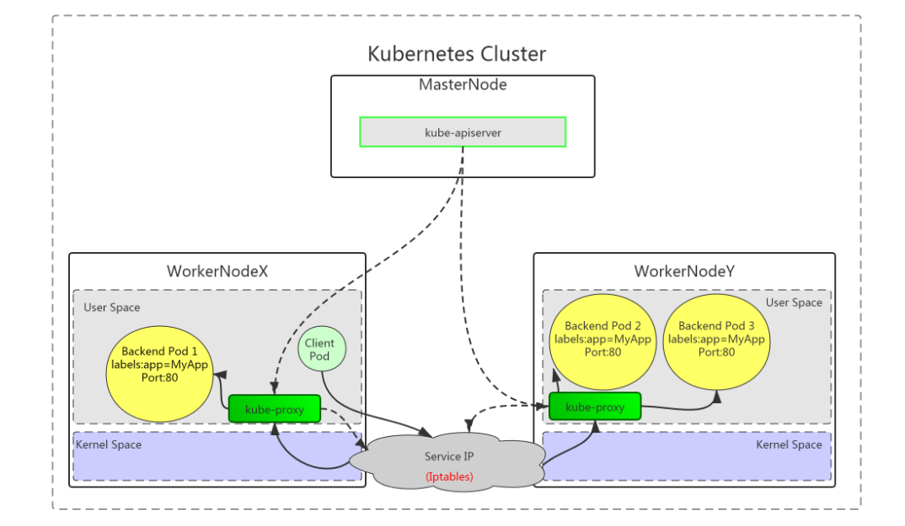

# kubernetes集群应用 Service进阶

# 一、场景

使用kubernetes集群运行工作负载时，由于Pod经常处于用后即焚状态，Pod对应的IP地址也会经常变化，因此我们不能直接访问Pod，可以通过Service对应的端点列表（Endpoints）实现对Pod IP跟踪，进而实现通过Service访问Pod目的。


# 二、学习目标

- [ ] 掌握service三种代理模式
- [ ] 了解Service类型
- [ ] 了解Service参数
- [ ] 掌握Service创建方法
- [ ] 了解sessionAffinity配置方法
- [ ] 掌握修改为ipvs调度方式的方法
- [ ] 掌握DNS应用验证


# 三、学习步骤

| 序号 | 步骤                     | 备注 |
| :--: | ------------------------ | :--: |
|  1   | service三种代理模式      |      |
|  2   | Service类型              |      |
|  3   | Service参数              |      |
|  4   | Service创建方法          |      |
|  5   | sessionAffinity类型      |      |
|  6   | 修改为IPVS调度方式的方法 |      |
|  7   | DNS应用验证              |      |


# 四、课程内容

## 4.1 service三种代理模式

- kubernetes集群中有三层网络，一类是真实存在的，例如Node Network、Pod Network,提供真实IP地址;一类是虚拟的，例如Cluster Network或Service Network，提供虚拟IP地址，不会出现在接口上，仅会出现在Service当中
- kube-proxy始终watch（监控）kube-apiserver上关于Service相关的资源变动状态，一旦获取相关信息kube-proxy都要把相关信息转化为当前节点之上的，能够实现Service资源调度到特定Pod之上的规则，近而实现访问Service就能够获取Pod所提供的服务

- Service三种代理模式：UserSpace(用户空间)、内核空间Iptables、内核空间Ipvs

  

### 4.1.1 UserSpace

客户端访问Service时，由内核空间Service转发给当前节点用户空间kube-proxy代理后，再转给内核空间Service（iptables规则）进行分发，实现访问与Service关联的Pod，此种工作方式需要在用户空间与内核空间进行二次转化，效率低。





### 4.1.2 内核空间iptables

客户端直接访问本地内核中的Service IP，由内核Iptables规则直接进行调度，直接转发到Pod。


### 4.1.3 内核空间ipvs

客户端直接访问本地内核中的Service IP，由内核ipvs规则直接进行调度，直接转发到Pod。


### 4.1.4 iptables与ipvs对比

- iptables
  - 工作在内核空间
  - 优点
    - 灵活，功能强大（可以在数据包不同阶段对包进行操作）
  - 缺点
    - 表中规则过多时，响应变慢
- ipvs
  - 工作在内核空间
  - 优点
    - 转发效率高
    - 调度算法丰富：rr，wrr，lc，wlc，ip hash...
  - 缺点
    - 内核支持不全,低版本内核不能使用，需要升级到4.0或5.0以上。


- 使用iptables与ipvs时机
  - 1.10版本之前使用iptables(1.1版本之前使用UserSpace进行转发)
  - 1.11版本之后同时支持iptables与ipvs，默认使用ipvs，如果ipvs模块没有加载时，会自动降级至iptables


## 4.2 service类型

Service类型决定了访问Service的方法

### 4.2.1 service类型分类

- ClusterIP

  - 默认，分配一个集群内部可以访问的虚拟IP

- NodePort

  - 在每个Node上分配一个端口作为外部访问入口
  - nodePort端口范围为:30000-32767

- LoadBalancer

  - 工作在特定的Cloud Provider上，例如Google Cloud，AWS，OpenStack

- ExternalName

  - 表示把集群外部的服务引入到集群内部中来，即实现了集群内部pod和集群外部的服务进行通信


### 4.2.2 Service参数

- port             访问service使用的端口

- targetPort  Pod中容器端口

- nodePort   通过Node实现外网用户访问k8s集群内service (30000-32767)


## 4.3 Service创建

> Service的创建在工作中有两种方式，一是命令行创建，二是通过资源清单文件YAML文件创建。


### 4.3.1 ClusterIP类型

ClusterIP根据是否生成ClusterIP又可分为普通Service和Headless Service

Service两类：

- 普通Service: 

为Kubernetes的Service分配一个集群内部可访问的固定虚拟IP(Cluster IP), 实现集群内的访问。

- Headless Service: 

该服务不会分配Cluster IP, 也不通过kube-proxy做反向代理和负载均衡。而是通过DNS提供稳定的网络ID来访问，DNS会将headless service的后端直接解析为podIP列表。


#### 4.3.1.1 普通ClusterIP Service创建

##### 4.3.1.1.1 命令行创建Service

- 创建Deployment类型的应用

```powershell
[root@master01 ~]# cat 01_create_deployment_app_nginx.yaml
apiVersion: apps/v1
kind: Deployment
metadata:
  name: nginx-server1
spec:
  replicas: 2
  selector:
    matchLabels:
      app: nginx
  template:
     metadata:
       labels:
         app: nginx
     spec:
       containers:
       - name: c1
         image: harbor.wego.red/library/nginx:1.9.0
         imagePullPolicy: IfNotPresent
         ports:
         - containerPort: 80
```


- 应用资源清单文件

~~~powershell
[root@master01 ~]# kubectl apply -f 01_create_deployment_app_nginx.yaml
~~~


- 验证Deployment类型的创建情况

```powershell
[root@master01 ~]# kubectl get deployment.apps
NAME            READY   UP-TO-DATE   AVAILABLE   AGE
nginx-server1   2/2     2            2           13s
```


- 创建ClusterIP类型service与Deployment类型应用关联

```powershell
命令创建service
[root@master01 ~]# kubectl expose deployment.apps nginx-server1 --type=ClusterIP --target-port=80 --port=80

输出
service/nginx-server1 exposed

说明
expose 创建service
deployment.apps 控制器类型
nginx-server1 应用名称，也是service名称
--type=ClusterIP 指定service类型
--target-port=80 指定Pod中容器端口
--port=80 指定service端口
```


##### 4.3.1.1.2 通过资源清单文件创建Service

~~~powershell
[root@master01 ~]# cat 02_create_deployment_app_nginx_with_service.yaml
apiVersion: apps/v1
kind: Deployment
metadata:
  name: nginx-server1
spec:
  replicas: 2
  selector:
    matchLabels:
      app: nginx
  template:
     metadata:
       labels:
         app: nginx
     spec:
       containers:
       - name: nginx-smart
         image: harbor.wego.red/library/nginx:1.9.0
         imagePullPolicy: IfNotPresent
         ports:
         - containerPort: 80
---
apiVersion: v1
kind: Service
metadata:
  name: nginx-svc
spec:
  type: ClusterIP
  ports:
  - protocol: TCP
    port: 80
    targetPort: 80
  selector:
    app: nginx

~~~


~~~powershell
[root@master01 ~]# kubectl  apply -f 02_create_deployment_app_nginx_with_service.yaml
~~~


- 验证

```powershell
查看service
[root@master01 ~]# kubectl get service
NAME         TYPE        CLUSTER-IP       EXTERNAL-IP   PORT(S)    AGE
kubernetes   ClusterIP   10.96.0.1        <none>        443/TCP    4d15h
nginx-svc    ClusterIP   10.101.153.50   <none>        80/TCP    3s
```

```powershell
查看endpoints
[root@master01 ~]# kubectl get endpoints
NAME         ENDPOINTS                            AGE
kubernetes   192.168.122.30:6443                  4d15h
nginx-svc    172.16.189.74:80,172.16.235.150:80   8s
```

```powershell
查看Pod
[root@master01 ~]# kubectl get pods -l app=nginx
NAME                             READY   STATUS    RESTARTS   AGE
nginx-server1-77d4c485d8-gsrmq   1/1     Running   0          12s
nginx-server1-77d4c485d8-mmc52   1/1     Running   0          12s
```


##### 4.3.1.1.3 访问

```powershell
[root@master01 ~]# curl http://10.101.153.50:80
<!DOCTYPE html>
<html>
<head>
<title>Welcome to nginx!</title>
<style>
    body {
        width: 35em;
        margin: 0 auto;
        font-family: Tahoma, Verdana, Arial, sans-serif;
    }
</style>
</head>
<body>
<h1>Welcome to nginx!</h1>
<p>If you see this page, the nginx web server is successfully installed and
working. Further configuration is required.</p>

<p>For online documentation and support please refer to
<a href="http://nginx.org/">nginx.org</a>.<br/>
Commercial support is available at
<a href="http://nginx.com/">nginx.com</a>.</p>

<p><em>Thank you for using nginx.</em></p>
</body>
</html>
```


##### 4.3.1.1.4 两个pod里做成不同的主页方便测试负载均衡

```powershell
[root@master01 ~]# kubectl exec -it nginx-server1-77d4c485d8-gsrmq -- /bin/bash
root@deployment-nginx-6fcfb67547-nv7dn:/# cd /usr/share/nginx/html/
root@deployment-nginx-6fcfb67547-nv7dn:/usr/share/nginx/html# echo web1 > index.html
root@deployment-nginx-6fcfb67547-nv7dn:/usr/share/nginx/html# exit
exit
```

```powershell
[root@master01 ~]# kubectl exec -it nginx-server1-77d4c485d8-mmc52 -- /bin/bash
root@deployment-nginx-6fcfb67547-rqrcw:/# cd /usr/share/nginx/html/
root@deployment-nginx-6fcfb67547-rqrcw:/usr/share/nginx/html# echo web2 > index.html
root@deployment-nginx-6fcfb67547-rqrcw:/usr/share/nginx/html# exit
exit
```


#####  4.3.1.1.5 测试

```powershell
[root@master01 ~]# curl 10.101.153.50
或
[root@master01 ~]# while true;do curl 10.101.153.50;sleep 1; done
```


#### 4.3.1.2 Headless Service

普通的ClusterIP service是service name解析为cluster ip,然后cluster ip对应到后面的pod ip,而无头service是指service name 直接解析为后面的pod ip

##### 4.3.1.2.1 编写用于创建Deployment控制器类型的资源清单文件

~~~powershell
[root@master01 ~]# cat 03_create_deployment_app_nginx.yaml
apiVersion: apps/v1
kind: Deployment
metadata:
  name: nginx-server1
spec:
  replicas: 2
  selector:
    matchLabels:
      app: nginx
  template:
     metadata:
       labels:
         app: nginx
     spec:
       containers:
       - name: nginx-smart
         image: harbor.wego.red/library/nginx:1.9.0
         imagePullPolicy: IfNotPresent
         ports:
         - containerPort: 80
~~~


##### 4.3.1.2.2 通过资源清单文件创建headless Service

```powershell
编写YAML文件
命令
[root@master ~]# vim 04_headless-service.yml
apiVersion: v1
kind: Service
metadata:
  name: headless-service
  namespace: default
spec:
  type: ClusterIP     # ClusterIP类型,也是默认类型
  clusterIP: None     # None就代表是无头service
  ports:                                # 指定service 端口及容器端口
  - port: 80                            # service ip中的端口
    protocol: TCP
    targetPort: 80                      # pod中的端口
  selector:                             # 指定后端pod标签
     app: nginx                    # 可通过kubectl get pod -l app=nginx查看哪些pod在使用此标签
 
```


##### 4.3.1.2.3 应用资源清单文件创建headless Service

```powershell
命令
[root@master ~]# kubectl apply -f 04_headless_service.yml
输出
service/headless-service created
```


##### 4.3.1.2.4 查看已创建的headless Service

~~~powershell
命令
[root@master ~]# kubectl get svc
输出
NAME               TYPE        CLUSTER-IP       EXTERNAL-IP   PORT(S)          AGE
headless-service   ClusterIP   None             <none>        80/TCP           2m18s
kubernetes         ClusterIP   10.96.0.1        <none>        443/TCP          5d9h
可以看到headless-service没有CLUSTER-IP,用None表示
~~~


##### 4.3.1.2.5 DNS

DNS服务监视Kubernetes API,为每一个Service创建DNS记录用于域名解析

headless service需要DNS来解决访问问题

DNS记录格式为: <service-name>.<namespace-name>.svc.cluster.local.


###### 4.3.1.2.5.1 查看kube-dns服务的IP

```powershell
命令
[root@master1 ~]# kubectl get svc -n kube-system


输出
NAME             TYPE        CLUSTER-IP      EXTERNAL-IP   PORT(S)                  AGE
kube-dns         ClusterIP   10.96.0.10      <none>        53/UDP,53/TCP,9153/TCP   5d9h
metrics-server   ClusterIP   10.105.219.44   <none>        443/TCP                  45h
查看到coreDNS的服务地址是10.96.0.10
```


###### 4.3.1.2.5.2 在集群主机通过DNS服务地址查找无头服务的dns解析

```powershell
命令
[root@master01 ~]# dig -t A headless-service.default.svc.cluster.local. @10.96.0.10


输出
; <<>> DiG 9.11.4-P2-RedHat-9.11.4-16.P2.el7_8.2 <<>> -t A headless-service.default.svc.cluster.local. @10.96.0.10
;; global options: +cmd
;; Got answer:
;; WARNING: .local is reserved for Multicast DNS
;; You are currently testing what happens when an mDNS query is leaked to DNS
;; ->>HEADER<<- opcode: QUERY, status: NOERROR, id: 31371
;; flags: qr aa rd; QUERY: 1, ANSWER: 1, AUTHORITY: 0, ADDITIONAL: 1
;; WARNING: recursion requested but not available

;; OPT PSEUDOSECTION:
; EDNS: version: 0, flags:; udp: 4096
;; QUESTION SECTION:
;headless-service.default.svc.cluster.local. IN A #被解析域名

;; ANSWER SECTION:
headless-service.default.svc.cluster.local. 30 IN A 10.224.235.147 #注意这里IP

;; Query time: 0 msec
;; SERVER: 10.96.0.10#53(10.96.0.10)
;; WHEN: Sun May 17 10:58:50 CST 2020
;; MSG SIZE  rcvd: 129

```


###### 4.3.1.2.5.3  验证pod的IP

```powershell
命令
[root@master ~]# kubectl get pod -o wide
输出
NAME                                READY   STATUS             RESTARTS   AGE   IP               NODE      NOMINATED NODE   READINESS GATES
nginx-deployment-56bf6c9c8c-jmk7r   1/1     Running            0          35m   10.224.235.147   worker1   <none>           <none>


```


###### 4.3.1.2.5.4 在集群中创建一个pod验证

>创建一个镜像为busyboxplus:curl的pod，pod名称为bb2,用来解析域名


```powershell
命令
[root@master01 ~]# kubectl run bbp --image=busyboxplus:curl -it

输出
If you don't see a command prompt, try pressing enter.

解析域名
命令
[ root@bbp:/ ]$ curl http://headless-service.default.svc.cluster.local.

输出
<!DOCTYPE html>
<html>
<head>
<title>Welcome to nginx!</title>
<style>
    body {
        width: 35em;
        margin: 0 auto;
        font-family: Tahoma, Verdana, Arial, sans-serif;
    }
</style>
</head>
<body>
<h1>Welcome to nginx!</h1>
<p>If you see this page, the nginx web server is successfully installed and
working. Further configuration is required.</p>

<p>For online documentation and support please refer to
<a href="http://nginx.org/">nginx.org</a>.<br/>
Commercial support is available at
<a href="http://nginx.com/">nginx.com</a>.</p>

<p><em>Thank you for using nginx.</em></p>
</body>
</html>
[ root@bbp:/ ]$ exit
Session ended, resume using 'kubectl attach bbp -c bbp -i -t' command when the pod is running
```


### 4.3.2 NodePort类型

- 创建资源清单文件

```powershell
[root@master01 ~]# cat 05_create_nodeport_service_app.yaml
apiVersion: apps/v1
kind: Deployment
metadata:
  name: nginx-app
  labels:
    app: nginx-app
spec:
  replicas: 2
  selector:
    matchLabels:
      app: nginx-app
  template:
    metadata:
      labels:
        app: nginx-app
    spec:
      containers:
      - name: c1
        image: harbor.wego.red/library/nginx:1.9.0
        imagePullPolicy: IfNotPresent
        ports:
        - containerPort: 80
---
apiVersion: v1
kind: Service
metadata:
  name: nginx-app
spec:
  type: NodePort
  selector:
    app: nginx-app
  ports:
  - protocol: TCP
    nodePort: 30001
    port: 8060
    targetPort: 80
```

- 应用资源清单文件

```powershell
[root@master01 ~]# kubectl apply -f 05_create_nodeport_service_app.yaml
deployment.apps/nginx-app created
service/nginx-app created
```

- 验证service创建

```powershell
[root@master01 ~]# kubectl get deployment.apps
NAME         READY   UP-TO-DATE   AVAILABLE   AGE
nginx-app    2/2     2            2           26s


[root@master01 ~]# kubectl get svc
NAME         TYPE        CLUSTER-IP       EXTERNAL-IP   PORT(S)          AGE
kubernetes   ClusterIP   10.96.0.1        <none>        443/TCP          2d22h
nginx-app    NodePort    10.104.157.20    <none>        8060:30001/TCP   36s

[root@master01 ~]# kubectl get endpoints
NAME         ENDPOINTS                       AGE
kubernetes   192.168.122.10:6443             2d22h
nginx-app    172.16.1.24:80,172.16.2.20:80   2m10s


[root@master01 ~]# ss -anput | grep ":30001"
tcp    LISTEN     0      128      :::30001                :::*                   users:(("kube-proxy",pid=5826,fd=9))

[root@worker01 ~]# ss -anput | grep ":30001"
tcp    LISTEN     0      128      :::30001                :::*                   users:(("kube-proxy",pid=4937,fd=11))

[root@worker02 ~]# ss -anput | grep ":30001"
tcp    LISTEN     0      128      :::30001                :::*                   users:(("kube-proxy",pid=5253,fd=11))

```


```powershell
[root@master01 ~]# kubectl get pods
NAME                          READY   STATUS    RESTARTS   AGE
nginx-app-ffd5ccc78-cnwbx    1/1     Running   0          8m59s
nginx-app-ffd5ccc78-mz77g    1/1     Running   0          8m59s

[root@master01 ~]# kubectl exec -it nginx-app-ffd5ccc78-cnwbx -- bash
root@nginx-app-ffd5ccc78-cnwbx:/# echo "nginx-app-1" > /usr/share/nginx/html/index.html
root@nginx-app-ffd5ccc78-cnwbx:/# exit
exit
[root@master01 ~]# kubectl exec -it nginx-app-ffd5ccc78-mz77g -- bash
root@nginx-app-ffd5ccc78-mz77g:/# echo "nginx-app-2" > /usr/share/nginx/html/index.html
root@nginx-app-ffd5ccc78-mz77g:/# exit
exit
```

- 在与kubernetes 节点同一网络主机中访问k8s集群内service

```powershell
[root@bogon ~]# curl http://192.168.122.11:30001
nginx-app-2
[root@bogon ~]# curl http://192.168.122.21:30001
nginx-app-1
[root@bogon ~]# curl http://192.168.122.22:30001
nginx-app-1
[root@bogon ~]# curl http://192.168.122.23:30001
nginx-app-2
```


### 4.3.3 LoadBalancer

#### 4.3.3.1 集群外访问过程

- #### 用户

- #### 域名

- #### 云服务提供商提供LB服务

- #### NodeIP:Port(service IP)

- #### Pod IP：端口


#### 4.3.3.2  自建Kubernetes的LoadBalancer类型服务方案-MetalLB

MetalLB可以为kubernetes集群中的Service提供网络负载均衡功能。

MetalLB两大功能为:

- 地址分配，类似于DHCP
- 外部通告，一旦MetalLB为服务分配了外部IP地址，它就需要使群集之外的网络意识到该IP在群集中“存在”。MetalLB使用标准路由协议来实现此目的：ARP，NDP或BGP。


##### 4.3.3.2.1  拉取镜像

~~~powershell
# docker pull metallb/speaker:v0.9.3
# docker pull metallb/controller:v0.9.3
~~~


##### 4.3.3.2.2 参考资料

~~~powershell
参考网址：
https://metallb.universe.tf/installation/

资源清单文件下载：
# kubectl apply -f https://raw.githubusercontent.com/metallb/metallb/v0.9.3/manifests/namespace.yaml
# kubectl apply -f https://raw.githubusercontent.com/metallb/metallb/v0.9.3/manifests/metallb.yaml
# On first install only
# kubectl create secret generic -n metallb-system memberlist --from-literal=secretkey="$(openssl rand -base64 128)"
~~~


##### 4.3.3.2.3 资源清单及其应用

~~~powershell
创建namespace
	查看文件内容
[root@nginx metallb]# cat namespace.yaml
apiVersion: v1
kind: Namespace
metadata:
  name: metallb-system
  labels:
    app: metallb
    在master01应用资源清单文件
[root@master01 ~]# kubectl apply -f http://nginx.wego.red/service/metallb/namespace.yaml
~~~


~~~powershell
创建metallb
	查看内容
[root@nginx metallb]# cat metallb.yaml
apiVersion: policy/v1beta1
kind: PodSecurityPolicy
metadata:
  labels:
    app: metallb
  name: controller
  namespace: metallb-system
spec:
  allowPrivilegeEscalation: false
  allowedCapabilities: []
  allowedHostPaths: []
  defaultAddCapabilities: []
  defaultAllowPrivilegeEscalation: false
  fsGroup:
    ranges:
    - max: 65535
      min: 1
    rule: MustRunAs
  hostIPC: false
  hostNetwork: false
  hostPID: false
  privileged: false
  readOnlyRootFilesystem: true
  requiredDropCapabilities:
  - ALL
  runAsUser:
    ranges:
    - max: 65535
      min: 1
    rule: MustRunAs
  seLinux:
    rule: RunAsAny
  supplementalGroups:
    ranges:
    - max: 65535
      min: 1
    rule: MustRunAs
  volumes:
  - configMap
  - secret
  - emptyDir
---
apiVersion: policy/v1beta1
kind: PodSecurityPolicy
metadata:
  labels:
    app: metallb
  name: speaker
  namespace: metallb-system
spec:
  allowPrivilegeEscalation: false
  allowedCapabilities:
  - NET_ADMIN
  - NET_RAW
  - SYS_ADMIN
  allowedHostPaths: []
  defaultAddCapabilities: []
  defaultAllowPrivilegeEscalation: false
  fsGroup:
    rule: RunAsAny
  hostIPC: false
  hostNetwork: true
  hostPID: false
  hostPorts:
  - max: 7472
    min: 7472
  privileged: true
  readOnlyRootFilesystem: true
  requiredDropCapabilities:
  - ALL
  runAsUser:
    rule: RunAsAny
  seLinux:
    rule: RunAsAny
  supplementalGroups:
    rule: RunAsAny
  volumes:
  - configMap
  - secret
  - emptyDir
---
apiVersion: v1
kind: ServiceAccount
metadata:
  labels:
    app: metallb
  name: controller
  namespace: metallb-system
---
apiVersion: v1
kind: ServiceAccount
metadata:
  labels:
    app: metallb
  name: speaker
  namespace: metallb-system
---
apiVersion: rbac.authorization.k8s.io/v1
kind: ClusterRole
metadata:
  labels:
    app: metallb
  name: metallb-system:controller
rules:
- apiGroups:
  - ''
  resources:
  - services
  verbs:
  - get
  - list
  - watch
  - update
- apiGroups:
  - ''
  resources:
  - services/status
  verbs:
  - update
- apiGroups:
  - ''
  resources:
  - events
  verbs:
  - create
  - patch
- apiGroups:
  - policy
  resourceNames:
  - controller
  resources:
  - podsecuritypolicies
  verbs:
  - use
---
apiVersion: rbac.authorization.k8s.io/v1
kind: ClusterRole
metadata:
  labels:
    app: metallb
  name: metallb-system:speaker
rules:
- apiGroups:
  - ''
  resources:
  - services
  - endpoints
  - nodes
  verbs:
  - get
  - list
  - watch
- apiGroups:
  - ''
  resources:
  - events
  verbs:
  - create
  - patch
- apiGroups:
  - policy
  resourceNames:
  - speaker
  resources:
  - podsecuritypolicies
  verbs:
  - use
---
apiVersion: rbac.authorization.k8s.io/v1
kind: Role
metadata:
  labels:
    app: metallb
  name: config-watcher
  namespace: metallb-system
rules:
- apiGroups:
  - ''
  resources:
  - configmaps
  verbs:
  - get
  - list
  - watch
---
apiVersion: rbac.authorization.k8s.io/v1
kind: Role
metadata:
  labels:
    app: metallb
  name: pod-lister
  namespace: metallb-system
rules:
- apiGroups:
  - ''
  resources:
  - pods
  verbs:
  - list
---
apiVersion: rbac.authorization.k8s.io/v1
kind: ClusterRoleBinding
metadata:
  labels:
    app: metallb
  name: metallb-system:controller
roleRef:
  apiGroup: rbac.authorization.k8s.io
  kind: ClusterRole
  name: metallb-system:controller
subjects:
- kind: ServiceAccount
  name: controller
  namespace: metallb-system
---
apiVersion: rbac.authorization.k8s.io/v1
kind: ClusterRoleBinding
metadata:
  labels:
    app: metallb
  name: metallb-system:speaker
roleRef:
  apiGroup: rbac.authorization.k8s.io
  kind: ClusterRole
  name: metallb-system:speaker
subjects:
- kind: ServiceAccount
  name: speaker
  namespace: metallb-system
---
apiVersion: rbac.authorization.k8s.io/v1
kind: RoleBinding
metadata:
  labels:
    app: metallb
  name: config-watcher
  namespace: metallb-system
roleRef:
  apiGroup: rbac.authorization.k8s.io
  kind: Role
  name: config-watcher
subjects:
- kind: ServiceAccount
  name: controller
- kind: ServiceAccount
  name: speaker
---
apiVersion: rbac.authorization.k8s.io/v1
kind: RoleBinding
metadata:
  labels:
    app: metallb
  name: pod-lister
  namespace: metallb-system
roleRef:
  apiGroup: rbac.authorization.k8s.io
  kind: Role
  name: pod-lister
subjects:
- kind: ServiceAccount
  name: speaker
---
apiVersion: apps/v1
kind: DaemonSet
metadata:
  labels:
    app: metallb
    component: speaker
  name: speaker
  namespace: metallb-system
spec:
  selector:
    matchLabels:
      app: metallb
      component: speaker
  template:
    metadata:
      annotations:
        prometheus.io/port: '7472'
        prometheus.io/scrape: 'true'
      labels:
        app: metallb
        component: speaker
    spec:
      containers:
      - args:
        - --port=7472
        - --config=config
        env:
        - name: METALLB_NODE_NAME
          valueFrom:
            fieldRef:
              fieldPath: spec.nodeName
        - name: METALLB_HOST
          valueFrom:
            fieldRef:
              fieldPath: status.hostIP
        - name: METALLB_ML_BIND_ADDR
          valueFrom:
            fieldRef:
              fieldPath: status.podIP
        - name: METALLB_ML_LABELS
          value: "app=metallb,component=speaker"
        - name: METALLB_ML_NAMESPACE
          valueFrom:
            fieldRef:
              fieldPath: metadata.namespace
        - name: METALLB_ML_SECRET_KEY
          valueFrom:
            secretKeyRef:
              name: memberlist
              key: secretkey
        image: harbor.wego.red/library/metallb/speaker:v0.9.3 修改
        imagePullPolicy: Always
        name: speaker
        ports:
        - containerPort: 7472
          name: monitoring
        resources:
          limits:
            cpu: 100m
            memory: 100Mi
        securityContext:
          allowPrivilegeEscalation: false
          capabilities:
            add:
            - NET_ADMIN
            - NET_RAW
            - SYS_ADMIN
            drop:
            - ALL
          readOnlyRootFilesystem: true
      hostNetwork: true
      nodeSelector:
        beta.kubernetes.io/os: linux
      serviceAccountName: speaker
      terminationGracePeriodSeconds: 2
      tolerations:
      - effect: NoSchedule
        key: node-role.kubernetes.io/master
---
apiVersion: apps/v1
kind: Deployment
metadata:
  labels:
    app: metallb
    component: controller
  name: controller
  namespace: metallb-system
spec:
  revisionHistoryLimit: 3
  selector:
    matchLabels:
      app: metallb
      component: controller
  template:
    metadata:
      annotations:
        prometheus.io/port: '7472'
        prometheus.io/scrape: 'true'
      labels:
        app: metallb
        component: controller
    spec:
      containers:
      - args:
        - --port=7472
        - --config=config
        image: harbor.wego.red/library/metallb/controller:v0.9.3 修改
        imagePullPolicy: Always
        name: controller
        ports:
        - containerPort: 7472
          name: monitoring
        resources:
          limits:
            cpu: 100m
            memory: 100Mi
        securityContext:
          allowPrivilegeEscalation: false
          capabilities:
            drop:
            - all
          readOnlyRootFilesystem: true
      nodeSelector:
        beta.kubernetes.io/os: linux
      securityContext:
        runAsNonRoot: true
        runAsUser: 65534
      serviceAccountName: controller
      terminationGracePeriodSeconds: 0	
	
	在master01应用资源清单文件
[root@master01 ~]# kubectl apply -f http://nginx.wego.red/service/metallb/metallb.yaml	
~~~


~~~powershell
创建secret
	在master01节点执行如下命令
# On first install only
# kubectl create secret generic -n metallb-system memberlist --from-literal=secretkey="$(openssl rand -base64 128)"
~~~


~~~powershell
创建metallb配置文件
	查看内容
[root@nginx metallb]# cat metallb-conf.yaml
apiVersion: v1
kind: ConfigMap
metadata:
  namespace: metallb-system
  name: config
data:
  config: |
    address-pools:
    - name: default
      protocol: layer2
      addresses:
      - 192.168.122.90-192.168.122.100
 
192.168.122.90-192.168.122.100是集群节点服务器IP同一段。
 
	在master01节点应用资源清单文件
[root@master01 ~]# kubectl apply -f http://nginx.wego.red/service/metallb/metallb-conf.yaml	
~~~


##### 4.3.3.2.4发布Service类型为LoadBalancer的Deployment控制器类型应用

```powershell
创建Deployment控制器类型应用nginx-metallb及service，service类型为LoadBalancer

[root@master01 ~]# vim 02_nginx-metabllb.yaml
apiVersion: apps/v1
kind: Deployment
metadata:
  name: nginx-metallb
spec:
  selector:
    matchLabels:
      app: nginx
  template:
    metadata:
      labels:
        app: nginx
    spec:
      containers:
      - name: nginx-metallb1
        image: harbor.wego.red/library/nginx:1.9.0
        imagePullPolicy: IfNotPresent
        ports:
        - containerPort: 80

---
apiVersion: v1
kind: Service
metadata:
  name: nginx-metallb
spec:
  ports:
  - port: 8090
    protocol: TCP
    targetPort: 80
  selector:
    app: nginx
  type: LoadBalancer
  
[root@master01 ~]# kubectl apply -f http://nginx.wego.red/service/metallb/nginx.yaml
```


##### 4.3.3.2.2 验证

```powershell
[root@master01 ~]# kubectl get ns
NAME                   STATUS   AGE
default                Active   16d
kube-node-lease        Active   16d
kube-public            Active   16d
kube-system            Active   16d
kubernetes-dashboard   Active   13d
metallb-system         Active   130m
test1                  Active   12d
[root@master01 ~]# kubectl get pods -n metallb-system
NAME                         READY   STATUS    RESTARTS   AGE
controller-64f8f944d-qdf8m   1/1     Running   0          110m
speaker-cwzq7                1/1     Running   0          110m
speaker-qk5fb                1/1     Running   0          110m
speaker-wsllb                1/1     Running   0          110m
speaker-x4bwt                1/1     Running   0          110m

[root@master01 ~]# kubectl get svc
NAME            TYPE           CLUSTER-IP      EXTERNAL-IP      PORT(S)          AGE
kubernetes      ClusterIP      10.96.0.1       <none>           443/TCP          16d
nginx-metallb   LoadBalancer   10.105.239.69   192.168.122.90   8090:31372/TCP   106m

[root@master01 ~]# ping 192.168.122.90
PING 192.168.122.90 (192.168.122.90) 56(84) bytes of data.
From 192.168.122.23: icmp_seq=2 Redirect Host(New nexthop: 192.168.122.90)
From 192.168.122.23: icmp_seq=3 Redirect Host(New nexthop: 192.168.122.90)
```

##### 4.3.3.2.3 访问

```powershell
[root@master01 ~]# curl http://192.168.122.90:8090
<!DOCTYPE html>
<html>
<head>
<title>Welcome to nginx!</title>
<style>
    body {
        width: 35em;
        margin: 0 auto;
        font-family: Tahoma, Verdana, Arial, sans-serif;
    }
</style>
</head>
<body>
<h1>Welcome to nginx!</h1>
<p>If you see this page, the nginx web server is successfully installed and
working. Further configuration is required.</p>

<p>For online documentation and support please refer to
<a href="http://nginx.org/">nginx.org</a>.<br/>
Commercial support is available at
<a href="http://nginx.com/">nginx.com</a>.</p>

<p><em>Thank you for using nginx.</em></p>
</body>
</html>
```


~~~powershell
如果在IPVS模式下使用kube-proxy，从Kubernetes v1.14.2开始，必须启用ARP模式。

可以通过在当前集群中编辑kube-proxy配置来实现：
# kubectl edit configmap -n kube-system kube-proxy

并设置：
apiVersion: kubeproxy.config.k8s.io/v1alpha1
kind: KubeProxyConfiguration
mode: "ipvs"
ipvs:
  strictARP: true
~~~


### 4.3.4 ExternalName

#### 4.3.4.1 ExternalName作用

- 把集群外部的服务引入到集群内部中来，实现了集群内部pod和集群外部的服务进行通信
- ExternalName 类型的服务适用于外部服务使用域名的方式，缺点是不能指定端口
- 还有一点要注意: 集群内的Pod会继承Node上的DNS解析规则。所以只要Node可以访问的服务，Pod中也可以访问到, 这就实现了集群内服务访问集群外服务


#### 4.3.4.2   创建ExternalName Service


- 编写YAML文件

```powershell
[root@master01 ~]# vim externalname.yaml
apiVersion: v1
kind: Service
metadata:
  name: my-service					#对应的服务是my-service
  namespace: default
spec:
  type: ExternalName
  externalName: www.baidu.com		#对应的外部域名为www.baidu.com
```


- 应用YAML文件

```powershell
[root@master01 ~]# kubectl apply -f externalname.yaml
service/my-service configured
```


- 查看my-service的dns解析

```powershell
[root@master01 ~]# kubectl get svc -n kube-system
NAME             TYPE        CLUSTER-IP      EXTERNAL-IP   PORT(S)                  AGE
kube-dns         ClusterIP   10.96.0.10      <none>        53/UDP,53/TCP,9153/TCP   18d
[root@master01 ~]# dig -t A my-service.default.svc.cluster.local. @10.96.0.10

; <<>> DiG 9.9.4-RedHat-9.9.4-72.el7 <<>> -t A my-service.default.svc.cluster.local. @10.96.0.10
;; global options: +cmd
;; Got answer:
;; ->>HEADER<<- opcode: QUERY, status: NOERROR, id: 43624
;; flags: qr aa rd; QUERY: 1, ANSWER: 1, AUTHORITY: 0, ADDITIONAL: 1
;; WARNING: recursion requested but not available

;; OPT PSEUDOSECTION:
; EDNS: version: 0, flags:; udp: 4096
;; QUESTION SECTION:
;my-service.default.svc.cluster.local. IN A

;; ANSWER SECTION:
my-service.default.svc.cluster.local. 30 IN CNAME www.baidu.com.	注意这里

;; Query time: 2001 msec
;; SERVER: 10.2.0.10#53(10.2.0.10)
;; WHEN: Mon Aug 05 21:23:38 CST 2019
;; MSG SIZE  rcvd: 133

从上面看到把外部域名做了一个别名过来
```


~~~powershell
[root@master01 ~]# kubectl run busyboxapp --image=harbor.wego.red/library/busybox:1.28.4 -it
If you don't see a command prompt, try pressing enter.

/ # nslookup my-service.default.svc.cluster.local.
Server:    10.96.0.10
Address 1: 10.96.0.10 kube-dns.kube-system.svc.cluster.local

Name:      my-service.default.svc.cluster.local.
Address 1: 2409:8c00:6c21:104f:0:ff:b03f:3ae
Address 2: 2409:8c00:6c21:104c:0:ff:b02c:156c

/ # nslookup www.baidu.com
Server:    10.96.0.10
Address 1: 10.96.0.10 kube-dns.kube-system.svc.cluster.local

Name:      www.baidu.com
Address 1: 2409:8c00:6c21:104f:0:ff:b03f:3ae
Address 2: 2409:8c00:6c21:104c:0:ff:b02c:156c
~~~


## 4.4  sessionAffinity

> 会话粘贴

设置sessionAffinity为Clientip  (类似nginx的ip_hash算法,lvs的sh算法)


~~~powershell
[root@nginx ~]# cat 02_create_deployment_app_nginx_with_service.yaml
apiVersion: apps/v1
kind: Deployment
metadata:
  name: nginx-server1
spec:
  replicas: 2
  selector:
    matchLabels:
      app: nginx
  template:
     metadata:
       labels:
         app: nginx
     spec:
       containers:
       - name: c1
         image: harbor.wego.red/library/nginx:1.9.0
         imagePullPolicy: IfNotPresent
         ports:
         - containerPort: 80
---
apiVersion: v1
kind: Service
metadata:
  name: nginx-svc
spec:
  type: ClusterIP
  ports:
  - protocol: TCP
    port: 80
    targetPort: 80
  selector:
    app: nginx
~~~


~~~powershell
[root@master01 ~]# kubectl apply -f http://nginx.wego.red/service/clusterip/02_create_deployment_app_nginx_with_service.yaml
deployment.apps/nginx-server1 created
service/nginx-svc created
~~~


~~~powershell
[root@master01 ~]# kubectl get pods
NAME                             READY   STATUS    RESTARTS   AGE
nginx-server1-58845f75f4-9zlnw   1/1     Running   0          2m11s
nginx-server1-58845f75f4-ffqdt   1/1     Running   0          2m11s
[root@master01 ~]# kubectl exec -it nginx-server1-58845f75f4-9zlnw bash
kubectl exec [POD] [COMMAND] is DEPRECATED and will be removed in a future version. Use kubectl kubectl exec [POD] -- [COMMAND] instead.
root@nginx-server1-58845f75f4-9zlnw:/# echo web1 > /usr/share/nginx/html/index.html
root@nginx-server1-58845f75f4-9zlnw:/# exit
exit
[root@master01 ~]# kubectl exec -it nginx-server1-58845f75f4-ffqdt bash
kubectl exec [POD] [COMMAND] is DEPRECATED and will be removed in a future version. Use kubectl kubectl exec [POD] -- [COMMAND] instead.
root@nginx-server1-58845f75f4-ffqdt:/# echo web2 > /usr/share/nginx/html/index.html
root@nginx-server1-58845f75f4-ffqdt:/# exit
exit
~~~


~~~powershell
[root@master01 ~]# kubectl get svc
NAME         TYPE        CLUSTER-IP     EXTERNAL-IP   PORT(S)   AGE
kubernetes   ClusterIP   10.96.0.1      <none>        443/TCP   16d
nginx-svc    ClusterIP   10.100.53.31   <none>        80/TCP    3m53s
[root@master01 ~]# curl http://10.100.53.31
web1
[root@master01 ~]# curl http://10.100.53.31
web2
或
[root@master01 ~]# while true;do curl 10.100.53.31;sleep 1; done
~~~


```powershell
[root@master01 ~]# kubectl patch svc nginx-svc -p '{"spec":{"sessionAffinity":"ClientIP"}}'
service/nginx-svc patched

[root@master01 ~]# curl 10.100.53.31
web1
多次访问,会话粘贴
```

```powershell
设置回sessionAffinity为None
[root@master01 ~]# kubectl patch svc nginx-svc -p '{"spec":{"sessionAffinity":"None"}}'
service/my-service patched

```


~~~powershell
测试
[root@master01 ~]# curl 10.100.53.31
web1
多次访问,回到负载均衡
或
[root@master01 ~]# while true;do curl 10.100.53.31;sleep 1; done
web1
多次访问,会话粘贴

~~~


## 4.5 修改为ipvs调度方式

从kubernetes1.8版本开始，新增了kube-proxy对ipvs的支持，在kubernetes1.11版本中被纳入了GA.


### 4.5.1 修改为IPVS调度方式前升级内核

> 现使用Centos7u6发布版本，默认内核版本为3.10.0，使用kubernetes为1.18.0时，可升级内核版本至4.18.0或5.6.0版本。


>在所有节点中安装,需要重启操作系统更换内核。以下升级方法供参考。


~~~powershell
[root@localhost ~]# yum -y install perl

[root@localhost ~]# rpm --import https://www.elrepo.org/RPM-GPG-KEY-elrepo.org

[root@localhost ~]# yum -y install https://www.elrepo.org/elrepo-release-7.0-4.el7.elrepo.noarch.rpm

[root@localhost ~]# yum  --enablerepo="elrepo-kernel"  -y install kernel-ml.x86_64 
此处升级为5.0以上版本。

[root@localhost ~]# grub2-set-default 0

[root@localhost ~]# grub2-mkconfig -o /boot/grub2/grub.cfg

[root@localhost ~]# reboot
~~~


### 4.5.2 修改kube-proxy的配置文件

```powershell
[root@master01 ~]# kubectl edit configmap kube-proxy -n kube-system
     26     iptables:
     27       masqueradeAll: false
     28       masqueradeBit: 14
     29       minSyncPeriod: 0s
     30       syncPeriod: 30s
     31     ipvs:
     32       excludeCIDRs: null
     33       minSyncPeriod: 0s
     34       scheduler: ""	  # 可以在这里修改ipvs的算法,默认为rr轮循算法
     35       strictARP: false
     36       syncPeriod: 30s
     37     kind: KubeProxyConfiguration
     38     metricsBindAddress: 127.0.0.1:10249
     39     mode: "ipvs"	  # 默认""号里为空,加上ipvs
```


### 4.5.3  查看kube-system的namespace中kube-proxy有关的pod

```powershell
[root@master01 ~]# kubectl get pods -n kube-system |grep kube-proxy
kube-proxy-69mv6                           1/1     Running   6          2d18h
kube-proxy-jpc6c                           1/1     Running   4          4d16h
kube-proxy-kq65l                           1/1     Running   4          4d16h
kube-proxy-lmphf                           1/1     Running   5          4d16h
```


### 4.5.4 验证kube-proxy-xxx的pod中的信息

```powershell
[root@master01 ~]# kubectl logs kube-proxy-jpc6c -n kube-system
W0517 00:55:10.914754       1 server_others.go:559] Unknown proxy mode "", assuming iptables proxy
I0517 00:55:10.923228       1 node.go:136] Successfully retrieved node IP: 192.168.122.32
I0517 00:55:10.923264       1 server_others.go:186] Using iptables Proxier.
I0517 00:55:10.923567       1 server.go:583] Version: v1.18.2
I0517 00:55:10.923965       1 conntrack.go:100] Set sysctl 'net/netfilter/nf_conntrack_max' to 131072
I0517 00:55:10.924001       1 conntrack.go:52] Setting nf_conntrack_max to 131072
I0517 00:55:10.924258       1 conntrack.go:83] Setting conntrack hashsize to 32768
I0517 00:55:10.927041       1 conntrack.go:100] Set sysctl 'net/netfilter/nf_conntrack_tcp_timeout_established' to 86400
I0517 00:55:10.927086       1 conntrack.go:100] Set sysctl 'net/netfilter/nf_conntrack_tcp_timeout_close_wait' to 3600
I0517 00:55:10.927540       1 config.go:315] Starting service config controller
I0517 00:55:10.927556       1 shared_informer.go:223] Waiting for caches to sync for service config
I0517 00:55:10.927576       1 config.go:133] Starting endpoints config controller
I0517 00:55:10.927594       1 shared_informer.go:223] Waiting for caches to sync for endpoints config
I0517 00:55:11.027749       1 shared_informer.go:230] Caches are synced for service config
I0517 00:55:11.027858       1 shared_informer.go:230] Caches are synced for endpoints config
```


### 4.5.5 重新启动kube-proxy

> 删除kube-proxy-xxx的所有pod，让它重新拉取新的kube-proxy-xxx的pod


~~~powershell
[root@master01 ~]# kubectl delete pod kube-proxy-69mv6 -n kube-system
pod "kube-proxy-69mv6" deleted

[root@master01 ~]# kubectl delete pod kube-proxy-jpc6c -n kube-system
pod "kube-proxy-jpc6c" deleted

[root@master01 ~]# kubectl delete pod kube-proxy-kq65l -n kube-system
pod "kube-proxy-kq65l" deleted

[root@master01 ~]# kubectl delete pod kube-proxy-lmphf -n kube-system
pod "kube-proxy-lmphf" deleted

~~~


~~~powershell
[root@master01 ~]# kubectl get pods -n kube-system |grep kube-proxy
kube-proxy-2mk2b                           1/1     Running   0          2m23s
kube-proxy-5bj87                           1/1     Running   0          30s
kube-proxy-7qq9l                           1/1     Running   0          52s
kube-proxy-tjtqf                           1/1     Running   0          80s

~~~


~~~powershell
随意查看其中1个或3个kube-proxy-xxx的pod,验证是否为IPVS方式了

[root@master1 ~]# kubectl logs kube-proxy-tjtqf -n kube-system
I0517 02:32:26.557696       1 node.go:136] Successfully retrieved node IP: 192.168.122.32
I0517 02:32:26.557745       1 server_others.go:259] Using ipvs Proxier.
W0517 02:32:26.557912       1 proxier.go:429] IPVS scheduler not specified, use rr by default
I0517 02:32:26.560008       1 server.go:583] Version: v1.18.2
I0517 02:32:26.560428       1 conntrack.go:52] Setting nf_conntrack_max to 131072
I0517 02:32:26.561094       1 config.go:315] Starting service config controller
I0517 02:32:26.562251       1 shared_informer.go:223] Waiting for caches to sync for service config
I0517 02:32:26.561579       1 config.go:133] Starting endpoints config controller
I0517 02:32:26.562271       1 shared_informer.go:223] Waiting for caches to sync for endpoints config
I0517 02:32:26.662541       1 shared_informer.go:230] Caches are synced for service config
I0517 02:32:26.662566       1 shared_informer.go:230] Caches are synced for endpoints config
~~~


# 五、学习总结


# 六、课程预约

深入学习kubernetes，可以预约《kubernetes集群从入门到企业应用实战》相关课程。


