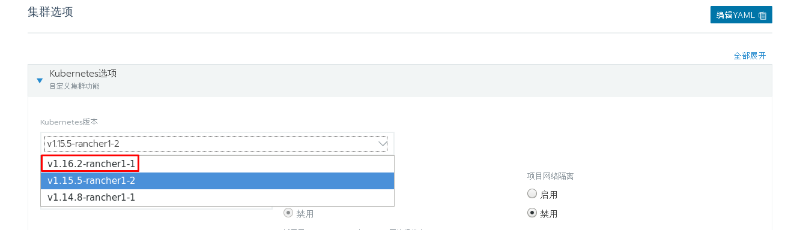
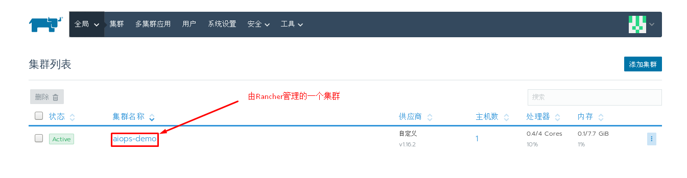
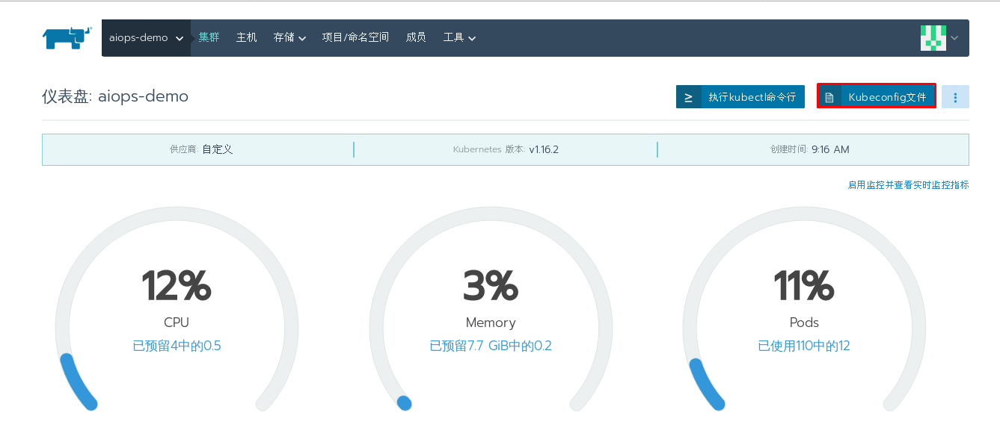

# 基于Rancher实现kubernetes集群管理

# 一、Rancher介绍

## 1.1 Rancher

Rancher 是一套容器管理平台，它可以帮助组织在生产环境中轻松快捷的部署和管理容器。Rancher可以轻松地管理各种环境的 Kubernetes，满足IT需求并为 DevOps 团队提供支持。

Rancher 用户可以选择使用 Rancher Kubernetes Engine(RKE) 创建 K8s 集群，也可以使用 GKE，AKS 和 EKS 等云K8s 服务。Rancher 用户还可以导入和管理现有的 Kubernetes 集群。同时 Rancher UI 为 DevOps 工程师提供了一个直观的用户界面来管理他们的服务容器。

## 1.2 Rancher功能

Rancher 1.x 版本是基于 Docker 以 Cattle 为调度引擎的容器管理平台。Rancher 2.x 版本基于Kubernetes 基础上重新设计，保留了 1.x 版本中的友好功能，同时提供了更多新的功能。

- 内置 CI/CD 流水线
- 告警和日志收集功能
- 多集群管理功能
- 集成 Rancher Kubernetes Engine (RKE)
- 与各云 Kubernetes 服务(如 GKE、EKS、AKS) 集成

## 1.3 Rancher架构

下图描述了 Rancher 管理两个 Kubernetes 集群的 Rancher server: 一个由 RKE 创建，另一个由 GKE 创建。

# 二、Rancher部署

## 2.1 主机需求

|  功能   |          硬件           | 操作系统  |     主机IP      | 主机名 |
| :-----: | :---------------------: | :-------: | :-------------: | :----: |
| rancher | CPU 4,MEM 8G，DISK 100G | CentOS7.6 | 192.168.122.110 | rnode1 |
|  node   | CPU 4,MEM 8G，DISK 100G | CentOS7.6 | 192.168.122.120 | rnode2 |
|  node   | CPU 4,MEM 8G，DISK 100G | CentOS7.6 | 192.168.122.130 | rnode3 |

## 2.2 主机准备

> 关于swap分区是否关闭，可根据情况自行决定。

### 2.2.1 主机名

~~~powershell
[root@localhost ~]# hostnamectl set-hostname XXX

XXX修改为rnode1、rnode2、rnode3
~~~

### 2.2.2 主机IP

~~~powershell
[root@rnode1 ~]# cat /etc/sysconfig/network-scripts/ifcfg-eth0
DEVICE=eth0
TYPE=Ethernet
ONBOOT=yes
BOOTPROTO=static
IPADDR=192.168.122.XXX
NETMASK=255.255.255.0
GATEWAY=192.168.122.1
DNS1=119.29.29.29

XXX修改为110、120、130
~~~

### 2.2.3 主机名解析

~~~powershell
[root@localhost ~]# cat /etc/hosts
127.0.0.1   localhost localhost.localdomain localhost4 localhost4.localdomain4
::1         localhost localhost.localdomain localhost6 localhost6.localdomain6
192.168.122.110 rnode1
192.168.122.120 rnode2
192.168.122.130 rnode3
~~~

### 2.2.4 安全设置

#### 2.2.4.1 关闭firewalld

~~~powershell
[root@localhost ~]# systemctl disable firewalld
[root@localhost ~]# systemctl stop firewalld
[root@localhost ~]# firewall-cmd --state
not running
~~~

#### 2.2.4.2 安装iptables-services(可选)

~~~powershell
[root@localhost ~]# yum -y install iptables-services
[root@localhost ~]# iptables -F && iptables -t nat -F && iptables -t mangle -F && iptables -t raw -F

在安装docker-ce 19.03版本后，一定要查看filter表中的FORWARD链默认策略。
[root@localhost ~]# iptables -t filter -P FORWARD ACCEPT
~~~

#### 2.2.4.3 SELinux

~~~powershell
[root@localhost ~]# cat /etc/selinux/config

# This file controls the state of SELinux on the system.
# SELINUX= can take one of these three values:
#     enforcing - SELinux security policy is enforced.
#     permissive - SELinux prints warnings instead of enforcing.
#     disabled - No SELinux policy is loaded.
SELINUX=disabled
# SELINUXTYPE= can take one of three values:
#     targeted - Targeted processes are protected,
#     minimum - Modification of targeted policy. Only selected processes are protected.
#     mls - Multi Level Security protection.
SELINUXTYPE=targeted
~~~

> 修改完SELinux配置后，需要重新启动系统

### 2.2.5 节点时间同步

~~~powershell
[root@localhost ~]# crontab -l
0 */1 * * * ntpdate time1.aliyun.com
~~~

### 2.2.6 性能调优

~~~powershell
[root@rnode1 ~]# cat /etc/sysctl.conf

net.ipv4.ip_forward=1
net.bridge.bridge-nf-call-iptables=1
net.ipv4.neigh.default.gc_thresh1=4096
net.ipv4.neigh.default.gc_thresh2=6144
net.ipv4.neigh.default.gc_thresh3=8192
~~~

### 2.2.7 模块加载

~~~powershell
创建加载模块脚本
[root@localhost ~]# cat /etc/sysconfig/modules/load.mod
#!/bin/bash
mods=(
br_netfilter
ip6_udp_tunnel
ip_set
ip_set_hash_ip
ip_set_hash_net
iptable_filter
iptable_nat
iptable_mangle
iptable_raw
nf_conntrack_netlink
nf_conntrack
nf_conntrack_ipv4
nf_defrag_ipv4
nf_nat
nf_nat_ipv4
nf_nat_masquerade_ipv4
nfnetlink
udp_tunnel
VETH
VXLAN
x_tables
xt_addrtype
xt_conntrack
xt_comment
xt_mark
xt_multiport
xt_nat
xt_recent
xt_set
xt_statistic
xt_tcpudp
)
for mod in ${mods[@]};do
    modprobe $mod
        lsmod |grep $mod
done
~~~

~~~powershell
为脚本添加执行权限
[root@rnodeX ~]# chmod +x /etc/sysconfig/modules/load.mod
[root@rnodeX ~]# bash /etc/sysconfig/modules/load.mod
~~~

## 2.3 docker-ce准备

~~~powershell
镜像源准备
清华大学开源软件镜像站
[root@rnodeX ~]# wget -O /etc/yum.repos.d/docker-ce.repo https://mirrors.tuna.tsinghua.edu.cn/docker-ce/linux/centos/docker-ce.repo
或
阿里云镜像站
[root@rnodeX ~]# wget -O /etc/yum.repos.d/docker-ce.repo https://mirrors.aliyun.com/docker-ce/linux/centos/docker-ce.repo

~~~

~~~powershell
安装docker-ce
[root@rnodeX ~]# yum -y install docker-ce
~~~

~~~powershell
修改docker service文件
[root@rnodeX ~]# vim /usr/lib/systemd/system/docker.service
......
14 ExecStartPost=/sbin/iptables -P FORWARD ACCEPT
......
~~~

~~~powershell
启动服务
[root@rnodeX ~]# systemctl enable docker
[root@rnodeX ~]# systemctl start docker
~~~

## 2.4 运行Rancher

> 需要在所有主机添加普通用户，用于rancher部署k8s集群

~~~powershell
[root@rnodeX ~]# useradd aidocker
[root@rnodeX ~]# passwd aidocker
[root@rnodeX ~]# usermod -aG docker aidocker

[root@rnodeX ~]# visudo
aidocker ALL=(ALL) ALL
~~~

**如需要连接到远程主机，可以使用如下方法**

~~~powershell
其它主机#ssh aidocker@rancher集群主机IP
~~~

**在rnode1节点运行**

~~~powershell
准备镜像
[aidocker@rnode1 ~]$ docker pull rancher/rancher:stable
~~~

~~~powershell
运行rancher容器
[aidocker@rnode1 ~]$ sudo docker run -d --restart=unless-stopped -p 80:80 -p 443:443 rancher/rancher:stable
~~~

~~~powershell
查看已运行的容器
[aidocker@rnode1 ~]$ docker ps
CONTAINER ID        IMAGE                    COMMAND             CREATED              STATUS              PORTS                                      NAMES
ce5c317659e5        rancher/rancher:stable   "entrypoint.sh"     About a minute ago   Up About a minute   0.0.0.0:80->80/tcp, 0.0.0.0:443->443/tcp   determined_tu

~~~

## 2.5 访问Rancher

# 三、 添加kubernetes集群

~~~powershell
[aidocker@rnode2 ~]$ docker pull rancher/rancher-agent:v2.4.4

[aidocker@rnode3 ~]$ docker pull rancher/rancher-agent:v2.4.4
~~~

~~~powershell
[root@rnode2 ~]# docker run -d --privileged --restart=unless-stopped --net=host -v /etc/kubernetes:/etc/kubernetes -v /var/run:/var/run rancher/rancher-agent:v2.3.2 --server https://rnode1 --token dhtx2gj8nzl4mzc8g4w99zswjwph2d6828j5pctswcp7kldwp95fvw --ca-checksum 6ccf661091db2dc9a6e3520d2c152def1eb68cddad675d92b5dcd9d1665b29c0 --etcd --controlplane --worker
~~~

> 可以先添加一台主机用于部署k8s集群。

# 四、 Rancher平台kubernetes集群dashboard部署

## 4.1 通过应用商店部署kubernetes dashboard

> 选择已部署的kubernetes集群中的System项目部署kubernetes dashboards

## 4.2 进入kubernetes dashboard

### 4.2.1 在kubernetes集群主机上部署kubectl

#### 4.2.1.1  kubectl安装

~~~powershell
YUM源准备

[aidocker@rnode2 ~]$ sudo vim /etc/yum.repos.d/k8s.repo
[kubernetes]
name=Kubernetes
baseurl=https://mirrors.aliyun.com/kubernetes/yum/repos/kubernetes-el7-x86_64/
enabled=1
gpgcheck=1
repo_gpgcheck=1
gpgkey=https://mirrors.aliyun.com/kubernetes/yum/doc/yum-key.gpg https://mirrors.aliyun.com/kubernetes/yum/doc/rpm-package-key.gpg

~~~

~~~powershell
安装kubectl
[aidocker@rnode2 ~]$ sudo yum -y install kubectl
~~~

#### 4.2.1.2  创建~/.kube/config文件

~~~powershell
[aidocker@rnode2 ~]$ sudo mkdir ~/.kube
[sudo] aidocker 的密码：
[aidocker@rnode2 ~]$ sudo vim ~/.kube/config

apiVersion: v1
kind: Config
clusters:
- name: "aiops-demo"
  cluster:
    server: "https://rnode1/k8s/clusters/c-bnx9d"
    certificate-authority-data: "LS0tLS1CRUdJTiBDRVJUSUZJQ0FURS0tLS0tCk1JSUM3akNDQ\
      WRhZ0F3SUJBZ0lCQURBTkJna3Foa2lHOXcwQkFRc0ZBREFvTVJJd0VBWURWUVFLRXdsMGFHVXQKY\
      21GdVkyZ3hFakFRQmdOVkJBTVRDV05oZEhSc1pTMWpZVEFlRncweE9URXhNVGN3TURFM016aGFGd\
      zB5T1RFeApNVFF3TURFM016aGFNQ2d4RWpBUUJnTlZCQW9UQ1hSb1pTMXlZVzVqYURFU01CQUdBM\
      VVFQXhNSlkyRjBkR3hsCkxXTmhNSUlCSWpBTkJna3Foa2lHOXcwQkFRRUZBQU9DQVE4QU1JSUJDZ\
      0tDQVFFQTFRZllNWC8weEUwQXRqRmUKVCtzSG5nbGYvanZOMnkvdEhrSDVoTm41dWFKUWRvcDRFb\
      0JYNC80SzJMVVBTLzk4VVRudVhYZ0ZGemFVUzhJSwo2Sy9YSzJLZG9qVXdHVFdNZDA0b2pSWTFOa\
      01Vckk5R2JVaUFVQTlTQmpQWlNsbWhMQytnMGhvNHZvS2wwV25wCmNMd0UwaEdIa1NmamYyMWF4d\
      jBIUURWdkpoYlVrTDdtSTZvZDNTcGIrWHkxdGNRSWFISUlTbDI3K2ZjazY3TjYKdUJnT1BPMlNWc\
      0FLRHhUU0lkWXhaNlhWZC85RWF2OGpESWhQZUczWE9VT2IzRzl1Uk1sNmszUFBBNko4ZFJxOApkZ\
      lltZ09jdnRlaHRuYURlVXlnbmNHVk1NWUlJR3lPSS9XUkNON0hZak5lcG93eUNXc3pubzgwQXFwc\
      3JHVVQ3ClhhbkxiUUlEQVFBQm95TXdJVEFPQmdOVkhROEJBZjhFQkFNQ0FxUXdEd1lEVlIwVEFRS\
      C9CQVV3QXdFQi96QU4KQmdrcWhraUc5dzBCQVFzRkFBT0NBUUVBQ1YvQStqbnZOci9MVlovczhKT\
      kt5dkxvbFRzTFNpeDJ6Q0pSZkJLcAo0YzdOYkw5Wjlxd1RNRmRVNmJyeHNoTzhlTHBQZks0dTJUT\
      zFJM0UrQjFEUk5wWmNlRkxOTUhpcElZYmRNaHNQCkZBMUhkTXpTUVBCa05JYlRJdEtTZC8vSWtsW\
      UpzOVhpcVorMERjQ0NNK3pyWkRWZHpTVGdmZ3ZSdGJzZUdSbWMKdTRsZ1llTWFreUVKUGNGYk5vS\
      0F0YzlUS0prVGVaUC9BQ0d2eTFLZ0ZEK1VXQmh4dUp4bzhrcXlLbE13QnI2MApLZEUyRVl2VSs1c\
      lVyNE04Y1lSYkRwVUlucGVPZ1lEUTFhNlJpMHdSY2VtNDVmZURiV3ExUWZoSWRiMjVLMTZGCkZPe\
      E84NTVPM0NjbklZQmhmQjZwY2RBRkRGK2Y5U1ZMNjJINnR6WHhUMHVEY3c9PQotLS0tLUVORCBDR\
      VJUSUZJQ0FURS0tLS0t"
- name: "aiops-demo-rnode2"
  cluster:
    server: "https://192.168.122.120:6443"
    certificate-authority-data: "LS0tLS1CRUdJTiBDRVJUSUZJQ0FURS0tLS0tCk1JSUN3akNDQ\
      WFxZ0F3SUJBZ0lCQURBTkJna3Foa2lHOXcwQkFRc0ZBREFTTVJBd0RnWURWUVFERXdkcmRXSmwKT\
      FdOaE1CNFhEVEU1TVRFeE56QXhNakF4TVZvWERUSTVNVEV4TkRBeE1qQXhNVm93RWpFUU1BNEdBM\
      VVFQXhNSAphM1ZpWlMxallUQ0NBU0l3RFFZSktvWklodmNOQVFFQkJRQURnZ0VQQURDQ0FRb0NnZ\
      0VCQUxYMTRZZG5UZ29xCk96bUMxYVZpZml5TmxuUGtOZS9Da1RsVW1ucmV2Q1ZQaW1GYWlKZ29lc\
      TJLdGE0bmRmeTNhWVY2c3l4ZDA5NDEKSzZZTUhzK3B0MHJ1YytvVEZBaWZWczl1VXIyUkwzR1BnW\
      FI3ekcwTnA5KzBGNlZmVGVIYnNsVUs0QXYxcCtDbgptTzRVdmhFOU93c1Z3VStFOVpnbXM0elFDM\
      XRrN3pGTFhXbFlXdHJUeVEvaVlLUUpjaGlWdUpHdzRDN3QwV040CmFHQ0xtby9xbEYvb3NVVjhMS\
      FFSZGRXOUV6NEJMZ3NWK0dFYytLd2h1a1FZbEpHbG4yZkF0Y3ZVSGlxWXk0Q1cKUTlodmFjYy94Y\
      3pRY25RN21hc2Nub0haQTIzSXhrMkNtTDJKeHI5WG9MajRlMGk5VXpMRjlJMVl6REg4d0VHSAo2Z\
      2hWT0VKQWVmMENBd0VBQWFNak1DRXdEZ1lEVlIwUEFRSC9CQVFEQWdLa01BOEdBMVVkRXdFQi93U\
      UZNQU1CCkFmOHdEUVlKS29aSWh2Y05BUUVMQlFBRGdnRUJBSTRWNFQxbGZJUXIvNXRtalYvKzZrd\
      2NNSkt1ZU1iV1pPR00KWUVYanBjckNHQ3Bhb1JqTStHL2xIcTZyaHBmK2M0cktlcFFlSmQ3M1l4W\
      DRBYkhDdk1FdXlGUFlKWDRTSGE0LwpKL1FEeHZVcEtxaUk0WlgrRDI5dlBRMnpoUFN4bVE4dkx2V\
      2N5eU1OVWZMeWpvZVN2U2dmZ2NlbDJzWGpta2R2ClhWRzNDK2JPT0hjOEo1RG5lcGlIb0lpWkpXM\
      HQ1aFQ5TkFnd3dvTjZHaHM1MGZBVEpuZ053bUVjaUlXd2NvZUwKWGZGeDhlNjg2VFhuV2puU2dtU\
      28yVTZQTVVsb09TQ0dpWFNWRjZLYlJ1UDM1UVBTN0VzUTIxb2hrdXVsV08vVgpsbjZOaURvNWxFa\
      i9UQnFpeUV1K0ZQdGFENTZaMXlWTlluYlJKVFY3aFp0bzVxOENRQTg9Ci0tLS0tRU5EIENFUlRJR\
      klDQVRFLS0tLS0K"

users:
- name: "aiops-demo"
  user:
    token: "kubeconfig-user-wxlrp.c-bnx9d:w6b2bv5wwx7x2dn8lr7s9tc2n8wncnrtc7vfwxc2f6l98nx6d5sgtr"

contexts:
- name: "aiops-demo"
  context:
    user: "aiops-demo"
    cluster: "aiops-demo"
- name: "aiops-demo-rnode2"
  context:
    user: "aiops-demo"
    cluster: "aiops-demo-rnode2"

current-context: "aiops-demo"

~~~

#### 4.2.1.3 验证kubectl可用性

~~~powershell
[aidocker@rnode2 ~]$ kubectl get pods
NAME                             READY   STATUS    RESTARTS   AGE
myfirst-nginx-77c5bbf8bb-ltwdm   1/1     Running   0          74m
myfirst-nginx-77c5bbf8bb-vxct7   1/1     Running   0          80m
~~~

