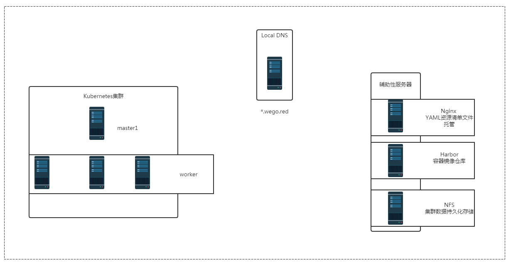

# 基于kubernetes集群 容器云管理平台 kubesphere

# 一、kubesphere

>官方参考资料：https://kubesphere.com.cn/docs/v2.1/zh-CN/introduction/intro/

## 1.1 kubesphere介绍

[KubeSphere](https://kubesphere.io/)是在 Kubernetes 之上构建的企业级分布式多租户容器管理平台，提供简单易用的操作界面以及向导式操作方式，在降低用户使用容器调度平台学习成本的同时，极大减轻开发、测试、运维的日常工作的复杂度，旨在解决 Kubernetes 本身存在的存储、网络、安全和易用性等痛点。除此之外，平台已经整合并优化了多个适用于容器场景的功能模块，以完整的解决方案帮助企业轻松应对敏捷开发与自动化运维、微服务治理、多租户管理、工作负载和集群管理、服务与网络管理、应用编排与管理、镜像仓库管理和存储管理等业务场景。

## 1.2kubesphere功能

KubeSphere 为用户提供了一个具备极致体验的 Web 控制台，让您能够像使用任何其他互联网产品一样，快速上手各项功能与服务。KubeSphere 目前集成了应用负载、服务与网络、应用管理、资源管理和平台管理共五大模块，以下从专业的角度为您详解各个模块的功能服务：

| 功能           | 说明                                                         |
| -------------- | ------------------------------------------------------------ |
| 应用负载管理   | 对 kubernetes 中的多种 workload 提供向导式管理界面，包括 Deployments，DaemonSets，StatefulSets，并提供 HPA 支持。 |
| 服务与网络管理 | 基于原生 API，对 k8s 中的服务 (Service)、应用路由 (ingress) 等功能提供向导式管理界面，快速将应用暴露以供用户访问。高级版将集成 istio 中的 微服务治理、熔断、灰度发布、限流、智能路由等功能提供向导式管理界面。如果部署在青云平台之上，可以使用插件对接青云的负载均衡器。 |
| 应用管理       | 后端使用开源的 OpenPitrix 服务，为用户提供应用全生命周期管理功能，包括： 应用仓库管理、应用拓扑图、APM、应用变更和发布、应用上下线审批、版本控制、鲁棒性测试等。 |
| 资源管理       | 提供存储、主机、集群以及配额管理。存储既支持主流开源存储解决方案，也可对接青云的块存储和 NeonSAN。可批量添加主机，且对主机平台及系统弱依赖。并且支持镜像仓库管理、镜像复制、权限管理、镜像安全扫描。 |
| 平台管理       | 提供基于角色的细粒度权限多租户管理，平台服务间进行加密通信；提供操作审计日志；可对宿主机以及容器镜像进行安全扫描并发现漏洞。 |

# 二、kubesphere部署

## 2.0 kubesphere部署模式介绍

- 在现有主机之上部署kubesphere
- 在现有kubernetes集群之上部署kubesphere

## 2.1 本次部署集群环境说明

>建议先停止已经安装的prometheus/Jenkins/sonarqube/metrics_server/Dashboard会有冲突

## 2.2 部署脚本说明

脚本链接地址：https://github.com/kubesphere/ks-installer

## 2.3 环境要求说明

- Kubernetes 版本要求为 1.13.0 ≤ K8s Version ≤  1.17，使用 kubeadm 搭建的 Kubernetes 1.17.2 版本集群
- Helm v2.15.2 版本
- 使用 NFS 作为集群存储后端  

- 集群现有的可用内存至少在 `10G` 以上

## 2.4 相关版本验证

### 2.4.1 kubernetes集群版本

> k8s集群部署方法可预约相关课程。

~~~powershell
[root@k8smaster1 ~]# kubectl version | grep Server
Server Version: version.Info{Major:"1", Minor:"17", GitVersion:"v1.17.2", GitCommit:"72c30166b2105cd7d3350f2c28a219e6abcd79eb", GitTreeState:"clean", BuildDate:"2020-01-18T23:23:21Z", GoVersion:"go1.13.5", Compiler:"gc", Platform:"linux/amd64"}
~~~

### 2.4.2 helm版本验证

#### 2.4.2.1  已安装helm版本验证

> helm部署请参考helm2部署方法。

~~~powershell
[root@k8smaster1 ~]# helm version
Client: &version.Version{SemVer:"v2.15.2", GitCommit:"bbdfe5e7803a12bbdf97e94cd847859890cf4050", GitTreeState:"clean"}
Server: &version.Version{SemVer:"v2.15.2", GitCommit:"bbdfe5e7803a12bbdf97e94cd847859890cf4050", GitTreeState:"clean"}
~~~

#### 2.4.2.2 安装helm及验证

~~~powershell
下载helm
[root@k8smaster1 ~]# wget https://get.helm.sh/helm-v2.15.2-linux-amd64.tar.gz
~~~

~~~powershell
解压并查看结果
[root@k8smaster1 ~]# tar xf helm-v2.15.2-linux-amd64.tar.gz
[root@k8smaster1 ~]# ls
linux-amd64
[root@k8smaster1 ~]# mv helm /usr/local/bin/
~~~

~~~powershell
创建helm初始化应用目录
[root@master1 ~]# mkdir /root/helm
~~~

~~~powershell
配置helm初始化应用目录环境变量
[root@master1 ~]# echo 'export HELM_HOME=/root/helm' >> .bash_profile
[root@master1 ~]# source .bash_profile
[root@master1 ~]# echo $HELM_HOME
/root/helm
~~~

~~~powershell
为helm服务端tiller创建rbac授权文件
[root@master1 ~]# cat tiller-rbac.yaml
apiVersion: v1
kind: ServiceAccount
metadata:
  name: tiller
  namespace: kube-system
---
apiVersion: rbac.authorization.k8s.io/v1beta1
kind: ClusterRoleBinding
metadata:
  name: tiller
roleRef:
  apiGroup: rbac.authorization.k8s.io
  kind: ClusterRole
  name: cluster-admin
subjects:
  - kind: ServiceAccount
    name: tiller
    namespace: kube-system
~~~

~~~powershell
应用tiller rbac授权清单文件
[root@master1 ~]# kubectl create -f tiller-rbac.yaml
serviceaccount/tiller created
clusterrolebinding.rbac.authorization.k8s.io/tiller created
~~~

~~~powershell
查看应用结果
[root@master1 ~]# kubectl get -n kube-system secrets,sa,clusterrolebinding -o name|grep tiller
secret/tiller-token-hkfzp
serviceaccount/tiller
clusterrolebinding.rbac.authorization.k8s.io/tiller
~~~

~~~powershell
下载阿里云镜像并更名，由于tiller运行节点不固定，所有节点均需下载。
[root@XXX ~]#  docker pull registry.cn-hangzhou.aliyuncs.com/google_containers/tiller:v2.15.2

[root@XXX ~]# docker tag registry.cn-hangzhou.aliyuncs.com/google_containers/tiller:v2.15.2 gcr.io/kubernetes-helm/tiller:v2.15.2

[root@XXX ~]# docker rmi registry.cn-hangzhou.aliyuncs.com/google_containers/tiller:v2.15.2
~~~

~~~powershell
使用helm初始化并在kubernetes集群中安装tiller
[root@master1 ~]# helm init --service-account tiller 
Creating /root/helm/repository
Creating /root/helm/repository/cache
Creating /root/helm/repository/local
Creating /root/helm/plugins
Creating /root/helm/starters
Creating /root/helm/cache/archive
Creating /root/helm/repository/repositories.yaml
Adding stable repo with URL: https://kubernetes-charts.storage.googleapis.com
Adding local repo with URL: http://127.0.0.1:8879/charts
$HELM_HOME has been configured at /root/helm.

Tiller (the Helm server-side component) has been installed into your Kubernetes Cluster.

Please note: by default, Tiller is deployed with an insecure 'allow unauthenticated users' policy.
To prevent this, run `helm init` with the --tiller-tls-verify flag.
For more information on securing your installation see: https://docs.helm.sh/using_helm/#securing-your-helm-installation
~~~

~~~powershell
验证helm版本
[root@k8smaster1 ~]# helm version
Client: &version.Version{SemVer:"v2.15.2", GitCommit:"bbdfe5e7803a12bbdf97e94cd847859890cf4050", GitTreeState:"clean"}
Server: &version.Version{SemVer:"v2.15.2", GitCommit:"bbdfe5e7803a12bbdf97e94cd847859890cf4050", GitTreeState:"clean"}
~~~

## 2.5 后端存储PV动态供给

### 2.5.1 添加一块硬盘

~~~powershell
[root@k8snfs ~]# lsblk
NAME            MAJ:MIN RM  SIZE RO TYPE MOUNTPOINT
vda             252:0    0   20G  0 disk
├─vda1          252:1    0    1G  0 part /boot
└─vda2          252:2    0   19G  0 part
  ├─centos-root 253:0    0   17G  0 lvm  /
  └─centos-swap 253:1    0    2G  0 lvm  [SWAP]
vdb             252:16   0  100G  0 disk
~~~

### 2.5.2  格式化硬盘

~~~powershell
[root@k8snfs ~]# mkfs.ext4 /dev/vdb
~~~

### 2.5.3 挂载

~~~powershell
[root@k8snfs ~]# mkdir /vdb

手动挂载
[root@k8snfs ~]# mount /dev/vdb /vdb
[root@k8snfs ~]# df -h
文件系统                 容量  已用  可用 已用% 挂载点
/dev/mapper/centos-root   17G  1.1G   16G    7% /
devtmpfs                 2.0G     0  2.0G    0% /dev
tmpfs                    2.0G     0  2.0G    0% /dev/shm
tmpfs                    2.0G  8.6M  2.0G    1% /run
tmpfs                    2.0G     0  2.0G    0% /sys/fs/cgroup
/dev/vda1               1014M  133M  882M   14% /boot
tmpfs                    396M     0  396M    0% /run/user/0
/dev/vdb                  99G   61M   94G    1% /vdb
或

自动挂载
[root@k8snfs ~]# cat /etc/fstab

......
/dev/vdb                /vdb                    ext4    defaults        0 0
~~~

### 2.5.4 安装NFS服务

> kubernetes所有工作节点全部安装。

~~~powershell
[root@k8snfs ~]# yum -y install nfs-utils 

[root@k8smaster1 ~]# yum -y install nfs-utils

[root@k8swork1 ~]# yum -y install nfs-utils

[root@k8swork2 ~]# yum -y install nfs-utils 
~~~

### 2.5.5  配置NFS服务

~~~powershell
[root@k8snfs ~]# cat /etc/exports
/vdb    *(rw,sync,no_root_squash)

[root@k8snfs ~]# systemctl enable nfs-server
[root@k8snfs ~]# systemctl start nfs-server
~~~

### 2.5.6  验证是否可访问

~~~powershell
[root@k8snfs ~]# showmount -e
Export list for k8snfs:
/vdb *

[root@k8smaster1 ~]# showmount -e k8snfs
Export list for k8snfs:
/vdb *

[root@k8swork1 ~]# showmount -e k8snfs
Export list for k8snfs:
/vdb *

[root@k8swork2 ~]# showmount -e k8snfs
Export list for k8snfs:
/vdb *
~~~

### 2.5.7  查看用于创建PV动态供给资源清单文件

~~~powershell
[root@k8smaster1 pv]# cat kubesphere-sc.yaml
apiVersion: storage.k8s.io/v1
kind: StorageClass
metadata:
  name: kubesphere-data
  annotations:
    storageclass.kubernetes.io/is-default-class: "true" 
provisioner: fuseim.pri/ifs
~~~

~~~powershell
[root@k8smaster1 pv]# cat kubesphere-rbac.yaml
apiVersion: v1
kind: ServiceAccount
metadata:
  name: nfs-client-provisioner  # replace with namespace where provisioner is deployed

  namespace: default
---
kind: ClusterRole
apiVersion: rbac.authorization.k8s.io/v1
metadata:
  name: nfs-client-provisioner-runner
rules:
  - apiGroups: [""]
    resources: ["persistentvolumes"]
    verbs: ["get", "list", "watch", "create", "delete"]
  - apiGroups: [""]
    resources: ["persistentvolumeclaims"]
    verbs: ["get", "list", "watch", "update"]
  - apiGroups: ["storage.k8s.io"]
    resources: ["storageclasses"]
    verbs: ["get", "list", "watch"]
  - apiGroups: [""]
    resources: ["events"]
    verbs: ["create", "update", "patch"]
---
kind: ClusterRoleBinding
apiVersion: rbac.authorization.k8s.io/v1
metadata:
  name: run-nfs-client-provisioner
subjects:
  - kind: ServiceAccount
    name: nfs-client-provisioner  # replace with namespace where provisioner is deployed

    namespace: default
roleRef:
  kind: ClusterRole
  name: nfs-client-provisioner-runner
  apiGroup: rbac.authorization.k8s.io
---
kind: Role
apiVersion: rbac.authorization.k8s.io/v1
metadata:
  name: leader-locking-nfs-client-provisioner  # replace with namespace where provisioner is deployed

  namespace: default
rules:
  - apiGroups: [""]
    resources: ["endpoints"]
    verbs: ["get", "list", "watch", "create", "update", "patch"]
---
kind: RoleBinding
apiVersion: rbac.authorization.k8s.io/v1
metadata:
  name: leader-locking-nfs-client-provisioner
subjects:
  - kind: ServiceAccount
    name: nfs-client-provisioner # replace with namespace where provisioner is deployed

    namespace: default
roleRef:
  kind: Role
  name: leader-locking-nfs-client-provisioner
  apiGroup: rbac.authorization.k8s.io

~~~

~~~powershell
[root@k8smaster1 pv]# cat kubesphere-deployment.yaml
apiVersion: apps/v1
kind: Deployment
metadata:
  name: nfs-client-provisioner
  labels:
    app: nfs-client-provisioner # replace with namespace where provisioner is deployed

  namespace: default
spec:
  replicas: 1
  selector:
    matchLabels:
      app: nfs-client-provisioner
  strategy:
    type: Recreate
  selector:
    matchLabels:
      app: nfs-client-provisioner
  template:
    metadata:
      labels:
        app: nfs-client-provisioner
    spec:
      serviceAccountName: nfs-client-provisioner
      containers:
        - name: nfs-client-provisioner
          image: quay.io/external_storage/nfs-client-provisioner:latest #提前下载镜像
          volumeMounts:
            - name: nfs-client-root
              mountPath: /persistentvolumes
          env:
            - name: PROVISIONER_NAME
              value: fuseim.pri/ifs
            - name: NFS_SERVER
              value: 192.168.122.14 #NFS服务器IP或域名
            - name: NFS_PATH
              value: /vdb #为NFS服务器共享目录
      volumes:
        - name: nfs-client-root
          nfs:
            server: 192.168.122.14 #NFS服务器IP或域名
            path: /vdb #为NFS服务器共享目录
~~~

### 2.5.8 下载镜像

> kubernetes集群所有节点均要下载

~~~powershell
[root@k8smaster1 ~]# docker pull quay.io/external_storage/nfs-client-provisioner:latest

[root@k8swork1 ~]# docker pull quay.io/external_storage/nfs-client-provisioner:latest

[root@k8swork2 ~]# docker pull quay.io/external_storage/nfs-client-provisioner:latest
~~~

### 2.5.9 应用上述资源清单文件

~~~powershell
[root@k8smaster1 pv]# kubectl apply -f kubesphere-sc.yaml
storageclass.storage.k8s.io/kubesphere-data created
[root@k8smaster1 pv]# kubectl apply -f kubesphere-rbac.yaml
serviceaccount/nfs-client-provisioner created
clusterrole.rbac.authorization.k8s.io/nfs-client-provisioner-runner created
clusterrolebinding.rbac.authorization.k8s.io/run-nfs-client-provisioner created
role.rbac.authorization.k8s.io/leader-locking-nfs-client-provisioner created
rolebinding.rbac.authorization.k8s.io/leader-locking-nfs-client-provisioner created
[root@k8smaster1 pv]# kubectl apply -f kubesphere-deployment.yaml
deployment.apps/nfs-client-provisioner created
~~~

### 2.5.10  验证结果

~~~powershell
[root@k8smaster1 pv]# kubectl get pods
NAME                                      READY   STATUS    RESTARTS   AGE
nfs-client-provisioner-864c456c77-f6krp   1/1     Running   0          65s

[root@k8smaster1 pv]# kubectl get sc
NAME                        PROVISIONER      AGE
kubesphere-data (default)   fuseim.pri/ifs   2m10s
~~~

## 2.6 安装kubesphere

### 2.6.1  创建命名空间

> 在集群中创建名为kubesphere-system和kubesphere-monitoring-system的namespace

~~~powershell
[root@k8smaster1 ~]# cat <<EOF | kubectl create -f -
---
apiVersion: v1
kind: Namespace
metadata:
  name: kubesphere-system
---
apiVersion: v1
kind: Namespace
metadata:
  name: kubesphere-monitoring-system
EOF

namespace/kubesphere-system created
namespace/kubesphere-monitoring-system created
~~~

~~~powershell
[root@k8smaster1 ~]# kubectl get ns
NAME                           STATUS   AGE
default                        Active   3h57m
kube-node-lease                Active   3h57m
kube-public                    Active   3h57m
kube-system                    Active   3h57m
kubesphere-monitoring-system   Active   118s
kubesphere-system              Active   118s
~~~

### 2.6.2 创建集群ca证书secret

>按照当前集群 ca.crt 和 ca.key 证书路径创建（kubeadm 创建集群的证书路径一般为/etc/kubernetes/pki）

~~~powershell
[root@k8smaster1 ~]# kubectl -n kubesphere-system create secret generic kubesphere-ca  --from-file=ca.crt=/etc/kubernetes/pki/ca.crt  --from-file=ca.key=/etc/kubernetes/pki/ca.key

secret/kubesphere-ca created
~~~

### 2.6.3 创建etcd证书secret

>以集群实际 etcd 证书位置创建；若 etcd 没有配置证书，则创建空secret

~~~powershell
[root@k8smaster1 ~]# kubectl -n kubesphere-monitoring-system create  secret generic kube-etcd-client-certs  \
--from-file=etcd-client-ca.crt=/etc/kubernetes/pki/etcd/ca.crt \
--from-file=etcd-client.crt=/etc/kubernetes/pki/etcd/healthcheck-client.crt \
--from-file=etcd-client.key=/etc/kubernetes/pki/etcd/healthcheck-client.key

secret/kube-etcd-client-certs created

[root@k8smaster1 ~]# kubectl -n kubesphere-monitoring-system get  secret
NAME                     TYPE                                  DATA   AGE
default-token-qdl4p      kubernetes.io/service-account-token   3      21m
kube-etcd-client-certs   Opaque                                3      4m37s

~~~

### 2.6.4 部署程序下载

~~~powershell
[root@k8smaster1 ~]# git clone https://github.com/kubesphere/ks-installer.git -b master
正克隆到 'ks-installer'...
remote: Enumerating objects: 136, done.
remote: Counting objects: 100% (136/136), done.
remote: Compressing objects: 100% (105/105), done.
remote: Total 8052 (delta 43), reused 67 (delta 22), pack-reused 7916
接收对象中: 100% (8052/8052), 3.93 MiB | 1.61 MiB/s, done.
处理 delta 中: 100% (4393/4393), done.
[root@k8smaster1 ~]# ls
 ks-installer
 
 
[root@k8smaster1 ~]# ls ks-installer/
controller  docs                     LICENSE    README_zh.md  src
deploy      env                      playbooks  roles
Dockerfile  kubesphere-minimal.yaml  README.md  scripts

~~~

### 2.6.5 kubesphere镜像准备

> 在harbor主机准备镜像

~~~powershell
把准备镜像相关脚本复制到harbor服务器
[root@master1 ks-installer]# pwd
/root/ks-installer
[root@master1 ks-installer]# ls
controller  docs                            kubesphere-minimal.yaml  README.md     scripts
deploy      env                             LICENSE                  README_zh.md  src
Dockerfile  kubesphere-complete-setup.yaml  playbooks                roles
[root@master1 ks-installer]# cd scripts/
[root@master1 scripts]# ls
create_project_harbor.sh  download-image-list.sh  kubesphere-delete.sh  push-image-list.sh
[root@master1 scripts]# scp create_project_harbor.sh download-image-list.sh push-image-list.sh harbor.wego.red:/root
~~~

~~~powershell
第一个脚本：create_project_harbor.sh 在harbor上创建项目，用于存储下载的镜像。
[root@harbor ~]# cat create_project_harbor.sh
#!/bin/bash

# Copyright 2018 The KubeSphere Authors.
#
# Licensed under the Apache License, Version 2.0 (the "License");
# you may not use this file except in compliance with the License.
# You may obtain a copy of the License at
#
#     http://www.apache.org/licenses/LICENSE-2.0
#
# Unless required by applicable law or agreed to in writing, software
# distributed under the License is distributed on an "AS IS" BASIS,
# WITHOUT WARRANTIES OR CONDITIONS OF ANY KIND, either express or implied.
# See the License for the specific language governing permissions and
# limitations under the License.

url="http://harbor.wego.red"
user="admin"
passwd="Harbor12345"

harbor_projects=(library                        \
                 kubesphere                     \
                 csiplugin                      \
                 openpitrix                     \
                 mirrorgitlabcontainers         \
                 google-containers              \
                 istio                          \
                 k8scsi                         \
                 osixia                         \
                 goharbor                       \
                 minio                          \
                 openebs                        \
                 kubernetes-helm                \
                 coredns                        \
                 jenkins                        \
                 jaegertracing                  \
                 calico                         \
                 oliver006                      \
                 fluent                         \
                 kubernetes_ingress_controller  \
                 kibana                         \
                 gitlab_org                     \
                 coreos                         \
                 google_containers              \
                 grafana                        \
                 external_storage               \
                 pires                          \
                 nginxdemos                     \
                 gitlab                         \
                 joosthofman                    \
                 mirrorgooglecontainers         \
                 wrouesnel                      \
                 dduportal                      \
)

for project in ${harbor_projects[@]} ; do
    echo "creating $project"
    curl -u "${user}:${passwd}" -X POST -H "Content-Type: application/json" "${url}/api/projects" -d "{ \"project_name\": \"${project}\", \"public\": 1}"
done

执行
[root@harbor ~]# ./create_project_harbor.sh
~~~

~~~powershell
第二个脚本：download-image-list.sh  下载kubesphere需要的所有镜像
[root@harbor ~]# cat download-image-list.sh
#!/bin/bash

# Copyright 2018 The KubeSphere Authors.
#
# Licensed under the Apache License, Version 2.0 (the "License");
# you may not use this file except in compliance with the License.
# You may obtain a copy of the License at
#
#     http://www.apache.org/licenses/LICENSE-2.0
#
# Unless required by applicable law or agreed to in writing, software
# distributed under the License is distributed on an "AS IS" BASIS,
# WITHOUT WARRANTIES OR CONDITIONS OF ANY KIND, either express or implied.
# See the License for the specific language governing permissions and
# limitations under the License.

# docker login -u guest -p guest dockerhub.qingcloud.com

ks_images=(
......
  )

for image in ${ks_images[@]}; do
  ## download_images
   docker pull $image
done

执行
[root@harbor ~]# ./download-image-list.sh
~~~

~~~powershell
第三个脚本：push-image-list.sh 上传镜像至harbor
[root@harbor ~]# cat push-image-list.sh
#!/bin/bash

# Copyright 2018 The KubeSphere Authors.
#
# Licensed under the Apache License, Version 2.0 (the "License");
# you may not use this file except in compliance with the License.
# You may obtain a copy of the License at
#
#     http://www.apache.org/licenses/LICENSE-2.0
#
# Unless required by applicable law or agreed to in writing, software
# distributed under the License is distributed on an "AS IS" BASIS,
# WITHOUT WARRANTIES OR CONDITIONS OF ANY KIND, either express or implied.
# See the License for the specific language governing permissions and
# limitations under the License.

docker login -u admin -p Harbor12345 harbor.wego.red
添加上一行内容

ks_images=(
......
  )

registryurl="$1"
reposUrl=("dockerhub.qingcloud.com" "quay.azk8s.cn" "gcr.azk8s.cn" "docker.elastic.co")

for image in ${ks_images[@]}; do
  ## retag images
    url=${image%%/*}
    ImageName=${image#*/}
    echo $image
    if echo "${reposUrl[@]}" | grep -w "$url" &>/dev/null; then
          imageurl=$registryurl"/"${image#*/}
    elif [ $url == $registryurl ]; then
        if [[ $ImageName != */* ]]; then
            imageurl=$registryurl"/library/"$ImageName
        else
            imageurl=$image
        fi
    elif [ "$(echo $url | grep ':')" != "" ]; then
          imageurl=$registryurl"/library/"$image
    else
          imageurl=$registryurl"/"$image
    fi
    ## push image
    echo $imageurl
    docker tag $image $imageurl
    docker push $imageurl
    # docker rmi $i
done

执行

[root@harbor ~]# ./push-image-list.sh harbor.wego.red
~~~

### 2.6.6 在k8s集群部署kubesphere

#### 2.6.6.1 查看文件

~~~powershell
[root@k8smaster1 ~]# ls ks-installer/
controller  docs                     LICENSE    README_zh.md  src
deploy      env                      playbooks  roles
Dockerfile  kubesphere-minimal.yaml  README.md  scripts

~~~

#### 2.6.6.2  修改配置文件

~~~powershell
[root@k8smaster1 ~]# cat ks-installer/kubesphere-complete-setup.yaml
---
apiVersion: v1
kind: Namespace
metadata:
  name: kubesphere-system

---
apiVersion: v1
data:
  ks-config.yaml: |
    ---
    kubernetes:
      apiserverAddr: 192.168.122.11:6443
    
    local_registry: "harbor.wego.red"

    persistence:
      storageClass: "kubesphere-data"

    etcd:
      monitoring: True
      endpointIps: 192.168.122.11
      port: 2379
      tlsEnable: True

    common:
      mysqlVolumeSize: 20Gi
      minioVolumeSize: 20Gi
      etcdVolumeSize: 20Gi
      openldapVolumeSize: 2Gi
      redisVolumSize: 2Gi

    metrics-server:
      enabled: True

    console:
      enableMultiLogin: True  # enable/disable multi login
      port: 30880

    monitoring:
      prometheusReplicas: 1
      prometheusMemoryRequest: 400Mi
      prometheusVolumeSize: 20Gi
      grafana:
        enabled: True

    logging:
      enabled: True
      elasticsearchMasterReplicas: 1
      elasticsearchDataReplicas: 1
      logsidecarReplicas: 2
      elasticsearchVolumeSize: 20Gi
      logMaxAge: 7
      elkPrefix: logstash
      containersLogMountedPath: ""
      kibana:
        enabled: True

    openpitrix:
      enabled: True

    devops:
      enabled: True
      jenkinsMemoryLim: 2Gi
      jenkinsMemoryReq: 1500Mi
      jenkinsVolumeSize: 8Gi
      jenkinsJavaOpts_Xms: 512m
      jenkinsJavaOpts_Xmx: 512m
      jenkinsJavaOpts_MaxRAM: 2g
      sonarqube:
        enabled: True

    servicemesh:
      enabled: True

    notification:
      enabled: True

    alerting:
      enabled: True

kind: ConfigMap
metadata:
  name: ks-installer
  namespace: kubesphere-system

---
apiVersion: v1
kind: ServiceAccount
metadata:
  name: ks-installer
  namespace: kubesphere-system

---
apiVersion: rbac.authorization.k8s.io/v1
kind: ClusterRole
metadata:
  creationTimestamp: null
  name: ks-installer
rules:
- apiGroups:
  - ""
  resources:
  - '*'
  verbs:
  - '*'
- apiGroups:
  - apps
  resources:
  - '*'
  verbs:
  - '*'
- apiGroups:
  - extensions
  resources:
  - '*'
  verbs:
  - '*'
- apiGroups:
  - batch
  resources:
  - '*'
  verbs:
  - '*'
- apiGroups:
  - rbac.authorization.k8s.io
  resources:
  - '*'
  verbs:
  - '*'
- apiGroups:
  - apiregistration.k8s.io
  resources:
  - '*'
  verbs:
  - '*'
- apiGroups:
  - apiextensions.k8s.io
  resources:
  - '*'
  verbs:
  - '*'
- apiGroups:
  - tenant.kubesphere.io
  resources:
  - '*'
  verbs:
  - '*'
- apiGroups:
  - certificates.k8s.io
  resources:
  - '*'
  verbs:
  - '*'
- apiGroups:
  - devops.kubesphere.io
  resources:
  - '*'
  verbs:
  - '*'
- apiGroups:
  - monitoring.coreos.com
  resources:
  - '*'
  verbs:
  - '*'
- apiGroups:
  - logging.kubesphere.io
  resources:
  - '*'
  verbs:
  - '*'
- apiGroups:
  - jaegertracing.io
  resources:
  - '*'
  verbs:
  - '*'
- apiGroups:
  - storage.k8s.io
  resources:
  - '*'
  verbs:
  - '*'
- apiGroups:
  - admissionregistration.k8s.io
  resources:
  - '*'
  verbs:
  - '*'

---
kind: ClusterRoleBinding
apiVersion: rbac.authorization.k8s.io/v1
metadata:
  name: ks-installer
subjects:
- kind: ServiceAccount
  name: ks-installer
  namespace: kubesphere-system
roleRef:
  kind: ClusterRole
  name: ks-installer
  apiGroup: rbac.authorization.k8s.io

---
apiVersion: apps/v1
kind: Deployment
metadata:
  name: ks-installer
  namespace: kubesphere-system
  labels:
    app: ks-install
spec:
  replicas: 1
  selector:
    matchLabels:
      app: ks-install
  template:
    metadata:
      labels:
        app: ks-install
    spec:
      serviceAccountName: ks-installer
      containers:
      - name: installer
        image: harbor.wego.red/kubesphere/ks-installer:v2.1.1
        imagePullPolicy: "IfNotPresent"

~~~

#### 2.6.6.3 安装kubesphere

~~~powershell
[root@k8smaster1 ~]# kubectl apply -f /root/ks-installer/kubesphere-minimal.yaml
Warning: kubectl apply should be used on resource created by either kubectl create --save-config or kubectl apply
namespace/kubesphere-system configured
configmap/ks-installer created
serviceaccount/ks-installer created
clusterrole.rbac.authorization.k8s.io/ks-installer created
clusterrolebinding.rbac.authorization.k8s.io/ks-installer created
deployment.apps/ks-installer created
~~~

#### 2.6.6.4 查看部署日志

> 部署过程中查看部署日志，用于查看部署过程。

~~~powershell
[root@k8smaster1 ~]# kubectl logs -n kubesphere-system $(kubectl get pod -n kubesphere-system -l app=ks-install -o jsonpath='{.items[0].metadata.name}') -f
~~~

# 三、登录并使用kubesphere

>查看控制台的服务端口，使用 `IP:30880` 访问 KubeSphere UI 界面，默认的集群管理员账号为 `admin/P@88w0rd`。

~~~powershell
#####################################################
###              Welcome to KubeSphere!           ###
#####################################################

Console: http://192.168.122.2:30880
Account: admin
Password: P@88w0rd

NOTES：
  1. After logging into the console, please check the
     monitoring status of service components in
     the "Cluster Status". If the service is not
     ready, please wait patiently. You can start
     to use when all components are ready.
  2. Please modify the default password after login.
~~~

