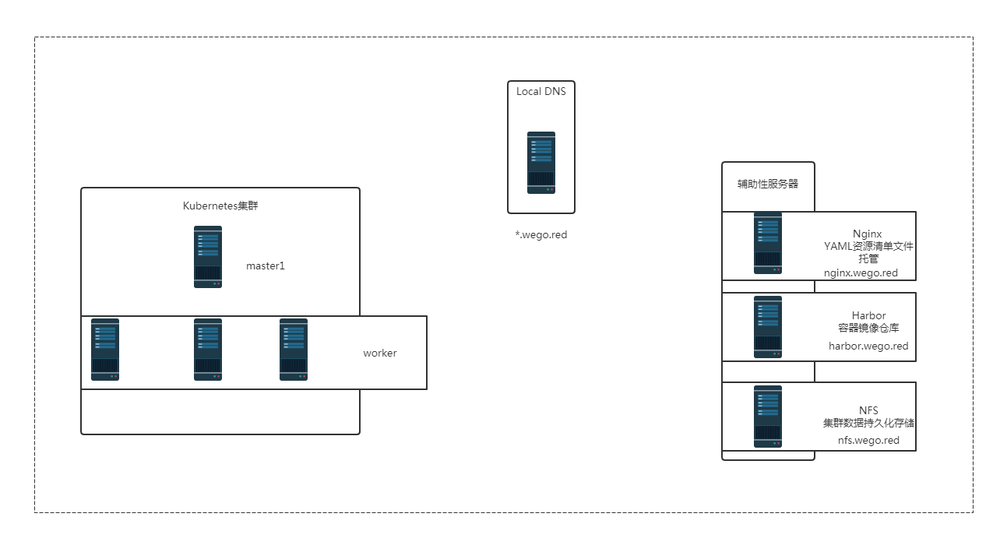
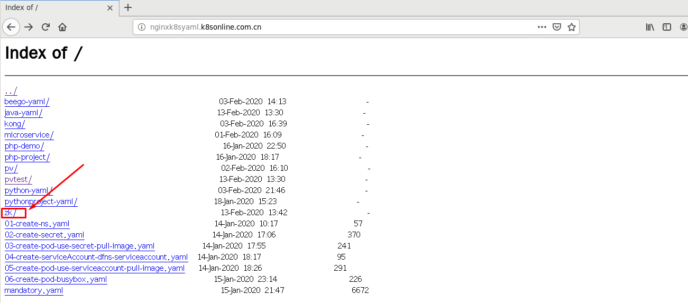
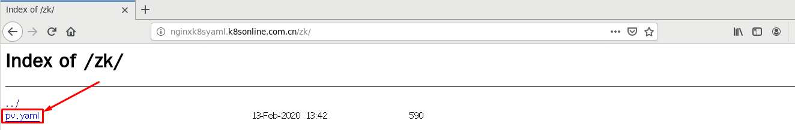
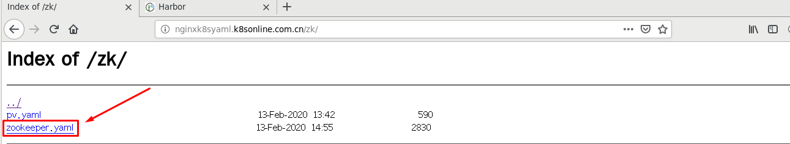
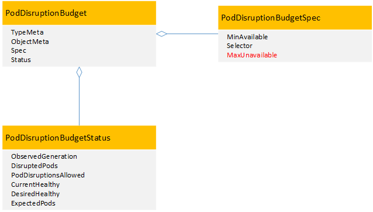

# kubernetes集群 应用实践 zookeeper部署

# 零、环境说明

# 一、zookeeper持久存储准备

> zookeeper属于有状态应用，需要为zookeeper部署后端存储服务。

## 1.1 在NFS服务器添加一块硬盘vdc

~~~powershell
[root@nfsserver ~]# lsblk
NAME            MAJ:MIN RM  SIZE RO TYPE MOUNTPOINT
vda             252:0    0   20G  0 disk
├─vda1          252:1    0    1G  0 part /boot
└─vda2          252:2    0   19G  0 part
  ├─centos-root 253:0    0   17G  0 lvm  /
  └─centos-swap 253:1    0    2G  0 lvm  [SWAP]
vdb             252:16   0  100G  0 disk /vdb
vdc             252:32   0   20G  0 disk /vdc
~~~

## 1.2 创建指定目录

> 格式化后，挂载使用。

~~~powershell
[root@nfsserver ~]# tree /vdc
/vdc
├── lost+found
└── zk
    ├── data1
    ├── data2
    └── data3

5 directories, 0 files
~~~

## 1.3 创建共享目录

~~~powershell
[root@nfsserver ~]# cat /etc/exports
/vdc/zk/data1   *(rw,sync,no_root_squash)
/vdc/zk/data2   *(rw,sync,no_root_squash)
/vdc/zk/data3   *(rw,sync,no_root_squash)
~~~

## 1.4 验证共享目录可用性

~~~powershell
[root@nfsserver ~]# showmount -e 192.168.122.250
Export list for 192.168.122.250:
/vdc/zk/data3  *
/vdc/zk/data2  *
/vdc/zk/data1  *
~~~

# 二、在k8s集群中创建zookeeper集群PV存储

~~~powershell
准备资源清单文件
[root@nginxk8syaml zk]# pwd
/usr/share/nginx/html/zk

[root@nginxk8syaml zk]# cat pv.yaml
apiVersion: v1
kind: PersistentVolume
metadata:
  name: zk-data1
spec:
  capacity:
    storage: 1Gi
  accessModes:
    - ReadWriteOnce
  nfs:
    server: nfs.wego.red
    path: /vdc/zk/data1
---
apiVersion: v1
kind: PersistentVolume
metadata:
  name: zk-data2
spec:
  capacity:
    storage: 1Gi
  accessModes:
    - ReadWriteOnce
  nfs:
    server: nfs.wego.red
    path: /vdc/zk/data2
---
apiVersion: v1
kind: PersistentVolume
metadata:
  name: zk-data3
spec:
  capacity:
    storage: 1Gi
  accessModes:
    - ReadWriteOnce
  nfs:
    server: nfs.wego.red
    path: /vdc/zk/data3
~~~

# 三、在k8s集群master节点应用PV资源清单文件

## 3.1 定位文件位置

## 3.2 应用资源清单文件

~~~powershell
[root@master1 ~]# kubectl apply -f http://nginxk8syaml.k8sonline.com.cn/zk/pv.yaml
persistentvolume/zk-data1 created
persistentvolume/zk-data2 created
persistentvolume/zk-data3 created
~~~

## 3.3 查看已创建PV

~~~powershell
[root@master1 ~]# kubectl get pv
NAME                                       CAPACITY   ACCESS MODES   RECLAIM POLICY   STATUS      CLAIM                                            STORAGECLASS          REASON   AGE
zk-data1                                   1Gi        RWO            Retain           Available                                                                                   17s
zk-data2                                   1Gi        RWO            Retain           Available                                                                                   17s
zk-data3                                   1Gi        RWO            Retain           Available                                                                                   17s
~~~

~~~powershell
[root@master1 ~]# kubectl get pv -o wide
NAME                                       CAPACITY   ACCESS MODES   RECLAIM POLICY   STATUS      CLAIM                                            STORAGECLASS          REASON   AGE   VOLUMEMODE
zk-data1                                   1Gi        RWO            Retain           Available                                                                                   87s   Filesystem
zk-data2                                   1Gi        RWO            Retain           Available                                                                                   87s   Filesystem
zk-data3                                   1Gi        RWO            Retain           Available                                                                                   87s   Filesystem
~~~

# 四、在k8s集群中部署zookeeper集群

> k8s集群内、外访问zookeeper集群（内使用Headless Server,外使用NodePort）
>
> k8s集群中zookeeper集群最小Pod数，通过PDB定义最大失效数
>
> zookeeper集群启动命令参数及配置文件存储位置

## 4.1 创建资源清单文件

~~~powershell
[root@nginxk8syaml zk]# cat zookeeper.yaml
apiVersion: v1
kind: Service
metadata:
  name: zk-hs
  labels:
    app: zk
spec:
  ports:
  - port: 2888
    name: server
  - port: 3888
    name: leader-election
  clusterIP: None
  selector:
    app: zk
---
apiVersion: v1
kind: Service
metadata:
  name: zk-cs
  labels:
    app: zk
spec:
  type: NodePort
  ports:
  - port: 2181
    targetPort: 2181
    name: client
    nodePort: 32181
  selector:
    app: zk
---
apiVersion: policy/v1beta1
kind: PodDisruptionBudget
metadata:
  name: zk-pdb
spec:
  selector:
    matchLabels:
      app: zk
  maxUnavailable: 1
---
apiVersion: apps/v1
kind: StatefulSet
metadata:
  name: zok
spec:
  serviceName: zk-hs
  replicas: 3
  selector:
    matchLabels:
      app: zk
  template:
    metadata:
      labels:
        app: zk
    spec:
      affinity:
        podAntiAffinity:
          requiredDuringSchedulingIgnoredDuringExecution:
            - labelSelector:
                matchExpressions:
                  - key: "app"
                    operator: In
                    values:
                    - zk
              topologyKey: "kubernetes.io/hostname"
      containers:
      - name: kubernetes-zookeeper
        imagePullPolicy: Always
        image: harbor.wego.red/library/kubernetes-zookeeper:v3.4.10
        resources:
          requests:
            memory: "1Gi"
            cpu: "0.5"
        ports:
        - containerPort: 2181
          name: client
        - containerPort: 2888
          name: server
        - containerPort: 3888
          name: leader-election
        command:
        - sh
        - -c
        - "start-zookeeper \
          --servers=3 \
          --data_dir=/var/lib/zookeeper/data \
          --data_log_dir=/var/lib/zookeeper/data/log \
          --conf_dir=/opt/zookeeper/conf \
          --client_port=2181 \
          --election_port=3888 \
          --server_port=2888 \
          --tick_time=2000 \
          --init_limit=10 \
          --sync_limit=5 \
          --heap=512M \
          --max_client_cnxns=60 \
          --snap_retain_count=3 \
          --purge_interval=12 \
          --max_session_timeout=40000 \
          --min_session_timeout=4000 \
          --log_level=INFO"
        readinessProbe:
          exec:
            command:
            - sh
            - -c
            - "zookeeper-ready 2181"
          initialDelaySeconds: 10
          timeoutSeconds: 5
        livenessProbe:
          exec:
            command:
            - sh
            - -c
            - "zookeeper-ready 2181"
          initialDelaySeconds: 10
          timeoutSeconds: 5
        volumeMounts:
        - name: datadir
          mountPath: /var/lib/zookeeper

  volumeClaimTemplates:
  - metadata:
      name: datadir
    spec:
      accessModes: [ "ReadWriteOnce" ]
      resources:
        requests:
          storage: 1Gi
~~~

## 4.2 定位文件位置

## 4.3 在k8s集群master节点应用资源清单文件

~~~powershell
[root@master1 ~]# kubectl apply -f http://nginxk8syaml.k8sonline.com.cn/zk/zookeeper.yaml
service/zk-hs created
service/zk-cs created
poddisruptionbudget.policy/zk-pdb created
statefulset.apps/zok created
~~~

## 4.4 查看Pod创建情况

~~~powershell
[root@master1 ~]# kubectl get pods
NAME                                      READY   STATUS    RESTARTS   AGE
busybox-pod                               1/1     Running   393        28d
nfs-client-provisioner-5786f95795-54v4s   1/1     Running   3          8d
zok-0                                     1/1     Running   0          53s
zok-1                                     1/1     Running   0          42s
zok-2                                     1/1     Running   0          21s
~~~

## 4.5 验证zookeeper集群节点可访问性

~~~powershell
查看Pod
[root@master1 ~]# kubectl get pods
NAME                                      READY   STATUS    RESTARTS   AGE
busybox-pod                               1/1     Running   393        28d
nfs-client-provisioner-5786f95795-54v4s   1/1     Running   3          8d
zok-0                                     1/1     Running   0          2m42s
zok-1                                     1/1     Running   0          2m31s
zok-2                                     1/1     Running   0          2m10s

查看service
[root@master1 ~]# kubectl get svc | grep zk
zk-cs                                                    NodePort    10.96.97.52    <none>        2181:32181/TCP      10m
zk-hs                                                    ClusterIP   None           <none>        2888/TCP,3888/TCP   10m

查看节点完整名称
[root@master1 ~]# for i in 0 1 2; do kubectl exec zok-$i -n default -- hostname -f; done
zok-0.zk-hs.default.svc.cluster.local
zok-1.zk-hs.default.svc.cluster.local
zok-2.zk-hs.default.svc.cluster.local

在kubernetes集群中运行一个pod，进行访问验证
[root@master1 ~]# # kubectl run --image=harbor.wego.red/library/busybox:1.28.4 -it

/ # nslookup zok-1.zk-hs.default.svc.cluster.local
Server:    10.96.0.10
Address 1: 10.96.0.10 kube-dns.kube-system.svc.cluster.local

Name:      zok-1.zk-hs.default.svc.cluster.local
Address 1: 172.16.137.68 172-16-137-68.zk-cs.default.svc.cluster.local
/ # nslookup zok-0.zk-hs.default.svc.cluster.local
Server:    10.96.0.10
Address 1: 10.96.0.10 kube-dns.kube-system.svc.cluster.local

Name:      zok-0.zk-hs.default.svc.cluster.local
Address 1: 172.16.215.12 172-16-215-12.zk-cs.default.svc.cluster.local
/ # nslookup zok-2.zk-hs.default.svc.cluster.local
Server:    10.96.0.10
Address 1: 10.96.0.10 kube-dns.kube-system.svc.cluster.local

Name:      zok-2.zk-hs.default.svc.cluster.local
Address 1: 172.16.123.51 172-16-123-51.zk-cs.default.svc.cluster.local
~~~

## 4.6 查看zookeeper集群选举情况

~~~powershell
[root@master1 ~]# for i in 0 1 2; do kubectl exec zok-$i zkServer.sh status; done
ZooKeeper JMX enabled by default
Using config: /usr/bin/../etc/zookeeper/zoo.cfg
Mode: follower
ZooKeeper JMX enabled by default
Using config: /usr/bin/../etc/zookeeper/zoo.cfg
Mode: leader
ZooKeeper JMX enabled by default
Using config: /usr/bin/../etc/zookeeper/zoo.cfg
Mode: follower
~~~

## 4.7 查看zookeeper集群svc

~~~powershell
[root@master1 ~]# kubectl get svc | grep zk
zk-cs                                                    NodePort    10.96.97.52    <none>        2181:32181/TCP      10m
zk-hs                                                    ClusterIP   None           <none>        2888/TCP,3888/TCP   10m
~~~

## 4.8 查看主机名

~~~powershell
[root@master1 ~]# for i in 0 1 2; do kubectl exec zok-$i -n default -- hostname; done
zok-0
zok-1
zok-2
~~~

## 4.9 查看myid

~~~powershell
[root@master1 ~]# for i in 0 1 2; do echo "myid zok-$i";kubectl exec zok-$i -n default -- cat /var/lib/zookeeper/data/myid; done
myid zok-0
1
myid zok-1
2
myid zok-2
3
~~~

## 4.10 查看完整主机名

~~~powershell
[root@master1 ~]# for i in 0 1 2; do kubectl exec zok-$i -n default -- hostname -f; done
zok-0.zk-hs.default.svc.cluster.local
zok-1.zk-hs.default.svc.cluster.local
zok-2.zk-hs.default.svc.cluster.local
~~~

## 4.11 查看配置文件

~~~powershell
[root@master1 ~]# kubectl exec zok-0 -n default -- cat /opt/zookeeper/conf/zoo.cfg
#This file was autogenerated DO NOT EDIT
clientPort=2181
dataDir=/var/lib/zookeeper/data
dataLogDir=/var/lib/zookeeper/data/log
tickTime=2000
initLimit=10
syncLimit=5
maxClientCnxns=60
minSessionTimeout=4000
maxSessionTimeout=40000
autopurge.snapRetainCount=3
autopurge.purgeInteval=12
server.1=zok-0.zk-hs.default.svc.cluster.local:2888:3888
server.2=zok-1.zk-hs.default.svc.cluster.local:2888:3888
server.3=zok-2.zk-hs.default.svc.cluster.local:2888:3888
~~~

## 4.12 在物理机查看端口

~~~powershell
[root@master1 ~]# ss -anput | grep 32181
tcp    LISTEN     0      128      :::32181                :::*                   users:(("kube-proxy",pid=5524,fd=21))
~~~

~~~powershell
[root@work1 ~]# ss -anput | grep ":32181"
tcp    LISTEN     0      128      :::32181                :::*                   users:(("kube-proxy",pid=5839,fd=13))
~~~

~~~powershell
[root@work2 ~]# ss -anput | grep ":32181"
tcp    LISTEN     0      128      :::32181                :::*                   users:(("kube-proxy",pid=9702,fd=24))
~~~

## 4.13 在NFS服务器查看存储情况

~~~powershell
[root@nfsserver ~]# tree /vdc
/vdc
├── lost+found
└── zk
    ├── data1
    │   └── data
    │       ├── log
    │       │   └── version-2
    │       ├── myid
    │       └── version-2
    │           ├── acceptedEpoch
    │           ├── currentEpoch
    │           └── snapshot.100000000
    ├── data2
    │   └── data
    │       ├── log
    │       │   └── version-2
    │       ├── myid
    │       └── version-2
    │           ├── acceptedEpoch
    │           └── currentEpoch
    └── data3
        └── data
            ├── log
            │   └── version-2
            ├── myid
            └── version-2
                ├── acceptedEpoch
                └── currentEpoch

17 directories, 10 files
~~~

# 五、测试zookeeper集群整体可用性

## 5.1 在zok-0写入并查看数据

~~~powershell
[root@master1 ~]# kubectl exec -it zok-0 -n default -- bash
root@zok-0:/# zkCli.sh
Connecting to localhost:2181
中间会有信息输出，可不用理会。
[zk: localhost:2181(CONNECTING) 0] create /hello world 创建
Created /hello
[zk: localhost:2181(CONNECTED) 1] get /hello 获取
world
cZxid = 0x100000002
ctime = Thu Feb 13 09:09:33 UTC 2020
mZxid = 0x100000002
mtime = Thu Feb 13 09:09:33 UTC 2020
pZxid = 0x100000002
cversion = 0
dataVersion = 0
aclVersion = 0
ephemeralOwner = 0x0
dataLength = 5
numChildren = 0

[zk: localhost:2181(CONNECTED) 2] quit 退出
~~~

## 5.2 在zok-1查看同步的数据

~~~powershell
[root@master1 ~]# kubectl exec -it zok-1 -n default -- bash
root@zok-1:/# zkCli.sh
Connecting to localhost:2181
中间会有信息输出，可不用理会。
[zk: localhost:2181(CONNECTED) 0] get /hello 直接获取
world
cZxid = 0x100000002
ctime = Thu Feb 13 09:09:33 UTC 2020
mZxid = 0x100000002
mtime = Thu Feb 13 09:09:33 UTC 2020
pZxid = 0x100000002
cversion = 0
dataVersion = 0
aclVersion = 0
ephemeralOwner = 0x0
dataLength = 5
numChildren = 0
[zk: localhost:2181(CONNECTED) 1] quit 退出
~~~

# 六、集群内业务系统访问zookeeper集群

~~~powershell
zk-cs.default.svc.cluster.local:2181
~~~

# 七、集群外业务系统访问zookeeper集群

> 通过NodePort进行访问

~~~powershell
[root@master1 ~]# ss -anput | grep 32181
tcp    LISTEN     0      128      :::32181                :::*                   users:(("kube-proxy",pid=5524,fd=21))

[root@work1 ~]# ss -anput | grep ":32181"
tcp    LISTEN     0      128      :::32181                :::*                   users:(("kube-proxy",pid=5839,fd=13))

[root@work2 ~]# ss -anput | grep ":32181"
tcp    LISTEN     0      128      :::32181                :::*                   users:(("kube-proxy",pid=9702,fd=24))
~~~

~~~powershell
资源清单文件中配置
apiVersion: v1
kind: Service
metadata:
  name: zk-cs
  labels:
    app: zk
spec:
  type: NodePort
  ports:
  - port: 2181
    targetPort: 2181
    name: client
    nodePort: 32181
  selector:
    app: zk

~~~

**在k8s集群外或k8s集群主机访问**

> 需要提前下载zookeeper 3.4.14，不要使用3.5及以上版本。
>
> 下载链接：https://mirrors.cnnic.cn/apache/zookeeper/zookeeper-3.4.14/

~~~powershell
[root@localhost zookeeper-3.4.14]# ls
bin              NOTICE.txt                zookeeper-3.4.14.jar.sha1
build.xml        pom.xml                   zookeeper-client
conf             README.md                 zookeeper-contrib
dist-maven       README_packaging.txt      zookeeper-docs
ivysettings.xml  src                       zookeeper-it
ivy.xml          zookeeper-3.4.14.jar      zookeeper-jute
lib              zookeeper-3.4.14.jar.asc  zookeeper-recipes
LICENSE.txt      zookeeper-3.4.14.jar.md5  zookeeper-server
[root@localhost zookeeper-3.4.14]# cd bin
[root@localhost bin]# ls
README.txt    zkCli.cmd  zkEnv.cmd  zkServer.cmd  zkTxnLogToolkit.cmd
zkCleanup.sh  zkCli.sh   zkEnv.sh   zkServer.sh   zkTxnLogToolkit.sh
[root@localhost bin]# ./zkCli.sh -server 192.168.122.100:32181

Connecting to 192.168.122.100:32181

Welcome to ZooKeeper!

[zk: 192.168.122.100:32181(CONNECTING) 0] create /key helloworld
Created /key
[zk: 192.168.122.100:32181(CONNECTED) 1] get /key
helloworld
cZxid = 0x20000005f
ctime = Thu Feb 13 21:35:26 CST 2020
mZxid = 0x20000005f
mtime = Thu Feb 13 21:35:26 CST 2020
pZxid = 0x20000005f
cversion = 0
dataVersion = 0
aclVersion = 0
ephemeralOwner = 0x0
dataLength = 10
numChildren = 0
~~~

# 八、PDB(扩展)

Pod Disruption Budget (pod 中断 预算)，含义其实是 终止pod前 通过labelSelector机制获取正常运行的pod数目的限制，目的是对主动驱逐的保护措施。

- 场景
  节点维护或升级时(kubectl drain)
  对应用的自动缩容操作(autoscaling down)
  由于节点不可用(not ready)导致的Pod驱逐就不能称之为主动

- 特性
  PDB指定一个pod集合在一段时间内存活的最小实例数量或者百分比
  作用于一组被同一个控制器管理的pod。例如：RC或者statefulapp
  使用PodDisruptionBudget控制器本身无法真正保障指定数量或者百分比的pod存活，PodDisruptionBudget控制器只能保证POD主动逃离的情况下业务不中断或者业务SLA不降级

- 场景局限于：主动驱逐
  主动驱逐的场景，用用如果能够保持存活pod数量，将会非常有用。通过使用Pod Disruption Budget 对象，应用可以保证那些主动移除pod的集群操作永远不会同一时间停掉太多pod，导致服务中断或者服务降级。

kubectl drain 操作时遵循PDB对象的设定，如果在该节点上运行了属于统一服务的多个pod，则为了保证最少存活数量，系统会确保每终止一个pod就会在健康的node上启动新的pod后，再继续终止下一个pod容器。

# 九、PDB参考资料

在Kubernetes中，为了保证业务不中断或业务SLA不降级，需要将应用进行集群化部署。通过PodDisruptionBudget控制器可以设置应用POD集群处于运行状态最低个数，也可以设置应用POD集群处于运行状态的最低百分比，这样可以保证在主动销毁应用POD的时候，不会一次性销毁太多的应用POD，从而保证业务不中断或业务SLA不降级。

在Kubernetes 1.5中，kubectl drain命令已经支持了PodDisruptionBudget控制器，在进行kubectl drain操作时会根据PodDisruptionBudget控制器判断应用POD集群数量，进而保证在业务不中断或业务SLA不降级的情况下进行应用POD销毁。

在Kubernetes 1.7中，在PodDisruptionBudgetSpec结构体中新增加了一个参数MaxUnavailable，通过这个参数可以设置最大不可用POD数，这是一个β特性。

可以看到，从版本1.7开始可以通过两个参数来配置PodDisruptionBudget：

1、  MinAvailable参数：表示最小可用POD数，表示应用POD集群处于运行状态的最小POD数量，或者是运行状态的POD数同总POD数的最小百分比。

2、  MaxUnavailable参数：表示最大不可用PO数，表示应用POD集群处于不可用状态的最大POD数，或者是不可用状态的POD数同总POD数的最大百分比。

这里需要注意的是，MinAvailable参数和MaxUnavailable参数是互斥的，也就是说如果使用了其中一个参数，那么就不能使用另外一个参数了。

比如当进行kubectl drain或者POD主动逃离的时候，kubernetes可以通过下面几种情况来判断是否允许：

1、  minAvailable设置成了数值5：应用POD集群中最少要有5个健康可用的POD，那么就可以进行操作。

2、  minAvailable设置成了百分数30%：应用POD集群中最少要有30%的健康可用POD，那么就可以进行操作。

3、  maxUnavailable设置成了数值5：应用POD集群中最多只能有5个不可用POD，才能进行操作。

4、  maxUnavailable设置成了百分数30%：应用POD集群中最多只能有30%个不可用POD，才能进行操作。

在极端的情况下，比如将maxUnavailable设置成0，或者设置成100%，那么就表示不能进行kubectl drain操作。同理将minAvailable设置成100%，或者设置成应用POD集群最大副本数，也表示不能进行kubectl drain操作。

这里面需要注意的是，使用PodDisruptionBudget控制器并不能保证任何情况下都对业务POD集群进行约束，PodDisruptionBudget控制器只能保证POD主动逃离的情况下业务不中断或者业务SLA不降级，例如在执行kubectldrain命令时。

**应用案例**

1、使用minAvailable参数

~~~powershell
apiVersion: policy/v1beta1
kind: PodDisruptionBudget
metadata:
 name: zk-pdb
spec:
 minAvailable: 2
 selector:
   matchLabels:
     app: zookeeper
~~~

2、使用maxUnavailable参数

~~~powershell
apiVersion: policy/v1beta1
kind: PodDisruptionBudget
metadata:
 name: zk-pdb
spec:
 maxUnavailable: 1
 selector:
   matchLabels:
     app: zookeeper
~~~

当zk-pdb对象副本数是3的时候，上面这两个例子所表达的意思是一样的。

3、可以通过下面命令创建PodDisruptionBudget对象：

~~~powershell
# kubectl create -f mypdb.yaml
~~~

对于PodDisruptionBudget对象，无法直接进行更新操作，只能通过删除和重新创建来完成对PodDisruptionBudget对象的更新。

4、可以通过下面命令查看PodDisruptionBudget对象的状态：

~~~powershell
# kubectl get poddisruptionbudgets
NAME     MIN-AVAILABLE   ALLOWED-DISRUPTIONS   AGE
zk-pdb   2               1                     7s
~~~

5、可以通过下面命令查看PodDisruptionBudget对象的详细信息

~~~powershell
# kubectl get poddisruptionbudgets zk-pdb-o yaml
apiVersion: policy/v1beta1
kind: PodDisruptionBudget
metadata:
 name: zk-pdb
...
status:
 currentHealthy: 3
 desiredHealthy: 3
 disruptedPods: null
 disruptionsAllowed: 1
 expectedPods: 3
 observedGeneration: 1
~~~

