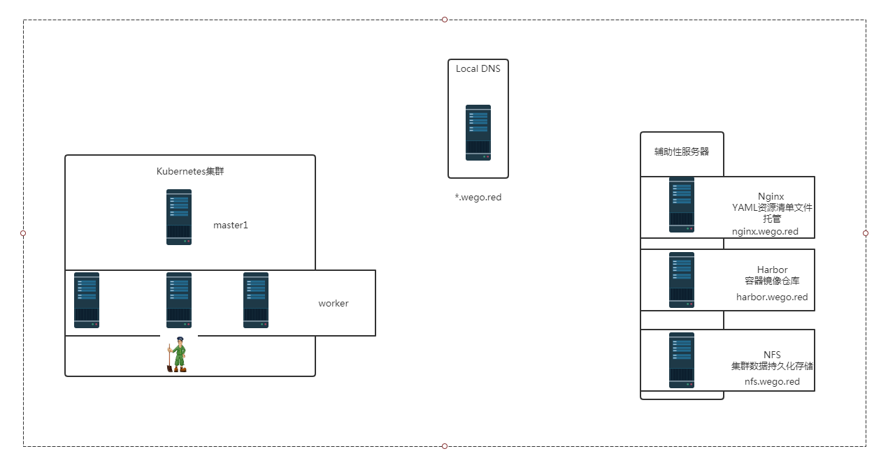
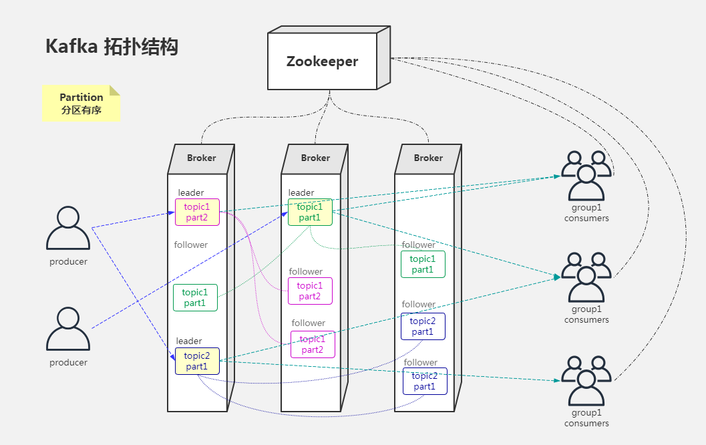
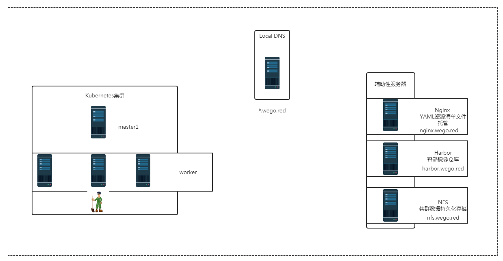
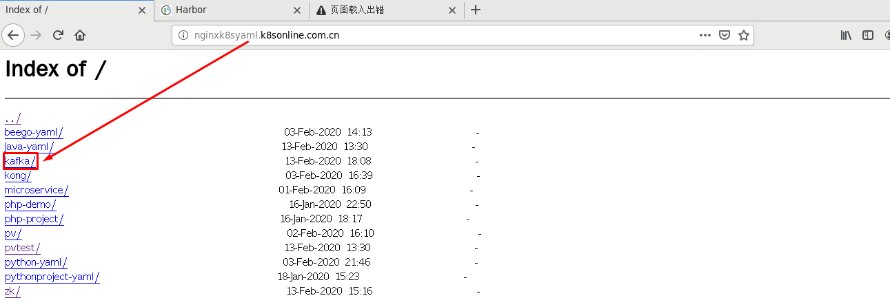
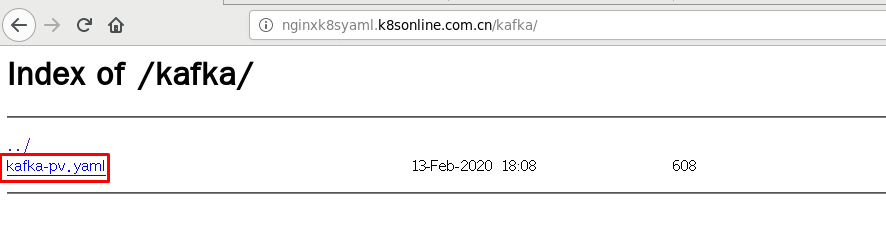
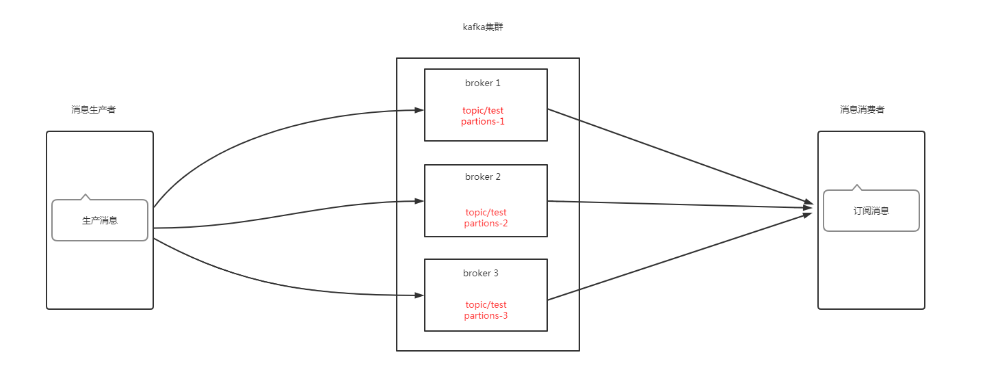

# kubernetes集群 应用实践 kafka部署

# 零.1、环境说明

# 零.2、kafka架构说明

>zookeeper在kafka集群中的作用
>
>一、Broker注册
>
>二、Topic注册
>
>三、Topic Partition选主
>
>四、生产者负载均衡
>
>五、消费者负载均衡

# 一、持久化存储资源准备

## 1.1 创建共享目录

~~~powershell
[root@nfsserver ~]# mkdir -p /vdc/kafka/data1
[root@nfsserver ~]# mkdir -p /vdc/kafka/data2
[root@nfsserver ~]# mkdir -p /vdc/kafka/data3
~~~

## 1.2 验证共享目录

~~~powershell
[root@nfsserver ~]# tree /vdc/kafka
/vdc/kafka
├── data1
├── data2
└── data3

3 directories, 0 files
~~~

## 1.3 共享存储目录

~~~powershell
[root@nfsserver ~]# cat /etc/exports
/vdc/zk/data1   *(rw,sync,no_root_squash)
/vdc/zk/data2   *(rw,sync,no_root_squash)
/vdc/zk/data3   *(rw,sync,no_root_squash)
/vdc/kafka/data1        *(rw,sync,no_root_squash)
/vdc/kafka/data2        *(rw,sync,no_root_squash)
/vdc/kafka/data3        *(rw,sync,no_root_squash)
~~~

~~~powershell
[root@nfsserver ~]# exportfs -a
~~~

~~~powershell
[root@nfsserver ~]# showmount -e 192.168.122.250
Export list for 192.168.122.250:
/vdc/kafka/data3 *
/vdc/kafka/data2 *
/vdc/kafka/data1 *
/vdc/zk/data3    *
/vdc/zk/data2    *
/vdc/zk/data1    *
~~~

# 二、k8s集群中kafka持久化存储PV准备

## 2.1 创建PV资源清单文件

~~~powershell
[root@nginxk8syaml kafka]# cat kafka-pv.yaml
apiVersion: v1
kind: PersistentVolume
metadata:
  name: kafka-data1
spec:
  capacity:
    storage: 3Gi
  accessModes:
    - ReadWriteOnce
  nfs:
    server: nfs.wego.red
    path: /vdc/kafka/data1
---
apiVersion: v1
kind: PersistentVolume
metadata:
  name: kafka-data2
spec:
  capacity:
    storage: 3Gi
  accessModes:
    - ReadWriteOnce
  nfs:
    server: nfs.wego.red
    path: /vdc/kafka/data2
---
apiVersion: v1
kind: PersistentVolume
metadata:
  name: kafka-data3
spec:
  capacity:
    storage: 3Gi
  accessModes:
    - ReadWriteOnce
  nfs:
    server: nfs.wego.red
    path: /vdc/kafka/data3
~~~

## 2.2 定位资源清单文件位置

## 2.3 应用资源清单文件

~~~powershell
[root@master1 ~]# kubectl apply -f http://nginxk8syaml.k8sonline.com.cn/kafka/kafka-pv.yaml
persistentvolume/kafka-data1 created
persistentvolume/kafka-data2 created
persistentvolume/kafka-data3 created
~~~

## 2.4 验证PV创建情况

~~~powershell
[root@master1 ~]# kubectl get pv
NAME                                       CAPACITY   ACCESS MODES   RECLAIM POLICY   STATUS      CLAIM                                            STORAGECLASS          REASON   AGE
kafka-data1                                3Gi        RWO            Retain           Available                                                                                   19s
kafka-data2                                3Gi        RWO            Retain           Available                                                                                   19s
kafka-data3                                3Gi        RWO            Retain           Available                                                                                   19s
~~~

# 三、k8s集群中部署kafka

## 3.1 kafka资源清单文件

~~~powershell
[root@nginxk8syaml kafka]# cat kafka.yaml
---
apiVersion: v1
kind: Service
metadata:
  name: kafka-hs
  namespace: default
  labels:
    app: kafka
spec:
  ports:
  - port: 9093
    name: server
  clusterIP: None
  selector:
    app: kafka
---
apiVersion: policy/v1beta1
kind: PodDisruptionBudget
metadata:
  name: kafka-pdb
  namespace: default
spec:
  selector:
    matchLabels:
      app: kafka
  maxUnavailable: 1
---
apiVersion: apps/v1
kind: StatefulSet
metadata:
  name: kafka
  namespace: default
spec:
  serviceName: kafka-hs
  replicas: 3
  selector:
    matchLabels:
      app: kafka
  podManagementPolicy: Parallel
  updateStrategy:
    type: RollingUpdate
  template:
    metadata:
      labels:
        app: kafka
    spec:
      terminationGracePeriodSeconds: 300
      containers:
      - name: k8skafka
        imagePullPolicy: IfNotPresent
        image: harbor.wego.red/library/kubernetes-kafka:v10.2.1
        resources:
          requests:
            memory: "256Mi"
            cpu: "0.1"
        ports:
        - containerPort: 9093
          name: server
        command:
        - sh
        - -c
        - "exec kafka-server-start.sh /opt/kafka/config/server.properties --override broker.id=${HOSTNAME##*-} \
          --override listeners=PLAINTEXT://:9093 \
          --override zookeeper.connect=zk-cs.default.svc.cluster.local:2181 \
          --override log.dir=/var/lib/kafka \
          --override auto.create.topics.enable=true \
          --override auto.leader.rebalance.enable=true \
          --override background.threads=10 \
          --override compression.type=producer \
          --override delete.topic.enable=false \
          --override leader.imbalance.check.interval.seconds=300 \
          --override leader.imbalance.per.broker.percentage=10 \
          --override log.flush.interval.messages=9223372036854775807 \
          --override log.flush.offset.checkpoint.interval.ms=60000 \
          --override log.flush.scheduler.interval.ms=9223372036854775807 \
          --override log.retention.bytes=-1 \
          --override log.retention.hours=168 \
          --override log.roll.hours=168 \
          --override log.roll.jitter.hours=0 \
          --override log.segment.bytes=1073741824 \
          --override log.segment.delete.delay.ms=60000 \
          --override message.max.bytes=1000012 \
          --override min.insync.replicas=1 \
          --override num.io.threads=8 \
          --override num.network.threads=3 \
          --override num.recovery.threads.per.data.dir=1 \
          --override num.replica.fetchers=1 \
          --override offset.metadata.max.bytes=4096 \
          --override offsets.commit.required.acks=-1 \
          --override offsets.commit.timeout.ms=5000 \
          --override offsets.load.buffer.size=5242880 \
          --override offsets.retention.check.interval.ms=600000 \
          --override offsets.retention.minutes=1440 \
          --override offsets.topic.compression.codec=0 \
          --override offsets.topic.num.partitions=50 \
          --override offsets.topic.replication.factor=3 \
          --override offsets.topic.segment.bytes=104857600 \
          --override queued.max.requests=500 \
          --override quota.consumer.default=9223372036854775807 \
          --override quota.producer.default=9223372036854775807 \
          --override replica.fetch.min.bytes=1 \
          --override replica.fetch.wait.max.ms=500 \
          --override replica.high.watermark.checkpoint.interval.ms=5000 \
          --override replica.lag.time.max.ms=10000 \
          --override replica.socket.receive.buffer.bytes=65536 \
          --override replica.socket.timeout.ms=30000 \
          --override request.timeout.ms=30000 \
          --override socket.receive.buffer.bytes=102400 \
          --override socket.request.max.bytes=104857600 \
          --override socket.send.buffer.bytes=102400 \
          --override unclean.leader.election.enable=true \
          --override zookeeper.session.timeout.ms=6000 \
          --override zookeeper.set.acl=false \
          --override broker.id.generation.enable=true \
          --override connections.max.idle.ms=600000 \
          --override controlled.shutdown.enable=true \
          --override controlled.shutdown.max.retries=3 \
          --override controlled.shutdown.retry.backoff.ms=5000 \
          --override controller.socket.timeout.ms=30000 \
          --override default.replication.factor=1 \
          --override fetch.purgatory.purge.interval.requests=1000 \
          --override group.max.session.timeout.ms=300000 \
          --override group.min.session.timeout.ms=6000 \
          --override inter.broker.protocol.version=0.10.2-IV0 \
          --override log.cleaner.backoff.ms=15000 \
          --override log.cleaner.dedupe.buffer.size=134217728 \
          --override log.cleaner.delete.retention.ms=86400000 \
          --override log.cleaner.enable=true \
          --override log.cleaner.io.buffer.load.factor=0.9 \
          --override log.cleaner.io.buffer.size=524288 \
          --override log.cleaner.io.max.bytes.per.second=1.7976931348623157E308 \
          --override log.cleaner.min.cleanable.ratio=0.5 \
          --override log.cleaner.min.compaction.lag.ms=0 \
          --override log.cleaner.threads=1 \
          --override log.cleanup.policy=delete \
          --override log.index.interval.bytes=4096 \
          --override log.index.size.max.bytes=10485760 \
          --override log.message.timestamp.difference.max.ms=9223372036854775807 \
          --override log.message.timestamp.type=CreateTime \
          --override log.preallocate=false \
          --override log.retention.check.interval.ms=300000 \
          --override max.connections.per.ip=2147483647 \
          --override num.partitions=3 \
          --override producer.purgatory.purge.interval.requests=1000 \
          --override replica.fetch.backoff.ms=1000 \
          --override replica.fetch.max.bytes=1048576 \
          --override replica.fetch.response.max.bytes=10485760 \
          --override reserved.broker.max.id=1000 "
        env:
        - name: KAFKA_HEAP_OPTS
          value : "-Xmx256M -Xms256M"
        - name: KAFKA_OPTS
          value: "-Dlogging.level=INFO"
        volumeMounts:
        - name: datadir
          mountPath: /var/lib/kafka
        readinessProbe:
          exec:
           command:
            - sh
            - -c
            - "/opt/kafka/bin/kafka-broker-api-versions.sh --bootstrap-server=localhost:9093"
  volumeClaimTemplates:
  - metadata:
      name: datadir
    spec:
      accessModes: [ "ReadWriteOnce" ]
      resources:
        requests:
          storage: 3Gi
~~~

### 3.1.1 修改容器镜像

> 在课程目录中有相关镜像，直接导入harbor主机并上传到harbor仓库

~~~powershell
修改容器镜像
containers:
      - name: k8skafka
        imagePullPolicy: IfNotPresent
        image: harbor.wego.red/library/kubernetes-kafka:v10.2.1
~~~

### 3.1.2 修改zookeeper连接地址

~~~powershell
修改zookeeper.connect连接地址，使用k8s集群内域名，需要DNS服务。
command:
        - sh
        - -c
        - "exec kafka-server-start.sh /opt/kafka/config/server.properties --override broker.id=${HOSTNAME##*-} \
          --override listeners=PLAINTEXT://:9093 \
          --override zookeeper.connect=zk-cs.default.svc.cluster.local:2181 \
~~~

## 3.2 应用kafka资源清单文件

~~~powershell
[root@master1 ~]# kubectl apply  -f http://nginx.wego.red/kafka/kafka.yaml
service/kafka-hs created
poddisruptionbudget.policy/kafka-pdb created
statefulset.apps/kafka created
~~~

## 3.3 验证kafka创建情况

~~~powershell
[root@master1 ~]# kubectl get pods
NAME                                      READY   STATUS    RESTARTS   AGE
busybox-pod                               1/1     Running   397        28d
kafka-0                                   1/1     Running   0          106s
kafka-1                                   1/1     Running   0          106s
kafka-2                                   1/1     Running   0          106s
nfs-client-provisioner-5786f95795-54v4s   1/1     Running   4          9d
zok-0                                     1/1     Running   2          3h38m
zok-1                                     1/1     Running   1          3h38m
zok-2                                     1/1     Running   1          3h37m
~~~

# 四、通过zookeeper查看broker

~~~powershell
[root@master1 ~]# kubectl get pods
NAME                                      READY   STATUS    RESTARTS   AGE
zok-0                                     1/1     Running   2          5h4m
zok-1                                     1/1     Running   1          5h3m
zok-2                                     1/1     Running   1          5h3m
~~~

~~~powershell
[root@master1 ~]# kubectl exec -it zok-1 -n default bash
root@zok-1:/# zkCli.sh
Connecting to localhost:2181
Welcome to ZooKeeper!

[zk: localhost:2181(CONNECTING) 0] ls /
[cluster, controller, controller_epoch, brokers, zookeeper, admin, isr_change_notification, consumers, hello, config]

[zk: localhost:2181(CONNECTED) 1] ls /brokers
[ids, topics, seqid]
[zk: localhost:2181(CONNECTED) 2] ls /brokers/ids
[0, 1, 2]
[zk: localhost:2181(CONNECTED) 3] get /brokers/ids/0
{"listener_security_protocol_map":{"PLAINTEXT":"PLAINTEXT"},"endpoints":["PLAINTEXT://kafka-0.kafka-hs.default.svc.cluster.local:9093"],"jmx_port":-1,"host":"kafka-0.kafka-hs.default.svc.cluster.local","timestamp":"1581591232561","port":9093,"version":4}
cZxid = 0x20000001a
ctime = Thu Feb 13 10:53:52 UTC 2020
mZxid = 0x20000001a
mtime = Thu Feb 13 10:53:52 UTC 2020
pZxid = 0x20000001a
cversion = 0
dataVersion = 0
aclVersion = 0
ephemeralOwner = 0x1703e20e92c0000
dataLength = 254
numChildren = 0
[zk: localhost:2181(CONNECTED) 4] get /brokers/ids/1
{"listener_security_protocol_map":{"PLAINTEXT":"PLAINTEXT"},"endpoints":["PLAINTEXT://kafka-1.kafka-hs.default.svc.cluster.local:9093"],"jmx_port":-1,"host":"kafka-1.kafka-hs.default.svc.cluster.local","timestamp":"1581591238213","port":9093,"version":4}
cZxid = 0x20000001e
ctime = Thu Feb 13 10:53:58 UTC 2020
mZxid = 0x20000001e
mtime = Thu Feb 13 10:53:58 UTC 2020
pZxid = 0x20000001e
cversion = 0
dataVersion = 0
aclVersion = 0
ephemeralOwner = 0x1703e20e92c0001
dataLength = 254
numChildren = 0
[zk: localhost:2181(CONNECTED) 5] get /brokers/ids/2
{"listener_security_protocol_map":{"PLAINTEXT":"PLAINTEXT"},"endpoints":["PLAINTEXT://kafka-2.kafka-hs.default.svc.cluster.local:9093"],"jmx_port":-1,"host":"kafka-2.kafka-hs.default.svc.cluster.local","timestamp":"1581591242262","port":9093,"version":4}
cZxid = 0x200000022
ctime = Thu Feb 13 10:54:02 UTC 2020
mZxid = 0x200000022
mtime = Thu Feb 13 10:54:02 UTC 2020
pZxid = 0x200000022
cversion = 0
dataVersion = 0
aclVersion = 0
ephemeralOwner = 0x2703e207a150000
dataLength = 254
numChildren = 0
~~~

# 五、kafka应用操作测试

## 5.1 查看pod

~~~powershell
[root@master1 ~]# kubectl get pods
NAME                                      READY   STATUS    RESTARTS   AGE
busybox-pod                               1/1     Running   398        28d
kafka-0                                   1/1     Running   0          87m
kafka-1                                   1/1     Running   0          87m
kafka-2                                   1/1     Running   0          87m

~~~

## 5.2 进入kafka pod

~~~powershell
[root@master1 ~]# kubectl exec -it kafka-0 -n default bash
# pwd
/
# ls
KEYS  boot  etc   lib    media  opt   root  sbin  sys  usr
bin   dev   home  lib64  mnt    proc  run   srv   tmp  var
# cd /opt/kafka/bin
# pwd
/opt/kafka/bin
# ls
connect-distributed.sh               kafka-replica-verification.sh
connect-standalone.sh                kafka-run-class.sh
kafka-acls.sh                        kafka-server-start.sh
kafka-broker-api-versions.sh         kafka-server-stop.sh
kafka-configs.sh                     kafka-simple-consumer-shell.sh
kafka-console-consumer.sh            kafka-streams-application-reset.sh
kafka-console-producer.sh            kafka-topics.sh
kafka-consumer-groups.sh             kafka-verifiable-consumer.sh
kafka-consumer-offset-checker.sh     kafka-verifiable-producer.sh
kafka-consumer-perf-test.sh          windows
kafka-mirror-maker.sh                zookeeper-security-migration.sh
kafka-preferred-replica-election.sh  zookeeper-server-start.sh
kafka-producer-perf-test.sh          zookeeper-server-stop.sh
kafka-reassign-partitions.sh         zookeeper-shell.sh
kafka-replay-log-producer.sh
~~~

## 5.3 创建test topic

~~~powershell
root@kafka-0:/opt/kafka/bin# ./kafka-topics.sh --create --topic test --zookeeper zk-cs.default.svc.cluster.local:2181    --partitions 3 --replication-factor 3

~~~

~~~powershell
输出
Created topic "test".
~~~

## 5.4 查看  topic

~~~powershell
root@kafka-0:/opt/kafka/bin# ./kafka-topics.sh --zookeeper zk-cs.default.svc.cluster.local:2181 --list
~~~

~~~powershell
输出
test
~~~

## 5.5 模拟生产者

> 终端1

~~~powershell
root@kafka-0:/opt/kafka/bin# ./kafka-console-producer.sh --topic test --broker-list kafka-0.kafka-hs.default.svc.cluster.local:9093,kafka-1.kafka-hs.default.svc.cluster.local:9093,kafka-2.kafka-hs.default.svc.cluster.local:9093
this is a test message
hello world

CTRL+C即可退出
~~~

## 5.6 模拟消费者

> 终端2

~~~powershell
[root@master1 ~]# kubectl exec -it kafka-0 bash
root@kafka-0:/# cd /opt/kafka/bin
root@kafka-0:/opt/kafka/bin# ./kafka-console-consumer.sh --topic test --zookeeper zk-cs.default.svc.cluster.local:2181 --from-beginning
Using the ConsoleConsumer with old consumer is deprecated and will be removed in a future major release. Consider using the new consumer by passing [bootstrap-server] instead of [zookeeper].
this is a test message
hello world
~~~

# 六、集群内业务系统访问kafka

~~~powershell
broker-list:

kafka-0.kafka-hs.default.svc.cluster.local:9093

kafka-1.kafka-hs.default.svc.cluster.local:9093

kafka-2.kafka-hs.default.svc.cluster.local:9093
~~~

