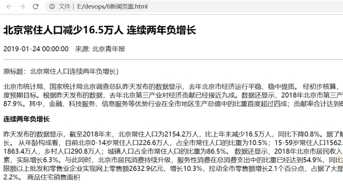
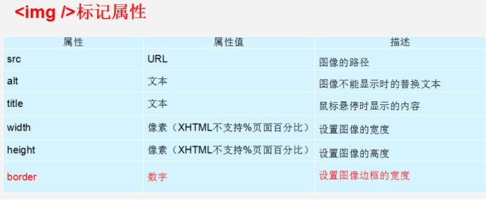
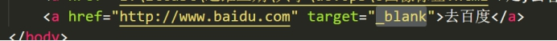
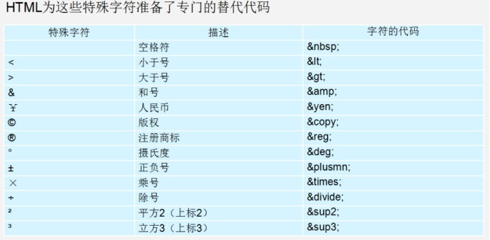
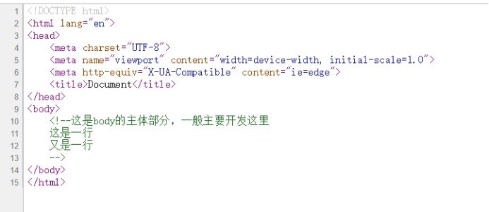
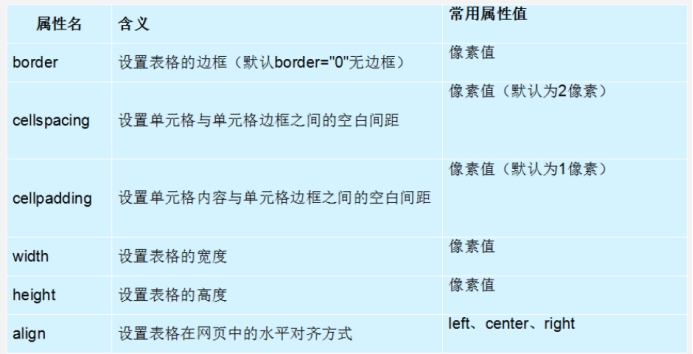
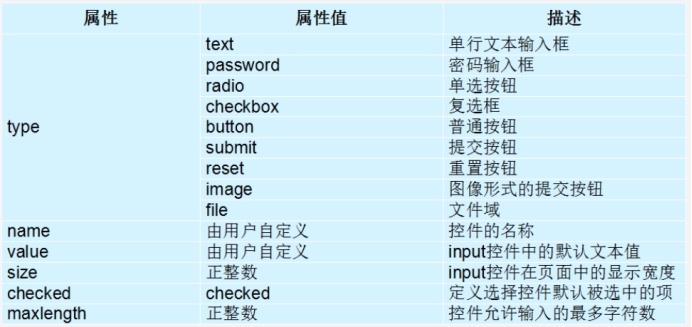
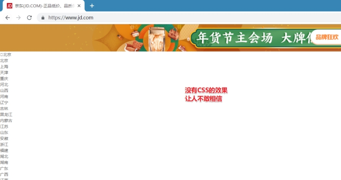

# Web开发基础之HTML+CSS

> **学习目标和内容**
>
> 1、能够描述Web开发需要的技术点
>
> 2、能够描述HTML的作用
>
> 3、能够实现一个列表
>
> 4、能够实现创建一个表格
>
> 5、能够实现一个表单
>
> 6、能够描述CSS的作用
>
> 7、能够使用选择器获取到标签
>
> 8、能够使用CSS设置字体的颜色和大小

# 一、Web开发相关介绍

## 1、为什么要学习Web开发

运维工程师

​	初级工程师：负责维护基础环境（装系统、处理服务器问题、实施、查看监控）

​	中级工程师：维护大型集群、部署集群架构

​	==高级工程师：现有繁琐的工作进行页面化的开发，简化运维工作（当有1000个服务器的时候，用系统管理）==

==资产管理系统==

资产管理系统，简称 ==cmdb==。

​	开源的资产管理系统 ==jumpserver==，不能完成100%公司的业务

​	堡垒机，为了保障网络和数据不受来自外部和内部用户的入侵和破坏，而运用各种技术手段实时收集和监控网络环境中每一个组成部分的系统状态、安全事件、网络活动，以便集中报警、及时处理及审计定责。

​	高级工程师需要开发类似的系统，满足自己的业务需求

演示相关demo项目

## 2、Web开发学习什么

HTML  超文本标记文本

CSS    层叠样式表

JavaScript   动态脚本语言

DOM   document

jQuery   javaScript 库

bootstrap  html+css+js  前端模版库

ajax  一组技术  异步+JavaScript+xml

结合学习一门后端语言（java、php、==python==、ruby[howbrew]~~~）

## 3、相关学习资料

MDN： <https://developer.mozilla.org/zh-CN/docs/Learn>

菜鸟教程：<http://www.runoob.com/>

# 二、Web开发基础之HTML

能够使用HTML开发页面

## 1、前端语言介绍

HTML 提供页面上的内容（结构和内容）

CSS 对网页进行美化（样式）

JavaScript对网页上的内容进行控制（控制）

## 2、开发工具准备

常用开发工具：

轻量文本型：==VSCode==、Sublime

重量IDE型：WebStrom

## 3、初始HTML

什么是HTML

HTML（英文 Hyper Text Markup Language 的缩写）中文译为==超文本标记语言==

通过HTML标签对网页中的文本、图片、声音等内容进行描述

打开网络上的一个页面，通过浏览器调试工具查看源代码

HTML的格式

   基本格式

```html
<html>
<head>
    <title>标题显示</title>
</head>
<body>
</body>
</html>
```

html标签：所有html标签的根节点

head标签：描述网页的一些信息，里面的内容不会被显示呈现

title标签：网页的标题

==body==标签：页面的主题部分，主要编写开发的内容

Tip:通过编辑器快速创建html的页面结构

在vscode中新建一个html文件后，输入！按tab键，可以快速生成一个HTML5标准的一个页面结构。

## 4、HTML标签分类

**①双标签**

语法格式：

```html
<标签名>内容</标签名>
```

<标签名> 在整个标签的最前面，称为“开始标签(start tag)”

</标签名> 在整个标签的最后面，称为“结束标签(end tag)”

结束标签只是比开始标签，在前面多了一个关闭符“/”。

例如：

```html
<body>我是页面的主体内容</body>
```

**②单标签**

语法格式：

```html
<标签名/>
```

单标签也称空标签，指用一个标签符号即可完整地描述某个功能的标签。

例如：
```html
<br /> 换行标签
<hr /> 水平线 横线标签
```
## 5、字符集

```html
<meta charset=“UTF-8”>
```

==UTF-8== 是目前最常用的字符集编码方式，常用的字符集编码方式还有 gbk 和 gb2312

GB2312 简单中文  包括6763个汉字

BIG5   繁体中文 港澳台等用

GBK 包含全部中文字符    是 GB2312 的扩展，加入对繁体字的支持，兼容 GB2312

UTF-8 则包含全世界所有国家需要用到的字符

Tip：以后我们==统一使用UTF-8字符集==就可以了，避免出现字符集不统一而引起乱码的情况。

## 6、常用HTML基础标签

### 6.1、标题标签

单词缩写：head 头部标题

语法：
```html
<h1>这是h1标签</h1>
<h2>这是h2标签</h2>
<h3>这是h3标签</h3>
<h4>这是h4标签</h4>
<h5>这是h5标签</h5>
<h6>这是h6标签</h6>
```
### 6.2、段落标签

单词缩写： paragraph  段落

使用段落标签，可以使网页中的文本文字，呈现出一个一个段落的格式。

语法：
```html
<p>段落内容</p>
```
### 6.3、水平线标签

单词缩写： horizontal  横线

语法：
```html
<hr />是单标签
```
### 6.4、换行标签

单词缩写：  break   打断 ,换行

在HTML中，默认换行是需要在浏览器窗口的最右端才会自动换行，这样在每个设备中呈现的效果不一致。如果需要进行某段文本的强制换行，就需要使用到换行标签。

语法：
```html
<br />
```
练习：实现一个简单新闻页面



### 6.5、div span标签

盒子模型中的两种布局方式：

div   division  的缩写   分割， 分区的意思  其实有很多div 来组合网页。 块级元素

span  跨度，跨距；范围，行内元素

语法：
```html
<div>这是头部</div>  
<span>今日价格</span>
```
### 6.6、标签属性

在使用HTML制作网页的时候，如果想让标签提供更多的信息，可以使用标签的一些属性进行设置。

语法：

```html
<标签名 属性1="属性值1" 属性2="属性值2" …> 内容 </标签名>
```

例：
```html
<hr width="200" align="left" />
```
width  属性，值 200   控制宽度

align 属性，值 left     控制横向对其方式

### 6.7、图片标签img

单词缩写：image 图像

语法：
```html

```
通过src属性，进行设置图像文件的路径和文件名。是img标签的必须属性。



### 6.8、链接标签

单词缩写：anchor  锚

语法：
```html
<a href="跳转目标">文本或图像</a>
```
href 属性  指定需要链接到的目标url地址。

url地址，可以使用绝对路径和相对路径的方式。包括协议等。

Tip:

href  可以使用”#”，表示为空连接，暂时没有跳转链接的地址。



新打开一个页面标签

### 6.9、特殊字符标签

html中一些标签，具有特殊含义，会被浏览器直接解析。如果需要输出这些标签，需要使用到转义、替代语法。



### 6.10注释标签

注释标签，可以给HTML文档中添加一些便于阅读和理解的文字，并且此标签中的内容，不会直接展示出来，只有通过源代码的方式才可以看到。

语法：
```html
<!-- 注释语句 -->
```


## 7、列表标签ul li


语法：
```html
<ul>
  <li>列表项1</li>
  <li>列表项2</li>
  <li>列表项3</li>
  ......
</ul>
```
Tip:

①在<ul></ul>标签中，只能嵌套<li></li>标签，其他标签的直接嵌套是语法是不被允许的。

②<li></li>标签中作为一个容器，可以容纳其他的标签元素。

③无序列表具有默认样式，可以CSS进行修饰。

## 8、表格table

通常需要使用表格的方式展示数据，使数据更加规则的呈现出来。

### 8.1、创建表格

语法：
```html
<table>
  <tr>
    <td>单元格内的文字</td>
    ...
  </tr>
  ...
</table>
```
table 定义一个表格

tr 定义表格中的一行，必须嵌套在table标签中，有几对tr标签，就代表有几行表格。

td 定义表格中的单元格，必须嵌套在tr标签中，一对tr标签中有几对td标签，就代表一行中有几个单元格。td中可以作为容器，包含其他标签元素。

### 8.2、表格属性




Tip:

①可以使用th标签设置表头

②之后可以使用CSS修饰表格的样式

## 9、表单

### 9.1、表单介绍

在HTML中，form标签用来定义一个表单。用来实现用户的相关信息的收集和传递，和后端进行交互。form中的所有内容都会被提交给服务器。

语法：
```html
<form action="url地址" method="提交方式">
  各种表单控件
</form>
```
常用属性:

action  值为提交到后端接收的URL地址

method 设置表单的提交方式   值为get或者post

### 9.2、表单控件组成

表单中的提供了多种表单空间，单行文本输入框、密码输入框、复选框、提交按钮、重置按钮等。

### 9.3、input控件（重点）

input控件为表单中，最常使用的，也是需要重点需要掌握的。基本标签属性为type属性，用来定义不同的控件类型。

其他常见属性：



### 9.4、textarea控件（文本域）

当需要输入大量信息的时候，就可以使用textarea标签。实现多行文本的输入框。

语法：
```html
<textarea cols="每行中的字符数" rows="显示的行数">
  文本内容
</textarea>
```
### 9.5、select控件（下拉菜单）

select控件，可以给用户提供一些常见选项。

语法：
```html
<select>
  <option>选项1</option
  <option>选项2</option>
  <option>选项3</option>
  ...
</select>
```
Tip:

select标签中，必须包含一个option标签。

在option标签中，可以定义selected=“selected”,设置当前值为默认选项。

### 9.6、label标签

label标签为input元素的定义标注（标签）

可以用来绑定一个表单元素，当点击label标签时，被绑定的表单元素就会获得输入焦点。

语法：

```html
<label for="male">Male</label>
<input type="radio" name="sex" id="male" value="male">
```

# 三、Web开发基础之CSS

## 1、CSS的介绍

### 1.1 、CSS的作用




### 1.2 、什么是CSS

CSS(Cascading Style Sheets)，通常称为 CSS 样式表或层叠样式表（级联样式表）

主要用于设置 HTML 页面中的文本内容（字体、大小、对齐方式等）、盒子的外形（宽高、边框样式、边距等）以及版面的布局等外观显示样式

以 HTML 为基础，提供了丰富的功能，如字体、颜色、背景的控制及整体排版等

## 2、CSS的定义位置和方式

### 1.1、行内样式（内联样式）

行内样式，是通过标签的style属性来设置元素的样式。

语法：
```html
<标签名 style="属性1:属性值1; 属性2:属性值2; 属性3:属性值3;"> 内容 </标签名>
```
style是标签的属性，任何HTML标签都拥有style属性，用来设置行内样式。

### 1.2、内嵌样式

内嵌式是将CSS代码集中写在HTML文档的head头部标签中，并且用style标签定义。
```html
<head>
  <style type="text/CSS">
      选择器 {属性1:属性值1; 属性2:属性值2; 属性3:属性值3;}
  </style>
</head>
```
Tip：

①style标签一般位于head头标签中，实际可以放到HTML文档中的任何地方。

②type=“text/css”属性，可以省略，当然加上也更加规范。

### 1.3、外部样式表（引入文件）

外部样式表是将所有的样式，存放到一个或者多个以.css结尾的文件中。通过link标签将外部样式表文件链接到HTML文档中。

语法：
```html
<head>
  <link href="CSS文件的路径" type="text/CSS" rel="stylesheet" />
</head>
```
href：定义链接引入的样式表文件的URL，相对路径和绝对路径都可以。

type：定义链接文档的类型，“text/CSS”表示链接的外部文件是CSS样式表

rel：定义当前文档与被链接文档之间的关系，在这里需要指定为 "stylesheet"，表示被链接的文档是一个样式表文件

总结：

|样式表|优点|缺点|使用情况|控制范围|
|-|-|-|-|-|
|行内样式表|书写方便| 没有实现样式和结构相分离|较少|控制一个标签（少）|
|内部样式表|部分结构和样式相分离|没有彻底分离|较多|控制一个页面（中）|
|外部样式表|完全实现结构和样式相分离|需要引入|最多，强烈推荐|控制整个站点（多）|

**优先级：**

==行内>外部=内嵌==

## 3、CSS的选择器

在HTML中，想要通过CSS样式作用于标签，首先需要找到此个(类)标签。在CSS中，可以通过选择器(选择符)来找到。

### 3.1、标签选择器

标签选择器是指通过==HTML标签的名称==作为选择器，为页面中以这类标签名称定义的标签设置统一的CSS样式。

语法：
```html
标签名 {属性1:属性值1; 属性2:属性值2; 属性3:属性值3; }
```
### 3.2、id选择器

id 选择器可以为标有特定 id 的 HTML 元素指定特定的样式。

语法：
```html
#id名 {属性1:属性值1; 属性2:属性值2; 属性3:属性值3; }
```
Tip:

①id名称即为HTML标签中id属性的值

②元素的id值是唯一的，只能在文档中作用于某一个具体的元素

### 3.3、类选择器

class 选择器用于描述一组元素的样式，class 选择器有别于id选择器，class可以在多个元素中使用。

语法：

.类名 {属性1:属性值1; 属性2:属性值2; 属性3:属性值3; }

Tip:

id选择器和类class类选择器的区别：

①class选择器可以多次重复使用

②id选择器 唯一标识只能使用一次，不得重复

也就是说，在使用次数上的区别。在同一个HTML文档中，不允许出现多个标签中，id属性值一样的情况。

**Tip:选择器的优先级**

==id > class > 标签==

### 3.4、多类名选择器

可以给标签指定多个类名，从而达到更多的选择目的。
```html
<div class="font14 colorred">安其拉</div>
```
> ==Tip：组合选择器==
>
> <https://www.runoob.com/css/css-combinators.html>
>
> 在CSS3中提供了四种组合方式：
>
> ①后代选择器（以空格分隔）
>
> 后代选择器用于选取某元素的后代元素。
>
> 语法：
> ```css
> div p
> {
>  background-color:yellow;
> }
> ```
> ②子元素选择器（以大于号分隔）
>
> 与后代选择器相比，子元素选择器（Child selectors）只能选择作为某元素子元素的元素。
> ```css
> div>p
> {
>  background-color:yellow;
> }
> ```
> ③相邻兄弟选择器（以加号分隔）
> 相邻兄弟选择器（Adjacent sibling selector）可选择紧接在另一元素后的元素，且二者有相同父元素。
> 如果需要选择紧接在另一个元素后的元素，而且二者有相同的父元素，可以使用相邻兄弟选择器（Adjacent sibling > selector）。
>
> ```css
> div+p
> {
>  background-color:yellow;
> }
> ```
> ④普通兄弟选择器（以破折号分隔）
>
> 后续兄弟选择器选取所有指定元素之后的相邻兄弟元素。
> ```css
> div~p
> {
>  background-color:yellow;
> }
> ```
## 4、CSS的基本样式属性

### 4.1、CSS Fonts(字体)

font-size  字体大小，单位一般常用px(像素)

font-family 字体样式   微软雅黑   宋体  楷体  

### 4.2、CSS Text(文本)

color  文本颜色

设置方式，以下三种：

①十六进制值  如：#FF0000

②RGB值     如：RGB(255,0,0)

③颜色的名称  如：red

text-align 水平对齐方式

设置方式，以下三种:

①left 左对齐(默认)

②right 右对齐

③center 居中对齐

text-decoration 文本修饰

| 值           | 描述                                          |
| ------------ | --------------------------------------------- |
| none         | 默认。定义标准的文本。                        |
| underline    | 定义文本下的一条线。下划线 也是我们链接自带的 |
| overline     | 定义文本上的一条线。                          |
| line-through | 定义穿过文本下的一条线。                      |

### 4.3、显示隐藏

display:none可以隐藏某个元素，且隐藏的元素不会占用任何空间。也就是说，该元素不但被隐藏了，而且该元素原本占用的空间也会从页面布局中消失。

语法：
```css
h1{display:none;}
```
### 4.4、盒子大小

width 设置盒子的宽度，单位：px  百分比

height 设置盒子的宽度，单位：px 百分比

语法：
```css
div{
    width:400px;
    height:200px;
}
```
### 4.5、boder(盒子边框)

<http://www.runoob.com/css/css-border.html>

语法：

> border : border-width || border-style || border-color

**border-style常设置边框的风格**

> \- none：没有边框即忽略所有边框的宽度（默认值）
>
> \- solid：边框为单实线(最为常用的)
>
> \- dashed：边框为虚线
>
> \- dotted：边框为点线
>
> \- double：边框为双实线
>

### 4.6、backgroud(背景)

**①背景颜色**

```css
body {background-color:red;}
```

**②背景图像**

```css
body {background-image:url('bg.jpg');}
```