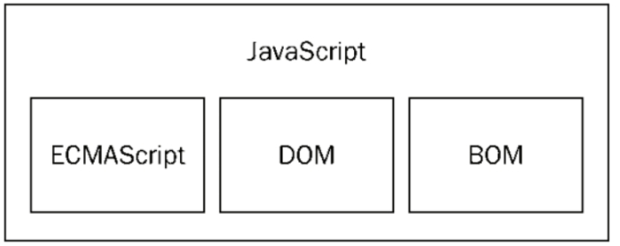
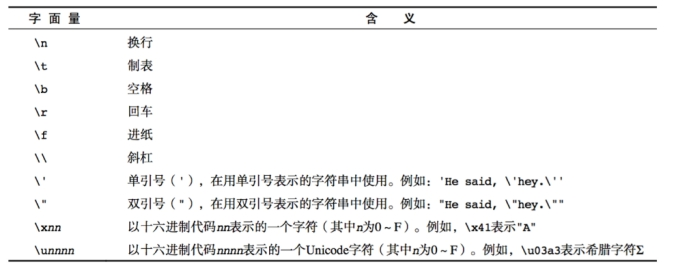
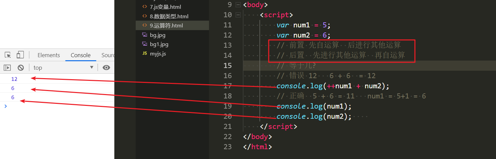
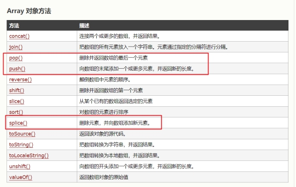
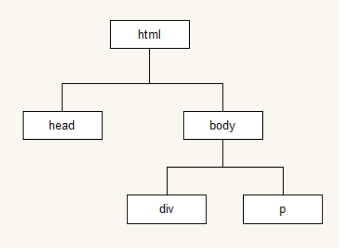

# Web开发基础之JavaScript

**学习目标和内容**

> 1、能够描述Javascript的作用
>
> 2、能够使用分支结构if语句逻辑判断
>
> 3、能够使用其中一种循环语句
>
> 4、能够定义javaScript中的函数
>
> 5、能够定义javaScript中的对象
>
> 6、能够描述DOM的作用
>
> 7、能够通过DOM操作HTML标签元素及其属性
>
> 8、能够实现HTML元素事件的注册

# 一、JavaScript简介

## 1、JavaScript的强大

<http://naotu.baidu.com/>

## 2、JavaScript是什么

JavaScript是一种运行在客户端(浏览器) 的编程语言，用来给网页添加动态功能。

JavaScript的历史：<http://www.w3school.com.cn/js/pro_js_history.asp>

## 3、JavaScript的作用

**①最初目的**

为了处理表单的验证操作

**②现在广泛的应用场景**

1. 网页特效
2. 服务端开发(Node.js)
3. 命令行工具(Node.js)
4. 桌面程序(Electron)
5. App(Cordova)
6. 游戏开发

## 4、JavaScript和HTML、css的区别

HTML：提供网页的结构和内容

CSS:修饰和美化内容

JavaScript：控制页面内容，增加页面动态效果

## 5、JavaScript的组成

 

**ECMAScript - JavaScript的核心** 

ECMAScript 是 JavaScript 的核心，描述了语言的基本语法和数据类型，ECMAScript是一套标准，定义了一种语言的标准与具体实现无关(就是 JavaScript 的语法规范)

**BOM - 浏览器对象模型**

一套操作浏览器功能的 API

通过BOM可以操作浏览器窗口，比如：弹出框、控制浏览器跳转、获取分辨率等

**DOM - 文档对象模型**

一套操作页面元素的 API

DOM 可以把 HTML看做是文档树，通过 DOM 提供的 API 可以对树上的节点进行操作

## 6、JavaScript的书写位置

JavaScript书写位置和CSS类似(行内样式、嵌入样式、外部样式)

**①写在行内**

```html
<input type="button" value="按钮" onclick="alert('Hello World')" />
```

**②写在script标签中**

```html
<head>
  <script>
    alert('Hello World!');
  </script>
</head>
```

**③写在外部js文件中，在页面引入使用**

```html
<script src="main.js"></script>
```
> Tip：
>
> ①引入外部js文件的script标签中，不可以写javaScript代码，在</body>之前
>
> ②css在头部引入，js文件在底部引入
>

# 二、JavaScript基本语法

## 1、变量

### 1.1、变量的定义

在js中使用var关键字定义变量

**①变量的语法**

```js
var userName = 'linux';
var age = 18;
```
**②同时声明多个变量**

```js
var age, name, sex;
age = 18;
name = 'centos';
```
**③同时声明多个变量并赋值**

```js
var age = 23, name = 'shell';
```
### 1.2、变量的命名规则和规范

规则 - 必须遵守的，不遵守会报错

> - 由字母、数字、下划线、$符号组成，不能以数字开头
>
> - 不能是关键字和保留字，例如：for、while。
>
> - 区分大小写
>

规范 - 建议遵守的，不遵守不会报错

> - 变量名必须有意义
>
> - 遵守驼峰命名法。首字母小写，后面单词的首字母需要大写。例如：userName、userPassword
>

## 2、数据类型

常用的数据类型为：Number、String、Boolean

### 2.1、Number类型

数字字面量：数值的固定值的表示方法

100 183.5

### 2.2、String类型
字符串是用引号括起来的一段内容
‘linux’’centos’ ‘sa’ ‘devops’
javaScript中的字符串，单双引号都可以使用，推荐使用单引号
转义字符
 
**字符串长度**
length属性可以用来获取字符串的长度

```js
var str = “我是一个运维人员”
console.log(str.length);
```
**字符串的拼接**
多个字符串，可以通过+符号进行拼接

```js
console.log(‘linux’+’centos’);
```
### 2.3、Boolean类型
字面量：true和false

Tip:

> typeof(变量)查看数据的类型
>
> Number(字符串类型)  字符串转为数字类型

## 3、注释
注释作用：

1、解释说明

2、注释后的代码不会被执行

**①单行注释**

```js
//这是一个变量
var name = ‘linux’;
```
**②多行注释**
```js
/*
var name = ‘linux’;
var age = 18;
var job = ‘server’;
*/
```

## 4、运算符

运算符(operator)，非常类似于数学中的运算符

### 4.1、算术运算符

> \+  加
>
> \-   减
>
> \*   乘
>
> /   除
>
> % 取余    做除法运算，直到不能够再被除数除的情况下，剩下的数就是余数
>

### 4.2、自增自减运算符

一元运算符：只有一个操作数的运算符，自增自减运算符属于一元运算符。

++ 自身+1

--  自身-1

案例演示：前置++和后置++的区别



### 4.3、逻辑运算符

&& 与  两个操作数同时为true，结果为true，否则都是false   一损俱损   同时满足多个条件

|| 或  两个操作数有一个为true，结果为true，否则为false    满足其中一个条件即可

!  非  取反   不满足这个条件

### 4.4、比较运算符

<  >  >=  <=  == != =\== !\==

\==与===的区别：

==只进行值得比较

===类型和值同时相等，则相等

### 4.5、赋值运算符

=   

+=   -=   *=   /=   %=

先自运算  后赋值

```js
var num = 6;
num += 6;  //相当于num = num+6   猜猜等于多少？
num /=2;   //相当于 num = num/2   猜猜等于多少？
```

## 5、分支结构
分支语句，一般用来判断不同的多种情况，并在代码块中进行对应处理。
### 5.1、if语句
**①单分支语句(if)**
语法：

```js
if (/* 条件表达式 */) {
  // 执行语句
}
```
**②双分支语句(if ...else)**

语法：

```js
if (/* 条件表达式 */){
  // 成立执行语句
} else {
  // 否则执行语句
}
```

**③多分支语句(if...elseif...else)**

语法：

```js
if (/* 条件1 */){
  // 成立执行语句
} else if (/* 条件2 */){
  // 成立执行语句
} else if (/* 条件3 */){
  // 成立执行语句
} else {
  // 最后默认执行语句
}
```

案例：求两个数的最大值

​      判断是奇数还是偶数

### 5.2、switch语句

语法：

```js
switch(n)
{
case 1:
  //执行代码块 1
  break
case 2:
  //执行代码块 2
  break;
default:
  //n 与 case 1 和 case 2 不同时执行的代码
}
```

案例：今天是星期几？

day=new Date().getDay()

## 6、循环结构

 JavaScript 中，循环语句有三种，for、while、do..while循环

while和do...while一般用来解决无法确定循环次数的情况。一般常见固定的次数，使用for较为常见。

### 6.1、for语句

语法：

```js
for (初始化表达式1; 判断表达式2; 自增表达式3) {
  // 循环体4
}
```

### 6.2、while语句

```js
// 当循环条件为true时，执行循环体，
// 当循环条件为false时，结束循环。
while (循环条件) {
  //循环体
}
```

### 6.3、do...while语句

语法：

```js
do {
  // 循环体;
} while (循环条件);
```

> Tip:
>
> do...while和while使用上非常像，区别在于do...while不管条件是否成立，会执行一次操作。也就是先操作后判断。
>

### 6.4、continue和break关键字

break:立即跳出整个循环，即循环结束，开始执行循环后面的内容（直接跳到大括号）

continue:立即跳出当前循环，继续下一次循环（跳到i++的地方)

## 7、数组

数组是一个有序的列表，可以在数组中存放任意数据，并且数组的长度可以动态调整。

### 7.1、数组的定义

语法：

```js
//创建一个空数组
var arr = [];
//创建一个数字的数组
var arr1 = [1,2,3,4,5];
//创建包含字符串的数组
var arr2 = [‘linux’,’centos’,’redhat’];
```

Tip：

> // 可以通过数组的length属性获取数组的长度
>
> console.log(arr3.length);
>
> // 可以设置length属性改变数组中元素的个数
>
> arr2.length = 0;
>

### 7.2、获取访问数据元素

语法：

```js
// 格式：数组名[下标]	下标又称索引
// 下标从开始
// 功能：获取数组对应下标的那个值，如果下标不存在，则返回undefined。
var arr2 = [‘linux’,’centos’,’redhat’];
arr2[0];   //linux
arr2[2];   //redhat
arr2[3];   //undefined  ?为什么呢
```

### 7.3、遍历数组

遍历数组：对数组的每一个元素进行方式一次。

语法：

```js
for(var i = 0; i < arr.length; i++) {
	// 数组遍历的固定结构
}
```

### 7.4、数组元素的操作

语法：

```js
//格式：数组名称[下标/索引] = 值；
//如果下标对应的值存在，即替换。不存在，就会新增。
var arr2 = [‘linux’,’centos’,’redhat’];
//redhat替换为devops
arr2[2] = ‘devops’;
//添加新元素之到数组中
arr2[3] = ‘sa’;
```

相关数组的操作方法：

 

## 8、函数

封装一段代码，以方便复用。使代码也更加清晰，结构更加明了。

### 8.1、函数的定义

语法：

```js
function 函数名() {
  // 函数体
}
```

**函数表达式：**

```js
var fn = function () {
  // 函数体
}
```

> Tip:
>
> 函数被定义之后，不会执行，需要调用才可以执行
>

### 8.2、函数的参数

参数：函数体内部是一个封闭的空间，需要通过参数的方式，把外部值传递给函数体内部。

语法：

```js
//带参数的函数声明
function 函数名(形参1,形参2,形参3...){
  //函数体
}
//带参数的函数调用
函数名(实参1,实参2,实参3)
```

### 8.3、函数的返回值

当函数被调用执行完毕之后，并不是所有场景下都需要把结果打印出来。有些业务场景下需要，把函数的执行结果返回，方便进行后续的运算操作。这时，就可以让函数返回，也就是函数的返回值。函数可以通过return关键字语法，返回函数的返回值。

> Tip:
>
> ①return 之后的代码将不在执行
>
> ②函数默认返回值为undifined
>

语法：

```js
//声明一个带返回值的函数
function 函数名(形参1, 形参2, 形参3...) {
  //函数体
  return 返回值;
}
//可以通过变量来接收这个返回值
var 变量 = 函数名(实参1, 实参2, 实参3...);
```

## 9、对象

js是基于对象的语言

对象：由属性和方法组成

js中的对象，定义格式类似于学习过的字典。可以看做是一个功能集合

语法：

```js
var person = {
  name: 'linux',
  age: 18,
  sex: true,
  say: function () {
    console.log(this.name);
  }
};
```

# 三、DOM

学习DOM就可以使用javaScript进行控制页面(样式、元素属性、隐藏显示等)

## 1、什么是DOM

DOM 是文档对象模型，这是由浏览器生成的一个树形结构，使编程语言可以很容易的访问HTML结构。

在 DOM 中可以通过 document 获取整个页面。

 

## 2、获取页面元素

**①getElementById()** 	根据 id 获取元素

**②getElementsByTagName()**   根据标签名称 获取元素(集合)

==**③querySelector()**==   使用选择器获取元素，只返回第一个匹配的元素

==**④querySelectorAll()**==    使用选择器获取元素，返回所有匹配的元素(集合)

## 3、设置元素属性

\- 获取到元素，可以设置元素对应的属性，改变页面的效果。

\- **普通元素的属性**

  \- HTML 中标签的属性一般对应 DOM 中元素的属性，DOM 中元素的属性，例如：

  	title、src、id 等

  \- 通过元素的 ==innerHTML== 属性可以设置标签之间的内容

​    \- 通过 innerHTML 动态生成列表

\- **表单元素的属性**

  \- value、checked、selected、disabled

  \- 遍历文本框给所有文本框赋值

  \- 获取下拉框中的选项，设置下拉框中显示的项

  \- 禁用按钮

案例：

1、使用js动态生成列表

2、操作表单，获取表单相关值

## 4、注册事件

DOM中的事件机制，可以实现一些常规操作。比如：点击按钮，按下键盘等的响应。

语法：

```js
element.onclick = function () {
  alert('hello world');
};
```

常用事件：

 

案列：实现按钮的点击事件，取消a标签调转。

```js
//按钮的点击事件
document.querySelector('button').onclick = function(){
           alert('绑定并执行了点击事件');
}
//取消a标签的默认跳转
document.querySelector('a').onclick = function(){
           return false;
}
```

## 5、改变元素的样式

**①改变行内样式**

```js
element.style.color = 'red';
```

**②改变类样式**

```js
element.className = 'active';
```