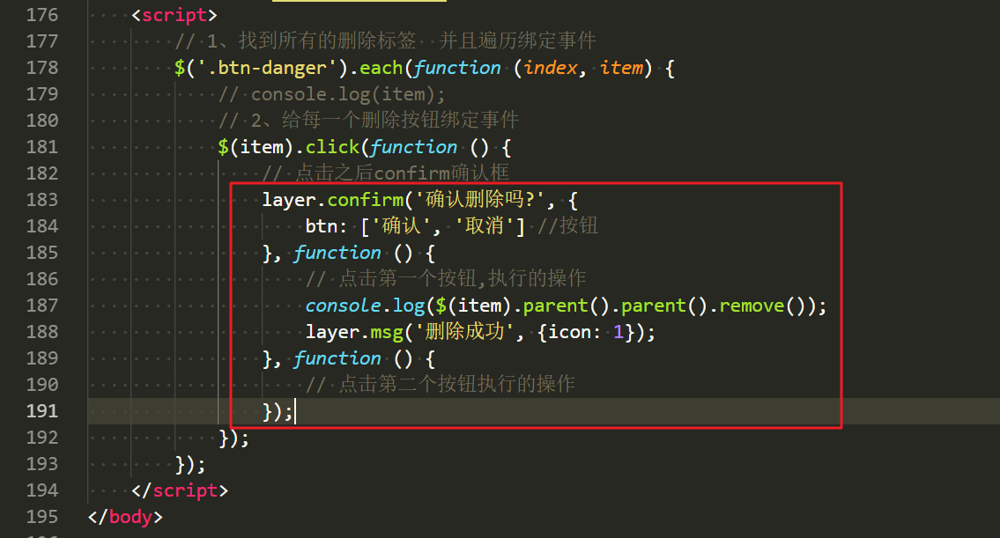
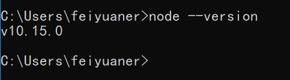

# web开发基础之综合使用

**学习目标和内容**

> 1、能够描述jQuery的作用
>
> 2、能够使用jQuery的选择器获取元素
>
> 3、能够使用jQuery对HTML标签元素注册事件
>
> 4、能够使用jQuery对HTML元素的属性进行操作
>
> 5、能够描述Bootstrap的作用
>
> 6、能够使用Bootstrap创建简单网页
>
> 7、能够描述AJAX的作用
>
> 8、能够实现AJAX发送请求到后端服务

# 一、jQuery

## 1、jQuery相关介绍

jQuery 是一个 JavaScript 的脚本库，提供了很多便捷的操作 DOM 的方法。

jQuery 中提供的操作如下：

​	选择器、属性操作、样式操作、节点操作、动画、注册事件

## 2、下载和部署

**jQuery 官网：**

​	英文：<http://jquery.com/>

​	中文：<https://www.jquery123.com/>

**下载地址：**

<http://jquery.com/download/>

**使用方式注意：**

①在HTML文档的</body>前引入即可。

②在使用一些js插件时，依赖jQuery的，必须先引入jquery，再引入js的插件。

```html
<script src="jquery-3.3.1.js"></script>
```

## 3、使用jQuery

$和jQuery

```js
// 遍历数组
$.each(arr, function (index, item) {
  // index 当前项的索引
  // item 当前项
});
// 获取第一个参数，在数组中出现的索引，如果数组中没有返回 -1
$.inArray('linux', arr);
```

## 4、jQuery选择器

jQuery中的选择器和CSS选择器使用基本类似。

```js
$('.box').css('color', 'red');
```

## 5、jQuery注册事件

```js
$('#btn').click(function() {
   //执行代码
});
$('.box').mouseover(function () {
//执行代码
});
```

## 6、jQuery属性操作

```js
//获取或者设置表单元素的值
$('#username').val()
//获取或者设置标签之间的内容
$('.box').html()
//获取或者设置元素属性的值
$('.box').attr(）
```

## 7、jQuery隐藏显示
```js
//显示
$('.box').show()
//隐藏
$('.box').hide() 
```
## 8、jQuery样式操作

```js
//操作行内样式
$('.box').css();
//操作类样式
//添加类样式
$('.box').addClass(); 
//移除类样式
$('.box').removeClass(); 
```

# 二、Bootstrap

## 1、Bootstrap介绍

简洁、直观、强悍的前端开发框架，让web开发更迅速、简单。

作用：可以==快速搭建响应式的网页==，而不需要书写大量的 css

中文文档: <https://v3.bootcss.com/>

## 2、下载和部署

下载地址：<https://v3.bootcss.com/getting-started/#download>

### 2.1、目录结构

> bootstrap/
>
> ├── css/
>
> │   ├── bootstrap.css
>
> │   ├── bootstrap.css.map
>
> │   ├── bootstrap.min.css
>
> │   ├── bootstrap.min.css.map
>
> │   ├── bootstrap-theme.css
>
> │   ├── bootstrap-theme.css.map
>
> │   ├── bootstrap-theme.min.css
>
> │   └── bootstrap-theme.min.css.map
>
> ├── js/
>
> │   ├── bootstrap.js
>
> │   └── bootstrap.min.js
>
> └── fonts/
>
> ​    ├── glyphicons-halflings-regular.eot
>
> ​    ├── glyphicons-halflings-regular.svg
>
> ​    ├── glyphicons-halflings-regular.ttf
>
> ​    ├── glyphicons-halflings-regular.woff
>
> ​    └── glyphicons-halflings-regular.woff2
>

> 如何学习使用bootstrap
>
> 1、官方文档学习
>
> 2、第三方学习网站
>
> http://www.runoob.com/bootstrap/bootstrap-tutorial.html>

### 2.2、基本模板演示

```html
<!DOCTYPE html>
<html lang="zh-CN">
<head>     
    <meta charset="utf-8"> 
    <meta http-equiv="X-UA-Compatible" content="IE=edge">        
    <meta name="viewport" content="width=device-width, initial-scale=1">    
    <!-- 上述3个meta标签*必须*放在最前面，任何其他内容都*必须*跟随其后！ -->
     <title>Bootstrap 101 Template</title>
    <!-- Bootstrap -->
    <link href="https://cdn.jsdelivr.net/npm/bootstrap@3.3.7/dist/css/bootstrap.min.css" rel="stylesheet">
</head>
<body>
    <h1>你好，Boostrap！</h1>
    <!-- jQuery (Bootstrap 的所有 JavaScript 插件都依赖 jQuery，所以必须放在前边) -->
    <script src="https://cdn.jsdelivr.net/npm/jquery@1.12.4/dist/jquery.min.js"></script>  
    <!-- 加载 Bootstrap 的所有 JavaScript 插件。你也可以根据需要只加载单个插件。 -->
	<script src="https://cdn.jsdelivr.net/npm/bootstrap@3.3.7/dist/js/bootstrap.min.js"></script>
</body>
</html>
```
### 2.3、全局CSS

Bootstrap中提供了很多类样式方便编写页面。

**①容器类样式**

.container 类用于固定宽度并支持响应式布局的容器。
```html
<div class="container">
</div>
```
.container-fluid 类用于 100% 宽度，占据全部视窗口（viewport）的容器。
```html
<div class="container-fluid">
</div>
```
**②按钮类样式**

.btn开头的类 给按钮添加不同类样式
```html
<a class="btn btn-default" href="#" role="button">（默认样式）Default</a>
<button class="btn btn-primary" type="submit">（首选项）Primary</button>
<input class="btn btn-success" type="button" value="（成功）Success">
<input class="btn btn-info" type="submit" value="（一般信息）Info">

<button class="btn btn-warning" type="submit">（警告）Warning</button>
<button class="btn btn-danger" type="submit">（危险）Danger</button>
<button class="btn btn-link" type="submit">（链接）Link</button>
```

**③表格类样式**

> **.table** 
>
> 为任意 <table> 标签添加 .table 类可以为其赋予基本的样式 — 少量的内补（padding）和水平方向的分隔线
>
> **.table-striped**
>
> 通过 .table-striped 类可以给 <tbody> 之内的每一行增加斑马条纹样式。
>
> **.table-bordered**
>
> 添加 .table-bordered 类为表格和其中的每个单元格增加边框。
>
> **.table-hover** 
>
> 通过添加 .table-hover 类可以让 <tbody> 中的每一行对鼠标悬停状态作出响应。

**④表单**

单独的表单控件会被自动赋予一些全局样式。所有设置了 .form-control 类的 <input>、<textarea> 和 <select> 元素都将被默认设置宽度属性为 width: 100%;。 将 label 元素和前面提到的控件包裹在 .form-group 中可以获得最好的排列。
```html
<form>
  <div class="form-group">
    <label for="exampleInputEmail1">Email address</label>
    <input type="email" class="form-control" id="exampleInputEmail1" placeholder="Email">
  </div>
  <div class="form-group">
    <label for="exampleInputPassword1">Password</label>
    <input type="password" class="form-control" id="exampleInputPassword1" placeholder="Password">
  </div>
  <div class="form-group">
    <label for="exampleInputFile">File input</label>
    <input type="file" id="exampleInputFile">
    <p class="help-block">Example block-level help text here.</p>
  </div>
  <div class="checkbox">
   <label>
      <input type="checkbox"> Check me out
   </label>
  </div>
  <button type="submit" class="btn btn-default">Submit</button>
</form>
```
**⑤分页**
```html
<nav aria-label="Page navigation">
  <ul class="pagination">
    <li>
      <a href="#" aria-label="Previous">
        <span aria-hidden="true">«</span>
      </a>
    </li>
    <li><a href="#">1</a></li>
    <li><a href="#">2</a></li>
    <li><a href="#">3</a></li>
    <li><a href="#">4</a></li>
    <li><a href="#">5</a></li>
    <li>
      <a href="#" aria-label="Next">
        <span aria-hidden="true">»</span>
      </a>
    </li>
  </ul>
</nav>
```
### 2.4、Bootstrap插件
交互的效果要通过 JavaScript 来实现，Bootstrap 的插件在使用前，需要先引用两个 js 文件。
```html
<script src="js/jquery-3.3.1.min.js"></script>
<script src="js/bootstrap.js"></script>
```
**①模态框实现**
cmdb项目中，资产管理-主机添加，使用到了模态框
<https://v3.bootcss.com/javascript/#modals>

**第一步：获取官方的模态框demo**
```html
<div id="myModal" class="modal fade" tabindex="-1" role="dialog">
  <div class="modal-dialog" role="document">
    <div class="modal-content">
      <div class="modal-header">
        <button type="button" class="close" data-dismiss="modal" aria-label="Close"><span aria-hidden="true">×</span></button>
        <h4 class="modal-title">Modal title</h4>
      </div>
     <div class="modal-body">
        <!-- 此处是在模态框中显示的内容 -->
        <p>One fine body…</p>
     </div>
     <div class="modal-footer">
        <button type="button" class="btn btn-default" data-dismiss="modal">Close</button>
        <button type="button" class="btn btn-primary">Save changes</button>
    </div>
    </div><!-- /.modal-content -->
  </div><!-- /.modal-dialog -->
</div><!-- /.modal -->
```
**第二步 点击按钮弹出模态框**

设置按钮的属性data-target属性设置为模态框的id
```html
<!-- Button trigger modal -->
<button type="button" class="btn btn-primary" data-toggle="modal" data-target="#myModal">
  Launch demo modal
</button>
```
**第三步 隐藏模态框**

给 Save Changes 按钮的 id 属性设置值，myModal
```js
$('#btn').click(function () {
  $('#myModal').modal('hide');
});
```
## 3、基于Bootstrap的案例

<https://v3.bootcss.com/getting-started/#examples-framework>

**案例：快速实现一个资产管理，主机列表的页面**

> 使用examples案例中的dashboard页面
>

**第一步：使用模板页面**

引入css

 

**第二步：根据实际情况，修改html标签**

查看最后呈现效果

 

实现点击按钮，模态框表单，操作按钮

 

# 三、Layer

 

官方文档地址：<https://layer.layui.com/>

## 1、部署使用

**①解压之后，部署layer插件**


**②引入layer.js**


**③实现confirm效果**



# 四、Ajax

## 1、ajax介绍

==Ajax== 即“==Asynchronous Javascript And XML==”（异步 JavaScript 和 XML）

创建交互式网页应用的网页开发的一组技术。

作用：==异步发送请求==，提升了用户体验。

## 2、使用jQuery发送AJAX

### 2.1、发送get请求

```js
$.ajax({
  type: 'get',
  url: 'xxxxx',
  success: function (res) {
      //成功后执行的代码
  }
})
```

### 2.2、发送post请求

```js
$.post('/path/to/file', {param1: 'value1'}, function(data, textStatus, xhr) {
      /*optional stuff to do after success */
});
```

### 2.3、Ajax方法

```js
$.ajax({
  type: 'post',
  url: 'xxxxx',
  data: data,
  success: function (res) { 
      //成功执行的代码
  }
});
```

## 3、实现聊天机器人

API：<http://www.tuling123.com/openapi/api>

请求方法：POST

请求参数：key=d7c82ebd8b304abeacc73b366e42b9ed&info=你好

| 参数名称 | 参数值         |
| -------- | -------------- |
| key      | 请求权限标识符 |
| info     | 关键字参数     |

## 4、操作主机列表页面

### 4.1、接口服务器搭建

使用json-server启动一个接口服务器，借助node进行开发的。安装node系统环境。

 

**①安装json-serser**

```powershell
cmd > npm install -g json-server
```

**②编写json数据文件**

 

 

**③cmd进入路径，启动json-server服务**

 

服务接口启动成功

 

### 4.2、动态获取主机列表

**①复制主机列表  清空tbody的数据内容**


**②通过ajax发送请求  获取json格式数据   拼接字符串模板  追加写入页面**


