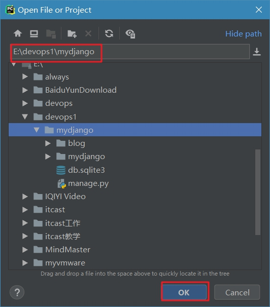
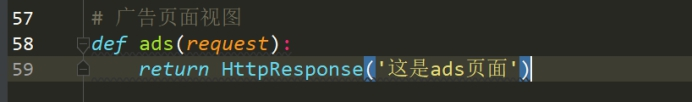
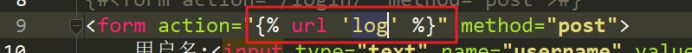

# Web框架之Django一

**学习目标和内容**

> 1、能够描述Django的作用
>
> 2、能够使用Django创建应用
>
> 3、能够使用GET和POST请求方式进行传参
>
> 4、能够使用Django的函数式方法定义视图
>
> 5、能够进行Django的配置文件修改
>
> 6、能够基本使用Django的路由定义

# 一、Django相关介绍

## 1、什么是Django

web框架，指为解决一个开放性的问题而设计的具有一定约束性的架构。

一堆类库文件  有组织  

是由python编写的，采用MTV模型。

Django官网：<https://www.djangoproject.com/>

框架的好处：

1. 快速开发

2. 简单易用

其他常见web框架：flask  web.py  Tornado

## 2、应用场景

快速搭建web应用 提供数据接口（API）

CMDB

# 二、安装部署应用

准备工作：

**1、安装python环境 python3以上**

 

**2、安装开发工具IDE  Pycharm**

## 1、安装Django

### 1.1、版本的选择

 

LTS：是长版本支持，一般我们选择都会选择LTS版本的，因为官方支持时间较长。

### 1.2、安装并创建项目

```powershell
pip install django==1.11.18
```

跳转到目录  创建应用  目录根据实际情况选择

```powershell
django-admin startproject mydjango
```

 

## 2、目录结构

 

manage.py  django项目里面的工具，通过它可以调用django shell和数据库等。

 

settings.py  包含了项目的默认设置，包括数据库信息，调试标志以及其他一些工作的变量。

urls.py  负责把URL模式映射到应用程序。

## 3、创建新应用

使用manage.py文件，创建应用。

python manage.py startapp blog

 

## 4、启动Django项目

python manage.py runserver

 

 

## 5、使用PyCharm打开项目

 

 

# 三、Django使用原理

## 1、MVT模型

Model（模型）：负责业务对象与数据库的对象交互（ORM）

提供项目的数据支持

Template（模板）：负责如何把页面展示给用户

​                静态页面（html+css+js） 模板标签（解析为python代码进行业务逻辑处理）

View（视图）：负责业务逻辑，并在适当的时候调用Model和Template

​           调度

## 2、请求流程

 

# 四、Django的请求和响应

## 1、快速实现

**①定义路由  urls.py**

**②定义视图函数  views.py**

·······

**③模型数据调用  创建表**

**④包含模板  加载模板 （html····）**

### 1.1、路由定义

 

 

 

### 1.2、编写视图

 

 

### 1.3、浏览器访问

 

到这里，就完成了一个页面请求。

## 2、请求

<https://docs.djangoproject.com/zh-hans/2.1/ref/request-response/>

客户端请求服务器端携带的信息

> **属性：**
>
> HttpRequest.scheme：请求的方式，即http或者是https
>
> HttpRequest.body：请求的主体，返回的是一个字符串
>
> HttpRequest.path：请求的路径，这里的路径是指相对路径，也就是说一个登陆后台页面的请求：<http://127.0.0.1:8000/admin> 的路径是 /admin 
>
> HttpRequest.method：请求方式 POST/GET
>
> HttpRequest.encoding：请求提交的数据的编码方式
>
> HttpRequest.GET：获取get方式表单中或url提交的数据
>
> HttpRequest.POST：获取post方式表单中或url提交的数据
>
> HttpRequest.META：获取的是一个标准的python字典。它包含了所有的HTTP请求信息
>
> **方法：**
>
> HttpRequest.get_host()：请求的地址
> 
> HttpRequest.get_port()：请求的端口
>
> HttpRequest.get_full_path()：请求的完整路径，包括get参数
>

 

 

接收GET方式传值

 

 

 

## 3、响应

服务器端返回给客户端的信息

> 属性：
>
> HttpResponse.content：响应内容
>
> HttpResponse.status_code：响应状态码
>
> HttpResponse.content_type：响应类型（默认是：text/html ）
>

 

 

## 4、GET请求传参和接收

Get请求是明文传输，信息附加在url上面。

在HttpRequest对象中，GET属性是django.http.QueryDict 的实例，它是一个自定义的类似字典的类，用来处理同一个键带有多个值。这个类的需求来自某些HTML 表单元素传递多个值给同一个键。

request.GET的QueryDict 在一个正常的请求/响应循环中是不可变的。

> **例：接收URL通过GET方式传输过来的参数，并打印到页面上**
>
> **①接收到参数**
>
> **②通过response返回参数**

**1、定义路由**

 

**2、定义视图函数**

 

 

**③进行参数组合返回给页面显示**

 

## 5、POST请求传参和接收

POST相对于Get请求是安全的，所有信息附加在表单中。

在HttpRequest对象中，POST属性是django.http.QueryDict 的实例，它是一个自定义的类似字典的类，用来处理同一个键带有多个值。这个类的需求来自某些HTML 表单元素传递多个值给同一个键。

request.POST的QueryDict 在一个正常的请求/响应循环中是不可变的。

> 例：通过postman（接口调试工具）模拟发送POST请求，传输参数并把参数打印到页面
>

**①postman发送数据**


> Tip:403  CSRF 禁止访问
>

解决方案一： 禁止关闭  CSRF 限制

 

**②返回数据信息**


> 常见发送POST请求的方式：
>
> ①html表单
>
> ②ajax
>
> ③curl   postman(开发API调试)
>
> ④编程语言里的一些操作方法和类   php curl libcurl   python requests  ulib

## 6、QueryDict对象

> QueryDict常用操作方法：
>
> **QueryDict.get(key )**
>
> **QueryDict.getlist(key)**


> QueryDict.items()
>
> QueryDict.lists()
>


# 五、视图和模板

## 1、函数视图

以函数的方式定义的视图称为函数视图，函数视图便于理解。但是遇到一个视图对应的路径提供了多种不同HTTP请求方式的支持时，便需要在一个函数中编写不同的业务逻辑，但是代码可读性与复用性都不佳（后期会采用类视图）。

​	定义函数视图就跟定义一个函数是一模一样的，只是函数视图必须要接收一个参数request。

 

## 2、模板文件

**①定义路由**

 

**②定义函数视图**

 

现在已经可以看到输出文字，但是要求是显示返回一个静态页面。需要借助template支持。

**③建立templates文件夹和静态资源文件夹static**

 

**④把静态页面和静态资源放置到对应的目录**

 

 

**⑤在setting.py配置静态资源**

 

 

**⑥在函数视图中加载页面**

 

> render方法调用加载模板方法
>
> render(request,模板名称)
>

**⑦修改页面上的静态资源的访问地址**

css js img 图片的路径  加上/static

 

# 六、路由

django的路由  可以进行自定义，具有丰富的用法。合理配置路由，对于web应用，具有易用的好处，还可以起到一定的安全作用。

## 1、URL匹配规则

①从上到下，依次匹配，如果匹配成功就不继续往下匹配了，

②如果匹配失败，继续匹配，直到匹配成功为止，

③如果没有匹配的对应规则，就会报错。

## 2、常见匹配方式

### 2.1、完全匹配

 

### 2.2、正则匹配

 

 

 

### 2.3、分组匹配

分组正则匹配  (?p<标签名称>)

标签名称为之后接收的参数名称

 

 

 

## 3、反向解析URL

在前端页面中表单的提交地址，需要填写完整的URL地址，不利于使用和后期如有改动。

可以使用URL别名的方式来处理。

**①原来的前端页面地址**

 

**②路由URL定义别名**

 

**③模板上进行调用**

 

查看解析效果

 

## 4、包含URL模块

在实际业务开发当中，会存在很多应用模块。如果把所有的url路由都定义到同一个文件，会很难进行维护，所有可以进行URL的分文件定义和管理。

**①新建一个应用**

```powershell
cmd > python manage.py startapp shop
```

**②在urls.py中导入include，引入应用文件夹里的urls定义**

 

 

**③在对应的应用文件夹建立urls.py文件**

 

**④查看**

 

###作业：
>1、主机列表模板部署到django项目中使用
>
>2、实现一个用户登录的原理

案例：简单登录原理实现

**①定义路由**

urls.py定义编写

 

**②编写函数视图加载模板**

view.py中定义

 

**③编写模板页面**

template文件夹里login.html文件

 

**④处理参数，进行验证判断**

修改上面写过的函数视图

 

 