# Web框架之Django二

**学习目标和内容**

> 1、能够使用类视图的写法
>
> 2、能够使用模板语言的相关语法
>
> 3、能够理解过滤器的作用
>
> 4、能够理解并使用模板继承

# 一、类视图

## 1、类视图介绍

​	视图是一个可调用的对象，它接收一个请求然后返回一个响应，这个可调用对象可以不只是函数，Django还提供一些可以用作视图的类，叫做类视图。

​	以函数的形式进行定义的视图就是函数视图,视图函数便于理解,但是遇到一个视图函数对应的路径提供了多种不同的HTTP请求方式的支持时(get,post,delete,put),需要在一个函数中写不同的业务逻辑,代码的可读性和复用性就很低, 所以引入类视图进行解决。

## 2、使用类视图

**①创建一个新的应用进行使用**

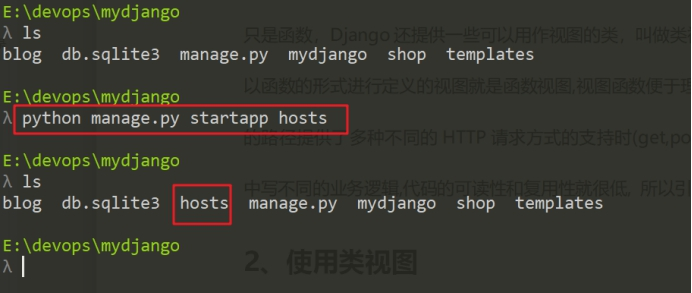 

设置APP分组路由

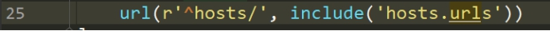 

设置视图路由

**②导入View类**

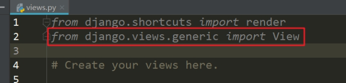 

**③定义类视图，常见方法**

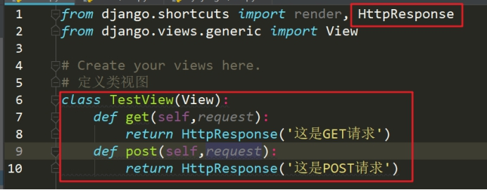 

**④测试GET和POST方法**

可以使用postman测试接口工具发送测试方法，或者使用CURL

curl 发送POST请求

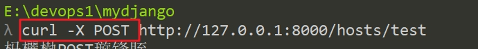 

## 3、简单登录逻辑实现

定义URL路由

 

定义类视图

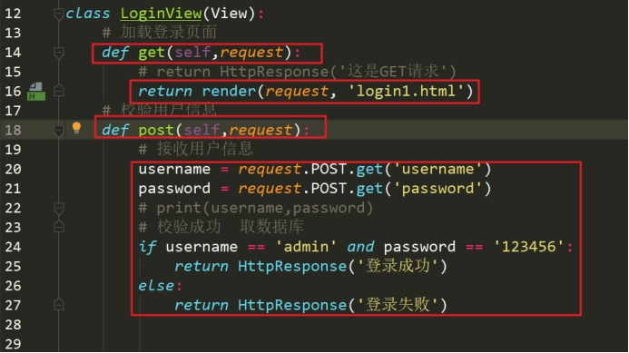 

编写模板

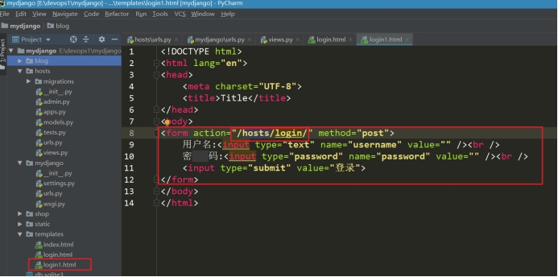 

# 二、模板语法

## 1、变量的使用

在模板中，如果想要输出后端传输的变量。需要使用到模板的标签语法。

语法：

```django
{{变量名称}}
```

例：在后端传入变量到模板中，在模板中调用输出变量

定义一个URL

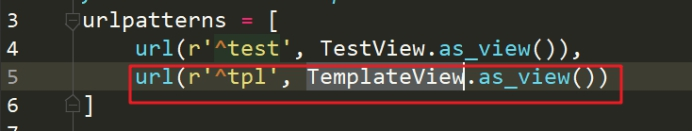 

定义一个模板

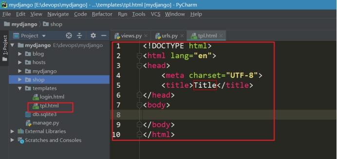 

**①在视图中传输变量**

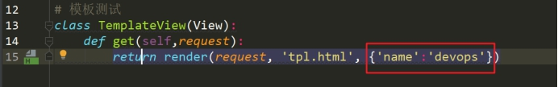 

**②在模板中调用输出变量**

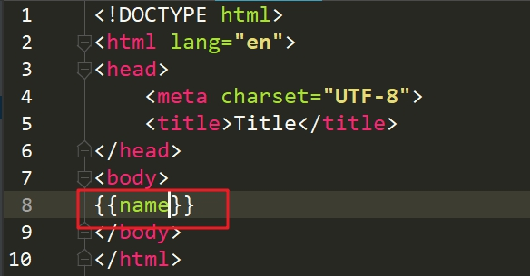 

## 2、传递所有变量

当在视图需要往模板传输很多变量时，如果一个一个写，会很繁琐不方便，在框架中提供了，locals方法，可以传递所有变量。

在上面列子视图中，继续进行操作

**①使用locals方法**

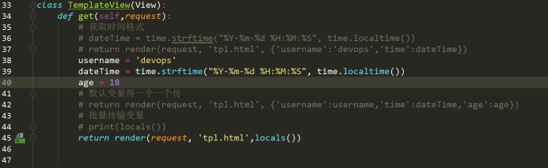 

**②在模板中调用输出变量值**

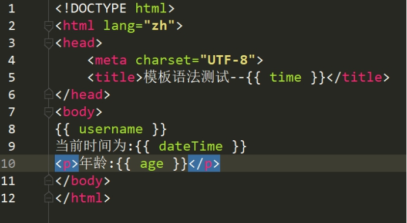 

> Tip:list和dict的值获取
>

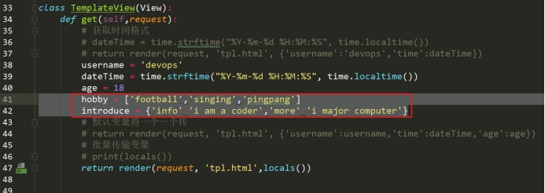 

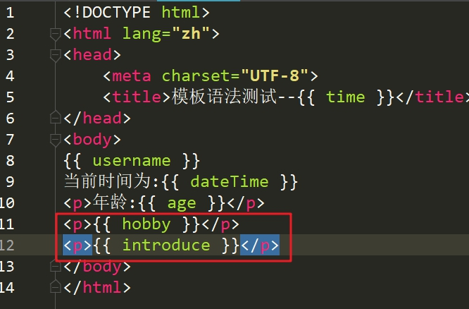 

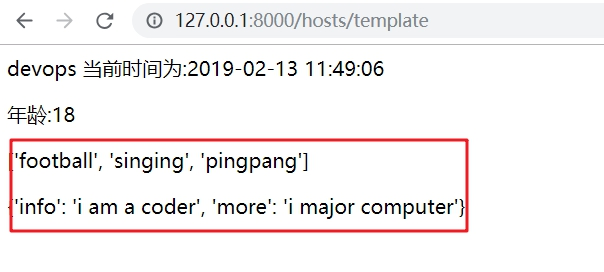 

> 获取list或者dict中的其中一个值，可以通过.进行获取。list填写数字下标，dict填写key。
>

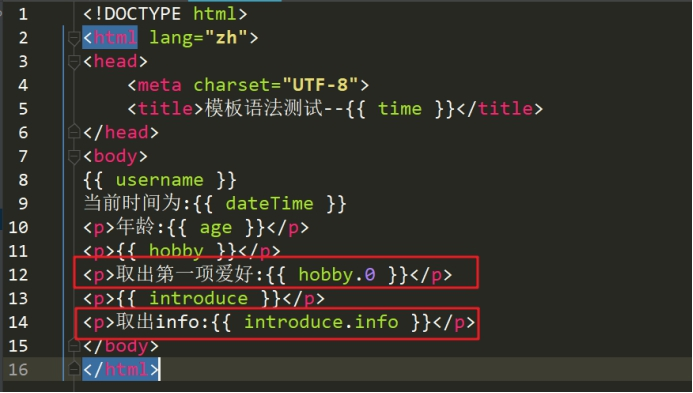 

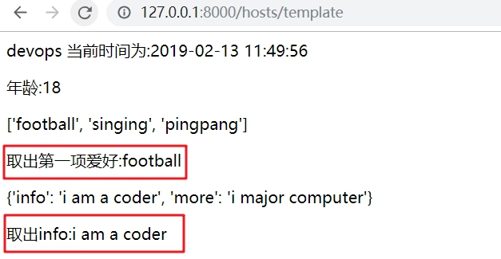 

## 3、过滤器

对于通过视图输出到模板中的数据，进行二次的处理。可以通过模板过滤器实现。

语法格式：

```django
{{ obj | filter: param }}
```

常用的过滤器：

| 过滤器   | 作用                                                  | 实例                       |
| -------- | ----------------------------------------------------- | -------------------------- |
| add      | 给变量加上对应的值                                    | 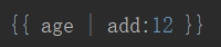 |
| capfirst | 首字母大写                                            | 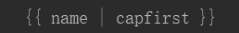 |
| cut      | 从字符串中移除指定的字符                              | 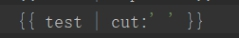 |
| date     | 格式化日期字符串                                      | 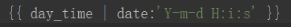 |
| default  | 如果值是False，就替换成设置的默认值，否则就用本来的值 | 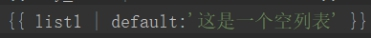 |

例子：处理数字加

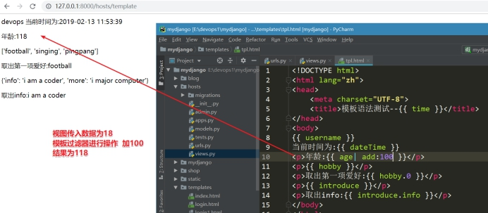 

 

# 三、模板控制语句

<https://docs.djangoproject.com/en/1.11/ref/templates/builtins/>

## 1、判断语句（if）

语法结构：

```django

......
.........
```
​	if标签判断一个变量值，如果是ture，即为存在，不为空并且不是false的boolean值，系统则会显示和中间的所有内容。

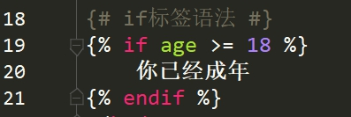 

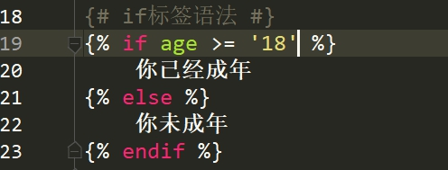 

提醒注意：通过请求接收到的数字，其实是一个字符串类型

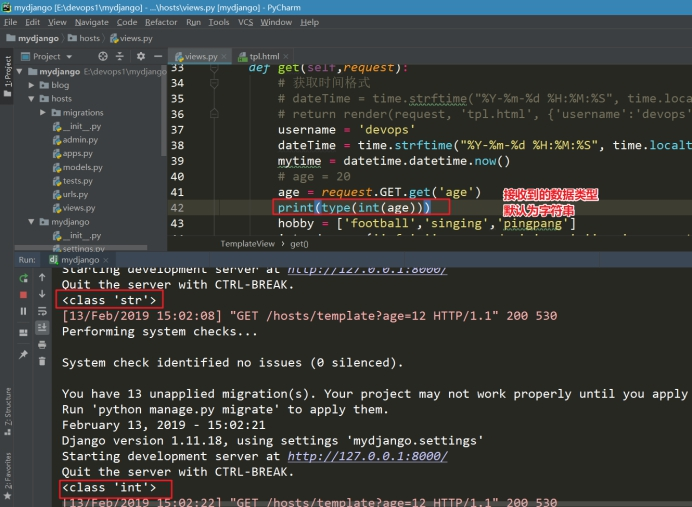 

## 2、循环语句（for）

语法结构：

```django
...
```

标签允许你按顺序遍历一个序列中的各个元素，每次循环模板系统都会渲染...之间的所有内容。

### 2.1、遍历列表

模板标签写法

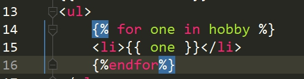 

显示效果

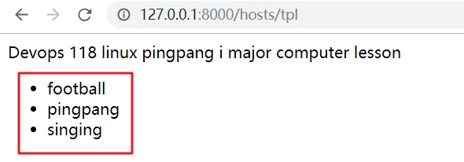 

> 倒序显示
>

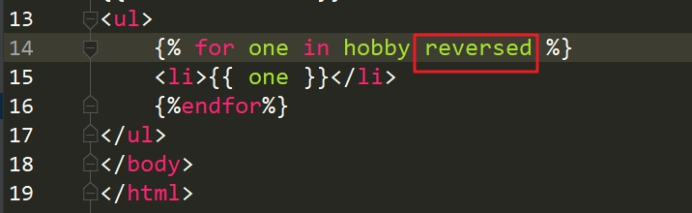 

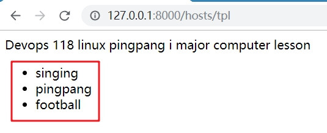 

> 计数器forloop.counter
>

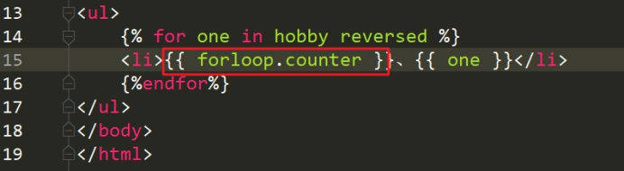 

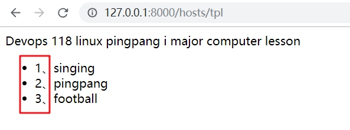 

> forloop判断是否为第一个
>

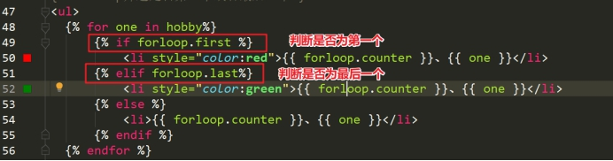 

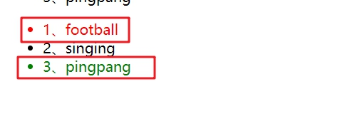 

### 2.2、遍历字典

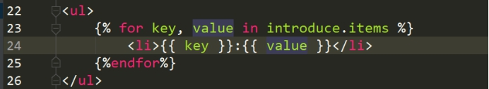 

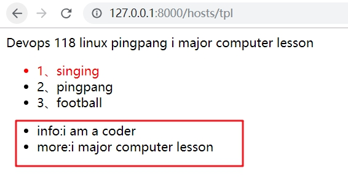 

# 四、自定义过滤器(扩展)

在上面列子中，学习使用了模板中提供的基本过滤器，但是有时候还是不能够满足业务需求。这时，可以选择使用自定义过滤器

> 自定义过滤器实现的步骤：
>
> ①在应用中创建templatetags
>
> ②在其中创建任意.py结尾文件
>
> ③导入 from django import template 方法
>
> ④注册方法 register = template.Library()
>
> ⑤通过装饰器的写法  定制  自定义过滤器

例：实现一个自定义过滤器

**①创建模块templatetags**

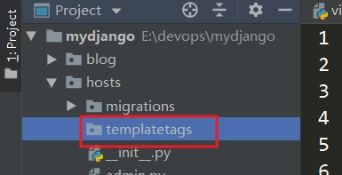 

**②创建一个.py结尾文件**

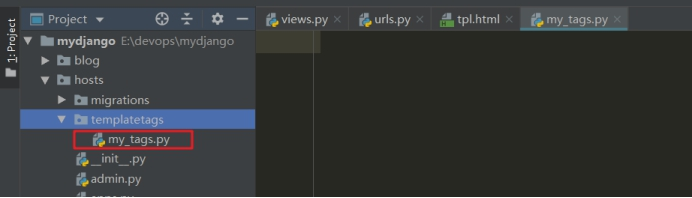 

**③导入方法**

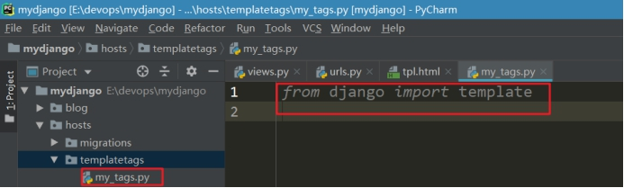 

**④注册方法**

==Library的L是大写==

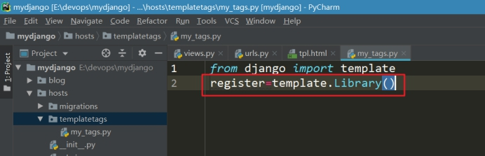 

**⑤单个参数(使用装饰器register.filter)**

my_tags.py文件编写

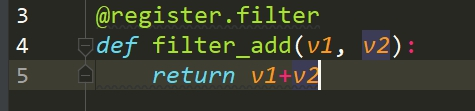 

模板调用

自定义标签在使用中，必须先加载

```django

```

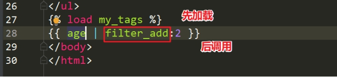 

> Tip：如果遇到以下问题，注意解决方案
>

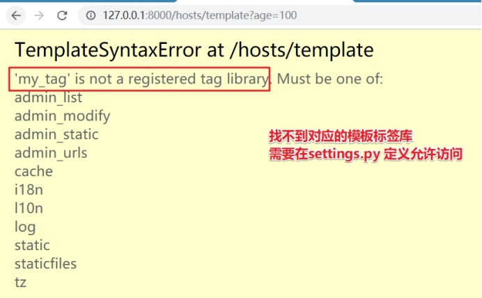 

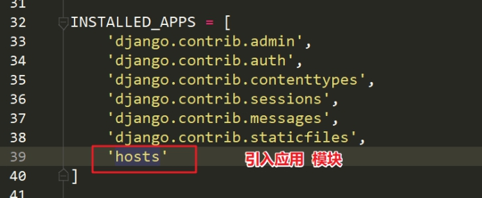 

**⑥多参数(使用装饰器register.simple_tag)**

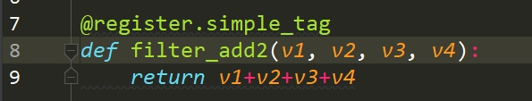 

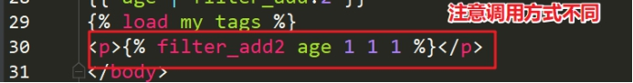 

# 五、模板继承

在实际业务开发中，进行会使用页面中相同的部分，为了能够使页面模板部分可以复用。可以采用模板继承的方式。

## 1、传统模板加载

**①定义URL**

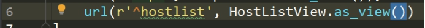 

**②静态资源部署**

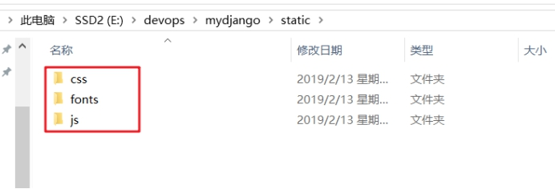 

**③模板引入**

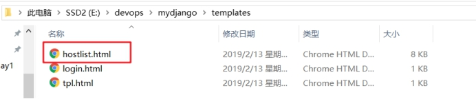 

注意：需要提前在setting.py中设置好模板路径和静态资源路径

 

 

**④定义类视图**

 

**⑤修改引入静态资源的路径**

css js

 

**⑤查看页面加载效果**

 

> 按照以上方式，继续快速创建一个用户管理的页面
>

使用传统模板加载方式的问题：

**①公共部分**

 

**②修改了公共部分之后，需要修改多个页面**

 

 

可以预见的是如果在多个页面中，都修改的话，工作量会很大，也不是很合适。

## 2、模板继承方式

解决思路：

 

**①写基本页面base.html**

base.html 是复制hostlist.html

 

**②继承模板**

创建一个新的newhostlist.html

 

注意在类视图中，调用的页面，应该是继承页面，不是基础页面

 
