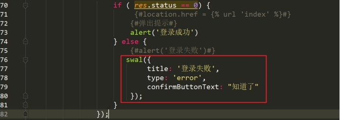
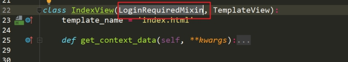
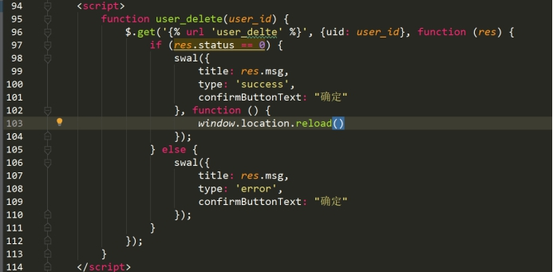

# CMDB系统开发一

# 一、CMDB相关概念

## 1、概念介绍

​	CMDB（配置管理数据库）存储与管理企业IT架构中设备的各种配置信息，它与所有服务支持和服务交付流程都紧密相联，支持这些流程的运转、发挥配置信息的价值，同时依赖于相关流程保证数据的准确性。

​	服务器集群或者分布式服务器 几十台、上百台，服务器相关数据信息，管理不方便。通过资产管理的方式，通过CMDB系统实现。

github一些开源的cmdb系统：<https://github.com/search?q=cmdb>

## 2、需求分析

本次开发的CMDB系统实现以下模块：

**1、用户管理模块**

**2、用户组管理模块**

**3、权限管理模块**

**4、资产主机模块**

**5、资产机房模块**

**6、资产用户模块**

概括一下，==本次学习开发的CMDB==，是一个==收集服务器信息，实现服务器信息可视化，给自动化运维监控提供数据统计和展示等基础服务==。

## 3、设计实现

CMDB使用关系图示：

 

本次开发的CMDB系统结构图示：

 

# 二、创建CMDB项目

## 1、创建项目

**①使用Pycharm创建Django项目**

 

 

**②打开查看项目**

 

 

## 2、默认初始化配置

**①配置静态资源目录**

创建static文件夹

 

settings.py配置

 

**②配置时区和语言**

 

## 3、数据库配置

**①创建数据库**

```mysql
CREATE DATABASE syscmdb DEFAULT CHARACTER SET utf8 COLLATE utf8_general_ci;
```

**②配置数据库**

settings.py

 

__ini__.py

 

**③迁移数据库**


查看生成的数据表

 

# 三、管理后台布局

## 1、后台前端模板介绍

使用INSPINIA模板，实现管理后台的前端模板页面

 

## 2、基础页面布局

先定义一个基础页面，包含各个页面中的公共部分，方便其他页面继承。

**①部署静态资源**

 

**②在应用下建立模板目录，方便之后分开管理**

 

**③定义路由**

 

 

**④类视图**

 

**⑤模板页面**

可以通过模板页面，进行修改。或者直接使用修改好的模板

注意静态资源路径的修改和替换

 

**⑥查看效果**

 

Tip:如果遇到静态资源无法加载的情况，注意查看settings.py里的静态资源目录配置是否正确。

 

以上页面视图和页面，作为测试使用。

## 3、首页面实现

**①路由**

> RediretView  重定向 URL跳转
>

 

 

**②视图**

 

**③模板**

 

**④查看效果**

 

## 4、高级视图类之TemplateView

TemplateView，这个类封装了View提供了更强大的功能。

使用TemplateView，加载渲染页面

**①使用TemplateView**

 

Tip：实现原理

 

**②视图传输数据到模板**

Tip:实现方法

 

通过重写父类，传输数据信息

 

**③在模板中调用**

 

**④查看显示效果**

 

# 四、登录管理

## 1、登录基本实现

实现完成首页面后，为了能够更加安全，就需要实现一个登录功能，只有登录之后，才能够查看管理后台。

登录页面实现后的效果：

 

**①路由**

 

**②视图**

 

**③在后端接收用户传输的数据**

> 登录基础原理：前端页面输入账号密码===》后端接收信息参数 =\==》类视图判断校验
>

模板页面通过ajax post请求发送数据

 

 

后端视图接收数据

 

 

 

**④校验账号和密码并返回数据**

 

> Tip:使用返回json数据格式的声明
>
> from django.http import JsonResponse
>

模板修改

 

显示效果

 

 

**⑤美化提示窗口**

模板引入sweetaltert js库

 

实现方式

 

实现效果

 

**⑥js表单验证  jquery.validate**

引入js文件， jquery.validate 是基于jquery的，所有需要先引入jquery

 

校验代码

 

实现效果

 

## 2、Django的用户系统实现登录

以上操作，只是实现了登录的基本校验操作，但是没有用户信息，所有实际是不能够使用。

> 在Django中，提供了整个一套的登录相关方法，可以直接导入调用即可。
>
> from django.contrib.auth import login, logout, authenticate
>
> authenticate()：就是用来验证用户的账号密码，如果验证成功就会返回一个User对象，如果失败就会返回None。
>
> login()：用来真正执行登录的函数，这里也会生成session存储进数据库。
>
> logout()：用来注销用户的。
>

**①实现登录功能**

视图

 

 

模板

 

**②使用manager.py创建用户**

注意在创建用户密码的时候，不要太弱，和用户名称邮箱雷同，认为不安全

 

 

查看最后的登录效果

## 3、URL拦截器

虽然已经实现了登录系统功能，但是发现即使不通过登录系统，也可以直接通过URL访问管理后台的首页。所以，还需要在首页面上进行登录验证。登录允许访问，没有登录不允许访问。

防止通过URL直接访问  防翻墙

> Django中提供了验证方法：
>
> from django.contrib.auth.mixins import LoginRequiredMixin
>

**①添加实现**

导入类

 

注意一定要最先继承LoginRequireMixin类

 

**②查看效果**

Tip：配置修改默认登录路径

 

 

 

## 4、注销功能实现

注销退出登录功能，使用Django的logout方法实现即可。

注销后，返回登录页面，需要导入类方法

> from django.http import HttpResponseRedirect
>
> from django.urls import reverse
>

注销后通过HttpResponseRedirect跳转页面。

在跳转页面的同时，需要反向去解析URL别名，需要reverse解析方法。

**①视图**

 

 

**②路由**

 

**②模板**

 

## 5、登录原理解析（扩展）

 

会话机制，http每次连接默认没有上下联系状态。

cookie  存储在浏览器中的一些信息，具有风险，容易被篡改

 

session  存储到服务器的一些信息

 

通过查看相关信息，确认流程

> 退出登录的方式：
>
> ①清空cookie
>
> 如果在浏览器清除了cookie信息，就会退出登录
>
> cookie里记录了session_id，没有session_id就不能够找到session，所以就被判断为未登录
>
> ②清空session
>
> 直接删除session信息，虽然cookie在，session没有了，也会判定为未登录
>

# 五、用户管理模块

## 1、展示用户列表

用户登录之后，继续实现用户管理模块。

首先展示用户列表信息，为了方便管理项目应用，创建新应用==users==，负责==用户管理模块==，==用户组管理模块==和==权限管理模块==的开发和管理。

**①创建新应用**

 

**②配置允许应用**

 

**③路由**

 

 

**④视图**

 

**⑤模板**

 

 

上面实现了页面加载，获取数据库用户信息，显示到模板页面

视图

 

模板

 

为了看到数据动态的效果，可以再通过 django添加用户测试

 

## 2、扩展基础用户表

Django的用户表中，提供了基本必须字段：用户名称、邮箱、密码、角色（超级管理员、普通用户）

需要添加更多的用户信息，需要使用==OneToOneField==字段对用户表进行拓展。

OneToOneField就是一对一，跟多对一的使用类似，也有正向反向查询

**①扩展模型**

加入中文名、微信、电话 备注等

导入基础用户模型

 

扩展模型

 

**②迁移数据表**

 

**③添加测试数据并展示**


**④模板输出**

 

通过判断用户状态，显示不同的显示标识

 

最终展示效果：

 

## 3、高级视图类之ListView

上面的案例中使用高级视图类TemplateView,这里再使用另外一个高级视图类ListView

使用ListView 定义模型名称  数据会自动查询  并且组合

视图

 

 

 

模板

对应修改默认视图传过来的值

 

## 4、批量创建用户

**①编写方法**

 

**②查看**

 

## 5、分页实现

一次性展示数据太多了，需要进行分页显示处理。

分页原理

视图

 

**①通过高级视图ListView实现**

视图

 

**②显示页面按钮**

> page_obj.has_previous 判断是否有上一页
>
> page_obj.previous_page_number 上一页的页数对象
>
> page_obj.number 当前页数
>
> page_obj.has_next 判断是否有下一页
>
> page_obj.next_page_number 下一页的页面对象
>
> 
>
> paginator.num_pages 最大页数
>
> paginator. page_range 可迭代的总页数
>

模板

 

**③限制输出的页面按钮数量**

视图

 

模板

 

 

**④显示范围处理**

 

视图

 

> Tip:解决当页面不足时，如果向后取页面
>

 

## 6、添加用户

用户列表展示出来。之前创建用户是在命令行创建，实际业务中，需要在页面中添加用户。

点击添加按钮，通过表单结合ajax提交到后端，实现添加用户功能。

Tip：继承页面css和js处理

base页面

加入css

 

加入js

 

**①用户列表页面  添加用户按钮**

user_list.html  

 

**②添加功能实现**

路由

 

视图

 

模板

user_add.html

 

 

 

> Tip:密码处理
>
> from django.contrib.auth.hashers import make_password
>
>  
>
> 如果密码不是使用django的加密存储，就会出现不能够登录的问题。因为默认使用的django的用户信息校验方法。
>

## 7、更新用户

**①修改用户列表模板**

添加跳转连接

 

**②更新功能实现**

路由

 

视图

 

模板

回显用户信息

 

更新提交ajax方法

 

## 8、删除用户

路由

 

视图

 

模板

行内绑定事件

 

删除提交方法

 

Tip：点击取消按钮，返回页面的上一页

 

## 9、禁用和启用用户

路由

 

视图

 

模板

 

更新状态发送请求方法

 