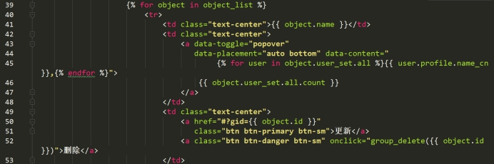
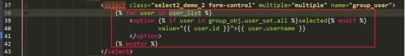
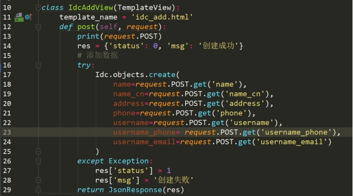

# CMDB系统开发二

# 一、用户组管理模块

## 1、展示用户组列表

​	Django自带了用户表，同时也带了用户组表。他们是多对多关系。用户组模型很简单，和User模型是多对多的关系。用户组顾名思义，就是对用户进行了分组。其作用在权限控制中就是可以批量的对用户的权限许可进行分配，而不用一个一个的按用户分配，节省维护的工作量。

RBAC

**①功能实现**

路由

 

视图

使用用户组模型

 

 

模板

 

**②添加测试数据**

 

 

添加用户到用户组

 

 

## 2、创建用户组

添加用户组合之前添加用户方法类似。

路由

 

视图

 

模板

展示用户列表

 

 

## 3、更新用户组

更新用户组合更新用户类似，需要额外处理的是，回显用户列表，需要判断用户是否在用户组，如果在处理为下拉框选中状态。

路由

 

视图

 

模板

当前用户组 用户选中

 

更新用户组  发送ajax请求

 

## 4、删除用户组

路由

 

视图

 

模板

 

# 二、权限管理模块

## 1、Django权限介绍

Django的框架提供了模型级的权限控制， 即可以检查用户是否对某个数据表拥有增(add), 改(change), 删(delete)权限。

Django默认权限模型

```django
from django.contrib.auth.models import Permission
```

==Django的权限表和用户是多对多关系，同时跟用户组也是多对多关系。==

也就是代表一个用户可以有自己的权限同时也可以有所属组的权限。

​	Django的权限表，里面有一个==content_type_id==关联的就是==django_content_type==表，所以而django_content_type表中关联了APP和模型。所以这是模型级别的权限控制。

举个例子，我们可以控制某个用户是否具有查看用户列表或者创建用户列表的权限。而无法判断某个用户对某条数据是不是有权限。

​	当然也可以后期自己去扩展数据权限，但是在当前系统控制在模型权限就足够了。

 

 

 

## 2、展示权限列表

路由

 

视图

 

模板

 

 

以上显示的都是系统默认权限，不能够进行增加或者修改。

过滤掉系统的默认权限，自定义权限，并显示出来。

**①过滤掉默认的系统权限**

发现都是英文的，可以使用正则匹配，把含有英文的过滤掉

regex='[a-zA-Z0-9]'

重写模板类的get_queryset方法

 

已经显示过滤系统默认权限（英文显示的）

 

**②自定义权限**

 

**③迁移数据**

 

显示出自定义权限

 

 

## 3、用户权限设置功能

**①用户列表添加权限设置按钮**

 

**②显示可设置权限**

路由

 

视图

 

模板

 

**③设置权限**

视图

 

模板

 

## 4、用户组权限设置功能

用户组权限设置和用户权限设置功能基本类似。

## 5、权限使用

权限限制实现：

**①前端限制  页面中不显示功能入口**

 

缺点  可以直接通过url访问

**②后端限制  查询数据库是否具有权限**

使用导入模块

```django
from django.utils.decorators import method_decorator
from django.contrib.auth.decorators import login_required, permission_required
```

视图

 

# 三、资产机房模块

新建一个resource应用模块，用来进行资产资源的管理。

 

 

## 1、资产机房模型设计

资产机房,就是平常所说的IDC机房。托管主机的地方。

资产机房信息：

机房简称、机房名称、机房地址、机房座机电话、机房负责人姓名、机房负责人邮箱、机房负责人手机号。

**①创建模型**

 

**②迁移数据**

 

## 2、展示资产机房列表

路由

 

 

视图

 

模板

 

添加测试数据，查看效果

 

 

## 3、添加资产机房

路由

 

视图

 

模板

在列表页面增加添加按钮

 

表单

 

提交请求

 

## 4、更新资产机房

路由

 

视图

 

模板

更新按钮处理

 

 

post数据方法

 

## 5、删除资产机房

路由

 

视图

 

模板

绑定事件

 

发送请求

 

# 四、资产用户模块

## 1、资产用户模型设计

==资产用户跟系统用户没关系，资产用户跟主机是有关系的==。每台主机都需要账号密码，资产用户主要是针对主机去关联的。

模型字段：名称、系统用户、系统密码、备注

**①创建模型**

 

**②迁移数据**

 

## 2、展示资产用户列表

路由

 

视图

 

模板

 

添加测试数据

 

展示效果

 

## 3、添加资产用户

路由

 

视图

 

模板

在列表页面添加创建资产用户按钮

 

收集数据的表单

 

通过ajax方法post请求

 

## 4、更新资产用户

路由

 

视图

 

模板

修改列表页面中更新按钮的链接

 

数据回显

 

通过ajax发送修改后的数据

 

## 5、删除资产用户

路由

 

视图

 

模板

在列表页面绑定事件  通过按钮点击事件  触发删除js方法（发送数据给后端）

 

 