# CMDB系统开发三

# 一、资产主机模块

## 1、资产主机模型设计

主机展示信息表

常规性的收集：

==主机模型==：IP地址、连接端口、操作系统（Linux，Windows，Mac）、机器类型（虚拟机，物理机）、主机名、CPU型号、CPU物理个数、内存信息、系统平台、系统平台位数、UUID、SN、探测状态、创建主机时间、更新主机时间

还要收集==硬盘信息，网卡信息==，注意一台主机,硬盘可能有多个，网卡也会有多个。所以要单独把硬盘和网卡各单独设计成一张表，然后使用多对一跟主机模型连接起来。

==硬盘模型==：硬盘名、硬盘大小、外键关联（server）

==网卡模型==：网卡名、ip地址、外键关联（server）

还需要一张探测表，把探测时候的一些信息记录下来，比如在探测的时候，要输入主机IP，端口，要把这些信息收集下来，并且跟主机表进行关联。

**①创建模型**

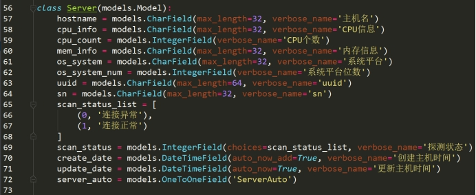 

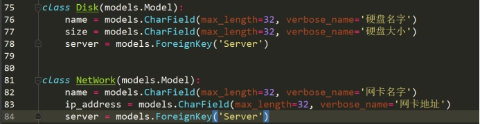  

**②迁移数据库**

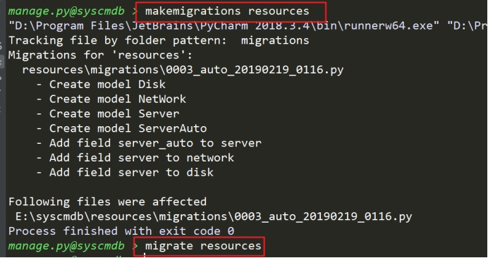 

## 2、资产主机展示列表

路由

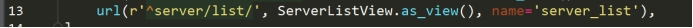 

视图

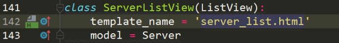 

模板

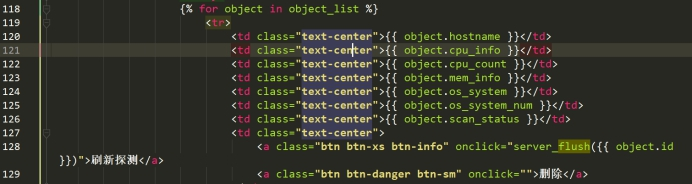 

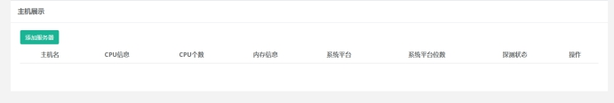 

没有数据，后期通过检查脚本推送服务器的信息到cmdb系统中，然后就添加到资产主机数据表中。

## 3、资产主机探测功能设计

常规的信息收集，有两种方式，一种是主动采集，一种是客户端收集。

主动探测：一般是通过，SNMP/SSH/TELNET等手段进行远程收集。

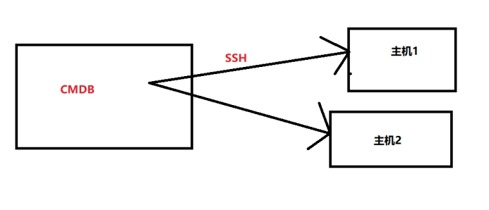 

==客户端采集==：需要在每一个要部署的主机中部署一个客户端进行数据采集并且发送到远程服务端进行接收。

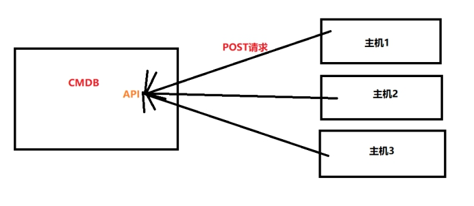

> Tip:升级安装Linux平台Python版本3以上
>
> 注意：本安装需要使用到CentOS base源  epel源

```shell
#!/bin/bash
yum install -y openssl-devel bzip2-devel expat-devel gdbm-devel readline-devel sqlite-devel libffi-devel
if [ ! -f './Python-3.7.3.tgz' ];then
    echo "本地没有Python源码包,需要远程下载,请耐心等待\n"
    wget https://www.python.org/ftp/python/3.7.3/Python-3.7.3.tgz
fi
tar xvf Python-3.7.3.tgz
cd Python-3.7.3
./configure --prefix=/usr/local/python3 --with-ssl && make && make install
echo 'PATH=/usr/local/python3/bin:$PATH' >> /etc/profile
source /etc/profile
===========================================================================================
#执行完成之后查看命令行
[root@localhost ~]# python3 --version
Python 3.7.3
[root@localhost ~]# pip3 --version
pip 19.0.3 from /usr/local/python3/lib/python3.7/site-packages/pip (python 3.7)
===========================================================================================
#配置pip国内源
shell > cd ~
shell > mkdir .pip
shell > cd .pip/
shell > vim pip.conf
#文件内容
[global]
index-url = http://pypi.douban.com/simple/
[install]
trusted-host = pypi.douban.com
```

## 4、数据收集API和客户端编写

**①使用客户端收集到主机信息**

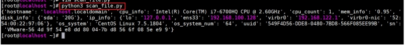 

**②cmdb编写一个接收数据的API**

路由

 

视图

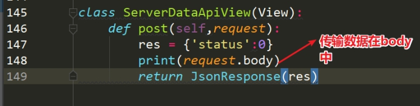 

③修改请求API的地址 scan_file.py

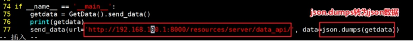 

④查看可以获取到数据

 

## 5、添加资产主机

简单修改模型

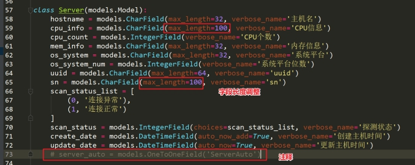 

视图

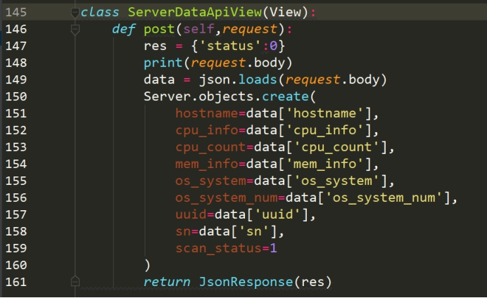 

在收集主机上执行

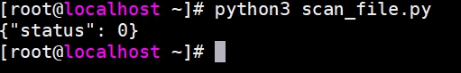 

显示效果

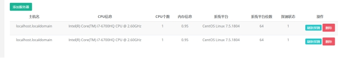 

项目这里暂时开发到目前模块。

还可以做其他功能：参考一些开源的cmdb产品 jumpserver

①主动发送检测脚本到被监控机  python sftp传输

②管理主机使用webssh  可以实现一些开源的工具  webssh（后端建立长连接）  xtemjs(前端显示命令行)

③web端的ftp

④接入监控的API 获取数据  通过highchart  echart 出监控图表

⑤CI CD